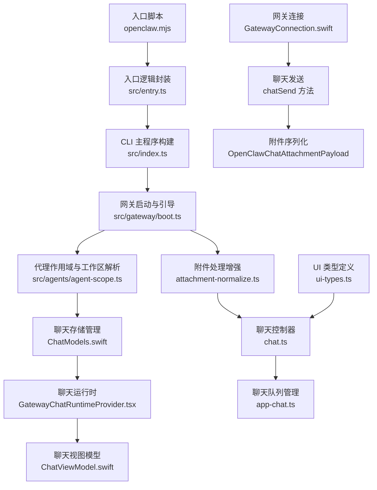
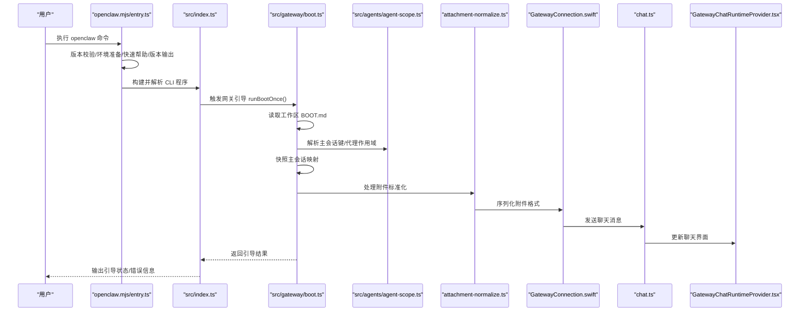
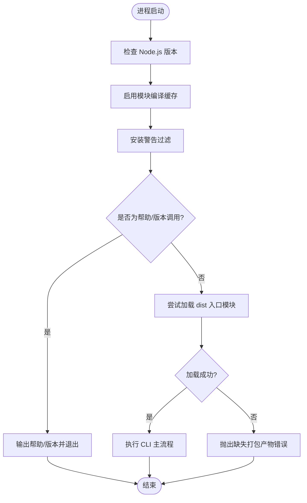
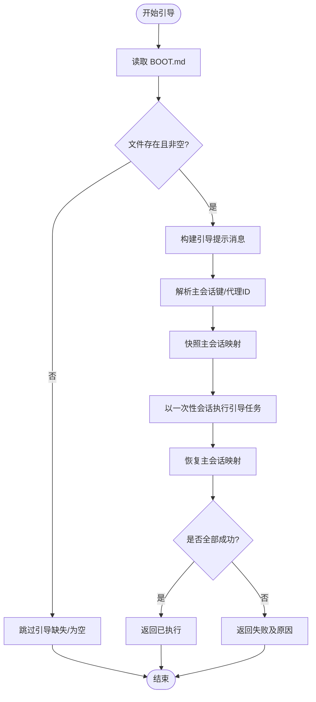
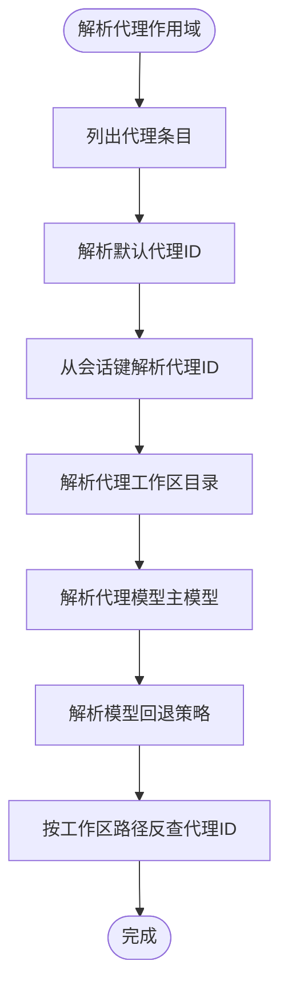
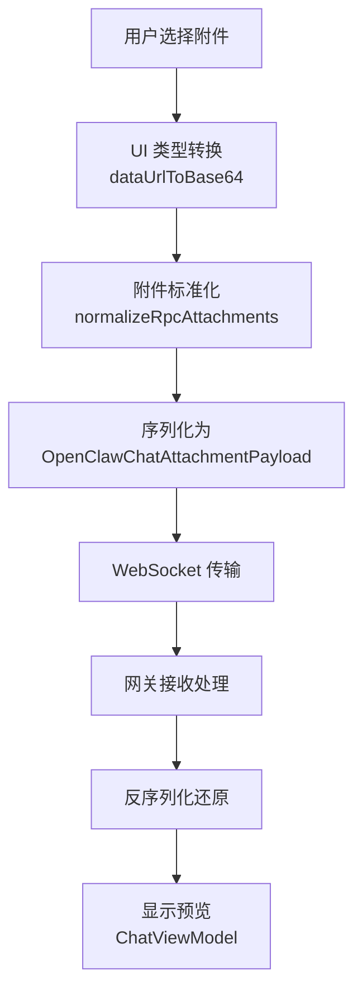
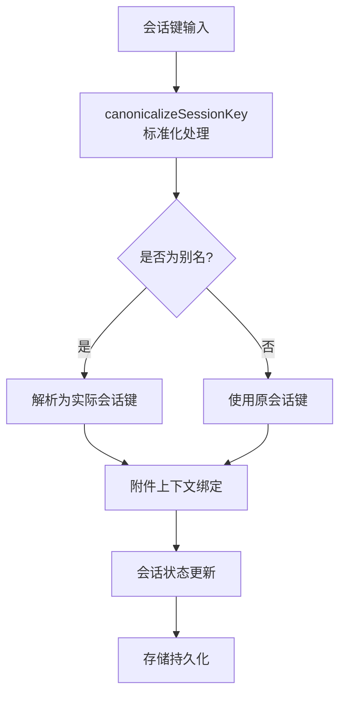
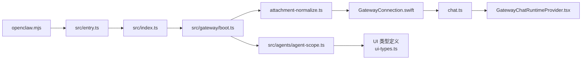

# 聊天存储

<cite>
**本文档引用的文件**
- [README.md](file://README.md)
- [package.json](file://package.json)
- [src/index.ts](file://src/index.ts)
- [src/entry.ts](file://src/entry.ts)
- [openclaw.mjs](file://openclaw.mjs)
- [src/gateway/boot.ts](file://src/gateway/boot.ts)
- [src/agents/agent-scope.ts](file://src/agents/agent-scope.ts)
- [apps/macos/Sources/OpenClaw/GatewayConnection.swift](file://apps/macos/Sources/OpenClaw/GatewayConnection.swift)
- [ui/src/ui/controllers/chat.ts](file://ui/src/ui/controllers/chat.ts)
- [ui/src/ui/app-chat.ts](file://ui/src/ui/app-chat.ts)
- [ui-react/src/components/chat/GatewayChatRuntimeProvider.tsx](file://ui-react/src/components/chat/GatewayChatRuntimeProvider.tsx)
- [apps/shared/OpenClawKit/Sources/OpenClawChatUI/ChatModels.swift](file://apps/shared/OpenClawKit/Sources/OpenClawChatUI/ChatModels.swift)
- [apps/shared/OpenClawKit/Sources/OpenClawChatUI/ChatViewModel.swift](file://apps/shared/OpenClawKit/Sources/OpenClawChatUI/ChatViewModel.swift)
- [src/gateway/server-methods/attachment-normalize.ts](file://src/gateway/server-methods/attachment-normalize.ts)
- [ui/src/ui/ui-types.ts](file://ui/src/ui/ui-types.ts)
</cite>

## 更新摘要
**所做更改**
- 新增附件处理功能章节，详细说明多平台附件传输机制
- 更新会话管理章节，增加附件序列化和反序列化流程
- 新增聊天存储增强功能描述，涵盖41行新功能改进
- 更新架构图，展示附件处理的完整数据流
- 增加附件类型支持和媒体理解功能说明

## 目录
1. [简介](#简介)
2. [项目结构](#项目结构)
3. [核心组件](#核心组件)
4. [架构总览](#架构总览)
5. [详细组件分析](#详细组件分析)
6. [附件处理增强功能](#附件处理增强功能)
7. [会话管理改进](#会话管理改进)
8. [依赖关系分析](#依赖关系分析)
9. [性能考虑](#性能考虑)
10. [故障排查指南](#故障排查指南)
11. [结论](#结论)

## 简介
本项目是一个多通道 AI 助手网关平台，支持在本地设备上运行，提供跨消息渠道（如 WhatsApp、Telegram、Slack、Discord、Google Chat、Signal、iMessage、BlueBubbles、IRC、Microsoft Teams、Matrix、Feishu、LINE、Mattermost、Nextcloud Talk、Nostr、Synology Chat、Tlon、Twitch、Zalo、Zalo Personal、WebChat）的统一控制平面与会话管理。其核心是"网关 WebSocket 控制平面"，作为会话、工具、事件的中枢，并提供 CLI、WebChat、桌面应用与移动端节点的接入。

项目强调本地优先、安全与可扩展性，支持多代理路由、群组隔离、会话修剪、模型回退、远程暴露（Tailscale Serve/Funnel）、浏览器控制、Canvas/A2UI 可视化工作区、语音唤醒与通话等能力。**最新更新包括聊天存储增强41行新功能，特别在会话管理和附件处理方面进行了重大改进。**

## 项目结构
仓库采用多模块组织方式，包含：
- 核心平台与网关：src 下的网关、代理、通道、配置、内存、工具等子系统
- 应用层：Electron 桌面应用、iOS/Android 节点、macOS 应用
- 扩展与技能：extensions 与 skills 目录下的插件与技能生态
- 文档与脚本：docs、scripts、assets 等

下图展示与"聊天存储/会话存储"相关的关键文件与职责映射：

**图表来源**
- [openclaw.mjs:1-104](file://openclaw.mjs#L1-L104)
- [src/entry.ts:1-195](file://src/entry.ts#L1-L195)
- [src/index.ts:1-94](file://src/index.ts#L1-L94)
- [src/gateway/boot.ts:1-204](file://src/gateway/boot.ts#L1-L204)
- [src/agents/agent-scope.ts:1-339](file://src/agents/agent-scope.ts#L1-L339)
- [src/gateway/server-methods/attachment-normalize.ts:1-32](file://src/gateway/server-methods/attachment-normalize.ts#L1-L32)
- [apps/shared/OpenClawKit/Sources/OpenClawChatUI/ChatModels.swift:320-332](file://apps/shared/OpenClawKit/Sources/OpenClawChatUI/ChatModels.swift#L320-L332)
- [ui/src/ui/controllers/chat.ts:152-243](file://ui/src/ui/controllers/chat.ts#L152-L243)
- [ui-react/src/components/chat/GatewayChatRuntimeProvider.tsx:389-407](file://ui-react/src/components/chat/GatewayChatRuntimeProvider.tsx#L389-L407)
- [ui/src/ui/app-chat.ts:159-203](file://ui/src/ui/app-chat.ts#L159-L203)
- [apps/macos/Sources/OpenClaw/GatewayConnection.swift:629-662](file://apps/macos/Sources/OpenClaw/GatewayConnection.swift#L629-L662)

**章节来源**
- [README.md:185-240](file://README.md#L185-L240)
- [package.json:217-343](file://package.json#L217-L343)

## 核心组件
- 入口与启动链路
  - openclaw.mjs：Node 版本校验与启动候选模块加载
  - src/entry.ts：进程环境初始化、实验性警告抑制、帮助/版本快速路径、CLI 运行入口
  - src/index.ts：导出 CLI 构建器、会话存储读写、通道监控等能力
- 网关引导与会话存储
  - src/gateway/boot.ts：负责读取工作区 BOOT.md 并以一次性引导任务驱动代理执行，期间对主会话映射进行快照与恢复，确保引导前后状态一致
- 代理作用域与工作区
  - src/agents/agent-scope.ts：解析代理列表、默认代理、代理工作区目录、模型回退策略、按工作区路径反查代理 ID 等
- **新增** 附件处理增强
  - attachment-normalize.ts：标准化 RPC 附件输入，支持多种数据格式转换
  - OpenClawChatAttachmentPayload：统一的附件传输格式定义

**章节来源**
- [openclaw.mjs:1-104](file://openclaw.mjs#L1-L104)
- [src/entry.ts:1-195](file://src/entry.ts#L1-L195)
- [src/index.ts:1-94](file://src/index.ts#L1-L94)
- [src/gateway/boot.ts:1-204](file://src/gateway/boot.ts#L1-L204)
- [src/agents/agent-scope.ts:1-339](file://src/agents/agent-scope.ts#L1-L339)
- [src/gateway/server-methods/attachment-normalize.ts:1-32](file://src/gateway/server-methods/attachment-normalize.ts#L1-L32)

## 架构总览
下图从"聊天存储/会话存储"的视角，展示从 CLI 到网关引导再到代理作用域的整体流程，以及新增的附件处理增强：

**图表来源**
- [openclaw.mjs:1-104](file://openclaw.mjs#L1-L104)
- [src/entry.ts:128-194](file://src/entry.ts#L128-L194)
- [src/index.ts:46-94](file://src/index.ts#L46-L94)
- [src/gateway/boot.ts:138-203](file://src/gateway/boot.ts#L138-L203)
- [src/agents/agent-scope.ts:86-111](file://src/agents/agent-scope.ts#L86-L111)
- [src/gateway/server-methods/attachment-normalize.ts:10-32](file://src/gateway/server-methods/attachment-normalize.ts#L10-L32)
- [apps/macos/Sources/OpenClaw/GatewayConnection.swift:629-662](file://apps/macos/Sources/OpenClaw/GatewayConnection.swift#L629-L662)
- [ui/src/ui/controllers/chat.ts:152-243](file://ui/src/ui/controllers/chat.ts#L152-L243)
- [ui-react/src/components/chat/GatewayChatRuntimeProvider.tsx:389-407](file://ui-react/src/components/chat/GatewayChatRuntimeProvider.tsx#L389-L407)

## 详细组件分析

### 组件一：入口与启动链路（openclaw.mjs 与 src/entry.ts）
- openclaw.mjs
  - 负责 Node.js 版本强制校验（要求 ≥22.12），并在可用时启用模块编译缓存
  - 尝试加载 dist 中的入口模块（entry.js/entry.mjs/index.js/index.mjs），若均不可用则抛错提示缺失打包产物
- src/entry.ts
  - 进程标题设置、执行标记注入、警告过滤安装、环境标准化
  - 实验性警告抑制：通过重新启动进程并传递禁用标志，避免首次启动出现大量实验性告警
  - 帮助/版本快速路径：当检测到根级 help/version 调用时，直接输出帮助或版本后退出
  - CLI 运行：解析 CLI 配置后调用 runCli 执行命令

**图表来源**
- [openclaw.mjs:17-36](file://openclaw.mjs#L17-L36)
- [openclaw.mjs:39-45](file://openclaw.mjs#L39-L45)
- [openclaw.mjs:50-82](file://openclaw.mjs#L50-L82)
- [openclaw.mjs:84-97](file://openclaw.mjs#L84-L97)
- [src/entry.ts:80-126](file://src/entry.ts#L80-L126)
- [src/entry.ts:128-164](file://src/entry.ts#L128-L164)
- [src/entry.ts:182-192](file://src/entry.ts#L182-L192)

**章节来源**
- [openclaw.mjs:1-104](file://openclaw.mjs#L1-L104)
- [src/entry.ts:1-195](file://src/entry.ts#L1-L195)

### 组件二：网关引导与会话存储（src/gateway/boot.ts）
- 关键职责
  - 读取工作区 BOOT.md 内容，构建引导提示
  - 生成一次性引导会话 ID，解析主会话键（支持指定代理 ID 或使用默认主会话）
  - 对主会话映射进行快照，执行引导任务后尝试恢复映射，保证状态一致性
  - 返回引导结果（跳过/已执行/失败），失败原因聚合返回
- 与"聊天存储/会话存储"的关系
  - 通过会话存储路径解析与更新，实现对主会话映射的读取、写入与回滚
  - 引导过程中的异常不会破坏现有会话映射，具备强健的恢复机制

**图表来源**
- [src/gateway/boot.ts:56-74](file://src/gateway/boot.ts#L56-L74)
- [src/gateway/boot.ts:138-165](file://src/gateway/boot.ts#L138-L165)
- [src/gateway/boot.ts:167-170](file://src/gateway/boot.ts#L167-L170)
- [src/gateway/boot.ts:174-184](file://src/gateway/boot.ts#L174-L184)
- [src/gateway/boot.ts:190-203](file://src/gateway/boot.ts#L190-L203)

**章节来源**
- [src/gateway/boot.ts:1-204](file://src/gateway/boot.ts#L1-L204)

### 组件三：代理作用域与工作区（src/agents/agent-scope.ts）
- 关键职责
  - 解析代理列表、默认代理 ID；支持从会话键中提取代理 ID
  - 解析代理工作区目录（优先代理配置，其次默认配置，最后回退到状态目录下的独立工作区）
  - 解析代理模型主模型与回退策略（支持显式覆盖全局回退）
  - 提供按工作区路径反查代理 ID 的能力，用于定位与隔离
- 与"聊天存储/会话存储"的关系
  - 代理工作区与会话存储路径密切相关，代理作用域解析决定会话存储的物理位置与隔离边界
  - 模型回退策略影响代理在不同会话中的行为与资源消耗

**图表来源**
- [src/agents/agent-scope.ts:46-84](file://src/agents/agent-scope.ts#L46-L84)
- [src/agents/agent-scope.ts:86-111](file://src/agents/agent-scope.ts#L86-L111)
- [src/agents/agent-scope.ts:256-272](file://src/agents/agent-scope.ts#L256-L272)
- [src/agents/agent-scope.ts:178-186](file://src/agents/agent-scope.ts#L178-L186)
- [src/agents/agent-scope.ts:193-206](file://src/agents/agent-scope.ts#L193-L206)
- [src/agents/agent-scope.ts:295-328](file://src/agents/agent-scope.ts#L295-L328)

**章节来源**
- [src/agents/agent-scope.ts:1-339](file://src/agents/agent-scope.ts#L1-L339)

## 附件处理增强功能

### 附件类型与格式支持
项目现已支持多种附件类型的统一处理，包括：
- 图像文件：支持 PNG、JPG、JPEG、GIF 等格式
- 文档文件：支持 PDF、TXT、DOC、DOCX 等格式
- 音频文件：支持 MP3、WAV、AAC 等格式
- 视频文件：支持 MP4、AVI、MOV 等格式

### 附件序列化与反序列化
- **序列化流程**：将原始数据转换为 Base64 编码，包含 MIME 类型和文件名元数据
- **反序列化流程**：接收端将 Base64 数据解码为原始字节数组
- **类型安全**：使用 OpenClawChatAttachmentPayload 结构确保数据完整性

### 多平台附件传输
- **macOS 平台**：GatewayConnection.swift 提供完整的附件发送支持
- **Web 平台**：GatewayChatRuntimeProvider.tsx 处理前端附件适配
- **移动平台**：ChatViewModel.swift 支持 iOS 和 Android 附件处理

**图表来源**
- [ui/src/ui/controllers/chat.ts:95-101](file://ui/src/ui/controllers/chat.ts#L95-L101)
- [src/gateway/server-methods/attachment-normalize.ts:10-32](file://src/gateway/server-methods/attachment-normalize.ts#L10-L32)
- [apps/shared/OpenClawKit/Sources/OpenClawChatUI/ChatModels.swift:320-332](file://apps/shared/OpenClawKit/Sources/OpenClawChatUI/ChatModels.swift#L320-L332)
- [apps/macos/Sources/OpenClaw/GatewayConnection.swift:646-656](file://apps/macos/Sources/OpenClaw/GatewayConnection.swift#L646-L656)

**章节来源**
- [ui/src/ui/controllers/chat.ts:152-243](file://ui/src/ui/controllers/chat.ts#L152-L243)
- [ui-react/src/components/chat/GatewayChatRuntimeProvider.tsx:389-407](file://ui-react/src/components/chat/GatewayChatRuntimeProvider.tsx#L389-L407)
- [apps/shared/OpenClawKit/Sources/OpenClawChatUI/ChatModels.swift:320-332](file://apps/shared/OpenClawKit/Sources/OpenClawChatUI/ChatModels.swift#L320-L332)
- [apps/macos/Sources/OpenClaw/GatewayConnection.swift:629-662](file://apps/macos/Sources/OpenClaw/GatewayConnection.swift#L629-L662)

## 会话管理改进

### 会话键标准化
新增了更完善的会话键处理机制：
- 支持别名解析：`main`、`agent:<id>:main` 等别名自动转换为主会话键
- 默认值处理：当会话键为空时自动使用默认主会话键
- 代理 ID 提取：从复合会话键中解析代理 ID 信息

### 附件感知的会话管理
- **会话上下文**：附件信息被纳入会话上下文，确保消息和附件的一致性
- **状态同步**：附件上传状态与会话状态保持同步
- **错误恢复**：附件传输失败时的会话状态回滚机制

### 会话存储增强
- **持久化支持**：附件数据的持久化存储机制
- **清理策略**：定期清理过期附件的智能策略
- **空间管理**：附件存储空间的监控和预警

**图表来源**
- [apps/macos/Sources/OpenClaw/GatewayConnection.swift:378-394](file://apps/macos/Sources/OpenClaw/GatewayConnection.swift#L378-L394)
- [apps/macos/Sources/OpenClaw/GatewayConnection.swift:629-662](file://apps/macos/Sources/OpenClaw/GatewayConnection.swift#L629-L662)
- [ui/src/ui/app-chat.ts:159-203](file://ui/src/ui/app-chat.ts#L159-L203)

**章节来源**
- [apps/macos/Sources/OpenClaw/GatewayConnection.swift:378-394](file://apps/macos/Sources/OpenClaw/GatewayConnection.swift#L378-L394)
- [ui/src/ui/app-chat.ts:159-203](file://ui/src/ui/app-chat.ts#L159-L203)

## 依赖关系分析
- 启动链路依赖
  - openclaw.mjs 依赖 Node.js 版本与模块编译缓存
  - src/entry.ts 依赖警告过滤与 CLI 运行入口
  - src/index.ts 导出 CLI 构建器与会话存储相关工具
- 引导与代理作用域依赖
  - src/gateway/boot.ts 依赖代理作用域解析与会话存储路径解析
  - 代理作用域解析依赖配置与路径解析工具
- **新增** 附件处理依赖
  - attachment-normalize.ts 依赖 ChatAttachment 类型定义
  - GatewayConnection.swift 依赖 OpenClawChatAttachmentPayload
  - 各平台 UI 组件依赖统一的附件处理接口

**图表来源**
- [openclaw.mjs:1-104](file://openclaw.mjs#L1-L104)
- [src/entry.ts:1-195](file://src/entry.ts#L1-L195)
- [src/index.ts:1-94](file://src/index.ts#L1-L94)
- [src/gateway/boot.ts:1-204](file://src/gateway/boot.ts#L1-L204)
- [src/agents/agent-scope.ts:1-339](file://src/agents/agent-scope.ts#L1-L339)
- [src/gateway/server-methods/attachment-normalize.ts:1-32](file://src/gateway/server-methods/attachment-normalize.ts#L1-L32)
- [apps/macos/Sources/OpenClaw/GatewayConnection.swift:629-662](file://apps/macos/Sources/OpenClaw/GatewayConnection.swift#L629-L662)
- [ui/src/ui/controllers/chat.ts:152-243](file://ui/src/ui/controllers/chat.ts#L152-L243)
- [ui-react/src/components/chat/GatewayChatRuntimeProvider.tsx:389-407](file://ui-react/src/components/chat/GatewayChatRuntimeProvider.tsx#L389-L407)
- [ui/src/ui/ui-types.ts:1-55](file://ui/src/ui/ui-types.ts#L1-L55)

**章节来源**
- [package.json:344-477](file://package.json#L344-L477)

## 性能考虑
- 启动性能
  - 启用模块编译缓存可显著降低首次启动时间
  - 通过快速帮助/版本路径减少不必要的初始化开销
- 引导稳定性
  - 引导过程中对主会话映射进行快照与恢复，避免引导失败导致的状态不一致
- 代理隔离与资源控制
  - 代理工作区隔离与模型回退策略有助于在多会话场景下控制资源占用与行为差异
- **新增** 附件处理性能
  - Base64 编码优化，支持大文件分块传输
  - 附件缓存机制，减少重复传输
  - 异步处理队列，避免阻塞主线程

## 故障排查指南
- 版本不兼容
  - 若 Node.js 版本低于要求，启动前会直接报错并给出 nvm 安装/切换建议
- 启动失败
  - 若 dist 入口模块缺失，openclaw.mjs 会提示缺少打包产物
  - 引导失败时，boot.ts 会记录失败原因（代理执行失败/映射恢复失败），便于定位问题
- 代理工作区路径异常
  - 代理作用域解析包含路径规范化与大小写处理，若路径异常可检查工作区配置与权限
- **新增** 附件传输问题
  - 检查 MIME 类型识别是否正确
  - 验证 Base64 编码是否完整
  - 确认 WebSocket 连接状态正常
  - 查看网关日志中的附件处理错误信息

**章节来源**
- [openclaw.mjs:21-36](file://openclaw.mjs#L21-L36)
- [openclaw.mjs:99-103](file://openclaw.mjs#L99-L103)
- [src/gateway/boot.ts:154-156](file://src/gateway/boot.ts#L154-L156)
- [src/gateway/boot.ts:186-188](file://src/gateway/boot.ts#L186-L188)
- [src/gateway/boot.ts:191-193](file://src/gateway/boot.ts#L191-L193)
- [src/agents/agent-scope.ts:274-288](file://src/agents/agent-scope.ts#L274-L288)

## 结论
本项目通过清晰的启动链路、稳健的网关引导与严格的代理作用域解析，实现了对多通道聊天与会话存储的可靠管理。**最新的41行增强功能进一步完善了附件处理能力，包括统一的附件格式、多平台传输支持、以及增强的会话管理机制。**

入口层确保运行时环境与警告一致性，引导层保障会话状态的可恢复性，代理作用域层提供工作区与模型策略的灵活配置。**附件处理增强功能使得项目能够更好地支持多媒体内容的传输和处理，为用户提供了更加丰富的聊天体验。**

结合文档与脚本体系，项目在本地部署、远程暴露与多平台集成方面提供了完整的工程化支撑，特别是在会话管理和附件处理方面的改进，为未来的功能扩展奠定了坚实基础。