# 状态管理架构改进

<cite>
**本文档引用的文件**
- [runtime.ts](file://src/runtime.ts)
- [globals.ts](file://src/globals.ts)
- [context-engine/index.ts](file://src/context-engine/index.ts)
- [context-engine/types.ts](file://src/context-engine/types.ts)
- [context-engine/registry.ts](file://src/context-engine/registry.ts)
- [context-engine/init.ts](file://src/context-engine/init.ts)
- [config/sessions/store-cache.ts](file://src/config/sessions/store-cache.ts)
- [config/sessions/types.ts](file://src/config/sessions/types.ts)
- [memory/index.ts](file://src/memory/index.ts)
- [memory/types.ts](file://src/memory/types.ts)
- [memory/temporal-decay.ts](file://src/memory/temporal-decay.ts)
- [tui/tui.ts](file://src/tui/tui.ts)
</cite>

## 目录
1. [简介](#简介)
2. [项目结构](#项目结构)
3. [核心组件](#核心组件)
4. [架构概览](#架构概览)
5. [详细组件分析](#详细组件分析)
6. [依赖关系分析](#依赖关系分析)
7. [性能考虑](#性能考虑)
8. [故障排除指南](#故障排除指南)
9. [结论](#结论)

## 简介

本文档深入分析了OpenClaw项目的状态管理架构改进。该项目是一个复杂的多平台AI代理系统，需要处理会话状态、上下文引擎、内存管理和用户界面状态等多重状态管理需求。通过对核心状态管理组件的详细分析，我们将展示如何构建一个可扩展、高性能且易于维护的状态管理系统。

## 项目结构

OpenClaw项目采用模块化架构设计，状态管理相关的组件分布在多个关键目录中：

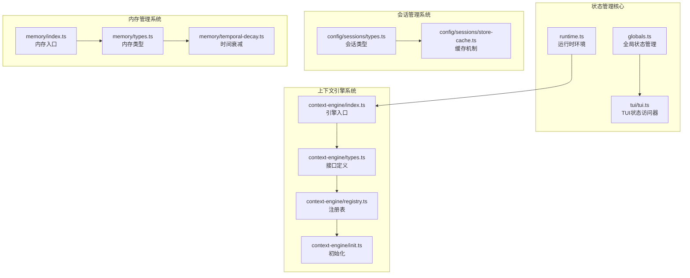

**图表来源**
- [runtime.ts:1-54](file://src/runtime.ts#L1-L54)
- [context-engine/index.ts:1-20](file://src/context-engine/index.ts#L1-L20)
- [config/sessions/types.ts:1-380](file://src/config/sessions/types.ts#L1-L380)

**章节来源**
- [runtime.ts:1-54](file://src/runtime.ts#L1-L54)
- [globals.ts:1-53](file://src/globals.ts#L1-L53)
- [context-engine/index.ts:1-20](file://src/context-engine/index.ts#L1-L20)

## 核心组件

### 运行时环境管理

运行时环境是整个状态管理系统的基础，提供了统一的日志记录和错误处理机制：

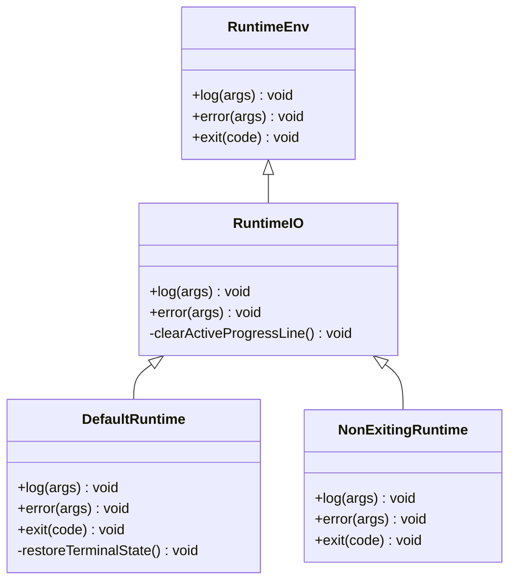

**图表来源**
- [runtime.ts:4-54](file://src/runtime.ts#L4-L54)

### 全局状态管理

全局状态管理提供了应用级别的状态控制，包括调试模式和用户交互选项：

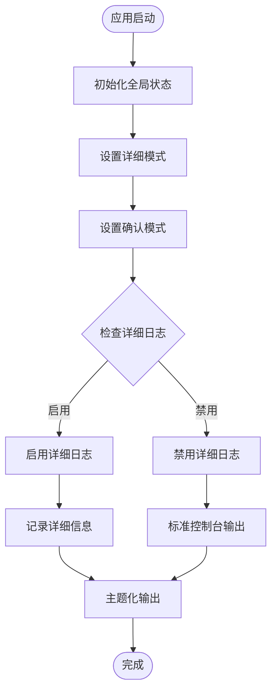

**图表来源**
- [globals.ts:1-53](file://src/globals.ts#L1-L53)

**章节来源**
- [runtime.ts:1-54](file://src/runtime.ts#L1-L54)
- [globals.ts:1-53](file://src/globals.ts#L1-L53)

## 架构概览

OpenClaw的状态管理架构采用了分层设计，从底层的运行时环境到顶层的用户界面，形成了完整的状态管理链路：

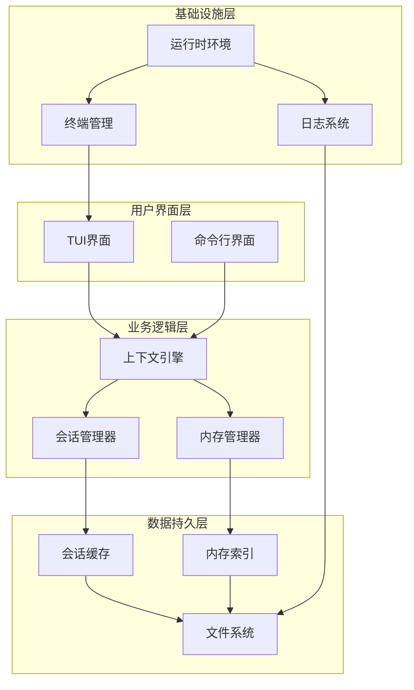

**图表来源**
- [context-engine/types.ts:68-169](file://src/context-engine/types.ts#L68-L169)
- [config/sessions/store-cache.ts:1-81](file://src/config/sessions/store-cache.ts#L1-L81)
- [memory/types.ts:61-81](file://src/memory/types.ts#L61-L81)

## 详细组件分析

### 上下文引擎系统

上下文引擎系统是OpenClaw状态管理的核心，提供了可插拔的上下文管理能力：

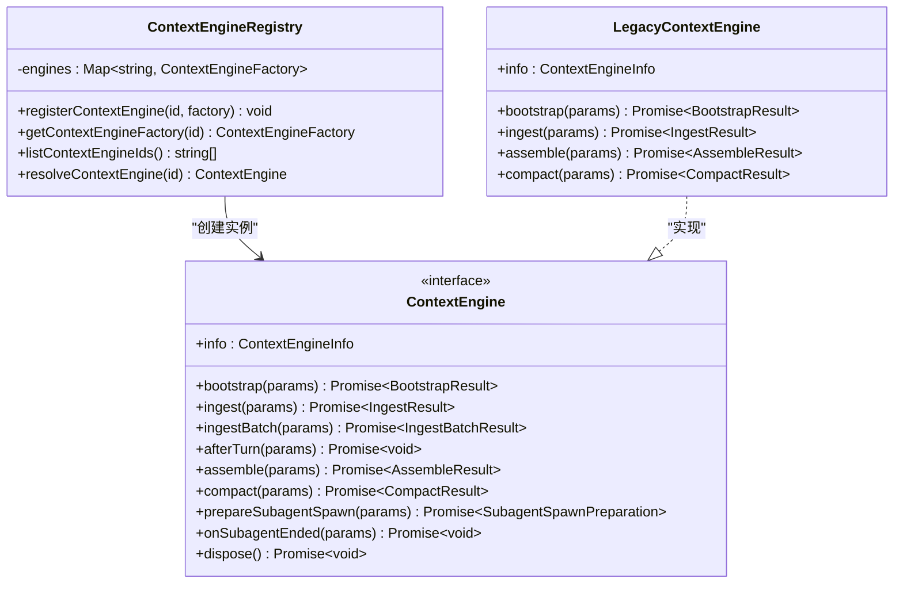

**图表来源**
- [context-engine/types.ts:68-169](file://src/context-engine/types.ts#L68-L169)
- [context-engine/registry.ts:15-33](file://src/context-engine/registry.ts#L15-L33)
- [context-engine/index.ts:17-17](file://src/context-engine/index.ts#L17-L17)

#### 引擎生命周期管理

上下文引擎的生命周期管理确保了状态的一致性和可靠性：

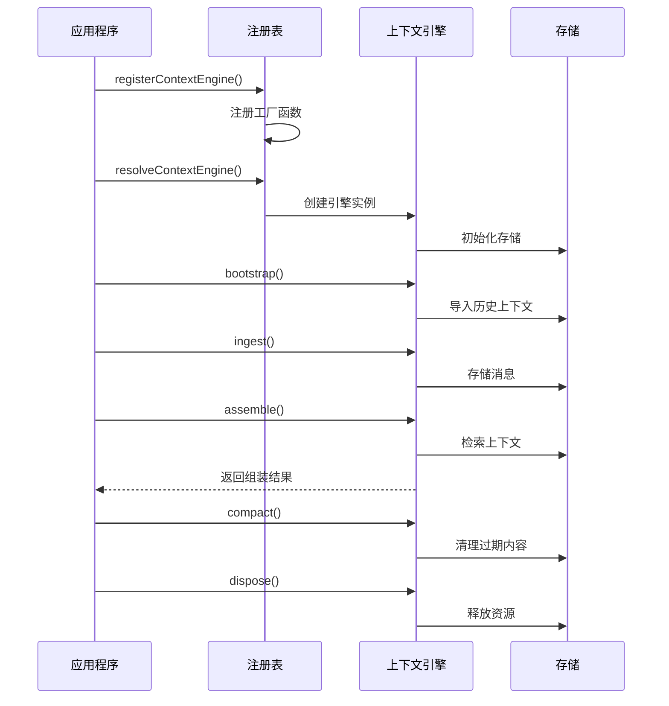

**图表来源**
- [context-engine/types.ts:74-116](file://src/context-engine/types.ts#L74-L116)
- [context-engine/init.ts:15-23](file://src/context-engine/init.ts#L15-L23)

**章节来源**
- [context-engine/types.ts:1-169](file://src/context-engine/types.ts#L1-L169)
- [context-engine/registry.ts:1-33](file://src/context-engine/registry.ts#L1-L33)
- [context-engine/init.ts:1-23](file://src/context-engine/init.ts#L1-L23)

### 会话状态管理系统

会话状态管理系统负责管理用户会话的各种状态信息：

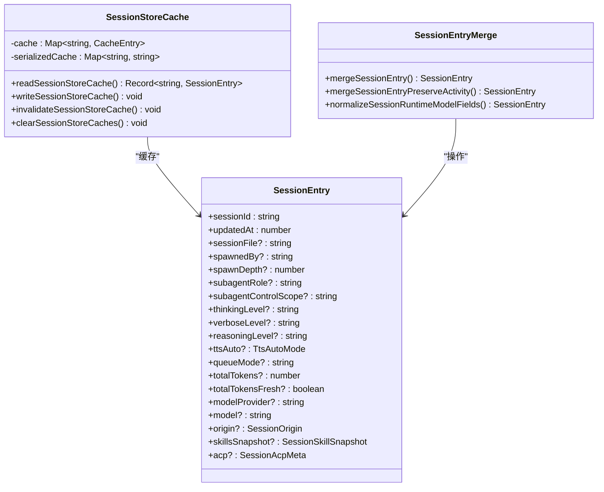

**图表来源**
- [config/sessions/types.ts:68-171](file://src/config/sessions/types.ts#L68-L171)
- [config/sessions/store-cache.ts:3-81](file://src/config/sessions/store-cache.ts#L3-L81)

#### 会话状态缓存机制

会话状态缓存机制通过内存缓存和序列化缓存双重保障，提高了状态读取性能：

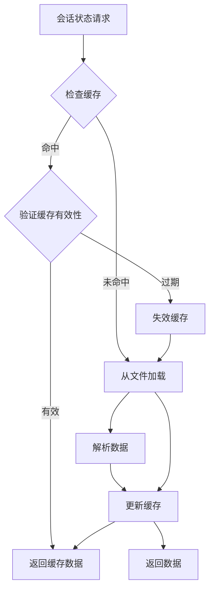

**图表来源**
- [config/sessions/store-cache.ts:41-81](file://src/config/sessions/store-cache.ts#L41-L81)

**章节来源**
- [config/sessions/types.ts:1-380](file://src/config/sessions/types.ts#L1-L380)
- [config/sessions/store-cache.ts:1-81](file://src/config/sessions/store-cache.ts#L1-L81)

### 内存状态管理系统

内存状态管理系统提供了基于时间衰减的记忆检索功能：

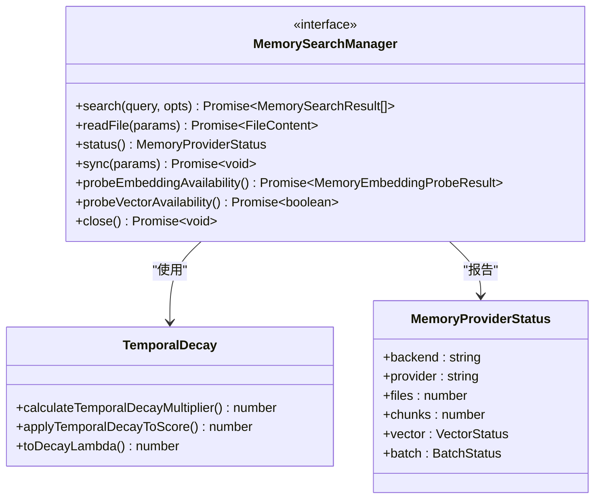

**图表来源**
- [memory/types.ts:61-81](file://src/memory/types.ts#L61-L81)
- [memory/temporal-decay.ts:4-49](file://src/memory/temporal-decay.ts#L4-L49)

#### 时间衰减算法

时间衰减算法确保了记忆检索的相关性，避免过时信息影响决策质量：

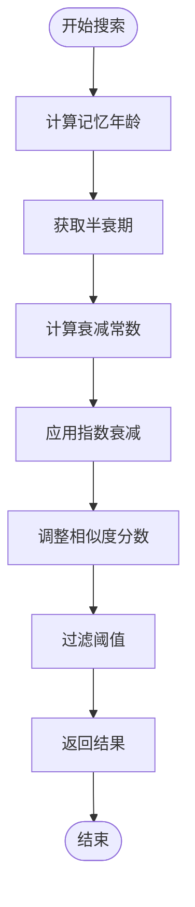

**图表来源**
- [memory/temporal-decay.ts:17-42](file://src/memory/temporal-decay.ts#L17-L42)

**章节来源**
- [memory/index.ts:1-12](file://src/memory/index.ts#L1-L12)
- [memory/types.ts:1-81](file://src/memory/types.ts#L1-L81)
- [memory/temporal-decay.ts:1-49](file://src/memory/temporal-decay.ts#L1-L49)

### 用户界面状态管理

TUI（文本用户界面）状态管理提供了集中式的界面状态访问：

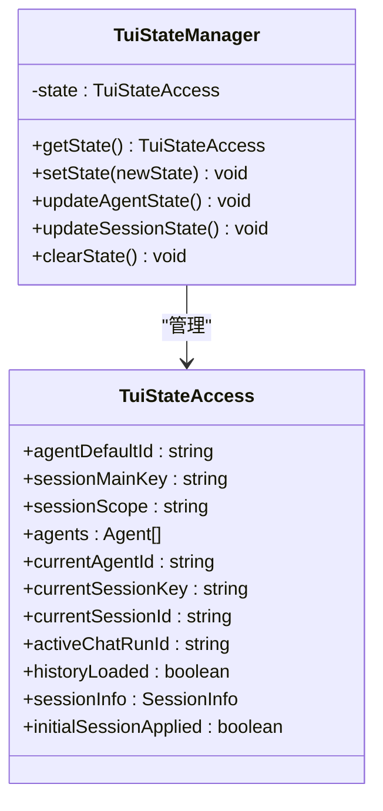

**图表来源**
- [tui/tui.ts:361-422](file://src/tui/tui.ts#L361-L422)

**章节来源**
- [tui/tui.ts:361-422](file://src/tui/tui.ts#L361-L422)

## 依赖关系分析

OpenClaw状态管理系统的依赖关系呈现清晰的层次结构：

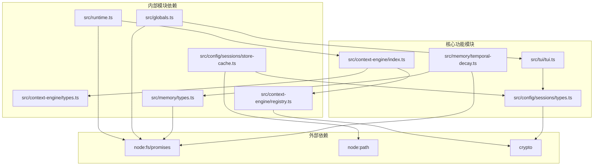

**图表来源**
- [runtime.ts:1-54](file://src/runtime.ts#L1-L54)
- [context-engine/index.ts:1-20](file://src/context-engine/index.ts#L1-L20)
- [config/sessions/store-cache.ts:1-81](file://src/config/sessions/store-cache.ts#L1-L81)

**章节来源**
- [runtime.ts:1-54](file://src/runtime.ts#L1-L54)
- [context-engine/index.ts:1-20](file://src/context-engine/index.ts#L1-L20)
- [config/sessions/store-cache.ts:1-81](file://src/config/sessions/store-cache.ts#L1-L81)

## 性能考虑

### 缓存策略优化

OpenClaw实现了多层次的缓存策略来提升状态管理性能：

1. **会话存储缓存**：使用内存缓存和序列化缓存双重机制
2. **时间戳验证**：通过mtimeMs和sizeBytes确保缓存一致性
3. **结构化克隆**：避免共享状态导致的数据竞争

### 并发安全设计

系统采用了多种并发安全机制：

- **原子操作**：会话状态更新使用原子写入
- **竞态条件防护**：通过文件锁和版本号防止竞态
- **事务处理**：重要状态变更在事务中执行

### 内存管理优化

- **懒加载**：非必要的状态按需加载
- **垃圾回收**：及时清理不再使用的状态引用
- **内存池**：复用频繁分配的对象

## 故障排除指南

### 常见问题诊断

1. **状态不一致问题**
   - 检查缓存失效机制是否正常工作
   - 验证文件系统权限设置
   - 确认并发访问控制

2. **性能问题**
   - 分析缓存命中率
   - 监控磁盘I/O等待时间
   - 检查内存使用情况

3. **崩溃恢复**
   - 实现状态快照机制
   - 建立异常处理流程
   - 设计优雅降级策略

### 调试工具

系统提供了丰富的调试工具来帮助诊断状态管理问题：

- **状态监控**：实时查看各组件状态
- **日志分析**：详细的执行轨迹记录
- **性能分析**：关键路径的性能指标

**章节来源**
- [runtime.ts:10-54](file://src/runtime.ts#L10-L54)
- [globals.ts:15-32](file://src/globals.ts#L15-L32)

## 结论

OpenClaw的状态管理架构通过模块化设计、分层抽象和优化的缓存策略，成功构建了一个可扩展、高性能且易于维护的状态管理系统。该架构的主要优势包括：

1. **模块化设计**：清晰的职责分离使得各个组件可以独立开发和测试
2. **可插拔架构**：上下文引擎的可插拔设计支持不同的状态管理策略
3. **性能优化**：多层次缓存和并发安全机制确保了系统的高性能
4. **可维护性**：标准化的接口和完善的错误处理机制便于长期维护

通过持续的架构改进和性能优化，OpenClaw的状态管理系统为复杂的AI代理应用提供了坚实的基础，为未来的功能扩展和技术演进奠定了良好的基础。