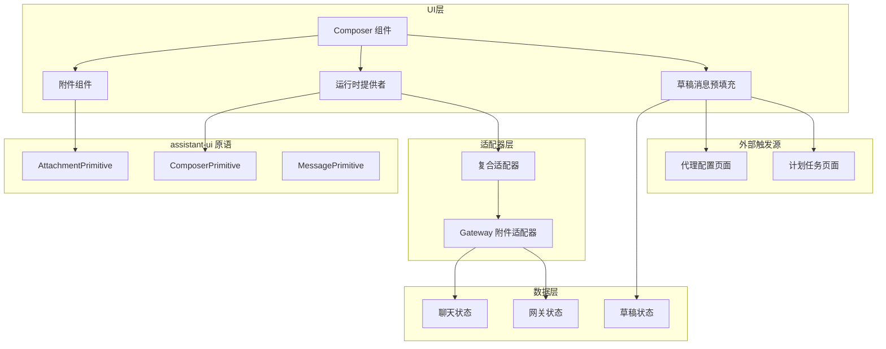
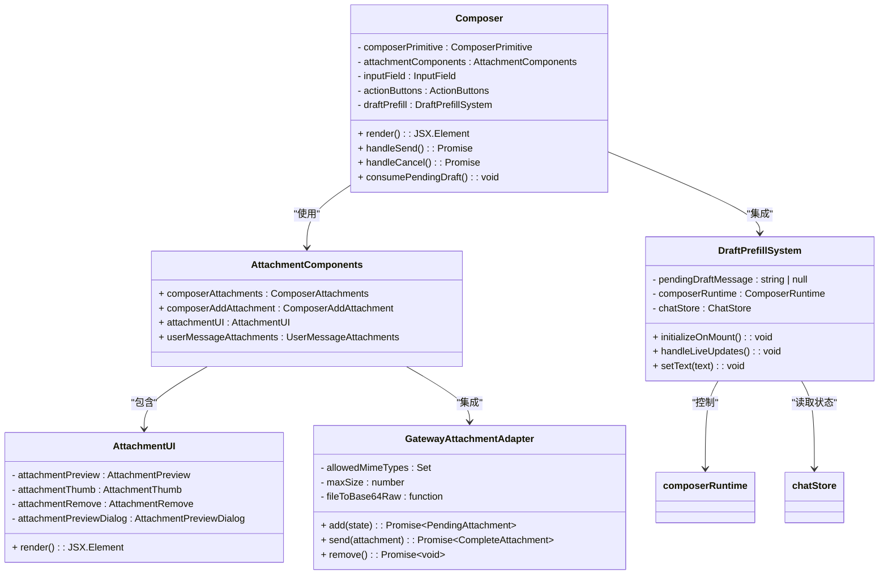
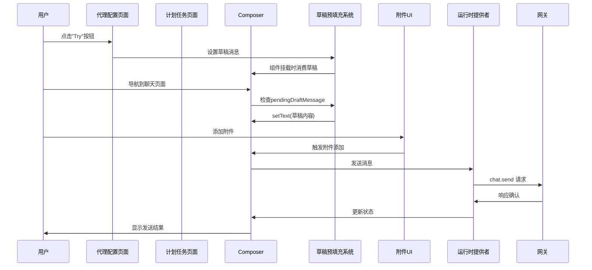
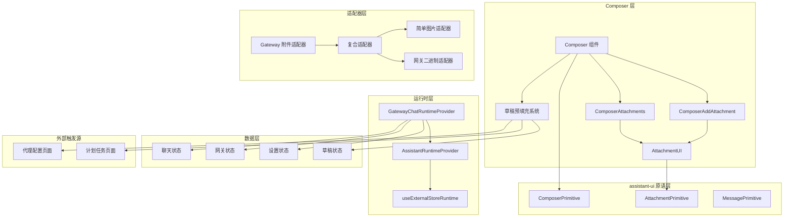
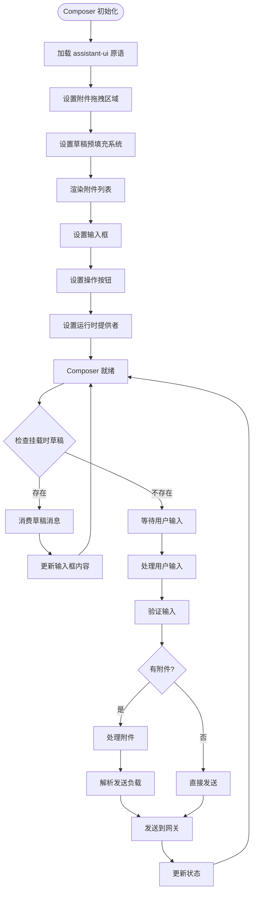
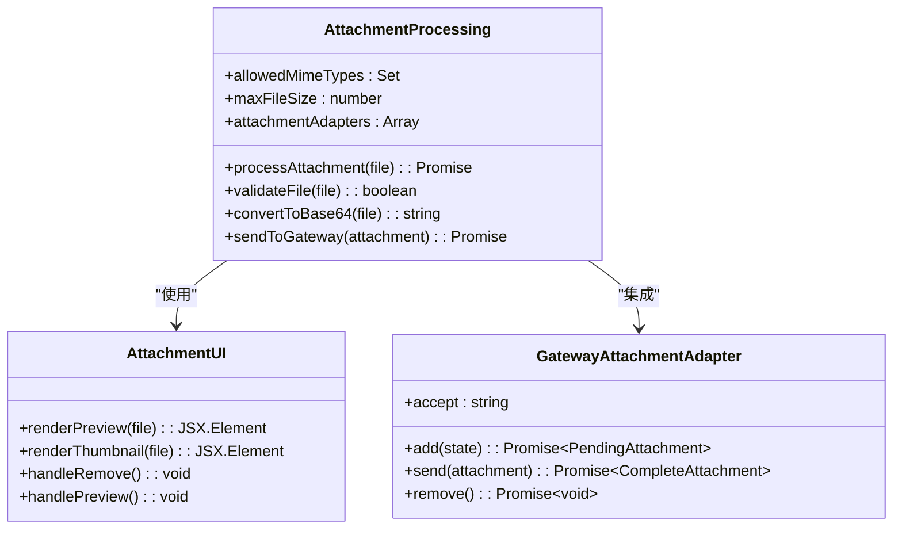
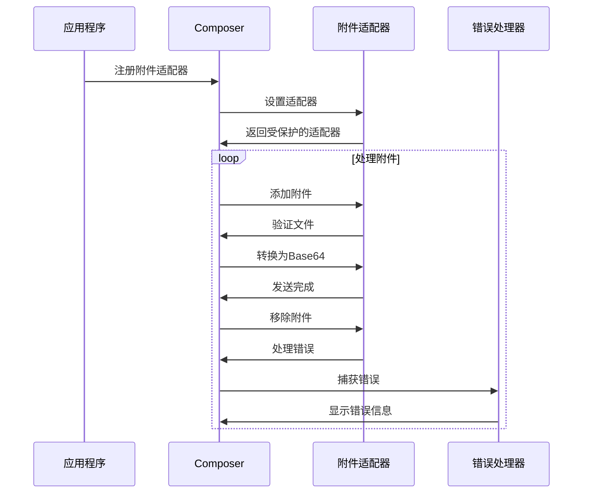
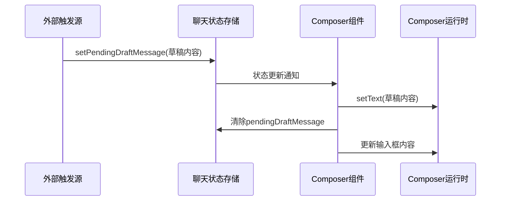
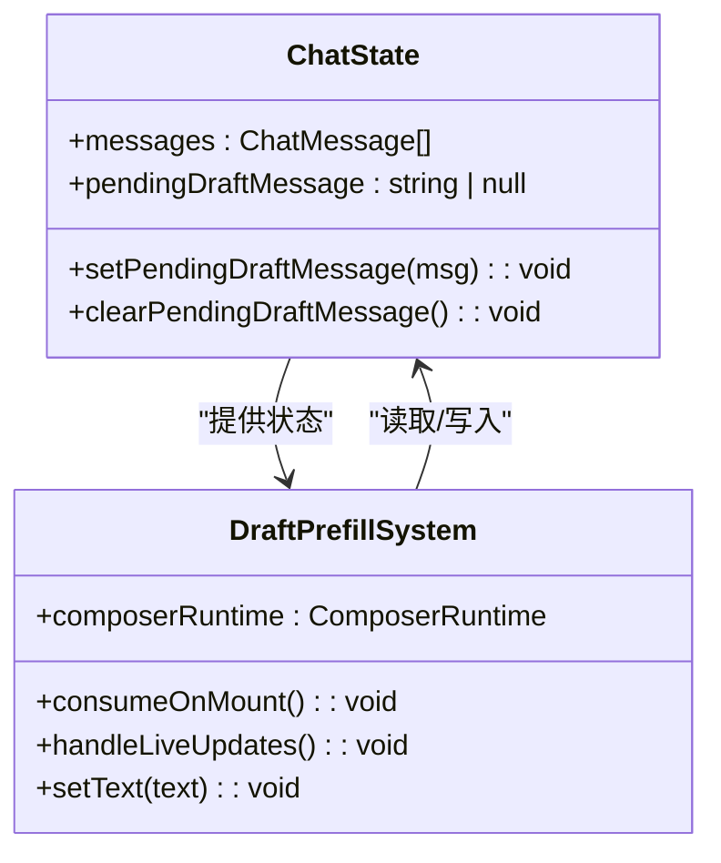

# Composer 组件

<cite>
**本文档引用的文件**
- [Composer.tsx](file://ui-react/src/components/chat/Composer.tsx)
- [attachment.tsx](file://ui-react/src/components/assistant-ui/attachment.tsx)
- [gateway-attachment-adapter.ts](file://ui-react/src/components/chat/gateway-attachment-adapter.ts)
- [GatewayChatRuntimeProvider.tsx](file://ui-react/src/components/chat/GatewayChatRuntimeProvider.tsx)
- [package.json](file://ui-react/package.json)
- [attachment-normalize.ts](file://src/gateway/server-methods/attachment-normalize.ts)
- [chat.store.ts](file://ui-react/src/store/chat.store.ts)
- [ScheduledTasksPage.tsx](file://ui-react/src/pages/ScheduledTasksPage.tsx)
- [profile.tsx](file://ui-react/src/components/agents/profile.tsx)
</cite>

## 更新摘要
**变更内容**
- Composer组件已简化为使用新的assistant-ui附件原语
- 复杂文件上传逻辑替换为ComposerAttachments和ComposerAddAttachment组件
- 引入了GatewayChatRuntimeProvider作为运行时提供者
- 新增了GatewayAttachmentAdapter适配器支持多类型文件上传
- **新增草稿消息预填充功能**：支持从代理配置页面和计划任务页面自动预填充聊天输入框
- **增强用户体验**：通过预填充功能减少用户输入工作量，提升聊天效率

## 目录
1. [简介](#简介)
2. [项目结构](#项目结构)
3. [核心组件](#核心组件)
4. [架构概览](#架构概览)
5. [详细组件分析](#详细组件分析)
6. [草稿消息预填充功能](#草稿消息预填充功能)
7. [依赖关系分析](#依赖关系分析)
8. [性能考虑](#性能考虑)
9. [故障排除指南](#故障排除指南)
10. [结论](#结论)

## 简介

Composer 组件是 OpenClaw 项目中的核心聊天输入组件，基于 @assistant-ui/react 框架构建。它提供了一个现代化的聊天界面，支持文本输入、附件上传和实时交互功能。该组件实现了基于assistant-ui原语的简化架构，替代了之前的复杂grammY中间件系统。

在 OpenClaw 中，Composer 组件主要负责：
- 提供现代化的聊天输入界面
- 管理附件的添加、预览和移除
- 处理用户消息的发送和取消操作
- 集成GatewayChatRuntimeProvider进行实时通信
- 支持拖拽上传和文件类型验证
- **新增草稿消息预填充功能**：自动预填充聊天输入框内容，提升用户体验

## 项目结构

OpenClaw 项目采用现代化的React架构，Composer组件位于UI层的核心位置：



**图表来源**
- [Composer.tsx:16-86](file://ui-react/src/components/chat/Composer.tsx#L16-L86)
- [attachment.tsx:197-222](file://ui-react/src/components/assistant-ui/attachment.tsx#L197-L222)
- [GatewayChatRuntimeProvider.tsx:476-489](file://ui-react/src/components/chat/GatewayChatRuntimeProvider.tsx#L476-L489)
- [chat.store.ts:161-165](file://ui-react/src/store/chat.store.ts#L161-L165)

**章节来源**
- [Composer.tsx:1-115](file://ui-react/src/components/chat/Composer.tsx#L1-L115)
- [attachment.tsx:1-223](file://ui-react/src/components/assistant-ui/attachment.tsx#L1-L223)

## 核心组件

### Composer 组件架构

Composer 是基于assistant-ui原语构建的现代化聊天输入组件：



**图表来源**
- [Composer.tsx:16-115](file://ui-react/src/components/chat/Composer.tsx#L16-L115)
- [attachment.tsx:126-185](file://ui-react/src/components/assistant-ui/attachment.tsx#L126-L185)
- [gateway-attachment-adapter.ts:58-98](file://ui-react/src/components/chat/gateway-attachment-adapter.ts#L58-L98)
- [chat.store.ts:161-180](file://ui-react/src/store/chat.store.ts#L161-L180)

### 中间件处理流程



**图表来源**
- [Composer.tsx:20-44](file://ui-react/src/components/chat/Composer.tsx#L20-L44)
- [profile.tsx:407-439](file://ui-react/src/components/agents/profile.tsx#L407-L439)
- [ScheduledTasksPage.tsx:116-127](file://ui-react/src/pages/ScheduledTasksPage.tsx#L116-L127)

**章节来源**
- [Composer.tsx:1-115](file://ui-react/src/components/chat/Composer.tsx#L1-L115)
- [attachment.tsx:1-223](file://ui-react/src/components/assistant-ui/attachment.tsx#L1-L223)

## 架构概览

OpenClaw 的 Composer 组件采用现代化的React + assistant-ui架构设计：



**图表来源**
- [Composer.tsx:1-115](file://ui-react/src/components/chat/Composer.tsx#L1-L115)
- [attachment.tsx:197-222](file://ui-react/src/components/assistant-ui/attachment.tsx#L197-L222)
- [GatewayChatRuntimeProvider.tsx:476-489](file://ui-react/src/components/chat/GatewayChatRuntimeProvider.tsx#L476-L489)
- [chat.store.ts:161-180](file://ui-react/src/store/chat.store.ts#L161-L180)

## 详细组件分析

### 现代化 Composer 实现

OpenClaw 将Composer组件重构为基于assistant-ui原语的现代化实现：



**图表来源**
- [Composer.tsx:16-115](file://ui-react/src/components/chat/Composer.tsx#L16-L115)
- [GatewayChatRuntimeProvider.tsx:359-407](file://ui-react/src/components/chat/GatewayChatRuntimeProvider.tsx#L359-L407)

### 附件处理机制

Composer 组件实现了完整的附件处理流程：



**图表来源**
- [gateway-attachment-adapter.ts:58-98](file://ui-react/src/components/chat/gateway-attachment-adapter.ts#L58-L98)
- [attachment.tsx:126-185](file://ui-react/src/components/assistant-ui/attachment.tsx#L126-L185)

### 错误处理机制

Composer 组件提供了完善的错误处理和边界管理：



**图表来源**
- [gateway-attachment-adapter.ts:63-68](file://ui-react/src/components/chat/gateway-attachment-adapter.ts#L63-L68)
- [attachment.tsx:173-185](file://ui-react/src/components/assistant-ui/attachment.tsx#L173-L185)

**章节来源**
- [Composer.tsx:1-115](file://ui-react/src/components/chat/Composer.tsx#L1-L115)
- [gateway-attachment-adapter.ts:1-106](file://ui-react/src/components/chat/gateway-attachment-adapter.ts#L1-L106)

### 性能优化策略

Composer 组件采用了多种性能优化策略：

1. **懒加载组件**: 使用React.lazy和Suspense优化初始加载
2. **状态管理**: 基于Zustand的状态管理减少不必要的重渲染
3. **文件预览**: 使用URL.createObjectURL优化大文件预览
4. **内存管理**: 合理的事件监听器清理和对象URL释放
5. **草稿消息缓存**: 一次性消费机制避免重复预填充

**章节来源**
- [attachment.tsx:28-46](file://ui-react/src/components/assistant-ui/attachment.tsx#L28-L46)
- [GatewayChatRuntimeProvider.tsx:245-490](file://ui-react/src/components/chat/GatewayChatRuntimeProvider.tsx#L245-L490)

## 草稿消息预填充功能

### 功能概述

**新增** Composer 组件现在集成了草稿消息预填充功能，显著提升了用户的聊天体验。该功能允许从其他页面（如代理配置页面和计划任务页面）向聊天输入框自动预填充内容，减少用户的手动输入工作量。

### 核心特性

1. **一次性消费机制**：草稿消息只在组件首次挂载时消费一次，然后自动清除
2. **实时监听**：即使Composer组件已经挂载，也能监听到新设置的草稿消息
3. **无缝集成**：与assistant-ui的ComposerPrimitive完美集成
4. **状态管理**：通过Zustand状态管理确保草稿消息的正确传递

### 实现机制



**图表来源**
- [Composer.tsx:20-44](file://ui-react/src/components/chat/Composer.tsx#L20-L44)
- [chat.store.ts:161-180](file://ui-react/src/store/chat.store.ts#L161-L180)

### 触发场景

#### 代理配置页面触发

用户在代理配置页面点击"Try"按钮时，系统会自动预填充聊天输入框：

```mermaid
flowchart TD
UserClick[用户点击"Try"按钮] --> ExtractText[提取尝试文本]
ExtractText --> SetDraft[设置草稿消息]
SetDraft --> NavigateToChat[导航到聊天页面]
NavigateToChat --> ComposerMount[Composer组件挂载]
ComposerMount --> ConsumeDraft[消费草稿消息]
ConsumeDraft --> AutoFill[自动填充输入框]
AutoFill --> Ready[准备就绪]
```

**图表来源**
- [profile.tsx:407-439](file://ui-react/src/components/agents/profile.tsx#L407-L439)
- [Composer.tsx:20-44](file://ui-react/src/components/chat/Composer.tsx#L20-L44)

#### 计划任务页面触发

用户在计划任务页面点击"Create With Chat"按钮时，系统会预填充帮助用户描述任务的内容：

```mermaid
flowchart TD
TaskButtonClick[用户点击"Create With Chat"] --> GeneratePrompt[生成任务描述提示]
GeneratePrompt --> SetDraftMessage[设置草稿消息]
SetDraftMessage --> CreateSession[创建新会话]
CreateSession --> NavigateToChat[导航到聊天页面]
NavigateToChat --> ComposerMount[Composer组件挂载]
ComposerMount --> ConsumeDraft[消费草稿消息]
ConsumeDraft --> AutoFill[自动填充输入框]
AutoFill --> Ready[准备就绪]
```

**图表来源**
- [ScheduledTasksPage.tsx:116-127](file://ui-react/src/pages/ScheduledTasksPage.tsx#L116-L127)
- [Composer.tsx:20-44](file://ui-react/src/components/chat/Composer.tsx#L20-L44)

### 状态管理

草稿消息预填充功能通过专门的状态管理实现：



**图表来源**
- [chat.store.ts:161-180](file://ui-react/src/store/chat.store.ts#L161-L180)
- [Composer.tsx:20-44](file://ui-react/src/components/chat/Composer.tsx#L20-L44)

**章节来源**
- [Composer.tsx:1-115](file://ui-react/src/components/chat/Composer.tsx#L1-L115)
- [chat.store.ts:161-180](file://ui-react/src/store/chat.store.ts#L161-L180)
- [profile.tsx:407-439](file://ui-react/src/components/agents/profile.tsx#L407-L439)
- [ScheduledTasksPage.tsx:116-127](file://ui-react/src/pages/ScheduledTasksPage.tsx#L116-L127)

## 依赖关系分析

Composer 组件在整个系统中的依赖关系如下：

```mermaid
graph LR
subgraph "外部依赖"
AssistantUI[@assistant-ui/react ^0.12.24]
React[React ^19.0.0]
LucideReact[Lucide React ^0.469.0]
RadixUI[Radix UI ^1.1.6]
Zustand[Zustand ^5.0.3]
TailwindCSS[Tailwind CSS ^4.1.0]
end
subgraph "内部模块"
Composer[Composer 组件]
Attachment[附件组件]
RuntimeProvider[运行时提供者]
Adapter[适配器]
Store[状态管理]
DraftPrefill[草稿预填充系统]
end
subgraph "配置模块"
PackageJSON[package.json]
Theme[主题配置]
Utils[工具函数]
end
subgraph "外部触发源"
AgentProfile[代理配置页面]
ScheduledTasks[计划任务页面]
end
AssistantUI --> Composer
React --> Composer
LucideReact --> Composer
RadixUI --> Attachment
Zustand --> Store
TailwindCSS --> Theme
Composer --> Attachment
Composer --> RuntimeProvider
Composer --> DraftPrefill
Attachment --> Adapter
RuntimeProvider --> Store
DraftPrefill --> Store
AgentProfile --> DraftPrefill
ScheduledTasks --> DraftPrefill
PackageJSON --> AssistantUI
Theme --> TailwindCSS
Utils --> Composer
```

**图表来源**
- [package.json:11-54](file://ui-react/package.json#L11-L54)
- [Composer.tsx:1-115](file://ui-react/src/components/chat/Composer.tsx#L1-L115)
- [chat.store.ts:161-180](file://ui-react/src/store/chat.store.ts#L161-L180)

**章节来源**
- [package.json:1-68](file://ui-react/package.json#L1-L68)
- [Composer.tsx:1-115](file://ui-react/src/components/chat/Composer.tsx#L1-L115)

## 性能考虑

### 组件渲染效率

Composer 组件在设计时充分考虑了性能因素：

1. **虚拟化列表**: 使用React的虚拟化技术优化大量附件的渲染
2. **状态分离**: 将附件状态与文本输入状态分离，减少不必要的重渲染
3. **事件委托**: 使用事件委托优化附件操作的事件处理
4. **内存优化**: 合理的文件对象URL管理和清理机制
5. **草稿消息优化**: 一次性消费机制避免重复处理

### 可扩展性设计

Composer 组件提供了良好的扩展性：

- **插件系统**: 基于assistant-ui原语的插件架构
- **适配器模式**: 支持第三方附件适配器
- **配置驱动**: 基于配置的组件行为定制
- **主题系统**: 支持Tailwind CSS的主题定制
- **草稿系统**: 支持多种外部触发源的消息预填充

## 故障排除指南

### 常见问题诊断

1. **附件无法上传**: 检查文件类型是否在允许列表中
2. **输入框无响应**: 验证ComposerPrimitive是否正确初始化
3. **预览显示错误**: 确认文件URL对象是否正确创建和清理
4. **发送失败**: 检查网关连接状态和认证信息
5. **草稿消息未显示**: 验证草稿消息是否正确设置和消费

### 调试技巧

- 使用浏览器开发者工具监控组件渲染
- 检查Zustand状态的变化和更新频率
- 监控网络请求和响应时间
- 分析assistant-ui原语的状态变化
- 跟踪草稿消息的状态流转

**章节来源**
- [gateway-attachment-adapter.ts:15-35](file://ui-react/src/components/chat/gateway-attachment-adapter.ts#L15-L35)
- [attachment.tsx:28-46](file://ui-react/src/components/assistant-ui/attachment.tsx#L28-L46)

## 结论

Composer 组件作为 OpenClaw 项目的核心聊天输入组件，经过重构后采用了现代化的assistant-ui原语架构，为用户提供了更加流畅和直观的聊天体验。其设计体现了以下特点：

1. **现代化架构**: 基于React和assistant-ui的现代前端架构
2. **简化设计**: 通过原语抽象简化了复杂的文件上传逻辑
3. **高性能实现**: 优化的渲染和状态管理机制
4. **可扩展性**: 支持插件和自定义适配器的扩展架构
5. **可靠性**: 完善的错误处理和状态管理
6. **易用性**: 直观的用户界面和交互设计
7. **智能化体验**: **新增草稿消息预填充功能**显著提升了用户体验

**新增功能亮点**：
- **草稿消息预填充**：支持从代理配置页面和计划任务页面自动预填充聊天输入框
- **无缝用户体验**：减少用户输入工作量，提升聊天效率
- **灵活的触发机制**：支持多种外部触发源的消息预填充
- **可靠的状态管理**：通过Zustand确保草稿消息的正确传递和消费

通过合理使用 Composer 组件，开发者可以构建高效、可靠且易于维护的聊天应用。其现代化架构设计和新增的草稿消息预填充功能为未来的功能扩展和技术演进奠定了坚实的基础，为用户提供了更加智能和便捷的聊天体验。