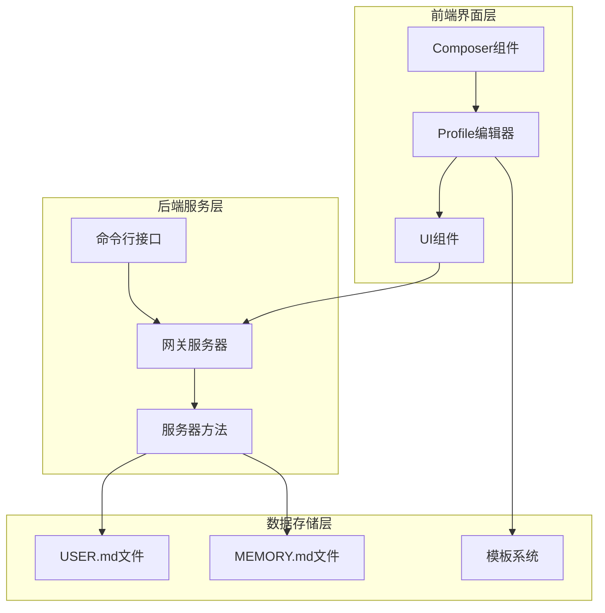
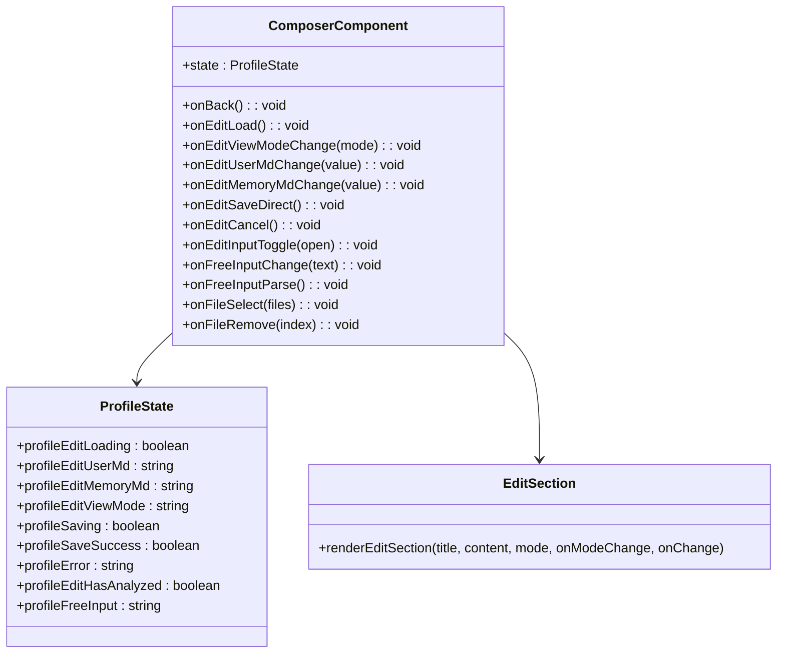
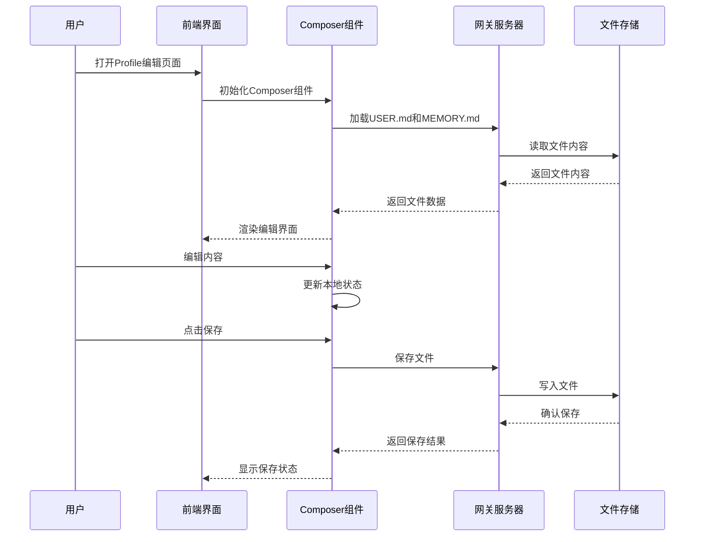
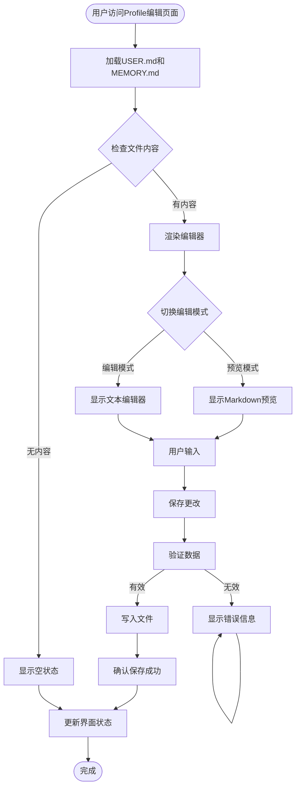
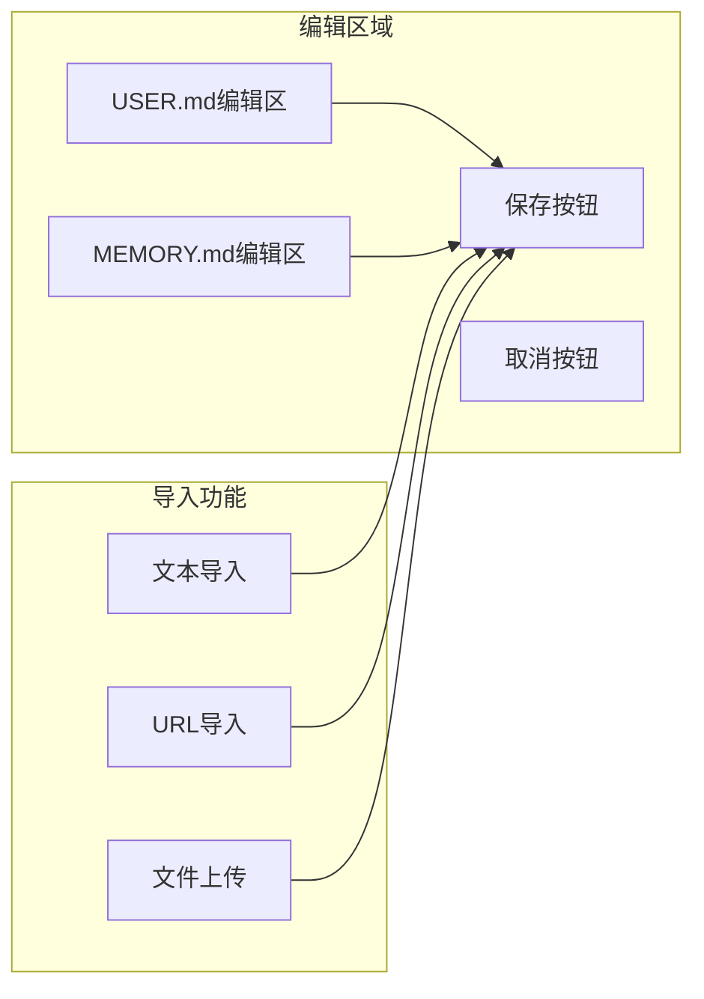
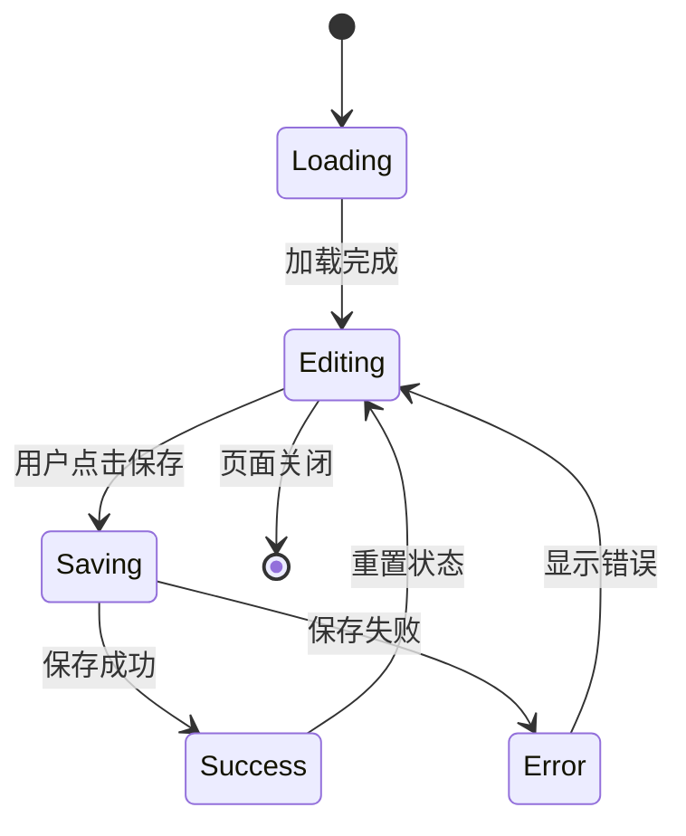
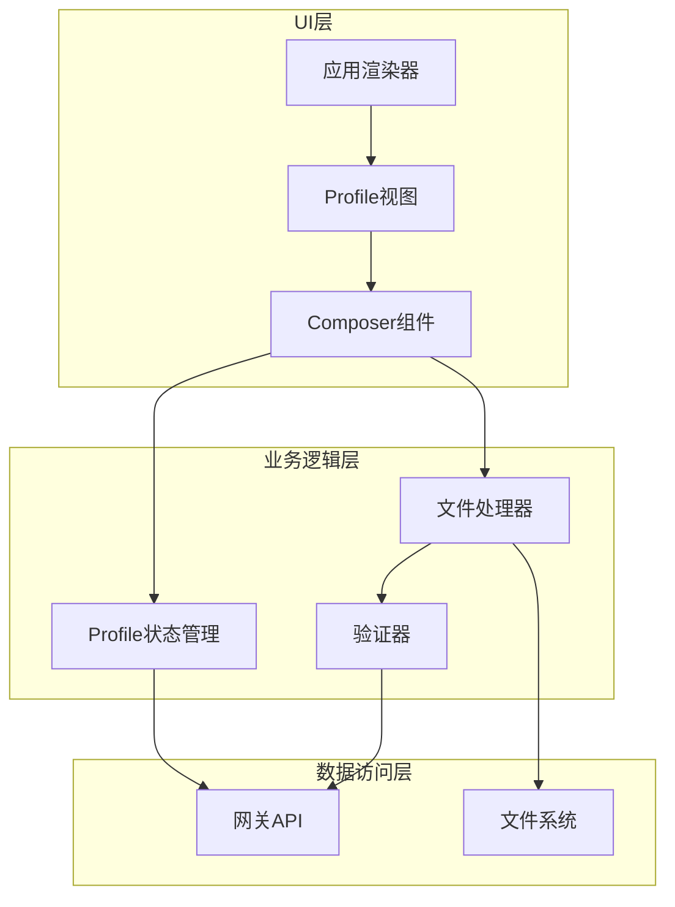

# 用户编辑Composer组件

<cite>
**本文档引用的文件**
- [README.md](file://README.md)
- [profile.ts](file://ui/src/ui/views/profile.ts)
- [app-render.ts](file://ui/src/ui/app-render.ts)
- [profile.ts](file://src/gateway/server-methods/profile.ts)
- [profile.ts](file://src/cli/profile.ts)
</cite>

## 目录
1. [简介](#简介)
2. [项目结构](#项目结构)
3. [核心组件](#核心组件)
4. [架构概览](#架构概览)
5. [详细组件分析](#详细组件分析)
6. [依赖关系分析](#依赖关系分析)
7. [性能考虑](#性能考虑)
8. [故障排除指南](#故障排除指南)
9. [结论](#结论)

## 简介

OpenClaw是一个个人AI助手平台，支持多渠道消息传递、语音控制和可视化工作空间。本文档专注于用户编辑Composer组件的功能实现，这是一个允许用户直接编辑个人资料和记忆文件的界面组件。

Composer组件是OpenClaw控制界面中的一个关键功能，它提供了直观的用户界面来管理用户的个人配置文件（USER.md）和记忆文件（MEMORY.md）。该组件支持实时预览、编辑模式切换、文件上传和文本导入等多种功能。

## 项目结构

OpenClaw项目采用模块化架构设计，主要包含以下关键目录：



**图表来源**
- [profile.ts:1180-1379](file://ui/src/ui/views/profile.ts#L1180-L1379)
- [app-render.ts:92-1068](file://ui/src/ui/app-render.ts#L92-L1068)

**章节来源**
- [README.md:1-560](file://README.md#L1-L560)

## 核心组件

### Composer组件架构

Composer组件是用户编辑界面的核心，它提供了完整的个人资料管理功能：

#### 主要功能特性
- **双模式编辑**：支持预览模式和编辑模式切换
- **实时保存**：支持直接保存编辑内容
- **文件导入**：支持从文本、URL或文件导入内容
- **拖拽上传**：提供直观的文件拖拽上传体验
- **错误处理**：完善的错误提示和状态反馈机制

#### 组件结构


**图表来源**
- [profile.ts:1187-1201](file://ui/src/ui/views/profile.ts#L1187-L1201)

**章节来源**
- [profile.ts:1180-1379](file://ui/src/ui/views/profile.ts#L1180-L1379)

## 架构概览

### 系统架构图



**图表来源**
- [profile.ts:1203-1379](file://ui/src/ui/views/profile.ts#L1203-L1379)
- [profile.ts](file://src/gateway/server-methods/profile.ts)

### 数据流分析



**图表来源**
- [profile.ts:1235-1287](file://ui/src/ui/views/profile.ts#L1235-L1287)

**章节来源**
- [profile.ts:1050-1287](file://ui/src/ui/views/profile.ts#L1050-L1287)

## 详细组件分析

### Profile编辑器组件

#### 组件接口定义

```typescript
export type ProfileEditProps = {
  state: ProfileState;
  onBack: () => void;
  onEditLoad: () => void;
  onEditViewModeChange: (mode: "preview" | "edit") => void;
  onEditUserMdChange: (value: string) => void;
  onEditMemoryMdChange: (value: string) => void;
  onEditSaveDirect: () => void;
  onEditCancel: () => void;
  onEditInputToggle: (open: boolean) => void;
  onFreeInputChange: (text: string) => void;
  onFreeInputParse: () => void;
  onFileSelect: (files: Array<{ name: string; content: string }>) => void;
  onFileRemove: (index: number) => void;
};
```

#### 编辑区域渲染逻辑



**图表来源**
- [profile.ts:1241-1287](file://ui/src/ui/views/profile.ts#L1241-L1287)

#### 文件处理机制

组件支持多种文件导入方式：

1. **文本导入**：支持粘贴文本或URL链接
2. **文件上传**：支持.md、.doc、.docx、.pdf格式
3. **拖拽上传**：提供直观的拖拽交互体验

**章节来源**
- [profile.ts:1289-1379](file://ui/src/ui/views/profile.ts#L1289-L1379)

### 状态管理系统

#### ProfileState状态结构



**图表来源**
- [profile.ts:1219-1232](file://ui/src/ui/views/profile.ts#L1219-L1232)

#### 状态字段说明

| 状态字段 | 类型 | 描述 | 默认值 |
|---------|------|------|--------|
| profileEditLoading | boolean | 是否正在加载文件 | false |
| profileEditUserMd | string | USER.md文件内容 | "" |
| profileEditMemoryMd | string | MEMORY.md文件内容 | "" |
| profileEditViewMode | string | 当前视图模式 | "preview" |
| profileSaving | boolean | 是否正在保存 | false |
| profileSaveSuccess | boolean | 保存是否成功 | false |
| profileError | string | 错误信息 | null |
| profileEditHasAnalyzed | boolean | 是否已分析内容 | false |
| profileFreeInput | string | 自由输入的内容 | "" |

**章节来源**
- [profile.ts:1187-1201](file://ui/src/ui/views/profile.ts#L1187-L1201)

## 依赖关系分析

### 组件间依赖关系



**图表来源**
- [app-render.ts:92-1068](file://ui/src/ui/app-render.ts#L92-L1068)
- [profile.ts:1180-1379](file://ui/src/ui/views/profile.ts#L1180-L1379)

### 外部依赖

Composer组件依赖于以下外部系统：

1. **网关服务器**：提供文件读写服务
2. **文件系统**：存储USER.md和MEMORY.md文件
3. **Markdown渲染器**：用于预览模式的内容展示
4. **文件上传服务**：处理文件导入功能

**章节来源**
- [profile.ts](file://src/gateway/server-methods/profile.ts)
- [profile.ts](file://src/cli/profile.ts)

## 性能考虑

### 加载优化策略

1. **懒加载**：仅在用户访问时加载文件内容
2. **缓存机制**：避免重复请求相同文件
3. **分块传输**：大文件采用分块加载策略
4. **防抖处理**：编辑输入采用防抖减少不必要的请求

### 渲染性能优化

1. **虚拟滚动**：对于长文本采用虚拟滚动技术
2. **增量更新**：只更新发生变化的部分DOM
3. **异步渲染**：将耗时操作放到Web Worker中执行
4. **内存管理**：及时清理不再使用的资源

## 故障排除指南

### 常见问题及解决方案

#### 文件加载失败
- **症状**：页面显示"加载文件失败"
- **原因**：网络连接问题或文件权限不足
- **解决方案**：检查网络连接，确认文件存在且可读

#### 保存失败
- **症状**：保存按钮显示"保存失败"
- **原因**：文件写入权限问题或磁盘空间不足
- **解决方案**：检查文件权限，清理磁盘空间

#### 编辑器无响应
- **症状**：编辑框无法输入或保存按钮不可用
- **原因**：JavaScript错误或浏览器兼容性问题
- **解决方案**：刷新页面，使用支持的浏览器版本

**章节来源**
- [profile.ts:1226-1232](file://ui/src/ui/views/profile.ts#L1226-L1232)

## 结论

OpenClaw的Composer组件为用户提供了强大而直观的个人资料编辑功能。通过模块化的架构设计和完善的错误处理机制，该组件能够满足用户对个人配置文件管理的各种需求。

组件的主要优势包括：
- **用户友好**：直观的界面设计和交互体验
- **功能完整**：支持多种编辑和导入方式
- **性能优化**：采用多种优化策略确保流畅体验
- **可靠性强**：完善的错误处理和状态管理

未来可以考虑的功能增强包括：
- 支持更多文件格式导入
- 添加内容模板系统
- 实现版本历史管理
- 增强协作编辑功能