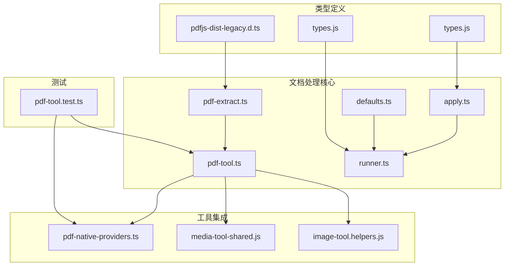
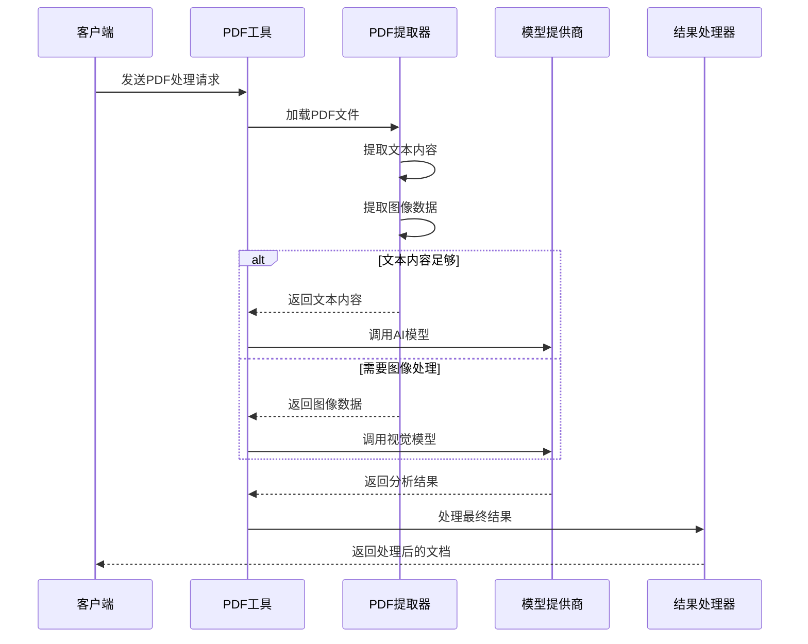
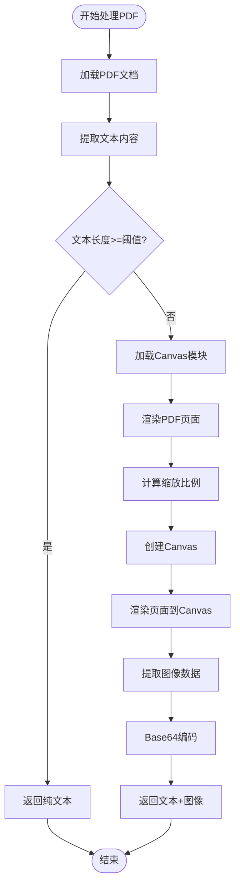
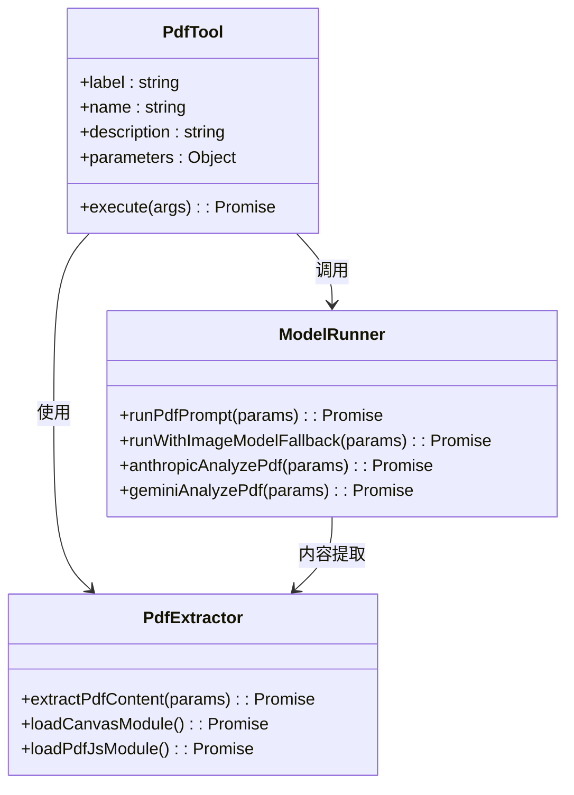

# 文档处理库

<cite>
**本文档中引用的文件**
- [pdf-extract.ts](file://src/media/pdf-extract.ts)
- [pdf-tool.ts](file://src/agents/tools/pdf-tool.ts)
- [apply.ts](file://src/media-understanding/apply.ts)
- [runner.ts](file://src/media-understanding/runner.ts)
- [defaults.ts](file://src/media-understanding/defaults.ts)
- [pdf-tool.test.ts](file://src/agents/tools/pdf-tool.test.ts)
- [pdf-native-providers.ts](file://src/agents/tools/pdf-native-providers.ts)
- [pdfjs-dist-legacy.d.ts](file://src/types/pdfjs-dist-legacy.d.ts)
</cite>

## 目录
1. [简介](#简介)
2. [项目结构](#项目结构)
3. [核心组件](#核心组件)
4. [架构概览](#架构概览)
5. [详细组件分析](#详细组件分析)
6. [依赖关系分析](#依赖关系分析)
7. [性能考虑](#性能考虑)
8. [故障排除指南](#故障排除指南)
9. [结论](#结论)

## 简介

OpenClaw 是一个个人AI助手，专门设计用于处理各种文档类型的处理和理解。该系统提供了强大的文档处理能力，特别是对PDF文档的高级分析功能。文档处理库是OpenClaw的核心组成部分，负责将复杂的文档内容转换为AI模型可以理解和处理的格式。

该库支持多种文档格式的提取、转换和分析，包括PDF、图像、音频和视频文件。通过集成先进的OCR技术和机器学习模型，OpenClaw能够从各种媒体类型中提取有意义的信息，并将其转换为结构化的文本数据。

## 项目结构

OpenClaw的文档处理系统主要由以下几个核心模块组成：



**图表来源**
- [pdf-extract.ts:1-105](file://src/media/pdf-extract.ts#L1-L105)
- [pdf-tool.ts:1-559](file://src/agents/tools/pdf-tool.ts#L1-L559)
- [apply.ts:1-581](file://src/media-understanding/apply.ts#L1-L581)

**章节来源**
- [pdf-extract.ts:1-105](file://src/media/pdf-extract.ts#L1-L105)
- [pdf-tool.ts:1-559](file://src/agents/tools/pdf-tool.ts#L1-L559)
- [apply.ts:1-581](file://src/media-understanding/apply.ts#L1-L581)

## 核心组件

### PDF文档提取器

PDF文档提取器是整个文档处理系统的核心组件，负责从PDF文件中提取文本内容和图像数据。

**章节来源**
- [pdf-extract.ts:42-104](file://src/media/pdf-extract.ts#L42-L104)

### PDF工具集成

PDF工具集成了完整的PDF处理流程，包括文件加载、内容提取、模型调用和结果处理。

**章节来源**
- [pdf-tool.ts:337-558](file://src/agents/tools/pdf-tool.ts#L337-L558)

### 媒体理解应用

媒体理解应用负责协调不同类型媒体的处理流程，包括图像、音频和视频的理解和分析。

**章节来源**
- [apply.ts:466-581](file://src/media-understanding/apply.ts#L466-L581)

## 架构概览

OpenClaw的文档处理架构采用了分层设计，确保了系统的可扩展性和维护性：



**图表来源**
- [pdf-tool.ts:514-538](file://src/agents/tools/pdf-tool.ts#L514-L538)
- [pdf-extract.ts:42-104](file://src/media/pdf-extract.ts#L42-L104)

## 详细组件分析

### PDF提取器组件

PDF提取器实现了智能的文档内容提取策略，优先尝试文本提取，只有在必要时才进行图像渲染：



**图表来源**
- [pdf-extract.ts:42-104](file://src/media/pdf-extract.ts#L42-L104)

**章节来源**
- [pdf-extract.ts:1-105](file://src/media/pdf-extract.ts#L1-L105)

### PDF工具执行流程

PDF工具提供了完整的端到端处理流程，包括输入验证、文件加载、内容提取和模型调用：



**图表来源**
- [pdf-tool.ts:337-558](file://src/agents/tools/pdf-tool.ts#L337-L558)
- [pdf-tool.ts:168-289](file://src/agents/tools/pdf-tool.ts#L168-L289)

**章节来源**
- [pdf-tool.ts:1-559](file://src/agents/tools/pdf-tool.ts#L1-L559)

### 媒体理解应用架构

媒体理解应用提供了统一的接口来处理不同类型的媒体文件：

**章节来源**
- [apply.ts:466-581](file://src/media-understanding/apply.ts#L466-L581)

### 默认配置管理

系统提供了丰富的默认配置选项，确保不同场景下的最佳性能：

**章节来源**
- [defaults.ts:1-70](file://src/media-understanding/defaults.ts#L1-L70)

## 依赖关系分析

文档处理系统的关键依赖关系如下：

```mermaid
graph LR
subgraph "外部依赖"
A[pdfjs-dist] --> B[pdf-extract.ts]
C[@napi-rs/canvas] --> B
D[pi-ai] --> E[pdf-tool.ts]
F[TypeBox] --> E
end
subgraph "内部模块"
B --> E
G[media-understanding] --> H[apply.ts]
H --> I[runner.ts]
I --> J[defaults.ts]
end
subgraph "类型定义"
K[pdfjs-dist-legacy.d.ts] --> B
L[types.js] --> H
L --> I
end
```

**图表来源**
- [pdf-extract.ts:1-2](file://src/media/pdf-extract.ts#L1-L2)
- [pdf-tool.ts:1-21](file://src/agents/tools/pdf-tool.ts#L1-L21)

**章节来源**
- [pdf-extract.ts:1-29](file://src/media/pdf-extract.ts#L1-L29)
- [pdf-tool.ts:1-41](file://src/agents/tools/pdf-tool.ts#L1-L41)

## 性能考虑

### 内存优化策略

系统采用了多种内存优化技术来处理大型PDF文档：

1. **像素预算控制**: 通过`maxPixels`参数限制图像渲染的像素数量
2. **页面范围过滤**: 支持指定处理特定页面范围
3. **渐进式处理**: 先尝试文本提取，避免不必要的图像渲染

### 并发处理

媒体理解系统支持并发处理多个附件，提高了整体处理效率：

**章节来源**
- [runner.ts:502-503](file://src/media-understanding/runner.ts#L502-L503)
- [defaults.ts:62-62](file://src/media-understanding/defaults.ts#L62-L62)

## 故障排除指南

### 常见问题及解决方案

1. **PDF提取失败**
   - 检查PDF文件完整性
   - 验证文件权限设置
   - 确认依赖模块安装

2. **图像渲染错误**
   - 确保`@napi-rs/canvas`正确安装
   - 检查系统图形库依赖
   - 验证内存限制设置

3. **模型调用失败**
   - 验证API密钥配置
   - 检查网络连接状态
   - 确认模型支持情况

**章节来源**
- [pdf-tool.test.ts:531-722](file://src/agents/tools/pdf-tool.test.ts#L531-L722)

## 结论

OpenClaw的文档处理库提供了一个完整、高效且可扩展的解决方案，专门用于处理各种文档格式。通过智能的内容提取策略、灵活的模型集成和完善的错误处理机制，该系统能够在保证性能的同时提供高质量的文档处理服务。

系统的主要优势包括：
- 支持多种文档格式的智能提取
- 灵活的模型选择和配置
- 高效的内存管理和并发处理
- 完善的错误处理和故障恢复机制

这些特性使得OpenClaw成为处理复杂文档场景的理想选择，无论是个人用户还是企业环境都能从中受益。