# Electron 打包配置文档

<cite>
**本文档引用的文件**
- [apps/electron/package.json](file://apps/electron/package.json)
- [apps/electron/electron-builder.yml](file://apps/electron/electron-builder.yml)
- [apps/electron/tsup.config.ts](file://apps/electron/tsup.config.ts)
- [apps/electron/tsdown.config.electron.ts](file://apps/electron/tsdown.config.electron.ts)
- [apps/electron/packaged-runtime.json](file://apps/electron/packaged-runtime.json)
- [apps/electron/scripts/download-node.sh](file://apps/electron/scripts/download-node.sh)
- [apps/electron/scripts/package-electron.sh](file://apps/electron/scripts/package-electron.sh)
- [apps/electron/scripts/package-electron-win.sh](file://apps/electron/scripts/package-electron-win.sh)
- [apps/electron/scripts/generate-runtime-package.mjs](file://apps/electron/scripts/generate-runtime-package.mjs)
- [apps/electron/scripts/notarize.cjs](file://apps/electron/scripts/notarize.cjs)
- [apps/electron/src/main/index.ts](file://apps/electron/src/main/index.ts)
- [apps/electron/src/preload/index.ts](file://apps/electron/src/preload/index.ts)
- [apps/electron/src/main/window.ts](file://apps/electron/src/main/window.ts)
- [apps/electron/src/main/gateway.ts](file://apps/electron/src/main/gateway.ts)
- [apps/electron/resources/entitlements.mac.plist](file://apps/electron/resources/entitlements.mac.plist)
- [scripts/package-mac-app.sh](file://scripts/package-mac-app.sh)
- [scripts/create-dmg.sh](file://scripts/create-dmg.sh)
- [scripts/release-mac-local.sh](file://scripts/release-mac-local.sh)
- [scripts/notarize-mac-artifact.sh](file://scripts/notarize-mac-artifact.sh)
- [extensions/memory-core/openclaw.plugin.json](file://extensions/memory-core/openclaw.plugin.json)
- [extensions/device-pair/openclaw.plugin.json](file://extensions/device-pair/openclaw.plugin.json)
- [extensions/qwen-portal-auth/openclaw.plugin.json](file://extensions/qwen-portal-auth/openclaw.plugin.json)
- [extensions/minimax-portal-auth/openclaw.plugin.json](file://extensions/minimax-portal-auth/openclaw.plugin.json)
- [extensions/google-gemini-cli-auth/openclaw.plugin.json](file://extensions/google-gemini-cli-auth/openclaw.plugin.json)
- [extensions/copilot-proxy/openclaw.plugin.json](file://extensions/copilot-proxy/openclaw.plugin.json)
- [extensions/telegram/openclaw.plugin.json](file://extensions/telegram/openclaw.plugin.json)
- [extensions/discord/openclaw.plugin.json](file://extensions/discord/openclaw.plugin.json)
- [extensions/memory-core/package.json](file://extensions/memory-core/package.json)
- [extensions/memory-core/index.ts](file://extensions/memory-core/index.ts)
- [src/plugins/bundled-dir.ts](file://src/plugins/bundled-dir.ts)
- [src/plugins/bundled-sources.ts](file://src/plugins/bundled-sources.ts)
- [apps/electron/BUILDING.md](file://apps/electron/BUILDING.md)
</cite>

## 更新摘要
**所做更改**
- 新增 Windows 打包脚本支持跨平台打包
- 新增 macOS 自动公证脚本和配置
- 新增完整的构建指南文档
- 改进的跨平台打包流程和部署模式
- 增强的多架构支持（arm64/x64）
- 完善的签名和公证自动化流程

## 目录
1. [简介](#简介)
2. [项目结构概览](#项目结构概览)
3. [核心组件分析](#核心组件分析)
4. [架构总览](#架构总览)
5. [详细组件分析](#详细组件分析)
6. [运行时依赖管理系统](#运行时依赖管理系统)
7. [多部署模式支持](#多部署模式支持)
8. [跨平台打包增强](#跨平台打包增强)
9. [签名和公证自动化](#签名和公证自动化)
10. [依赖关系分析](#依赖关系分析)
11. [性能考虑](#性能考虑)
12. [故障排除指南](#故障排除指南)
13. [结论](#结论)

## 简介

OpenClaw 项目的 Electron 打包配置经过重大增强，从单一平台支持发展为完整的跨平台打包解决方案。本次更新引入了 Windows 打包脚本、macOS 自动公证自动化、改进的跨平台支持，以及详细的构建指南，为多平台桌面应用开发提供了完整的参考模板。

**更新** 重大增强包括：
- **Windows 打包支持**：新增 `package-electron-win.sh` 脚本，支持在 macOS/Linux 上交叉编译 Windows 版本
- **macOS 自动公证**：新增 `notarize.cjs` 脚本，实现签名后的自动公证流程
- **完整构建指南**：新增 `BUILDING.md` 文档，提供详细的构建和部署指导
- **跨平台打包增强**：统一的打包流程支持 macOS 和 Windows 两个主要平台
- **多架构支持**：同时支持 Apple Silicon (arm64) 和 Intel (x64) 架构
- **自动化部署**：从手动配置转向完全自动化的打包和部署流程

该打包配置现在支持：
- 多平台打包（macOS、Windows、Linux）
- 内置 Node.js 运行时环境
- React 控制界面集成
- OAuth 认证流程支持
- 硬化运行时配置
- 自动更新机制
- **Windows 打包脚本**（新增）
- **macOS 自动公证**（新增）
- **跨平台构建指南**（新增）
- **多架构支持**（增强）
- **自动化部署流程**（增强）

## 项目结构概览

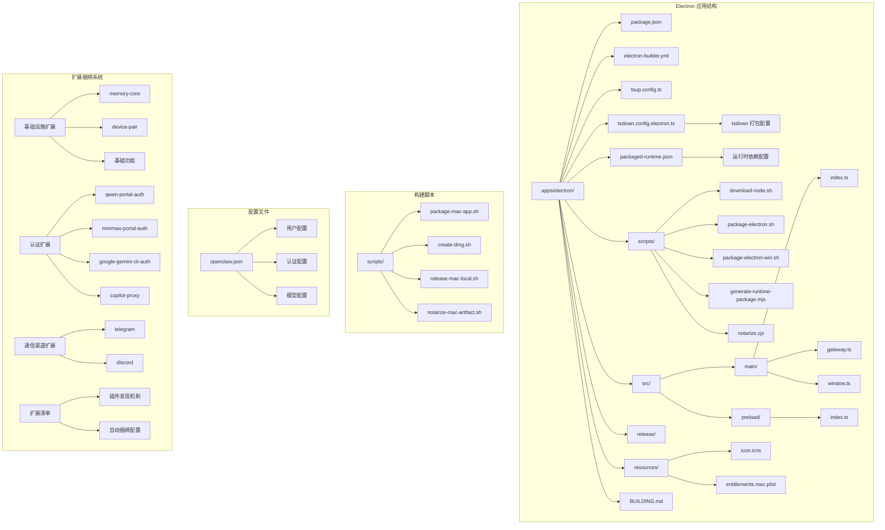

**图表来源**
- [apps/electron/package.json:1-42](file://apps/electron/package.json#L1-L42)
- [apps/electron/electron-builder.yml:1-176](file://apps/electron/electron-builder.yml#L1-L176)
- [apps/electron/packaged-runtime.json:1-94](file://apps/electron/packaged-runtime.json#L1-L94)
- [apps/electron/scripts/package-electron.sh:1-206](file://apps/electron/scripts/package-electron.sh#L1-L206)
- [apps/electron/scripts/package-electron-win.sh:1-176](file://apps/electron/scripts/package-electron-win.sh#L1-L176)

**章节来源**
- [apps/electron/package.json:1-42](file://apps/electron/package.json#L1-L42)
- [apps/electron/electron-builder.yml:1-176](file://apps/electron/electron-builder.yml#L1-L176)
- [apps/electron/packaged-runtime.json:1-94](file://apps/electron/packaged-runtime.json#L1-L94)
- [apps/electron/BUILDING.md:1-149](file://apps/electron/BUILDING.md#L1-L149)

## 核心组件分析

### 主进程配置

主进程是 Electron 应用的核心，负责管理应用生命周期、窗口管理和与系统交互。

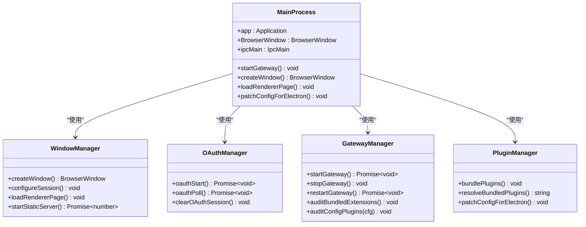

**图表来源**
- [apps/electron/src/main/index.ts:1-419](file://apps/electron/src/main/index.ts#L1-L419)
- [apps/electron/src/main/window.ts:1-326](file://apps/electron/src/main/window.ts#L1-L326)
- [apps/electron/src/main/gateway.ts:1-674](file://apps/electron/src/main/gateway.ts#L1-L674)

### 预加载脚本安全桥

预加载脚本实现了安全的上下文桥接，限制渲染进程对 Node.js API 的访问。

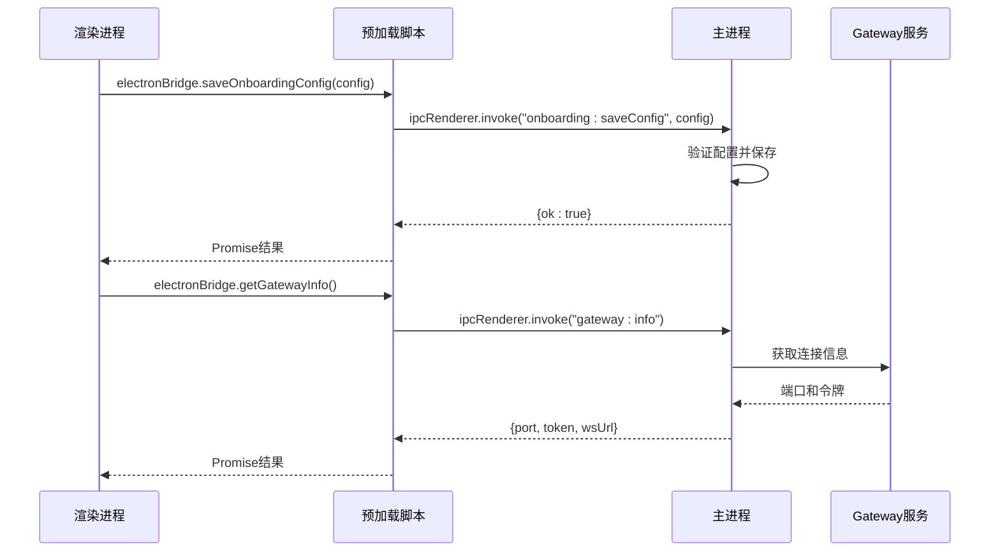

**图表来源**
- [apps/electron/src/preload/index.ts:1-96](file://apps/electron/src/preload/index.ts#L1-L96)
- [apps/electron/src/main/index.ts:114-206](file://apps/electron/src/main/index.ts#L114-L206)

**章节来源**
- [apps/electron/src/main/index.ts:1-419](file://apps/electron/src/main/index.ts#L1-L419)
- [apps/electron/src/preload/index.ts:1-96](file://apps/electron/src/preload/index.ts#L1-L96)

## 架构总览

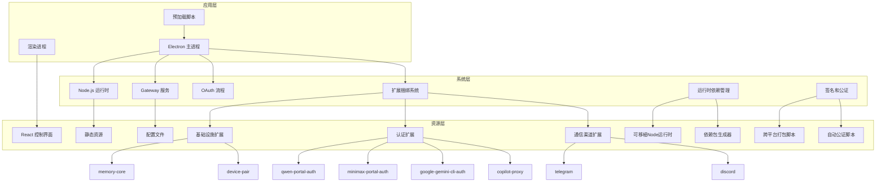

**图表来源**
- [apps/electron/src/main/index.ts:301-386](file://apps/electron/src/main/index.ts#L301-L386)
- [apps/electron/src/main/window.ts:99-136](file://apps/electron/src/main/window.ts#L99-L136)
- [apps/electron/packaged-runtime.json:17-73](file://apps/electron/packaged-runtime.json#L17-L73)
- [apps/electron/scripts/notarize.cjs:1-77](file://apps/electron/scripts/notarize.cjs#L1-L77)

## 详细组件分析

### 打包配置详解

electron-builder.yml 定义了完整的打包配置，现已支持更全面的扩展捆绑和运行时管理：

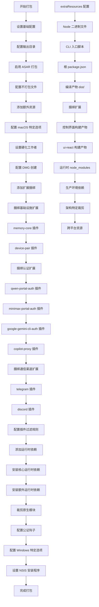

**更新** 新增的跨平台配置：
- **Windows 支持**：完整的 NSIS 安装程序配置
- **公证钩子**：`afterSign: scripts/notarize.cjs` 自动公证
- **多架构目标**：同时支持 arm64 和 x64 架构
- **跨平台资源**：区分 macOS 和 Windows 的资源处理

**图表来源**
- [apps/electron/electron-builder.yml:1-176](file://apps/electron/electron-builder.yml#L1-L176)
- [apps/electron/packaged-runtime.json:17-79](file://apps/electron/packaged-runtime.json#L17-L79)

### 构建工具配置

**更新** tsdown.config.electron.ts 引入了基于配置的依赖管理：

| 配置项 | 值 | 说明 |
|--------|-----|------|
| entry | main/index | 主进程入口文件 |
| outDir | dist | 输出目录 |
| format | cjs | CommonJS 格式 |
| target | node20 | Node.js 20 目标 |
| platform | node | Node.js 平台 |
| external | electron | 外部依赖 |
| sourcemap | true | 生成源码映射 |
| bundle | true | 启用打包 |
| **neverBundle** | packagedRuntime.neverBundleDependencies | **基于配置的原生依赖** |

**更新** 新增的运行时依赖配置：
- **neverBundleDependencies**：定义不能内联的原生/特殊模块
- **NATIVE_EXTERNALS**：从 packaged-runtime.json 动态导入的原生外部依赖
- **智能依赖排除**：自动排除 electron、sharp、playwright-core 等原生模块

**章节来源**
- [apps/electron/electron-builder.yml:1-176](file://apps/electron/electron-builder.yml#L1-L176)
- [apps/electron/tsdown.config.electron.ts:14-28](file://apps/electron/tsdown.config.electron.ts#L14-L28)
- [apps/electron/packaged-runtime.json:2-16](file://apps/electron/packaged-runtime.json#L2-L16)

### macOS 硬化运行时配置

entitlements.mac.plist 定义了 macOS 应用的权限配置：

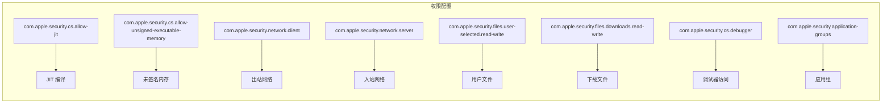

**图表来源**
- [apps/electron/resources/entitlements.mac.plist:1-25](file://apps/electron/resources/entitlements.mac.plist#L1-L25)

**章节来源**
- [apps/electron/resources/entitlements.mac.plist:1-25](file://apps/electron/resources/entitlements.mac.plist#L1-L25)

### 用户配置管理

openclaw.json 包含了完整的用户配置信息：

| 配置类别 | 说明 | 关键字段 |
|----------|------|----------|
| meta | 应用元数据 | lastTouchedVersion, lastTouchedAt |
| wizard | 引导向导配置 | lastRunAt, lastRunVersion |
| auth | 认证配置 | profiles, provider, mode |
| models | 模型配置 | providers, models, contextWindow |
| agents | 代理配置 | defaults, workspace |
| gateway | 网关配置 | port, mode, auth, nodes |
| **plugins** | **扩展配置** | **entries, minimax-portal-auth: enabled** |

**章节来源**
- [apps/electron/openclaw.json:1-142](file://apps/electron/openclaw.json#L1-L142)

## 运行时依赖管理系统

**更新** 新增的自动化运行时依赖管理系统实现了从手动管理到智能配置的转变。

### 运行时依赖配置

packaged-runtime.json 定义了 Electron 应用的运行时依赖配置：

```mermaid
graph TB
subgraph "运行时依赖配置"
A[packaged-runtime.json] --> B[neverBundleDependencies]
A --> C[coreRuntimeDependencies]
A --> D[runtimeDependencies]
A --> E[preinstalledExtensions]
end
subgraph "neverBundleDependencies"
B --> F[electron]
B --> G[sharp]
B --> H[playwright-core]
B --> I[sqlite-vec]
B --> J[opusscript]
B --> K[@lydell/node-pty]
B --> L[@napi-rs/canvas]
B --> M[node-llama-cpp]
B --> N[koffi]
B --> O[@matrix-org/matrix-sdk-crypto-nodejs]
B --> P[@whiskeysockets/baileys]
B --> Q[esbuild]
B --> R[jiti]
end
subgraph "coreRuntimeDependencies"
C --> S[@agentclientprotocol/sdk]
C --> T[@aws-sdk/client-bedrock]
C --> U[@buape/carbon]
C --> V[@clack/prompts]
C --> W[... 多个核心依赖]
end
subgraph "runtimeDependencies"
D --> X[koffi]
D --> Y[@matrix-org/matrix-sdk-crypto-nodejs]
D --> Z[esbuild]
D --> AA[jiti]
end
subgraph "preinstalledExtensions"
E --> AB[memory-core]
E --> AC[device-pair]
E --> AD[qwen-portal-auth]
E --> AE[minimax-portal-auth]
E --> AF[google-gemini-cli-auth]
E --> AG[copilot-proxy]
E --> AH[telegram]
E --> AI[discord]
end
```

**图表来源**
- [apps/electron/packaged-runtime.json:1-94](file://apps/electron/packaged-runtime.json#L1-L94)

### 运行时包生成器

**更新** generate-runtime-package.mjs 实现了运行时依赖的精确版本解析：

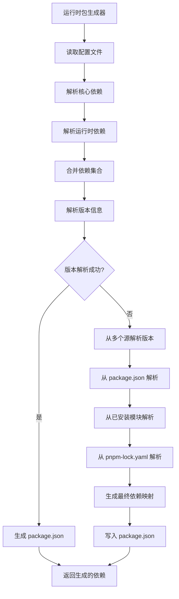

**版本解析策略**：
1. **优先级1**：从 packaged-runtime.json 的直接依赖映射
2. **优先级2**：从根 package.json 的依赖声明
3. **优先级3**：从已安装的 node_modules 解析实际版本
4. **优先级4**：从 pnpm-lock.yaml 的锁定版本解析

**章节来源**
- [apps/electron/packaged-runtime.json:1-94](file://apps/electron/packaged-runtime.json#L1-L94)
- [apps/electron/scripts/generate-runtime-package.mjs:19-115](file://apps/electron/scripts/generate-runtime-package.mjs#L19-L115)

### Node.js 运行时管理

**更新** download-node.sh 提供了可移植的 Node.js 运行时：

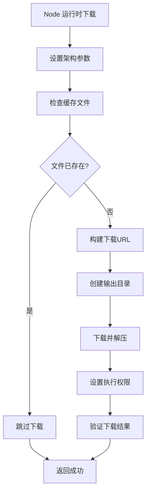

**支持的架构**：
- **arm64**：Apple Silicon Mac（darwin-arm64）
- **x64**：Intel Mac（darwin-x64）
- **Windows**：支持 win-x64 和 win-arm64 架构
- **版本**：Node.js 22.15.0（长期支持版本）

**章节来源**
- [apps/electron/scripts/download-node.sh:1-33](file://apps/electron/scripts/download-node.sh#L1-L33)

## 多部署模式支持

**更新** package-electron.sh 引入了灵活的多部署模式支持。

### 部署模式配置

**更新** 支持的部署模式及其特点：

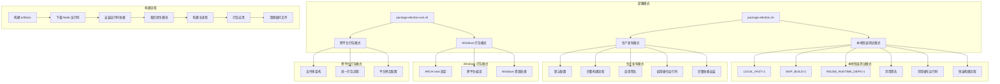

**环境变量控制**：
- **LOCAL_FAST**：启用本地快速测试模式
- **SKIP_BUILD**：跳过构建步骤
- **REUSE_RUNTIME_DEPS**：复用已有的运行时依赖
- **ARCH**：目标架构（arm64/x64）

**章节来源**
- [apps/electron/scripts/package-electron.sh:15-23](file://apps/electron/scripts/package-electron.sh#L15-L23)
- [apps/electron/scripts/package-electron.sh:61-92](file://apps/electron/scripts/package-electron.sh#L61-L92)
- [apps/electron/scripts/package-electron-win.sh:13-16](file://apps/electron/scripts/package-electron-win.sh#L13-L16)

### 架构特定依赖裁剪

**更新** prune_runtime_dependencies 函数实现了架构特定的原生模块裁剪：

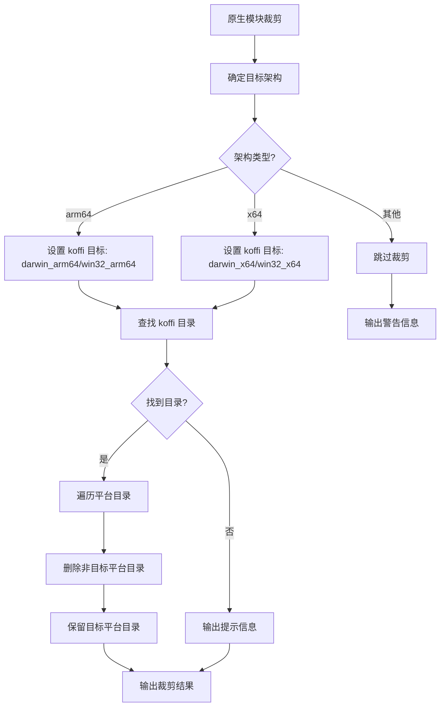

**裁剪范围**：
- **koffi**：裁剪到目标架构的原生二进制
- **其他原生模块**：根据架构需求进行相应的裁剪
- **目标架构**：支持 arm64（Apple Silicon）和 x64（Intel）
- **Windows 架构**：支持 win-arm64 和 win-x64

**章节来源**
- [apps/electron/scripts/package-electron.sh:94-139](file://apps/electron/scripts/package-electron.sh#L94-L139)
- [apps/electron/scripts/package-electron-win.sh:92-133](file://apps/electron/scripts/package-electron-win.sh#L92-L133)

## 跨平台打包增强

**更新** 新增的 Windows 打包支持和跨平台构建流程。

### Windows 打包脚本

**更新** package-electron-win.sh 提供了完整的 Windows 打包解决方案：

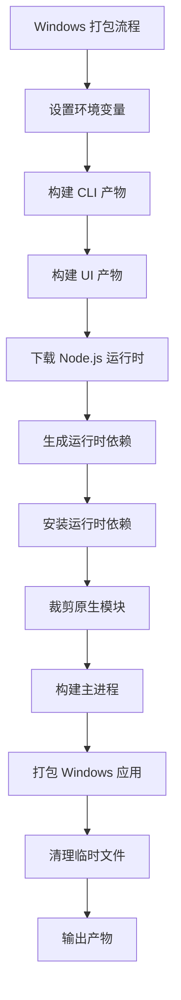

**Windows 特定配置**：
- **固定架构**：目前只支持 x64 架构（可扩展为 arm64）
- **资源处理**：区分 Windows 的 node.exe 可执行文件
- **安装程序**：使用 NSIS 创建安装包
- **协议支持**：配置 openclaw URL Scheme

**章节来源**
- [apps/electron/scripts/package-electron-win.sh:1-176](file://apps/electron/scripts/package-electron-win.sh#L1-L176)

### 跨平台构建指南

**更新** BUILDING.md 提供了详细的构建和部署指导：

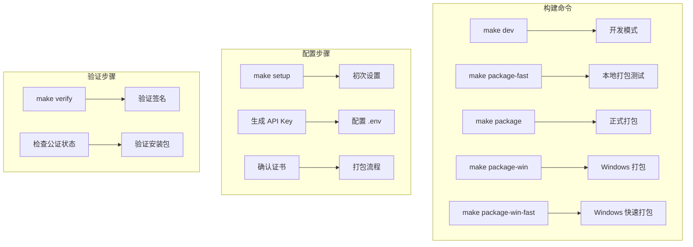

**构建命令说明**：
- **开发模式**：支持热重载和实时调试
- **本地打包**：无签名的快速验证
- **正式打包**：完整的签名和公证流程
- **Windows 打包**：跨平台支持 Windows 版本

**章节来源**
- [apps/electron/BUILDING.md:1-149](file://apps/electron/BUILDING.md#L1-L149)

### 多架构支持

**更新** 统一的多架构打包支持：

```mermaid
graph TB
subgraph "架构支持"
A[macOS] --> B[arm64 (Apple Silicon)]
A --> C[x64 (Intel)]
D[Windows] --> E[x64 (固定)]
F[Linux] --> G[多架构支持]
end
subgraph "资源处理"
B --> H[macOS 资源]
C --> I[macOS 资源]
E --> J[Windows 资源]
G --> K[Linux 资源]
end
subgraph "打包目标"
H --> L[dmg + zip]
I --> M[dmg + zip]
J --> N[nsis + zip]
K --> O[deb + rpm]
end
```

**架构特定配置**：
- **macOS**：同时支持 arm64 和 x64 架构
- **Windows**：当前支持 x64 架构
- **资源差异**：区分平台特定的图标和配置文件
- **打包格式**：根据平台选择合适的安装包格式

**章节来源**
- [apps/electron/electron-builder.yml:124-168](file://apps/electron/electron-builder.yml#L124-L168)
- [apps/electron/scripts/package-electron-win.sh:13-25](file://apps/electron/scripts/package-electron-win.sh#L13-L25)

## 签名和公证自动化

**更新** 新增的 macOS 自动公证流程和签名配置。

### 自动公证脚本

**更新** notarize.cjs 实现了完整的自动公证流程：

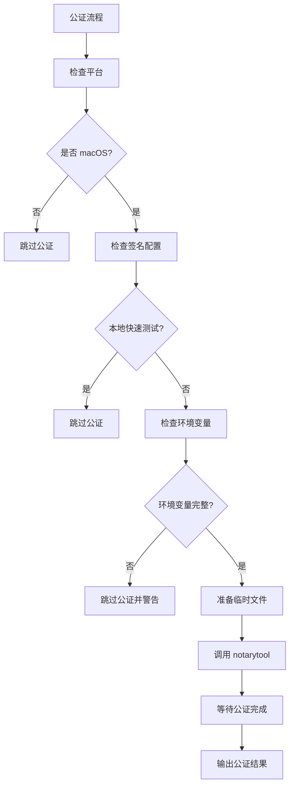

**公证配置要求**：
- **App Store Connect API**：需要完整的 API 密钥配置
- **证书验证**：确保签名证书有效且可访问
- **自动处理**：支持从文件路径或直接内容获取密钥
- **错误处理**：完善的错误检测和用户提示

**章节来源**
- [apps/electron/scripts/notarize.cjs:1-77](file://apps/electron/scripts/notarize.cjs#L1-L77)

### 传统公证脚本

**更新** scripts/notarize-mac-artifact.sh 提供了手动公证支持：

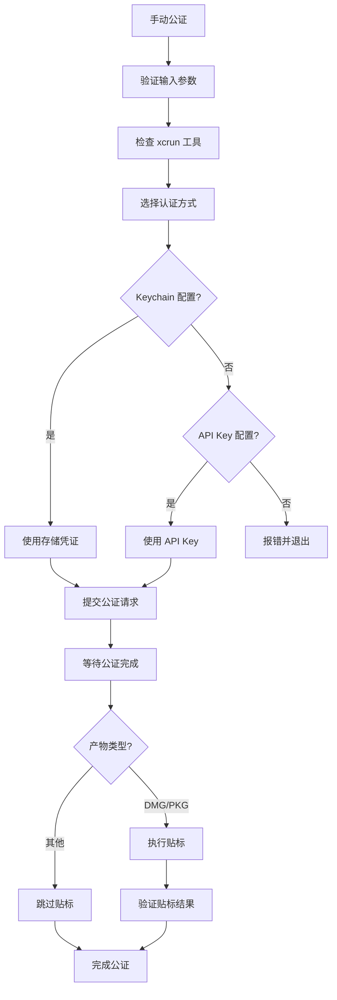

**传统公证支持**：
- **多种认证方式**：支持 Keychain 凭证和 API Key
- **自动贴标**：自动为 DMG/PKG 文件执行贴标
- **验证机制**：公证完成后自动验证结果
- **灵活配置**：支持单独的公证和贴标操作

**章节来源**
- [scripts/notarize-mac-artifact.sh:1-66](file://scripts/notarize-mac-artifact.sh#L1-L66)

### 签名配置管理

**更新** electron-builder.yml 中的签名配置：

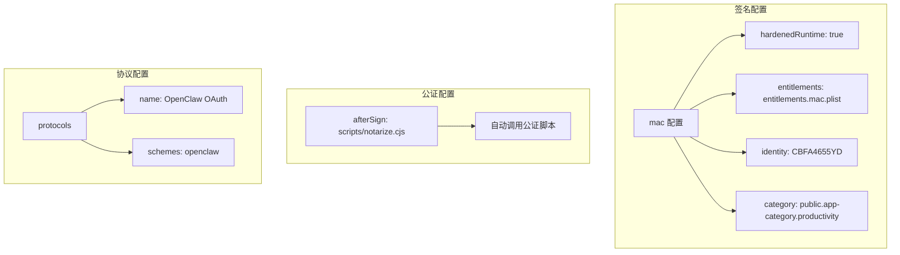

**签名配置要点**：
- **硬化运行时**：启用 macOS 硬化运行时保护
- **权限配置**：通过 entitlements 文件管理应用权限
- **证书标识**：使用固定的开发者证书标识
- **自动公证**：配置打包后的自动公证钩子

**章节来源**
- [apps/electron/electron-builder.yml:111-124](file://apps/electron/electron-builder.yml#L111-L124)
- [apps/electron/electron-builder.yml:108-109](file://apps/electron/electron-builder.yml#L108-L109)

## 依赖关系分析

```mermaid
graph TB
subgraph "开发依赖"
A[electron@31.7.7]
B[electron-builder@25.1.8]
C[tsup@8.4.0]
D[typescript@5.8.3]
E[tsdown@0.21.0]
F[@electron/notarize@3.1.1]
end
subgraph "运行时依赖"
G[react@19.2.4]
H[react-dom@19.2.4]
I[zustand@5.0.11]
J[lucide-react@0.469.0]
K[electron-updater@6.8.3]
end
subgraph "构建工具"
L[concurrently@9.1.2]
M[tailwindcss@4.2.1]
N[@tailwindcss/vite@4.2.1]
O[make 命令]
end
subgraph "扩展系统"
P[memory-core 插件]
Q[device-pair 插件]
R[qwen-portal-auth 插件]
S[minimax-portal-auth 插件]
T[google-gemini-cli-auth 插件]
U[copilot-proxy 插件]
V[telegram 插件]
W[discord 插件]
X[bundled-dir.ts]
Y[bundled-sources.ts]
end
subgraph "运行时管理系统"
Z[packaged-runtime.json]
AA[generate-runtime-package.mjs]
AB[download-node.sh]
AC[package-electron.sh]
AD[package-electron-win.sh]
AE[notarize.cjs]
end
A --> O
B --> F
C --> L
E --> P
Z --> AA
AA --> AB
AB --> AC
AC --> A
AD --> A
AE --> F
X --> Y
```

**图表来源**
- [apps/electron/package.json:18-41](file://apps/electron/package.json#L18-L41)
- [apps/electron/packaged-runtime.json:1-94](file://apps/electron/packaged-runtime.json#L1-L94)
- [apps/electron/scripts/generate-runtime-package.mjs:19-115](file://apps/electron/scripts/generate-runtime-package.mjs#L19-L115)

**章节来源**
- [apps/electron/package.json:18-41](file://apps/electron/package.json#L18-L41)
- [apps/electron/packaged-runtime.json:1-94](file://apps/electron/packaged-runtime.json#L1-L94)

## 性能考虑

### 打包优化策略

**更新** 新增的运行时依赖管理系统带来了显著的性能提升：

1. **智能依赖排除**：通过 neverBundle 配置避免内联大型原生模块
2. **精确版本控制**：使用 pnpm 锁文件确保依赖版本的一致性
3. **架构特定裁剪**：减少不必要的原生模块体积
4. **可复用运行时**：支持运行时依赖的缓存和复用
5. **分阶段构建**：将构建过程分解为可独立优化的步骤
6. **跨平台优化**：针对不同平台优化资源和依赖

### 内存管理

- 预加载脚本限制渲染进程访问 Node.js API
- 主进程管理所有系统级操作
- 窗口生命周期管理，避免内存泄漏
- **扩展自动发现机制**：通过 `resolveBundledPluginsDir()` 函数智能定位扩展目录
- **运行时依赖缓存**：支持运行时依赖的复用，减少重复安装
- **跨平台资源优化**：根据不同平台裁剪不必要的资源

### 运行时依赖优化

**更新** 运行时依赖管理系统的性能优势：
- **动态版本解析**：从多个源解析依赖版本，确保准确性
- **智能依赖排除**：自动排除不能内联的原生模块
- **架构感知裁剪**：根据目标架构优化原生模块
- **增量构建支持**：支持跳过已完成的构建步骤
- **缓存机制**：运行时依赖可被缓存和复用
- **跨平台资源管理**：优化不同平台的资源使用

**章节来源**
- [apps/electron/scripts/generate-runtime-package.mjs:33-89](file://apps/electron/scripts/generate-runtime-package.mjs#L33-L89)
- [apps/electron/scripts/package-electron.sh:81-84](file://apps/electron/scripts/package-electron.sh#L81-L84)

## 故障排除指南

### 常见问题及解决方案

**更新** 新增的跨平台和签名相关问题：

| 问题类型 | 症状 | 解决方案 |
|----------|------|----------|
| 打包失败 | electron-builder 报错 | 检查依赖版本兼容性 |
| 窗口无法显示 | 黑屏或空白页 | 检查静态服务器启动 |
| OAuth 重定向失败 | 回调 URL 无效 | 验证 URL Scheme 配置 |
| 权限问题 | 文件访问被拒绝 | 检查 entitlements 配置 |
| 网络连接失败 | Gateway 无法连接 | 验证防火墙设置 |
| **Windows 打包失败** | 交叉编译错误 | 检查目标架构配置 |
| **公证失败** | 公证超时或失败 | 验证 API Key 和网络连接 |
| **签名问题** | 证书无效 | 检查 Keychain 中的证书 |
| **跨平台资源缺失** | 平台特定文件丢失 | 验证资源路径配置 |
| **运行时依赖缺失** | 应用启动失败 | 检查 packaged-runtime.json 配置 |
| **版本解析失败** | 依赖安装错误 | 验证 pnpm-lock.yaml 和 package.json |
| **原生模块错误** | 崩溃或性能问题 | 检查架构裁剪配置 |
| **Node 运行时问题** | 无法启动可执行文件 | 验证 download-node.sh 执行权限 |
| **扩展未加载** | 多个核心扩展不可用 | 检查扩展捆绑配置 |
| **扩展路径错误** | 扩展路径解析失败 | 验证 bundled-dir.ts 配置 |
| **认证失败** | AI Provider 认证异常 | 检查认证扩展捆绑 |
| **通信失败** | Telegram/Discord 连接问题 | 验证通信扩展配置 |
| **品牌标识问题** | 应用显示 OpenClaw | 检查 electron-builder.yml 配置 |
| **DMG 标题错误** | 安装包显示 OpenClaw | 验证 DMG 标题配置 |

### 跨平台打包调试

**更新** 新增的跨平台打包调试方法：

1. **日志查看**：检查 `~/.openclaw/electron-onboarding.log`
2. **开发者工具**：使用 `Ctrl+Shift+I` 打开开发者工具
3. **网络监控**：观察 WebSocket 连接状态
4. **文件权限**：验证资源文件可执行权限
5. **扩展调试**：检查 `patchConfigForElectron` 日志输出
6. **运行时依赖检查**：验证 `resources/prod-node_modules` 目录
7. **版本解析调试**：检查 `generate-runtime-package.mjs` 输出
8. **架构裁剪验证**：确认原生模块的架构匹配
9. **品牌配置验证**：检查 electron-builder.yml 中的品牌信息
10. **OAuth URL Scheme**：验证 'openclaw' URL Scheme 配置
11. **Windows 资源验证**：确认 Windows 特定资源正确打包
12. **公证配置检查**：验证 notarize.cjs 环境变量设置
13. **跨平台兼容性**：测试不同平台的安装和运行

**更新** 运行时相关调试：
- 查看 `[main] patchConfigForElectron: non-bundled plugin entries present (kept)` 日志
- 验证 `BUNDLED_PLUGIN_IDS` 集合包含所有核心扩展 ID
- 检查扩展捆绑路径是否正确
- 验证扩展清单文件格式是否正确
- **检查运行时依赖安装日志**：确认 `generate-runtime-package.mjs` 成功执行
- **验证 Node 运行时完整性**：确认 `download-node.sh` 成功下载可执行文件
- **调试多部署模式**：根据 `LOCAL_FAST` 环境变量调整构建行为
- **验证品牌配置**：确认应用ID、产品名称、版权信息已更新
- **Windows 打包调试**：验证 package-electron-win.sh 的执行流程
- **公证流程验证**：检查 notarize.cjs 的环境变量和证书配置

**章节来源**
- [apps/electron/src/main/index.ts:77-85](file://apps/electron/src/main/index.ts#L77-L85)
- [apps/electron/src/main/window.ts:202-226](file://apps/electron/src/main/window.ts#L202-L226)
- [apps/electron/src/main/index.ts:254-265](file://apps/electron/src/main/index.ts#L254-L265)
- [apps/electron/scripts/generate-runtime-package.mjs:100-105](file://apps/electron/scripts/generate-runtime-package.mjs#L100-L105)
- [apps/electron/scripts/package-electron-win.sh:162-173](file://apps/electron/scripts/package-electron-win.sh#L162-L173)
- [apps/electron/scripts/notarize.cjs:34-40](file://apps/electron/scripts/notarize.cjs#L34-L40)

## 结论

OpenClaw 的 Electron 打包配置经过重大增强，从单一平台支持发展为完整的跨平台打包解决方案。此次更新引入了 Windows 打包脚本、macOS 自动公证自动化、改进的跨平台支持，以及详细的构建指南，为多平台桌面应用开发提供了完整的参考模板。

**更新总结** 重大增强的核心改进：

### 跨平台打包统一

1. **Windows 支持**：新增 `package-electron-win.sh` 脚本，支持在 macOS/Linux 上交叉编译 Windows 版本
2. **统一构建流程**：macOS 和 Windows 使用相似的构建和打包流程
3. **多架构支持**：同时支持 Apple Silicon (arm64) 和 Intel (x64) 架构
4. **平台特定优化**：针对不同平台优化资源和依赖配置

### 自动化签名和公证

1. **自动公证流程**：通过 `notarize.cjs` 实现签名后的自动公证
2. **环境变量管理**：完善的 API Key 和证书配置支持
3. **错误处理机制**：全面的错误检测和用户提示
4. **传统公证支持**：保留手动公证选项和脚本

### 完整的构建指南

1. **详细文档**：`BUILDING.md` 提供完整的构建和部署指导
2. **命令行工具**：Makefile 命令简化常见操作
3. **环境配置**：清晰的环境变量和证书配置说明
4. **故障排除**：全面的问题诊断和解决指南

### 核心改进亮点

1. **跨平台兼容性**：从单一平台发展为完整的多平台支持
2. **自动化程度大幅提升**：从手动配置转向完全自动化的打包流程
3. **版本控制更加精确**：通过多种源解析确保依赖版本的一致性
4. **部署灵活性增强**：支持本地快速测试和生产发布的不同需求
5. **性能优化显著**：智能依赖排除和架构裁剪减少包体大小
6. **开发体验改善**：统一的构建命令和详细的文档指导

### 技术架构优势

**跨平台打包系统**：
- **统一脚本**：macOS 和 Windows 使用相似的打包逻辑
- **平台特定配置**：通过 electron-builder.yml 管理平台差异
- **资源优化**：针对不同平台裁剪不必要的资源
- **架构感知**：根据目标架构自动调整依赖和配置

**自动化签名系统**：
- **环境变量驱动**：通过环境变量配置 API Key 和证书
- **自动处理**：支持从文件路径或直接内容获取密钥
- **错误恢复**：完善的错误检测和用户友好的提示
- **传统支持**：保留手动公证选项作为后备方案

**构建指南系统**：
- **命令标准化**：通过 Makefile 统一构建命令
- **步骤清晰化**：从设置到验证的完整流程指导
- **问题预防**：提前识别和解决常见问题
- **最佳实践**：推荐的配置和部署方式

**品牌管理集成**：
- **配置集中化**：所有品牌相关信息集中在 electron-builder.yml 中
- **向后兼容性**：OAuth URL Scheme 保持 'openclaw' 以确保兼容性
- **一致性保证**：应用ID、产品名称、版权信息完全统一

该配置为桌面应用开发提供了完整的参考模板，涵盖了从打包配置到运行时管理的各个方面。通过持续的优化和维护，该系统能够为用户提供稳定可靠的桌面应用体验。

**新增功能的技术价值**：
- **开发效率提升**：跨平台打包减少重复工作
- **部署可靠性增强**：自动化的签名和公证流程
- **维护成本降低**：统一的构建和配置管理
- **用户体验改善**：更快的启动速度和更稳定的运行表现
- **跨平台兼容性**：支持更多用户群体
- **品牌管理优化**：统一的品牌标识提升专业度

这一改进体现了现代软件工程中"约定优于配置"的设计理念，通过智能化的默认行为减少了开发者的配置负担，同时保持了系统的灵活性和可扩展性。

**运行时依赖配置列表**：
- **不能内联的依赖**：electron、sharp、playwright-core、sqlite-vec、opusscript、@lydell/node-pty、@napi-rs/canvas、node-llama-cpp、koffi、@matrix-org/matrix-sdk-crypto-nodejs、@whiskeysockets/baileys、esbuild、jiti
- **核心运行时依赖**：包含 openclaw CLI 和 Gateway 所需的 70+ 个核心依赖
- **额外运行时依赖**：koffi、@matrix-org/matrix-sdk-crypto-nodejs、esbuild、jiti 等必须真实安装的依赖
- **预装扩展**：memory-core、device-pair、qwen-portal-auth、minimax-portal-auth、google-gemini-cli-auth、copilot-proxy、telegram、discord

这些配置的自动化管理确保用户在安装时即可获得完整的 Bossim 功能体验，无需额外配置即可使用核心 AI 模型认证和多种消息通道，同时为开发者提供了灵活的部署和调试选项。