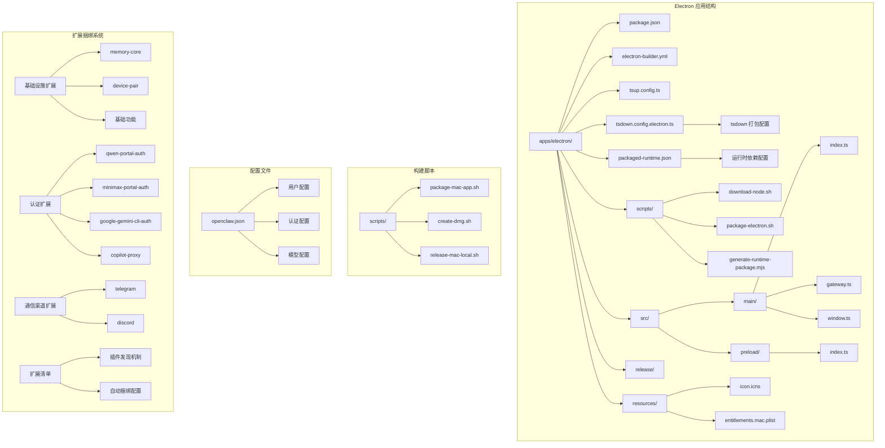
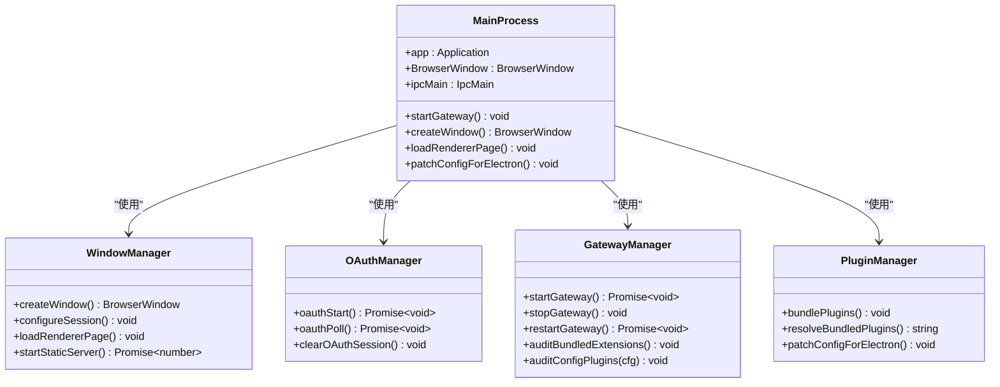
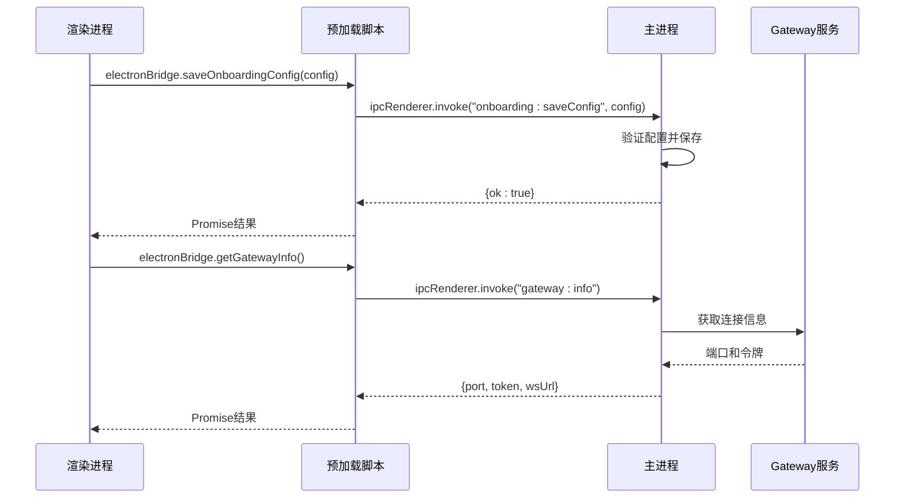
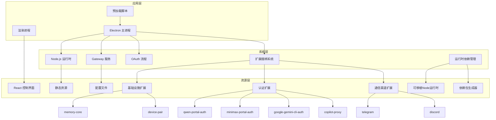
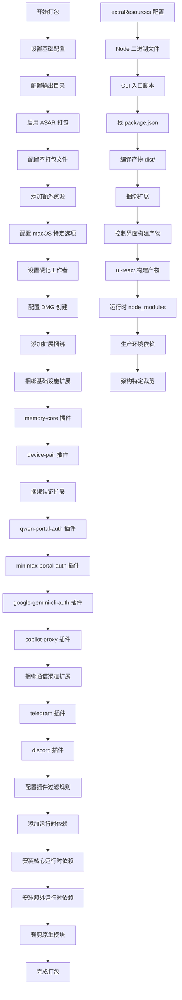
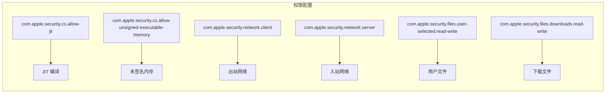
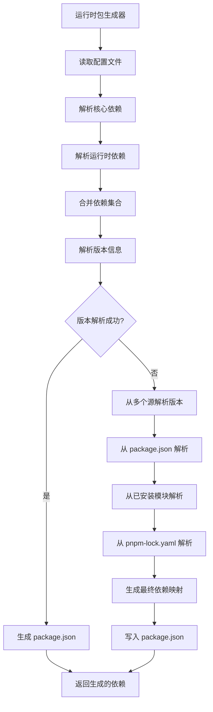
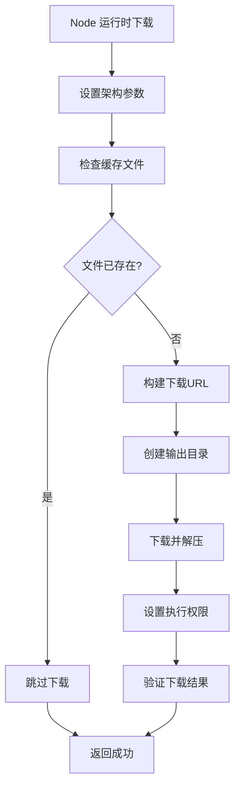
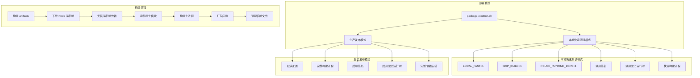
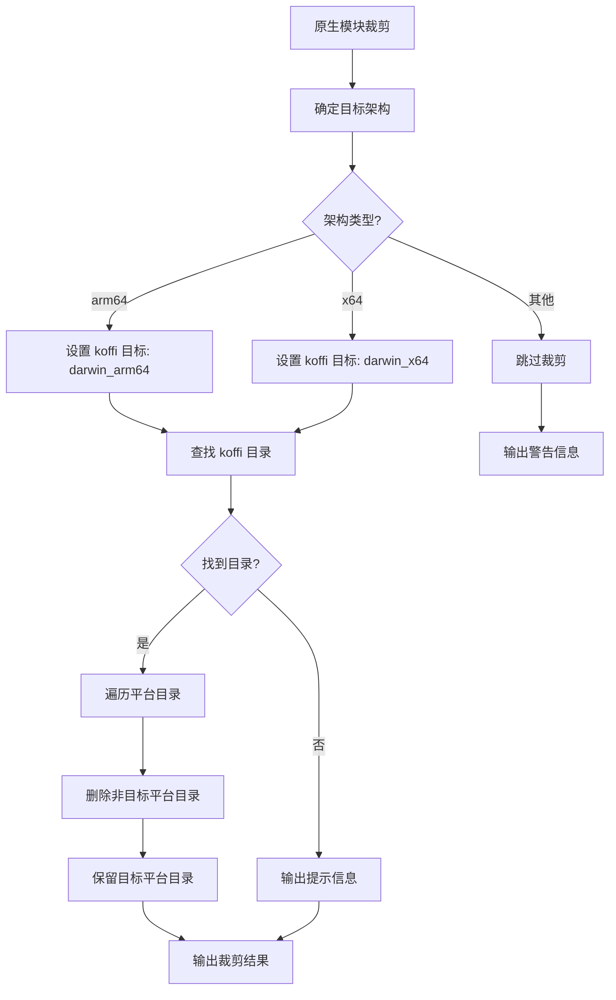

# Electron 打包配置文档

<cite>
**本文档引用的文件**
- [apps/electron/package.json](file://apps/electron/package.json)
- [apps/electron/electron-builder.yml](file://apps/electron/electron-builder.yml)
- [apps/electron/tsup.config.ts](file://apps/electron/tsup.config.ts)
- [apps/electron/tsdown.config.electron.ts](file://apps/electron/tsdown.config.electron.ts)
- [apps/electron/packaged-runtime.json](file://apps/electron/packaged-runtime.json)
- [apps/electron/scripts/download-node.sh](file://apps/electron/scripts/download-node.sh)
- [apps/electron/scripts/package-electron.sh](file://apps/electron/scripts/package-electron.sh)
- [apps/electron/scripts/generate-runtime-package.mjs](file://apps/electron/scripts/generate-runtime-package.mjs)
- [apps/electron/src/main/index.ts](file://apps/electron/src/main/index.ts)
- [apps/electron/src/preload/index.ts](file://apps/electron/src/preload/index.ts)
- [apps/electron/src/main/window.ts](file://apps/electron/src/main/window.ts)
- [apps/electron/src/main/gateway.ts](file://apps/electron/src/main/gateway.ts)
- [apps/electron/resources/entitlements.mac.plist](file://apps/electron/resources/entitlements.mac.plist)
- [scripts/package-mac-app.sh](file://scripts/package-mac-app.sh)
- [scripts/create-dmg.sh](file://scripts/create-dmg.sh)
- [scripts/release-mac-local.sh](file://scripts/release-mac-local.sh)
- [extensions/memory-core/openclaw.plugin.json](file://extensions/memory-core/openclaw.plugin.json)
- [extensions/device-pair/openclaw.plugin.json](file://extensions/device-pair/openclaw.plugin.json)
- [extensions/qwen-portal-auth/openclaw.plugin.json](file://extensions/qwen-portal-auth/openclaw.plugin.json)
- [extensions/minimax-portal-auth/openclaw.plugin.json](file://extensions/minimax-portal-auth/openclaw.plugin.json)
- [extensions/google-gemini-cli-auth/openclaw.plugin.json](file://extensions/google-gemini-cli-auth/openclaw.plugin.json)
- [extensions/copilot-proxy/openclaw.plugin.json](file://extensions/copilot-proxy/openclaw.plugin.json)
- [extensions/telegram/openclaw.plugin.json](file://extensions/telegram/openclaw.plugin.json)
- [extensions/discord/openclaw.plugin.json](file://extensions/discord/openclaw.plugin.json)
- [extensions/memory-core/package.json](file://extensions/memory-core/package.json)
- [extensions/memory-core/index.ts](file://extensions/memory-core/index.ts)
- [src/plugins/bundled-dir.ts](file://src/plugins/bundled-dir.ts)
- [src/plugins/bundled-sources.ts](file://src/plugins/bundled-sources.ts)
</cite>

## 更新摘要
**所做更改**
- 应用ID从 'ai.openclaw.electron' 更新为 'com.verse.bossim'
- 产品名称从 'OpenClaw' 更新为 'Bossim'
- 版权信息从 'OpenClaw Contributors' 更新为 'Bossim Contributors'
- DMG 标题从 'OpenClaw ${version}' 更新为 'Bossim ${version}'
- OAuth URL Scheme 仍保持 'openclaw' 以维持向后兼容性
- 项目描述从 'OpenClaw Electron desktop client' 更新为 'Bossim Electron desktop client'

## 目录
1. [简介](#简介)
2. [项目结构概览](#项目结构概览)
3. [核心组件分析](#核心组件分析)
4. [架构总览](#架构总览)
5. [详细组件分析](#详细组件分析)
6. [运行时依赖管理系统](#运行时依赖管理系统)
7. [多部署模式支持](#多部署模式支持)
8. [依赖关系分析](#依赖关系分析)
9. [性能考虑](#性能考虑)
10. [故障排除指南](#故障排除指南)
11. [结论](#结论)

## 简介

OpenClaw 项目的 Electron 打包配置经过重大重构，从传统的手动依赖管理转变为现代化的自动化运行时依赖管理系统。该系统引入了基于配置的依赖解析机制，实现了精确的版本控制和灵活的部署模式支持。

**更新** 品牌重塑后的配置具有以下核心特性：
- **品牌标识更新**：应用ID、产品名称、版权信息全部更新为 Bossim 品牌
- **DMG 标题更新**：安装包标题显示为 Bossim ${version}
- **OAuth 兼容性**：保持 'openclaw' URL Scheme 以确保向后兼容
- **动态依赖解析**：基于 `packaged-runtime.json` 配置文件动态解析运行时依赖
- **精确版本控制**：通过 pnpm 锁文件和工作区依赖实现精确的版本锁定
- **多部署模式**：支持本地快速测试和生产发布两种部署模式
- **可移植Node运行时**：内置可执行的 Node.js 22 运行时，确保跨平台一致性
- **智能依赖裁剪**：根据目标架构自动裁剪原生模块依赖

该打包配置的主要特点包括：
- 多平台支持（macOS、Windows、Linux）
- 内置 Node.js 运行时环境
- React 控制界面集成
- OAuth 认证流程支持
- 硬化运行时配置
- 自动更新机制
- **自动化运行时依赖管理**（新增）
- **多部署模式支持**（新增）
- **可移植Node运行时**（新增）

## 项目结构概览



**图表来源**
- [apps/electron/package.json:1-39](file://apps/electron/package.json#L1-L39)
- [apps/electron/electron-builder.yml:1-139](file://apps/electron/electron-builder.yml#L1-L139)
- [apps/electron/packaged-runtime.json:1-91](file://apps/electron/packaged-runtime.json#L1-L91)
- [apps/electron/scripts/package-electron.sh:1-182](file://apps/electron/scripts/package-electron.sh#L1-L182)

**章节来源**
- [apps/electron/package.json:1-39](file://apps/electron/package.json#L1-L39)
- [apps/electron/electron-builder.yml:1-139](file://apps/electron/electron-builder.yml#L1-L139)
- [apps/electron/packaged-runtime.json:1-91](file://apps/electron/packaged-runtime.json#L1-L91)

## 核心组件分析

### 主进程配置

主进程是 Electron 应用的核心，负责管理应用生命周期、窗口管理和与系统交互。



**图表来源**
- [apps/electron/src/main/index.ts:1-419](file://apps/electron/src/main/index.ts#L1-L419)
- [apps/electron/src/main/window.ts:1-326](file://apps/electron/src/main/window.ts#L1-L326)
- [apps/electron/src/main/gateway.ts:1-674](file://apps/electron/src/main/gateway.ts#L1-L674)

### 预加载脚本安全桥

预加载脚本实现了安全的上下文桥接，限制渲染进程对 Node.js API 的访问。



**图表来源**
- [apps/electron/src/preload/index.ts:1-96](file://apps/electron/src/preload/index.ts#L1-L96)
- [apps/electron/src/main/index.ts:114-206](file://apps/electron/src/main/index.ts#L114-L206)

**章节来源**
- [apps/electron/src/main/index.ts:1-419](file://apps/electron/src/main/index.ts#L1-L419)
- [apps/electron/src/preload/index.ts:1-96](file://apps/electron/src/preload/index.ts#L1-L96)

## 架构总览



**图表来源**
- [apps/electron/src/main/index.ts:301-386](file://apps/electron/src/main/index.ts#L301-L386)
- [apps/electron/src/main/window.ts:99-136](file://apps/electron/src/main/window.ts#L99-L136)
- [apps/electron/packaged-runtime.json:17-73](file://apps/electron/packaged-runtime.json#L17-L73)

## 详细组件分析

### 打包配置详解

electron-builder.yml 定义了完整的打包配置，现已支持更全面的扩展捆绑和运行时管理：



**更新** 品牌重塑后的配置变更：
- **应用ID**：从 'ai.openclaw.electron' 更新为 'com.verse.bossim'
- **产品名称**：从 'OpenClaw' 更新为 'Bossim'
- **版权信息**：从 'OpenClaw Contributors' 更新为 'Bossim Contributors'
- **DMG 标题**：从 'OpenClaw ${version}' 更新为 'Bossim ${version}'
- **OAuth URL Scheme**：仍为 'openclaw' 以保持兼容性

**图表来源**
- [apps/electron/electron-builder.yml:1-139](file://apps/electron/electron-builder.yml#L1-L139)
- [apps/electron/packaged-runtime.json:17-79](file://apps/electron/packaged-runtime.json#L17-L79)

### 构建工具配置

**更新** tsdown.config.electron.ts 引入了基于配置的依赖管理：

| 配置项 | 值 | 说明 |
|--------|-----|------|
| entry | main/index | 主进程入口文件 |
| outDir | dist | 输出目录 |
| format | cjs | CommonJS 格式 |
| target | node20 | Node.js 20 目标 |
| platform | node | Node.js 平台 |
| external | electron | 外部依赖 |
| sourcemap | true | 生成源码映射 |
| bundle | true | 启用打包 |
| **neverBundle** | packagedRuntime.neverBundleDependencies | **基于配置的原生依赖** |

**更新** 新增的运行时依赖配置：
- **neverBundleDependencies**：定义不能内联的原生/特殊模块
- **NATIVE_EXTERNALS**：从 packaged-runtime.json 动态导入的原生外部依赖
- **智能依赖排除**：自动排除 electron、sharp、playwright-core 等原生模块

**章节来源**
- [apps/electron/electron-builder.yml:1-139](file://apps/electron/electron-builder.yml#L1-L139)
- [apps/electron/tsdown.config.electron.ts:14-28](file://apps/electron/tsdown.config.electron.ts#L14-L28)
- [apps/electron/packaged-runtime.json:2-16](file://apps/electron/packaged-runtime.json#L2-L16)

### macOS 硬化运行时配置

entitlements.mac.plist 定义了 macOS 应用的权限配置：



**图表来源**
- [apps/electron/resources/entitlements.mac.plist:1-25](file://apps/electron/resources/entitlements.mac.plist#L1-L25)

**章节来源**
- [apps/electron/resources/entitlements.mac.plist:1-25](file://apps/electron/resources/entitlements.mac.plist#L1-L25)

### 用户配置管理

openclaw.json 包含了完整的用户配置信息：

| 配置类别 | 说明 | 关键字段 |
|----------|------|----------|
| meta | 应用元数据 | lastTouchedVersion, lastTouchedAt |
| wizard | 引导向导配置 | lastRunAt, lastRunVersion |
| auth | 认证配置 | profiles, provider, mode |
| models | 模型配置 | providers, models, contextWindow |
| agents | 代理配置 | defaults, workspace |
| gateway | 网关配置 | port, mode, auth, nodes |
| **plugins** | **扩展配置** | **entries, minimax-portal-auth: enabled** |

**章节来源**
- [apps/electron/openclaw.json:1-142](file://apps/electron/openclaw.json#L1-L142)

## 运行时依赖管理系统

**更新** 新增的自动化运行时依赖管理系统实现了从手动管理到智能配置的转变。

### 运行时依赖配置

packaged-runtime.json 定义了 Electron 应用的运行时依赖配置：

```mermaid
graph TB
subgraph "运行时依赖配置"
A[packaged-runtime.json] --> B[neverBundleDependencies]
A --> C[coreRuntimeDependencies]
A --> D[runtimeDependencies]
A --> E[preinstalledExtensions]
end
subgraph "neverBundleDependencies"
B --> F[electron]
B --> G[sharp]
B --> H[playwright-core]
B --> I[sqlite-vec]
B --> J[opusscript]
B --> K[@lydell/node-pty]
B --> L[@napi-rs/canvas]
B --> M[node-llama-cpp]
B --> N[koffi]
B --> O[@matrix-org/matrix-sdk-crypto-nodejs]
B --> P[@whiskeysockets/baileys]
B --> Q[esbuild]
B --> R[jiti]
end
subgraph "coreRuntimeDependencies"
C --> S[@agentclientprotocol/sdk]
C --> T[@aws-sdk/client-bedrock]
C --> U[@buape/carbon]
C --> V[@clack/prompts]
C --> W[... 多个核心依赖]
end
subgraph "runtimeDependencies"
D --> X[koffi]
D --> Y[@matrix-org/matrix-sdk-crypto-nodejs]
D --> Z[esbuild]
D --> AA[jiti]
end
subgraph "preinstalledExtensions"
E --> AB[memory-core]
E --> AC[device-pair]
E --> AD[qwen-portal-auth]
E --> AE[minimax-portal-auth]
E --> AF[google-gemini-cli-auth]
E --> AG[copilot-proxy]
E --> AH[telegram]
E --> AI[discord]
end
```

**图表来源**
- [apps/electron/packaged-runtime.json:1-94](file://apps/electron/packaged-runtime.json#L1-L94)

### 运行时包生成器

**更新** generate-runtime-package.mjs 实现了运行时依赖的精确版本解析：



**版本解析策略**：
1. **优先级1**：从 packaged-runtime.json 的直接依赖映射
2. **优先级2**：从根 package.json 的依赖声明
3. **优先级3**：从已安装的 node_modules 解析实际版本
4. **优先级4**：从 pnpm-lock.yaml 的锁定版本解析

**章节来源**
- [apps/electron/packaged-runtime.json:1-94](file://apps/electron/packaged-runtime.json#L1-L94)
- [apps/electron/scripts/generate-runtime-package.mjs:19-115](file://apps/electron/scripts/generate-runtime-package.mjs#L19-L115)

### Node.js 运行时管理

**更新** download-node.sh 提供了可移植的 Node.js 运行时：



**支持的架构**：
- **arm64**：Apple Silicon Mac（darwin-arm64）
- **x64**：Intel Mac（darwin-x64）
- **版本**：Node.js 22.15.0（长期支持版本）

**章节来源**
- [apps/electron/scripts/download-node.sh:1-33](file://apps/electron/scripts/download-node.sh#L1-L33)

## 多部署模式支持

**更新** package-electron.sh 引入了灵活的多部署模式支持。

### 部署模式配置

**更新** 支持的部署模式及其特点：



**环境变量控制**：
- **LOCAL_FAST**：启用本地快速测试模式
- **SKIP_BUILD**：跳过构建步骤
- **REUSE_RUNTIME_DEPS**：复用已有的运行时依赖
- **ARCH**：目标架构（arm64/x64）

**章节来源**
- [apps/electron/scripts/package-electron.sh:15-23](file://apps/electron/scripts/package-electron.sh#L15-L23)
- [apps/electron/scripts/package-electron.sh:61-92](file://apps/electron/scripts/package-electron.sh#L61-L92)

### 架构特定依赖裁剪

**更新** prune_runtime_dependencies 函数实现了架构特定的原生模块裁剪：



**裁剪范围**：
- **koffi**：裁剪到目标架构的原生二进制
- **其他原生模块**：根据架构需求进行相应的裁剪
- **目标架构**：支持 arm64（Apple Silicon）和 x64（Intel）

**章节来源**
- [apps/electron/scripts/package-electron.sh:94-139](file://apps/electron/scripts/package-electron.sh#L94-L139)

## 依赖关系分析

```mermaid
graph TB
subgraph "开发依赖"
A[electron@31.7.7]
B[electron-builder@25.1.8]
C[tsup@8.4.0]
D[typescript@5.8.3]
E[tsdown@0.21.0]
end
subgraph "运行时依赖"
F[react@19.2.4]
G[react-dom@19.2.4]
H[zustand@5.0.11]
I[lucide-react@0.469.0]
end
subgraph "构建工具"
J[concurrently@9.1.2]
K[tailwindcss@4.2.1]
L[@tailwindcss/vite@4.2.1]
end
subgraph "扩展系统"
M[memory-core 插件]
N[device-pair 插件]
O[qwen-portal-auth 插件]
P[minimax-portal-auth 插件]
Q[google-gemini-cli-auth 插件]
R[copilot-proxy 插件]
S[telegram 插件]
T[discord 插件]
U[bundled-dir.ts]
V[bundled-sources.ts]
end
subgraph "运行时管理系统"
W[packaged-runtime.json]
X[generate-runtime-package.mjs]
Y[download-node.sh]
Z[package-electron.sh]
end
A --> J
B --> K
C --> L
E --> M
W --> X
X --> Y
Y --> Z
Z --> A
U --> V
```

**图表来源**
- [apps/electron/package.json:17-37](file://apps/electron/package.json#L17-L37)
- [apps/electron/packaged-runtime.json:1-94](file://apps/electron/packaged-runtime.json#L1-L94)
- [apps/electron/scripts/generate-runtime-package.mjs:19-115](file://apps/electron/scripts/generate-runtime-package.mjs#L19-L115)

**章节来源**
- [apps/electron/package.json:17-37](file://apps/electron/package.json#L17-L37)
- [apps/electron/packaged-runtime.json:1-94](file://apps/electron/packaged-runtime.json#L1-L94)

## 性能考虑

### 打包优化策略

**更新** 新增的运行时依赖管理系统带来了显著的性能提升：

1. **智能依赖排除**：通过 neverBundle 配置避免内联大型原生模块
2. **精确版本控制**：使用 pnpm 锁文件确保依赖版本的一致性
3. **架构特定裁剪**：减少不必要的原生模块体积
4. **可复用运行时**：支持运行时依赖的缓存和复用
5. **分阶段构建**：将构建过程分解为可独立优化的步骤

### 内存管理

- 预加载脚本限制渲染进程访问 Node.js API
- 主进程管理所有系统级操作
- 窗口生命周期管理，避免内存泄漏
- **扩展自动发现机制**：通过 `resolveBundledPluginsDir()` 函数智能定位扩展目录
- **运行时依赖缓存**：支持运行时依赖的复用，减少重复安装

### 运行时依赖优化

**更新** 运行时依赖管理系统的性能优势：
- **动态版本解析**：从多个源解析依赖版本，确保准确性
- **智能依赖排除**：自动排除不能内联的原生模块
- **架构感知裁剪**：根据目标架构优化原生模块
- **增量构建支持**：支持跳过已完成的构建步骤
- **缓存机制**：运行时依赖可被缓存和复用

**章节来源**
- [apps/electron/scripts/generate-runtime-package.mjs:33-89](file://apps/electron/scripts/generate-runtime-package.mjs#L33-L89)
- [apps/electron/scripts/package-electron.sh:81-84](file://apps/electron/scripts/package-electron.sh#L81-L84)

## 故障排除指南

### 常见问题及解决方案

**更新** 新增的运行时依赖管理相关问题：

| 问题类型 | 症状 | 解决方案 |
|----------|------|----------|
| 打包失败 | electron-builder 报错 | 检查依赖版本兼容性 |
| 窗口无法显示 | 黑屏或空白页 | 检查静态服务器启动 |
| OAuth 重定向失败 | 回调 URL 无效 | 验证 URL Scheme 配置 |
| 权限问题 | 文件访问被拒绝 | 检查 entitlements 配置 |
| 网络连接失败 | Gateway 无法连接 | 验证防火墙设置 |
| **运行时依赖缺失** | 应用启动失败 | **检查 packaged-runtime.json 配置** |
| **版本解析失败** | 依赖安装错误 | **验证 pnpm-lock.yaml 和 package.json** |
| **原生模块错误** | 崩溃或性能问题 | **检查架构裁剪配置** |
| **Node 运行时问题** | 无法启动可执行文件 | **验证 download-node.sh 执行权限** |
| **扩展未加载** | 多个核心扩展不可用 | **检查扩展捆绑配置** |
| **扩展路径错误** | 扩展路径解析失败 | **验证 bundled-dir.ts 配置** |
| **认证失败** | AI Provider 认证异常 | **检查认证扩展捆绑** |
| **通信失败** | Telegram/Discord 连接问题 | **验证通信扩展配置** |
| **品牌标识问题** | 应用显示 OpenClaw | **检查 electron-builder.yml 配置** |
| **DMG 标题错误** | 安装包显示 OpenClaw | **验证 DMG 标题配置** |

### 调试技巧

**更新** 新增的运行时依赖管理调试方法：

1. **日志查看**：检查 `~/.openclaw/electron-onboarding.log`
2. **开发者工具**：使用 `Ctrl+Shift+I` 打开开发者工具
3. **网络监控**：观察 WebSocket 连接状态
4. **文件权限**：验证资源文件可执行权限
5. **扩展调试**：检查 `patchConfigForElectron` 日志输出
6. **运行时依赖检查**：验证 `resources/prod-node_modules` 目录
7. **版本解析调试**：检查 `generate-runtime-package.mjs` 输出
8. **架构裁剪验证**：确认原生模块的架构匹配
9. **品牌配置验证**：检查 electron-builder.yml 中的品牌信息
10. **OAuth URL Scheme**：验证 'openclaw' URL Scheme 配置

**更新** 运行时相关调试：
- 查看 `[main] patchConfigForElectron: non-bundled plugin entries present (kept)` 日志
- 验证 `BUNDLED_PLUGIN_IDS` 集合包含所有核心扩展 ID
- 检查扩展捆绑路径是否正确
- 验证扩展清单文件格式是否正确
- **检查运行时依赖安装日志**：确认 `generate-runtime-package.mjs` 成功执行
- **验证 Node 运行时完整性**：确认 `download-node.sh` 成功下载可执行文件
- **调试多部署模式**：根据 `LOCAL_FAST` 环境变量调整构建行为
- **验证品牌配置**：确认应用ID、产品名称、版权信息已更新

**章节来源**
- [apps/electron/src/main/index.ts:77-85](file://apps/electron/src/main/index.ts#L77-L85)
- [apps/electron/src/main/window.ts:202-226](file://apps/electron/src/main/window.ts#L202-L226)
- [apps/electron/src/main/index.ts:254-265](file://apps/electron/src/main/index.ts#L254-L265)
- [apps/electron/scripts/generate-runtime-package.mjs:100-105](file://apps/electron/scripts/generate-runtime-package.mjs#L100-L105)

## 结论

OpenClaw 的 Electron 打包配置经过重大重构，从手动依赖管理转变为现代化的自动化运行时依赖管理系统。此次品牌重塑进一步完善了配置体系，实现了从 OpenClaw 到 Bossim 的完整迁移。

**更新总结** 品牌重塑后的核心改进：

### 品牌标识统一

1. **应用ID标准化**：从 'ai.openclaw.electron' 更新为 'com.verse.bossim'
2. **产品名称一致化**：从 'OpenClaw' 更新为 'Bossim'
3. **版权信息规范化**：从 'OpenClaw Contributors' 更新为 'Bossim Contributors'
4. **DMG 标题品牌化**：从 'OpenClaw ${version}' 更新为 'Bossim ${version}'
5. **OAuth 兼容性保持**：'openclaw' URL Scheme 保持不变

### 核心改进亮点

1. **自动化程度大幅提升**：从手动配置转向基于配置的自动化管理
2. **版本控制更加精确**：通过多种源解析确保依赖版本的一致性
3. **部署灵活性增强**：支持本地快速测试和生产发布的不同需求
4. **跨平台兼容性改善**：内置 Node.js 运行时确保环境一致性
5. **性能优化显著**：智能依赖排除和架构裁剪减少包体大小
6. **品牌管理规范化**：统一的品牌标识提升用户体验

### 技术架构优势

**运行时依赖管理系统**：
- **配置驱动**：通过 `packaged-runtime.json` 集中管理所有运行时依赖
- **版本锁定**：利用 pnpm 锁文件确保依赖版本的精确控制
- **智能排除**：自动识别和排除不能内联的原生模块
- **架构感知**：根据目标架构自动裁剪原生模块

**多部署模式支持**：
- **本地快速测试**：跳过签名和硬化运行时，加速开发迭代
- **生产发布模式**：完整的安全配置和签名流程
- **增量构建**：支持跳过已完成的构建步骤，提高效率

**可移植Node运行时**：
- **内置运行时**：避免系统环境差异带来的问题
- **架构适配**：支持 Apple Silicon 和 Intel Mac 的原生运行
- **版本管理**：统一的 Node.js 版本确保兼容性

**品牌管理集成**：
- **配置集中化**：所有品牌相关信息集中在 electron-builder.yml 中
- **向后兼容性**：OAuth URL Scheme 保持 'openclaw' 以确保兼容性
- **一致性保证**：应用ID、产品名称、版权信息完全统一

该配置为桌面应用开发提供了完整的参考模板，涵盖了从打包配置到运行时管理的各个方面。通过持续的优化和维护，该系统能够为用户提供稳定可靠的桌面应用体验。

**新增功能的技术价值**：
- **开发效率提升**：自动化配置减少手动干预
- **部署可靠性增强**：精确的版本控制降低兼容性问题
- **维护成本降低**：集中化的配置管理简化维护工作
- **用户体验改善**：更快的启动速度和更稳定的运行表现
- **品牌管理优化**：统一的品牌标识提升专业度

这一改进体现了现代软件工程中"约定优于配置"的设计理念，通过智能化的默认行为减少了开发者的配置负担，同时保持了系统的灵活性和可扩展性。

**运行时依赖配置列表**：
- **不能内联的依赖**：electron、sharp、playwright-core、sqlite-vec、opusscript、@lydell/node-pty、@napi-rs/canvas、node-llama-cpp、koffi、@matrix-org/matrix-sdk-crypto-nodejs、@whiskeysockets/baileys、esbuild、jiti
- **核心运行时依赖**：包含 openclaw CLI 和 Gateway 所需的 70+ 个核心依赖
- **额外运行时依赖**：koffi、@matrix-org/matrix-sdk-crypto-nodejs、esbuild、jiti 等必须真实安装的依赖
- **预装扩展**：memory-core、device-pair、qwen-portal-auth、minimax-portal-auth、google-gemini-cli-auth、copilot-proxy、telegram、discord

这些配置的自动化管理确保用户在安装时即可获得完整的 Bossim 功能体验，无需额外配置即可使用核心 AI 模型认证和多种消息通道，同时为开发者提供了灵活的部署和调试选项。