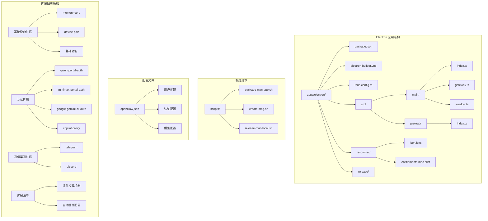
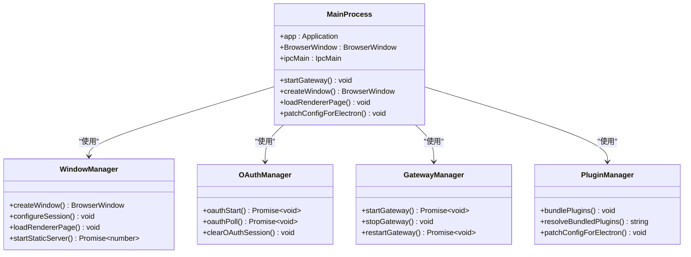
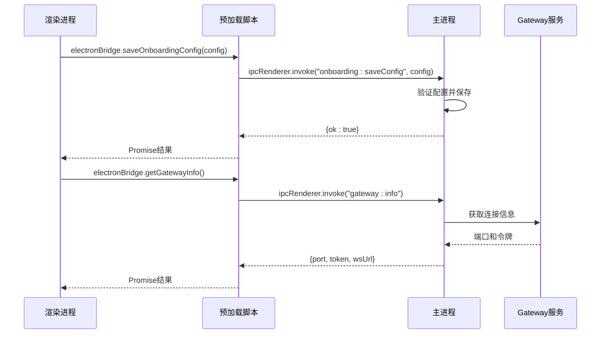
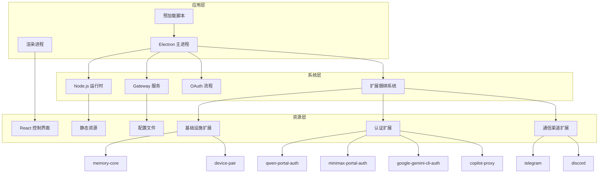
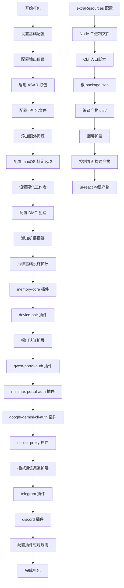
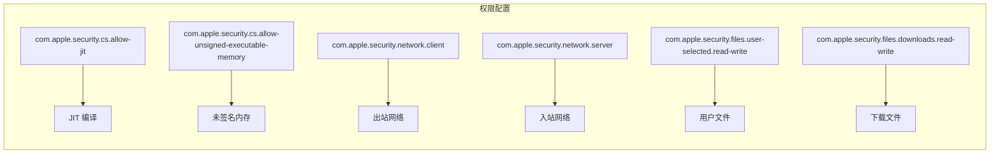
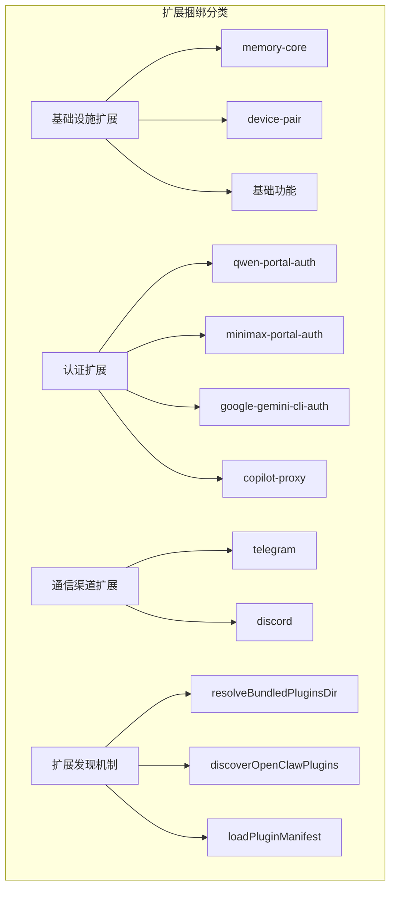
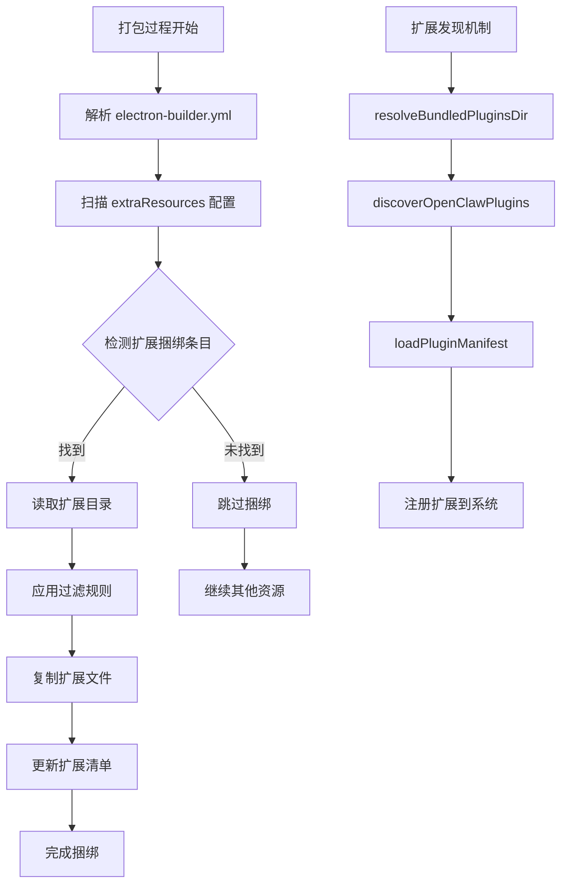

# Electron 打包配置文档

<cite>
**本文档引用的文件**
- [apps/electron/package.json](file://apps/electron/package.json)
- [apps/electron/electron-builder.yml](file://apps/electron/electron-builder.yml)
- [apps/electron/tsup.config.ts](file://apps/electron/tsup.config.ts)
- [apps/electron/openclaw.json](file://apps/electron/openclaw.json)
- [apps/electron/src/main/index.ts](file://apps/electron/src/main/index.ts)
- [apps/electron/src/preload/index.ts](file://apps/electron/src/preload/index.ts)
- [apps/electron/src/main/window.ts](file://apps/electron/src/main/window.ts)
- [apps/electron/resources/entitlements.mac.plist](file://apps/electron/resources/entitlements.mac.plist)
- [scripts/package-mac-app.sh](file://scripts/package-mac-app.sh)
- [scripts/create-dmg.sh](file://scripts/create-dmg.sh)
- [scripts/release-mac-local.sh](file://scripts/release-mac-local.sh)
- [extensions/memory-core/openclaw.plugin.json](file://extensions/memory-core/openclaw.plugin.json)
- [extensions/device-pair/openclaw.plugin.json](file://extensions/device-pair/openclaw.plugin.json)
- [extensions/qwen-portal-auth/openclaw.plugin.json](file://extensions/qwen-portal-auth/openclaw.plugin.json)
- [extensions/minimax-portal-auth/openclaw.plugin.json](file://extensions/minimax-portal-auth/openclaw.plugin.json)
- [extensions/google-gemini-cli-auth/openclaw.plugin.json](file://extensions/google-gemini-cli-auth/openclaw.plugin.json)
- [extensions/copilot-proxy/openclaw.plugin.json](file://extensions/copilot-proxy/openclaw.plugin.json)
- [extensions/telegram/openclaw.plugin.json](file://extensions/telegram/openclaw.plugin.json)
- [extensions/discord/openclaw.plugin.json](file://extensions/discord/openclaw.plugin.json)
- [extensions/memory-core/package.json](file://extensions/memory-core/package.json)
- [extensions/memory-core/index.ts](file://extensions/memory-core/index.ts)
- [src/plugins/bundled-dir.ts](file://src/plugins/bundled-dir.ts)
- [src/plugins/bundled-sources.ts](file://src/plugins/bundled-sources.ts)
</cite>

## 更新摘要
**所做更改**
- 新增了更全面的扩展捆绑功能，涵盖多个核心扩展的自动捆绑配置
- 更新了打包配置中插件捆绑部分的架构图，展示完整的扩展生态系统
- 增强了插件系统与打包流程的集成说明，包括基础设施、认证和通信渠道扩展
- 添加了扩展分类组织的详细说明和技术实现细节
- 更新了扩展自动捆绑配置的完整实现列表

## 目录
1. [简介](#简介)
2. [项目结构概览](#项目结构概览)
3. [核心组件分析](#核心组件分析)
4. [架构总览](#架构总览)
5. [详细组件分析](#详细组件分析)
6. [扩展捆绑系统](#扩展捆绑系统)
7. [依赖关系分析](#依赖关系分析)
8. [性能考虑](#性能考虑)
9. [故障排除指南](#故障排除指南)
10. [结论](#结论)

## 简介

OpenClaw 项目的 Electron 打包配置是一个完整的桌面应用程序构建系统，专注于提供跨平台的桌面客户端体验。该配置实现了现代化的打包流程，集成了 Node.js 环境、React 前端界面以及本地 Gateway 服务。

**更新** 新增了更全面的扩展捆绑功能，实现了对多个核心扩展的自动捆绑配置。该系统现已支持包括 memory-core、device-pair、qwen-portal-auth、minimax-portal-auth、google-gemini-cli-auth、copilot-proxy、telegram 和 discord 等在内的完整扩展生态系统，确保用户在安装时即可获得开箱即用的完整功能体验。

该打包配置的主要特点包括：
- 多平台支持（macOS、Windows、Linux）
- 内置 Node.js 运行时环境
- React 控制界面集成
- OAuth 认证流程支持
- 硬化运行时配置
- 自动更新机制
- **全面的扩展自动捆绑功能**（新增）

## 项目结构概览



**图表来源**
- [apps/electron/package.json:1-39](file://apps/electron/package.json#L1-L39)
- [apps/electron/electron-builder.yml:1-124](file://apps/electron/electron-builder.yml#L1-L124)
- [extensions/memory-core/openclaw.plugin.json:1-10](file://extensions/memory-core/openclaw.plugin.json#L1-L10)

**章节来源**
- [apps/electron/package.json:1-39](file://apps/electron/package.json#L1-L39)
- [apps/electron/electron-builder.yml:1-124](file://apps/electron/electron-builder.yml#L1-L124)

## 核心组件分析

### 主进程配置

主进程是 Electron 应用的核心，负责管理应用生命周期、窗口管理和与系统交互。



**图表来源**
- [apps/electron/src/main/index.ts:1-404](file://apps/electron/src/main/index.ts#L1-L404)
- [apps/electron/src/main/window.ts:1-326](file://apps/electron/src/main/window.ts#L1-L326)

### 预加载脚本安全桥

预加载脚本实现了安全的上下文桥接，限制渲染进程对 Node.js API 的访问。



**图表来源**
- [apps/electron/src/preload/index.ts:1-96](file://apps/electron/src/preload/index.ts#L1-L96)
- [apps/electron/src/main/index.ts:114-206](file://apps/electron/src/main/index.ts#L114-L206)

**章节来源**
- [apps/electron/src/main/index.ts:1-404](file://apps/electron/src/main/index.ts#L1-L404)
- [apps/electron/src/preload/index.ts:1-96](file://apps/electron/src/preload/index.ts#L1-L96)

## 架构总览



**图表来源**
- [apps/electron/src/main/index.ts:301-386](file://apps/electron/src/main/index.ts#L301-L386)
- [apps/electron/src/main/window.ts:99-136](file://apps/electron/src/main/window.ts#L99-L136)

## 详细组件分析

### 打包配置详解

electron-builder.yml 定义了完整的打包配置，现已支持更全面的扩展捆绑：



**更新** 新增了更全面的扩展捆绑配置，包括：
- **基础设施扩展**：memory-core、device-pair
- **认证扩展**：qwen-portal-auth、minimax-portal-auth、google-gemini-cli-auth、copilot-proxy
- **通信渠道扩展**：telegram、discord

**图表来源**
- [apps/electron/electron-builder.yml:1-124](file://apps/electron/electron-builder.yml#L1-L124)

### 构建工具配置

tsup.config.ts 定义了 TypeScript 编译配置：

| 配置项 | 值 | 说明 |
|--------|-----|------|
| entry | main/index | 主进程入口文件 |
| outDir | dist | 输出目录 |
| format | cjs | CommonJS 格式 |
| target | node20 | Node.js 20 目标 |
| platform | node | Node.js 平台 |
| external | electron | 外部依赖 |
| sourcemap | true | 生成源码映射 |
| bundle | true | 启用打包 |

**章节来源**
- [apps/electron/electron-builder.yml:1-124](file://apps/electron/electron-builder.yml#L1-L124)
- [apps/electron/tsup.config.ts:1-29](file://apps/electron/tsup.config.ts#L1-L29)

### macOS 硬化运行时配置

entitlements.mac.plist 定义了 macOS 应用的权限配置：



**图表来源**
- [apps/electron/resources/entitlements.mac.plist:1-25](file://apps/electron/resources/entitlements.mac.plist#L1-L25)

**章节来源**
- [apps/electron/resources/entitlements.mac.plist:1-25](file://apps/electron/resources/entitlements.mac.plist#L1-L25)

### 用户配置管理

openclaw.json 包含了完整的用户配置信息：

| 配置类别 | 说明 | 关键字段 |
|----------|------|----------|
| meta | 应用元数据 | lastTouchedVersion, lastTouchedAt |
| wizard | 引导向导配置 | lastRunAt, lastRunVersion |
| auth | 认证配置 | profiles, provider, mode |
| models | 模型配置 | providers, models, contextWindow |
| agents | 代理配置 | defaults, workspace |
| gateway | 网关配置 | port, mode, auth, nodes |
| **plugins** | **扩展配置** | **entries, minimax-portal-auth: enabled** |

**章节来源**
- [apps/electron/openclaw.json:1-142](file://apps/electron/openclaw.json#L1-L142)

## 扩展捆绑系统

**更新** 新增了更全面的扩展捆绑系统，实现了对多个核心扩展的自动捆绑配置。

### 扩展分类组织

扩展捆绑系统按照功能分类进行组织，确保用户获得完整的功能体验：



**图表来源**
- [apps/electron/electron-builder.yml:44-75](file://apps/electron/electron-builder.yml#L44-L75)
- [src/plugins/bundled-dir.ts:5-41](file://src/plugins/bundled-dir.ts#L5-L41)

### 扩展捆绑配置详解

**更新** electron-builder.yml 中的扩展捆绑配置现已覆盖多个核心扩展：

#### 基础设施扩展
- **memory-core**：核心内存管理功能
- **device-pair**：设备配对和连接管理

#### 认证扩展
- **qwen-portal-auth**：通义千问门户认证
- **minimax-portal-auth**：MiniMax 门户认证  
- **google-gemini-cli-auth**：Google Gemini 命令行认证
- **copilot-proxy**：GitHub Copilot 代理

#### 通信渠道扩展
- **telegram**：Telegram 消息通道
- **discord**：Discord 消息通道

**章节来源**
- [apps/electron/electron-builder.yml:44-75](file://apps/electron/electron-builder.yml#L44-L75)

### 插件自动捆绑机制

**更新** 扩展捆绑系统通过以下机制实现：



**扩展捆绑配置详情**：
- **源路径**：`../../extensions`
- **目标路径**：`openclaw/extensions`
- **过滤规则**：排除 node_modules 和 .map 文件
- **扩展 ID 列表**：memory-core、device-pair、qwen-portal-auth、minimax-portal-auth、google-gemini-cli-auth、copilot-proxy、telegram、discord

**章节来源**
- [apps/electron/electron-builder.yml:44-75](file://apps/electron/electron-builder.yml#L44-L75)
- [extensions/memory-core/openclaw.plugin.json:1-10](file://extensions/memory-core/openclaw.plugin.json#L1-L10)
- [extensions/device-pair/openclaw.plugin.json:1-21](file://extensions/device-pair/openclaw.plugin.json#L1-L21)
- [extensions/qwen-portal-auth/openclaw.plugin.json:1-10](file://extensions/qwen-portal-auth/openclaw.plugin.json#L1-L10)
- [extensions/minimax-portal-auth/openclaw.plugin.json:1-10](file://extensions/minimax-portal-auth/openclaw.plugin.json#L1-L10)
- [extensions/google-gemini-cli-auth/openclaw.plugin.json:1-10](file://extensions/google-gemini-cli-auth/openclaw.plugin.json#L1-L10)
- [extensions/copilot-proxy/openclaw.plugin.json:1-10](file://extensions/copilot-proxy/openclaw.plugin.json#L1-L10)
- [extensions/telegram/openclaw.plugin.json:1-10](file://extensions/telegram/openclaw.plugin.json#L1-L10)
- [extensions/discord/openclaw.plugin.json:1-10](file://extensions/discord/openclaw.plugin.json#L1-L10)

## 依赖关系分析

```mermaid
graph TB
subgraph "开发依赖"
A[electron@31.7.7]
B[electron-builder@25.1.8]
C[tsup@8.4.0]
D[typescript@5.8.3]
end
subgraph "运行时依赖"
E[react@19.2.4]
F[react-dom@19.2.4]
G[zustand@5.0.11]
H[lucide-react@0.469.0]
end
subgraph "构建工具"
I[concurrently@9.1.2]
J[tailwindcss@4.2.1]
K[@tailwindcss/vite@4.2.1]
end
subgraph "扩展系统"
L[memory-core 插件]
M[device-pair 插件]
N[qwen-portal-auth 插件]
O[minimax-portal-auth 插件]
P[google-gemini-cli-auth 插件]
Q[copilot-proxy 插件]
R[telegram 插件]
S[discord 插件]
T[bundled-dir.ts]
U[bundled-sources.ts]
end
A --> J
B --> K
C --> L
T --> U
V[electron-builder] --> W[打包输出]
X[tsup] --> Y[主进程打包]
Z[扩展捆绑] --> AA[自动发现机制]
AA --> BB[resolveBundledPluginsDir]
BB --> CC[discoverOpenClawPlugins]
CC --> DD[loadPluginManifest]
```

**图表来源**
- [apps/electron/package.json:17-37](file://apps/electron/package.json#L17-L37)
- [src/plugins/bundled-dir.ts:1-42](file://src/plugins/bundled-dir.ts#L1-L42)
- [src/plugins/bundled-sources.ts:1-77](file://src/plugins/bundled-sources.ts#L1-L77)

**章节来源**
- [apps/electron/package.json:17-37](file://apps/electron/package.json#L17-L37)

## 性能考虑

### 打包优化策略

1. **ASAR 打包**：启用 ASAR 可以提高文件访问性能
2. **资源分离**：`.node` 文件不被打包，保持可执行权限
3. **条件加载**：开发和生产环境采用不同的加载策略
4. **缓存机制**：静态服务器端口缓存避免重复启动
5. **智能扩展捆绑**：仅捆绑必要的扩展，减少包体大小

### 内存管理

- 预加载脚本限制渲染进程访问 Node.js API
- 主进程管理所有系统级操作
- 窗口生命周期管理，避免内存泄漏
- **扩展自动发现机制**：通过 `resolveBundledPluginsDir()` 函数智能定位扩展目录

### 扩展系统优化

**更新** 扩展自动捆绑功能的性能优势：
- **减少手动干预**：无需手动指定扩展路径
- **智能路径解析**：支持多种扩展目录布局
- **条件加载**：仅在开发模式下启用某些功能
- **缓存机制**：扩展发现结果可被缓存和复用
- **分组优化**：按功能分类组织扩展，便于维护和更新

**章节来源**
- [src/plugins/bundled-dir.ts:5-41](file://src/plugins/bundled-dir.ts#L5-L41)

## 故障排除指南

### 常见问题及解决方案

| 问题类型 | 症状 | 解决方案 |
|----------|------|----------|
| 打包失败 | electron-builder 报错 | 检查依赖版本兼容性 |
| 窗口无法显示 | 黑屏或空白页 | 检查静态服务器启动 |
| OAuth 重定向失败 | 回调 URL 无效 | 验证 URL Scheme 配置 |
| 权限问题 | 文件访问被拒绝 | 检查 entitlements 配置 |
| 网络连接失败 | Gateway 无法连接 | 验证防火墙设置 |
| **扩展未加载** | 多个核心扩展不可用 | **检查扩展捆绑配置** |
| **扩展路径错误** | 扩展路径解析失败 | **验证 bundled-dir.ts 配置** |
| **认证失败** | AI Provider 认证异常 | **检查认证扩展捆绑** |
| **通信失败** | Telegram/Discord 连接问题 | **验证通信扩展配置** |

### 调试技巧

1. **日志查看**：检查 `~/.openclaw/electron-onboarding.log`
2. **开发者工具**：使用 `Ctrl+Shift+I` 打开开发者工具
3. **网络监控**：观察 WebSocket 连接状态
4. **文件权限**：验证资源文件可执行权限
5. **扩展调试**：检查 `patchConfigForElectron` 日志输出

**更新** 扩展相关调试：
- 查看 `[main] patchConfigForElectron: non-bundled plugin entries present (kept)` 日志
- 验证 `BUNDLED_PLUGIN_IDS` 集合包含所有核心扩展 ID
- 检查扩展捆绑路径是否正确
- 验证扩展清单文件格式是否正确

**章节来源**
- [apps/electron/src/main/index.ts:77-85](file://apps/electron/src/main/index.ts#L77-L85)
- [apps/electron/src/main/window.ts:202-226](file://apps/electron/src/main/window.ts#L202-L226)
- [apps/electron/src/main/index.ts:254-265](file://apps/electron/src/main/index.ts#L254-L265)

## 结论

OpenClaw 的 Electron 打包配置展现了现代桌面应用开发的最佳实践。通过精心设计的架构和完善的配置，该系统实现了：

- **模块化设计**：清晰的职责分离和组件边界
- **安全性保障**：严格的上下文隔离和权限控制
- **跨平台兼容**：统一的构建流程支持多平台部署
- **用户体验优化**：流畅的启动流程和错误处理机制
- **扩展系统集成**：**全面的自动扩展捆绑功能**（新增）

**更新总结** 新增的全面扩展捆绑功能显著提升了用户体验：

- **自动化程度高**：无需手动干预即可包含多个核心扩展
- **智能路径解析**：支持多种扩展目录布局
- **分组组织清晰**：按功能分类组织扩展，便于维护
- **配置简洁**：通过 electron-builder.yml 简单配置即可实现
- **向后兼容**：不影响现有扩展安装和管理机制
- **功能完整性**：提供基础设施、认证和通信渠道的完整功能体验

该配置为桌面应用开发提供了完整的参考模板，涵盖了从打包配置到运行时管理的各个方面。通过持续的优化和维护，该系统能够为用户提供稳定可靠的桌面应用体验。

**新增功能亮点**：
- **多扩展自动捆绑**：通过 electron-builder 的自动发现机制，实现了对多个核心扩展的批量捆绑
- **功能分类组织**：按照基础设施、认证和通信渠道进行分类，提供完整的功能体验
- **智能过滤规则**：自动排除测试文件和不必要的构建产物，优化包体大小
- **向后兼容性**：现有的扩展管理机制完全不受影响，新增功能平滑集成
- **开发体验提升**：开发者无需关心扩展打包细节，专注于功能开发

这一改进体现了现代软件工程中"约定优于配置"的设计理念，通过智能化的默认行为减少了开发者的配置负担，同时保持了系统的灵活性和可扩展性。

**扩展 ID 列表**：
- 基础设施：memory-core、device-pair
- 认证：qwen-portal-auth、minimax-portal-auth、google-gemini-cli-auth、copilot-proxy
- 通信：telegram、discord

这些扩展的自动捆绑确保用户在安装时即可获得完整的 OpenClaw 功能体验，无需额外配置即可使用核心 AI 模型认证和多种消息通道。