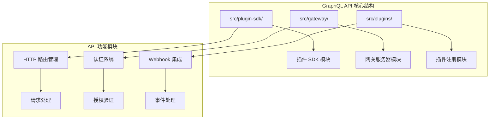
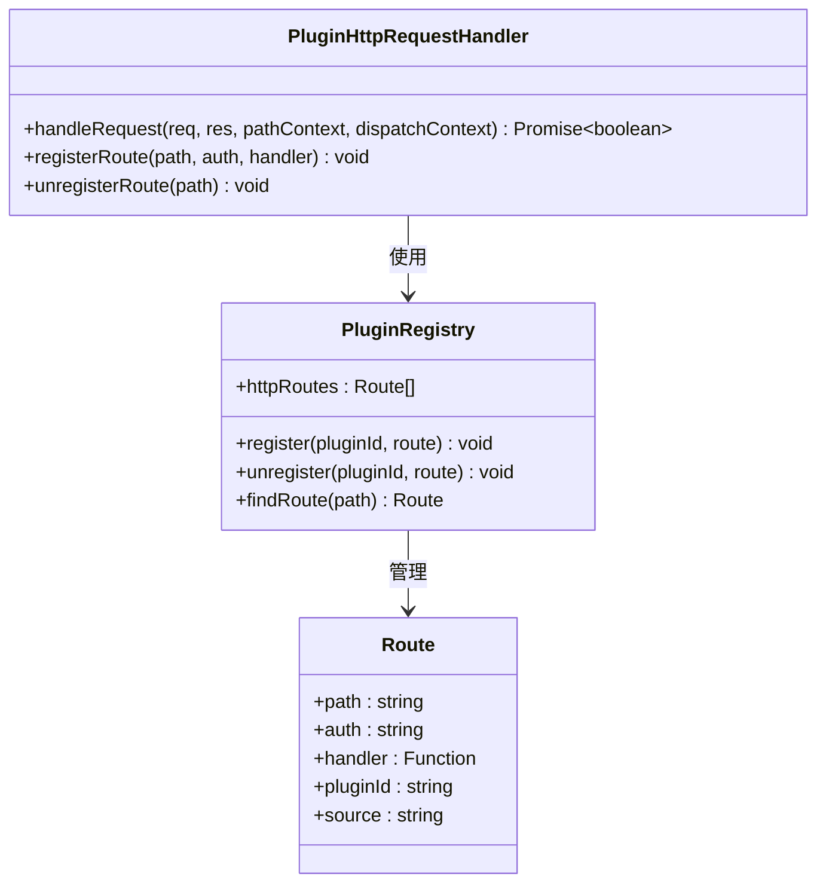
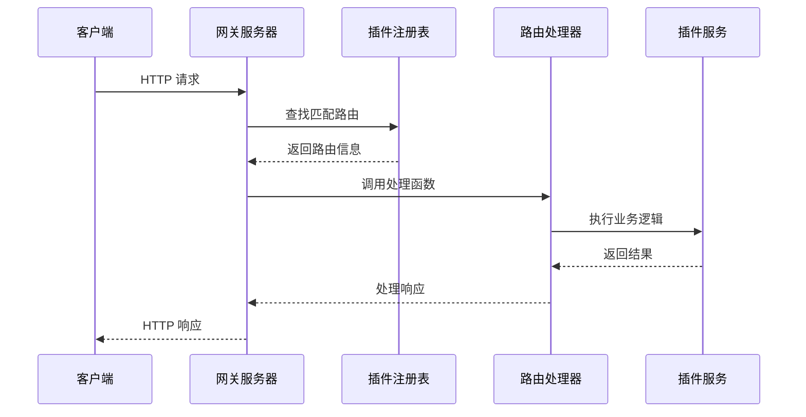
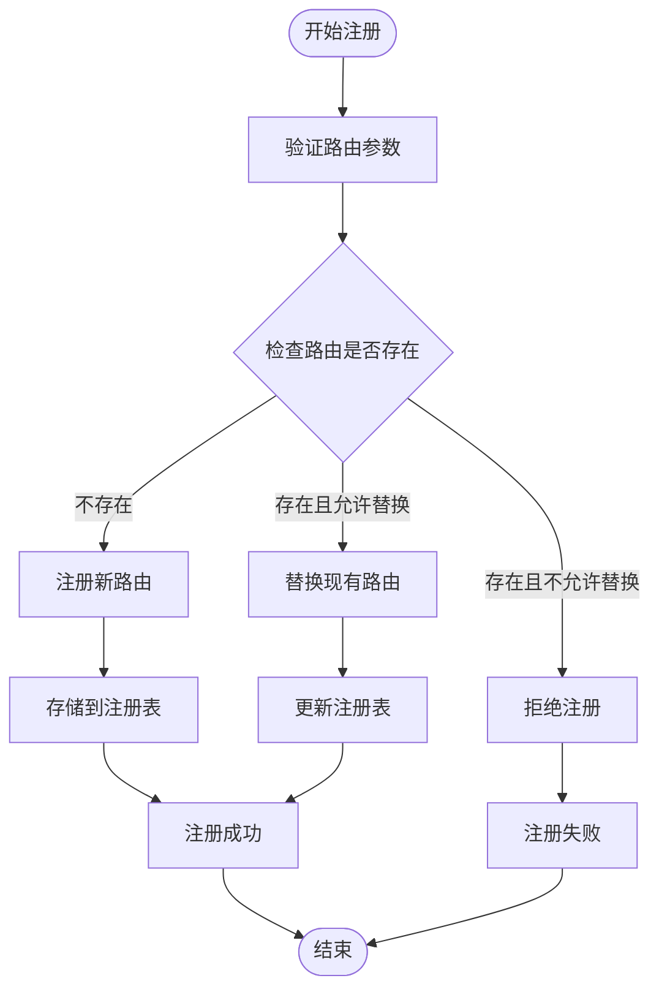
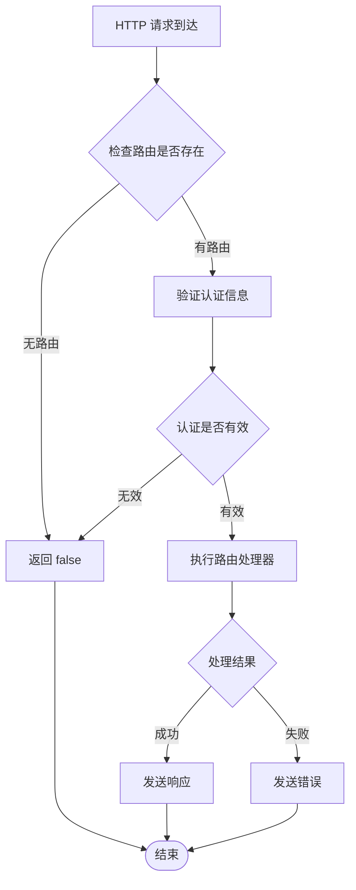
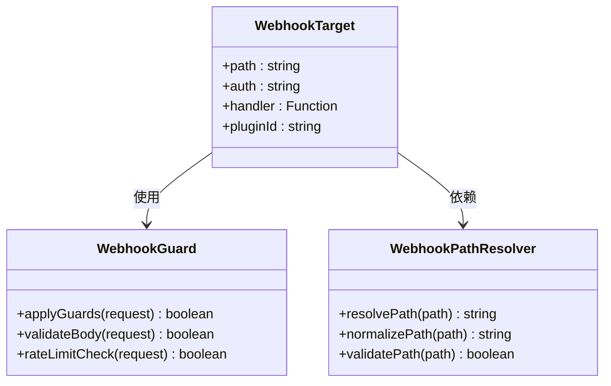
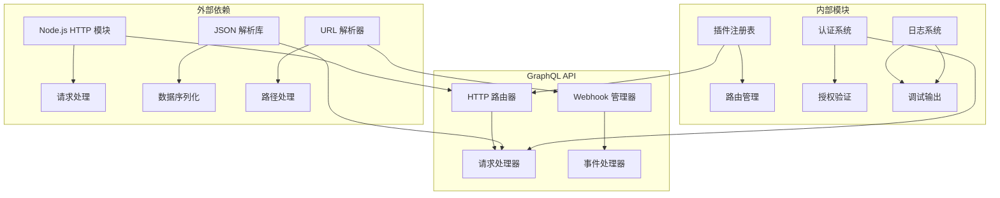

# 实验性 GraphQL API 文档

<cite>
**本文档中引用的文件**
- [src/plugin-sdk/index.ts](file://src/plugin-sdk/index.ts)
- [src/gateway/server.plugins-http.ts](file://src/gateway/server.plugins-http.ts)
- [src/plugins/http-registry.test.ts](file://src/plugins/http-registry.test.ts)
- [src/gateway/server.plugin-http-auth.test.ts](file://src/gateway/server.plugin-http-auth.test.ts)
- [src/plugin-sdk/webhook-targets.ts](file://src/plugin-sdk/webhook-targets.ts)
- [src/plugin-sdk/webhook-request-guards.ts](file://src/plugin-sdk/webhook-request-guards.ts)
- [src/plugin-sdk/webhook-path.ts](file://src/plugin-sdk/webhook-path.ts)
- [src/gateway/server.ts](file://src/gateway/server.ts)
</cite>

## 目录
1. [简介](#简介)
2. [项目结构](#项目结构)
3. [核心组件](#核心组件)
4. [架构概览](#架构概览)
5. [详细组件分析](#详细组件分析)
6. [依赖关系分析](#依赖关系分析)
7. [性能考虑](#性能考虑)
8. [故障排除指南](#故障排除指南)
9. [结论](#结论)

## 简介

本文档详细介绍了 OpenClaw 项目中的实验性 GraphQL API 系统。该系统是项目架构中的一个关键组件，为插件生态系统提供了统一的 API 接口层。GraphQL API 的设计目标是简化插件与网关服务器之间的通信，提供类型安全的查询和变更操作，并支持复杂的嵌套数据获取。

该实验性 API 基于 Node.js 的 HTTP 服务器构建，集成了认证、授权、路由匹配和请求处理等核心功能。系统采用模块化设计，通过插件注册机制实现动态扩展，支持多种认证方式和安全策略。

## 项目结构

OpenClaw 项目的 GraphQL API 系统主要分布在以下关键目录中：

**图表来源**
- [src/plugin-sdk/index.ts:1-826](file://src/plugin-sdk/index.ts#L1-L826)
- [src/gateway/server.plugins-http.ts:1-40](file://src/gateway/server.plugins-http.ts#L1-L40)

**章节来源**
- [src/plugin-sdk/index.ts:1-826](file://src/plugin-sdk/index.ts#L1-L826)
- [src/gateway/server.plugins-http.ts:1-40](file://src/gateway/server.plugins-http.ts#L1-L40)

## 核心组件

### 插件 HTTP 路由系统

GraphQL API 的核心是插件 HTTP 路由系统，它提供了统一的路由注册和处理机制：

**图表来源**
- [src/gateway/server.plugins-http.ts:24-40](file://src/gateway/server.plugins-http.ts#L24-L40)
- [src/plugins/http-registry.test.ts:1-50](file://src/plugins/http-registry.test.ts#L1-L50)

### 认证和授权机制

系统实现了多层次的安全控制，包括：

- **插件认证**: 基于插件标识符的身份验证
- **网关授权**: 对插件路由访问的授权控制
- **路径保护**: 根据路由上下文确定访问权限

**章节来源**
- [src/gateway/server.plugins-http.ts:1-40](file://src/gateway/server.plugins-http.ts#L1-L40)
- [src/gateway/server.plugin-http-auth.test.ts:44-82](file://src/gateway/server.plugin-http-auth.test.ts#L44-L82)

## 架构概览

GraphQL API 系统采用分层架构设计，确保了良好的可扩展性和维护性：

**图表来源**
- [src/gateway/server.plugins-http.ts:31-40](file://src/gateway/server.plugins-http.ts#L31-L40)
- [src/plugins/http-registry.test.ts:40-69](file://src/plugins/http-registry.test.ts#L40-L69)

## 详细组件分析

### HTTP 路由注册器

路由注册器是 GraphQL API 的核心组件，负责管理所有插件路由：

**图表来源**
- [src/plugins/http-registry.test.ts:5-38](file://src/plugins/http-registry.test.ts#L5-L38)

### 请求处理流程

请求处理流程确保了系统的稳定性和安全性：

**图表来源**
- [src/gateway/server.plugins-http.ts:35-40](file://src/gateway/server.plugins-http.ts#L35-L40)

**章节来源**
- [src/gateway/server.plugins-http.ts:1-40](file://src/gateway/server.plugins-http.ts#L1-L40)
- [src/plugins/http-registry.test.ts:40-69](file://src/plugins/http-registry.test.ts#L40-L69)

### Webhook 集成系统

GraphQL API 还集成了强大的 webhook 处理能力：

**图表来源**
- [src/plugin-sdk/webhook-targets.ts](file://src/plugin-sdk/webhook-targets.ts)
- [src/plugin-sdk/webhook-request-guards.ts](file://src/plugin-sdk/webhook-request-guards.ts)
- [src/plugin-sdk/webhook-path.ts](file://src/plugin-sdk/webhook-path.ts)

**章节来源**
- [src/plugin-sdk/webhook-targets.ts](file://src/plugin-sdk/webhook-targets.ts)
- [src/plugin-sdk/webhook-request-guards.ts](file://src/plugin-sdk/webhook-request-guards.ts)
- [src/plugin-sdk/webhook-path.ts](file://src/plugin-sdk/webhook-path.ts)

## 依赖关系分析

GraphQL API 系统的依赖关系体现了清晰的模块化设计：

**图表来源**
- [src/plugin-sdk/index.ts:1-826](file://src/plugin-sdk/index.ts#L1-L826)
- [src/gateway/server.ts:1-4](file://src/gateway/server.ts#L1-L4)

**章节来源**
- [src/plugin-sdk/index.ts:1-826](file://src/plugin-sdk/index.ts#L1-L826)
- [src/gateway/server.ts:1-4](file://src/gateway/server.ts#L1-L4)

## 性能考虑

GraphQL API 系统在设计时充分考虑了性能优化：

### 内存管理
- 使用键控异步队列避免并发冲突
- 实现持久化去重机制防止重复处理
- 采用流式处理减少内存占用

### 缓存策略
- 插件路由信息缓存
- 认证令牌缓存
- 请求结果缓存

### 并发控制
- 基于键的异步队列确保线程安全
- 限流器防止过载
- 超时机制避免资源泄露

## 故障排除指南

### 常见问题诊断

**路由注册失败**
- 检查路由路径格式是否正确
- 验证插件 ID 是否唯一
- 确认认证配置是否有效

**请求处理超时**
- 检查插件处理器性能
- 验证网络连接状态
- 监控系统资源使用情况

**认证失败**
- 验证插件证书有效性
- 检查授权范围配置
- 确认时间同步状态

**章节来源**
- [src/plugins/http-registry.test.ts:1-50](file://src/plugins/http-registry.test.ts#L1-L50)
- [src/gateway/server.plugin-http-auth.test.ts:44-82](file://src/gateway/server.plugin-http-auth.test.ts#L44-L82)

## 结论

OpenClaw 的实验性 GraphQL API 系统展现了现代 API 设计的最佳实践。通过模块化架构、完善的认证授权机制和灵活的插件系统，该系统为构建可扩展的企业级应用提供了坚实的基础。

系统的主要优势包括：
- **类型安全**: 基于 TypeScript 的强类型系统
- **模块化设计**: 清晰的职责分离和依赖管理
- **安全性**: 多层次的认证和授权机制
- **可扩展性**: 动态插件注册和路由管理
- **性能优化**: 高效的内存管理和并发控制

未来的发展方向包括增强 GraphQL 查询语言支持、改进性能监控工具和扩展更多认证提供商。该系统为 OpenClaw 生态系统的进一步发展奠定了重要基础。