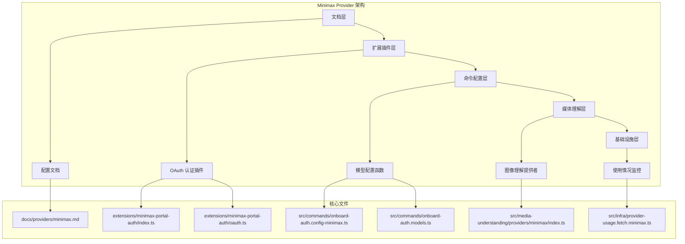
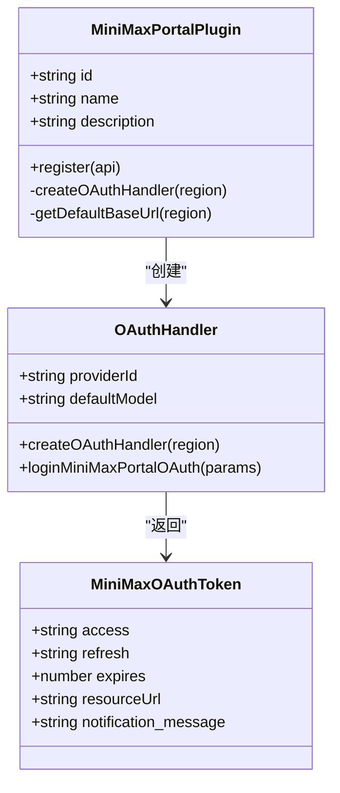
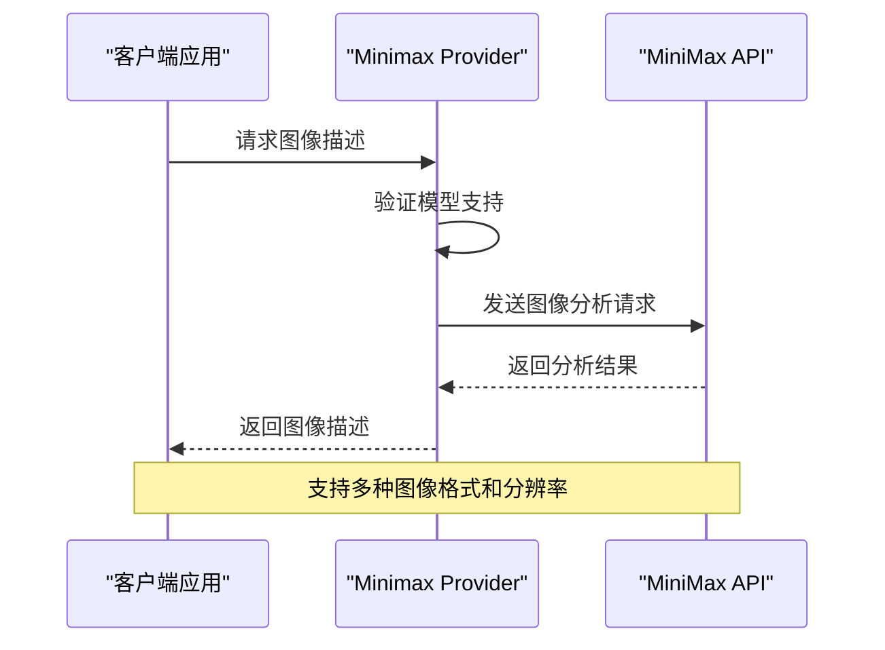
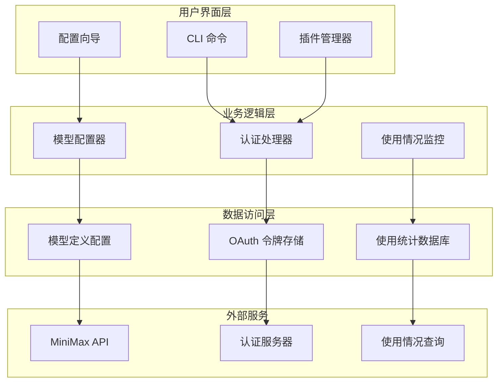
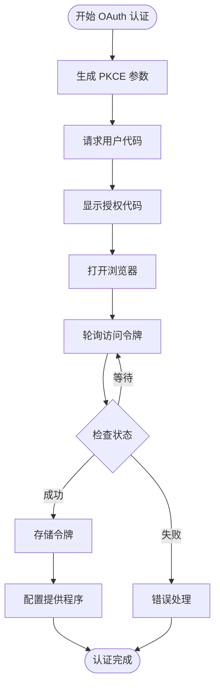
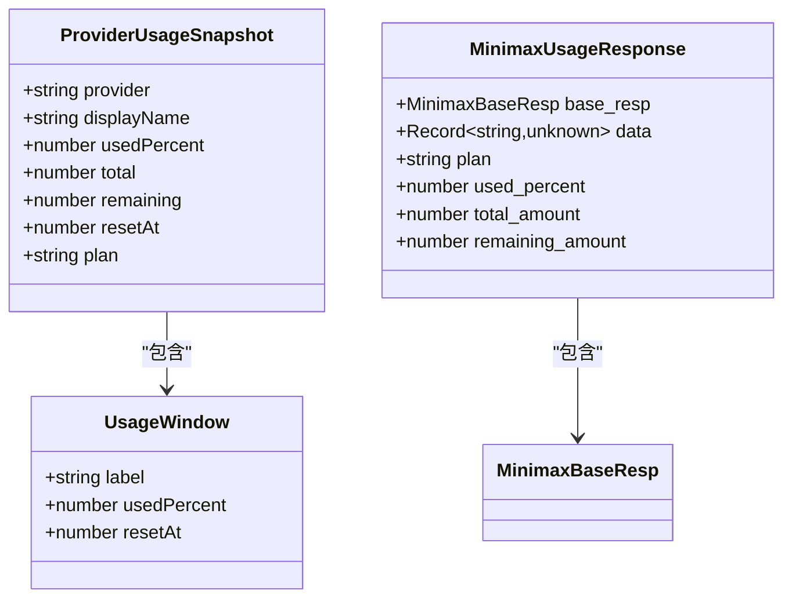
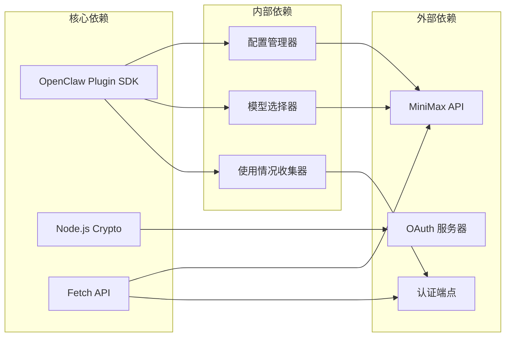

# Minimax Model Provider

<cite>
**本文档引用的文件**
- [docs/providers/minimax.md](file://docs/providers/minimax.md)
- [extensions/minimax-portal-auth/index.ts](file://extensions/minimax-portal-auth/index.ts)
- [extensions/minimax-portal-auth/oauth.ts](file://extensions/minimax-portal-auth/oauth.ts)
- [src/commands/onboard-auth.config-minimax.ts](file://src/commands/onboard-auth.config-minimax.ts)
- [src/commands/onboard-auth.models.ts](file://src/commands/onboard-auth.models.ts)
- [src/media-understanding/providers/minimax/index.ts](file://src/media-understanding/providers/minimax/index.ts)
- [src/media-understanding/providers/index.ts](file://src/media-understanding/providers/index.ts)
- [src/infra/provider-usage.fetch.minimax.ts](file://src/infra/provider-usage.fetch.minimax.ts)
- [apps/electron/release/mac-arm64/Bossim.app/Contents/Resources/openclaw/dist/plugin-sdk/minimax-portal-auth.js](file://apps/electron/release/mac-arm64/Bossim.app/Contents/Resources/openclaw/dist/plugin-sdk/minimax-portal-auth.js)
</cite>

## 目录
1. [简介](#简介)
2. [项目结构](#项目结构)
3. [核心组件](#核心组件)
4. [架构概览](#架构概览)
5. [详细组件分析](#详细组件分析)
6. [依赖关系分析](#依赖关系分析)
7. [性能考虑](#性能考虑)
8. [故障排除指南](#故障排除指南)
9. [结论](#结论)

## 简介

Minimax Model Provider 是 OpenClaw 生态系统中的重要组成部分，专注于提供 MiniMax M2.7 模型的集成支持。该提供程序实现了多种认证方式，包括 OAuth 流程和 API 密钥认证，并提供了完整的模型配置和使用监控功能。

MiniMax 是一家专注于构建 M2/M2.5 模型家族的 AI 公司，其模型在多语言编程、Web/应用开发、复合指令处理等方面具有显著优势。OpenClaw 通过 Minimax Provider 为用户提供了一站式的模型接入解决方案。

## 项目结构

OpenClaw 项目采用模块化架构设计，Minimax Provider 相关组件分布在多个目录中：

**图表来源**
- [docs/providers/minimax.md:1-218](file://docs/providers/minimax.md#L1-L218)
- [extensions/minimax-portal-auth/index.ts:1-167](file://extensions/minimax-portal-auth/index.ts#L1-L167)
- [src/commands/onboard-auth.config-minimax.ts:1-243](file://src/commands/onboard-auth.config-minimax.ts#L1-L243)

**章节来源**
- [docs/providers/minimax.md:1-218](file://docs/providers/minimax.md#L1-L218)
- [extensions/minimax-portal-auth/index.ts:1-167](file://extensions/minimax-portal-auth/index.ts#L1-L167)

## 核心组件

### 1. OAuth 认证插件

Minimax OAuth 插件提供了最便捷的认证方式，支持全球和中国地区的用户访问：

**图表来源**
- [extensions/minimax-portal-auth/index.ts:135-167](file://extensions/minimax-portal-auth/index.ts#L135-L167)
- [extensions/minimax-portal-auth/oauth.ts:184-245](file://extensions/minimax-portal-auth/oauth.ts#L184-L245)

### 2. 模型配置系统

提供程序支持多种模型配置方式，包括本地推理和云端服务：

| 配置方式 | 模型 ID | 特性 | 适用场景 |
|---------|---------|------|----------|
| MiniMax M2.7 | MiniMax-M2.7 | 标准版本，支持推理 | 通用编程任务 |
| MiniMax M2.7 Highspeed | MiniMax-M2.7-highspeed | 高速版本 | 对速度有要求的任务 |
| MiniMax M2.7 Lightning | MiniMax-M2.7-Lightning | 轻量版本 | 资源受限环境 |

### 3. 媒体理解集成

Minimax Provider 支持图像理解功能，为多模态应用提供基础：

**图表来源**
- [src/media-understanding/providers/minimax/index.ts:1-14](file://src/media-understanding/providers/minimax/index.ts#L1-L14)

**章节来源**
- [src/commands/onboard-auth.config-minimax.ts:126-242](file://src/commands/onboard-auth.config-minimax.ts#L126-L242)
- [src/commands/onboard-auth.models.ts:20-140](file://src/commands/onboard-auth.models.ts#L20-L140)

## 架构概览

Minimax Provider 采用分层架构设计，确保了良好的可扩展性和维护性：

**图表来源**
- [extensions/minimax-portal-auth/index.ts:140-163](file://extensions/minimax-portal-auth/index.ts#L140-L163)
- [src/infra/provider-usage.fetch.minimax.ts:299-388](file://src/infra/provider-usage.fetch.minimax.ts#L299-L388)

## 详细组件分析

### OAuth 认证流程

Minimax OAuth 认证实现了完整的 PKCE（Proof Key for Code Exchange）流程，确保认证安全性：

**图表来源**
- [extensions/minimax-portal-auth/oauth.ts:56-244](file://extensions/minimax-portal-auth/oauth.ts#L56-L244)

### 模型配置策略

提供程序支持多种配置策略，满足不同使用场景的需求：

#### 1. API 密钥配置
- 支持 Anthropic 兼容 API
- 全球和中国地区端点选择
- 自动模型发现和注册

#### 2. OAuth 配置
- 无 API 密钥要求
- 自动令牌刷新机制
- 多区域支持

#### 3. 本地推理配置
- LM Studio 集成
- 本地模型部署
- 性能优化配置

**章节来源**
- [src/commands/onboard-auth.config-minimax.ts:22-124](file://src/commands/onboard-auth.config-minimax.ts#L22-L124)
- [extensions/minimax-portal-auth/index.ts:44-133](file://extensions/minimax-portal-auth/index.ts#L44-L133)

### 使用情况监控

提供程序集成了完整的使用情况监控功能，支持多种计费模式：

**图表来源**
- [src/infra/provider-usage.fetch.minimax.ts:10-19](file://src/infra/provider-usage.fetch.minimax.ts#L10-L19)
- [src/infra/provider-usage.fetch.minimax.ts:382-387](file://src/infra/provider-usage.fetch.minimax.ts#L382-L387)

**章节来源**
- [src/infra/provider-usage.fetch.minimax.ts:299-388](file://src/infra/provider-usage.fetch.minimax.ts#L299-L388)

## 依赖关系分析

Minimax Provider 与其他组件的依赖关系如下：

**图表来源**
- [extensions/minimax-portal-auth/oauth.ts:1-5](file://extensions/minimax-portal-auth/oauth.ts#L1-L5)
- [apps/electron/release/mac-arm64/Bossim.app/Contents/Resources/openclaw/dist/plugin-sdk/minimax-portal-auth.js:1-5](file://apps/electron/release/mac-arm64/Bossim.app/Contents/Resources/openclaw/dist/plugin-sdk/minimax-portal-auth.js#L1-L5)

**章节来源**
- [src/media-understanding/providers/index.ts:1-32](file://src/media-understanding/providers/index.ts#L1-L32)
- [extensions/minimax-portal-auth/oauth.ts:1-245](file://extensions/minimax-portal-auth/oauth.ts#L1-L245)

## 性能考虑

### 1. 认证性能优化

- **令牌缓存**：实现本地令牌存储，减少重复认证开销
- **并发控制**：限制同时进行的认证请求数量
- **超时处理**：合理的超时设置避免长时间阻塞

### 2. 模型推理优化

- **批量处理**：支持多请求批量处理提高吞吐量
- **连接复用**：HTTP 连接池复用减少建立连接的开销
- **资源管理**：合理管理内存和 CPU 资源

### 3. 监控性能

- **异步处理**：使用异步方式处理使用情况查询
- **缓存策略**：实现使用情况数据缓存减少 API 调用
- **错误恢复**：实现自动重试机制提高可靠性

## 故障排除指南

### 常见问题及解决方案

#### 1. "Unknown model: minimax/MiniMax-M2.7"

**症状**：系统报告未知模型错误

**可能原因**：
- MiniMax 提供程序未正确配置
- 缺少 MiniMax 认证配置文件或环境变量密钥
- 模型 ID 大小写不匹配

**解决步骤**：
1. 升级到 2026.1.12 版本或从主分支运行
2. 运行 `openclaw configure` 并选择 MiniMax M2.7
3. 手动添加 `models.providers.minimax` 配置块
4. 设置 `MINIMAX_API_KEY` 环境变量

#### 2. OAuth 认证失败

**症状**：OAuth 认证过程中断或失败

**可能原因**：
- 网络连接问题
- MiniMax 账户权限不足
- 令牌过期或被撤销

**解决步骤**：
1. 检查网络连接稳定性
2. 确认 MiniMax 账户具有门户访问权限
3. 重新执行登录流程
4. 检查防火墙设置

#### 3. 使用情况查询错误

**症状**：无法获取使用情况信息

**可能原因**：
- API 端点不可达
- 认证令牌无效
- 响应格式不符合预期

**解决步骤**：
1. 验证 API 端点可达性
2. 检查认证令牌有效性
3. 查看详细的错误日志
4. 联系 MiniMax 支持团队

**章节来源**
- [docs/providers/minimax.md:195-218](file://docs/providers/minimax.md#L195-L218)
- [extensions/minimax-portal-auth/oauth.ts:184-244](file://extensions/minimax-portal-auth/oauth.ts#L184-L244)

## 结论

Minimax Model Provider 为 OpenClaw 生态系统提供了完整、安全、高效的模型接入解决方案。通过支持多种认证方式、灵活的配置选项和完善的监控功能，该提供程序能够满足不同用户和场景的需求。

主要优势包括：
- **多区域支持**：支持全球和中国地区的用户访问
- **多种认证方式**：OAuth 和 API 密钥两种认证方式
- **完整的功能集成**：从认证到使用的全链路支持
- **性能优化**：针对不同场景的性能优化策略
- **易于使用**：通过 CLI 和配置向导简化使用流程

随着 MiniMax 模型的不断发展和 OpenClaw 生态系统的完善，Minimax Provider 将继续提供更好的用户体验和技术支持。