# React 控制界面

<cite>
**本文档引用的文件**
- [README.md](file://README.md)
- [package.json](file://package.json)
- [ui-react/src/App.tsx](file://ui-react/src/App.tsx)
- [ui-react/src/main.tsx](file://ui-react/src/main.tsx)
- [ui-react/src/router.tsx](file://ui-react/src/router.tsx)
- [ui-react/src/store/gateway.store.ts](file://ui-react/src/store/gateway.store.ts)
- [ui-react/src/hooks/useGateway.ts](file://ui-react/src/hooks/useGateway.ts)
- [ui-react/src/components/layout/AppShell.tsx](file://ui-react/src/components/layout/AppShell.tsx)
- [ui-react/src/pages/ChatPage.tsx](file://ui-react/src/pages/ChatPage.tsx)
- [ui-react/src/components/chat/ChatSidebar.tsx](file://ui-react/src/components/chat/ChatSidebar.tsx)
- [ui-react/src/components/setup-wizard/index.tsx](file://ui-react/src/components/setup-wizard/index.tsx)
- [ui-react/src/pages/ChannelsPage.tsx](file://ui-react/src/pages/ChannelsPage.tsx)
- [ui-react/src/pages/PluginsPage.tsx](file://ui-react/src/pages/PluginsPage.tsx)
- [ui-react/src/components/channels/WeixinLoginPanel.tsx](file://ui-react/src/components/channels/WeixinLoginPanel.tsx)
- [ui-react/src/components/channels/CatalogCard.tsx](file://ui-react/src/components/channels/CatalogCard.tsx)
- [ui-react/src/components/channels/ChannelCard.tsx](file://ui-react/src/components/channels/ChannelCard.tsx)
- [ui-react/src/components/channels/ChannelDetail.tsx](file://ui-react/src/components/channels/ChannelDetail.tsx)
- [ui-react/src/components/channels/shared/AccountCardList.tsx](file://ui-react/src/components/channels/shared/AccountCardList.tsx)
- [ui-react/src/components/channels/shared/ChannelConfigForm.tsx](file://ui-react/src/components/channels/shared/ChannelConfigForm.tsx)
- [ui-react/src/components/channels/shared/ChannelStatusList.tsx](file://ui-react/src/components/channels/shared/ChannelStatusList.tsx)
- [ui-react/src/components/plugins/PluginCard.tsx](file://ui-react/src/components/plugins/PluginCard.tsx)
- [ui-react/src/components/plugins/PluginDetailDialog.tsx](file://ui-react/src/components/plugins/PluginDetailDialog.tsx)
- [ui-react/src/components/plugins/PluginToggleConfirmDialog.tsx](file://ui-react/src/components/plugins/PluginToggleConfirmDialog.tsx)
- [ui-react/src/store/channels.store.ts](file://ui-react/src/store/channels.store.ts)
- [ui-react/src/store/plugins.store.ts](file://ui-react/src/store/plugins.store.ts)
- [ui-react/src/types/channels.ts](file://ui-react/src/types/channels.ts)
- [ui-react/src/store/settings.store.ts](file://ui-react/src/store/settings.store.ts)
- [ui-react/vite.config.ts](file://ui-react/vite.config.ts)
- [ui-react/src/lib/utils.ts](file://ui-react/src/lib/utils.ts)
- [ui-react/package.json](file://ui-react/package.json)
- [ui-react/src/components/tool-ui/weather-widget/weather-widget-container.tsx](file://ui-react/src/components/tool-ui/weather-widget/weather-widget-container.tsx)
- [ui-react/src/components/tool-ui/weather-widget/weather-data-overlay.tsx](file://ui-react/src/components/tool-ui/weather-widget/weather-data-overlay.tsx)
- [ui-react/src/components/tool-ui/weather-widget/runtime.ts](file://ui-react/src/components/tool-ui/weather-widget/runtime.ts)
- [ui-react/src/components/tool-ui/weather-widget/schema-runtime.ts](file://ui-react/src/components/tool-ui/weather-widget/schema-runtime.ts)
- [ui-react/src/components/tool-ui/weather-widget/generated/weather-runtime-core.generated.ts](file://ui-react/src/components/tool-ui/weather-widget/generated/weather-runtime-core.generated.ts)
- [ui-react/src/components/chat/ToolCallGroup.tsx](file://ui-react/src/components/chat/ToolCallGroup.tsx)
- [ui-react/src/components/chat/ToolFallback.tsx](file://ui-react/src/components/chat/ToolFallback.tsx)
- [ui-react/src/components/chat/markdown-components.tsx](file://ui-react/src/components/chat/markdown-components.tsx)
- [ui-react/src/types/gateway.ts](file://ui-react/src/types/gateway.ts)
- [ui-react/src/types/channels.ts](file://ui-react/src/types/channels.ts)
- [ui-react/src/types/plugins.ts](file://ui-react/src/types/plugins.ts)
- [ui-react/src/types/agents.ts](file://ui-react/src/types/agents.ts)
- [ui-react/src/types/skills.ts](file://ui-react/src/types/skills.ts)
</cite>

## 更新摘要
**所做更改**
- 新增天气小部件组件系统，包含 WebGL 动画效果和实时天气数据展示
- 新增工具调用组件系统，支持工具分类、状态管理和详细信息展示
- 新增类型定义系统，提供完整的 TypeScript 类型支持
- 扩展聊天界面，增强工具调用的可视化和交互体验
- 增强 Markdown 渲染组件，支持更丰富的文本格式化

## 目录
1. [简介](#简介)
2. [项目结构](#项目结构)
3. [核心组件](#核心组件)
4. [架构概览](#架构概览)
5. [详细组件分析](#详细组件分析)
6. [新增功能模块](#新增功能模块)
7. [天气小部件系统](#天气小部件系统)
8. [工具调用组件系统](#工具调用组件系统)
9. [类型定义系统](#类型定义系统)
10. [依赖关系分析](#依赖关系分析)
11. [性能考虑](#性能考虑)
12. [故障排除指南](#故障排除指南)
13. [结论](#结论)

## 简介

React 控制界面是 OpenClaw 个人 AI 助手项目中的 React 控制界面，负责提供用户与 Gateway 的交互界面。OpenClaw 是一个可在本地设备上运行的个人 AI 助手，支持多渠道消息集成、实时聊天、会话管理和技能系统。

该控制界面基于 React 19 和 Vite 构建，使用 Zustand 进行状态管理，提供现代化的用户界面和流畅的用户体验。界面采用 shadcn/ui 设计系统，支持深色/浅色主题切换，并集成了完整的聊天功能。

**更新** 新增了天气小部件组件系统、工具调用组件系统、WebGL 动画效果和完整的类型定义系统，大幅增强了系统的可视化能力和类型安全性。

## 项目结构

React 控制界面位于项目根目录下的 `ui-react` 文件夹中，采用模块化组织方式：

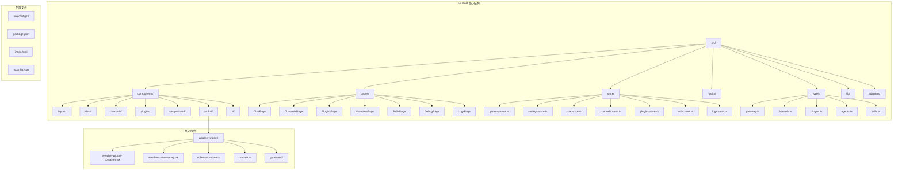
```mermaid
graph TB
subgraph "ui-react 核心结构"
A[src/] --> B[components/]
A --> C[pages/]
A --> D[store/]
A --> E[hooks/]
A --> F[types/]
A --> G[lib/]
A --> H[adapters/]
B --> B1[layout/]
B --> B2[chat/]
B --> B3[channels/]
B --> B4[plugins/]
B --> B5[setup-wizard/]
B --> B6[tool-ui/]
B --> B7[ui/]
C --> C1[ChatPage]
C --> C2[ChannelsPage]
C --> C3[PluginsPage]
C --> C4[OverviewPage]
C --> C5[SkillsPage]
C --> C6[DebugPage]
C --> C7[LogsPage]
D --> D1[gateway.store.ts]
D --> D2[settings.store.ts]
D --> D3[chat.store.ts]
D --> D4[channels.store.ts]
D --> D5[plugins.store.ts]
D --> D6[skills.store.ts]
D --> D7[logs.store.ts]
F --> F1[gateway.ts]
F --> F2[channels.ts]
F --> F3[plugins.ts]
F --> F4[agents.ts]
F --> F5[skills.ts]
end
subgraph "工具UI组件"
B6 --> B61[weather-widget/]
B61 --> B611[weather-widget-container.tsx]
B61 --> B612[weather-data-overlay.tsx]
B61 --> B613[schema-runtime.ts]
B61 --> B614[runtime.ts]
B61 --> B615[generated/]
end
subgraph "配置文件"
I[vite.config.ts]
J[package.json]
K[index.html]
L[tsconfig.json]
end
```

**图表来源**
- [ui-react/src/App.tsx:1-7](file://ui-react/src/App.tsx#L1-L7)
- [ui-react/src/router.tsx:1-42](file://ui-react/src/router.tsx#L1-L42)
- [ui-react/package.json:1-60](file://ui-react/package.json#L1-L60)

**章节来源**
- [ui-react/src/App.tsx:1-7](file://ui-react/src/App.tsx#L1-L7)
- [ui-react/src/main.tsx:1-11](file://ui-react/src/main.tsx#L1-L11)
- [ui-react/src/router.tsx:1-42](file://ui-react/src/router.tsx#L1-L42)

## 核心组件

### 应用入口和路由系统

应用采用 React Router 7 进行路由管理，支持哈希路由模式，确保在不同部署环境下的一致性：

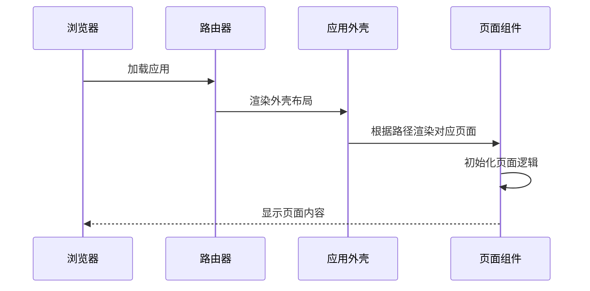
```mermaid
sequenceDiagram
participant Browser as 浏览器
participant Router as 路由器
participant AppShell as 应用外壳
participant Page as 页面组件
Browser->>Router : 加载应用
Router->>AppShell : 渲染外壳布局
AppShell->>Page : 根据路径渲染对应页面
Page->>Page : 初始化页面逻辑
Page-->>Browser : 显示页面内容
```

**图表来源**
- [ui-react/src/router.tsx:19-41](file://ui-react/src/router.tsx#L19-L41)
- [ui-react/src/components/layout/AppShell.tsx:11-32](file://ui-react/src/components/layout/AppShell.tsx#L11-L32)

### 网关连接管理

使用自定义的 GatewayClient 实现 WebSocket 连接，支持自动重连、设备身份验证和事件处理：

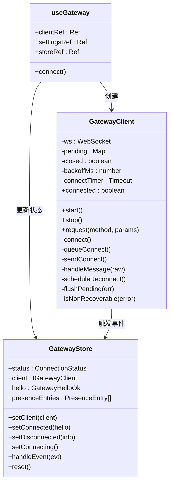
```mermaid
classDiagram
class GatewayClient {
-ws : WebSocket
-pending : Map
-closed : boolean
-backoffMs : number
-connectTimer : Timeout
+start()
+stop()
+connected : boolean
+request(method, params)
-connect()
-queueConnect()
-sendConnect()
-handleMessage(raw)
-scheduleReconnect()
-flushPending(err)
-isNonRecoverable(error)
}
class useGateway {
+connect()
+clientRef : Ref
+settingsRef : Ref
+storeRef : Ref
}
class GatewayStore {
+status : ConnectionStatus
+client : IGatewayClient
+hello : GatewayHelloOk
+presenceEntries : PresenceEntry[]
+setClient(client)
+setConnected(hello)
+setDisconnected(info)
+setConnecting()
+handleEvent(evt)
+reset()
}
useGateway --> GatewayClient : 创建
useGateway --> GatewayStore : 更新状态
GatewayClient --> GatewayStore : 触发事件
```

**图表来源**
- [ui-react/src/hooks/useGateway.ts:35-292](file://ui-react/src/hooks/useGateway.ts#L35-L292)
- [ui-react/src/store/gateway.store.ts:41-183](file://ui-react/src/store/gateway.store.ts#L41-L183)

**章节来源**
- [ui-react/src/hooks/useGateway.ts:430-503](file://ui-react/src/hooks/useGateway.ts#L430-L503)
- [ui-react/src/store/gateway.store.ts:1-184](file://ui-react/src/store/gateway.store.ts#L1-L184)

## 架构概览

React 控制界面采用分层架构设计，清晰分离关注点：

```mermaid
graph TB
subgraph "表现层 (Presentation Layer)"
A[AppShell] --> B[ChatPage]
A --> C[ChannelsPage]
A --> D[PluginsPage]
A --> E[OverviewPage]
A --> F[SkillsPage]
A --> G[SetupWizard]
B --> H[ThreadView]
B --> I[Composer]
B --> J[ChatSidebar]
B --> K[ToolCallGroup]
B --> L[ToolFallback]
B --> M[WeatherWidget]
C --> N[ChannelCard]
C --> O[CatalogCard]
C --> P[ChannelDetail]
C --> Q[WeixinLoginPanel]
D --> R[PluginCard]
D --> S[PluginDetailDialog]
E --> T[ThreadView]
F --> U[SkillCard]
end
subgraph "状态管理层 (State Management)"
V[Zustand Stores]
V --> W[gateway.store]
V --> X[settings.store]
V --> Y[chat.store]
V --> Z[channels.store]
V --> AA[plugins.store]
V --> AB[skills.store]
end
subgraph "业务逻辑层 (Business Logic)"
AC[useGateway Hook]
AC --> AD[GatewayClient]
AC --> AE[Device Identity]
AF[useSessionManager] --> AG[Session Management]
AH[useChatEventBridge] --> AI[Event Bridge]
AJ[useChannelsStore] --> AK[Channel Management]
AL[usePluginsStore] --> AM[Plugin Management]
end
subgraph "基础设施层 (Infrastructure)"
AN[WebSocket Protocol]
AO[LocalStorage]
AP[SessionStorage]
AQ[Gateway RPC]
AR[Plugin System]
AS[Channel System]
AT[WebGL Effects]
AU[Tool Call System]
```

**图表来源**
- [ui-react/src/components/layout/AppShell.tsx:11-32](file://ui-react/src/components/layout/AppShell.tsx#L11-L32)
- [ui-react/src/pages/ChatPage.tsx:9-95](file://ui-react/src/pages/ChatPage.tsx#L9-L95)
- [ui-react/src/store/gateway.store.ts:72-183](file://ui-react/src/store/gateway.store.ts#L72-L183)

## 详细组件分析

### 应用外壳 (AppShell)

AppShell 作为应用的根布局组件，负责初始化网关连接并提供侧边栏导航：

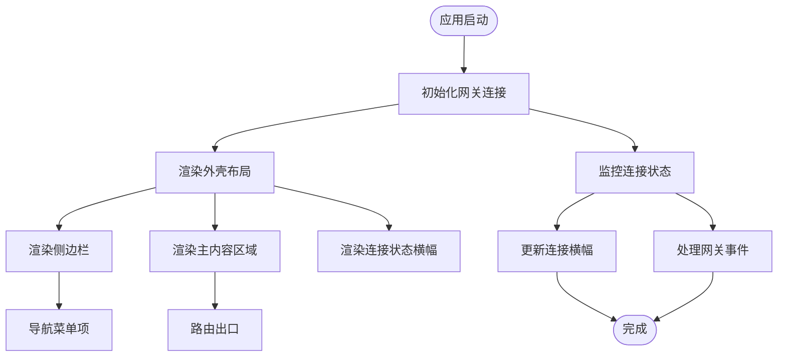
```mermaid
flowchart TD
Start([应用启动]) --> InitGateway[初始化网关连接]
InitGateway --> RenderLayout[渲染外壳布局]
RenderLayout --> Sidebar[渲染侧边栏]
RenderLayout --> MainContent[渲染主内容区域]
RenderLayout --> ConnectionBanner[渲染连接状态横幅]
Sidebar --> NavItems[导航菜单项]
MainContent --> Outlet[路由出口]
InitGateway --> MonitorConnection[监控连接状态]
MonitorConnection --> UpdateBanner[更新连接横幅]
MonitorConnection --> HandleEvents[处理网关事件]
UpdateBanner --> End([完成])
HandleEvents --> End
```

**图表来源**
- [ui-react/src/components/layout/AppShell.tsx:11-32](file://ui-react/src/components/layout/AppShell.tsx#L11-L32)

**章节来源**
- [ui-react/src/components/layout/AppShell.tsx:1-33](file://ui-react/src/components/layout/AppShell.tsx#L1-L33)

### 聊天页面 (ChatPage)

ChatPage 提供完整的聊天界面，包括会话选择、消息显示和输入 composer：

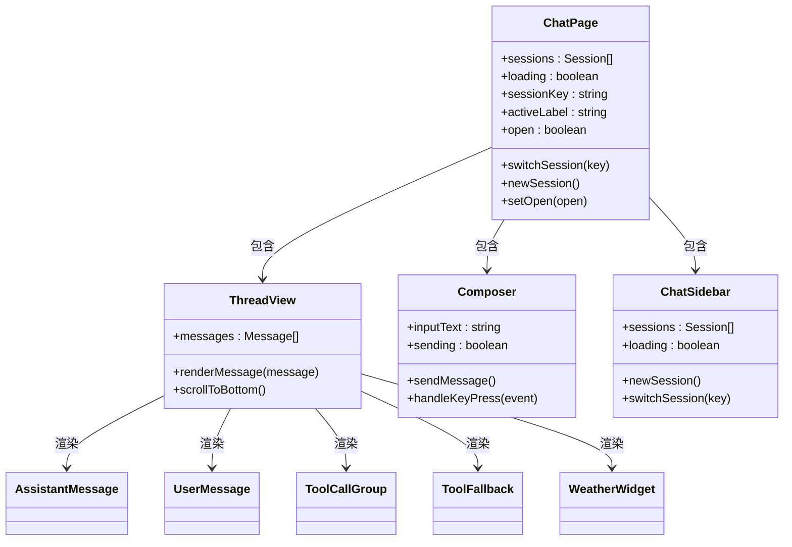
```mermaid
classDiagram
class ChatPage {
+sessions : Session[]
+loading : boolean
+sessionKey : string
+activeLabel : string
+switchSession(key)
+newSession()
+open : boolean
+setOpen(open)
}
class ThreadView {
+messages : Message[]
+renderMessage(message)
+scrollToBottom()
}
class Composer {
+inputText : string
+sending : boolean
+sendMessage()
+handleKeyPress(event)
}
class ChatSidebar {
+sessions : Session[]
+loading : boolean
+newSession()
+switchSession(key)
}
ChatPage --> ThreadView : 包含
ChatPage --> Composer : 包含
ChatPage --> ChatSidebar : 包含
ThreadView --> AssistantMessage : 渲染
ThreadView --> UserMessage : 渲染
ThreadView --> ToolCallGroup : 渲染
ThreadView --> ToolFallback : 渲染
ThreadView --> WeatherWidget : 渲染
```

**图表来源**
- [ui-react/src/pages/ChatPage.tsx:9-95](file://ui-react/src/pages/ChatPage.tsx#L9-L95)
- [ui-react/src/components/chat/ChatSidebar.tsx:19-116](file://ui-react/src/components/chat/ChatSidebar.tsx#L19-L116)

**章节来源**
- [ui-react/src/pages/ChatPage.tsx:1-96](file://ui-react/src/pages/ChatPage.tsx#L1-L96)
- [ui-react/src/components/chat/ChatSidebar.tsx:1-117](file://ui-react/src/components/chat/ChatSidebar.tsx#L1-L117)

### 设置向导 (SetupWizard)

设置向导提供逐步配置界面，支持多种适配器模式：

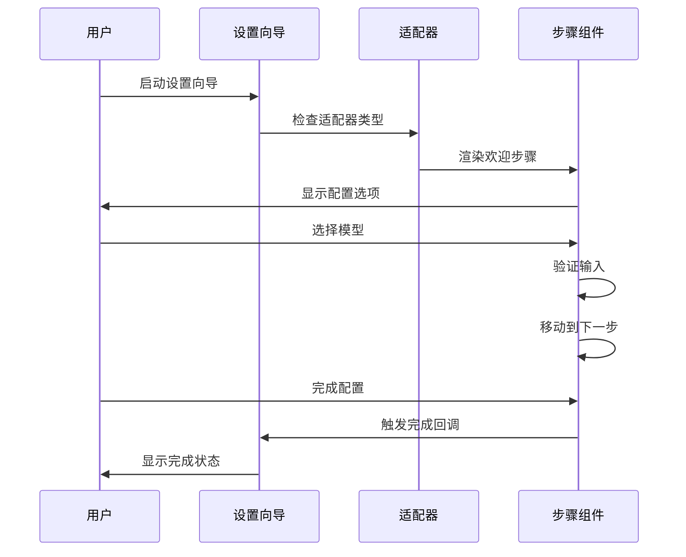
```mermaid
sequenceDiagram
participant User as 用户
participant Wizard as 设置向导
participant Adapter as 适配器
participant Steps as 步骤组件
User->>Wizard : 启动设置向导
Wizard->>Adapter : 检查适配器类型
Adapter->>Steps : 渲染欢迎步骤
Steps->>User : 显示配置选项
User->>Steps : 选择模型
Steps->>Steps : 验证输入
Steps->>Steps : 移动到下一步
User->>Steps : 完成配置
Steps->>Wizard : 触发完成回调
Wizard->>User : 显示完成状态
```

**图表来源**
- [ui-react/src/components/setup-wizard/index.tsx:11-30](file://ui-react/src/components/setup-wizard/index.tsx#L11-L30)

**章节来源**
- [ui-react/src/components/setup-wizard/index.tsx:1-31](file://ui-react/src/components/setup-wizard/index.tsx#L1-L31)

### 状态管理系统

使用 Zustand 实现轻量级状态管理，避免复杂的上下文传递：

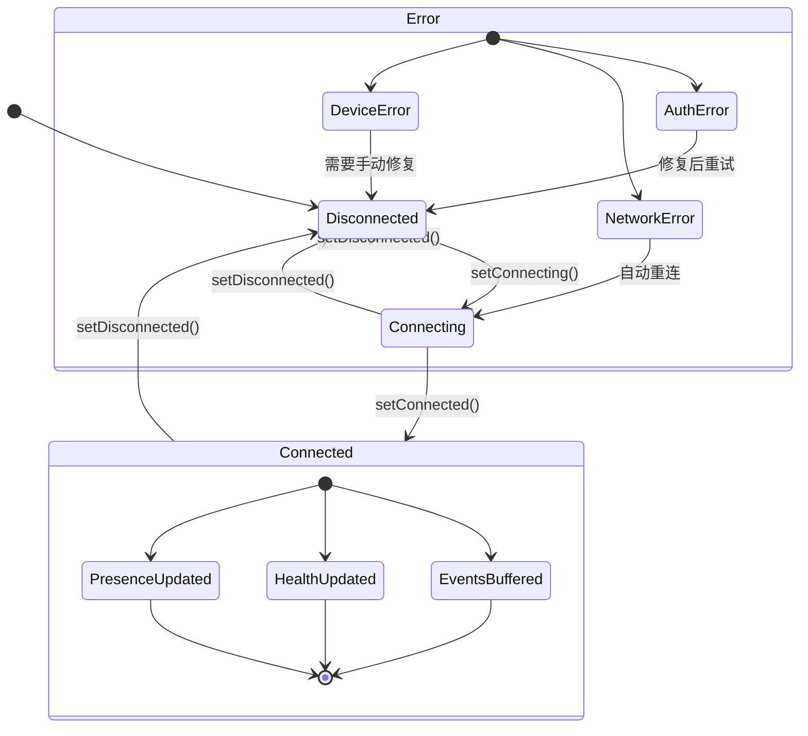
```mermaid
stateDiagram-v2
[*] --> Disconnected
Disconnected --> Connecting : setConnecting()
Connecting --> Connected : setConnected()
Connecting --> Disconnected : setDisconnected()
Connected --> Disconnected : setDisconnected()
Disconnected --> Error : setDisconnected()
state Connected {
[*] --> PresenceUpdated
[*] --> HealthUpdated
[*] --> EventsBuffered
PresenceUpdated --> [*]
HealthUpdated --> [*]
EventsBuffered --> [*]
}
state Error {
[*] --> AuthError
[*] --> NetworkError
[*] --> DeviceError
AuthError --> Disconnected : 修复后重试
NetworkError --> Connecting : 自动重连
DeviceError --> Disconnected : 需要手动修复
}
```

**图表来源**
- [ui-react/src/store/gateway.store.ts:39-68](file://ui-react/src/store/gateway.store.ts#L39-L68)
- [ui-react/src/store/gateway.store.ts:72-183](file://ui-react/src/store/gateway.store.ts#L72-L183)

**章节来源**
- [ui-react/src/store/gateway.store.ts:1-184](file://ui-react/src/store/gateway.store.ts#L1-L184)
- [ui-react/src/store/settings.store.ts:289-308](file://ui-react/src/store/settings.store.ts#L289-L308)

## 新增功能模块

### 微信登录面板 (WeixinLoginPanel)

新增的微信登录面板提供了完整的二维码登录功能，支持微信扫码登录和状态监控：

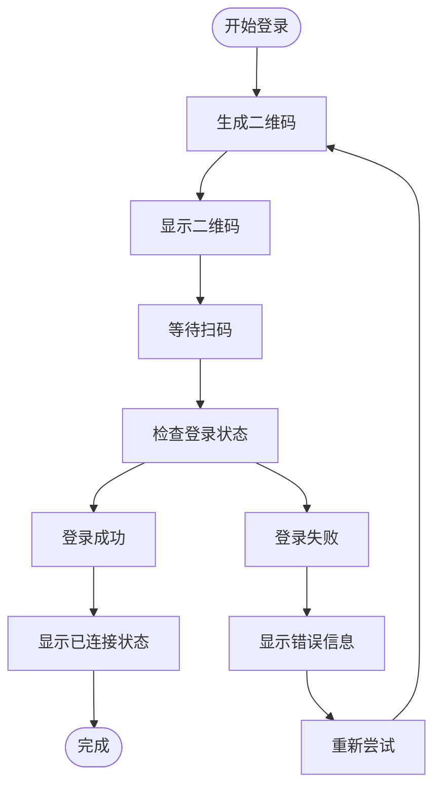
```mermaid
flowchart TD
Start([开始登录]) --> GenerateQR[生成二维码]
GenerateQR --> ShowQR[显示二维码]
ShowQR --> WaitScan[等待扫码]
WaitScan --> CheckStatus[检查登录状态]
CheckStatus --> Success[登录成功]
CheckStatus --> Failed[登录失败]
Failed --> ShowError[显示错误信息]
ShowError --> Retry[重新尝试]
Retry --> GenerateQR
Success --> Connected[显示已连接状态]
Connected --> End([完成])
```

**图表来源**
- [ui-react/src/components/channels/WeixinLoginPanel.tsx:51-146](file://ui-react/src/components/channels/WeixinLoginPanel.tsx#L51-L146)

**章节来源**
- [ui-react/src/components/channels/WeixinLoginPanel.tsx:1-146](file://ui-react/src/components/channels/WeixinLoginPanel.tsx#L1-L146)

### 通道管理组件

#### 通道卡片 (ChannelCard)

通道卡片组件提供了通道的可视化展示和状态管理功能：

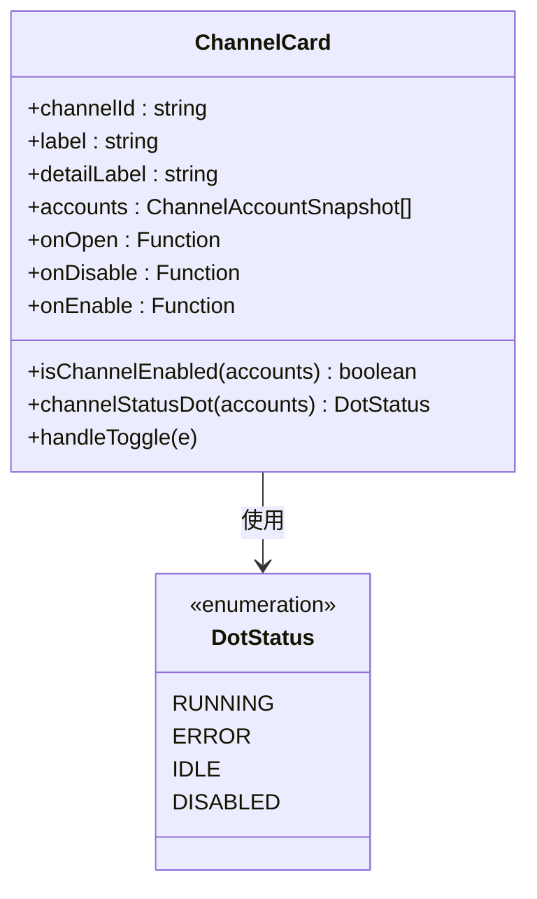
```mermaid
classDiagram
class ChannelCard {
+channelId : string
+label : string
+detailLabel : string
+accounts : ChannelAccountSnapshot[]
+onOpen : Function
+onDisable : Function
+onEnable : Function
+isChannelEnabled(accounts) boolean
+channelStatusDot(accounts) DotStatus
+handleToggle(e)
}
class DotStatus {
<<enumeration>>
RUNNING
ERROR
IDLE
DISABLED
}
ChannelCard --> DotStatus : 使用
```

**图表来源**
- [ui-react/src/components/channels/ChannelCard.tsx:20-128](file://ui-react/src/components/channels/ChannelCard.tsx#L20-L128)

**章节来源**
- [ui-react/src/components/channels/ChannelCard.tsx:1-128](file://ui-react/src/components/channels/ChannelCard.tsx#L1-L128)

#### 通道目录卡片 (CatalogCard)

通道目录卡片展示了可安装的通道插件信息：

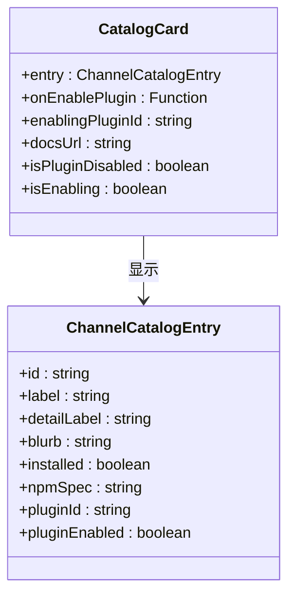
```mermaid
classDiagram
class CatalogCard {
+entry : ChannelCatalogEntry
+onEnablePlugin : Function
+enablingPluginId : string
+docsUrl : string
+isPluginDisabled : boolean
+isEnabling : boolean
}
class ChannelCatalogEntry {
+id : string
+label : string
+detailLabel : string
+blurb : string
+installed : boolean
+npmSpec : string
+pluginId : string
+pluginEnabled : boolean
}
CatalogCard --> ChannelCatalogEntry : 显示
```

**图表来源**
- [ui-react/src/components/channels/CatalogCard.tsx:4-74](file://ui-react/src/components/channels/CatalogCard.tsx#L4-L74)

**章节来源**
- [ui-react/src/components/channels/CatalogCard.tsx:1-74](file://ui-react/src/components/channels/CatalogCard.tsx#L1-L74)

#### 通道详情 (ChannelDetail)

通道详情组件提供了详细的通道配置和状态信息：

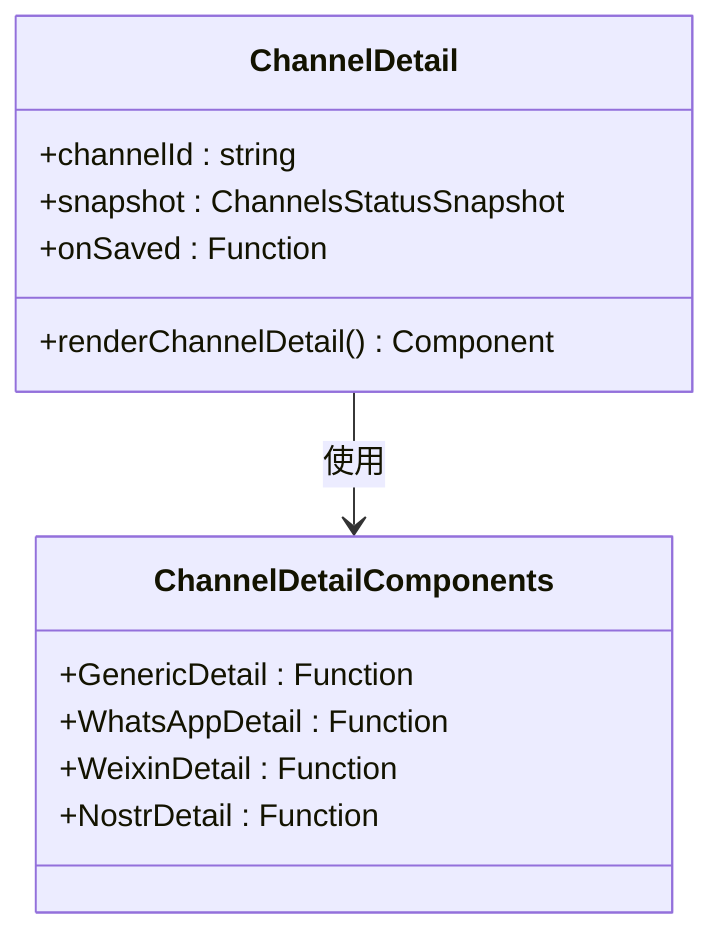
```mermaid
classDiagram
class ChannelDetail {
+channelId : string
+snapshot : ChannelsStatusSnapshot
+onSaved : Function
+renderChannelDetail() Component
}
class ChannelDetailComponents {
+GenericDetail : Function
+WhatsAppDetail : Function
+WeixinDetail : Function
+NostrDetail : Function
}
ChannelDetail --> ChannelDetailComponents : 使用
```

**图表来源**
- [ui-react/src/components/channels/ChannelDetail.tsx:188-217](file://ui-react/src/components/channels/ChannelDetail.tsx#L188-L217)

**章节来源**
- [ui-react/src/components/channels/ChannelDetail.tsx:1-217](file://ui-react/src/components/channels/ChannelDetail.tsx#L1-L217)

### 插件管理组件

#### 插件卡片 (PluginCard)

插件卡片提供了插件的完整信息展示和状态管理：

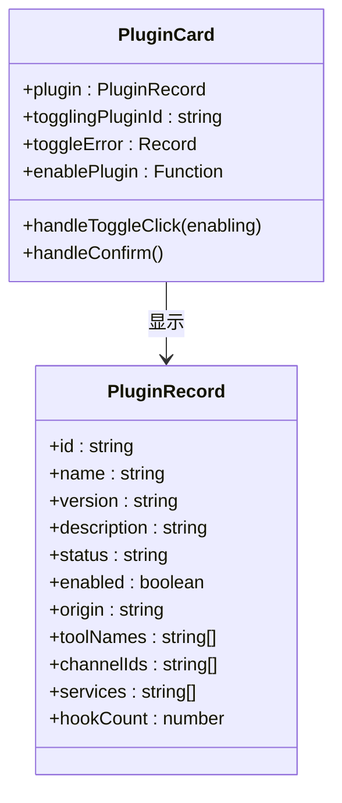
```mermaid
classDiagram
class PluginCard {
+plugin : PluginRecord
+togglingPluginId : string
+toggleError : Record
+enablePlugin : Function
+handleToggleClick(enabling)
+handleConfirm()
}
class PluginRecord {
+id : string
+name : string
+version : string
+description : string
+status : string
+enabled : boolean
+origin : string
+toolNames : string[]
+channelIds : string[]
+services : string[]
+hookCount : number
}
PluginCard --> PluginRecord : 显示
```

**图表来源**
- [ui-react/src/components/plugins/PluginCard.tsx:56-244](file://ui-react/src/components/plugins/PluginCard.tsx#L56-L244)

**章节来源**
- [ui-react/src/components/plugins/PluginCard.tsx:1-244](file://ui-react/src/components/plugins/PluginCard.tsx#L1-L244)

#### 插件详情对话框 (PluginDetailDialog)

插件详情对话框提供了插件的详细技术信息：

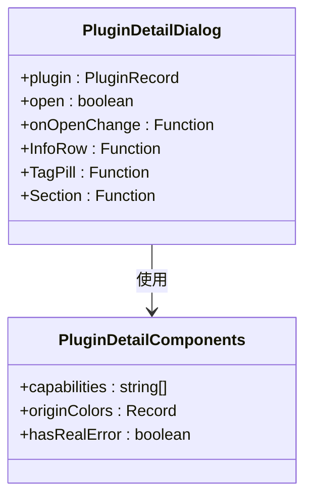
```mermaid
classDiagram
class PluginDetailDialog {
+plugin : PluginRecord
+open : boolean
+onOpenChange : Function
+InfoRow : Function
+TagPill : Function
+Section : Function
}
class PluginDetailComponents {
+capabilities : string[]
+originColors : Record
+hasRealError : boolean
}
PluginDetailDialog --> PluginDetailComponents : 使用
```

**图表来源**
- [ui-react/src/components/plugins/PluginDetailDialog.tsx:40-185](file://ui-react/src/components/plugins/PluginDetailDialog.tsx#L40-L185)

**章节来源**
- [ui-react/src/components/plugins/PluginDetailDialog.tsx:1-185](file://ui-react/src/components/plugins/PluginDetailDialog.tsx#L1-L185)

### 共享组件

#### 账户卡片列表 (AccountCardList)

账户卡片列表组件展示了通道账户的详细状态信息：

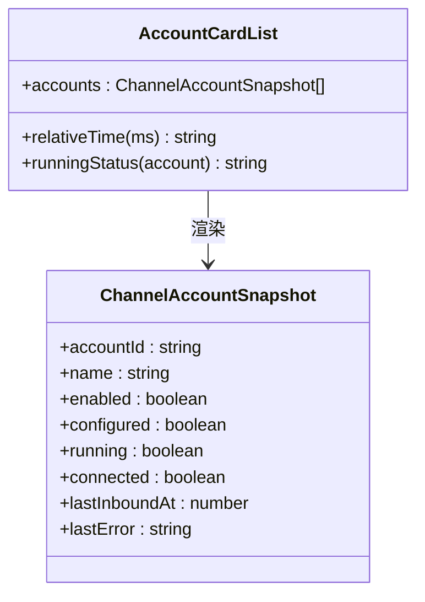
```mermaid
classDiagram
class AccountCardList {
+accounts : ChannelAccountSnapshot[]
+relativeTime(ms) string
+runningStatus(account) string
}
class ChannelAccountSnapshot {
+accountId : string
+name : string
+enabled : boolean
+configured : boolean
+running : boolean
+connected : boolean
+lastInboundAt : number
+lastError : string
}
AccountCardList --> ChannelAccountSnapshot : 渲染
```

**图表来源**
- [ui-react/src/components/channels/shared/AccountCardList.tsx:21-89](file://ui-react/src/components/channels/shared/AccountCardList.tsx#L21-L89)

**章节来源**
- [ui-react/src/components/channels/shared/AccountCardList.tsx:1-89](file://ui-react/src/components/channels/shared/AccountCardList.tsx#L1-L89)

#### 通道配置表单 (ChannelConfigForm)

通道配置表单提供了动态的配置界面生成：

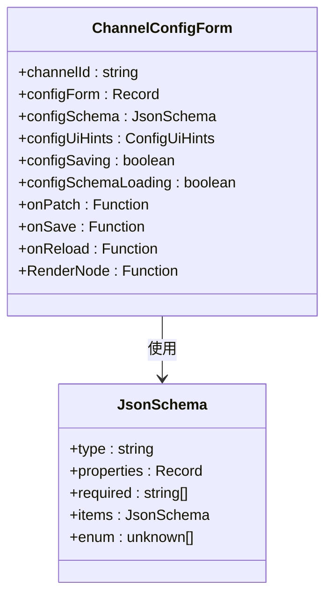
```mermaid
classDiagram
class ChannelConfigForm {
+channelId : string
+configForm : Record
+configSchema : JsonSchema
+configUiHints : ConfigUiHints
+configSaving : boolean
+configSchemaLoading : boolean
+onPatch : Function
+onSave : Function
+onReload : Function
+RenderNode : Function
}
class JsonSchema {
+type : string
+properties : Record
+required : string[]
+items : JsonSchema
+enum : unknown[]
}
ChannelConfigForm --> JsonSchema : 使用
```

**图表来源**
- [ui-react/src/components/channels/shared/ChannelConfigForm.tsx:260-324](file://ui-react/src/components/channels/shared/ChannelConfigForm.tsx#L260-L324)

**章节来源**
- [ui-react/src/components/channels/shared/ChannelConfigForm.tsx:1-324](file://ui-react/src/components/channels/shared/ChannelConfigForm.tsx#L1-L324)

## 天气小部件系统

### WeatherWidget 组件

WeatherWidget 是天气小部件的核心组件，提供完整的天气数据可视化和 WebGL 动画效果：

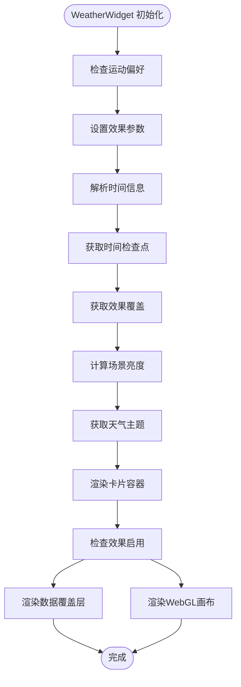
```mermaid
flowchart TD
Start([WeatherWidget 初始化]) --> CheckReducedMotion[检查运动偏好]
CheckReducedMotion --> SetupEffects[设置效果参数]
SetupEffects --> ResolveTime[解析时间信息]
ResolveTime --> GetCheckpoint[获取时间检查点]
GetCheckpoint --> GetOverrides[获取效果覆盖]
GetOverrides --> CalcBrightness[计算场景亮度]
CalcBrightness --> GetTheme[获取天气主题]
GetTheme --> RenderCard[渲染卡片容器]
RenderCard --> CheckEffects[检查效果启用]
CheckEffects --> RenderOverlay[渲染数据覆盖层]
CheckEffects --> RenderCanvas[渲染WebGL画布]
RenderOverlay --> End([完成])
RenderCanvas --> End
```

**图表来源**
- [ui-react/src/components/tool-ui/weather-widget/weather-widget-container.tsx:20-145](file://ui-react/src/components/tool-ui/weather-widget/weather-widget-container.tsx#L20-L145)

**章节来源**
- [ui-react/src/components/tool-ui/weather-widget/weather-widget-container.tsx:1-145](file://ui-react/src/components/tool-ui/weather-widget/weather-widget-container.tsx#L1-L145)

### WeatherDataOverlay 组件

WeatherDataOverlay 负责渲染天气数据的覆盖层，包含温度、湿度、风速等信息：

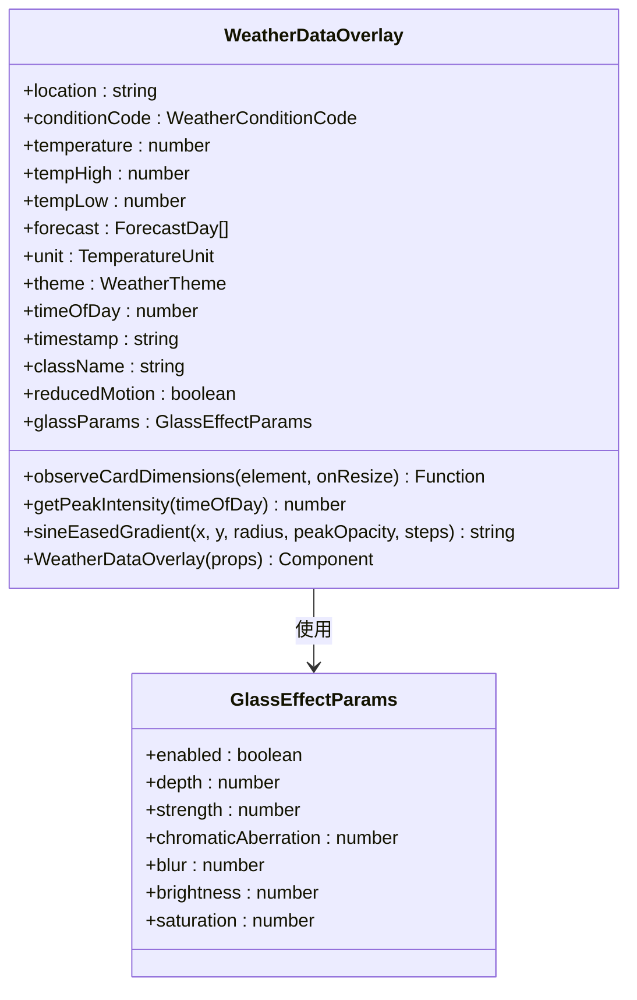
```mermaid
classDiagram
class WeatherDataOverlay {
+location : string
+conditionCode : WeatherConditionCode
+temperature : number
+tempHigh : number
+tempLow : number
+forecast : ForecastDay[]
+unit : TemperatureUnit
+theme : WeatherTheme
+timeOfDay : number
+timestamp : string
+className : string
+reducedMotion : boolean
+glassParams : GlassEffectParams
+observeCardDimensions(element, onResize) Function
+getPeakIntensity(timeOfDay) number
+sineEasedGradient(x, y, radius, peakOpacity, steps) string
+WeatherDataOverlay(props) Component
}
class GlassEffectParams {
+enabled : boolean
+depth : number
+strength : number
+chromaticAberration : number
+blur : number
+brightness : number
+saturation : number
}
WeatherDataOverlay --> GlassEffectParams : 使用
```

**图表来源**
- [ui-react/src/components/tool-ui/weather-widget/weather-data-overlay.tsx:88-110](file://ui-react/src/components/tool-ui/weather-widget/weather-data-overlay.tsx#L88-L110)

**章节来源**
- [ui-react/src/components/tool-ui/weather-widget/weather-data-overlay.tsx:1-587](file://ui-react/src/components/tool-ui/weather-widget/weather-data-overlay.tsx#L1-L587)

### WebGL 动画系统

WebGL 动画系统提供了丰富的天气效果渲染，包括天空、云彩、雨雪、闪电等效果：

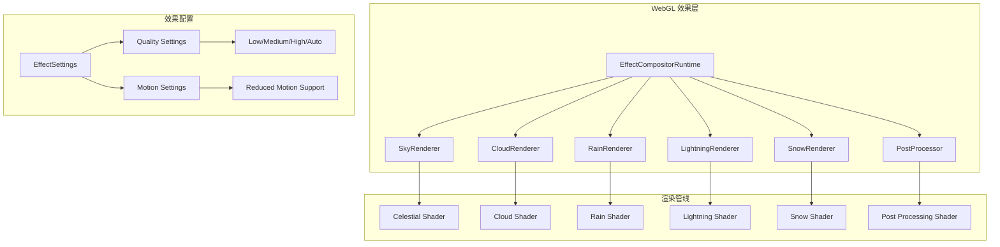
```mermaid
graph TB
subgraph "WebGL 效果层"
A[EffectCompositorRuntime] --> B[SkyRenderer]
A --> C[CloudRenderer]
A --> D[RainRenderer]
A --> E[LightningRenderer]
A --> F[SnowRenderer]
A --> G[PostProcessor]
end
subgraph "渲染管线"
B --> H[Celestial Shader]
C --> I[Cloud Shader]
D --> J[Rain Shader]
E --> K[Lightning Shader]
F --> L[Snow Shader]
G --> M[Post Processing Shader]
end
subgraph "效果配置"
N[EffectSettings] --> O[Quality Settings]
N --> P[Motion Settings]
O --> Q[Low/Medium/High/Auto]
P --> R[Reduced Motion Support]
end
```

**图表来源**
- [ui-react/src/components/tool-ui/weather-widget/generated/weather-runtime-core.generated.ts:1-29](file://ui-react/src/components/tool-ui/weather-widget/generated/weather-runtime-core.generated.ts#L1-L29)

**章节来源**
- [ui-react/src/components/tool-ui/weather-widget/generated/weather-runtime-core.generated.ts:1-66](file://ui-react/src/components/tool-ui/weather-widget/generated/weather-runtime-core.generated.ts#L1-L66)

## 工具调用组件系统

### ToolCallGroup 组件

ToolCallGroup 负责将连续的工具调用组合成可折叠的组，提供统一的工具调用状态管理：

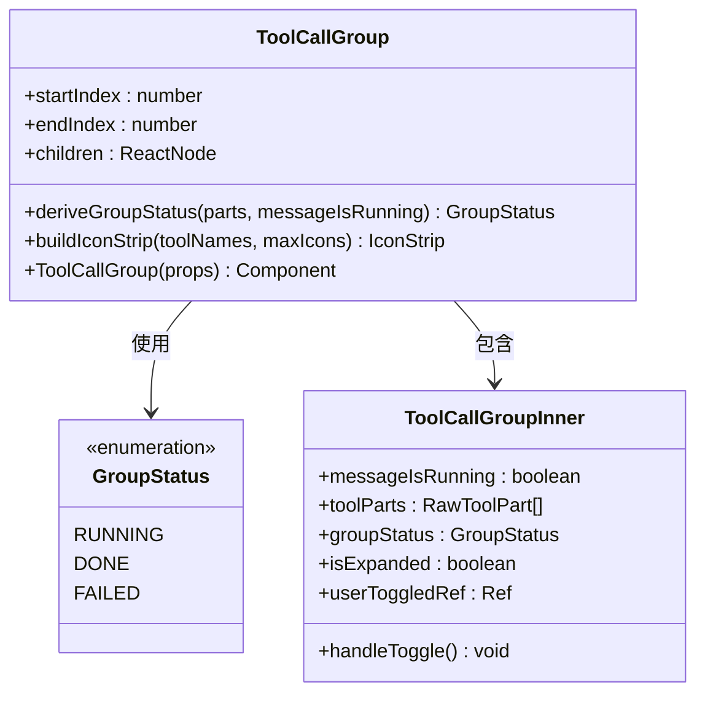
```mermaid
classDiagram
class ToolCallGroup {
+startIndex : number
+endIndex : number
+children : ReactNode
+deriveGroupStatus(parts, messageIsRunning) GroupStatus
+buildIconStrip(toolNames, maxIcons) IconStrip
+ToolCallGroup(props) Component
}
class GroupStatus {
<<enumeration>>
RUNNING
DONE
FAILED
}
class ToolCallGroupInner {
+messageIsRunning : boolean
+toolParts : RawToolPart[]
+groupStatus : GroupStatus
+isExpanded : boolean
+userToggledRef : Ref
+handleToggle() void
}
ToolCallGroup --> GroupStatus : 使用
ToolCallGroup --> ToolCallGroupInner : 包含
```

**图表来源**
- [ui-react/src/components/chat/ToolCallGroup.tsx:142-145](file://ui-react/src/components/chat/ToolCallGroup.tsx#L142-L145)

**章节来源**
- [ui-react/src/components/chat/ToolCallGroup.tsx:1-274](file://ui-react/src/components/chat/ToolCallGroup.tsx#L1-L274)

### ToolFallback 组件

ToolFallback 是工具调用的回退渲染组件，提供详细的工具调用信息展示：

```mermaid
flowchart TD
Start([ToolFallback 初始化]) --> CheckToolName[检查工具名称]
CheckToolName --> IsWeatherWidget{是否天气工具}
IsWeatherWidget --> |是| ParsePayload[解析天气数据]
ParsePayload --> RenderWeather[渲染天气小部件]
IsWeatherWidget --> |否| CheckStatus[检查工具状态]
CheckStatus --> ClassifyTool[分类工具类型]
ClassifyTool --> BuildArgsPreview[构建参数预览]
BuildArgsPreview --> RenderCard[渲染工具卡片]
RenderCard --> SetupDrawer[设置详情抽屉]
SetupDrawer --> End([完成])
RenderWeather --> End
```

**图表来源**
- [ui-react/src/components/chat/ToolFallback.tsx:405-579](file://ui-react/src/components/chat/ToolFallback.tsx#L405-L579)

**章节来源**
- [ui-react/src/components/chat/ToolFallback.tsx:1-579](file://ui-react/src/components/chat/ToolFallback.tsx#L1-L579)

### Markdown 渲染组件

Markdown 渲染组件提供了统一的 Markdown 文本渲染样式，支持 assistant-ui 上下文和普通上下文：

```mermaid
classDiagram
class MarkdownComponents {
+sharedElements : Components
+mdComponents : Components
+plainMdComponents : Components
+CodeWithContext(props) Component
+CodeWithClassName(props) Component
}
class SharedElements {
+h1 : Component
+h2 : Component
+h3 : Component
+h4 : Component
+h5 : Component
+h6 : Component
+p : Component
+a : Component
+blockquote : Component
+ul : Component
+ol : Component
+li : Component
+hr : Component
+table : Component
+th : Component
+td : Component
+tr : Component
+sup : Component
+pre : Component
+code : Component
}
MarkdownComponents --> SharedElements : 使用
```

**图表来源**
- [ui-react/src/components/chat/markdown-components.tsx:19-128](file://ui-react/src/components/chat/markdown-components.tsx#L19-L128)

**章节来源**
- [ui-react/src/components/chat/markdown-components.tsx:1-174](file://ui-react/src/components/chat/markdown-components.tsx#L1-L174)

## 类型定义系统

### 网关类型定义

网关类型定义系统提供了完整的 TypeScript 类型支持，涵盖设置、导航、协议等各个方面：

```mermaid
classDiagram
class UiSettings {
+gatewayUrl : string
+token : string
+sessionKey : string
+lastActiveSessionKey : string
+theme : ThemeMode
+chatFocusMode : boolean
+chatShowThinking : boolean
+splitRatio : number
+navCollapsed : boolean
+navGroupsCollapsed : Record~string,boolean~
+locale : string
}
class Tab {
<<enumeration>>
AGENTS
EMPLOYEES
OVERVIEW
CHANNELS
INSTANCES
SESSIONS
USAGE
CRON
SKILLS
PLUGINS
NODES
CHAT
CONFIG
SETTINGS
DEBUG
LOGS
}
class GatewayHelloOk {
+type : string
+protocol : number
+server : Server
+features : Features
+snapshot : unknown
+auth : Auth
+policy : Policy
}
UiSettings --> ThemeMode : 使用
Tab --> TabGroup : 组合
GatewayHelloOk --> PresenceEntry : 包含
```

**图表来源**
- [ui-react/src/types/gateway.ts:10-22](file://ui-react/src/types/gateway.ts#L10-L22)
- [ui-react/src/types/gateway.ts:25-41](file://ui-react/src/types/gateway.ts#L25-L41)
- [ui-react/src/types/gateway.ts:75-88](file://ui-react/src/types/gateway.ts#L75-L88)

**章节来源**
- [ui-react/src/types/gateway.ts:1-121](file://ui-react/src/types/gateway.ts#L1-L121)

### 通道类型定义

通道类型定义涵盖了各种通信渠道的状态和配置信息：

```mermaid
classDiagram
class ChannelAccountSnapshot {
+accountId : string
+name : string
+enabled : boolean
+configured : boolean
+linked : boolean
+running : boolean
+connected : boolean
+reconnectAttempts : number
+lastConnectedAt : number
+lastError : string
+mode : string
+dmPolicy : string
+allowFrom : string[]
+tokenSource : string
+appTokenSource : string
+credentialSource : string
+audienceType : string
+audience : string
+webhookPath : string
+webhookUrl : string
+baseUrl : string
+cliPath : string
+dbPath : string
+port : number
+probe : unknown
}
class ChannelCatalogEntry {
+id : string
+label : string
+detailLabel : string
+blurb : string
+systemImage : string
+docsPath : string
+installed : boolean
+npmSpec : string
+order : number
+pluginId : string
+pluginEnabled : boolean
}
ChannelAccountSnapshot --> ChannelUiMetaEntry : 使用
ChannelCatalogEntry --> ChannelUiMetaEntry : 组合
```

**图表来源**
- [ui-react/src/types/channels.ts:15-48](file://ui-react/src/types/channels.ts#L15-L48)
- [ui-react/src/types/channels.ts:272-286](file://ui-react/src/types/channels.ts#L272-L286)

**章节来源**
- [ui-react/src/types/channels.ts:1-317](file://ui-react/src/types/channels.ts#L1-L317)

### 插件类型定义

插件类型定义提供了完整的插件生命周期和配置信息管理：

```mermaid
classDiagram
class PluginRecord {
+id : string
+name : string
+version : string
+description : string
+kind : string
+source : string
+origin : string
+workspaceDir : string
+enabled : boolean
+status : PluginStatus
+error : string
+toolNames : string[]
+hookNames : string[]
+channelIds : string[]
+providerIds : string[]
+gatewayMethods : string[]
+cliCommands : string[]
+services : string[]
+commands : string[]
+httpRoutes : number
+hookCount : number
+configSchema : boolean
+configUiHints : Record~string,PluginConfigUiHint~
+configJsonSchema : Record~unknown,unknown~
}
class PluginConfigUiHint {
+label : string
+help : string
+tags : string[]
+advanced : boolean
+sensitive : boolean
+placeholder : string
}
PluginRecord --> PluginConfigUiHint : 使用
```

**图表来源**
- [ui-react/src/types/plugins.ts:15-40](file://ui-react/src/types/plugins.ts#L15-L40)

**章节来源**
- [ui-react/src/types/plugins.ts:1-68](file://ui-react/src/types/plugins.ts#L1-L68)

### 代理和技能类型定义

代理和技能类型定义提供了智能体管理和技能系统的基础类型支持：

```mermaid
classDiagram
class AgentSkillStatusEntry {
+name : string
+description : string
+source : string
+filePath : string
+baseDir : string
+skillKey : string
+bundled : boolean
+primaryEnv : string
+emoji : string
+homepage : string
+always : boolean
+disabled : boolean
+blockedByAllowlist : boolean
+eligible : boolean
+requirements : Requirements
+missing : Missing
+configChecks : SkillsStatusConfigCheck[]
+install : SkillInstallOption[]
}
class Requirements {
+bins : string[]
+env : string[]
+config : string[]
+os : string[]
}
class Missing {
+bins : string[]
+env : string[]
+config : string[]
+os : string[]
}
AgentSkillStatusEntry --> Requirements : 使用
AgentSkillStatusEntry --> Missing : 使用
```

**图表来源**
- [ui-react/src/types/agents.ts:130-159](file://ui-react/src/types/agents.ts#L130-L159)

**章节来源**
- [ui-react/src/types/agents.ts:1-292](file://ui-react/src/types/agents.ts#L1-L292)

## 依赖关系分析

React 控制界面采用模块化依赖管理，主要依赖包括：

```mermaid
graph TB
subgraph "UI 组件库"
A[react@19.0.0]
B[react-router@7.1.1]
C[lucide-react@0.469.0]
D[zustand@5.0.3]
E[qrcode@^1.0.0]
F[@assistant-ui/react@*]
G[react-markdown@^9.0.0]
H[remark-gfm@^4.0.0]
end
subgraph "设计系统"
I[radix-ui/react-*]
J[class-variance-authority@0.7.1]
K[tailwind-merge@2.6.0]
end
subgraph "工具库"
L[@noble/ed25519@3.0.0]
M[marked@17.0.4]
N[dompurify@3.3.2]
O[date-fns@^3.0.0]
P[assistant-ui/react-markdown@*]
end
subgraph "开发工具"
Q[@vitejs/plugin-react@4.3.4]
R[tailwindcss@4.1.0]
S[vitest@4.0.0]
end
App --> A
App --> B
App --> C
App --> D
App --> E
App --> F
App --> G
App --> H
App --> I
App --> J
App --> K
App --> L
App --> M
App --> N
App --> O
App --> P
App --> Q
App --> R
App --> S
```

**图表来源**
- [ui-react/package.json:11-45](file://ui-react/package.json#L11-L45)
- [ui-react/package.json:47-58](file://ui-react/package.json#L47-L58)

**章节来源**
- [ui-react/package.json:1-60](file://ui-react/package.json#L1-L60)

## 性能考虑

### 连接优化策略

1. **指数退避重连**: 使用 1.7 倍增长的退避策略，最大延迟 15 秒
2. **设备身份缓存**: 本地存储 Ed25519 密钥对，避免重复生成
3. **事件缓冲**: 最大保留 250 条事件日志用于调试
4. **懒加载组件**: 路由级别的代码分割，按需加载页面组件

### 内存管理

1. **引用稳定化**: 使用 useRef 保持回调函数引用稳定，避免不必要的重渲染
2. **状态分区**: 将不同类型的设置分离到独立的 store 中
3. **清理机制**: 组件卸载时自动清理 WebSocket 连接和定时器

### 构建优化

1. **独立输出目录**: 构建产物输出到 `../dist/control-ui-react`，避免与主 UI 冲突
2. **源码映射**: 生产环境启用 sourcemap 方便调试
3. **静态资源复用**: 复用现有 Lit UI 的公共资源

### 新增功能的性能优化

1. **WebGL 效果优化**: 使用高效的着色器程序和纹理管理
2. **组件懒加载**: 通道和插件相关组件按需加载，减少初始包大小
3. **状态缓存**: 使用 Zustand 的高效状态管理，避免不必要的重渲染
4. **异步操作**: 所有网络请求都采用异步处理，避免阻塞主线程
5. **错误边界**: 新增组件都包含错误边界，提高应用稳定性
6. **运动偏好检测**: 自动检测用户的运动偏好设置，优化动画效果

## 故障排除指南

### 常见连接问题

| 问题类型 | 错误代码 | 可能原因 | 解决方案 |
|---------|---------|---------|---------|
| 认证失败 | AUTH_TOKEN_MISSING | 缺少访问令牌 | 在设置中配置正确的令牌 |
| 网络错误 | CONNECT_FAILED | 网络连接问题 | 检查防火墙设置和网络连接 |
| 设备认证 | DEVICE_IDENTITY_REQUIRED | 设备密钥丢失 | 清除浏览器存储重新生成 |
| 权限不足 | PAIRING_REQUIRED | 未授权访问 | 完成设备配对流程 |

### 通道管理问题

| 问题类型 | 错误代码 | 可能原因 | 解决方案 |
|---------|---------|---------|---------|
| 通道启用失败 | ENABLE_CHANNEL_FAILED | 插件未正确安装 | 检查插件状态并重新安装 |
| 通道配置错误 | CONFIG_SCHEMA_ERROR | 配置模式不匹配 | 检查配置格式和必填字段 |
| 登录超时 | LOGIN_TIMEOUT | 网络延迟或服务端问题 | 重试登录或检查服务状态 |
| 插件冲突 | PLUGIN_CONFLICT | 多个插件冲突 | 禁用冲突插件或升级版本 |

### 天气小部件问题

| 问题类型 | 错误代码 | 可能原因 | 解决方案 |
|---------|---------|---------|---------|
| WebGL 渲染失败 | WEBGL_NOT_SUPPORTED | 设备不支持 WebGL2 | 检查浏览器兼容性和硬件支持 |
| 天气数据解析错误 | WEATHER_DATA_ERROR | 数据格式不正确 | 检查天气 API 返回格式 |
| 动画卡顿 | ANIMATION_PERFORMANCE | GPU 性能不足 | 调整效果质量设置或禁用动画 |
| 移动偏好检测失败 | REDUCED_MOTION_ERROR | 媒体查询不支持 | 检查浏览器兼容性 |

### 工具调用问题

| 问题类型 | 错误代码 | 可能原因 | 解决方案 |
|---------|---------|---------|---------|
| 工具调用失败 | TOOL_CALL_FAILED | 工具执行错误 | 检查工具配置和权限设置 |
| 工具状态异常 | TOOL_STATUS_ERROR | 状态同步问题 | 刷新页面或重启工具调用 |
| 参数解析错误 | TOOL_ARGS_ERROR | 参数格式不正确 | 检查工具参数格式和类型 |
| 结果渲染失败 | TOOL_RESULT_ERROR | 结果格式不支持 | 检查结果数据格式和渲染组件 |

### 调试技巧

1. **事件日志**: 查看调试页的事件日志了解连接状态变化
2. **网络面板**: 使用浏览器开发者工具监控 WebSocket 连接
3. **控制台日志**: 关注 GatewayClient 的连接状态日志
4. **存储检查**: 检查 localStorage 和 sessionStorage 中的配置
5. **状态检查**: 使用 React DevTools 检查组件状态变化
6. **WebGL 调试**: 使用浏览器 WebGL 调试工具检查渲染状态

**章节来源**
- [ui-react/src/hooks/useGateway.ts:277-291](file://ui-react/src/hooks/useGateway.ts#L277-L291)
- [ui-react/src/store/gateway.store.ts:128-167](file://ui-react/src/store/gateway.store.ts#L128-L167)

## 结论

React 控制界面为 OpenClaw 项目提供了现代化、响应式的用户界面。通过精心设计的架构和状态管理，实现了以下关键特性：

1. **模块化设计**: 清晰的组件层次结构，便于维护和扩展
2. **高性能实现**: 优化的连接管理和内存使用策略
3. **用户体验**: 流畅的动画效果和直观的交互设计
4. **可维护性**: 类型安全的 TypeScript 实现和完善的测试覆盖
5. **可扩展性**: 支持新增通道和插件的灵活架构

**更新** 新增的天气小部件组件系统、工具调用组件系统、WebGL 动画效果和完整的类型定义系统大幅增强了系统的可视化能力、交互体验和类型安全性。这些功能通过统一的状态管理和组件化设计，为用户提供了完整的工具调用和天气信息展示能力。

天气小部件系统使用 WebGL 技术实现了逼真的天气效果渲染，包括天空渐变、云彩飘动、雨水效果、雪花飞舞和闪电特效等。工具调用组件系统提供了完整的工具调用状态管理和可视化展示，支持工具分类、状态跟踪和详细信息查看。类型定义系统确保了整个应用的类型安全性和开发体验。

该界面成功地将复杂的 Gateway 协议抽象为易用的用户界面，为 OpenClaw 的多平台部署提供了统一的控制入口。未来可以进一步优化移动端体验和离线功能支持，同时考虑添加更多天气效果和工具类型的支持。