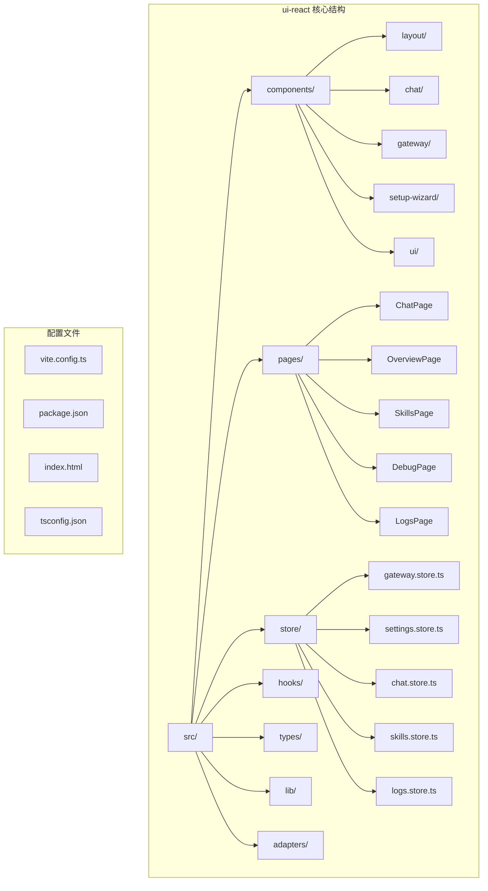
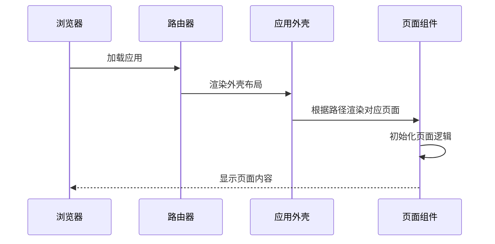
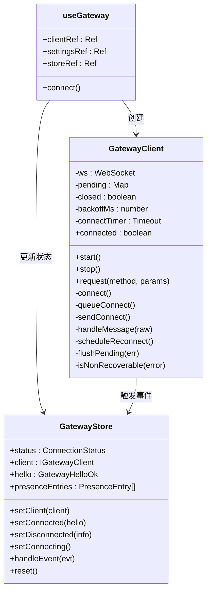
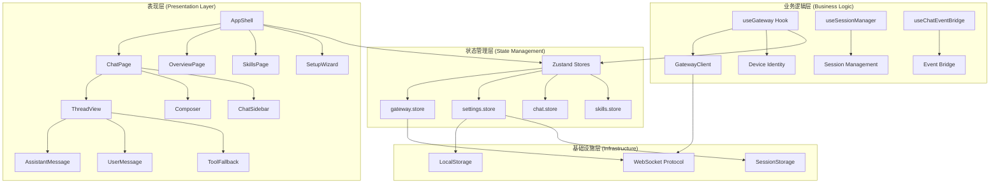
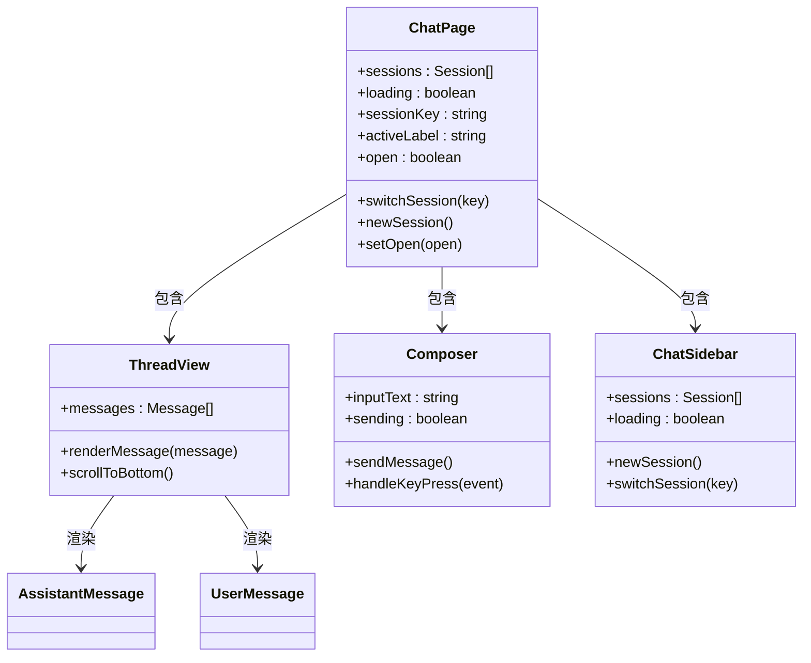
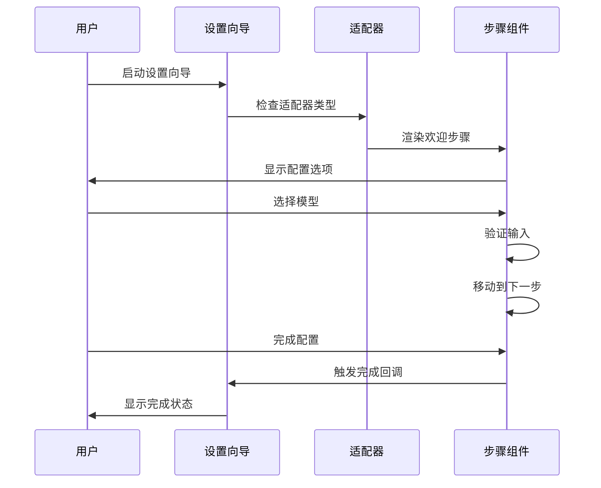
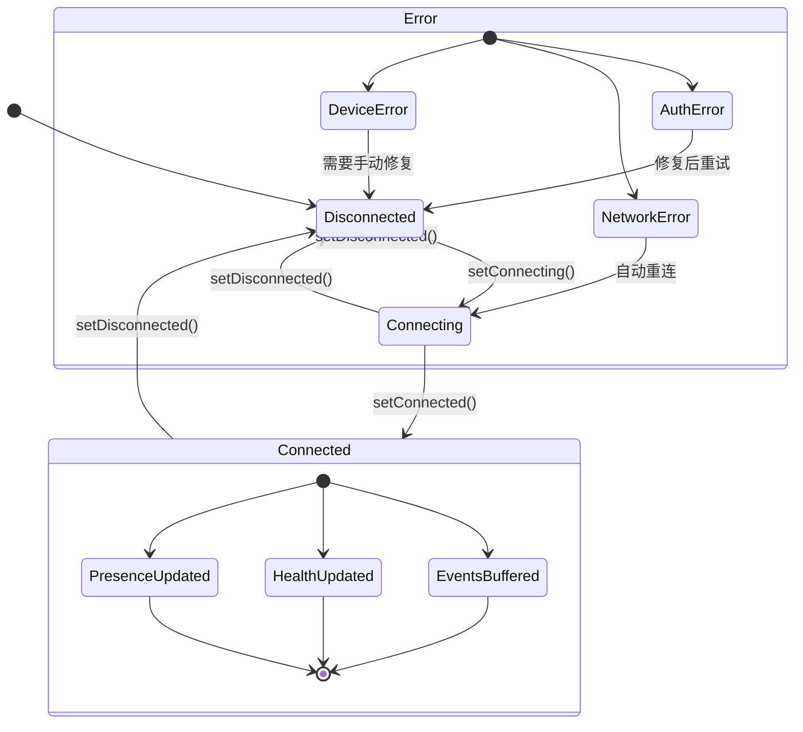

# React Control Ui

<cite>
**本文档引用的文件**
- [README.md](file://README.md)
- [package.json](file://package.json)
- [ui-react/src/App.tsx](file://ui-react/src/App.tsx)
- [ui-react/src/main.tsx](file://ui-react/src/main.tsx)
- [ui-react/src/router.tsx](file://ui-react/src/router.tsx)
- [ui-react/src/store/gateway.store.ts](file://ui-react/src/store/gateway.store.ts)
- [ui-react/src/hooks/useGateway.ts](file://ui-react/src/hooks/useGateway.ts)
- [ui-react/src/components/layout/AppShell.tsx](file://ui-react/src/components/layout/AppShell.tsx)
- [ui-react/src/pages/ChatPage.tsx](file://ui-react/src/pages/ChatPage.tsx)
- [ui-react/src/components/chat/ChatSidebar.tsx](file://ui-react/src/components/chat/ChatSidebar.tsx)
- [ui-react/src/components/setup-wizard/index.tsx](file://ui-react/src/components/setup-wizard/index.tsx)
- [ui-react/package.json](file://ui-react/package.json)
- [ui-react/src/types/gateway.ts](file://ui-react/src/types/gateway.ts)
- [ui-react/src/store/settings.store.ts](file://ui-react/src/store/settings.store.ts)
- [ui-react/vite.config.ts](file://ui-react/vite.config.ts)
- [ui-react/src/lib/utils.ts](file://ui-react/src/lib/utils.ts)
</cite>

## 目录
1. [简介](#简介)
2. [项目结构](#项目结构)
3. [核心组件](#核心组件)
4. [架构概览](#架构概览)
5. [详细组件分析](#详细组件分析)
6. [依赖关系分析](#依赖关系分析)
7. [性能考虑](#性能考虑)
8. [故障排除指南](#故障排除指南)
9. [结论](#结论)

## 简介

React Control Ui 是 OpenClaw 个人 AI 助手项目中的 React 控制界面，负责提供用户与 Gateway 的交互界面。OpenClaw 是一个可在本地设备上运行的个人 AI 助手，支持多渠道消息集成、实时聊天、会话管理和技能系统。

该控制界面基于 React 19 和 Vite 构建，使用 Zustand 进行状态管理，提供现代化的用户界面和流畅的用户体验。界面采用 shadcn/ui 设计系统，支持深色/浅色主题切换，并集成了完整的聊天功能。

## 项目结构

React Control Ui 位于项目根目录下的 `ui-react` 文件夹中，采用模块化组织方式：



**图表来源**
- [ui-react/src/App.tsx:1-7](file://ui-react/src/App.tsx#L1-L7)
- [ui-react/src/router.tsx:1-42](file://ui-react/src/router.tsx#L1-L42)
- [ui-react/package.json:1-60](file://ui-react/package.json#L1-L60)

**章节来源**
- [ui-react/src/App.tsx:1-7](file://ui-react/src/App.tsx#L1-L7)
- [ui-react/src/main.tsx:1-11](file://ui-react/src/main.tsx#L1-L11)
- [ui-react/src/router.tsx:1-42](file://ui-react/src/router.tsx#L1-L42)

## 核心组件

### 应用入口和路由系统

应用采用 React Router 7 进行路由管理，支持哈希路由模式，确保在不同部署环境下的一致性：



**图表来源**
- [ui-react/src/router.tsx:19-41](file://ui-react/src/router.tsx#L19-L41)
- [ui-react/src/components/layout/AppShell.tsx:11-32](file://ui-react/src/components/layout/AppShell.tsx#L11-L32)

### 网关连接管理

使用自定义的 GatewayClient 实现 WebSocket 连接，支持自动重连、设备身份验证和事件处理：



**图表来源**
- [ui-react/src/hooks/useGateway.ts:35-292](file://ui-react/src/hooks/useGateway.ts#L35-L292)
- [ui-react/src/store/gateway.store.ts:41-183](file://ui-react/src/store/gateway.store.ts#L41-L183)

**章节来源**
- [ui-react/src/hooks/useGateway.ts:430-503](file://ui-react/src/hooks/useGateway.ts#L430-L503)
- [ui-react/src/store/gateway.store.ts:1-184](file://ui-react/src/store/gateway.store.ts#L1-L184)

## 架构概览

React Control Ui 采用分层架构设计，清晰分离关注点：



**图表来源**
- [ui-react/src/components/layout/AppShell.tsx:11-32](file://ui-react/src/components/layout/AppShell.tsx#L11-L32)
- [ui-react/src/pages/ChatPage.tsx:9-95](file://ui-react/src/pages/ChatPage.tsx#L9-L95)
- [ui-react/src/store/gateway.store.ts:72-183](file://ui-react/src/store/gateway.store.ts#L72-L183)

## 详细组件分析

### 应用外壳 (AppShell)

AppShell 作为应用的根布局组件，负责初始化网关连接并提供侧边栏导航：


**图表来源**
- [ui-react/src/components/layout/AppShell.tsx:11-32](file://ui-react/src/components/layout/AppShell.tsx#L11-L32)

**章节来源**
- [ui-react/src/components/layout/AppShell.tsx:1-33](file://ui-react/src/components/layout/AppShell.tsx#L1-L33)

### 聊天页面 (ChatPage)

ChatPage 提供完整的聊天界面，包括会话选择、消息显示和输入 composer：



**图表来源**
- [ui-react/src/pages/ChatPage.tsx:9-95](file://ui-react/src/pages/ChatPage.tsx#L9-L95)
- [ui-react/src/components/chat/ChatSidebar.tsx:19-116](file://ui-react/src/components/chat/ChatSidebar.tsx#L19-L116)

**章节来源**
- [ui-react/src/pages/ChatPage.tsx:1-96](file://ui-react/src/pages/ChatPage.tsx#L1-L96)
- [ui-react/src/components/chat/ChatSidebar.tsx:1-117](file://ui-react/src/components/chat/ChatSidebar.tsx#L1-L117)

### 设置向导 (SetupWizard)

设置向导提供逐步配置界面，支持多种适配器模式：



**图表来源**
- [ui-react/src/components/setup-wizard/index.tsx:11-30](file://ui-react/src/components/setup-wizard/index.tsx#L11-L30)

**章节来源**
- [ui-react/src/components/setup-wizard/index.tsx:1-31](file://ui-react/src/components/setup-wizard/index.tsx#L1-L31)

### 状态管理系统

使用 Zustand 实现轻量级状态管理，避免复杂的上下文传递：



**图表来源**
- [ui-react/src/store/gateway.store.ts:39-68](file://ui-react/src/store/gateway.store.ts#L39-L68)
- [ui-react/src/store/gateway.store.ts:72-183](file://ui-react/src/store/gateway.store.ts#L72-L183)

**章节来源**
- [ui-react/src/store/gateway.store.ts:1-184](file://ui-react/src/store/gateway.store.ts#L1-L184)
- [ui-react/src/store/settings.store.ts:289-308](file://ui-react/src/store/settings.store.ts#L289-L308)

## 依赖关系分析

React Control Ui 采用模块化依赖管理，主要依赖包括：

```mermaid
graph TB
subgraph "UI 组件库"
A[react@19.0.0]
B[react-router@7.1.1]
C[lucide-react@0.469.0]
D[zustand@5.0.3]
end
subgraph "设计系统"
E[radix-ui/react-*]
F[class-variance-authority@0.7.1]
G[tailwind-merge@2.6.0]
end
subgraph "工具库"
H[@noble/ed25519@3.0.0]
I[marked@17.0.4]
J[dompurify@3.3.2]
end
subgraph "开发工具"
K[@vitejs/plugin-react@4.3.4]
L[tailwindcss@4.1.0]
M[vitest@4.0.0]
end
App --> A
App --> B
App --> C
App --> D
App --> E
App --> F
App --> G
App --> H
App --> I
App --> J
App --> K
App --> L
App --> M
```

**图表来源**
- [ui-react/package.json:11-45](file://ui-react/package.json#L11-L45)
- [ui-react/package.json:47-58](file://ui-react/package.json#L47-L58)

**章节来源**
- [ui-react/package.json:1-60](file://ui-react/package.json#L1-L60)

## 性能考虑

### 连接优化策略

1. **指数退避重连**: 使用 1.7 倍增长的退避策略，最大延迟 15 秒
2. **设备身份缓存**: 本地存储 Ed25519 密钥对，避免重复生成
3. **事件缓冲**: 最大保留 250 条事件日志用于调试
4. **懒加载组件**: 路由级别的代码分割，按需加载页面组件

### 内存管理

1. **引用稳定化**: 使用 useRef 保持回调函数引用稳定，避免不必要的重渲染
2. **状态分区**: 将不同类型的设置分离到独立的 store 中
3. **清理机制**: 组件卸载时自动清理 WebSocket 连接和定时器

### 构建优化

1. **独立输出目录**: 构建产物输出到 `../dist/control-ui-react`，避免与主 UI 冲突
2. **源码映射**: 生产环境启用 sourcemap 方便调试
3. **静态资源复用**: 复用现有 Lit UI 的公共资源

## 故障排除指南

### 常见连接问题

| 问题类型 | 错误代码 | 可能原因 | 解决方案 |
|---------|---------|---------|---------|
| 认证失败 | AUTH_TOKEN_MISSING | 缺少访问令牌 | 在设置中配置正确的令牌 |
| 网络错误 | CONNECT_FAILED | 网络连接问题 | 检查防火墙设置和网络连接 |
| 设备认证 | DEVICE_IDENTITY_REQUIRED | 设备密钥丢失 | 清除浏览器存储重新生成 |
| 权限不足 | PAIRING_REQUIRED | 未授权访问 | 完成设备配对流程 |

### 调试技巧

1. **事件日志**: 查看调试页的事件日志了解连接状态变化
2. **网络面板**: 使用浏览器开发者工具监控 WebSocket 连接
3. **控制台日志**: 关注 GatewayClient 的连接状态日志
4. **存储检查**: 检查 localStorage 和 sessionStorage 中的配置

**章节来源**
- [ui-react/src/hooks/useGateway.ts:277-291](file://ui-react/src/hooks/useGateway.ts#L277-L291)
- [ui-react/src/store/gateway.store.ts:128-167](file://ui-react/src/store/gateway.store.ts#L128-L167)

## 结论

React Control Ui 为 OpenClaw 项目提供了现代化、响应式的用户界面。通过精心设计的架构和状态管理，实现了以下关键特性：

1. **模块化设计**: 清晰的组件层次结构，便于维护和扩展
2. **高性能实现**: 优化的连接管理和内存使用策略
3. **用户体验**: 流畅的动画效果和直观的交互设计
4. **可维护性**: 类型安全的 TypeScript 实现和完善的测试覆盖

该界面成功地将复杂的 Gateway 协议抽象为易用的用户界面，为 OpenClaw 的多平台部署提供了统一的控制入口。未来可以进一步优化移动端体验和离线功能支持。