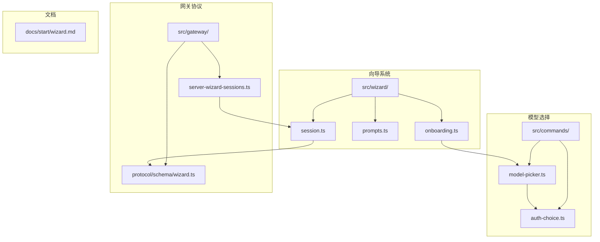
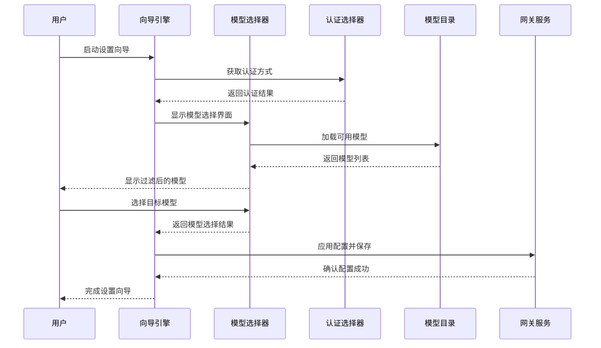
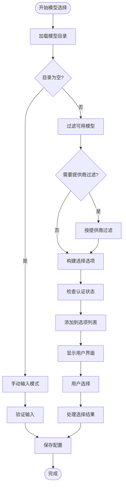
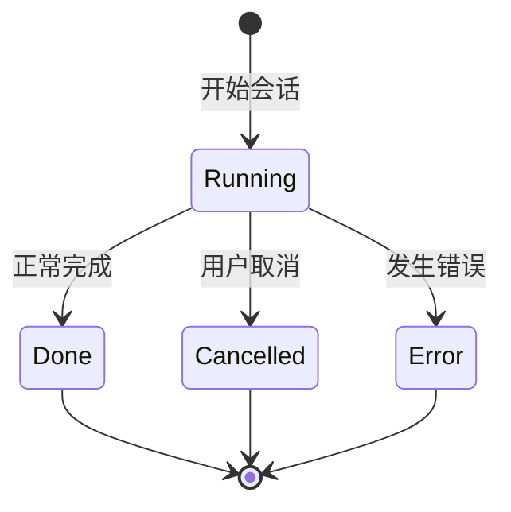
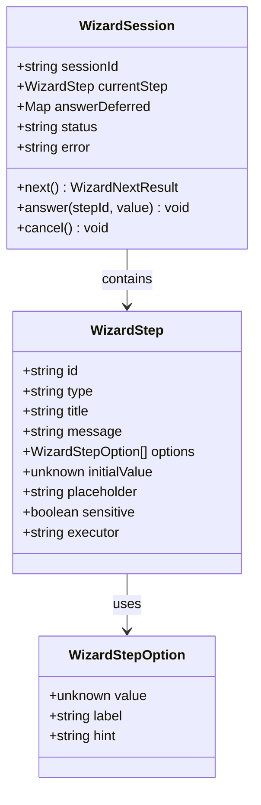
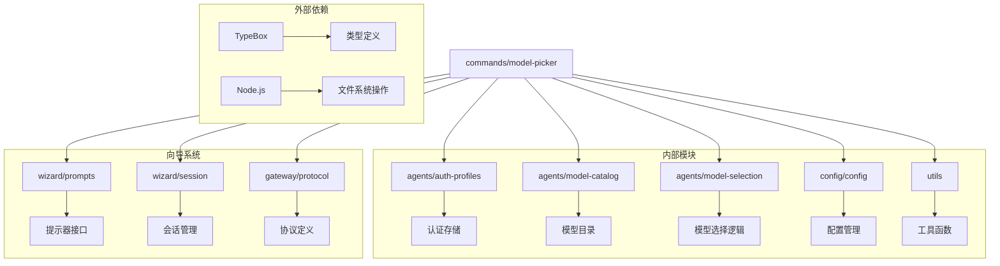

# Setup Wizard Model Selection

<cite>
**本文档引用的文件**
- [src/wizard/onboarding.ts](file://src/wizard/onboarding.ts)
- [src/commands/model-picker.ts](file://src/commands/model-picker.ts)
- [src/commands/auth-choice.ts](file://src/commands/auth-choice.ts)
- [src/wizard/prompts.ts](file://src/wizard/prompts.ts)
- [src/wizard/session.ts](file://src/wizard/session.ts)
- [src/gateway/protocol/schema/wizard.ts](file://src/gateway/protocol/schema/wizard.ts)
- [src/gateway/server-wizard-sessions.ts](file://src/gateway/server-wizard-sessions.ts)
- [docs/start/wizard.md](file://docs/start/wizard.md)
</cite>

## 目录
1. [简介](#简介)
2. [项目结构](#项目结构)
3. [核心组件](#核心组件)
4. [架构概览](#架构概览)
5. [详细组件分析](#详细组件分析)
6. [依赖关系分析](#依赖关系分析)
7. [性能考虑](#性能考虑)
8. [故障排除指南](#故障排除指南)
9. [结论](#结论)

## 简介

Setup Wizard Model Selection 是 OpenClaw 项目中的一个关键功能模块，负责在设置向导过程中为用户选择默认模型。该模块提供了智能的模型选择界面，支持多种模型提供商、自动认证检查和用户友好的交互体验。

这个功能是 OpenClaw 开源人工智能代理平台的重要组成部分，旨在简化用户在首次配置时的模型选择过程，确保用户能够快速找到适合其需求的 AI 模型。

## 项目结构

OpenClaw 项目采用模块化架构设计，Setup Wizard Model Selection 功能分布在多个相关目录中：

**图表来源**
- [src/wizard/onboarding.ts:1-554](file://src/wizard/onboarding.ts#L1-L554)
- [src/commands/model-picker.ts:1-568](file://src/commands/model-picker.ts#L1-L568)
- [src/gateway/protocol/schema/wizard.ts:1-104](file://src/gateway/protocol/schema/wizard.ts#L1-L104)

**章节来源**
- [src/wizard/onboarding.ts:1-554](file://src/wizard/onboarding.ts#L1-L554)
- [src/commands/model-picker.ts:1-568](file://src/commands/model-picker.ts#L1-L568)
- [docs/start/wizard.md:1-124](file://docs/start/wizard.md#L1-L124)

## 核心组件

Setup Wizard Model Selection 功能由以下核心组件构成：

### 1. 模型选择器 (ModelPicker)
负责提供用户友好的模型选择界面，支持多种过滤选项和认证状态显示。

### 2. 认证选择器 (AuthChoice)
处理不同类型的认证方式，包括 API 密钥、OAuth 和自定义提供商。

### 3. 向导会话管理器 (WizardSession)
管理整个向导流程的状态和用户交互。

### 4. 提示器接口 (WizardPrompter)
定义标准化的用户交互接口，支持文本输入、选择列表和确认对话框。

**章节来源**
- [src/commands/model-picker.ts:177-357](file://src/commands/model-picker.ts#L177-L357)
- [src/commands/auth-choice.ts:1-4](file://src/commands/auth-choice.ts#L1-L4)
- [src/wizard/session.ts:163-265](file://src/wizard/session.ts#L163-L265)
- [src/wizard/prompts.ts:37-54](file://src/wizard/prompts.ts#L37-L54)

## 架构概览

Setup Wizard Model Selection 的整体架构采用分层设计，确保了良好的可维护性和扩展性：

**图表来源**
- [src/wizard/onboarding.ts:454-469](file://src/wizard/onboarding.ts#L454-L469)
- [src/commands/model-picker.ts:177-357](file://src/commands/model-picker.ts#L177-L357)

## 详细组件分析

### 模型选择器组件分析

模型选择器是整个功能的核心组件，提供了丰富的模型选择能力：

#### 主要功能特性

1. **多提供商支持**: 支持多个 AI 模型提供商，包括 OpenAI、Anthropic、Google 等
2. **智能过滤**: 基于提供商、上下文窗口大小和推理能力进行过滤
3. **认证状态检查**: 自动检测用户是否具备相应提供商的访问权限
4. **别名支持**: 支持模型别名映射，提高用户体验
5. **手动输入**: 允许用户直接输入自定义模型名称

#### 数据流分析

**图表来源**
- [src/commands/model-picker.ts:199-357](file://src/commands/model-picker.ts#L199-L357)

#### 关键实现细节

模型选择器通过以下机制确保用户体验：

1. **动态提供商检测**: 自动识别可用的模型提供商
2. **认证状态可视化**: 在选项中标记缺少认证信息的模型
3. **智能初始值**: 根据现有配置和首选提供商设置初始选择
4. **错误处理**: 提供友好的错误提示和回退机制

**章节来源**
- [src/commands/model-picker.ts:177-357](file://src/commands/model-picker.ts#L177-L357)
- [src/commands/model-picker.ts:44-78](file://src/commands/model-picker.ts#L44-L78)

### 向导会话管理系统

向导会话管理器负责协调整个设置向导的执行流程：

#### 会话状态管理

**图表来源**
- [src/wizard/session.ts:22-29](file://src/wizard/session.ts#L22-L29)

#### 步骤执行机制

会话管理器实现了异步步骤执行机制，支持复杂的用户交互流程：

1. **步骤队列管理**: 维护待执行的步骤队列
2. **异步等待机制**: 支持步骤间的异步通信
3. **错误传播**: 将异常正确传播到会话级别
4. **状态同步**: 确保客户端和服务器端状态一致

**章节来源**
- [src/wizard/session.ts:163-265](file://src/wizard/session.ts#L163-L265)

### 网关协议集成

Setup Wizard Model Selection 与网关协议紧密集成，支持远程向导执行：

#### 协议数据结构

**图表来源**
- [src/gateway/protocol/schema/wizard.ts:55-76](file://src/gateway/protocol/schema/wizard.ts#L55-L76)
- [src/gateway/protocol/schema/wizard.ts:46-53](file://src/gateway/protocol/schema/wizard.ts#L46-L53)

**章节来源**
- [src/gateway/protocol/schema/wizard.ts:1-104](file://src/gateway/protocol/schema/wizard.ts#L1-L104)
- [src/gateway/server-wizard-sessions.ts:1-28](file://src/gateway/server-wizard-sessions.ts#L1-L28)

## 依赖关系分析

Setup Wizard Model Selection 功能的依赖关系展现了清晰的分层架构：

**图表来源**
- [src/commands/model-picker.ts:1-18](file://src/commands/model-picker.ts#L1-L18)
- [src/wizard/onboarding.ts:1-22](file://src/wizard/onboarding.ts#L1-L22)

**章节来源**
- [src/commands/model-picker.ts:1-18](file://src/commands/model-picker.ts#L1-L18)
- [src/wizard/onboarding.ts:1-22](file://src/wizard/onboarding.ts#L1-L22)

## 性能考虑

Setup Wizard Model Selection 在设计时充分考虑了性能优化：

### 1. 模型目录缓存
- 使用内存缓存减少重复的模型目录加载
- 支持禁用缓存以获取最新数据
- 智能缓存失效策略

### 2. 异步处理
- 所有网络请求采用异步处理
- 非阻塞的用户交互体验
- 并发操作优化

### 3. 内存管理
- 及时清理临时数据结构
- 避免内存泄漏
- 合理的垃圾回收策略

## 故障排除指南

### 常见问题及解决方案

#### 1. 模型选择界面无法加载
**症状**: 模型选择器显示空白或加载失败
**解决方案**:
- 检查网络连接是否正常
- 验证模型目录服务是否可用
- 清除浏览器缓存后重试

#### 2. 认证失败
**症状**: 选择的模型显示认证缺失
**解决方案**:
- 确认已正确配置 API 密钥
- 检查提供商的访问权限
- 验证环境变量设置

#### 3. 向导会话超时
**症状**: 向导在执行过程中中断
**解决方案**:
- 检查服务器连接状态
- 增加会话超时时间
- 重新启动向导进程

**章节来源**
- [src/wizard/onboarding.ts:23-71](file://src/wizard/onboarding.ts#L23-L71)
- [src/commands/model-picker.ts:159-175](file://src/commands/model-picker.ts#L159-L175)

## 结论

Setup Wizard Model Selection 功能展现了现代软件工程的最佳实践，通过模块化设计、清晰的分层架构和完善的错误处理机制，为用户提供了优秀的模型选择体验。

该功能的主要优势包括：
- **用户友好**: 直观的界面设计和智能的交互流程
- **功能完整**: 支持多种模型提供商和认证方式
- **性能优秀**: 优化的加载和渲染机制
- **可扩展性强**: 良好的架构设计便于功能扩展

未来的发展方向可能包括：
- 更智能的模型推荐算法
- 支持更多模型提供商
- 增强的用户个性化设置
- 更完善的性能监控和分析