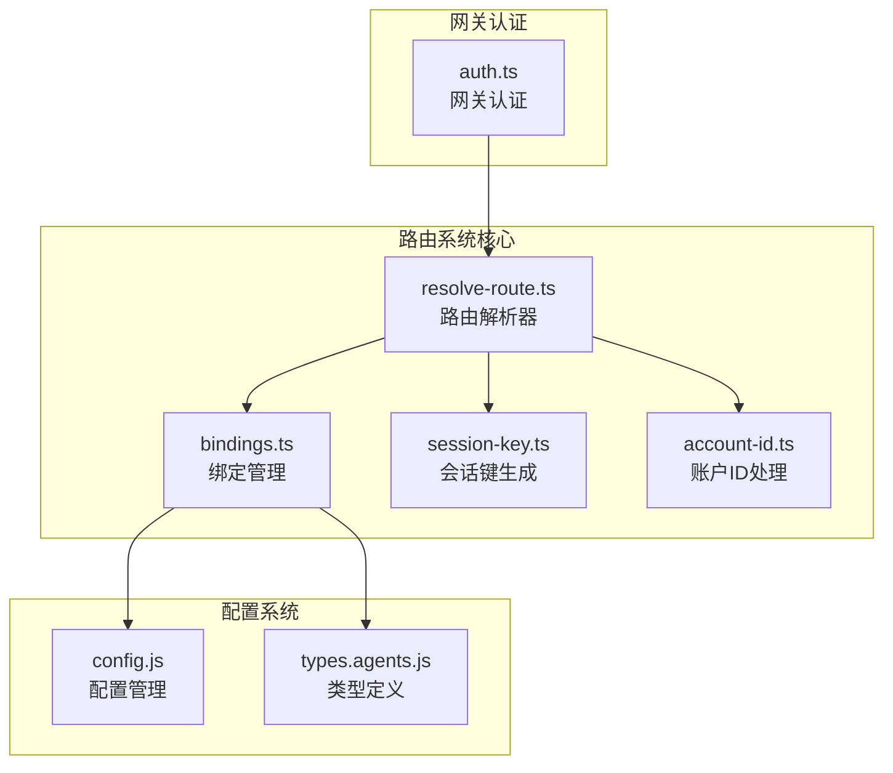
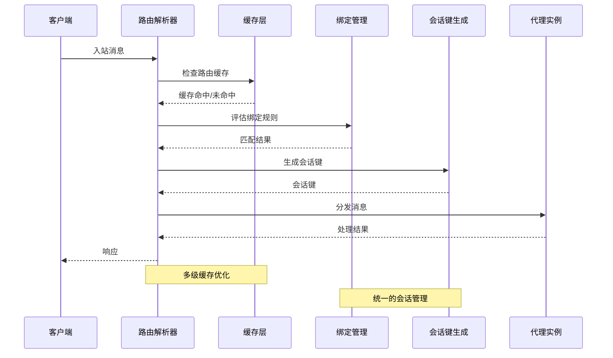
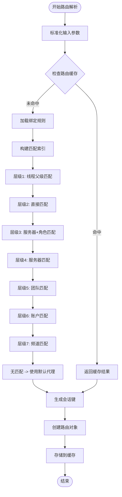
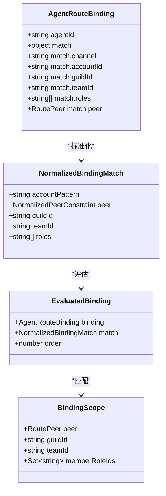
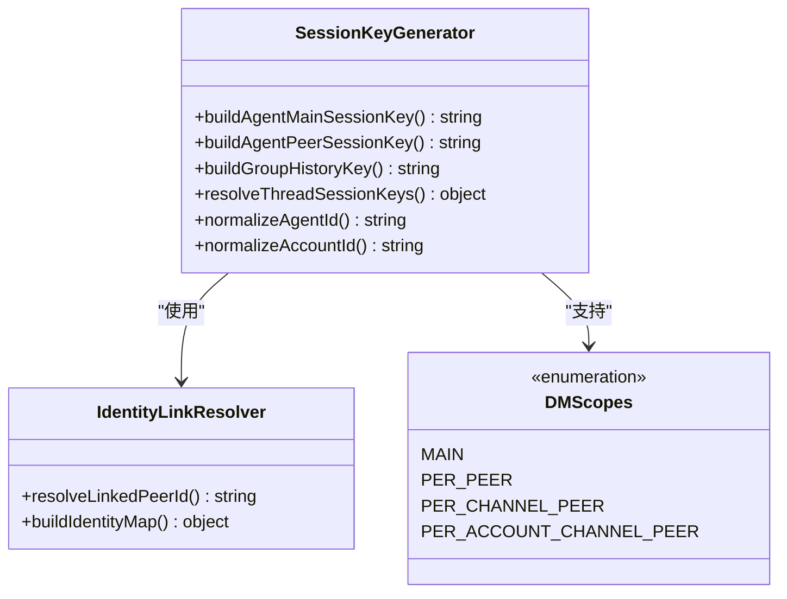
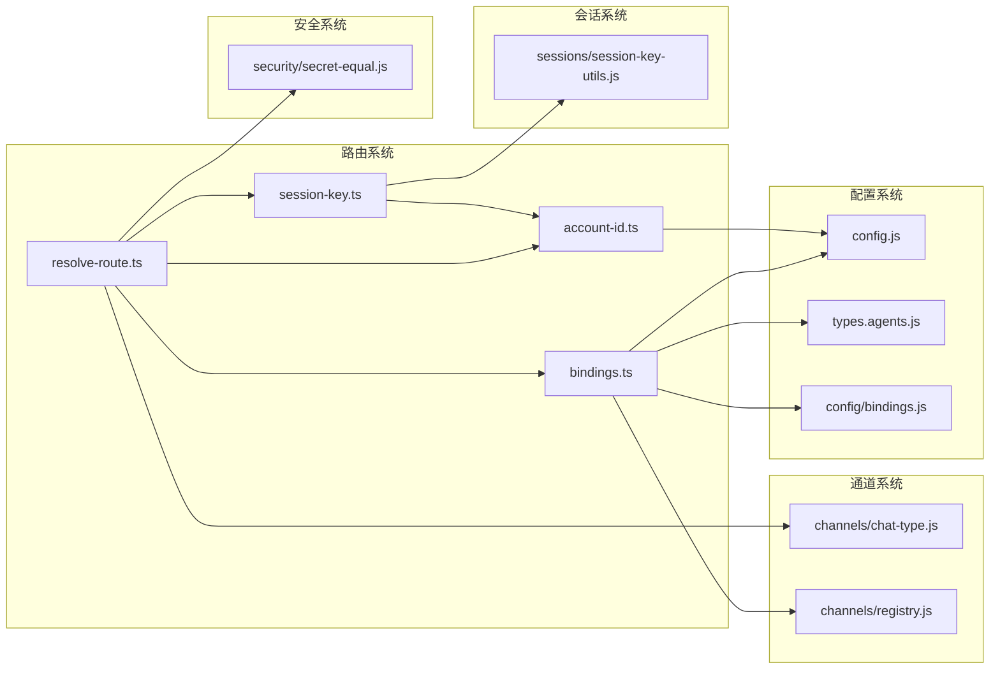

# Temp Route File

<cite>
**本文档引用的文件**
- [src/routing/resolve-route.ts](file://src/routing/resolve-route.ts)
- [src/routing/bindings.ts](file://src/routing/bindings.ts)
- [src/routing/session-key.ts](file://src/routing/session-key.ts)
- [src/routing/account-id.ts](file://src/routing/account-id.ts)
- [src/gateway/auth.ts](file://src/gateway/auth.ts)
</cite>

## 目录
1. [简介](#简介)
2. [项目结构](#项目结构)
3. [核心组件](#核心组件)
4. [架构概览](#架构概览)
5. [详细组件分析](#详细组件分析)
6. [依赖关系分析](#依赖关系分析)
7. [性能考虑](#性能考虑)
8. [故障排除指南](#故障排除指南)
9. [结论](#结论)

## 简介

本文档深入分析了OpenClaw项目中的路由系统实现，重点关注代理路由解析、绑定管理和会话键生成等核心功能。该系统负责将入站消息路由到适当的代理实例，并管理跨不同通信渠道（如Discord、Telegram、Signal等）的消息传递。

路由系统采用多层匹配策略，支持基于账户、频道、服务器角色和线程的复杂路由规则。系统还提供了会话键管理、身份链接映射和缓存优化等功能，以确保高效的消息路由和状态管理。

## 项目结构

OpenClaw的路由系统主要分布在以下模块中：

**图表来源**
- [src/routing/resolve-route.ts:1-805](file://src/routing/resolve-route.ts#L1-L805)
- [src/routing/bindings.ts:1-115](file://src/routing/bindings.ts#L1-L115)
- [src/routing/session-key.ts:1-254](file://src/routing/session-key.ts#L1-L254)
- [src/routing/account-id.ts:1-71](file://src/routing/account-id.ts#L1-L71)

**章节来源**
- [src/routing/resolve-route.ts:1-805](file://src/routing/resolve-route.ts#L1-L805)
- [src/routing/bindings.ts:1-115](file://src/routing/bindings.ts#L1-L115)
- [src/routing/session-key.ts:1-254](file://src/routing/session-key.ts#L1-L254)
- [src/routing/account-id.ts:1-71](file://src/routing/account-id.ts#L1-L71)

## 核心组件

### 路由解析器 (ResolveAgentRoute)

路由解析器是整个系统的中枢，负责根据多种条件匹配合适的代理实例：

- **多层匹配策略**：支持基于线程父级、服务器角色、服务器、团队、账户和频道的分层匹配
- **缓存机制**：实现两级缓存系统，包括绑定评估缓存和路由结果缓存
- **调试支持**：提供详细的日志记录功能，便于问题诊断

### 绑定管理系统

绑定系统负责管理代理路由规则：

- **灵活的匹配条件**：支持账户模式、频道、服务器ID、团队ID和角色列表
- **索引优化**：构建多维索引以加速路由查找
- **通道账户组合**：支持按频道和账户组合的绑定管理

### 会话键生成器

会话键系统确保消息在正确的上下文中处理：

- **多级会话管理**：支持主会话、直接聊天会话和线程会话
- **身份链接映射**：支持跨平台的身份链接解析
- **DM作用域控制**：灵活控制直接消息的会话范围

**章节来源**
- [src/routing/resolve-route.ts:26-800](file://src/routing/resolve-route.ts#L26-L800)
- [src/routing/bindings.ts:17-115](file://src/routing/bindings.ts#L17-L115)
- [src/routing/session-key.ts:118-254](file://src/routing/session-key.ts#L118-L254)

## 架构概览

路由系统的整体架构采用分层设计，确保高可扩展性和性能：

**图表来源**
- [src/routing/resolve-route.ts:614-800](file://src/routing/resolve-route.ts#L614-L800)
- [src/routing/bindings.ts:17-115](file://src/routing/bindings.ts#L17-L115)
- [src/routing/session-key.ts:118-254](file://src/routing/session-key.ts#L118-L254)

## 详细组件分析

### 路由解析算法

路由解析采用层次化的决策流程：

**图表来源**
- [src/routing/resolve-route.ts:716-800](file://src/routing/resolve-route.ts#L716-L800)
- [src/routing/resolve-route.ts:508-526](file://src/routing/resolve-route.ts#L508-L526)

### 绑定匹配机制

绑定系统支持复杂的匹配条件组合：

**图表来源**
- [src/routing/bindings.ts:21-46](file://src/routing/bindings.ts#L21-L46)
- [src/routing/resolve-route.ts:173-221](file://src/routing/resolve-route.ts#L173-L221)

### 会话键生成策略

会话键系统提供灵活的会话管理能力：

**图表来源**
- [src/routing/session-key.ts:118-254](file://src/routing/session-key.ts#L118-L254)
- [src/routing/session-key.ts:176-220](file://src/routing/session-key.ts#L176-L220)

**章节来源**
- [src/routing/resolve-route.ts:614-800](file://src/routing/resolve-route.ts#L614-L800)
- [src/routing/bindings.ts:17-115](file://src/routing/bindings.ts#L17-L115)
- [src/routing/session-key.ts:118-254](file://src/routing/session-key.ts#L118-L254)

## 依赖关系分析

路由系统与其他组件的依赖关系如下：

**图表来源**
- [src/routing/resolve-route.ts:1-16](file://src/routing/resolve-route.ts#L1-L16)
- [src/routing/bindings.ts:1-6](file://src/routing/bindings.ts#L1-L6)
- [src/routing/session-key.ts:1-12](file://src/routing/session-key.ts#L1-L12)

**章节来源**
- [src/routing/resolve-route.ts:1-16](file://src/routing/resolve-route.ts#L1-L16)
- [src/routing/bindings.ts:1-6](file://src/routing/bindings.ts#L1-L6)
- [src/routing/session-key.ts:1-12](file://src/routing/session-key.ts#L1-L12)

## 性能考虑

路由系统实现了多项性能优化措施：

### 缓存策略
- **绑定评估缓存**：限制最大键数量为2000，避免内存泄漏
- **路由结果缓存**：限制最大键数量为4000，提供快速路由查找
- **账户ID缓存**：限制缓存大小为512，使用LRU淘汰策略

### 索引优化
- **多维索引**：支持按服务器、团队、账户和频道的快速查找
- **预计算匹配**：在绑定加载时进行预处理，减少运行时开销
- **合并排序**：确保账户特定绑定和通配符绑定的正确优先级

### 内存管理
- **弱映射缓存**：使用WeakMap避免配置对象的内存泄漏
- **批量清理**：超过缓存上限时自动清理过期条目
- **字符串池化**：复用常用的字符串常量

## 故障排除指南

### 常见问题诊断

1. **路由不匹配问题**
   - 检查绑定规则的语法和格式
   - 验证账户ID和频道ID的规范化处理
   - 确认服务器角色权限设置

2. **性能问题**
   - 监控缓存命中率
   - 检查绑定数量是否过多
   - 验证索引构建是否正常

3. **会话键冲突**
   - 检查DM作用域设置
   - 验证身份链接配置
   - 确认会话键生成逻辑

**章节来源**
- [src/routing/resolve-route.ts:508-526](file://src/routing/resolve-route.ts#L508-L526)
- [src/routing/account-id.ts:11-71](file://src/routing/account-id.ts#L11-L71)

## 结论

OpenClaw的路由系统通过精心设计的多层匹配策略、智能缓存机制和灵活的会话管理，为多渠道消息传递提供了强大的基础设施。系统的核心优势包括：

- **高度可配置性**：支持复杂的路由规则和匹配条件
- **高性能设计**：通过多级缓存和索引优化确保快速响应
- **可扩展性**：模块化设计便于添加新的通信渠道和功能
- **可靠性**：完善的错误处理和调试支持

该系统为OpenClaw平台的代理路由和消息传递奠定了坚实的技术基础，能够有效支持各种复杂的业务场景和用户需求。