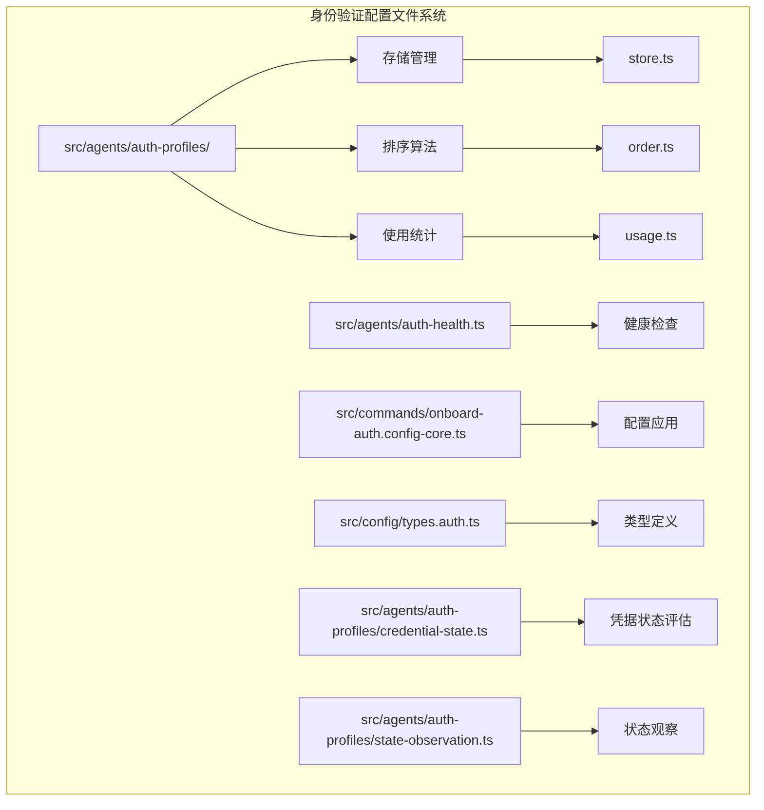
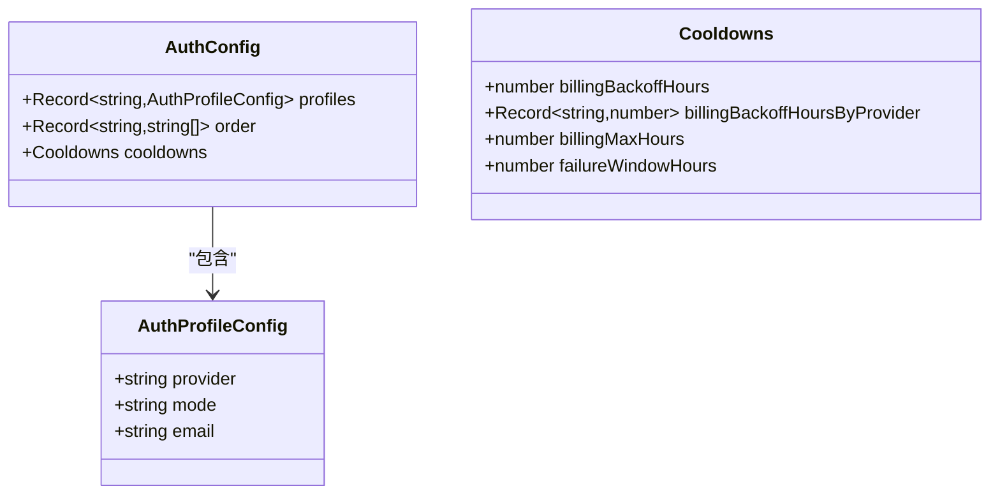
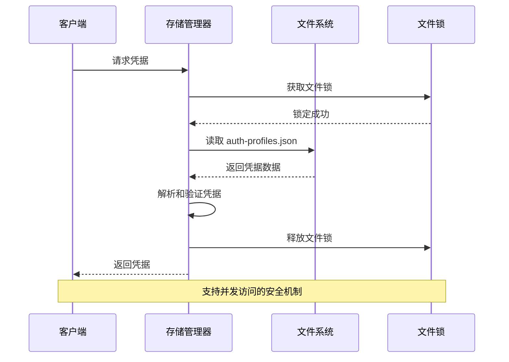
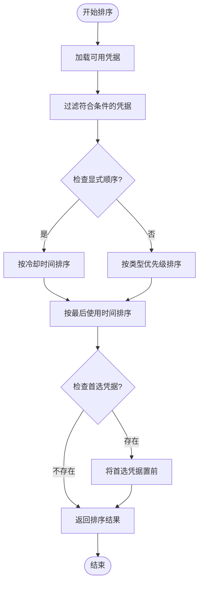
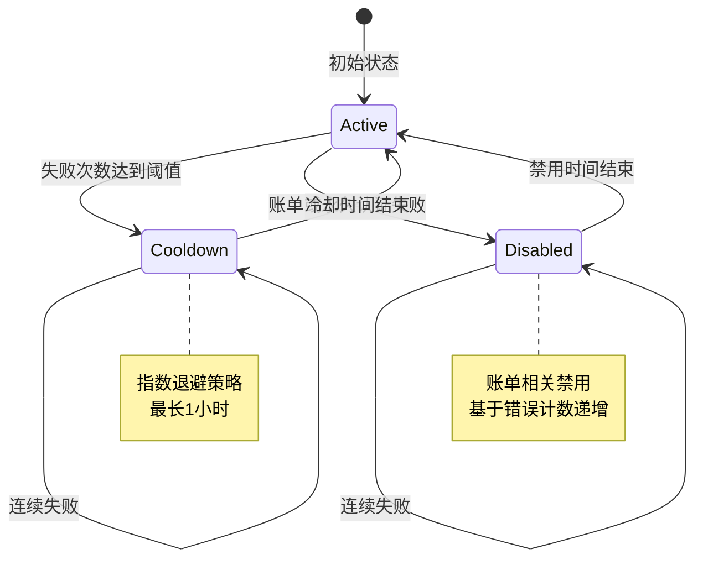
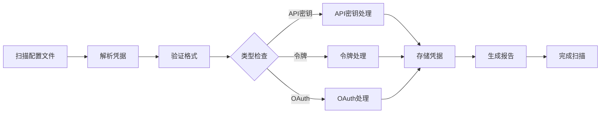
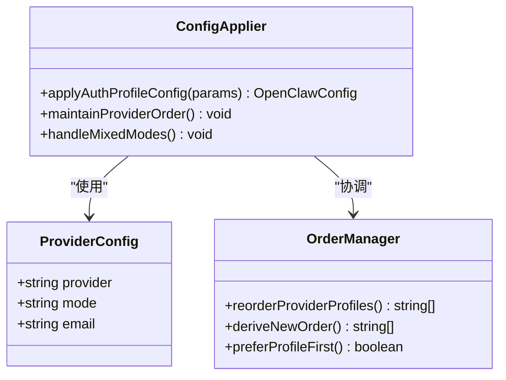
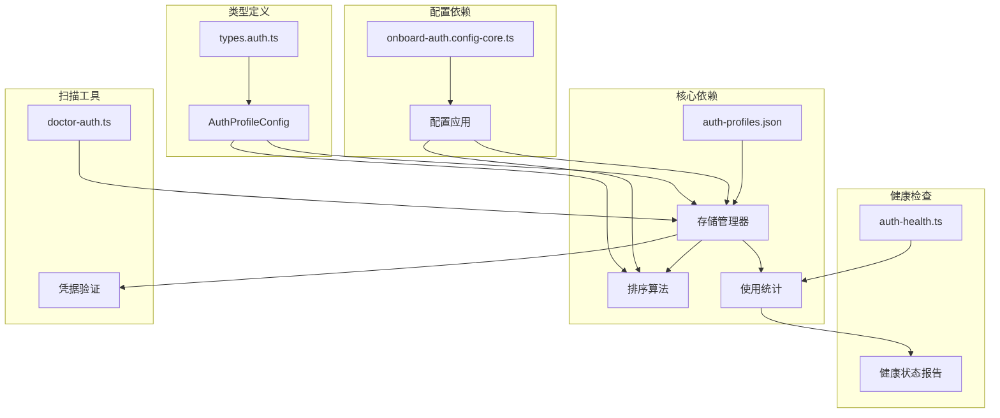

# 临时身份验证配置文件

<cite>
**本文档引用的文件**
- [src/agents/auth-profiles/store.ts](file://src/agents/auth-profiles/store.ts)
- [src/agents/auth-profiles/order.ts](file://src/agents/auth-profiles/order.ts)
- [src/agents/auth-profiles/usage.ts](file://src/agents/auth-profiles/usage.ts)
- [src/agents/auth-profiles/types.ts](file://src/agents/auth-profiles/types.ts)
- [src/agents/auth-profiles/credential-state.ts](file://src/agents/auth-profiles/credential-state.ts)
- [src/agents/auth-profiles/state-observation.ts](file://src/agents/auth-profiles/state-observation.ts)
- [src/agents/auth-health.ts](file://src/agents/auth-health.ts)
- [src/commands/onboard-auth.config-core.ts](file://src/commands/onboard-auth.config-core.ts)
- [src/commands/doctor-auth.ts](file://src/commands/doctor-auth.ts)
- [src/config/types.auth.ts](file://src/config/types.auth.ts)
</cite>

## 更新摘要
**所做更改**
- 移除了所有关于"临时认证配置文件"功能的描述
- 删除了会话级凭据覆盖功能的相关内容
- 移除了凭据扫描和验证功能的详细说明
- 更新了架构概览以反映当前的认证系统状态
- 简化了项目结构描述，专注于现有的认证组件

## 目录
1. [简介](#简介)
2. [项目结构](#项目结构)
3. [核心组件](#核心组件)
4. [架构概览](#架构概览)
5. [详细组件分析](#详细组件分析)
6. [依赖关系分析](#依赖关系分析)
7. [性能考虑](#性能考虑)
8. [故障排除指南](#故障排除指南)
9. [结论](#结论)

## 简介

临时身份验证配置文件是 OpenClaw 框架中的一个关键安全机制，用于管理不同提供商的身份验证凭据。该系统支持多种认证模式（API 密钥、OAuth 和令牌），并提供了智能的凭据选择算法、冷却时间管理和会话级覆盖功能。

该系统的核心目标是在确保安全性的同时，为用户提供灵活的身份验证解决方案，支持从简单的静态 API 密钥到复杂的 OAuth 流程等多种认证方式。

## 项目结构

OpenClaw 的临时身份验证配置文件系统主要分布在以下目录中：



**图表来源**
- [src/agents/auth-profiles/store.ts:1-510](file://src/agents/auth-profiles/store.ts#L1-L510)
- [src/agents/auth-profiles/order.ts:1-209](file://src/agents/auth-profiles/order.ts#L1-L209)
- [src/agents/auth-profiles/usage.ts:1-602](file://src/agents/auth-profiles/usage.ts#L1-L602)

**章节来源**
- [src/agents/auth-profiles/store.ts:1-510](file://src/agents/auth-profiles/store.ts#L1-L510)
- [src/agents/auth-profiles/order.ts:1-209](file://src/agents/auth-profiles/order.ts#L1-L209)
- [src/agents/auth-profiles/usage.ts:1-602](file://src/agents/auth-profiles/usage.ts#L1-L602)

## 核心组件

### 身份验证配置类型定义

系统使用 TypeScript 类型定义来确保配置的一致性和安全性：



**图表来源**
- [src/config/types.auth.ts:1-30](file://src/config/types.auth.ts#L1-L30)

### 凭据存储管理

身份验证凭据存储在 `auth-profiles.json` 文件中，支持多种凭据类型：

| 凭据类型 | 描述 | 使用场景 |
|---------|------|----------|
| api_key | 静态提供商 API 密钥 | 简单的 API 访问 |
| oauth | 可刷新的 OAuth 凭据 | 复杂的身份验证流程 |
| token | 静态承载式令牌 | 短期访问令牌 |

**章节来源**
- [src/config/types.auth.ts:1-30](file://src/config/types.auth.ts#L1-L30)
- [src/agents/auth-profiles/store.ts:188-240](file://src/agents/auth-profiles/store.ts#L188-L240)

## 架构概览

OpenClaw 的临时身份验证配置文件系统采用分层架构设计，确保了模块化和可扩展性：

```mermaid
graph TD
subgraph "用户界面层"
UI[用户界面]
CLI[命令行界面]
end
subgraph "配置管理层"
CFG[配置应用]
ORD[排序算法]
SCAN[凭据扫描]
END
subgraph "存储管理层"
STORE[凭据存储]
USAGE[使用统计]
END
subgraph "安全管理层"
HEALTH[健康检查]
COOLDOWN[冷却时间管理]
END
UI --> CFG
CLI --> CFG
CFG --> ORD
CFG --> SCAN
ORD --> STORE
SCAN --> STORE
STORE --> USAGE
USAGE --> COOLDOWN
COOLDOWN --> HEALTH
```

**图表来源**
- [src/commands/onboard-auth.config-core.ts:473-543](file://src/commands/onboard-auth.config-core.ts#L473-L543)
- [src/agents/auth-profiles/order.ts:67-160](file://src/agents/auth-profiles/order.ts#L67-L160)
- [src/agents/auth-profiles/store.ts:462-482](file://src/agents/auth-profiles/store.ts#L462-L482)

## 详细组件分析

### 存储管理系统

存储管理系统负责管理身份验证凭据的持久化和检索：



**图表来源**
- [src/agents/auth-profiles/store.ts:80-99](file://src/agents/auth-profiles/store.ts#L80-L99)
- [src/agents/auth-profiles/store.ts:484-509](file://src/agents/auth-profiles/store.ts#L484-L509)

存储系统的关键特性包括：

1. **文件锁定机制**：防止并发写入冲突
2. **凭据验证**：确保凭据格式正确
3. **兼容性处理**：支持旧版本配置迁移
4. **外部同步**：与 CLI 工具同步凭据状态

**章节来源**
- [src/agents/auth-profiles/store.ts:1-510](file://src/agents/auth-profiles/store.ts#L1-L510)

### 排序算法系统

排序算法系统实现了智能的凭据选择策略：



**图表来源**
- [src/agents/auth-profiles/order.ts:67-160](file://src/agents/auth-profiles/order.ts#L67-L160)

排序算法的核心逻辑：

1. **冷却时间优先**：避免重复选择已限流的凭据
2. **类型优先级**：OAuth > 令牌 > API 密钥
3. **轮询机制**：在同一类型内按最后使用时间轮询
4. **显式偏好**：尊重用户指定的首选凭据

**章节来源**
- [src/agents/auth-profiles/order.ts:162-209](file://src/agents/auth-profiles/order.ts#L162-L209)

### 使用统计和冷却时间管理

使用统计系统跟踪每个凭据的使用情况并实施智能冷却策略：



**图表来源**
- [src/agents/auth-profiles/usage.ts:272-278](file://src/agents/auth-profiles/usage.ts#L272-L278)
- [src/agents/auth-profiles/usage.ts:426-450](file://src/agents/auth-profiles/usage.ts#L426-L450)

冷却时间计算公式：
- 普通失败：5 分钟 × 5^(n-1)，最大 1 小时
- 账单失败：基础时间 × 2^错误次数，最大 24 小时

**章节来源**
- [src/agents/auth-profiles/usage.ts:272-341](file://src/agents/auth-profiles/usage.ts#L272-L341)

### 凭据扫描和验证

凭据扫描系统自动检测和验证配置文件中的身份验证信息：



**图表来源**
- [src/commands/doctor-auth.ts:113-201](file://src/commands/doctor-auth.ts#L113-L201)

扫描功能包括：

1. **自动字段识别**：根据配置自动识别凭据字段
2. **格式验证**：检查凭据格式的正确性
3. **类型转换**：支持多种凭据格式的转换
4. **错误报告**：提供详细的扫描结果和错误信息

**章节来源**
- [src/commands/doctor-auth.ts:113-201](file://src/commands/doctor-auth.ts#L113-L201)

### 配置应用和管理

配置应用系统负责将新的身份验证配置集成到现有系统中：



**图表来源**
- [src/commands/onboard-auth.config-core.ts:473-543](file://src/commands/onboard-auth.config-core.ts#L473-L543)

配置应用的关键功能：

1. **智能合并**：将新配置与现有配置智能合并
2. **顺序管理**：维护提供程序的优先级顺序
3. **模式兼容**：处理不同认证模式的兼容性
4. **偏好设置**：支持用户偏好的凭据优先级

**章节来源**
- [src/commands/onboard-auth.config-core.ts:473-543](file://src/commands/onboard-auth.config-core.ts#L473-L543)

## 依赖关系分析

身份验证配置文件系统的依赖关系图展示了各组件之间的交互：



**图表来源**
- [src/agents/auth-profiles/store.ts:462-482](file://src/agents/auth-profiles/store.ts#L462-L482)
- [src/agents/auth-profiles/order.ts:67-160](file://src/agents/auth-profiles/order.ts#L67-L160)
- [src/agents/auth-profiles/usage.ts:240-270](file://src/agents/auth-profiles/usage.ts#L240-L270)

**章节来源**
- [src/agents/auth-profiles/store.ts:462-482](file://src/agents/auth-profiles/store.ts#L462-L482)
- [src/agents/auth-profiles/order.ts:67-160](file://src/agents/auth-profiles/order.ts#L67-L160)
- [src/agents/auth-profiles/usage.ts:240-270](file://src/agents/auth-profiles/usage.ts#L240-L270)

## 性能考虑

临时身份验证配置文件系统在设计时充分考虑了性能优化：

### 缓存策略
- **运行时缓存**：内存中缓存凭据存储以减少磁盘访问
- **快照机制**：支持多代理目录的凭据快照管理
- **增量更新**：只在必要时更新磁盘文件

### 并发控制
- **文件锁机制**：防止并发写入冲突
- **原子操作**：确保配置更新的原子性
- **读写分离**：优化读取性能

### 内存管理
- **懒加载**：按需加载凭据数据
- **垃圾回收**：及时清理不再使用的缓存数据
- **内存限制**：避免内存泄漏和过度占用

## 故障排除指南

### 常见问题及解决方案

#### 凭据加载失败
**症状**：系统无法读取或解析凭据文件
**原因**：
- 文件权限问题
- JSON 格式错误
- 文件损坏

**解决方案**：
1. 检查文件权限设置
2. 验证 JSON 格式的正确性
3. 重新生成凭据文件

#### 凭据验证失败
**症状**：凭据被拒绝但没有明确错误信息
**原因**：
- 提供程序不匹配
- 凭据类型不兼容
- 凭据过期

**解决方案**：
1. 检查提供程序名称的大小写
2. 验证凭据类型与配置的匹配
3. 更新过期的凭据

#### 冷却时间异常
**症状**：凭据被错误地标记为不可用
**原因**：
- 冷却时间计算错误
- 时间戳同步问题
- 配置参数设置不当

**解决方案**：
1. 检查系统时间同步
2. 验证冷却时间配置
3. 手动重置凭据状态

**章节来源**
- [src/agents/auth-profiles/store.ts:147-164](file://src/agents/auth-profiles/store.ts#L147-L164)
- [src/agents/auth-profiles/usage.ts:183-234](file://src/agents/auth-profiles/usage.ts#L183-L234)

### 调试工具和方法

系统提供了多种调试工具来帮助诊断问题：

1. **日志记录**：详细的错误和状态信息
2. **健康检查**：定期监控凭据状态
3. **统计报告**：提供使用情况分析
4. **配置验证**：检查配置文件的有效性

## 结论

临时身份验证配置文件系统为 OpenClaw 框架提供了强大而灵活的身份验证管理能力。通过模块化的架构设计、智能的凭据选择算法和完善的冷却时间管理，该系统能够在保证安全性的同时，为用户提供便捷的身份验证体验。

系统的主要优势包括：

- **多模式支持**：支持 API 密钥、OAuth 和令牌等多种认证方式
- **智能选择**：基于使用统计和冷却时间的智能凭据选择
- **安全可靠**：完整的凭据验证和错误处理机制
- **易于扩展**：模块化的架构便于添加新的认证方式

该系统为构建复杂的身份验证场景提供了坚实的基础，能够满足从简单到复杂的各种应用需求。