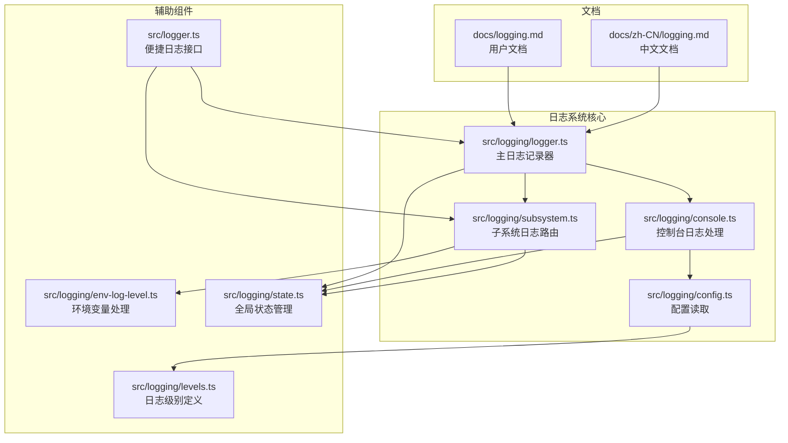
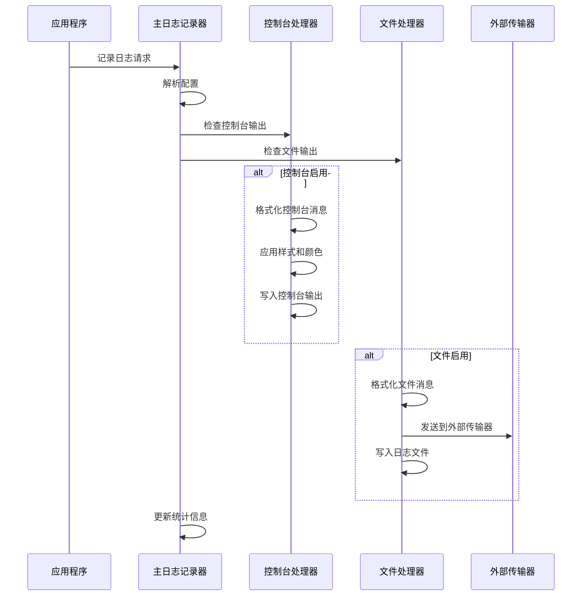
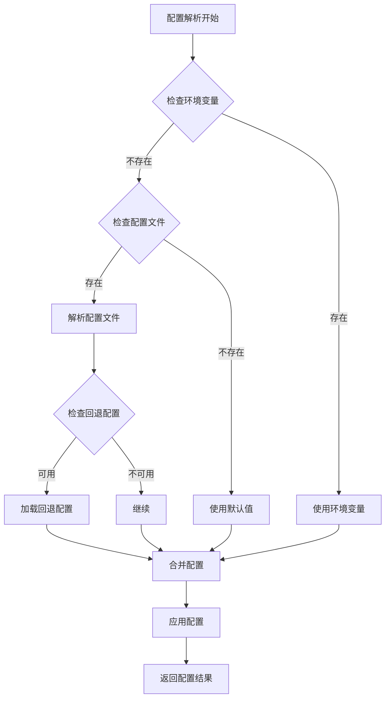
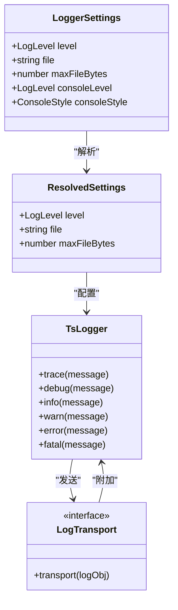
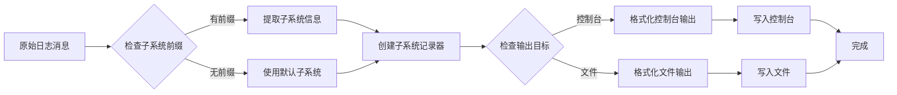
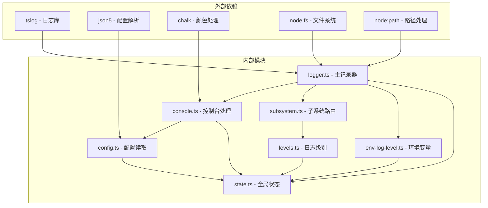

# 临时日志增强

<cite>
**本文档引用的文件**
- [src/logging/logger.ts](file://src/logging/logger.ts)
- [src/logging/console.ts](file://src/logging/console.ts)
- [src/logging/subsystem.ts](file://src/logging/subsystem.ts)
- [src/logging/config.ts](file://src/logging/config.ts)
- [src/logging/env-log-level.ts](file://src/logging/env-log-level.ts)
- [src/logging/state.ts](file://src/logging/state.ts)
- [src/logging/levels.ts](file://src/logging/levels.ts)
- [src/logger.ts](file://src/logger.ts)
- [src/logger.test.ts](file://src/logger.test.ts)
- [src/logging/subsystem.test.ts](file://src/logging/subsystem.test.ts)
- [docs/logging.md](file://docs/logging.md)
- [docs/zh-CN/logging.md](file://docs/zh-CN/logging.md)
</cite>

## 目录
1. [简介](#简介)
2. [项目结构](#项目结构)
3. [核心组件](#核心组件)
4. [架构概览](#架构概览)
5. [详细组件分析](#详细组件分析)
6. [依赖关系分析](#依赖关系分析)
7. [性能考虑](#性能考虑)
8. [故障排除指南](#故障排除指南)
9. [结论](#结论)

## 简介

OpenClaw 的临时日志增强功能是一个经过精心设计的日志系统，旨在提供灵活、可配置且高性能的日志记录能力。该系统支持双通道日志输出（文件日志和控制台输出），具有智能的子系统路由、环境变量覆盖、以及针对不同运行环境的优化配置。

该日志系统的核心特性包括：
- **双通道输出**：同时支持文件日志（JSON Lines）和控制台输出
- **子系统路由**：基于子系统的智能日志路由和过滤
- **环境配置**：通过环境变量和配置文件进行灵活控制
- **性能优化**：针对测试环境和生产环境的不同优化策略
- **安全脱敏**：对敏感信息进行自动脱敏处理

## 项目结构

OpenClaw 日志系统采用模块化设计，主要分布在以下核心文件中：

**图表来源**
- [src/logging/logger.ts:1-348](file://src/logging/logger.ts#L1-L348)
- [src/logging/console.ts:1-327](file://src/logging/console.ts#L1-L327)
- [src/logging/subsystem.ts:1-426](file://src/logging/subsystem.ts#L1-L426)

**章节来源**
- [src/logging/logger.ts:1-348](file://src/logging/logger.ts#L1-L348)
- [src/logging/console.ts:1-327](file://src/logging/console.ts#L1-L327)
- [src/logging/subsystem.ts:1-426](file://src/logging/subsystem.ts#L1-L426)

## 核心组件

### 主日志记录器 (Logger)

主日志记录器是整个日志系统的核心，负责：
- **配置解析**：从多种来源解析日志配置
- **文件管理**：管理滚动日志文件和大小限制
- **传输层**：支持外部日志传输器注册
- **缓存机制**：智能缓存以避免重复配置解析

### 控制台日志处理 (Console)

控制台日志处理模块提供：
- **TTY感知**：根据终端类型自动调整输出格式
- **样式控制**：支持pretty、compact、json三种输出样式
- **消息过滤**：智能过滤冗余控制台消息
- **时间戳管理**：统一的时间戳格式化

### 子系统日志路由 (Subsystem)

子系统日志路由实现：
- **子系统识别**：自动识别和路由到相应子系统
- **颜色编码**：为不同子系统分配唯一颜色标识
- **消息去重**：去除重复的子系统前缀
- **层级结构**：支持多级子系统嵌套

**章节来源**
- [src/logging/logger.ts:126-184](file://src/logging/logger.ts#L126-L184)
- [src/logging/console.ts:60-111](file://src/logging/console.ts#L60-L111)
- [src/logging/subsystem.ts:308-402](file://src/logging/subsystem.ts#L308-L402)

## 架构概览

OpenClaw 日志系统采用分层架构设计，确保了高内聚低耦合的特性：

**图表来源**
- [src/logging/logger.ts:210-219](file://src/logging/logger.ts#L210-L219)
- [src/logging/console.ts:250-326](file://src/logging/console.ts#L250-L326)
- [src/logging/subsystem.ts:316-361](file://src/logging/subsystem.ts#L316-L361)

## 详细组件分析

### 配置管理系统

配置管理系统提供了多层次的配置解析能力：

**图表来源**
- [src/logging/logger.ts:73-106](file://src/logging/logger.ts#L73-L106)
- [src/logging/console.ts:60-91](file://src/logging/console.ts#L60-L91)

配置系统支持以下层次：
1. **环境变量优先级**：`OPENCLAW_LOG_LEVEL`
2. **配置文件**：`~/.openclaw/openclaw.json`
3. **回退配置**：从主配置文件加载
4. **默认值**：生产环境默认info级别，测试环境默认silent级别

**章节来源**
- [src/logging/env-log-level.ts:4-23](file://src/logging/env-log-level.ts#L4-L23)
- [src/logging/config.ts:8-24](file://src/logging/config.ts#L8-L24)

### 日志级别和传输机制

日志系统实现了完整的级别控制和传输机制：

**图表来源**
- [src/logging/logger.ts:25-42](file://src/logging/logger.ts#L25-L42)
- [src/logging/logger.ts:35-40](file://src/logging/logger.ts#L35-L40)

### 子系统日志路由

子系统日志路由实现了智能的消息路由和格式化：

**图表来源**
- [src/logging/subsystem.ts:308-402](file://src/logging/subsystem.ts#L308-L402)
- [src/logger.ts:20-35](file://src/logger.ts#L20-L35)

**章节来源**
- [src/logging/subsystem.ts:17-28](file://src/logging/subsystem.ts#L17-L28)
- [src/logger.ts:8-15](file://src/logger.ts#L8-L15)

### 测试和验证

日志系统包含了全面的测试覆盖：

| 测试类别 | 测试文件 | 覆盖范围 |
|---------|----------|----------|
| 基础功能测试 | [src/logger.test.ts](file://src/logger.test.ts) | 日志记录、级别过滤、文件输出 |
| 子系统测试 | [src/logging/subsystem.test.ts](file://src/logging/subsystem.test.ts) | 子系统路由、消息过滤、控制台输出 |
| 性能测试 | 多个测试文件 | 缓存机制、配置解析优化 |

**章节来源**
- [src/logger.test.ts:16-95](file://src/logger.test.ts#L16-L95)
- [src/logging/subsystem.test.ts:14-172](file://src/logging/subsystem.test.ts#L14-L172)

## 依赖关系分析

日志系统的设计遵循了清晰的依赖关系：

**图表来源**
- [src/logging/logger.ts:1-14](file://src/logging/logger.ts#L1-L14)
- [src/logging/console.ts:1-12](file://src/logging/console.ts#L1-L12)

**章节来源**
- [src/logging/logger.ts:1-14](file://src/logging/logger.ts#L1-L14)
- [src/logging/console.ts:1-12](file://src/logging/console.ts#L1-L12)

## 性能考虑

日志系统在性能方面采用了多项优化策略：

### 缓存机制
- **配置缓存**：避免重复的配置文件解析
- **记录器缓存**：复用已创建的日志记录器实例
- **状态缓存**：缓存控制台设置和全局状态

### 测试环境优化
- **静默文件日志**：测试环境下默认禁用文件日志
- **快速路径**：跳过配置文件读取的优化路径
- **内存优化**：避免在测试环境中加载重型配置栈

### I/O优化
- **批量写入**：文件写入采用同步批量方式
- **大小限制**：防止日志文件无限增长
- **自动清理**：定期清理过期的日志文件

## 故障排除指南

### 常见问题和解决方案

| 问题 | 症状 | 解决方案 |
|------|------|----------|
| 日志文件过大 | 磁盘空间不足 | 检查 `maxFileBytes` 配置，调整日志级别 |
| 控制台输出异常 | 终端显示混乱 | 检查 `consoleStyle` 设置，确认TTY环境 |
| 配置不生效 | 日志级别未改变 | 验证环境变量优先级，检查配置文件语法 |
| 性能问题 | 应用响应缓慢 | 检查日志级别，考虑禁用文件日志或降低级别 |

### 调试技巧

1. **启用详细日志**：使用 `--log-level debug` 或设置 `OPENCLAW_LOG_LEVEL=debug`
2. **检查配置**：使用 `openclaw doctor` 验证日志配置
3. **监控文件大小**：定期检查日志文件大小和数量
4. **验证输出**：确认控制台和文件输出都正常工作

**章节来源**
- [docs/logging.md:347-353](file://docs/logging.md#L347-L353)
- [src/logging/logger.ts:186-191](file://src/logging/logger.ts#L186-L191)

## 结论

OpenClaw 的临时日志增强功能展现了现代日志系统的设计最佳实践。通过模块化架构、智能配置管理和性能优化，该系统为开发者提供了强大而灵活的日志记录能力。

关键优势包括：
- **灵活性**：支持多种配置来源和输出目标
- **性能**：针对不同环境进行了专门优化
- **可维护性**：清晰的模块分离和完整的测试覆盖
- **安全性**：内置敏感信息脱敏和错误处理机制

该日志系统不仅满足了当前的需求，还为未来的扩展和改进奠定了坚实的基础。通过合理的架构设计和充分的测试保障，它能够可靠地支持各种规模的应用场景。