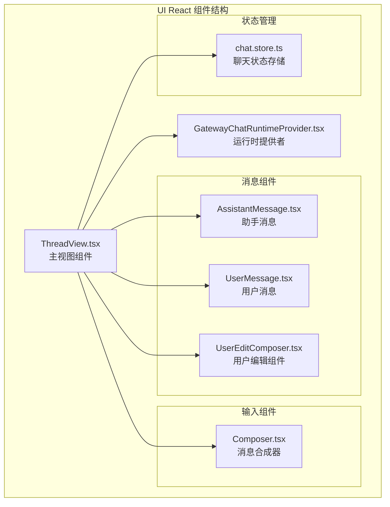
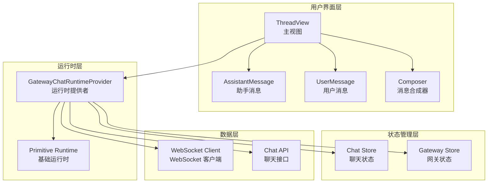
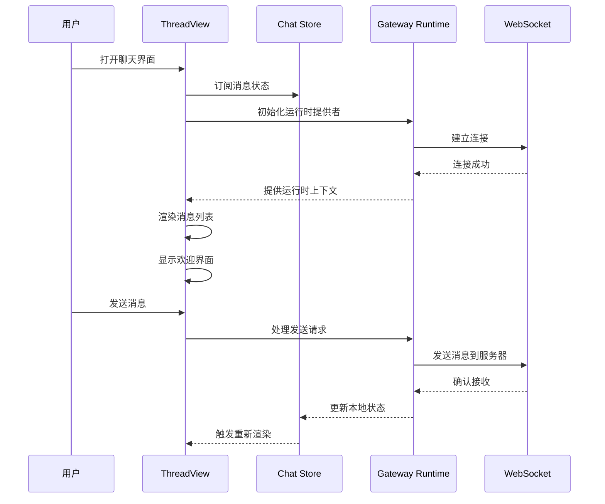
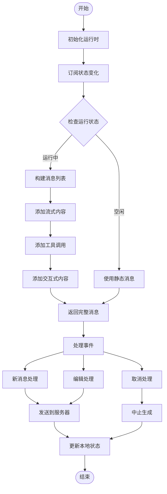
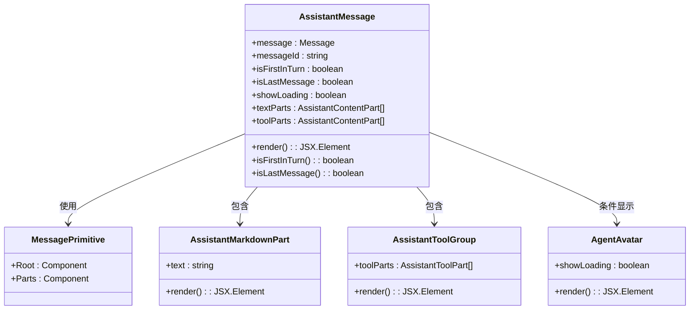
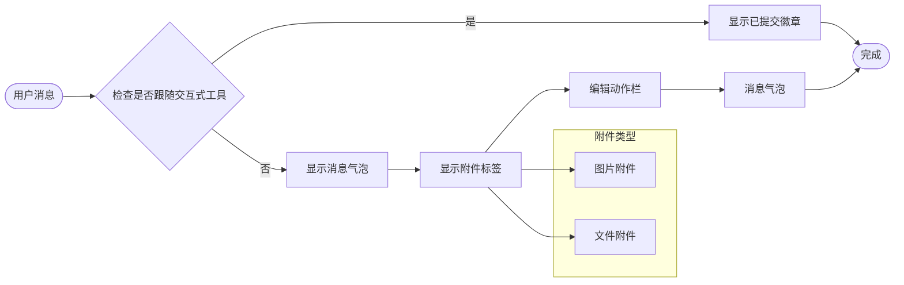
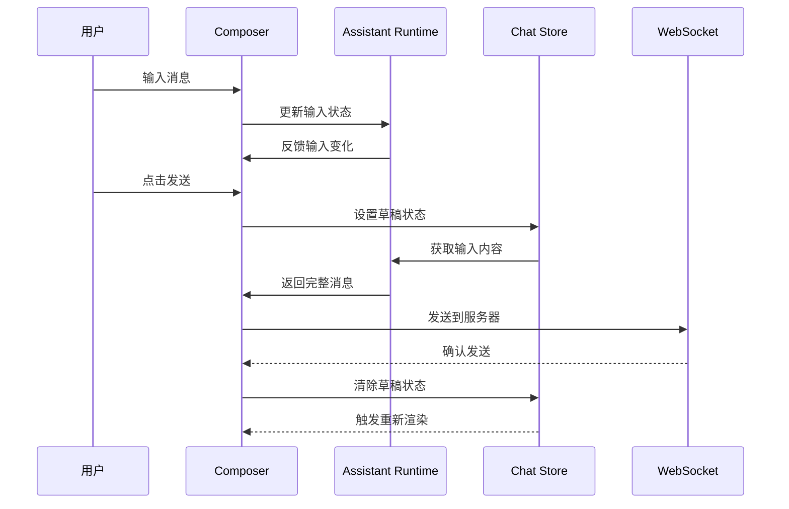
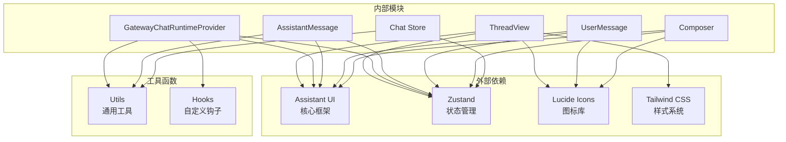

# 线程视图组件

<cite>
**本文档中引用的文件**
- [ThreadView.tsx](file://ui-react/src/components/chat/ThreadView.tsx)
- [GatewayChatRuntimeProvider.tsx](file://ui-react/src/components/chat/GatewayChatRuntimeProvider.tsx)
- [AssistantMessage.tsx](file://ui-react/src/components/chat/AssistantMessage.tsx)
- [UserMessage.tsx](file://ui-react/src/components/chat/UserMessage.tsx)
- [Composer.tsx](file://ui-react/src/components/chat/Composer.tsx)
- [UserEditComposer.tsx](file://ui-react/src/components/chat/UserEditComposer.tsx)
- [chat.store.ts](file://ui-react/src/store/chat.store.ts)
</cite>

## 目录
1. [简介](#简介)
2. [项目结构](#项目结构)
3. [核心组件](#核心组件)
4. [架构概览](#架构概览)
5. [详细组件分析](#详细组件分析)
6. [依赖关系分析](#依赖关系分析)
7. [性能考虑](#性能考虑)
8. [故障排除指南](#故障排除指南)
9. [结论](#结论)

## 简介

线程视图组件是 Bossim 应用程序中的核心聊天界面组件，基于 Assistant UI 框架构建。该组件负责渲染聊天会话的历史记录、处理实时消息流、管理用户输入以及提供完整的聊天体验。组件采用现代 React 架构模式，结合 Zustand 状态管理和 WebSocket 连接，实现了高性能的实时聊天功能。

## 项目结构

线程视图组件位于应用程序的前端代码结构中，具体组织如下：

**图表来源**
- [ThreadView.tsx:1-201](file://ui-react/src/components/chat/ThreadView.tsx#L1-L201)
- [GatewayChatRuntimeProvider.tsx:1-538](file://ui-react/src/components/chat/GatewayChatRuntimeProvider.tsx#L1-L538)

**章节来源**
- [ThreadView.tsx:1-201](file://ui-react/src/components/chat/ThreadView.tsx#L1-L201)
- [GatewayChatRuntimeProvider.tsx:1-538](file://ui-react/src/components/chat/GatewayChatRuntimeProvider.tsx#L1-L538)

## 核心组件

线程视图组件由多个精心设计的子组件组成，每个组件都有特定的功能和职责：

### 主要组件职责

| 组件名称 | 主要功能 | 关键特性 |
|---------|----------|----------|
| ThreadView | 主聊天界面容器 | 布局管理、状态协调、生命周期控制 |
| GatewayChatRuntimeProvider | 运行时桥接层 | 状态转换、事件处理、WebSocket 集成 |
| AssistantMessage | 助手响应显示 | 内容解析、工具调用、交互式元素 |
| UserMessage | 用户消息显示 | 编辑支持、附件处理、交互操作 |
| Composer | 消息输入组件 | 附件支持、发送控制、取消功能 |
| UserEditComposer | 用户编辑界面 | 行内编辑、表单处理、上下文保持 |

**章节来源**
- [ThreadView.tsx:18-79](file://ui-react/src/components/chat/ThreadView.tsx#L18-L79)
- [GatewayChatRuntimeProvider.tsx:247-537](file://ui-react/src/components/chat/GatewayChatRuntimeProvider.tsx#L247-L537)

## 架构概览

线程视图组件采用了分层架构设计，确保了良好的可维护性和扩展性：

**图表来源**
- [ThreadView.tsx:1-79](file://ui-react/src/components/chat/ThreadView.tsx#L1-L79)
- [GatewayChatRuntimeProvider.tsx:251-537](file://ui-react/src/components/chat/GatewayChatRuntimeProvider.tsx#L251-L537)

## 详细组件分析

### ThreadView 主组件

ThreadView 是整个聊天界面的核心容器，负责协调所有子组件并管理整体布局：

**图表来源**
- [ThreadView.tsx:18-79](file://ui-react/src/components/chat/ThreadView.tsx#L18-L79)
- [GatewayChatRuntimeProvider.tsx:378-419](file://ui-react/src/components/chat/GatewayChatRuntimeProvider.tsx#L378-L419)

#### 关键特性实现

1. **消息加载状态管理**
   - 使用 `messagesLoading` 状态控制骨架屏显示
   - 实现条件渲染避免竞态条件
   - 支持静默重载保持消息列表稳定性

2. **会话键管理**
   - 通过 `sessionKey` 实现完全卸载和重新挂载
   - 防止旧会话的消息订阅冲突
   - 支持多会话并发管理

3. **错误处理机制**
   - 内置错误横幅组件
   - 自动状态检查功能
   - 用户友好的错误恢复

**章节来源**
- [ThreadView.tsx:18-79](file://ui-react/src/components/chat/ThreadView.tsx#L18-L79)
- [ThreadView.tsx:119-180](file://ui-react/src/components/chat/ThreadView.tsx#L119-L180)

### GatewayChatRuntimeProvider 运行时提供者

运行时提供者是连接 UI 层和后端服务的关键桥梁，负责处理所有聊天相关的业务逻辑：

**图表来源**
- [GatewayChatRuntimeProvider.tsx:288-375](file://ui-react/src/components/chat/GatewayChatRuntimeProvider.tsx#L288-L375)
- [GatewayChatRuntimeProvider.tsx:422-505](file://ui-react/src/components/chat/GatewayChatRuntimeProvider.tsx#L422-L505)

#### 核心功能模块

1. **消息转换系统**
   - 将聊天消息转换为 Assistant UI 兼容格式
   - 处理工具调用和交互式内容块
   - 支持代理指令包装标签剥离

2. **流式处理引擎**
   - 实时处理助手响应流
   - 管理工具调用的生命周期
   - 支持交互式输入流

3. **附件处理适配器**
   - 统一处理不同类型的附件
   - 支持图片和文件上传
   - 维护附件元数据

**章节来源**
- [GatewayChatRuntimeProvider.tsx:148-239](file://ui-react/src/components/chat/GatewayChatRuntimeProvider.tsx#L148-L239)
- [GatewayChatRuntimeProvider.tsx:288-375](file://ui-react/src/components/chat/GatewayChatRuntimeProvider.tsx#L288-L375)

### AssistantMessage 助手消息组件

助手消息组件专门负责渲染来自 AI 助手的响应，提供了丰富的功能来展示复杂的内容：

**图表来源**
- [AssistantMessage.tsx:26-119](file://ui-react/src/components/chat/AssistantMessage.tsx#L26-L119)

#### 智能内容处理

1. **首条消息检测**
   - 自动识别对话轮次中的第一条助手消息
   - 条件性显示代理头像
   - 控制加载指示器的显示

2. **内容分区处理**
   - 分离文本部分和工具调用部分
   - 支持混合内容的正确渲染顺序
   - 处理流式内容的实时更新

3. **交互式工具集成**
   - 显示工具调用结果
   - 提供工具执行状态
   - 支持工具调用的详细信息

**章节来源**
- [AssistantMessage.tsx:41-62](file://ui-react/src/components/chat/AssistantMessage.tsx#L41-L62)
- [AssistantMessage.tsx:86-89](file://ui-react/src/components/chat/AssistantMessage.tsx#L86-L89)

### UserMessage 用户消息组件

用户消息组件负责渲染用户发送的消息，并提供编辑功能：

**图表来源**
- [UserMessage.tsx:48-58](file://ui-react/src/components/chat/UserMessage.tsx#L48-L58)
- [UserMessage.tsx:111-129](file://ui-react/src/components/chat/UserMessage.tsx#L111-L129)

#### 编辑功能实现

1. **智能编辑检测**
   - 自动检测交互式工具后的用户回复
   - 条件性显示简化版本以避免重复内容
   - 维护良好的用户体验

2. **附件管理系统**
   - 独立于 Assistant UI 的附件存储
   - 支持多种文件类型的识别
   - 提供直观的附件预览

3. **交互式操作**
   - 悬停时显示编辑按钮
   - 平滑的动画过渡效果
   - 符合无障碍访问标准

**章节来源**
- [UserMessage.tsx:15-100](file://ui-react/src/components/chat/UserMessage.tsx#L15-L100)
- [UserMessage.tsx:111-144](file://ui-react/src/components/chat/UserMessage.tsx#L111-L144)

### Composer 消息合成器

Composer 组件提供了完整的消息输入功能，支持多种输入方式：

**图表来源**
- [Composer.tsx:17-44](file://ui-react/src/components/chat/Composer.tsx#L17-L44)
- [Composer.tsx:46-114](file://ui-react/src/components/chat/Composer.tsx#L46-L114)

#### 高级功能特性

1. **草稿消息支持**
   - 支持跨页面导航的消息保留
   - 自动填充功能
   - 单次使用后自动清除

2. **附件处理系统**
   - 拖拽上传支持
   - 实时预览功能
   - 类型和大小验证

3. **状态感知界面**
   - 根据聊天状态动态显示按钮
   - 发送和取消操作的智能切换
   - 加载状态的视觉反馈

**章节来源**
- [Composer.tsx:17-114](file://ui-react/src/components/chat/Composer.tsx#L17-L114)

## 依赖关系分析

线程视图组件的依赖关系体现了清晰的关注点分离：

**图表来源**
- [ThreadView.tsx:1-10](file://ui-react/src/components/chat/ThreadView.tsx#L1-L10)
- [GatewayChatRuntimeProvider.tsx:1-20](file://ui-react/src/components/chat/GatewayChatRuntimeProvider.tsx#L1-L20)

### 核心依赖特性

1. **最小化外部依赖**
   - 仅依赖 Assistant UI 作为主要框架
   - 使用轻量级图标库和样式系统
   - 避免不必要的第三方包

2. **模块化设计**
   - 每个组件都有明确的职责边界
   - 状态管理独立于 UI 组件
   - 工具函数可复用且无副作用

3. **类型安全保证**
   - 全面的 TypeScript 类型定义
   - 编译时错误检测
   - 智能代码补全支持

**章节来源**
- [ThreadView.tsx:1-10](file://ui-react/src/components/chat/ThreadView.tsx#L1-L10)
- [GatewayChatRuntimeProvider.tsx:1-20](file://ui-react/src/components/chat/GatewayChatRuntimeProvider.tsx#L1-L20)

## 性能考虑

线程视图组件在设计时充分考虑了性能优化：

### 渲染优化策略

1. **条件渲染**
   - 骨架屏只在加载时显示
   - 空状态与加载状态的智能切换
   - 避免不必要的组件重新渲染

2. **记忆化优化**
   - 使用 `useMemo` 缓存计算结果
   - 稳定的组件引用避免重渲染
   - 选择器回调的值捕获

3. **会话键管理**
   - 通过 `sessionKey` 实现完全卸载
   - 防止旧会话的消息订阅冲突
   - 支持多会话并发场景

### 状态管理优化

1. **局部状态隔离**
   - 每个组件管理自己的状态
   - 减少全局状态的更新频率
   - 提高状态更新的精确性

2. **批量更新策略**
   - 合并多个状态更新
   - 避免频繁的重新渲染
   - 优化内存使用

**章节来源**
- [ThreadView.tsx:28-33](file://ui-react/src/components/chat/ThreadView.tsx#L28-L33)
- [AssistantMessage.tsx:41-53](file://ui-react/src/components/chat/AssistantMessage.tsx#L41-L53)

## 故障排除指南

### 常见问题及解决方案

#### 消息订阅冲突

**问题描述**: 切换会话时出现 `tapClientLookup` 错误

**解决方案**:
- 确保使用 `sessionKey` 作为组件 key
- 验证会话切换的时机
- 检查运行时提供者的重新初始化

#### 加载状态异常

**问题描述**: 骨架屏不正确地持续显示

**解决方案**:
- 检查 `messagesLoading` 状态的设置
- 验证消息获取流程的完整性
- 确认网络请求的成功响应

#### 编辑功能失效

**问题描述**: 用户消息编辑按钮不可用

**解决方案**:
- 验证 `ActionBarPrimitive` 的正确使用
- 检查消息 ID 的稳定性和唯一性
- 确认编辑权限的状态检查

**章节来源**
- [ThreadView.tsx:28-33](file://ui-react/src/components/chat/ThreadView.tsx#L28-L33)
- [UserMessage.tsx:68-83](file://ui-react/src/components/chat/UserMessage.tsx#L68-L83)

### 调试技巧

1. **状态监控**
   - 使用浏览器开发者工具检查 Zustand 状态
   - 监控 WebSocket 连接状态
   - 跟踪消息流的完整生命周期

2. **性能分析**
   - 使用 React DevTools Profiler
   - 监控组件渲染频率
   - 分析内存使用情况

3. **网络诊断**
   - 检查 API 请求和响应
   - 监控实时消息流
   - 验证连接稳定性

## 结论

线程视图组件展现了现代 React 应用开发的最佳实践，通过精心设计的架构和实现细节，提供了优秀的用户体验和开发体验。组件具有以下突出特点：

1. **架构清晰**: 分层设计确保了良好的关注点分离
2. **性能优秀**: 多种优化策略保证了流畅的用户体验
3. **扩展性强**: 模块化设计便于功能扩展和维护
4. **类型安全**: 全面的 TypeScript 支持提高了代码质量
5. **用户体验**: 丰富的交互功能和友好的错误处理

该组件为 Bossim 应用程序提供了坚实的基础，支持未来的功能扩展和技术演进。通过遵循现有的设计模式和最佳实践，开发者可以轻松地添加新功能并维护代码质量。