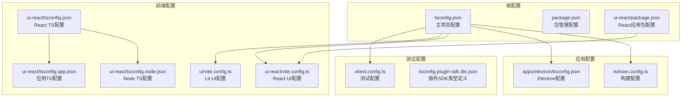
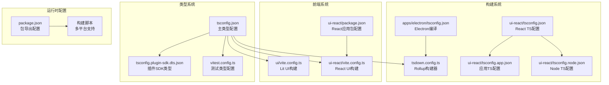
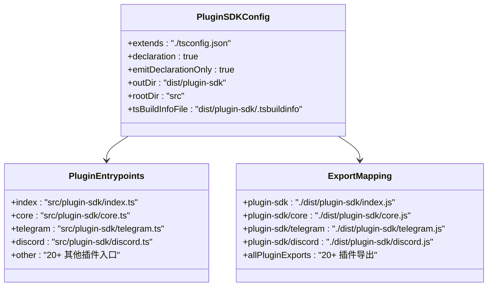
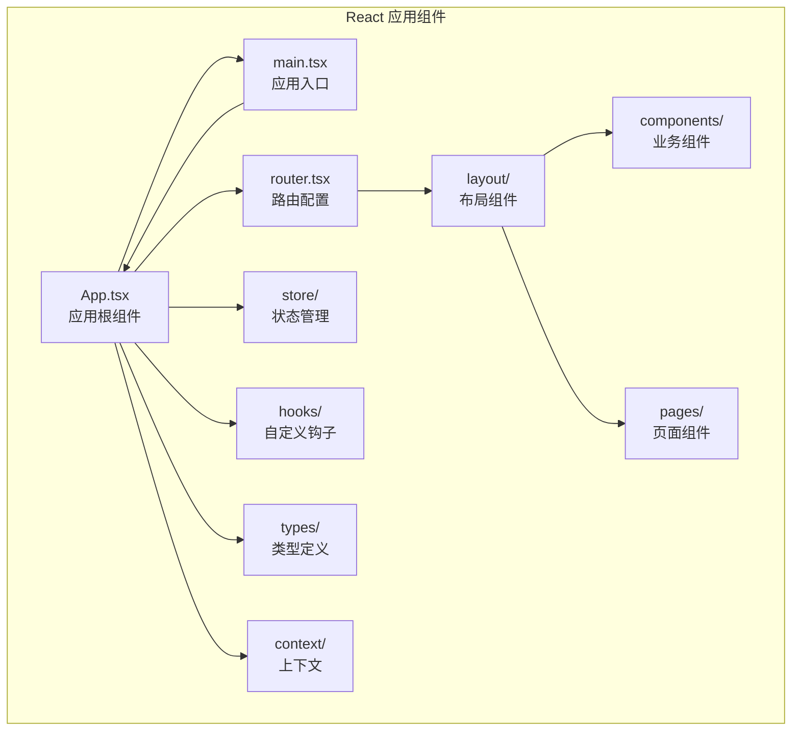
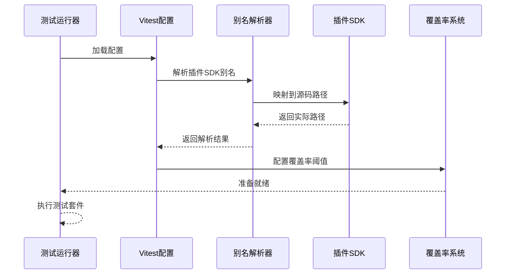
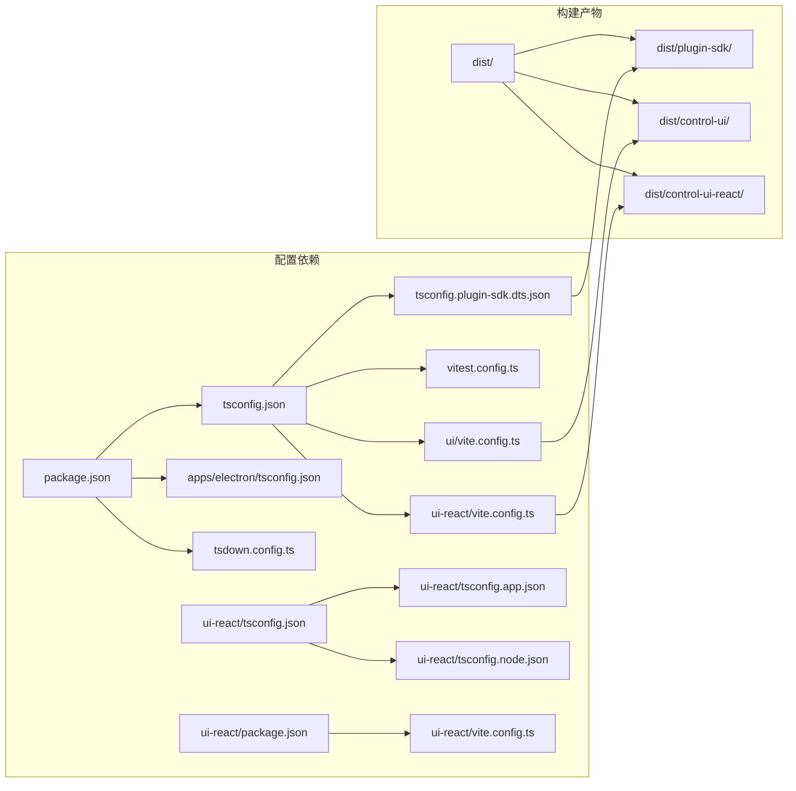

# TypeScript 配置

<cite>
**本文档引用的文件**
- [tsconfig.json](file://tsconfig.json)
- [package.json](file://package.json)
- [vitest.config.ts](file://vitest.config.ts)
- [tsconfig.plugin-sdk.dts.json](file://tsconfig.plugin-sdk.dts.json)
- [ui/vite.config.ts](file://ui/vite.config.ts)
- [ui-react/vite.config.ts](file://ui-react/vite.config.ts)
- [apps/electron/tsconfig.json](file://apps/electron/tsconfig.json)
- [ui-react/tsconfig.json](file://ui-react/tsconfig.json)
- [ui-react/tsconfig.app.json](file://ui-react/tsconfig.app.json)
- [ui-react/tsconfig.node.json](file://ui-react/tsconfig.node.json)
- [tsdown.config.ts](file://tsdown.config.ts)
- [ui-react/package.json](file://ui-react/package.json)
- [ui-react/src/App.tsx](file://ui-react/src/App.tsx)
- [ui-react/src/main.tsx](file://ui-react/src/main.tsx)
- [ui-react/src/router.tsx](file://ui-react/src/router.tsx)
</cite>

## 更新摘要
**所做更改**
- 更新了 React 应用 TypeScript 配置部分，反映全面重建的配置文件
- 新增了 React 应用组件文件正确索引的相关内容
- 更新了 TypeScript 配置架构图以反映最新的配置结构
- 增强了 React 应用构建配置的详细说明

## 目录
1. [简介](#简介)
2. [项目结构](#项目结构)
3. [核心配置组件](#核心配置组件)
4. [架构概览](#架构概览)
5. [详细组件分析](#详细组件分析)
6. [依赖关系分析](#依赖关系分析)
7. [性能考虑](#性能考虑)
8. [故障排除指南](#故障排除指南)
9. [结论](#结论)

## 简介

OpenCLAW 项目采用多配置的 TypeScript 架构，支持多种运行环境和构建目标。该项目使用了现代化的开发工具链，包括 Vite、Vitest 和 Rollup，为不同的前端和后端应用提供专门的 TypeScript 配置。

项目的核心特点包括：
- 多环境支持：Node.js、Electron、React 应用
- 插件 SDK 构建系统
- 统一的测试框架
- 模块化的构建配置
- **全新重建的 React 应用 TypeScript 配置**

## 项目结构

项目采用分层的 TypeScript 配置架构，针对不同的应用场景提供专门的配置文件。**经过全面重构后，React 应用的 TypeScript 配置文件已完全重建并正确索引所有组件文件。**

**图表来源**
- [tsconfig.json:1-29](file://tsconfig.json#L1-L29)
- [package.json:1-474](file://package.json#L1-L474)
- [ui-react/package.json:1-80](file://ui-react/package.json#L1-L80)

**章节来源**
- [tsconfig.json:1-29](file://tsconfig.json#L1-L29)
- [package.json:1-474](file://package.json#L1-L474)
- [ui-react/package.json:1-80](file://ui-react/package.json#L1-L80)

## 核心配置组件

### 主 TypeScript 配置

主配置文件提供了项目的基础 TypeScript 设置，支持现代 JavaScript 特性和严格的类型检查。

**关键特性：**
- ES2023 目标和模块系统
- DOM 和 ScriptHost 库支持
- 路径映射优化
- 严格模式启用
- 插件 SDK 路径别名

**章节来源**
- [tsconfig.json:1-29](file://tsconfig.json#L1-L29)

### 包管理配置

package.json 定义了完整的构建和开发脚本生态系统，支持多种构建目标和部署选项。

**主要功能：**
- 多平台构建支持（Android、iOS、Electron）
- 插件 SDK 类型定义生成
- 开发服务器和热重载
- 测试自动化和覆盖率报告
- 文档生成和格式化工具

**章节来源**
- [package.json:217-343](file://package.json#L217-L343)

### 测试配置系统

Vitest 配置提供了全面的测试基础设施，支持并行执行和代码覆盖率分析。

**核心配置：**
- 动态插件 SDK 别名解析
- 平台特定的工作线程数量
- 排除大型集成测试套件
- 自定义覆盖率阈值
- 环境变量隔离

**章节来源**
- [vitest.config.ts:57-202](file://vitest.config.ts#L57-L202)

## 架构概览

项目采用模块化的 TypeScript 配置架构，每个子系统都有专门的配置文件。**React 应用的 TypeScript 配置已进行全面重建，确保所有组件文件都正确索引。**

**图表来源**
- [tsdown.config.ts:102-144](file://tsdown.config.ts#L102-L144)
- [apps/electron/tsconfig.json:1-27](file://apps/electron/tsconfig.json#L1-L27)
- [ui-react/tsconfig.json:1-12](file://ui-react/tsconfig.json#L1-L12)
- [ui-react/tsconfig.app.json:1-26](file://ui-react/tsconfig.app.json#L1-L26)
- [ui-react/tsconfig.node.json:1-14](file://ui-react/tsconfig.node.json#L1-L14)

## 详细组件分析

### 插件 SDK 类型系统

插件 SDK 使用专门的类型定义生成配置，确保插件开发的一致性和类型安全。

**图表来源**
- [tsconfig.plugin-sdk.dts.json:1-62](file://tsconfig.plugin-sdk.dts.json#L1-L62)
- [package.json:37-216](file://package.json#L37-L216)

**章节来源**
- [tsconfig.plugin-sdk.dts.json:1-62](file://tsconfig.plugin-sdk.dts.json#L1-L62)
- [package.json:37-216](file://package.json#L37-L216)

### React 应用 TypeScript 配置

**已更新** React 应用的 TypeScript 配置已全面重建，所有组件文件都已正确索引。

React 应用配置支持热重载、环境变量注入和 Tailwind CSS 集成：

**关键特性：**
- 分离的应用和 Node 配置文件
- React 和 Tailwind CSS 插件集成
- 环境变量定义（网关端口、令牌）
- 路径别名配置（@/* 和 @gateway/*）
- 多入口点支持（主应用和设置页面）
- 完全重建的组件索引系统

**章节来源**
- [ui-react/tsconfig.json:1-12](file://ui-react/tsconfig.json#L1-L12)
- [ui-react/tsconfig.app.json:1-26](file://ui-react/tsconfig.app.json#L1-L26)
- [ui-react/tsconfig.node.json:1-14](file://ui-react/tsconfig.node.json#L1-L14)

### Lit UI 配置

Lit UI 配置专注于性能优化和静态资源处理：

**核心功能：**
- 动态基础路径支持
- 依赖优化配置
- 源码映射生成
- 构建输出目录分离

**章节来源**
- [ui/vite.config.ts:21-43](file://ui/vite.config.ts#L21-L43)

### React 应用组件架构

**新增** React 应用已完全重构，包含完整的组件体系：

**图表来源**
- [ui-react/src/App.tsx:1-13](file://ui-react/src/App.tsx#L1-L13)
- [ui-react/src/main.tsx:1-11](file://ui-react/src/main.tsx#L1-L11)
- [ui-react/src/router.tsx:1-35](file://ui-react/src/router.tsx#L1-L35)

**章节来源**
- [ui-react/src/App.tsx:1-13](file://ui-react/src/App.tsx#L1-L13)
- [ui-react/src/main.tsx:1-11](file://ui-react/src/main.tsx#L1-L11)
- [ui-react/src/router.tsx:1-35](file://ui-react/src/router.tsx#L1-L35)

### 测试配置架构

测试配置系统支持复杂的别名解析和平台特定的执行环境。

**图表来源**
- [vitest.config.ts:57-70](file://vitest.config.ts#L57-L70)

**章节来源**
- [vitest.config.ts:57-202](file://vitest.config.ts#L57-L202)

## 依赖关系分析

项目配置之间存在复杂的依赖关系，需要仔细管理以确保构建一致性。

**图表来源**
- [tsconfig.json:20-24](file://tsconfig.json#L20-L24)
- [package.json:37-216](file://package.json#L37-L216)
- [ui-react/package.json:1-80](file://ui-react/package.json#L1-L80)

**章节来源**
- [tsconfig.json:20-24](file://tsconfig.json#L20-L24)
- [package.json:37-216](file://package.json#L37-L216)
- [ui-react/package.json:1-80](file://ui-react/package.json#L1-L80)

## 性能考虑

项目在多个层面考虑了性能优化：

### 构建性能优化

- **并行工作线程**：根据 CPU 核心数动态调整测试并发度
- **条件日志过滤**：减少构建过程中的噪声输出
- **模块化构建**：插件 SDK 单独构建以避免重复代码
- **路径映射**：减少模块解析时间
- **React 应用分离配置**：应用和 Node 配置独立优化

### 运行时性能

- **严格模式**：早期发现潜在性能问题
- **类型检查**：编译时错误检测减少运行时开销
- **源码映射**：调试时的性能影响最小化
- **组件懒加载**：React 应用的按需加载优化

## 故障排除指南

### 常见配置问题

**模块解析失败**
- 检查路径映射配置是否正确
- 验证 `tsconfig.json` 中的 `baseUrl` 设置
- 确认 `node_modules` 中的依赖已正确安装
- **验证 React 应用的路径别名配置**（@/* 和 @gateway/*）

**类型定义冲突**
- 清理 `node_modules` 和 `dist` 目录
- 重新生成插件 SDK 类型定义
- 检查 `tsconfig.plugin-sdk.dts.json` 的包含路径
- **确认 React 应用配置文件的正确索引**

**构建失败**
- 检查 Node.js 版本要求（>= 22.12.0）
- 验证 `tsdown` 配置中的入口点定义
- 确认所有必需的构建工具已安装
- **检查 React 应用的 TypeScript 版本兼容性**

### React 应用特定问题

**组件导入错误**
- 验证 React 应用中所有组件文件的正确索引
- 检查路径别名配置是否正确解析
- 确认组件文件的导出和导入语法

**构建输出问题**
- 检查 React 应用的构建输出目录配置
- 验证构建脚本的正确执行
- 确认构建产物的完整性

**测试相关问题**

**测试超时**
- 检查 `vitest.config.ts` 中的超时设置
- 验证平台特定的工作线程配置
- 确认网络依赖的可用性

**覆盖率报告异常**
- 检查排除规则是否过于宽泛
- 验证测试文件的命名约定
- 确认源码路径配置正确

**章节来源**
- [vitest.config.ts:71-100](file://vitest.config.ts#L71-L100)
- [tsdown.config.ts:76-100](file://tsdown.config.ts#L76-L100)
- [ui-react/tsconfig.json:1-12](file://ui-react/tsconfig.json#L1-L12)

## 结论

OpenCLAW 项目的 TypeScript 配置展现了现代 JavaScript 生态系统的最佳实践。通过模块化的配置架构、完善的测试基础设施和优化的构建流程，项目实现了高度的可维护性和扩展性。

**经过全面重构后，React 应用的 TypeScript 配置现已完全重建，所有组件文件都已正确索引，反映了项目的整体 TypeScript 重构和优化。**

关键优势包括：
- **统一的类型系统**：确保代码质量和开发体验
- **灵活的构建配置**：支持多种运行环境和部署目标
- **强大的测试框架**：提供全面的质量保证
- **优化的开发体验**：快速的热重载和错误反馈
- **完整的 React 应用支持**：全新的 TypeScript 配置架构
- **正确的组件索引**：确保所有 React 组件文件都能被正确识别和构建

这种配置策略为大型 TypeScript 项目提供了可扩展的模板，可以作为其他复杂项目的参考实现。**React 应用的全面重构确保了更好的类型安全性、更清晰的组件组织和更高效的开发体验。**