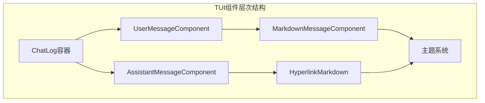
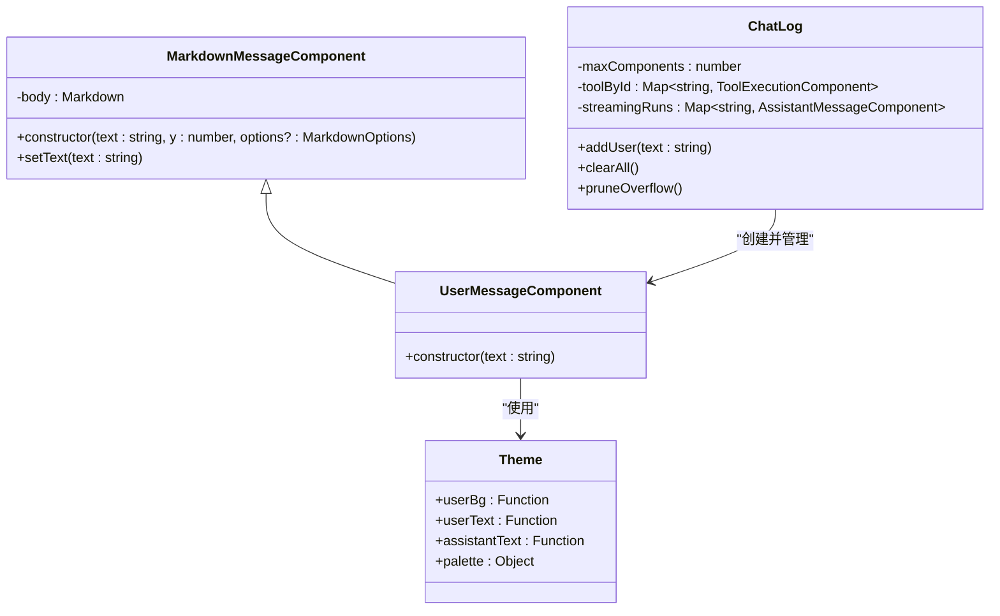
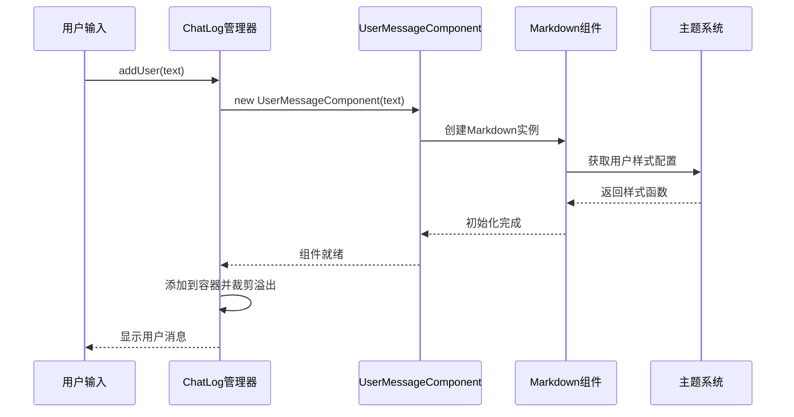
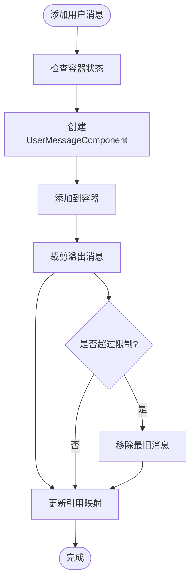
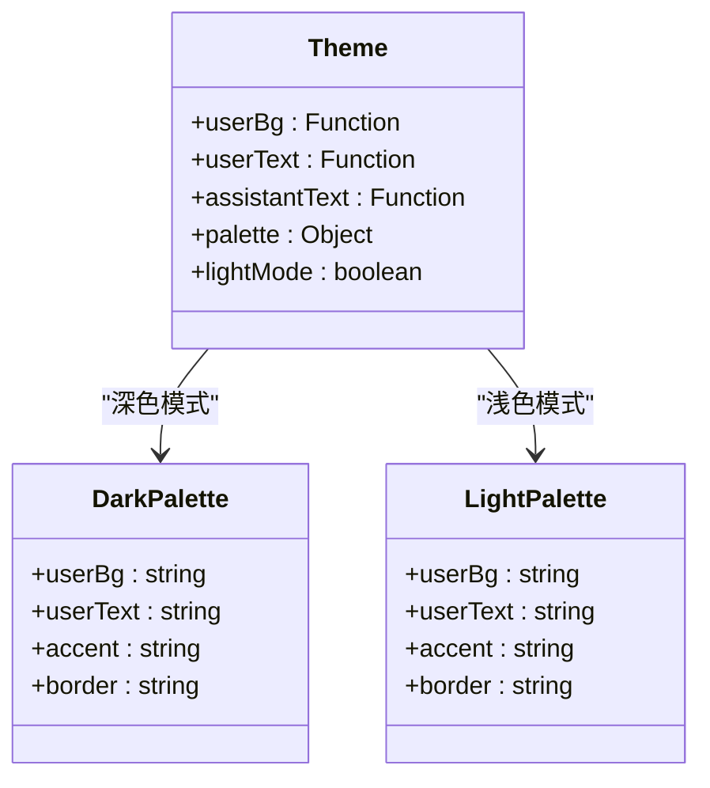
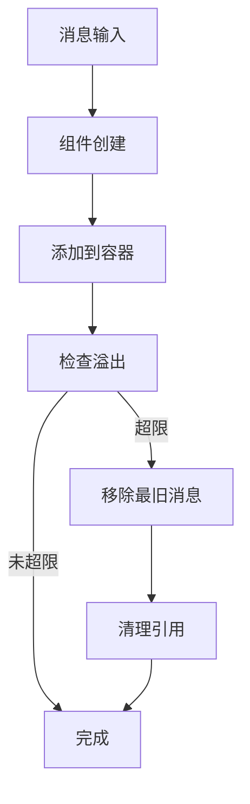

# 用户消息组件

<cite>
**本文档引用的文件**
- [user-message.ts](file://src/tui/components/user-message.ts)
- [markdown-message.ts](file://src/tui/components/markdown-message.ts)
- [chat-log.ts](file://src/tui/components/chat-log.ts)
- [theme.ts](file://src/tui/theme/theme.ts)
- [hyperlink-markdown.ts](file://src/tui/components/hyperlink-markdown.ts)
- [assistant-message.ts](file://src/tui/components/assistant-message.ts)
- [message-format.ts](file://src/commands/message-format.ts)
</cite>

## 目录
1. [简介](#简介)
2. [项目结构](#项目结构)
3. [核心组件](#核心组件)
4. [架构概览](#架构概览)
5. [详细组件分析](#详细组件分析)
6. [依赖关系分析](#依赖关系分析)
7. [性能考虑](#性能考虑)
8. [故障排除指南](#故障排除指南)
9. [结论](#结论)

## 简介

用户消息组件是OpenClaw项目中终端用户界面的重要组成部分，负责在TUI（文本用户界面）环境中渲染和显示用户发送的消息。该组件基于Markdown渲染系统构建，提供了丰富的样式定制和交互功能，支持在各种终端环境中提供一致的用户体验。

该组件的核心目标是在保持代码简洁性的同时，为用户提供清晰、美观的消息显示效果，包括语法高亮、链接处理和主题适配等功能。

## 项目结构

用户消息组件位于项目的TUI组件层次结构中，与助手消息组件、工具执行组件等共同构成了完整的聊天界面。



**图表来源**
- [chat-log.ts:1-151](file://src/tui/components/chat-log.ts#L1-L151)
- [user-message.ts:1-12](file://src/tui/components/user-message.ts#L1-L12)
- [markdown-message.ts:1-20](file://src/tui/components/markdown-message.ts#L1-L20)

**章节来源**
- [chat-log.ts:1-151](file://src/tui/components/chat-log.ts#L1-L151)
- [user-message.ts:1-12](file://src/tui/components/user-message.ts#L1-L12)
- [theme.ts:1-232](file://src/tui/theme/theme.ts#L1-L232)

## 核心组件

用户消息组件由三个主要部分组成：基础消息组件、用户特定样式和主题集成。

### 基础架构

组件采用继承模式，UserMessageComponent继承自MarkdownMessageComponent，实现了用户消息的特有样式需求。



**图表来源**
- [markdown-message.ts:6-19](file://src/tui/components/markdown-message.ts#L6-L19)
- [user-message.ts:4-11](file://src/tui/components/user-message.ts#L4-L11)
- [chat-log.ts:8-151](file://src/tui/components/chat-log.ts#L8-L151)
- [theme.ts:157-177](file://src/tui/theme/theme.ts#L157-L177)

### 主题系统集成

用户消息组件通过主题系统实现动态样式定制，支持深色和浅色两种模式：

- **用户背景色**: 使用专门的用户背景调色板
- **用户文本色**: 应用对比度优化的文本颜色
- **自动主题检测**: 基于终端环境自动选择合适的主题

**章节来源**
- [user-message.ts:4-11](file://src/tui/components/user-message.ts#L4-L11)
- [theme.ts:81-127](file://src/tui/theme/theme.ts#L81-L127)
- [theme.ts:157-177](file://src/tui/theme/theme.ts#L157-L177)

## 架构概览

用户消息组件在整个OpenClaw系统中扮演着消息渲染的关键角色，与聊天日志管理器紧密协作。



**图表来源**
- [chat-log.ts:59-61](file://src/tui/components/chat-log.ts#L59-L61)
- [user-message.ts:5-10](file://src/tui/components/user-message.ts#L5-L10)
- [markdown-message.ts:9-14](file://src/tui/components/markdown-message.ts#L9-L14)

## 详细组件分析

### UserMessageComponent类分析

UserMessageComponent是用户消息的核心实现，继承自MarkdownMessageComponent并添加了用户特定的样式配置。

#### 核心特性

1. **样式定制**: 通过主题系统应用用户专用的颜色方案
2. **继承复用**: 利用MarkdownMessageComponent的基础功能
3. **简单构造**: 提供简洁的初始化接口

#### 实现细节

组件在构造函数中调用父类构造函数，并传入用户特定的样式配置：
- `bgColor`: 使用`theme.userBg(line)`获取背景色
- `color`: 使用`theme.userText(line)`获取文本色

**章节来源**
- [user-message.ts:4-11](file://src/tui/components/user-message.ts#L4-L11)

### MarkdownMessageComponent基类分析

作为所有消息组件的基类，MarkdownMessageComponent提供了统一的Markdown渲染基础设施。

#### 设计模式

采用组合模式，将Markdown渲染与布局管理分离：
- **内容渲染**: 专注于Markdown文本的渲染
- **布局管理**: 通过Container组件管理子元素布局

#### 关键方法

- `setText(text: string)`: 动态更新消息内容
- 构造函数参数: 支持位置和样式配置

**章节来源**
- [markdown-message.ts:6-19](file://src/tui/components/markdown-message.ts#L6-L19)

### ChatLog集成分析

ChatLog作为消息容器，负责管理用户消息组件的生命周期。

#### 管理功能

1. **消息添加**: `addUser(text)`方法专门处理用户消息
2. **溢出控制**: 自动裁剪超出限制的消息数量
3. **状态跟踪**: 维护工具调用和流式响应的状态

#### 消息管理流程



**图表来源**
- [chat-log.ts:43-46](file://src/tui/components/chat-log.ts#L43-L46)
- [chat-log.ts:59-61](file://src/tui/components/chat-log.ts#L59-L61)

**章节来源**
- [chat-log.ts:48-52](file://src/tui/components/chat-log.ts#L48-L52)
- [chat-log.ts:59-61](file://src/tui/components/chat-log.ts#L59-L61)

### 主题系统集成

用户消息组件深度集成了OpenClaw的主题系统，提供了丰富的样式定制能力。

#### 主题配置



**图表来源**
- [theme.ts:81-127](file://src/tui/theme/theme.ts#L81-L127)
- [theme.ts:157-177](file://src/tui/theme/theme.ts#L157-L177)

#### 自适应主题

主题系统支持以下自适应特性：
- **环境检测**: 基于COLORFGBG环境变量检测终端背景
- **对比度优化**: 自动选择高对比度的颜色方案
- **手动覆盖**: 支持通过OPENCLAW_THEME环境变量强制指定主题

**章节来源**
- [theme.ts:48-76](file://src/tui/theme/theme.ts#L48-L76)
- [theme.ts:157-177](file://src/tui/theme/theme.ts#L157-L177)

## 依赖关系分析

用户消息组件的依赖关系相对简洁，主要依赖于主题系统和基础组件库。

```mermaid
graph LR
subgraph "外部依赖"
PiTUI[@mariozechner/pi-tui]
Chalk[chalk]
CliHighlight[cli-highlight]
end
subgraph "内部模块"
Theme[theme.ts]
MarkdownMessage[markdown-message.ts]
UserMessage[user-message.ts]
end
UserMessage --> MarkdownMessage
UserMessage --> Theme
MarkdownMessage --> PiTUI
Theme --> Chalk
Theme --> CliHighlight
```

**图表来源**
- [user-message.ts:1-2](file://src/tui/components/user-message.ts#L1-L2)
- [markdown-message.ts:1-2](file://src/tui/components/markdown-message.ts#L1-L2)
- [theme.ts:7-10](file://src/tui/theme/theme.ts#L7-L10)

### 外部依赖分析

1. **@mariozechner/pi-tui**: 提供基础的TUI组件和渲染功能
2. **chalk**: 用于ANSI颜色编码和样式应用
3. **cli-highlight**: 提供语法高亮功能

### 内部依赖分析

- **theme模块**: 提供主题配置和颜色方案
- **markdown-message模块**: 提供基础的Markdown渲染功能

**章节来源**
- [user-message.ts:1-2](file://src/tui/components/user-message.ts#L1-L2)
- [markdown-message.ts:1-2](file://src/tui/components/markdown-message.ts#L1-L2)
- [theme.ts:7-10](file://src/tui/theme/theme.ts#L7-L10)

## 性能考虑

用户消息组件在设计时充分考虑了性能优化，特别是在大量消息场景下的表现。

### 内存管理

1. **组件复用**: 通过Map结构管理工具组件引用，避免内存泄漏
2. **溢出裁剪**: 自动删除超出限制的历史消息
3. **引用清理**: 在移除组件时同步清理相关引用

### 渲染优化

1. **增量更新**: 支持动态更新消息内容而无需重新创建组件
2. **样式缓存**: 主题函数结果在组件生命周期内缓存
3. **最小化重绘**: 仅在必要时触发重新渲染

### 内存使用分析



**图表来源**
- [chat-log.ts:32-41](file://src/tui/components/chat-log.ts#L32-L41)
- [chat-log.ts:19-30](file://src/tui/components/chat-log.ts#L19-L30)

**章节来源**
- [chat-log.ts:14-17](file://src/tui/components/chat-log.ts#L14-L17)
- [chat-log.ts:32-41](file://src/tui/components/chat-log.ts#L32-L41)

## 故障排除指南

### 常见问题及解决方案

#### 消息显示异常

**症状**: 用户消息无法正确显示或样式错误

**可能原因**:
1. 主题配置加载失败
2. Markdown渲染错误
3. 终端不支持所需特性

**解决步骤**:
1. 检查OPENCLAW_THEME环境变量设置
2. 验证终端对ANSI转义序列的支持
3. 确认依赖包版本兼容性

#### 性能问题

**症状**: 大量消息时界面响应缓慢

**诊断方法**:
1. 检查maxComponents配置值
2. 监控内存使用情况
3. 分析消息渲染时间

**优化建议**:
1. 调整maxComponents限制
2. 启用消息内容压缩
3. 减少不必要的样式计算

#### 样式不匹配

**症状**: 用户消息颜色与预期不符

**排查步骤**:
1. 验证终端背景色检测逻辑
2. 检查环境变量COLORFGBG值
3. 确认主题切换逻辑

**章节来源**
- [theme.ts:48-76](file://src/tui/theme/theme.ts#L48-L76)
- [chat-log.ts:14-17](file://src/tui/components/chat-log.ts#L14-L17)

## 结论

用户消息组件作为OpenClaw TUI界面的重要组成部分，展现了优秀的架构设计和实现质量。通过合理的继承模式、主题集成和性能优化，该组件在提供丰富功能的同时保持了代码的简洁性和可维护性。

### 主要优势

1. **清晰的架构**: 基于继承的设计使代码结构清晰易懂
2. **强大的主题系统**: 支持多种主题和自动适配
3. **良好的性能**: 有效的内存管理和渲染优化
4. **易于扩展**: 模块化的设计便于功能扩展

### 技术亮点

- **主题自适应**: 自动检测终端环境并选择合适主题
- **内存安全**: 完善的引用管理和溢出控制机制
- **渲染优化**: 高效的Markdown渲染和增量更新机制
- **错误处理**: 健壮的异常处理和降级策略

该组件为整个OpenClaw项目的用户界面提供了坚实的基础，为用户提供了流畅、美观的消息交互体验。