# AI提供者模型配置系统

<cite>
**本文档引用的文件**
- [src/config/defaults.ts](file://src/config/defaults.ts)
- [src/agents/model-catalog.ts](file://src/agents/model-catalog.ts)
- [src/agents/pi-embedded-runner/model.ts](file://src/agents/pi-embedded-runner/model.ts)
- [src/commands/onboard-auth.config-shared.ts](file://src/commands/onboard-auth.config-shared.ts)
- [src/config/types.models.ts](file://src/config/types.models.ts)
- [src/config/types.ts](file://src/config/types.ts)
- [src/agents/models-config.providers.ts](file://src/agents/models-config.providers.ts)
- [src/agents/models-config.providers.static.ts](file://src/agents/models-config.providers.static.ts)
- [src/agents/models-config.providers.discovery.ts](file://src/agents/models-config.providers.discovery.ts)
- [src/commands/onboard-auth.config-core.ts](file://src/commands/onboard-auth.config-core.ts)
- [ui-react/src/components/settings/provider-model/ProviderModelEditDialog.tsx](file://ui-react/src/components/settings/provider-model/ProviderModelEditDialog.tsx)
- [ui-react/src/components/settings/provider-model/AuthMethodTabs.tsx](file://ui-react/src/components/settings/provider-model/AuthMethodTabs.tsx)
- [ui-react/src/components/settings/provider-model/ProviderModelSection.tsx](file://ui-react/src/components/settings/provider-model/ProviderModelSection.tsx)
- [ui-react/src/components/settings/provider-model/types.ts](file://ui-react/src/components/settings/provider-model/types.ts)
- [ui-react/src/components/settings/provider-model/config-mapping.ts](file://ui-react/src/components/settings/provider-model/config-mapping.ts)
- [ui-react/src/components/settings/provider-model/ProviderModelSummaryCard.tsx](file://ui-react/src/components/settings/provider-model/ProviderModelSummaryCard.tsx)
- [ui-react/src/data/auth-choice-groups.ts](file://ui-react/src/data/auth-choice-groups.ts)
- [src/config/types.auth.ts](file://src/config/types.auth.ts)
</cite>

## 更新摘要
**变更内容**
- 新增完整的自定义提供程序配置UI系统
- 增加OAuth、API密钥、代理认证方式支持
- 添加三步骤配置流程（选择提供者→选择认证→选择模型）
- 实现动态凭据验证和OAuth轮询机制
- 集成自定义提供者和本地代理配置

## 目录
1. [简介](#简介)
2. [项目结构](#项目结构)
3. [核心组件](#核心组件)
4. [架构概览](#架构概览)
5. [详细组件分析](#详细组件分析)
6. [新增UI配置系统](#新增ui配置系统)
7. [认证方法支持](#认证方法支持)
8. [依赖关系分析](#依赖关系分析)
9. [性能考虑](#性能考虑)
10. [故障排除指南](#故障排除指南)
11. [结论](#结论)

## 简介

OpenClaw的AI提供者模型配置系统是一个高度模块化的架构，负责管理各种AI模型提供者的配置、发现和使用。该系统支持多种提供者（如OpenAI、Anthropic、Google等），并提供了灵活的配置机制来处理本地模型、云服务和混合部署场景。

**更新** 新增了完整的自定义提供程序配置UI系统，支持OAuth、API密钥、代理等多种认证方式，并实现了三步骤的配置流程。

系统的核心功能包括：
- 模型目录管理和发现
- 提供者配置的标准化和合并
- 模型解析和重定向
- 认证配置的动态管理
- 多种提供者类型的统一接口
- **新增** 自定义提供者配置界面和验证机制
- **新增** OAuth轮询和设备代码认证支持
- **新增** 本地代理和自定义API端点配置

## 项目结构

AI提供者模型配置系统主要分布在以下目录中：

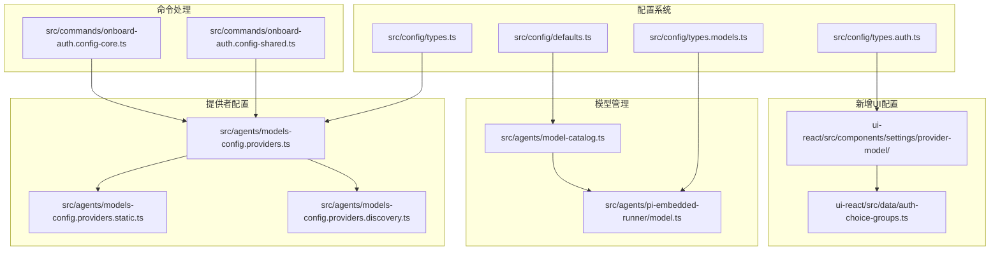

**图表来源**
- [src/config/defaults.ts:1-537](file://src/config/defaults.ts#L1-L537)
- [src/agents/model-catalog.ts:1-310](file://src/agents/model-catalog.ts#L1-L310)
- [src/agents/pi-embedded-runner/model.ts:1-304](file://src/agents/pi-embedded-runner/model.ts#L1-L304)
- [ui-react/src/components/settings/provider-model/ProviderModelEditDialog.tsx:1-219](file://ui-react/src/components/settings/provider-model/ProviderModelEditDialog.tsx#L1-L219)

**章节来源**
- [src/config/defaults.ts:1-537](file://src/config/defaults.ts#L1-L537)
- [src/agents/model-catalog.ts:1-310](file://src/agents/model-catalog.ts#L1-L310)
- [src/agents/pi-embedded-runner/model.ts:1-304](file://src/agents/pi-embedded-runner/model.ts#L1-L304)
- [ui-react/src/components/settings/provider-model/ProviderModelEditDialog.tsx:1-219](file://ui-react/src/components/settings/provider-model/ProviderModelEditDialog.tsx#L1-L219)

## 核心组件

### 配置默认值系统

配置默认值系统负责为模型配置提供合理的默认值和规范化处理：

- **模型API默认值**：自动推断提供者API类型
- **成本计算**：标准化模型成本结构
- **输入类型**：默认文本输入类型
- **令牌限制**：上下文窗口和最大令牌数的默认值

### 模型目录管理

模型目录系统负责：
- 发现和加载可用的AI模型
- 合并用户配置的模型定义
- 提供模型查询和匹配功能
- 支持合成模型回退机制

### 提供者配置管理

提供者配置系统处理：
- 静态提供者配置（预定义的模型列表）
- 动态提供者发现（本地模型实例）
- 提供者配置的标准化和验证
- 认证信息的动态解析

### **新增** UI配置系统

**更新** 新增了完整的UI配置系统，包含以下核心组件：

- **ProviderModelEditDialog**：三步骤配置对话框
- **ProviderModelSection**：配置区域组件
- **AuthMethodTabs**：认证方法标签页
- **ProviderModelSummaryCard**：配置摘要卡片
- **config-mapping**：配置映射和补丁操作

**章节来源**
- [src/config/defaults.ts:213-347](file://src/config/defaults.ts#L213-L347)
- [src/agents/model-catalog.ts:109-180](file://src/agents/model-catalog.ts#L109-L180)
- [src/agents/models-config.providers.ts:279-438](file://src/agents/models-config.providers.ts#L279-L438)
- [ui-react/src/components/settings/provider-model/ProviderModelEditDialog.tsx:1-219](file://ui-react/src/components/settings/provider-model/ProviderModelEditDialog.tsx#L1-L219)

## 架构概览

AI提供者模型配置系统采用分层架构设计：

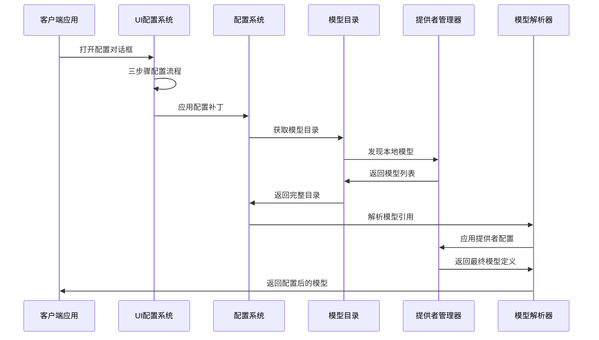

**图表来源**
- [src/agents/model-catalog.ts:193-278](file://src/agents/model-catalog.ts#L193-L278)
- [src/agents/pi-embedded-runner/model.ts:251-275](file://src/agents/pi-embedded-runner/model.ts#L251-L275)
- [ui-react/src/components/settings/provider-model/ProviderModelEditDialog.tsx:93-118](file://ui-react/src/components/settings/provider-model/ProviderModelEditDialog.tsx#L93-L118)

系统的关键特性包括：

1. **模块化设计**：每个组件都有明确的职责边界
2. **可扩展性**：支持新的提供者类型和模型配置
3. **向后兼容**：提供模型前向兼容性支持
4. **错误处理**：完善的错误检测和恢复机制
5. ****新增** UI友好性**：直观的三步骤配置流程
6. ****新增** 实时验证**：凭据验证和OAuth状态跟踪

## 详细组件分析

### 模型目录系统

模型目录系统是整个配置系统的核心，负责管理所有可用的AI模型：

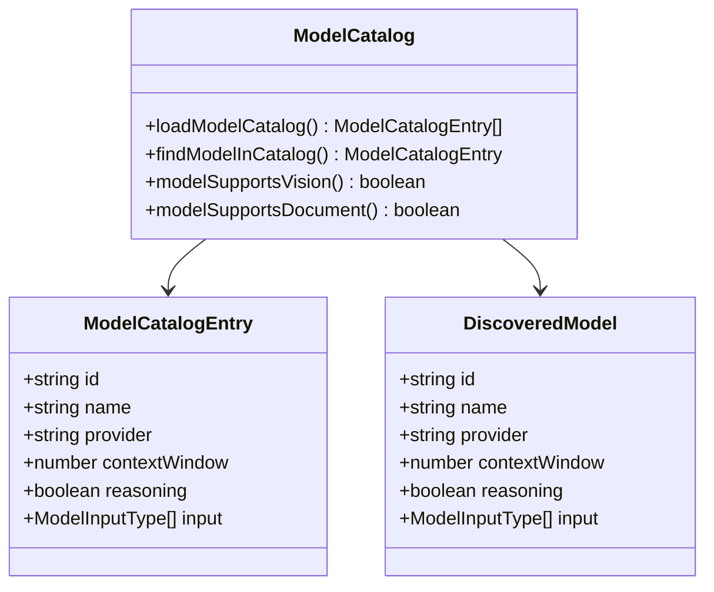

**图表来源**
- [src/agents/model-catalog.ts:10-31](file://src/agents/model-catalog.ts#L10-L31)
- [src/agents/model-catalog.ts:193-278](file://src/agents/model-catalog.ts#L193-L278)

模型目录系统的主要功能：
- **动态发现**：从本地实例发现AI模型
- **配置合并**：合并用户配置的模型定义
- **合成回退**：为缺失的模型提供回退选项
- **类型安全**：确保模型定义的完整性

### 提供者配置系统

提供者配置系统处理不同类型的模型提供者：

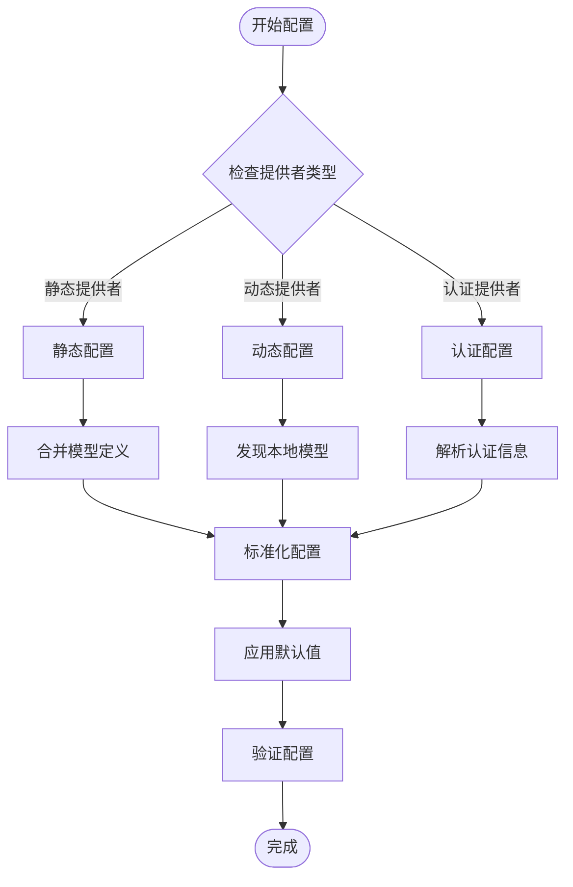

**图表来源**
- [src/agents/models-config.providers.ts:670-744](file://src/agents/models-config.providers.ts#L670-L744)
- [src/agents/models-config.providers.static.ts:1-200](file://src/agents/models-config.providers.static.ts#L1-L200)

### 模型解析器

模型解析器负责将用户指定的模型引用转换为实际的模型配置：

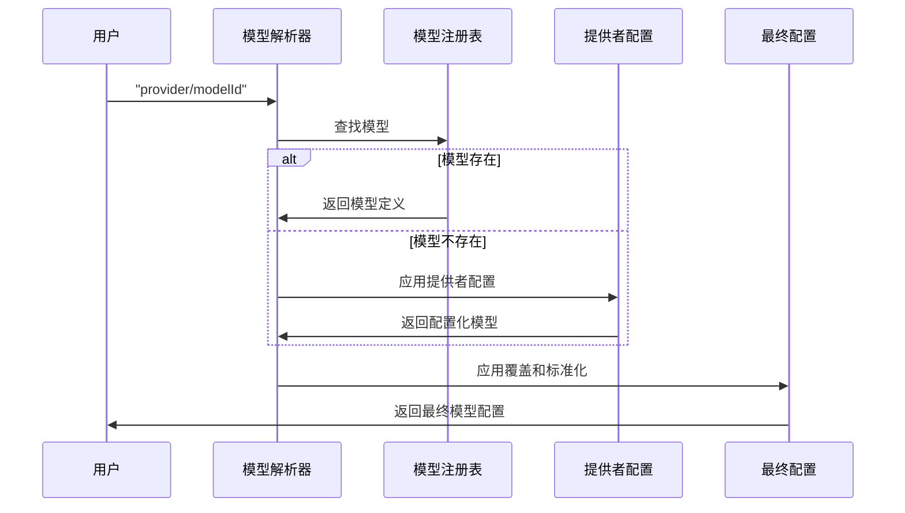

**图表来源**
- [src/agents/pi-embedded-runner/model.ts:149-249](file://src/agents/pi-embedded-runner/model.ts#L149-L249)

**章节来源**
- [src/agents/model-catalog.ts:109-180](file://src/agents/model-catalog.ts#L109-L180)
- [src/agents/models-config.providers.ts:279-438](file://src/agents/models-config.providers.ts#L279-L438)
- [src/agents/pi-embedded-runner/model.ts:67-115](file://src/agents/pi-embedded-runner/model.ts#L67-L115)

## 新增UI配置系统

**更新** 新增了完整的自定义提供程序配置UI系统，提供直观的图形界面来管理AI提供者配置。

### ProviderModelEditDialog 组件

这是配置系统的核心对话框组件，实现了三步骤的配置流程：

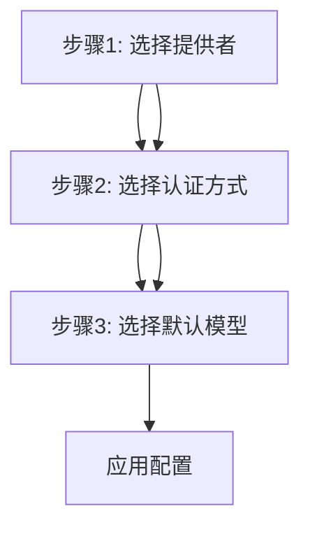

**图表来源**
- [ui-react/src/components/settings/provider-model/ProviderModelEditDialog.tsx:22-32](file://ui-react/src/components/settings/provider-model/ProviderModelEditDialog.tsx#L22-L32)

### ProviderModelSection 组件

配置区域的核心组件，处理不同认证方法的配置：

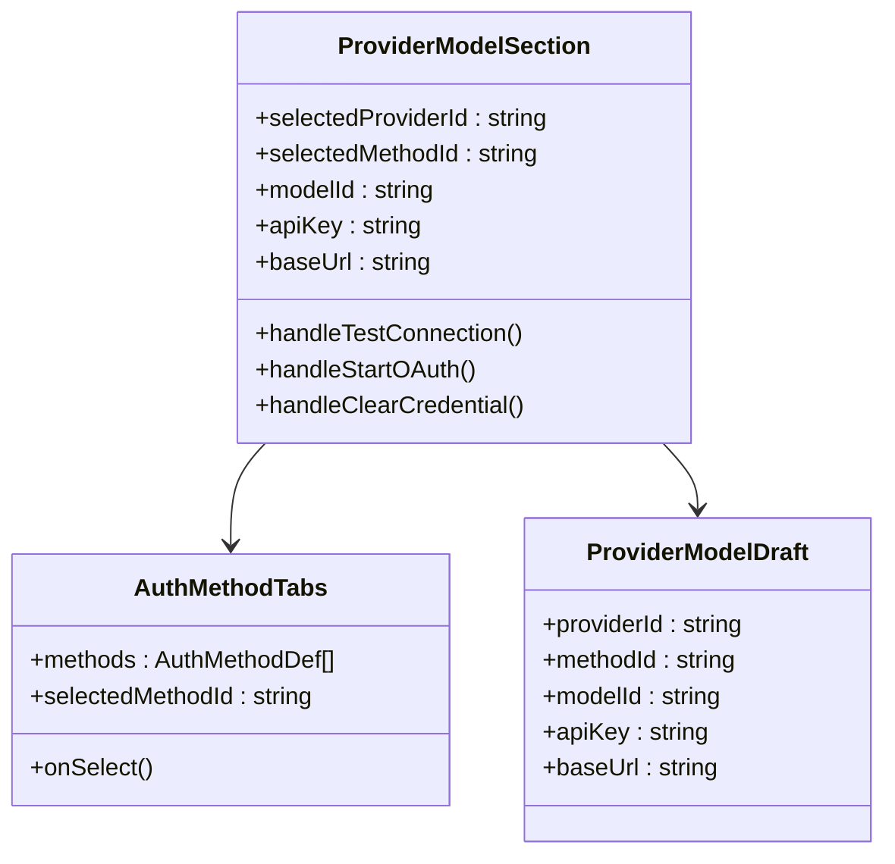

**图表来源**
- [ui-react/src/components/settings/provider-model/ProviderModelSection.tsx:56-70](file://ui-react/src/components/settings/provider-model/ProviderModelSection.tsx#L56-L70)
- [ui-react/src/components/settings/provider-model/AuthMethodTabs.tsx:9-13](file://ui-react/src/components/settings/provider-model/AuthMethodTabs.tsx#L9-L13)

### 配置映射系统

配置映射系统负责将UI配置转换为实际的配置补丁：

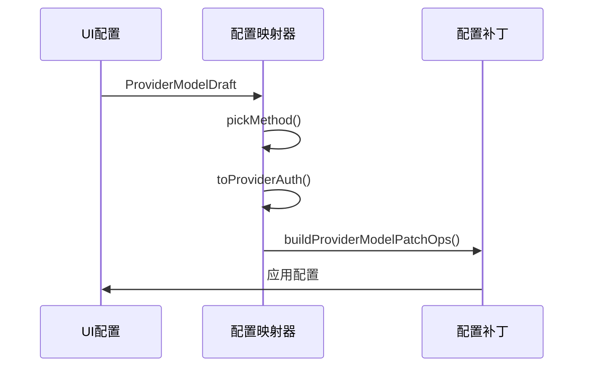

**图表来源**
- [ui-react/src/components/settings/provider-model/config-mapping.ts:101-129](file://ui-react/src/components/settings/provider-model/config-mapping.ts#L101-L129)

**章节来源**
- [ui-react/src/components/settings/provider-model/ProviderModelEditDialog.tsx:1-219](file://ui-react/src/components/settings/provider-model/ProviderModelEditDialog.tsx#L1-L219)
- [ui-react/src/components/settings/provider-model/ProviderModelSection.tsx:1-523](file://ui-react/src/components/settings/provider-model/ProviderModelSection.tsx#L1-L523)
- [ui-react/src/components/settings/provider-model/config-mapping.ts:1-130](file://ui-react/src/components/settings/provider-model/config-mapping.ts#L1-L130)

## 认证方法支持

**更新** 新增了对多种认证方法的全面支持，包括OAuth、API密钥、代理和自定义提供者。

### 认证方法类型

系统支持四种主要的认证方法：

| 认证方法 | 类型标识 | 描述 | 使用场景 |
|---------|----------|------|----------|
| API密钥 | `api-key` | 静态API密钥认证 | OpenAI、Anthropic等标准API |
| OAuth | `oauth` | OAuth 2.0认证流程 | 设备代码登录、浏览器授权 |
| 代理 | `proxy` | 本地代理访问 | VS Code Copilot本地代理 |
| 自定义 | `custom` | 自定义API端点 | 本地vLLM、自定义服务 |

### 认证方法定义

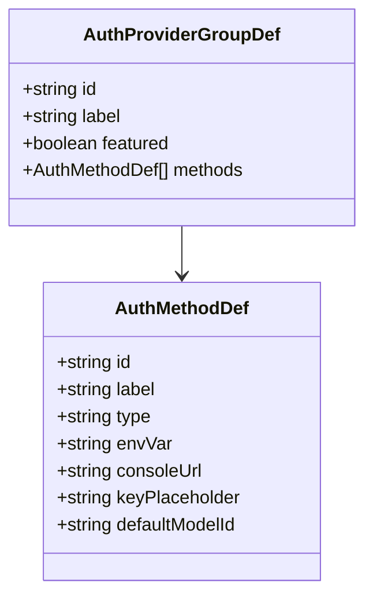

**图表来源**
- [ui-react/src/data/auth-choice-groups.ts:14-38](file://ui-react/src/data/auth-choice-groups.ts#L14-L38)

### OAuth认证流程

OAuth认证支持设备代码流程和轮询机制：

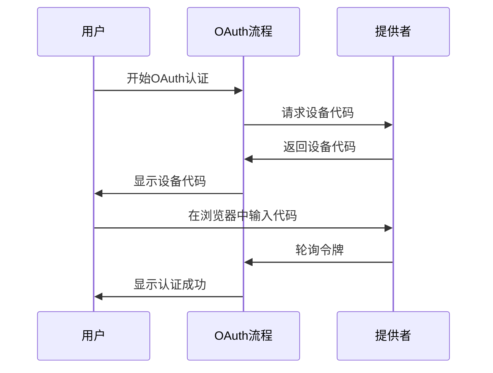

**图表来源**
- [ui-react/src/components/settings/provider-model/ProviderModelSection.tsx:201-281](file://ui-react/src/components/settings/provider-model/ProviderModelSection.tsx#L201-L281)

**章节来源**
- [ui-react/src/data/auth-choice-groups.ts:12-28](file://ui-react/src/data/auth-choice-groups.ts#L12-L28)
- [ui-react/src/components/settings/provider-model/ProviderModelSection.tsx:340-405](file://ui-react/src/components/settings/provider-model/ProviderModelSection.tsx#L340-L405)
- [src/config/types.auth.ts:1-29](file://src/config/types.auth.ts#L1-L29)

## 依赖关系分析

AI提供者模型配置系统具有清晰的依赖层次结构：

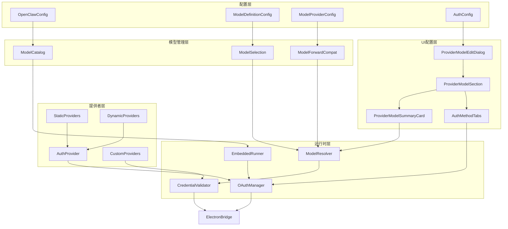

**图表来源**
- [src/config/types.models.ts:34-76](file://src/config/types.models.ts#L34-L76)
- [src/agents/models-config.providers.ts:1-836](file://src/agents/models-config.providers.ts#L1-L836)
- [ui-react/src/components/settings/provider-model/ProviderModelEditDialog.tsx:1-219](file://ui-react/src/components/settings/provider-model/ProviderModelEditDialog.tsx#L1-L219)

系统的关键依赖关系：
- **配置到模型**：配置系统驱动模型目录管理
- **模型到提供者**：模型选择影响提供者配置
- **提供者到运行时**：提供者配置决定运行时行为
- **认证到提供者**：认证信息影响提供者可用性
- **UI到配置**：UI配置直接影响系统配置
- **验证到运行时**：凭据验证影响运行时认证

**章节来源**
- [src/config/types.models.ts:1-77](file://src/config/types.models.ts#L1-L77)
- [src/agents/models-config.providers.ts:1-836](file://src/agents/models-config.providers.ts#L1-L836)
- [ui-react/src/components/settings/provider-model/ProviderModelEditDialog.tsx:1-219](file://ui-react/src/components/settings/provider-model/ProviderModelEditDialog.tsx#L1-L219)

## 性能考虑

AI提供者模型配置系统在性能方面采用了多项优化策略：

### 缓存机制
- **模型目录缓存**：避免重复的模型发现操作
- **配置解析缓存**：缓存已解析的模型配置
- **认证信息缓存**：减少认证查询的频率
- ****新增** UI状态缓存**：缓存用户输入状态

### 异步处理
- **并发模型发现**：同时发现多个提供者的模型
- **批量配置处理**：批量处理提供者配置
- **延迟初始化**：按需初始化昂贵的操作
- ****新增** OAuth轮询优化**：智能轮询间隔控制

### 内存优化
- **对象池**：复用临时对象减少GC压力
- **懒加载**：延迟加载不常用的模块
- **数据压缩**：压缩存储不常用的数据
- ****新增** UI组件卸载**：及时清理未使用的组件

### **新增** UI性能优化

- **虚拟滚动**：大量模型选项的虚拟化处理
- **防抖输入**：API密钥输入的防抖处理
- **条件渲染**：根据步骤动态渲染组件
- **状态最小化**：只保存必要的配置状态

## 故障排除指南

### 常见问题及解决方案

**模型未找到错误**
- 检查模型提供者是否正确配置
- 验证模型ID格式是否正确
- 确认提供者认证信息是否有效

**配置冲突问题**
- 检查提供者配置中的重复定义
- 验证模型ID的唯一性
- 确认配置合并策略

**性能问题**
- 检查模型目录缓存是否正常工作
- 监控异步操作的执行状态
- 分析内存使用情况

### **新增** UI配置问题

**OAuth认证失败**
- 检查网络连接和防火墙设置
- 验证提供者OAuth配置
- 确认设备代码是否正确输入
- 检查OAuth轮询间隔设置

**凭据验证失败**
- 确认API密钥格式正确
- 检查API密钥是否过期
- 验证网络代理设置
- 确认自定义端点URL正确

**配置应用失败**
- 检查配置路径权限
- 验证配置格式正确性
- 确认配置文件锁定状态
- 检查磁盘空间和权限

**章节来源**
- [src/agents/pi-embedded-runner/model.ts:288-304](file://src/agents/pi-embedded-runner/model.ts#L288-L304)
- [src/agents/models-config.providers.ts:670-744](file://src/agents/models-config.providers.ts#L670-L744)
- [ui-react/src/components/settings/provider-model/ProviderModelSection.tsx:163-190](file://ui-react/src/components/settings/provider-model/ProviderModelSection.tsx#L163-L190)

## 结论

OpenClaw的AI提供者模型配置系统展现了现代AI应用配置管理的最佳实践。通过模块化设计、清晰的职责分离和完善的错误处理机制，该系统能够有效管理复杂的多提供者环境。

**更新** 新增的UI配置系统进一步提升了用户体验，提供了直观的图形界面来管理复杂的AI提供者配置。系统的主要优势包括：

- **高度可扩展性**：支持新提供者的轻松集成
- **强大的配置能力**：灵活的配置选项和优先级机制
- **优秀的用户体验**：智能的默认值和错误提示
- **可靠的性能表现**：经过优化的缓存和异步处理
- ****新增** 直观的UI界面**：三步骤配置流程简化了复杂设置
- ****新增** 全面的认证支持**：OAuth、API密钥、代理、自定义提供者
- ****新增** 实时验证机制**：凭据验证和OAuth状态跟踪
- ****新增** 错误处理完善**：详细的错误提示和恢复机制

未来的发展方向可能包括：
- 更智能的模型推荐算法
- 增强的配置验证和建议功能
- 更好的多语言支持
- 改进的监控和诊断工具
- **新增** 更丰富的提供者模板
- **新增** 配置导入导出功能
- **新增** 配置版本管理和回滚