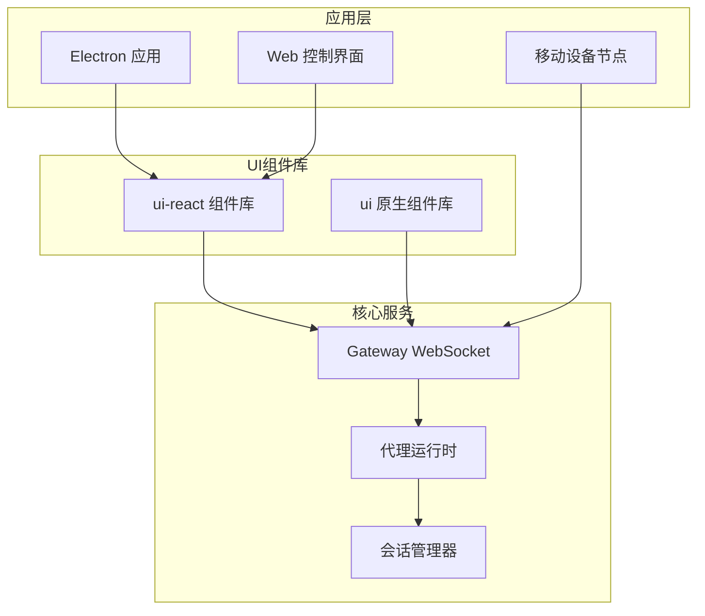
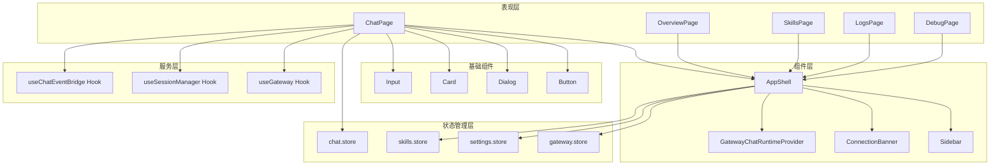
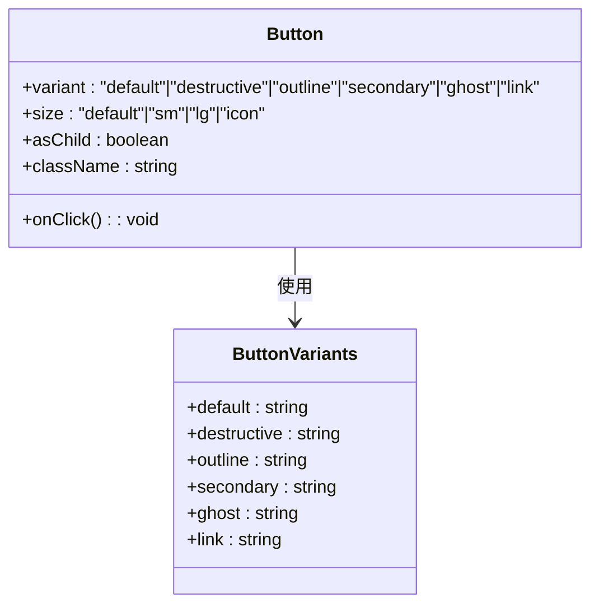
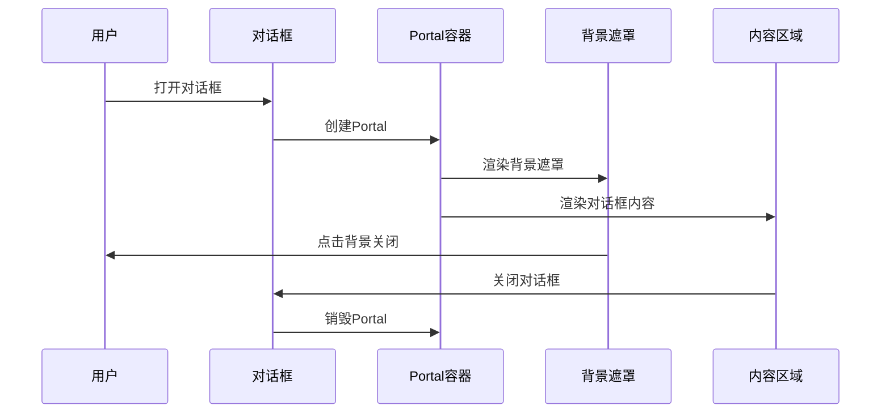
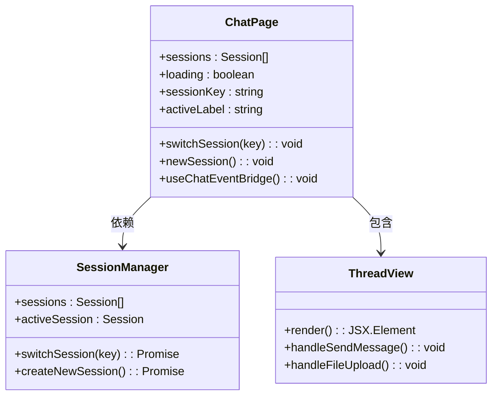
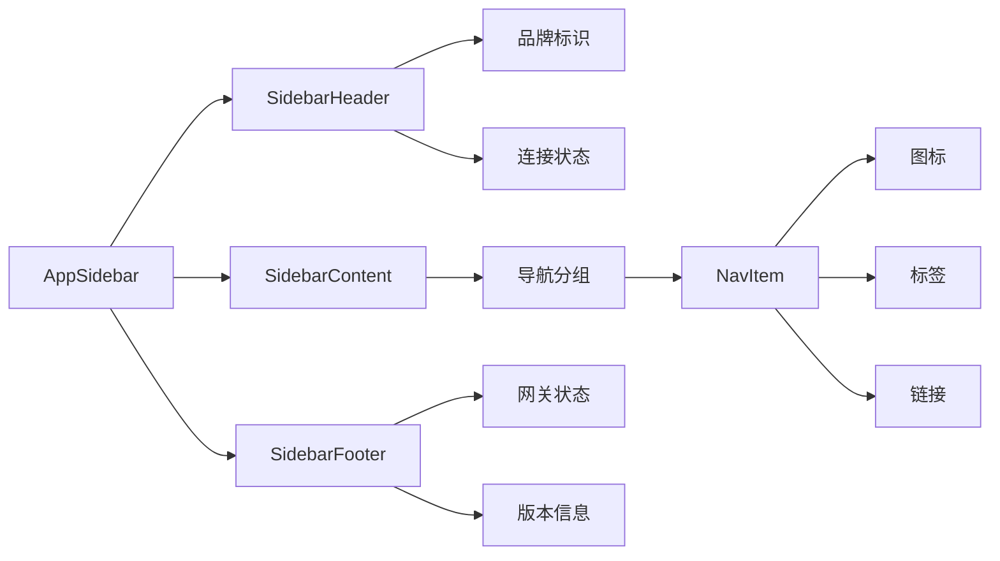
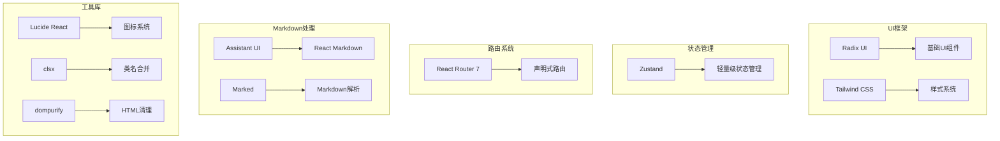

# UI组件库更新

<cite>
**本文档引用的文件**
- [README.md](file://README.md)
- [ui-react/package.json](file://ui-react/package.json)
- [ui/package.json](file://ui/package.json)
- [ui-react/src/components/ui/button.tsx](file://ui-react/src/components/ui/button.tsx)
- [ui-react/src/components/ui/input.tsx](file://ui-react/src/components/ui/input.tsx)
- [ui-react/src/components/ui/card.tsx](file://ui-react/src/components/ui/card.tsx)
- [ui-react/src/components/ui/dialog.tsx](file://ui-react/src/components/ui/dialog.tsx)
- [ui-react/src/components/layout/AppShell.tsx](file://ui-react/src/components/layout/AppShell.tsx)
- [ui-react/src/components/layout/Sidebar.tsx](file://ui-react/src/components/layout/Sidebar.tsx)
- [ui-react/src/pages/ChatPage.tsx](file://ui-react/src/pages/ChatPage.tsx)
</cite>

## 目录
1. [简介](#简介)
2. [项目结构](#项目结构)
3. [核心组件](#核心组件)
4. [架构概览](#架构概览)
5. [详细组件分析](#详细组件分析)
6. [依赖分析](#依赖分析)
7. [性能考虑](#性能考虑)
8. [故障排除指南](#故障排除指南)
9. [结论](#结论)

## 简介

OpenClaw是一个个人AI助手项目，提供跨平台的消息处理、语音控制和可视化工作空间功能。该项目包含两个主要的UI组件库：基于Lit的原生Web组件库（ui）和基于React的现代化组件库（ui-react）。

根据项目文档，OpenClaw支持多种消息渠道（WhatsApp、Telegram、Slack、Discord等），具有本地优先的设计理念，并提供完整的控制界面用于管理助手的各种功能。

## 项目结构

项目采用模块化架构，包含以下主要组件：

**图表来源**
- [README.md:145-150](file://README.md#L145-L150)
- [ui-react/package.json:11-46](file://ui-react/package.json#L11-L46)

**章节来源**
- [README.md:145-150](file://README.md#L145-L150)
- [ui-react/package.json:11-46](file://ui-react/package.json#L11-L46)
- [ui/package.json:11-20](file://ui/package.json#L11-L20)

## 核心组件

### React组件库架构

ui-react组件库基于现代前端技术栈构建，使用以下关键技术：

- **基础UI框架**: Radix UI + Tailwind CSS
- **状态管理**: Zustand
- **路由**: React Router 7
- **Markdown渲染**: React Markdown + Assistant UI
- **图标系统**: Lucide React

### 组件分类

组件库包含以下主要组件类别：

1. **基础UI组件**: 按钮、输入框、卡片、对话框等
2. **布局组件**: 侧边栏、页面外壳、网格系统
3. **业务组件**: 聊天界面、会话管理、设置面板
4. **表单组件**: 验证、错误处理、数据绑定

**章节来源**
- [ui-react/package.json:11-46](file://ui-react/package.json#L11-L46)
- [ui-react/src/components/ui/button.tsx:6-32](file://ui-react/src/components/ui/button.tsx#L6-L32)
- [ui-react/src/components/ui/input.tsx:4-18](file://ui-react/src/components/ui/input.tsx#L4-L18)

## 架构概览

OpenClaw的UI架构采用分层设计，确保组件的可复用性和维护性：

**图表来源**
- [ui-react/src/pages/ChatPage.tsx:1-96](file://ui-react/src/pages/ChatPage.tsx#L1-L96)
- [ui-react/src/components/layout/AppShell.tsx:11-32](file://ui-react/src/components/layout/AppShell.tsx#L11-L32)
- [ui-react/src/components/ui/button.tsx:34-53](file://ui-react/src/components/ui/button.tsx#L34-L53)

## 详细组件分析

### 基础按钮组件

按钮组件采用变体模式设计，支持多种视觉状态和尺寸：

**图表来源**
- [ui-react/src/components/ui/button.tsx:6-32](file://ui-react/src/components/ui/button.tsx#L6-L32)
- [ui-react/src/components/ui/button.tsx:34-53](file://ui-react/src/components/ui/button.tsx#L34-L53)

**章节来源**
- [ui-react/src/components/ui/button.tsx:6-32](file://ui-react/src/components/ui/button.tsx#L6-L32)
- [ui-react/src/components/ui/button.tsx:34-53](file://ui-react/src/components/ui/button.tsx#L34-L53)

### 对话框组件

对话框组件提供完整的模态交互体验：

**图表来源**
- [ui-react/src/components/ui/dialog.tsx:7-71](file://ui-react/src/components/ui/dialog.tsx#L7-L71)
- [ui-react/src/components/ui/dialog.tsx:23-37](file://ui-react/src/components/ui/dialog.tsx#L23-L37)

**章节来源**
- [ui-react/src/components/ui/dialog.tsx:7-71](file://ui-react/src/components/ui/dialog.tsx#L7-L71)
- [ui-react/src/components/ui/dialog.tsx:23-37](file://ui-react/src/components/ui/dialog.tsx#L23-L37)

### 页面外壳组件

AppShell作为应用的根布局组件，负责整体结构和状态管理：

**图表来源**
- [ui-react/src/components/layout/AppShell.tsx:11-32](file://ui-react/src/components/layout/AppShell.tsx#L11-L32)

**章节来源**
- [ui-react/src/components/layout/AppShell.tsx:11-32](file://ui-react/src/components/layout/AppShell.tsx#L11-L32)

### 聊天页面组件

ChatPage实现了完整的聊天界面功能：

**图表来源**
- [ui-react/src/pages/ChatPage.tsx:9-96](file://ui-react/src/pages/ChatPage.tsx#L9-L96)

**章节来源**
- [ui-react/src/pages/ChatPage.tsx:9-96](file://ui-react/src/pages/ChatPage.tsx#L9-L96)

### 侧边栏导航组件

侧边栏组件提供了完整的导航功能：

**图表来源**
- [ui-react/src/components/layout/Sidebar.tsx:21-93](file://ui-react/src/components/layout/Sidebar.tsx#L21-L93)

**章节来源**
- [ui-react/src/components/layout/Sidebar.tsx:21-93](file://ui-react/src/components/layout/Sidebar.tsx#L21-L93)

## 依赖分析

### React组件库依赖

ui-react组件库采用了现代化的依赖管理策略：

**图表来源**
- [ui-react/package.json:11-46](file://ui-react/package.json#L11-L46)

### 原生组件库依赖

ui组件库专注于Web组件技术：

**章节来源**
- [ui-react/package.json:11-46](file://ui-react/package.json#L11-L46)
- [ui/package.json:11-20](file://ui/package.json#L11-L20)

## 性能考虑

### 组件优化策略

1. **懒加载**: 使用React.lazy和Suspense实现组件按需加载
2. **状态分离**: 将全局状态与局部状态分离，避免不必要的重渲染
3. **虚拟滚动**: 对于大量数据的列表使用虚拟滚动技术
4. **缓存机制**: 实现组件级别的缓存和记忆化

### 性能监控

- 实现组件渲染时间监控
- 监控WebSocket连接状态
- 跟踪用户交互性能指标

## 故障排除指南

### 常见问题

1. **组件样式问题**: 检查Tailwind配置和CSS变量
2. **状态同步问题**: 验证Zustand store的状态更新
3. **路由导航问题**: 确认React Router配置正确
4. **WebSocket连接问题**: 检查Gateway连接状态

### 调试工具

- 浏览器开发者工具
- React DevTools
- Zustand DevTools
- WebSocket调试工具

## 结论

OpenClaw的UI组件库展现了现代化前端开发的最佳实践，通过精心设计的组件架构和丰富的功能集，为用户提供了一致且高效的用户体验。组件库的模块化设计确保了良好的可维护性和扩展性，同时保持了优秀的性能表现。

未来的发展方向包括进一步优化组件的可访问性、增强主题系统的灵活性，以及探索更多创新的交互模式。随着项目生态的不断完善，UI组件库将继续为OpenClaw平台提供强大的前端支撑。