# UI组件系统

<cite>
**本文档引用的文件**
- [README.md](file://README.md)
- [package.json](file://ui/package.json)
- [main.ts](file://ui/src/main.ts)
- [app.ts](file://ui/src/ui/app.ts)
- [package.json](file://ui-react/package.json)
- [main.tsx](file://ui-react/src/main.tsx)
- [App.tsx](file://ui-react/src/App.tsx)
- [router.tsx](file://ui-react/src/router.tsx)
- [ChatPage.tsx](file://ui-react/src/pages/ChatPage.tsx)
- [SkillsPage.tsx](file://ui-react/src/pages/SkillsPage.tsx)
- [AppShell.tsx](file://ui-react/src/components/layout/AppShell.tsx)
- [Sidebar.tsx](file://ui-react/src/components/layout/Sidebar.tsx)
- [SkillCard.tsx](file://ui-react/src/components/skills/SkillCard.tsx)
- [SkillsToolbar.tsx](file://ui-react/src/components/skills/SkillsToolbar.tsx)
- [SkillStatusBadges.tsx](file://ui-react/src/components/skills/SkillStatusBadges.tsx)
- [chat.store.ts](file://ui-react/src/store/chat.store.ts)
- [skills.store.ts](file://ui-react/src/store/skills.store.ts)
- [gateway.store.ts](file://ui-react/src/store/gateway.store.ts)
- [settings.store.ts](file://ui-react/src/store/settings.store.ts)
- [skills.ts](file://ui-react/src/types/skills.ts)
- [skills-grouping.ts](file://ui-react/src/lib/skills-grouping.ts)
</cite>

## 更新摘要

**所做更改**

- 新增React技能管理系统的完整组件架构分析
- 添加技能状态管理Store的详细说明
- 更新路由系统以包含技能页面
- 新增技能分组和工具栏组件分析
- 扩展状态管理层，包含技能相关状态

## 目录

1. [简介](#简介)
2. [项目结构](#项目结构)
3. [核心组件](#核心组件)
4. [架构概览](#架构概览)
5. [详细组件分析](#详细组件分析)
6. [依赖关系分析](#依赖关系分析)
7. [性能考虑](#性能考虑)
8. [故障排除指南](#故障排除指南)
9. [结论](#结论)

## 简介

OpenClaw的UI组件系统是一个现代化的双框架架构，提供了两种不同的用户界面实现方式：

- **Lit-based传统UI**：基于Web Components的轻量级实现，使用Lit框架构建响应式组件
- **React-based新UI**：基于React 19的现代化实现，采用TypeScript、Radix UI组件库和Zustand状态管理

该系统支持实时聊天界面、配置管理、节点监控、日志查看等多种功能，通过WebSocket与OpenClaw网关进行通信。**新增的React技能管理系统**提供了完整的技能生命周期管理，包括技能安装、启用/禁用、API密钥管理和状态监控等功能。

## 项目结构

UI组件系统主要由两个并行的前端实现组成：

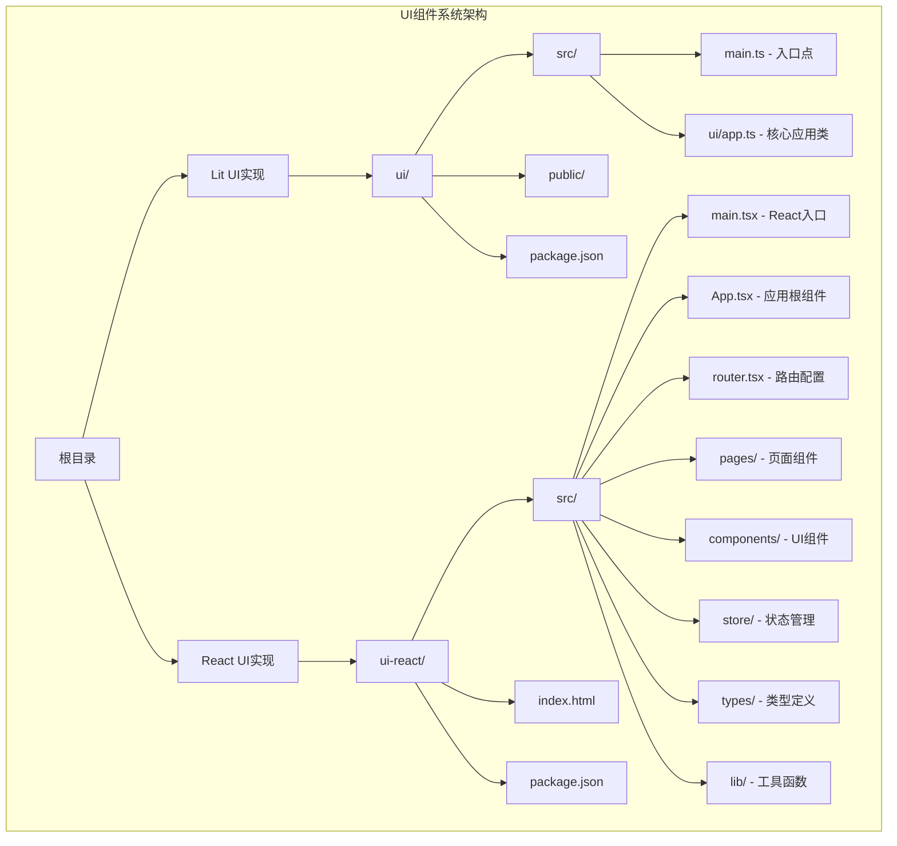

**图表来源**

- [main.ts:1-3](file://ui/src/main.ts#L1-L3)
- [main.tsx:1-11](file://ui-react/src/main.tsx#L1-L11)
- [router.tsx:1-42](file://ui-react/src/router.tsx#L1-L42)

**章节来源**

- [README.md:185-212](file://README.md#L185-L212)
- [package.json:1-28](file://ui/package.json#L1-L28)
- [package.json:1-57](file://ui-react/package.json#L1-L57)

## 核心组件

### Lit UI核心组件

OpenClawApp是Lit框架实现的核心应用组件，负责管理整个UI的状态和生命周期：

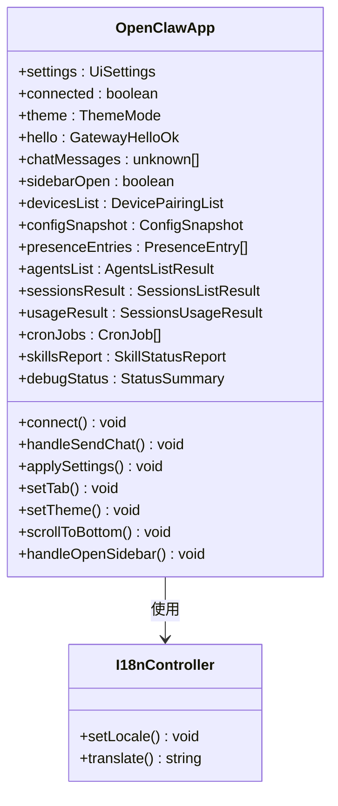

**图表来源**

- [app.ts:110-630](file://ui/src/ui/app.ts#L110-L630)

### React UI核心组件

React实现采用了现代化的组件架构，使用Zustand进行状态管理，**新增了完整的技能管理系统**：

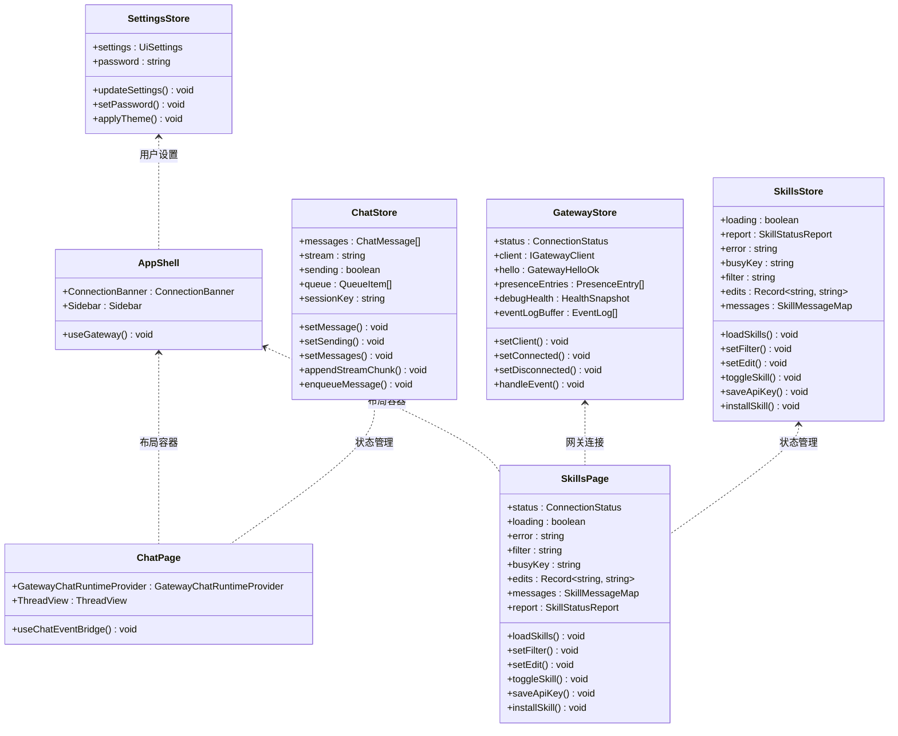

**图表来源**

- [chat.store.ts:135-230](file://ui-react/src/store/chat.store.ts#L135-L230)
- [skills.store.ts:16-32](file://ui-react/src/store/skills.store.ts#L16-L32)
- [gateway.store.ts:41-68](file://ui-react/src/store/gateway.store.ts#L41-L68)
- [settings.store.ts:193-200](file://ui-react/src/store/settings.store.ts#L193-L200)
- [AppShell.tsx:10-26](file://ui-react/src/components/layout/AppShell.tsx#L10-L26)
- [ChatPage.tsx:6-21](file://ui-react/src/pages/ChatPage.tsx#L6-L21)
- [SkillsPage.tsx:10-31](file://ui-react/src/pages/SkillsPage.tsx#L10-L31)

**章节来源**

- [app.ts:110-630](file://ui/src/ui/app.ts#L110-L630)
- [chat.store.ts:135-230](file://ui-react/src/store/chat.store.ts#L135-L230)
- [skills.store.ts:16-32](file://ui-react/src/store/skills.store.ts#L16-L32)

## 架构概览

UI组件系统采用分层架构设计，实现了清晰的关注点分离，**新增了技能管理的专门层次**：

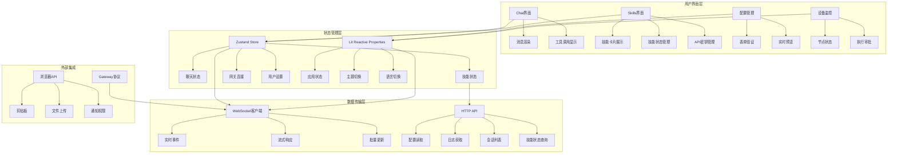

**图表来源**

- [app.ts:110-630](file://ui/src/ui/app.ts#L110-L630)
- [chat.store.ts:135-230](file://ui-react/src/store/chat.store.ts#L135-L230)
- [skills.store.ts:71-197](file://ui-react/src/store/skills.store.ts#L71-L197)

## 详细组件分析

### 聊天界面组件

#### Lit实现的聊天组件

聊天界面是UI系统的核心组件，负责处理用户与AI助手的交互：

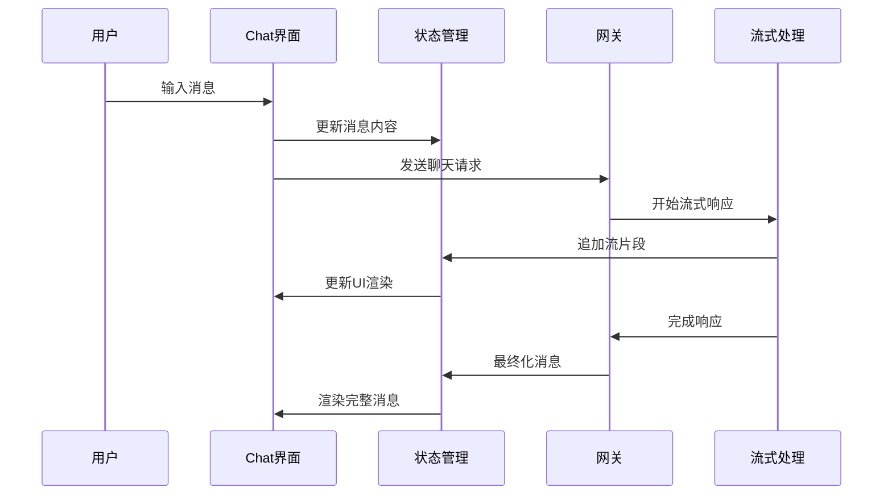

**图表来源**

- [app.ts:497-506](file://ui/src/ui/app.ts#L497-L506)
- [chat.store.ts:166-203](file://ui-react/src/store/chat.store.ts#L166-L203)

#### React实现的聊天组件

React版本采用了更现代的状态管理模式：

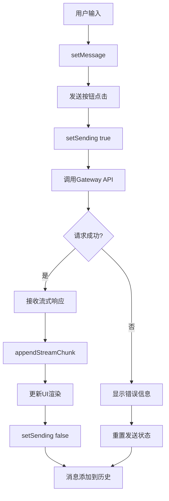

**图表来源**

- [ChatPage.tsx:6-21](file://ui-react/src/pages/ChatPage.tsx#L6-L21)
- [chat.store.ts:166-229](file://ui-react/src/store/chat.store.ts#L166-L229)

**章节来源**

- [app.ts:497-506](file://ui/src/ui/app.ts#L497-L506)
- [ChatPage.tsx:6-21](file://ui-react/src/pages/ChatPage.tsx#L6-L21)
- [chat.store.ts:166-229](file://ui-react/src/store/chat.store.ts#L166-L229)

### 技能管理系统

**新增** 技能管理系统是React UI实现的重要组成部分，提供了完整的技能生命周期管理功能：

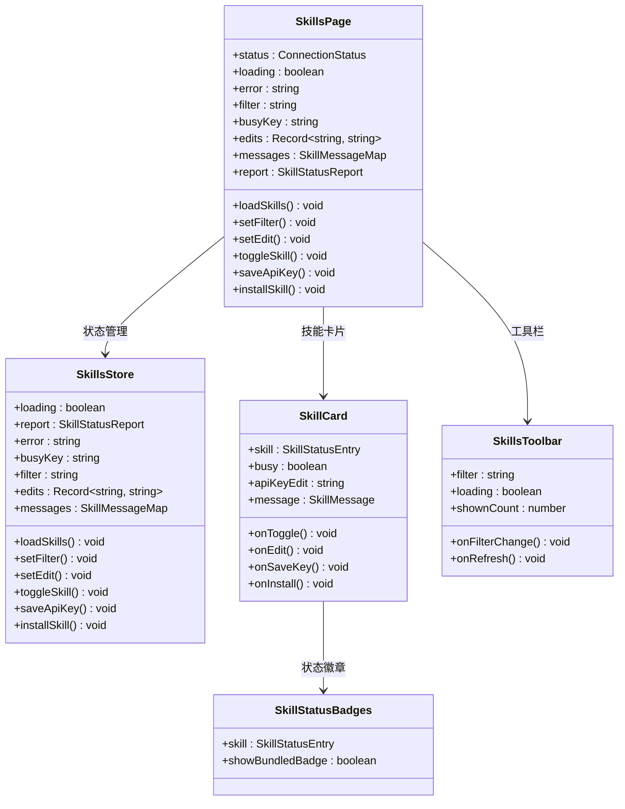

**图表来源**

- [SkillsPage.tsx:10-31](file://ui-react/src/pages/SkillsPage.tsx#L10-L31)
- [skills.store.ts:16-32](file://ui-react/src/store/skills.store.ts#L16-L32)
- [SkillCard.tsx:9-18](file://ui-react/src/components/skills/SkillCard.tsx#L9-L18)
- [SkillsToolbar.tsx:5-11](file://ui-react/src/components/skills/SkillsToolbar.tsx#L5-L11)
- [SkillStatusBadges.tsx:4-7](file://ui-react/src/components/skills/SkillStatusBadges.tsx#L4-L7)

#### 技能状态管理流程

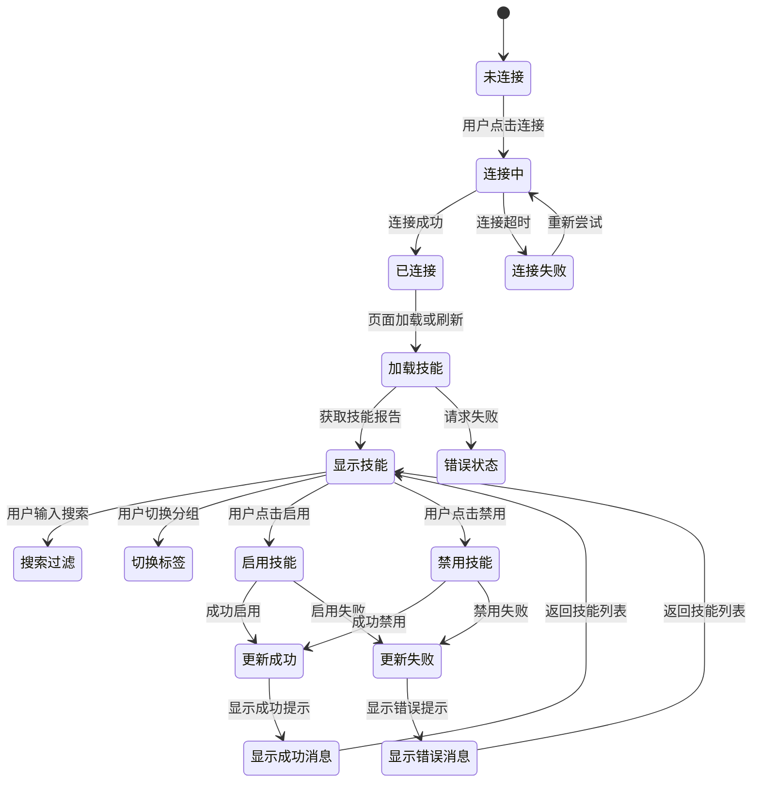

**图表来源**

- [skills.store.ts:80-105](file://ui-react/src/store/skills.store.ts#L80-L105)
- [skills.store.ts:111-137](file://ui-react/src/store/skills.store.ts#L111-L137)
- [skills.store.ts:139-165](file://ui-react/src/store/skills.store.ts#L139-L165)

#### 技能分组和筛选

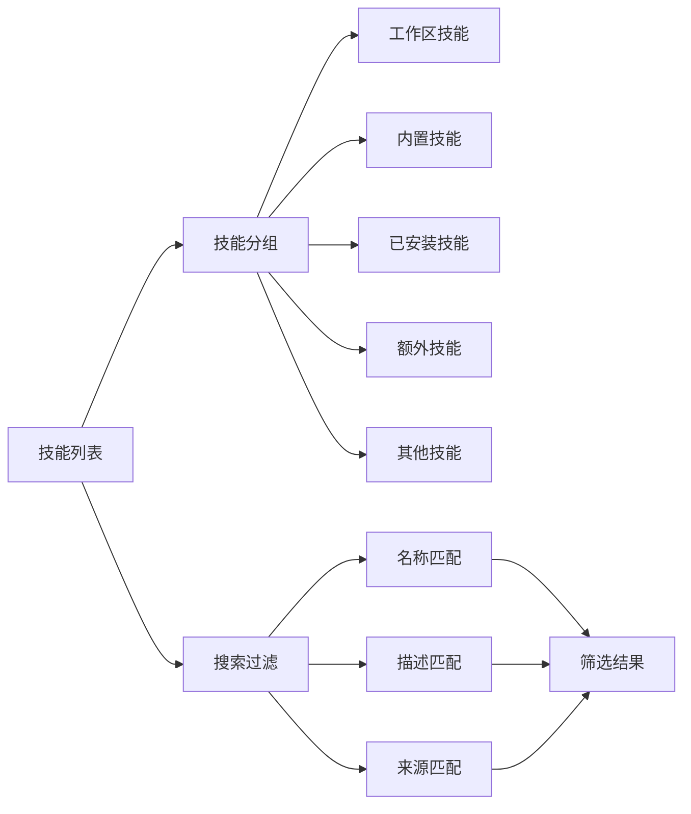

**图表来源**

- [skills-grouping.ts:16-42](file://ui-react/src/lib/skills-grouping.ts#L16-L42)
- [SkillsPage.tsx:31-42](file://ui-react/src/pages/SkillsPage.tsx#L31-L42)

**章节来源**

- [SkillsPage.tsx:10-31](file://ui-react/src/pages/SkillsPage.tsx#L10-L31)
- [skills.store.ts:16-32](file://ui-react/src/store/skills.store.ts#L16-L32)
- [SkillCard.tsx:9-18](file://ui-react/src/components/skills/SkillCard.tsx#L9-L18)
- [SkillsToolbar.tsx:5-11](file://ui-react/src/components/skills/SkillsToolbar.tsx#L5-L11)
- [SkillStatusBadges.tsx:4-7](file://ui-react/src/components/skills/SkillStatusBadges.tsx#L4-L7)
- [skills-grouping.ts:16-42](file://ui-react/src/lib/skills-grouping.ts#L16-L42)

### 配置管理系统

配置管理界面提供了对OpenClaw系统的全面控制：

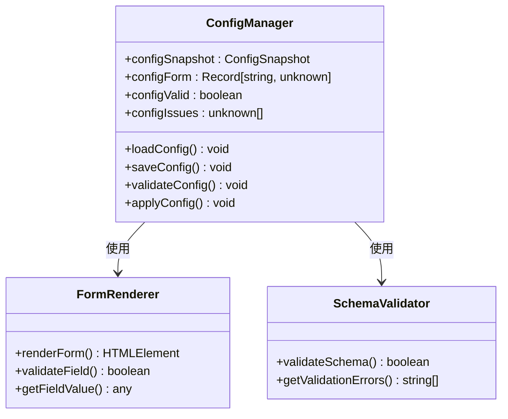

**图表来源**

- [app.ts:183-204](file://ui/src/ui/app.ts#L183-L204)

### 设备监控组件

设备监控功能允许用户管理连接的设备和节点：

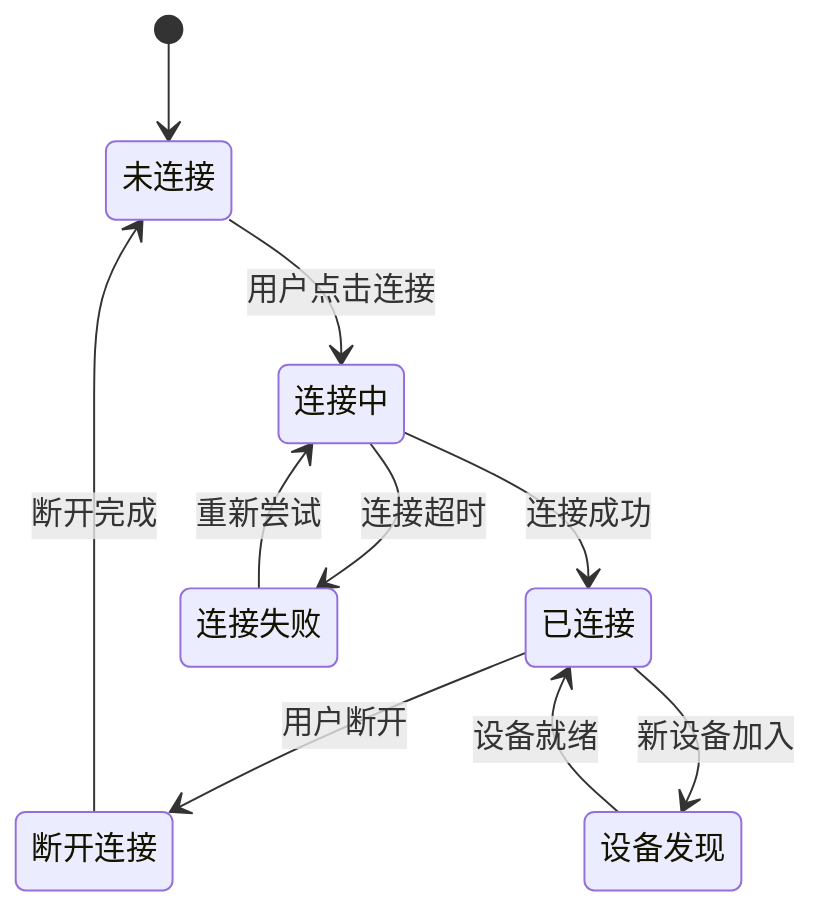

**图表来源**

- [app.ts:164-179](file://ui/src/ui/app.ts#L164-L179)

**章节来源**

- [app.ts:183-204](file://ui/src/ui/app.ts#L183-L204)
- [app.ts:164-179](file://ui/src/ui/app.ts#L164-L179)

## 依赖关系分析

### 依赖图谱

```mermaid
graph TB
subgraph "Lit UI依赖"
A[lit] --> B[Web Components]
C[@lit-labs/signals] --> D[响应式信号]
E[marked] --> F[Markdown渲染]
G[dompurify] --> H[HTML清理]
end
subgraph "React UI依赖"
I[react] --> J[JSX渲染]
K[zustand] --> L[状态管理]
M[react-router] --> N[路由管理]
O[@assistant-ui/react] --> P[AI聊天组件]
Q[radix-ui/react-*] --> R[基础UI组件]
S[lucide-react] --> T[图标库]
U[技能管理] --> V[技能状态]
U --> W[技能分组]
U --> X[技能工具栏]
end
subgraph "开发工具"
Y[vite] --> Z[构建工具]
AA[typescript] --> BB[类型检查]
CC[vitest] --> DD[测试框架]
end
```

**图表来源**

- [package.json:11-26](file://ui/package.json#L11-L26)
- [package.json:11-55](file://ui-react/package.json#L11-L55)

### 版本兼容性

两个UI实现都保持了良好的向后兼容性：

| 功能模块 | Lit实现     | React实现   | 兼容性      |
| -------- | ----------- | ----------- | ----------- |
| 聊天界面 | ✅ 完全支持 | ✅ 完全支持 | ✅ 高度相似 |
| 配置管理 | ✅ 基础支持 | ✅ 增强支持 | ✅ 功能相当 |
| 设备监控 | ✅ 基础支持 | ✅ 增强支持 | ✅ 功能相当 |
| 日志查看 | ✅ 基础支持 | ✅ 增强支持 | ✅ 功能相当 |
| 技能管理 | ❌ 不支持   | ✅ 完全支持 | ✅ 新功能   |
| 主题切换 | ✅ 支持     | ✅ 支持     | ✅ 功能相同 |
| 国际化   | ✅ 支持     | ✅ 支持     | ✅ 功能相同 |

**章节来源**

- [package.json:11-26](file://ui/package.json#L11-L26)
- [package.json:11-55](file://ui-react/package.json#L11-L55)

## 性能考虑

### 渲染优化策略

1. **虚拟滚动**：对于大量日志和会话列表，使用虚拟滚动技术减少DOM节点数量
2. **懒加载组件**：按需加载重型组件，如图表和大型表格
3. **状态分片**：将大对象拆分为小的独立状态，避免不必要的重渲染
4. **流式更新**：聊天消息采用流式渲染，提供更好的用户体验
5. **技能分组缓存**：技能列表的分组和筛选结果进行缓存，避免重复计算

### 内存管理

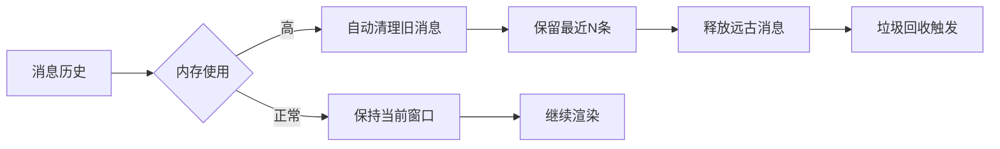

### 网络优化

- **连接池管理**：复用WebSocket连接，减少连接开销
- **批量请求**：合并多个小请求为批量请求
- **缓存策略**：对静态资源和配置数据实施智能缓存
- **技能状态缓存**：技能状态和报告进行本地缓存，减少网络请求

## 故障排除指南

### 常见问题诊断

1. **连接问题**
   - 检查网关URL和认证令牌
   - 验证防火墙和代理设置
   - 查看WebSocket连接状态

2. **渲染问题**
   - 检查浏览器控制台错误
   - 验证CSS样式加载
   - 确认JavaScript执行环境

3. **性能问题**
   - 监控内存使用情况
   - 检查渲染帧率
   - 分析网络请求时间

4. **技能管理问题**
   - 检查技能API密钥是否正确
   - 验证技能安装依赖是否满足
   - 查看技能状态报告中的错误信息

### 调试工具

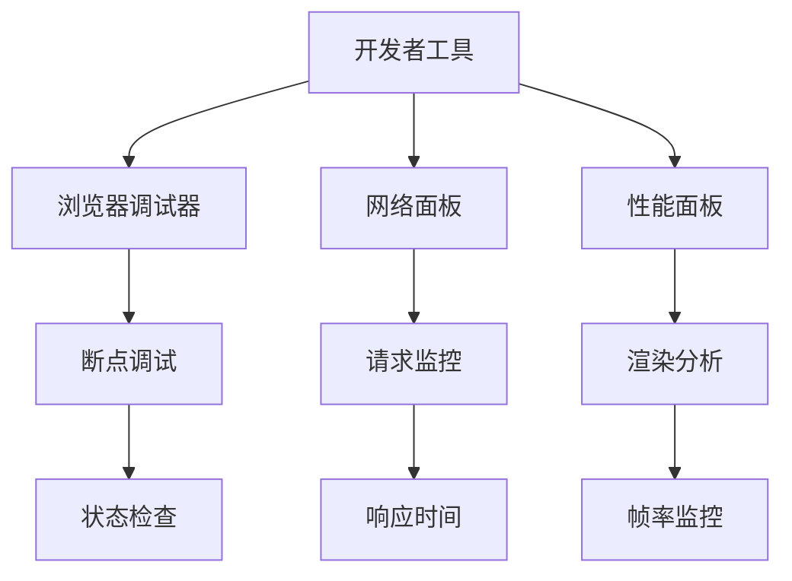

**章节来源**

- [app.ts:129-131](file://ui/src/ui/app.ts#L129-L131)

## 结论

OpenClaw的UI组件系统展现了现代前端开发的最佳实践，通过双框架架构实现了：

1. **技术多样性**：同时支持Lit和React两种主流框架
2. **功能完整性**：覆盖聊天、配置、监控、**技能管理**等核心功能
3. **性能优化**：采用多种优化策略确保流畅体验，包括技能状态缓存
4. **可维护性**：清晰的架构设计便于长期维护

**新增的React技能管理系统**提供了完整的技能生命周期管理，包括技能安装、启用/禁用、API密钥管理和状态监控等功能，为用户提供了强大的技能管理能力。这个系统与现有的聊天和配置管理功能无缝集成，形成了一个完整的AI助手管理平台。

这种设计既满足了现有功能需求，又为未来的功能扩展和技术演进奠定了坚实基础。两个UI实现的并行存在为用户提供了选择空间，同时也降低了迁移风险。技能管理系统的引入进一步增强了OpenClaw平台的功能性和实用性。
