# UI组件系统

<cite>
**本文档引用的文件**
- [README.md](file://README.md)
- [package.json](file://ui/package.json)
- [main.ts](file://ui/src/main.ts)
- [app.ts](file://ui/src/ui/app.ts)
- [app-invite-code.ts](file://ui/src/ui/app-invite-code.ts)
- [invite-code-client.ts](file://ui/src/ui/invite-code-client.ts)
- [app-render.ts](file://ui/src/ui/app-render.ts)
- [app-view-state.ts](file://ui/src/ui/app-view-state.ts)
- [profile.ts](file://ui/src/ui/views/profile.ts)
- [package.json](file://ui-react/package.json)
- [main.tsx](file://ui-react/src/main.tsx)
- [App.tsx](file://ui-react/src/App.tsx)
- [router.tsx](file://ui-react/src/router.tsx)
- [ChatPage.tsx](file://ui-react/src/pages/ChatPage.tsx)
- [SkillsPage.tsx](file://ui-react/src/pages/SkillsPage.tsx)
- [AppShell.tsx](file://ui-react/src/components/layout/AppShell.tsx)
- [Sidebar.tsx](file://ui-react/src/components/layout/Sidebar.tsx)
- [ChatSidebar.tsx](file://ui-react/src/components/chat/ChatSidebar.tsx)
- [SkillCard.tsx](file://ui-react/src/components/skills/SkillCard.tsx)
- [SkillsToolbar.tsx](file://ui-react/src/components/skills/SkillsToolbar.tsx)
- [SkillStatusBadges.tsx](file://ui-react/src/components/skills/SkillStatusBadges.tsx)
- [sidebar.tsx](file://ui-react/src/components/ui/sidebar.tsx)
- [checkbox.tsx](file://ui-react/src/components/ui/checkbox.tsx)
- [sheet.tsx](file://ui-react/src/components/ui/sheet.tsx)
- [switch.tsx](file://ui-react/src/components/ui/switch.tsx)
- [sonner.tsx](file://ui-react/src/components/ui/sonner.tsx)
- [button.tsx](file://ui-react/src/components/ui/button.tsx)
- [calendar.tsx](file://ui-react/src/components/ui/calendar.tsx)
- [use-mobile.ts](file://ui-react/src/hooks/use-mobile.ts)
- [useSessionManager.ts](file://ui-react/src/hooks/useSessionManager.ts)
- [components.json](file://ui-react/components.json)
- [chat.store.ts](file://ui-react/src/store/chat.store.ts)
- [skills.store.ts](file://ui-react/src/store/skills.store.ts)
- [gateway.store.ts](file://ui-react/src/store/gateway.store.ts)
- [settings.store.ts](file://ui-react/src/store/settings.store.ts)
- [skills.ts](file://ui-react/src/types/skills.ts)
- [skills-grouping.ts](file://ui-react/src/lib/skills-grouping.ts)
- [useChatEventBridge.ts](file://ui-react/src/hooks/useChatEventBridge.ts)
- [ThreadView.tsx](file://ui-react/src/components/chat/ThreadView.tsx)
- [Composer.tsx](file://ui-react/src/components/chat/Composer.tsx)
- [UserMessage.tsx](file://ui-react/src/components/chat/UserMessage.tsx)
- [AssistantMessage.tsx](file://ui-react/src/components/chat/AssistantMessage.tsx)
- [AddSkillDialog.tsx](file://ui-react/src/components/skills/AddSkillDialog.tsx)
- [relative-time.ts](file://ui-react/src/lib/relative-time.ts)
- [AgentSessionList.tsx](file://ui-react/src/components/chat/AgentSessionList.tsx)
- [ChannelDetail.tsx](file://ui-react/src/components/channels/ChannelDetail.tsx)
- [AccountCardList.tsx](file://ui-react/src/components/channels/shared/AccountCardList.tsx)
- [CronPage.tsx](file://ui-react/src/pages/CronPage.tsx)
- [session.md](file://docs/concepts/session.md)
- [session-management-compaction.md](file://docs/reference/session-management-compaction.md)
- [storage.ts](file://ui/src/ui/storage.ts)
- [token.ts](file://apps/electron/src/main/token.ts)
- [window.ts](file://apps/electron/src/main/window.ts)
- [gateway.ts](file://apps/electron/src/main/gateway.ts)
- [navigation.ts](file://ui/src/ui/navigation.ts)
- [profile.ts](file://ui/src/ui/views/profile.ts)
- [en.ts](file://ui/src/i18n/locales/en.ts)
- [gateway.ts](file://ui-react/src/types/gateway.ts)
- [tabs.ts](file://ui-react/src/lib/tabs.ts)
- [invite-code-api-design.md](file://docs/features/invite-code-api-design.md)
- [index.css](file://ui-react/src/index.css)
- [ToolCallGroup.tsx](file://ui-react/src/components/chat/ToolCallGroup.tsx)
- [ToolFallback.tsx](file://ui-react/src/components/chat/ToolFallback.tsx)
- [markdown-components.tsx](file://ui-react/src/components/chat/markdown-components.tsx)
- [PluginCard.tsx](file://ui-react/src/components/plugins/PluginCard.tsx)
- [PluginDetailDialog.tsx](file://ui-react/src/components/plugins/PluginDetailDialog.tsx)
- [PluginsPage.tsx](file://ui-react/src/pages/PluginsPage.tsx)
- [xhs_evidence_builder.mjs](file://skills/travel-planner/scripts/xhs_evidence_builder.mjs)
- [route_selector.mjs](file://skills/travel-planner/scripts/route_selector.mjs)
- [travel-planner-skill.test.ts](file://test/travel-planner-skill.test.ts)
- [shared.tsx](file://ui-react/src/components/agents/shared.tsx)
- [card.tsx](file://ui-react/src/components/agents/card.tsx)
- [detail-drawer.tsx](file://ui-react/src/components/agents/detail-drawer.tsx)
- [profile.tsx](file://ui-react/src/components/agents/profile.tsx)
- [skills.tsx](file://ui-react/src/components/agents/skills.tsx)
- [tools.tsx](file://ui-react/src/components/agents/tools.tsx)
- [soul.tsx](file://ui-react/src/components/agents/soul.tsx)
</cite>

## 更新摘要
**所做更改**
- 新增SectionCard组件样式改进，提供统一的卡片容器样式
- 优化AppleToggle组件，实现苹果风格的开关控件
- 增强Agent管理界面的组件系统，包括AgentCard、ProfileHeroSection等
- 优化Skills和Tools组件的样式一致性
- 新增AgentDetailDrawer组件，提供完整的代理详情展示
- 改进SoulSection组件的编辑和预览功能

## 目录
1. [简介](#简介)
2. [项目结构](#项目结构)
3. [核心组件](#核心组件)
4. [架构概览](#架构概览)
5. [详细组件分析](#详细组件分析)
6. [依赖关系分析](#依赖关系分析)
7. [性能考虑](#性能考虑)
8. [故障排除指南](#故障排除指南)
9. [结论](#结论)

## 简介

OpenClaw的UI组件系统经过重大架构升级，现已完全现代化为基于React 19的双框架架构。系统采用shadcn/ui设计系统、Radix UI组件库和Zustand状态管理，提供了现代化的用户界面体验。

**重大架构变化包括**：
- **全新的聊天界面布局**：采用assistant-ui/react框架，提供流式聊天体验
- **重构的技能管理对话框**：引入AddSkillDialog组件，支持URL和文件导入
- **现代化的组件系统**：基于shadcn/ui设计系统，提供统一的UI组件库
- **新增Sonner Toast通知系统**：集成主题化通知、自定义图标和Next.js主题系统
- **增强的Sidebar组件**：支持响应式布局、键盘快捷键和多种变体
- **优化的聊天事件桥接**：支持复杂的工具调用和流式处理
- **新增相对时间格式化系统**：提供本地化的相对时间显示，支持多语言环境
- **新增ToolCallGroup和ToolFallback组件**：专门用于处理Xiaohongshu证据收集和路由确认步骤的工具调用可视化
- **简化组件库结构**：删除button.tsx和calendar.tsx组件，移除不常用的日期选择功能
- **插件系统UI简化**：移除PluginCard中的PackageIcon，优化插件管理界面
- **新增SectionCard组件**：提供统一的卡片容器样式，支持自定义类名
- **优化AppleToggle组件**：实现苹果风格的开关控件，支持禁用状态和动画效果
- **增强Agent管理界面**：新增AgentCard、ProfileHeroSection、AgentDetailDrawer等组件
- **改进Skills和Tools组件**：统一样式设计，提升用户体验一致性

该系统支持实时聊天界面、配置管理、节点监控、日志查看等多种功能，通过WebSocket与OpenClaw网关进行通信。现代化的架构显著提升了用户体验和开发效率。

## 项目结构

UI组件系统采用现代化的双框架架构，React实现已完全迁移到shadcn/ui设计系统：

```mermaid
graph TB
subgraph "现代化UI架构"
A[根目录] --> B[Lit UI实现]
A --> C[React UI实现 - 现代化]
B --> D[ui/ - 传统实现]
C --> E[ui-react/ - 现代化实现]
D --> F[src/ - 传统组件]
D --> G[public/ - 静态资源]
D --> H[package.json - 传统依赖]
E --> I[src/ - 现代组件]
E --> J[index.html - 应用入口]
E --> K[package.json - 现代依赖]
I --> L[main.tsx - React入口]
I --> M[App.tsx - 应用根组件]
I --> N[router.tsx - 路由配置]
I --> O[pages/ - 页面组件]
I --> P[components/ - UI组件]
I --> Q[store/ - Zustand状态管理]
I --> R[types/ - TypeScript类型]
I --> S[lib/ - 工具函数]
I --> T[hooks/ - 自定义Hook]
P --> U[layout/ - 布局组件]
P --> V[chat/ - 聊天组件]
P --> W[skills/ - 技能组件]
P --> X[plugins/ - 插件组件]
P --> Y[ui/ - shadcn/ui组件库]
P --> Z[sonner.tsx - Sonner通知系统]
P --> AA[relative-time.ts - 相对时间格式化]
P --> BB[ToolCallGroup.tsx - 工具调用分组组件]
P --> CC[ToolFallback.tsx - 工具调用回退组件]
P --> DD[agents/ - 代理管理组件]
V --> SS[ThreadView.tsx - 聊天线程]
V --> TT[Composer.tsx - 消息Composer]
V --> UU[UserMessage.tsx - 用户消息]
V --> VV[AssistantMessage.tsx - 助手消息]
V --> WW[AgentSessionList.tsx - 代理会话列表]
V --> BB[ToolCallGroup.tsx - 工具调用分组]
V --> CC[ToolFallback.tsx - 工具调用回退]
W --> XX[SkillCard.tsx - 技能卡片]
W --> YY[SkillsToolbar.tsx - 技能工具栏]
W --> ZZ[AddSkillDialog.tsx - 技能导入对话框]
X --> DD[PluginCard.tsx - 插件卡片]
X --> EE[PluginDetailDialog.tsx - 插件详情对话框]
X --> FF[PluginsPage.tsx - 插件页面]
Y --> GG[accordion.tsx - 手风琴组件]
Y --> HH[alert-dialog.tsx - 警告对话框]
Y --> II[alert.tsx - 警告组件]
Y --> JJ[avatar.tsx - 头像组件]
Y --> KK[badge.tsx - 徽章组件]
Y --> LL[button.tsx - 按钮组件]
Y --> MM[card.tsx - 卡片组件]
Y --> NN[chart.tsx - 图表组件]
Y --> OO[checkbox.tsx - 复选框组件]
Y --> PP[collapsible.tsx - 可折叠组件]
Y --> QQ[dialog.tsx - 对话框组件]
Y --> RR[drawer.tsx - 抽屉组件]
Y --> SS[dropdown-menu.tsx - 下拉菜单]
Y --> TT[input.tsx - 输入框组件]
Y --> UU[label.tsx - 标签组件]
Y --> VV[popover.tsx - 弹出框组件]
Y --> WW[scroll-area.tsx - 滚动区域]
Y --> XX[select.tsx - 选择器组件]
Y --> YY[separator.tsx - 分隔符组件]
Y --> ZZ[sheet.tsx - 表格组件]
Y --> AA[sidebar.tsx - 侧边栏组件]
Y --> BB[skeleton.tsx - 骨架屏组件]
Y --> CC[sonner.tsx - 通知组件]
Y --> DD[switch.tsx - 开关组件]
Y --> EE[tabs.tsx - 标签页组件]
Y --> FF[tooltip.tsx - 工具提示组件]
DD --> GG[shared.tsx - 通用组件]
DD --> HH[card.tsx - 代理卡片]
DD --> II[detail-drawer.tsx - 代理详情抽屉]
DD --> JJ[profile.tsx - 代理档案]
DD --> KK[skills.tsx - 技能管理]
DD --> LL[tools.tsx - 工具管理]
DD --> MM[soul.tsx - 灵魂管理]
GG --> NN[SectionCard - 卡片容器]
GG --> OO[AppleToggle - 苹果开关]
GG --> PP[DialogSearchInput - 搜索输入]
GG --> QQ[CategoryPills - 分类标签]
ZZ --> AAA[formatDistanceToNow - 相对时间格式化]
ZZ --> BBB[relativeTime - 时间显示函数]
```

**图表来源**
- [main.ts:1-3](file://ui/src/main.ts#L1-L3)
- [main.tsx:1-11](file://ui-react/src/main.tsx#L1-L11)
- [router.tsx:1-42](file://ui-react/src/router.tsx#L1-L42)
- [sidebar.tsx:1-694](file://ui-react/src/components/ui/sidebar.tsx#L1-L694)
- [sonner.tsx:1-39](file://ui-react/src/components/ui/sonner.tsx#L1-L39)
- [relative-time.ts:1-46](file://ui-react/src/lib/relative-time.ts#L1-L46)
- [use-mobile.ts:1-20](file://ui-react/src/hooks/use-mobile.ts#L1-L20)
- [useSessionManager.ts:1-139](file://ui-react/src/hooks/useSessionManager.ts#L1-L139)
- [useChatEventBridge.ts:1-570](file://ui-react/src/hooks/useChatEventBridge.ts#L1-L570)
- [chat.store.ts:1-250](file://ui-react/src/store/chat.store.ts#L1-L250)
- [skills.store.ts:1-312](file://ui-react/src/store/skills.store.ts#L1-L312)
- [AppShell.tsx:1-96](file://ui-react/src/components/layout/AppShell.tsx#L1-L96)
- [ChatPage.tsx:1-23](file://ui-react/src/pages/ChatPage.tsx#L1-L23)
- [SkillsPage.tsx:1-332](file://ui-react/src/pages/SkillsPage.tsx#L1-L332)
- [ThreadView.tsx:1-82](file://ui-react/src/components/chat/ThreadView.tsx#L1-L82)
- [Composer.tsx:1-90](file://ui-react/src/components/chat/Composer.tsx#L1-L90)
- [SkillCard.tsx:1-320](file://ui-react/src/components/skills/SkillCard.tsx#L1-L320)
- [AddSkillDialog.tsx:1-305](file://ui-react/src/components/skills/AddSkillDialog.tsx#L1-L305)
- [AgentSessionList.tsx:1-244](file://ui-react/src/components/chat/AgentSessionList.tsx#L1-L244)
- [ChannelDetail.tsx:1-170](file://ui-react/src/components/channels/ChannelDetail.tsx#L1-L170)
- [AccountCardList.tsx:1-84](file://ui-react/src/components/channels/shared/AccountCardList.tsx#L1-L84)
- [CronPage.tsx:1-184](file://ui-react/src/pages/CronPage.tsx#L1-L184)
- [ToolCallGroup.tsx:1-274](file://ui-react/src/components/chat/ToolCallGroup.tsx#L1-L274)
- [ToolFallback.tsx:1-532](file://ui-react/src/components/chat/ToolFallback.tsx#L1-L532)
- [PluginCard.tsx:1-231](file://ui-react/src/components/plugins/PluginCard.tsx#L1-L231)
- [PluginDetailDialog.tsx:1-185](file://ui-react/src/components/plugins/PluginDetailDialog.tsx#L1-L185)
- [PluginsPage.tsx:1-109](file://ui-react/src/pages/PluginsPage.tsx#L1-L109)
- [shared.tsx:1-103](file://ui-react/src/components/agents/shared.tsx#L1-L103)
- [card.tsx:1-59](file://ui-react/src/components/agents/card.tsx#L1-L59)
- [detail-drawer.tsx:1-156](file://ui-react/src/components/agents/detail-drawer.tsx#L1-L156)
- [profile.tsx:1-483](file://ui-react/src/components/agents/profile.tsx#L1-L483)
- [skills.tsx:1-348](file://ui-react/src/components/agents/skills.tsx#L1-L348)
- [tools.tsx:1-554](file://ui-react/src/components/agents/tools.tsx#L1-L554)
- [soul.tsx:1-168](file://ui-react/src/components/agents/soul.tsx#L1-L168)

**章节来源**
- [README.md:185-212](file://README.md#L185-L212)
- [package.json:1-28](file://ui/package.json#L1-L28)
- [package.json:1-57](file://ui-react/package.json#L1-L57)

## 核心组件

### 现代化的React UI核心组件

React实现已完全迁移到shadcn/ui设计系统，采用了现代化的组件架构，使用Zustand进行状态管理：

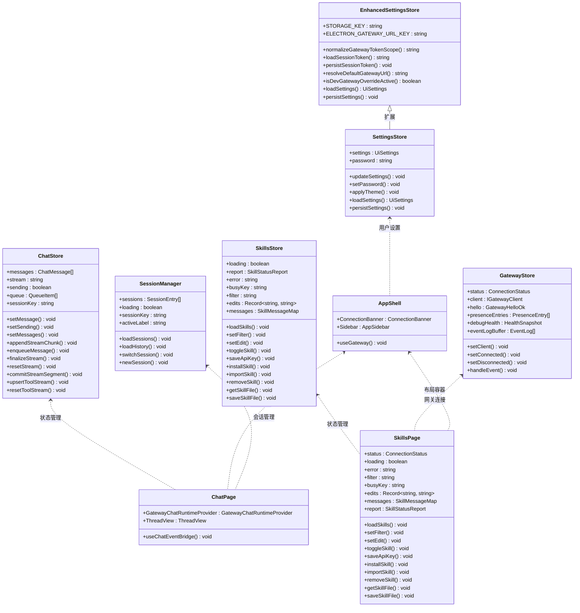
```mermaid
classDiagram
class ChatStore {
+messages : ChatMessage[]
+stream : string
+sending : boolean
+queue : QueueItem[]
+sessionKey : string
+setMessage() void
+setSending() void
+setMessages() void
+appendStreamChunk() void
+enqueueMessage() void
+finalizeStream() void
+resetStream() void
+commitStreamSegment() void
+upsertToolStream() void
+resetToolStream() void
}
class SkillsStore {
+loading : boolean
+report : SkillStatusReport
+error : string
+busyKey : string
+filter : string
+edits : Record~string, string~
+messages : SkillMessageMap
+loadSkills() void
+setFilter() void
+setEdit() void
+toggleSkill() void
+saveApiKey() void
+installSkill() void
+importSkill() void
+removeSkill() void
+getSkillFile() void
+saveSkillFile() void
}
class GatewayStore {
+status : ConnectionStatus
+client : IGatewayClient
+hello : GatewayHelloOk
+presenceEntries : PresenceEntry[]
+debugHealth : HealthSnapshot
+eventLogBuffer : EventLog[]
+setClient() void
+setConnected() void
+setDisconnected() void
+handleEvent() void
}
class SettingsStore {
+settings : UiSettings
+password : string
+updateSettings() void
+setPassword() void
+applyTheme() void
+loadSettings() UiSettings
+persistSettings() void
}
class AppShell {
+useGateway() void
+ConnectionBanner : ConnectionBanner
+Sidebar : AppSidebar
}
class ChatPage {
+useChatEventBridge() void
+GatewayChatRuntimeProvider : GatewayChatRuntimeProvider
+ThreadView : ThreadView
}
class SkillsPage {
+status : ConnectionStatus
+loading : boolean
+error : string
+filter : string
+busyKey : string
+edits : Record~string, string~
+messages : SkillMessageMap
+report : SkillStatusReport
+loadSkills() void
+setFilter() void
+setEdit() void
+toggleSkill() void
+saveApiKey() void
+installSkill() void
+importSkill() void
+removeSkill() void
+getSkillFile() void
+saveSkillFile() void
}
class SessionManager {
+sessions : SessionEntry[]
+loading : boolean
+sessionKey : string
+activeLabel : string
+loadSessions() void
+loadHistory() void
+switchSession() void
+newSession() void
}
class EnhancedSettingsStore {
+STORAGE_KEY : string
+ELECTRON_GATEWAY_URL_KEY : string
+normalizeGatewayTokenScope() string
+loadSessionToken() string
+persistSessionToken() void
+resolveDefaultGatewayUrl() string
+isDevGatewayOverrideActive() boolean
+loadSettings() UiSettings
+persistSettings() void
}
EnhancedSettingsStore <|-- SettingsStore : 扩展
ChatStore <.. ChatPage : 状态管理
SkillsStore <.. SkillsPage : 状态管理
GatewayStore <.. SkillsPage : 网关连接
SettingsStore <.. AppShell : 用户设置
AppShell <.. ChatPage : 布局容器
AppShell <.. SkillsPage : 布局容器
SessionManager <.. ChatPage : 会话管理
```

**图表来源**
- [chat.store.ts:135-230](file://ui-react/src/store/chat.store.ts#L135-L230)
- [skills.store.ts:16-32](file://ui-react/src/store/skills.store.ts#L16-L32)
- [gateway.store.ts:41-68](file://ui-react/src/store/gateway.store.ts#L41-L68)
- [settings.store.ts:193-200](file://ui-react/src/store/settings.store.ts#L193-L200)
- [AppShell.tsx:10-26](file://ui-react/src/components/layout/AppShell.tsx#L10-L26)
- [ChatPage.tsx:6-21](file://ui-react/src/pages/ChatPage.tsx#L6-L21)
- [SkillsPage.tsx:10-31](file://ui-react/src/pages/SkillsPage.tsx#L10-L31)
- [useSessionManager.ts:19-139](file://ui-react/src/hooks/useSessionManager.ts#L19-L139)
- [settings.store.ts:1-295](file://ui-react/src/store/settings.store.ts#L1-L295)

**章节来源**
- [chat.store.ts:135-230](file://ui-react/src/store/chat.store.ts#L135-L230)
- [skills.store.ts:16-32](file://ui-react/src/store/skills.store.ts#L16-L32)
- [useSessionManager.ts:19-139](file://ui-react/src/hooks/useSessionManager.ts#L19-L139)
- [settings.store.ts:1-295](file://ui-react/src/store/settings.store.ts#L1-L295)

### 现代化的Sidebar组件系统

**新增** 基于shadcn/ui设计系统的全新Sidebar组件，提供了响应式的侧边栏导航功能：

```mermaid
classDiagram
class Sidebar {
+side : "left" | "right"
+variant : "sidebar" | "floating" | "inset"
+collapsible : "offcanvas" | "icon" | "none"
+children : ReactNode
+render() ReactNode
}
class SidebarProvider {
+defaultOpen : boolean
+open : boolean
+openMobile : boolean
+state : "expanded" | "collapsed"
+togglSidebar() void
}
class SidebarTrigger {
+onClick : Function
+children : ReactNode
+render() ReactNode
}
class SidebarMenu {
+children : ReactNode
+className : string
+render() ReactNode
}
class SidebarMenuButton {
+asChild : boolean
+isActive : boolean
+variant : "default" | "outline"
+size : "default" | "sm" | "lg"
+tooltip : string | object
+render() ReactNode
}
Sidebar <|-- SidebarProvider : 组合
Sidebar <|-- SidebarTrigger : 组合
Sidebar <|-- SidebarMenu : 组合
SidebarMenu <|-- SidebarMenuButton : 组合
```

**图表来源**
- [sidebar.tsx:145-245](file://ui-react/src/components/ui/sidebar.tsx#L145-L245)
- [sidebar.tsx:50-143](file://ui-react/src/components/ui/sidebar.tsx#L50-L143)
- [sidebar.tsx:247-267](file://ui-react/src/components/ui/sidebar.tsx#L247-L267)
- [sidebar.tsx:432-524](file://ui-react/src/components/ui/sidebar.tsx#L432-L524)

#### Sidebar组件特性

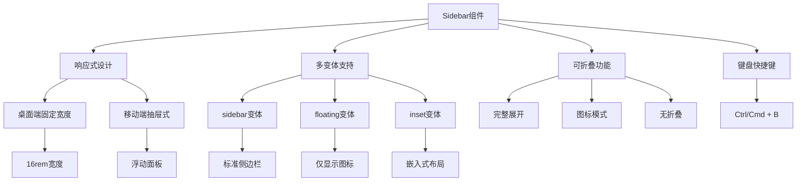
```mermaid
flowchart TD
A[Sidebar组件] --> B[响应式设计]
A --> C[多变体支持]
A --> D[可折叠功能]
A --> E[键盘快捷键]
B --> F[桌面端固定宽度]
B --> G[移动端抽屉式]
C --> H[sidebar变体]
C --> I[floating变体]
C --> J[inset变体]
D --> K[完整展开]
D --> L[图标模式]
D --> M[无折叠]
E --> N[Ctrl/Cmd + B]
F --> O[16rem宽度]
G --> P[浮动面板]
H --> Q[标准侧边栏]
I --> R[仅显示图标]
J --> S[嵌入式布局]
```

**图表来源**
- [sidebar.tsx:22-27](file://ui-react/src/components/ui/sidebar.tsx#L22-L27)
- [sidebar.tsx:145-245](file://ui-react/src/components/ui/sidebar.tsx#L145-L245)
- [sidebar.tsx:91-101](file://ui-react/src/components/ui/sidebar.tsx#L91-L101)

**章节来源**
- [sidebar.tsx:145-245](file://ui-react/src/components/ui/sidebar.tsx#L145-L245)
- [sidebar.tsx:50-143](file://ui-react/src/components/ui/sidebar.tsx#L50-L143)
- [sidebar.tsx:247-267](file://ui-react/src/components/ui/sidebar.tsx#L247-L267)
- [sidebar.tsx:432-524](file://ui-react/src/components/ui/sidebar.tsx#L432-L524)

### 现代化的聊天界面组件

**新增** 基于assistant-ui/react框架的全新聊天界面，提供了流式聊天体验：

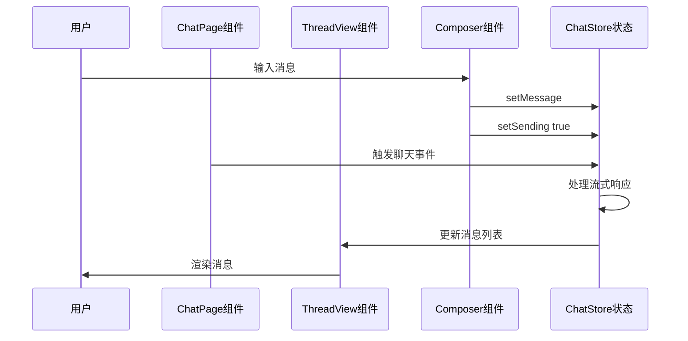
```mermaid
sequenceDiagram
participant User as 用户
participant ChatPage as ChatPage组件
participant ThreadView as ThreadView组件
participant Composer as Composer组件
participant ChatStore as ChatStore状态
User->>Composer : 输入消息
Composer->>ChatStore : setMessage
Composer->>ChatStore : setSending true
ChatPage->>ChatStore : 触发聊天事件
ChatStore->>ChatStore : 处理流式响应
ChatStore->>ThreadView : 更新消息列表
ThreadView->>User : 渲染消息
```

**图表来源**
- [ChatPage.tsx:6-21](file://ui-react/src/pages/ChatPage.tsx#L6-L21)
- [ThreadView.tsx:15-49](file://ui-react/src/components/chat/ThreadView.tsx#L15-L49)
- [Composer.tsx:11-89](file://ui-react/src/components/chat/Composer.tsx#L11-L89)
- [chat.store.ts:136-250](file://ui-react/src/store/chat.store.ts#L136-L250)

#### 聊天事件桥接系统

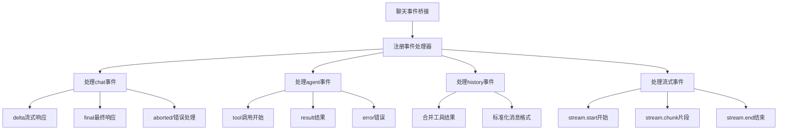
```mermaid
flowchart TD
A[聊天事件桥接] --> B[注册事件处理器]
B --> C[处理chat事件]
B --> D[处理agent事件]
B --> E[处理history事件]
B --> F[处理流式事件]
C --> G[delta流式响应]
C --> H[final最终响应]
C --> I[aborted/错误处理]
D --> J[tool调用开始]
D --> K[result结果]
D --> L[error错误]
E --> M[合并工具结果]
E --> N[标准化消息格式]
F --> O[stream.start开始]
F --> P[stream.chunk片段]
F --> Q[stream.end结束]
```

**图表来源**
- [useChatEventBridge.ts:352-569](file://ui-react/src/hooks/useChatEventBridge.ts#L352-L569)
- [chat.store.ts:8-19](file://ui-react/src/store/chat.store.ts#L8-L19)

**章节来源**
- [ChatPage.tsx:6-21](file://ui-react/src/pages/ChatPage.tsx#L6-L21)
- [ThreadView.tsx:15-49](file://ui-react/src/components/chat/ThreadView.tsx#L15-L49)
- [Composer.tsx:11-89](file://ui-react/src/components/chat/Composer.tsx#L11-L89)
- [chat.store.ts:136-250](file://ui-react/src/store/chat.store.ts#L136-L250)
- [useChatEventBridge.ts:352-569](file://ui-react/src/hooks/useChatEventBridge.ts#L352-L569)

### 现代化的技能管理组件

**新增** 完全重构的技能管理对话框，提供了直观的技能导入和管理功能：

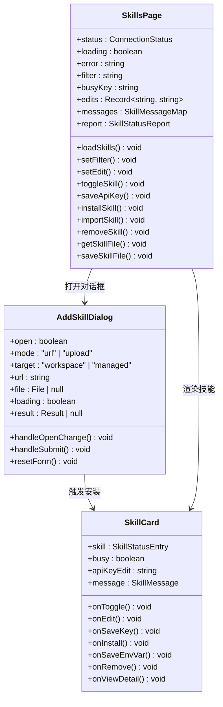
```mermaid
classDiagram
class AddSkillDialog {
+open : boolean
+mode : "url" | "upload"
+target : "workspace" | "managed"
+url : string
+file : File | null
+loading : boolean
+result : Result | null
+handleOpenChange() void
+handleSubmit() void
+resetForm() void
}
class SkillCard {
+skill : SkillStatusEntry
+busy : boolean
+apiKeyEdit : string
+message : SkillMessage
+onToggle() void
+onEdit() void
+onSaveKey() void
+onInstall() void
+onSaveEnvVar() void
+onRemove() void
+onViewDetail() void
}
class SkillsPage {
+status : ConnectionStatus
+loading : boolean
+error : string
+filter : string
+busyKey : string
+edits : Record~string, string~
+messages : SkillMessageMap
+report : SkillStatusReport
+loadSkills() void
+setFilter() void
+setEdit() void
+toggleSkill() void
+saveApiKey() void
+installSkill() void
+importSkill() void
+removeSkill() void
+getSkillFile() void
+saveSkillFile() void
}
AddSkillDialog --> SkillCard : 触发安装
SkillsPage --> SkillCard : 渲染技能
SkillsPage --> AddSkillDialog : 打开对话框
```

**图表来源**
- [AddSkillDialog.tsx:23-275](file://ui-react/src/components/skills/AddSkillDialog.tsx#L23-L275)
- [SkillCard.tsx:56-318](file://ui-react/src/components/skills/SkillCard.tsx#L56-L318)
- [SkillsPage.tsx:42-331](file://ui-react/src/pages/SkillsPage.tsx#L42-L331)

#### 技能导入流程

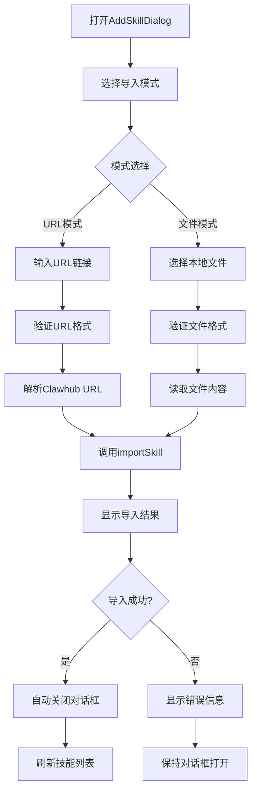
```mermaid
flowchart TD
A[打开AddSkillDialog] --> B[选择导入模式]
B --> C{模式选择}
C --> |URL模式| D[输入URL链接]
C --> |文件模式| E[选择本地文件]
D --> F[验证URL格式]
E --> G[验证文件格式]
F --> H[解析Clawhub URL]
G --> I[读取文件内容]
H --> J[调用importSkill]
I --> J
J --> K[显示导入结果]
K --> L{导入成功?}
L --> |是| M[自动关闭对话框]
L --> |否| N[显示错误信息]
M --> O[刷新技能列表]
N --> P[保持对话框打开]
```

**图表来源**
- [AddSkillDialog.tsx:64-111](file://ui-react/src/components/skills/AddSkillDialog.tsx#L64-L111)
- [AddSkillDialog.tsx:284-290](file://ui-react/src/components/skills/AddSkillDialog.tsx#L284-L290)
- [AddSkillDialog.tsx:292-304](file://ui-react/src/components/skills/AddSkillDialog.tsx#L292-L304)

**章节来源**
- [AddSkillDialog.tsx:23-275](file://ui-react/src/components/skills/AddSkillDialog.tsx#L23-L275)
- [SkillCard.tsx:56-318](file://ui-react/src/components/skills/SkillCard.tsx#L56-L318)
- [SkillsPage.tsx:42-331](file://ui-react/src/pages/SkillsPage.tsx#L42-L331)

### 现代化的Sonner Toast通知系统

**新增** 集成Sonner Toast通知系统，提供主题化通知、自定义图标和Next.js主题系统集成：

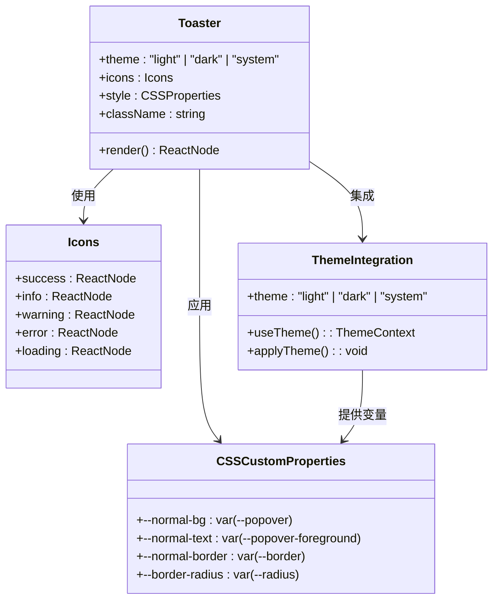
```mermaid
classDiagram
class Toaster {
+theme : "light" | "dark" | "system"
+icons : Icons
+style : CSSProperties
+className : string
+render() ReactNode
}
class Icons {
+success : ReactNode
+info : ReactNode
+warning : ReactNode
+error : ReactNode
+loading : ReactNode
}
class ThemeIntegration {
+useTheme() : ThemeContext
+theme : "light" | "dark" | "system"
+applyTheme() : void
}
class CSSCustomProperties {
+--normal-bg : var(--popover)
+--normal-text : var(--popover-foreground)
+--normal-border : var(--border)
+--border-radius : var(--radius)
}
Toaster --> Icons : 使用
Toaster --> ThemeIntegration : 集成
Toaster --> CSSCustomProperties : 应用
ThemeIntegration --> CSSCustomProperties : 提供变量
```

**图表来源**
- [sonner.tsx:11-36](file://ui-react/src/components/ui/sonner.tsx#L11-L36)
- [sonner.tsx:18-24](file://ui-react/src/components/ui/sonner.tsx#L18-L24)
- [sonner.tsx:25-32](file://ui-react/src/components/ui/sonner.tsx#L25-L32)

#### Sonner通知系统特性

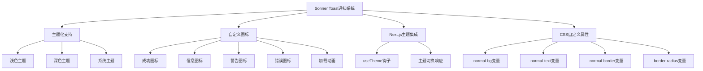
```mermaid
flowchart TD
A[Sonner Toast通知系统] --> B[主题化支持]
A --> C[自定义图标]
A --> D[Next.js主题集成]
A --> E[CSS自定义属性]
B --> F[浅色主题]
B --> G[深色主题]
B --> H[系统主题]
C --> I[成功图标]
C --> J[信息图标]
C --> K[警告图标]
C --> L[错误图标]
C --> M[加载动画]
D --> N[useTheme钩子]
D --> O[主题切换响应]
E --> P[--normal-bg变量]
E --> Q[--normal-text变量]
E --> R[--normal-border变量]
E --> S[--border-radius变量]
```

**图表来源**
- [sonner.tsx:12](file://ui-react/src/components/ui/sonner.tsx#L12)
- [sonner.tsx:18-24](file://ui-react/src/components/ui/sonner.tsx#L18-L24)
- [sonner.tsx:25-32](file://ui-react/src/components/ui/sonner.tsx#L25-L32)
- [index.css:25-31](file://ui-react/src/index.css#L25-L31)

**章节来源**
- [sonner.tsx:1-39](file://ui-react/src/components/ui/sonner.tsx#L1-L39)
- [package.json:48](file://ui-react/package.json#L48)
- [index.css:25-31](file://ui-react/src/index.css#L25-L31)

### 现代化的相对时间格式化系统

**新增** 完整的相对时间格式化系统，提供本地化的相对时间显示：

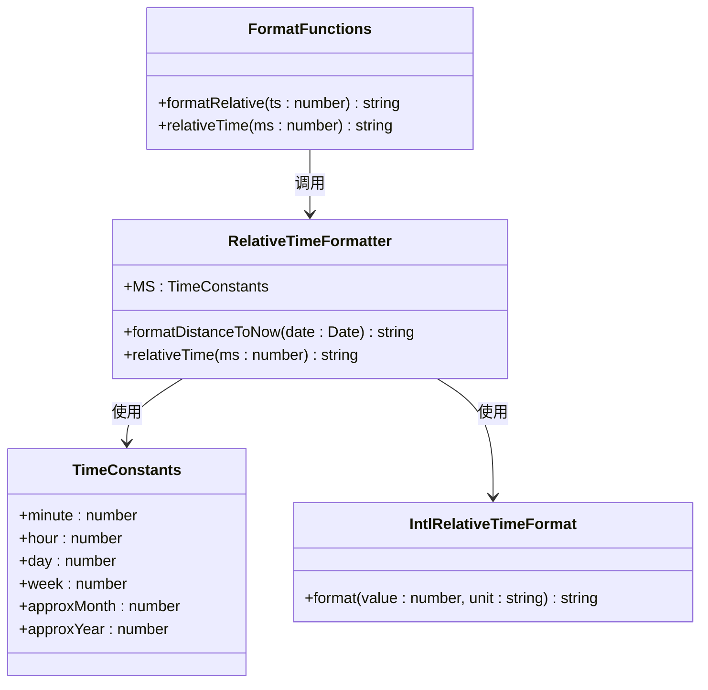
```mermaid
classDiagram
class RelativeTimeFormatter {
+formatDistanceToNow(date : Date) string
+relativeTime(ms : number) string
+MS : TimeConstants
}
class TimeConstants {
+minute : number
+hour : number
+day : number
+week : number
+approxMonth : number
+approxYear : number
}
class IntlRelativeTimeFormat {
+format(value : number, unit : string) string
}
class FormatFunctions {
+formatRelative(ts : number) string
+relativeTime(ms : number) string
}
RelativeTimeFormatter --> TimeConstants : 使用
RelativeTimeFormatter --> IntlRelativeTimeFormat : 使用
FormatFunctions --> RelativeTimeFormatter : 调用
```

**图表来源**
- [relative-time.ts:1-46](file://ui-react/src/lib/relative-time.ts#L1-L46)
- [AgentSessionList.tsx:23-33](file://ui-react/src/components/chat/AgentSessionList.tsx#L23-L33)
- [ChannelDetail.tsx:3-3](file://ui-react/src/components/channels/ChannelDetail.tsx#L3-L3)
- [AccountCardList.tsx:3-3](file://ui-react/src/components/channels/shared/AccountCardList.tsx#L3-L3)
- [CronPage.tsx:12-17](file://ui-react/src/pages/CronPage.tsx#L12-L17)

#### 相对时间格式化特性

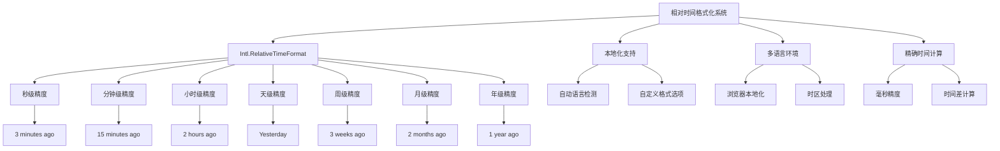
```mermaid
flowchart TD
A[相对时间格式化系统] --> B[Intl.RelativeTimeFormat]
A --> C[本地化支持]
A --> D[多语言环境]
A --> E[精确时间计算]
B --> F[秒级精度]
B --> G[分钟级精度]
B --> H[小时级精度]
B --> I[天级精度]
B --> J[周级精度]
B --> K[月级精度]
B --> L[年级精度]
C --> M[自动语言检测]
C --> N[自定义格式选项]
D --> O[浏览器本地化]
D --> P[时区处理]
E --> Q[毫秒精度]
E --> R[时间差计算]
F --> S["3 minutes ago"]
G --> T["15 minutes ago"]
H --> U["2 hours ago"]
I --> V["Yesterday"]
J --> W["3 weeks ago"]
K --> X["2 months ago"]
L --> Y["1 year ago"]
```

**图表来源**
- [relative-time.ts:13-38](file://ui-react/src/lib/relative-time.ts#L13-L38)
- [relative-time.ts:40-45](file://ui-react/src/lib/relative-time.ts#L40-L45)
- [AgentSessionList.tsx:24-33](file://ui-react/src/components/chat/AgentSessionList.tsx#L24-L33)

**章节来源**
- [relative-time.ts:1-46](file://ui-react/src/lib/relative-time.ts#L1-L46)
- [AgentSessionList.tsx:23-33](file://ui-react/src/components/chat/AgentSessionList.tsx#L23-L33)
- [ChannelDetail.tsx:3-3](file://ui-react/src/components/channels/ChannelDetail.tsx#L3-L3)
- [AccountCardList.tsx:3-3](file://ui-react/src/components/channels/shared/AccountCardList.tsx#L3-L3)
- [CronPage.tsx:12-17](file://ui-react/src/pages/CronPage.tsx#L12-L17)

### 现代化的工具调用组件系统

**新增** 专为Xiaohongshu证据收集和路由确认步骤设计的工具调用组件系统，提供了强大的工具调用可视化和状态管理能力：

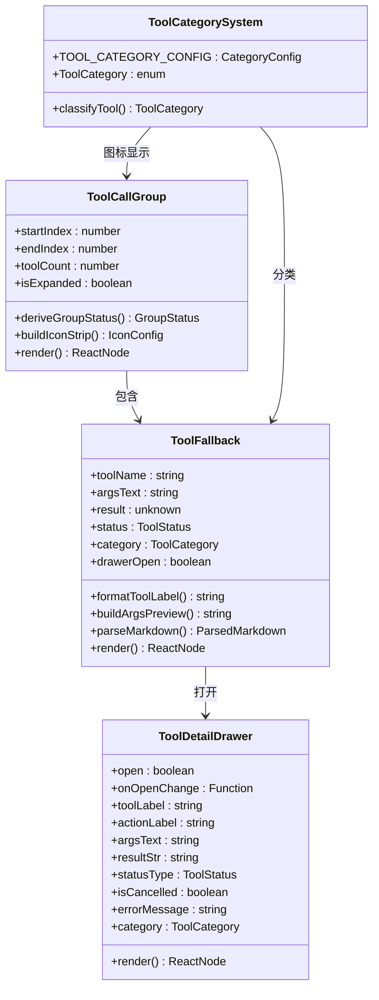
```mermaid
classDiagram
class ToolCallGroup {
+startIndex : number
+endIndex : number
+toolCount : number
+isExpanded : boolean
+deriveGroupStatus() GroupStatus
+buildIconStrip() IconConfig
+render() ReactNode
}
class ToolFallback {
+toolName : string
+argsText : string
+result : unknown
+status : ToolStatus
+category : ToolCategory
+drawerOpen : boolean
+formatToolLabel() string
+buildArgsPreview() string
+parseMarkdown() ParsedMarkdown
+render() ReactNode
}
class ToolDetailDrawer {
+open : boolean
+onOpenChange : Function
+toolLabel : string
+actionLabel : string
+argsText : string
+resultStr : string
+statusType : ToolStatus
+isCancelled : boolean
+errorMessage : string
+category : ToolCategory
+render() ReactNode
}
class ToolCategorySystem {
+classifyTool() ToolCategory
+TOOL_CATEGORY_CONFIG : CategoryConfig
+ToolCategory : enum
}
ToolCallGroup --> ToolFallback : 包含
ToolFallback --> ToolDetailDrawer : 打开
ToolCategorySystem --> ToolFallback : 分类
ToolCategorySystem --> ToolCallGroup : 图标显示
```

**图表来源**
- [ToolCallGroup.tsx:142-274](file://ui-react/src/components/chat/ToolCallGroup.tsx#L142-L274)
- [ToolFallback.tsx:403-532](file://ui-react/src/components/chat/ToolFallback.tsx#L403-L532)
- [ToolFallback.tsx:278-398](file://ui-react/src/components/chat/ToolFallback.tsx#L278-L398)
- [ToolFallback.tsx:36-152](file://ui-react/src/components/chat/ToolFallback.tsx#L36-L152)

#### 工具调用分类系统

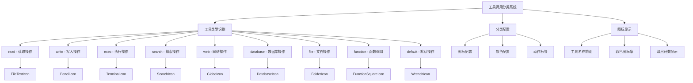
```mermaid
flowchart TD
A[工具调用分类系统] --> B[工具类型识别]
A --> C[分类配置]
A --> D[图标显示]
B --> E[read - 读取操作]
B --> F[write - 写入操作]
B --> G[exec - 执行操作]
B --> H[search - 搜索操作]
B --> I[web - 网络操作]
B --> J[database - 数据库操作]
B --> K[file - 文件操作]
B --> L[function - 函数调用]
B --> M[default - 默认操作]
C --> N[图标配置]
C --> O[颜色配置]
C --> P[动作标签]
D --> Q[工具名称前缀]
D --> R[彩色图标条]
D --> S[溢出计数显示]
E --> T[FileTextIcon]
F --> U[PencilIcon]
G --> V[TerminalIcon]
H --> W[SearchIcon]
I --> X[GlobeIcon]
J --> Y[DatabaseIcon]
K --> Z[FolderIcon]
L --> AA[FunctionSquareIcon]
M --> AB[WrenchIcon]
```

**图表来源**
- [ToolFallback.tsx:47-74](file://ui-react/src/components/chat/ToolFallback.tsx#L47-L74)
- [ToolFallback.tsx:76-152](file://ui-react/src/components/chat/ToolFallback.tsx#L76-L152)
- [ToolCallGroup.tsx:69-92](file://ui-react/src/components/chat/ToolCallGroup.tsx#L69-L92)

**章节来源**
- [ToolCallGroup.tsx:1-274](file://ui-react/src/components/chat/ToolCallGroup.tsx#L1-L274)
- [ToolFallback.tsx:1-532](file://ui-react/src/components/chat/ToolFallback.tsx#L1-L532)

### 现代化的插格系统组件

**更新** 插格系统UI经过简化，移除了PluginCard中的PackageIcon，优化了插格管理界面：

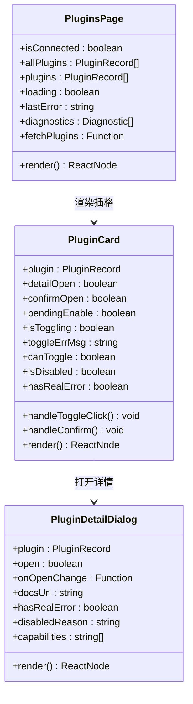
```mermaid
classDiagram
class PluginCard {
+plugin : PluginRecord
+detailOpen : boolean
+confirmOpen : boolean
+pendingEnable : boolean
+isToggling : boolean
+toggleErrMsg : string
+canToggle : boolean
+isDisabled : boolean
+hasRealError : boolean
+handleToggleClick() void
+handleConfirm() void
+render() ReactNode
}
class PluginDetailDialog {
+plugin : PluginRecord
+open : boolean
+onOpenChange : Function
+docsUrl : string
+hasRealError : boolean
+disabledReason : string
+capabilities : string[]
+render() ReactNode
}
class PluginsPage {
+isConnected : boolean
+allPlugins : PluginRecord[]
+plugins : PluginRecord[]
+loading : boolean
+lastError : string
+diagnostics : Diagnostic[]
+fetchPlugins : Function
+render() ReactNode
}
PluginCard --> PluginDetailDialog : 打开详情
PluginsPage --> PluginCard : 渲染插格
```

**图表来源**
- [PluginCard.tsx:55-230](file://ui-react/src/components/plugins/PluginCard.tsx#L55-L230)
- [PluginDetailDialog.tsx:40-184](file://ui-react/src/components/plugins/PluginDetailDialog.tsx#L40-L184)
- [PluginsPage.tsx:9-108](file://ui-react/src/pages/PluginsPage.tsx#L9-L108)

#### 插格管理简化流程

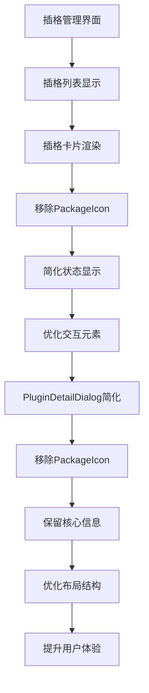
```mermaid
flowchart TD
A[插格管理界面] --> B[插格列表显示]
B --> C[插格卡片渲染]
C --> D[移除PackageIcon]
D --> E[简化状态显示]
E --> F[优化交互元素]
F --> G[PluginDetailDialog简化]
G --> H[移除PackageIcon]
H --> I[保留核心信息]
I --> J[优化布局结构]
J --> K[提升用户体验]
```

**图表来源**
- [PluginCard.tsx:107-198](file://ui-react/src/components/plugins/PluginCard.tsx#L107-L198)
- [PluginDetailDialog.tsx:84-113](file://ui-react/src/components/plugins/PluginDetailDialog.tsx#L84-L113)
- [PluginsPage.tsx:89-96](file://ui-react/src/pages/PluginsPage.tsx#L89-L96)

**章节来源**
- [PluginCard.tsx:55-230](file://ui-react/src/components/plugins/PluginCard.tsx#L55-L230)
- [PluginDetailDialog.tsx:40-184](file://ui-react/src/components/plugins/PluginDetailDialog.tsx#L40-L184)
- [PluginsPage.tsx:9-108](file://ui-react/src/pages/PluginsPage.tsx#L9-L108)

### 现代化的Agent管理组件系统

**新增** 完整的Agent管理组件系统，提供现代化的代理管理和配置功能：

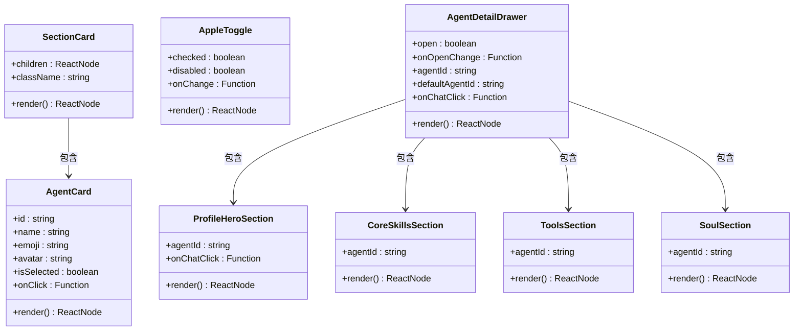
```mermaid
classDiagram
class SectionCard {
+children : ReactNode
+className : string
+render() ReactNode
}
class AppleToggle {
+checked : boolean
+disabled : boolean
+onChange : Function
+render() ReactNode
}
class AgentCard {
+id : string
+name : string
+emoji : string
+avatar : string
+isSelected : boolean
+onClick : Function
+render() ReactNode
}
class AgentDetailDrawer {
+open : boolean
+onOpenChange : Function
+agentId : string
+defaultAgentId : string
+onChatClick : Function
+render() ReactNode
}
class ProfileHeroSection {
+agentId : string
+onChatClick : Function
+render() ReactNode
}
class CoreSkillsSection {
+agentId : string
+render() ReactNode
}
class ToolsSection {
+agentId : string
+render() ReactNode
}
class SoulSection {
+agentId : string
+render() ReactNode
}
SectionCard --> AgentCard : 包含
AgentDetailDrawer --> ProfileHeroSection : 包含
AgentDetailDrawer --> CoreSkillsSection : 包含
AgentDetailDrawer --> ToolsSection : 包含
AgentDetailDrawer --> SoulSection : 包含
```

**图表来源**
- [shared.tsx:4-10](file://ui-react/src/components/agents/shared.tsx#L4-L10)
- [shared.tsx:18-48](file://ui-react/src/components/agents/shared.tsx#L18-L48)
- [card.tsx:12-58](file://ui-react/src/components/agents/card.tsx#L12-L58)
- [detail-drawer.tsx:39-154](file://ui-react/src/components/agents/detail-drawer.tsx#L39-L154)
- [profile.tsx:138-353](file://ui-react/src/components/agents/profile.tsx#L138-L353)
- [skills.tsx:176-347](file://ui-react/src/components/agents/skills.tsx#L176-L347)
- [tools.tsx:349-553](file://ui-react/src/components/agents/tools.tsx#L349-L553)
- [soul.tsx:15-167](file://ui-react/src/components/agents/soul.tsx#L15-L167)

#### SectionCard组件样式改进

**新增** SectionCard组件提供了统一的卡片容器样式，支持自定义类名扩展：

```mermaid
flowchart TD
A[SectionCard组件] --> B[圆角设计]
A --> C[边框样式]
A --> D[阴影效果]
A --> E[内边距设置]
B --> F[rounded-3xl圆角]
C --> G[border border-[#F0F0F0]边框]
D --> H[shadow-sm阴影]
E --> I[px-6 py-5内边距]
F --> J[统一视觉风格]
G --> J
H --> J
I --> J
J --> K[可扩展的className参数]
```

**图表来源**
- [shared.tsx:4-10](file://ui-react/src/components/agents/shared.tsx#L4-L10)

#### AppleToggle组件优化

**新增** AppleToggle组件实现了苹果风格的开关控件，提供流畅的动画效果和禁用状态支持：

```mermaid
flowchart TD
A[AppleToggle组件] --> B[尺寸规格]
A --> C[颜色状态]
A --> D[动画效果]
A --> E[交互状态]
B --> F[h-5 w-9尺寸]
C --> G[checked状态红色]
C --> H[unchecked状态灰色]
D --> I[transition-colors 200ms动画]
D --> J[translate变换动画]
E --> K[disabled禁用状态]
E --> L[aria-checked语义化]
F --> M[圆角设计]
G --> N[bg-[#BA0034]红色]
H --> O[bg-[#E9E9EA]灰色]
I --> P[平滑过渡效果]
J --> Q[translate-x位置变换]
K --> R[opacity-40透明度]
L --> S[可访问性支持]
M --> T[视觉一致性]
N --> T
O --> T
P --> T
Q --> T
R --> T
S --> T
```

**图表来源**
- [shared.tsx:18-48](file://ui-react/src/components/agents/shared.tsx#L18-L48)

#### AgentCard组件样式优化

**新增** AgentCard组件提供了现代化的代理卡片设计，支持选中状态和悬停效果：

```mermaid
flowchart TD
A[AgentCard组件] --> B[选中状态]
A --> C[悬停效果]
A --> D[头像显示]
A --> E[选中指示器]
B --> F[边框-[#BA0034]红色]
B --> G[背景-[#BA0034]/10半透明]
B --> H[shadow-md阴影]
C --> I[hover:border-[#BA0034]/30]
C --> J[hover:bg-[#BA0034]/5]
C --> K[hover:shadow-lg]
D --> L[圆角2xl背景]
D --> M[溢出隐藏]
E --> N[绝对定位右上角]
E --> O[红色圆点指示器]
F --> P[视觉反馈]
G --> P
H --> P
I --> P
J --> P
K --> P
L --> P
M --> P
N --> P
O --> P
```

**图表来源**
- [card.tsx:12-58](file://ui-react/src/components/agents/card.tsx#L12-L58)

#### AgentDetailDrawer组件功能增强

**新增** AgentDetailDrawer组件提供了完整的代理详情展示界面，支持抽屉式布局和滚动区域：

```mermaid
flowchart TD
A[AgentDetailDrawer组件] --> B[抽屉布局]
A --> C[滚动区域]
A --> D[删除确认]
A --> E[侧边操作]
B --> F[right方向]
B --> G[w-[80vw]最大宽度]
C --> H[ScrollArea滚动]
C --> I[h-[calc(100vh-100px)]高度]
D --> J[Dialog确认框]
D --> K[删除目标状态]
E --> L[删除按钮]
E --> M[关闭按钮]
F --> N[响应式设计]
G --> N
H --> N
I --> N
J --> N
K --> N
L --> N
M --> N
N --> O[完整的代理管理界面]
```

**图表来源**
- [detail-drawer.tsx:39-154](file://ui-react/src/components/agents/detail-drawer.tsx#L39-L154)

**章节来源**
- [shared.tsx:4-10](file://ui-react/src/components/agents/shared.tsx#L4-L10)
- [shared.tsx:18-48](file://ui-react/src/components/agents/shared.tsx#L18-L48)
- [card.tsx:12-58](file://ui-react/src/components/agents/card.tsx#L12-L58)
- [detail-drawer.tsx:39-154](file://ui-react/src/components/agents/detail-drawer.tsx#L39-L154)

## 架构概览

UI组件系统采用现代化的分层架构设计，实现了清晰的关注点分离：

```mermaid
graph TB
subgraph "现代化用户界面层"
A[Chat界面 - assistant-ui/react] --> B[消息渲染]
A --> C[工具调用显示]
A --> D[流式响应处理]
E[Skills界面 - shadcn/ui] --> F[技能卡片展示]
E --> G[技能状态管理]
E --> H[API密钥管理]
E --> I[技能导入对话框]
J[配置管理] --> K[表单验证]
J --> L[实时预览]
M[设备监控] --> N[节点状态]
M --> O[执行审批]
P[布局系统 - Sidebar] --> Q[响应式设计]
P --> R[键盘快捷键]
P --> S[多变体支持]
T[Profile界面] --> U[模板选择]
T --> V[表单编辑]
T --> W[文件上传]
T --> X[Markdown渲染]
Y[Sonner通知系统] --> Z[主题化通知]
Y --> AA[自定义图标]
Y --> BB[Next.js主题集成]
CC[相对时间格式化] --> DD[Intl.RelativeTimeFormat]
CC --> EE[本地化支持]
CC --> FF[多语言环境]
GG[AgentSessionList] --> HH[会话时间显示]
GG --> II[修改时间格式化]
JJ[ChannelDetail] --> KK[最后连接时间]
JJ --> LL[账户活动时间]
MM[AccountCardList] --> NN[最后收件时间]
MM --> OO[运行状态显示]
PP[CronPage] --> QQ[下次运行时间]
PP --> RR[最后运行时间]
QQ --> SS[定时任务状态]
RR --> SS
NN --> TT[通道活动监控]
KK --> TT
UU[ToolCallGroup组件] --> VV[工具调用分组]
UU[ToolCallGroup组件] --> WW[状态徽章]
UU[ToolCallGroup组件] --> XX[图标条显示]
YY[ToolFallback组件] --> ZZ[工具调用回退]
YY[ToolFallback组件] --> AA[详细抽屉]
YY[ToolFallback组件] --> BB[分类系统]
CC[markdown-components] --> DD[Markdown渲染]
CC[markdown-components] --> EE[代码块样式]
CC[markdown-components] --> FF[表格样式]
DD[xhs_evidence_builder.mjs] --> QQ[Xiaohongshu证据收集]
DD[xhs_evidence_builder.mjs] --> RR[搜索查询构建]
DD[xhs_evidence_builder.mjs] --> SS[证据质量评估]
HH[route_selector.mjs] --> UU[路由候选生成]
HH[route_selector.mjs] --> VV[证据质量判断]
HH[route_selector.mjs] --> WW[下一步行动建议]
XX[travel-planner-skill.test.ts] --> YY[测试用例验证]
XX[travel-planner-skill.test.ts] --> ZZ[Xiaohongshu证据需求]
AA[PluginCard组件] --> BB[插格管理]
AA[PluginCard组件] --> CC[状态显示]
AA[PluginCard组件] --> DD[交互元素]
EE[PluginDetailDialog组件] --> FF[插格详情]
EE[PluginDetailDialog组件] --> GG[核心信息]
EE[PluginDetailDialog组件] --> HH[简化布局]
II[PluginsPage组件] --> JJ[插格列表]
II[PluginsPage组件] --> KK[空状态显示]
II[PluginsPage组件] --> LL[诊断信息]
MM[Agent管理组件] --> NN[SectionCard卡片容器]
MM[Agent管理组件] --> OO[AppleToggle开关控件]
MM[Agent管理组件] --> PP[AgentCard代理卡片]
MM[Agent管理组件] --> QQ[AgentDetailDrawer详情抽屉]
MM[Agent管理组件] --> RR[ProfileHeroSection档案展示]
MM[Agent管理组件] --> SS[CoreSkillsSection技能管理]
MM[Agent管理组件] --> TT[ToolsSection工具管理]
MM[Agent管理组件] --> UU[SoulSection灵魂管理]
```

**图表来源**
- [AppShell.tsx:77-95](file://ui-react/src/components/layout/AppShell.tsx#L77-L95)
- [ChatPage.tsx:6-22](file://ui-react/src/pages/ChatPage.tsx#L6-L22)
- [SkillsPage.tsx:42-331](file://ui-react/src/pages/SkillsPage.tsx#L42-L331)
- [sidebar.tsx:1-694](file://ui-react/src/components/ui/sidebar.tsx#L1-L694)
- [sonner.tsx:1-39](file://ui-react/src/components/ui/sonner.tsx#L1-L39)
- [relative-time.ts:1-46](file://ui-react/src/lib/relative-time.ts#L1-L46)
- [AgentSessionList.tsx:1-244](file://ui-react/src/components/chat/AgentSessionList.tsx#L1-L244)
- [ChannelDetail.tsx:1-170](file://ui-react/src/components/channels/ChannelDetail.tsx#L1-L170)
- [AccountCardList.tsx:1-84](file://ui-react/src/components/channels/shared/AccountCardList.tsx#L1-L84)
- [CronPage.tsx:1-184](file://ui-react/src/pages/CronPage.tsx#L1-L184)
- [ToolCallGroup.tsx:1-274](file://ui-react/src/components/chat/ToolCallGroup.tsx#L1-L274)
- [ToolFallback.tsx:1-532](file://ui-react/src/components/chat/ToolFallback.tsx#L1-L532)
- [PluginCard.tsx:1-231](file://ui-react/src/components/plugins/PluginCard.tsx#L1-L231)
- [PluginDetailDialog.tsx:1-185](file://ui-react/src/components/plugins/PluginDetailDialog.tsx#L1-L185)
- [PluginsPage.tsx:1-109](file://ui-react/src/pages/PluginsPage.tsx#L1-L109)
- [markdown-components.tsx:1-174](file://ui-react/src/components/chat/markdown-components.tsx#L1-L174)
- [shared.tsx:1-103](file://ui-react/src/components/agents/shared.tsx#L1-L103)
- [card.tsx:1-59](file://ui-react/src/components/agents/card.tsx#L1-L59)
- [detail-drawer.tsx:1-156](file://ui-react/src/components/agents/detail-drawer.tsx#L1-L156)
- [profile.tsx:1-483](file://ui-react/src/components/agents/profile.tsx#L1-L483)
- [skills.tsx:1-348](file://ui-react/src/components/agents/skills.tsx#L1-L348)
- [tools.tsx:1-554](file://ui-react/src/components/agents/tools.tsx#L1-L554)
- [soul.tsx:1-168](file://ui-react/src/components/agents/soul.tsx#L1-L168)

## 详细组件分析

### 现代化的聊天界面组件

#### ThreadView组件

ThreadView是现代化聊天界面的核心组件，基于assistant-ui/react框架构建：

```mermaid
classDiagram
class ThreadView {
+messages : ChatMessage[]
+stream : string
+sending : boolean
+render() ReactNode
}
class UserMessage {
+role : "user"
+content : string
+attachments : Attachment[]
+render() ReactNode
}
class AssistantMessage {
+role : "assistant"
+content : string
+parts : MessagePart[]
+loading : boolean
+render() ReactNode
}
class Composer {
+input : string
+attachments : Attachment[]
+send() void
+cancel() void
}
class ScrollToBottom {
+isVisible : boolean
+onClick() void
}
ThreadView --> UserMessage : 渲染用户消息
ThreadView --> AssistantMessage : 渲染助手消息
ThreadView --> Composer : 底部输入区域
ThreadView --> ScrollToBottom : 自动滚动
```

**图表来源**
- [ThreadView.tsx:15-82](file://ui-react/src/components/chat/ThreadView.tsx#L15-L82)
- [UserMessage.tsx:8-46](file://ui-react/src/components/chat/UserMessage.tsx#L8-L46)
- [AssistantMessage.tsx:20-118](file://ui-react/src/components/chat/AssistantMessage.tsx#L20-L118)
- [Composer.tsx:11-90](file://ui-react/src/components/chat/Composer.tsx#L11-L90)

#### AssistantMessage组件

**更新** AssistantMessage组件现在集成了ToolCallGroup和ToolFallback组件，专门用于处理Xiaohongshu证据收集和路由确认步骤：

```mermaid
classDiagram
class AssistantMessage {
+render() ReactNode
}
class ToolCallGroup {
+startIndex : number
+endIndex : number
+toolCount : number
+isExpanded : boolean
+deriveGroupStatus() GroupStatus
+buildIconStrip() IconConfig
+render() ReactNode
}
class ToolFallback {
+toolName : string
+argsText : string
+result : unknown
+status : ToolStatus
+category : ToolCategory
+drawerOpen : boolean
+formatToolLabel() string
+buildArgsPreview() string
+parseMarkdown() ParsedMarkdown
+render() ReactNode
}
class MarkdownText {
+remarkPlugins : Plugin[]
+components : Components
+render() ReactNode
}
AssistantMessage --> ToolCallGroup : 使用
AssistantMessage --> ToolFallback : 使用
AssistantMessage --> MarkdownText : 使用
ToolCallGroup --> ToolFallback : 包含多个
```

**图表来源**
- [AssistantMessage.tsx:20-58](file://ui-react/src/components/chat/AssistantMessage.tsx#L20-L58)
- [ToolCallGroup.tsx:147-274](file://ui-react/src/components/chat/ToolCallGroup.tsx#L147-L274)
- [ToolFallback.tsx:403-532](file://ui-react/src/components/chat/ToolFallback.tsx#L403-L532)
- [markdown-components.tsx:12-174](file://ui-react/src/components/chat/markdown-components.tsx#L12-L174)

#### 聊天事件桥接系统

useChatEventBridge提供了强大的聊天事件处理能力：

```mermaid
flowchart TD
A[聊天事件桥接] --> B[注册事件处理器]
B --> C[处理chat事件]
B --> D[处理agent事件]
B --> E[处理history事件]
B --> F[处理流式事件]
C --> G[delta流式响应]
C --> H[final最终响应]
C --> I[aborted/错误处理]
D --> J[tool调用开始]
D --> K[result结果]
D --> L[error错误]
E --> M[合并工具结果]
E --> N[标准化消息格式]
F --> O[stream.start开始]
F --> P[stream.chunk片段]
F --> Q[stream.end结束]
G --> R[更新流式状态]
H --> S[提交最终消息]
I --> T[重置流式状态]
J --> U[更新工具流状态]
K --> V[标记工具完成]
L --> W[标记工具错误]
M --> X[提取内容块]
N --> Y[提取工具调用部分]
O --> Z[重置工具流]
P --> AA[追加流片段]
Q --> BB[最终化流]
```

**图表来源**
- [useChatEventBridge.ts:352-569](file://ui-react/src/hooks/useChatEventBridge.ts#L352-L569)
- [chat.store.ts:167-249](file://ui-react/src/store/chat.store.ts#L167-L249)

**章节来源**
- [ThreadView.tsx:15-82](file://ui-react/src/components/chat/ThreadView.tsx#L15-L82)
- [UserMessage.tsx:8-46](file://ui-react/src/components/chat/UserMessage.tsx#L8-L46)
- [AssistantMessage.tsx:20-58](file://ui-react/src/components/chat/AssistantMessage.tsx#L20-L58)
- [ToolCallGroup.tsx:147-274](file://ui-react/src/components/chat/ToolCallGroup.tsx#L147-L274)
- [ToolFallback.tsx:403-532](file://ui-react/src/components/chat/ToolFallback.tsx#L403-L532)
- [useChatEventBridge.ts:352-569](file://ui-react/src/hooks/useChatEventBridge.ts#L352-L569)

### 现代化的技能管理组件

#### AddSkillDialog组件

AddSkillDialog提供了直观的技能导入功能：

```mermaid
classDiagram
class AddSkillDialog {
+open : boolean
+mode : "url" | "upload"
+target : "workspace" | "managed"
+url : string
+file : File | null
+loading : boolean
+result : Result | null
+handleOpenChange() void
+handleSubmit() void
+resetForm() void
}
class URL模式 {
+url : string
+urlSkillName : string
+validateUrl() boolean
}
class 文件模式 {
+file : File | null
+uploadSkillName : string
+readFile() Promise~string~
}
class 导入结果 {
+ok : boolean
+message : string
+warnings : string[]
}
AddSkillDialog --> URL模式 : URL导入
AddSkillDialog --> 文件模式 : 文件导入
AddSkillDialog --> 导入结果 : 显示结果
URL模式 --> 导入结果 : 成功导入
文件模式 --> 导入结果 : 成功导入
```

**图表来源**
- [AddSkillDialog.tsx:23-275](file://ui-react/src/components/skills/AddSkillDialog.tsx#L23-L275)
- [AddSkillDialog.tsx:64-111](file://ui-react/src/components/skills/AddSkillDialog.tsx#L64-L111)
- [AddSkillDialog.tsx:284-304](file://ui-react/src/components/skills/AddSkillDialog.tsx#L284-L304)

#### SkillCard组件

SkillCard提供了详细的技能信息展示和管理功能：

```mermaid
flowchart TD
A[SkillCard组件] --> B[技能基本信息]
A --> C[状态指示器]
A --> D[操作按钮]
A --> E[配置区域]
B --> F[技能图标]
B --> G[技能名称]
B --> H[技能描述]
B --> I[来源标签]
C --> J[警告图标]
C --> K[错误状态]
C --> L[禁用状态]
D --> M[启用/禁用切换]
D --> N[安装按钮]
D --> O[删除按钮]
D --> P[查看详情]
E --> Q[API密钥输入]
E --> R[环境变量输入]
E --> S[保存按钮]
Q --> T[密码输入框]
R --> U[多个输入框]
S --> V[批量保存]
```

**图表来源**
- [SkillCard.tsx:56-318](file://ui-react/src/components/skills/SkillCard.tsx#L56-L318)
- [skills.store.ts:126-206](file://ui-react/src/store/skills.store.ts#L126-L206)

**章节来源**
- [AddSkillDialog.tsx:23-275](file://ui-react/src/components/skills/AddSkillDialog.tsx#L23-L275)
- [SkillCard.tsx:56-318](file://ui-react/src/components/skills/SkillCard.tsx#L56-L318)
- [skills.store.ts:126-206](file://ui-react/src/store/skills.store.ts#L126-L206)

### 现代化的Sidebar组件系统

#### SidebarProvider组件

SidebarProvider是Sidebar系统的核心提供者：

```mermaid
classDiagram
class SidebarProvider {
+defaultOpen : boolean
+open : boolean
+openMobile : boolean
+state : "expanded" | "collapsed"
+setOpen() void
+toggleSidebar() void
+handleKeyDown() void
}
class SidebarContext {
+state : "expanded" | "collapsed"
+open : boolean
+setOpen : Function
+isMobile : boolean
+openMobile : boolean
+setOpenMobile : Function
+toggleSidebar : Function
}
class useSidebar {
+返回SidebarContext
+throw错误处理
}
SidebarProvider --> SidebarContext : 创建上下文
useSidebar --> SidebarContext : 访问上下文
```

**图表来源**
- [sidebar.tsx:50-143](file://ui-react/src/components/ui/sidebar.tsx#L50-L143)
- [sidebar.tsx:41-48](file://ui-react/src/components/ui/sidebar.tsx#L41-L48)

#### Sidebar组件变体

Sidebar组件支持多种变体和配置：

```mermaid
flowchart TD
A[Sidebar组件] --> B[side属性]
B --> C[left左侧]
B --> D[right右侧]
A --> E[variant属性]
E --> F[sidebar标准]
E --> G[floating浮动]
E --> H[inset嵌入]
A --> I[collapsible属性]
I --> J[offcanvas完整展开]
I --> K[icon图标模式]
I --> L[none无折叠]
A --> M[响应式行为]
M --> N[桌面端固定]
M --> O[移动端抽屉]
M --> P[键盘快捷键]
```

**图表来源**
- [sidebar.tsx:145-245](file://ui-react/src/components/ui/sidebar.tsx#L145-L245)
- [sidebar.tsx:174-197](file://ui-react/src/components/ui/sidebar.tsx#L174-L197)
- [sidebar.tsx:91-101](file://ui-react/src/components/ui/sidebar.tsx#L91-L101)

**章节来源**
- [sidebar.tsx:50-143](file://ui-react/src/components/ui/sidebar.tsx#L50-L143)
- [sidebar.tsx:145-245](file://ui-react/src/components/ui/sidebar.tsx#L145-L245)
- [sidebar.tsx:174-197](file://ui-react/src/components/ui/sidebar.tsx#L174-L197)

### 现代化的UI组件库

#### shadcn/ui基础组件

基于shadcn/ui设计系统的完整组件库：

```mermaid
classDiagram
class Button {
+variant : "default" | "destructive" | "outline" | "secondary" | "ghost" | "link"
+size : "default" | "sm" | "lg" | "icon"
+asChild : boolean
+render() ReactNode
}
class Input {
+type : string
+disabled : boolean
+value : string
+onChange : Function
+render() ReactNode
}
class Dialog {
+open : boolean
+onOpenChange : Function
+children : ReactNode
+render() ReactNode
}
class Sheet {
+open : boolean
+onOpenChange : Function
+children : ReactNode
+render() ReactNode
}
class Checkbox {
+checked : boolean
+disabled : boolean
+onCheckedChange : Function
+render() ReactNode
}
class Switch {
+checked : boolean
+disabled : boolean
+onCheckedChange : Function
+size : "sm" | "default"
+render() ReactNode
}
Button --> ButtonPrimitive : 使用
Input --> InputPrimitive : 使用
Dialog --> DialogPrimitive : 使用
Sheet --> SheetPrimitive : 使用
Checkbox --> CheckboxPrimitive : 使用
Switch --> SwitchPrimitive : 使用
```

**图表来源**
- [checkbox.tsx:6-23](file://ui-react/src/components/ui/checkbox.tsx#L6-L23)
- [sheet.tsx:8-18](file://ui-react/src/components/ui/sheet.tsx#L8-L18)
- [switch.tsx:5-30](file://ui-react/src/components/ui/switch.tsx#L5-L30)

**章节来源**
- [checkbox.tsx:1-26](file://ui-react/src/components/ui/checkbox.tsx#L1-L26)
- [sheet.tsx:1-134](file://ui-react/src/components/ui/sheet.tsx#L1-L134)
- [switch.tsx:1-33](file://ui-react/src/components/ui/switch.tsx#L1-L33)

### 现代化的状态管理系统

#### Zustand状态管理

采用Zustand进行状态管理，提供了高效的组件状态共享：

```mermaid
classDiagram
class ChatStore {
+messages : ChatMessage[]
+stream : string
+sending : boolean
+queue : QueueItem[]
+sessionKey : string
+setMessage() void
+setSending() void
+setMessages() void
+appendStreamChunk() void
+enqueueMessage() void
+finalizeStream() void
+resetStream() void
+commitStreamSegment() void
+upsertToolStream() void
+resetToolStream() void
}
class SkillsStore {
+loading : boolean
+report : SkillStatusReport
+error : string
+busyKey : string
+filter : string
+edits : Record~string, string~
+messages : SkillMessageMap
+loadSkills() void
+setFilter() void
+setEdit() void
+toggleSkill() void
+saveApiKey() void
+installSkill() void
+importSkill() void
+removeSkill() void
+getSkillFile() void
+saveSkillFile() void
}
class GatewayStore {
+status : ConnectionStatus
+client : IGatewayClient
+hello : GatewayHelloOk
+presenceEntries : PresenceEntry[]
+debugHealth : HealthSnapshot
+eventLogBuffer : EventLog[]
+setClient() void
+setConnected() void
+setDisconnected() void
+handleEvent() void
}
class SettingsStore {
+settings : UiSettings
+password : string
+updateSettings() void
+setPassword() void
+applyTheme() void
+loadSettings() UiSettings
+persistSettings() void
}
ChatStore <.. ChatPage : 状态管理
SkillsStore <.. SkillsPage : 状态管理
GatewayStore <.. SkillsPage : 网关连接
SettingsStore <.. AppShell : 用户设置
```

**图表来源**
- [chat.store.ts:136-250](file://ui-react/src/store/chat.store.ts#L136-L250)
- [skills.store.ts:86-296](file://ui-react/src/store/skills.store.ts#L86-L296)
- [gateway.store.ts:41-68](file://ui-react/src/store/gateway.store.ts#L41-L68)
- [settings.store.ts:1-295](file://ui-react/src/store/settings.store.ts#L1-L295)

**章节来源**
- [chat.store.ts:136-250](file://ui-react/src/store/chat.store.ts#L136-L250)
- [skills.store.ts:86-296](file://ui-react/src/store/skills.store.ts#L86-L296)
- [gateway.store.ts:41-68](file://ui-react/src/store/gateway.store.ts#L41-L68)
- [settings.store.ts:1-295](file://ui-react/src/store/settings.store.ts#L1-L295)

### 现代化的Hook系统

#### 自定义Hook

提供了一系列现代化的自定义Hook：

```mermaid
classDiagram
class useMobile {
+isMobile : boolean
+监听窗口大小变化
+返回布尔值
}
class useSessionManager {
+sessions : SessionEntry[]
+loading : boolean
+sessionKey : string
+activeLabel : string
+loadSessions() void
+loadHistory() void
+switchSession() void
+newSession() void
}
class useChatEventBridge {
+注册聊天事件处理器
+转换原始事件
+更新状态管理
}
class useGateway {
+管理网关连接
+处理连接状态
+提供连接服务
}
useMobile --> useIsMobile : 使用
useSessionManager --> useChatEventBridge : 集成
useChatEventBridge --> useChatStore : 更新状态
useGateway --> useGatewayStore : 提供服务
```

**图表来源**
- [use-mobile.ts:3-19](file://ui-react/src/hooks/use-mobile.ts#L3-L19)
- [useSessionManager.ts:13-139](file://ui-react/src/hooks/useSessionManager.ts#L13-L139)
- [useChatEventBridge.ts:1-570](file://ui-react/src/hooks/useChatEventBridge.ts#L1-L570)
- [useGateway.ts](file://ui-react/src/hooks/useGateway.ts)

**章节来源**
- [use-mobile.ts:1-20](file://ui-react/src/hooks/use-mobile.ts#L1-L20)
- [useSessionManager.ts:19-139](file://ui-react/src/hooks/useSessionManager.ts#L19-L139)
- [useChatEventBridge.ts:1-570](file://ui-react/src/hooks/useChatEventBridge.ts#L1-L570)

### 现代化的Sonner Toast通知系统

#### Toaster组件实现

Toaster组件集成了Sonner通知系统，提供了完整的主题化通知功能：

```mermaid
classDiagram
class Toaster {
+props : ToasterProps
+theme : "light" | "dark" | "system"
+icons : Icons
+style : CSSProperties
+className : string
+render() ReactNode
}
class Icons {
+success : ReactNode
+info : ReactNode
+warning : ReactNode
+error : ReactNode
+loading : ReactNode
}
class ThemeIntegration {
+useTheme() : ThemeContext
+theme : "light" | "dark" | "system"
+applyTheme() : void
}
class CSSCustomProperties {
+--normal-bg : var(--popover)
+--normal-text : var(--popover-foreground)
+--normal-border : var(--border)
+--border-radius : var(--radius)
}
Toaster --> Icons : 使用
Toaster --> ThemeIntegration : 集成
Toaster --> CSSCustomProperties : 应用
ThemeIntegration --> CSSCustomProperties : 提供变量
```

**图表来源**
- [sonner.tsx:11-36](file://ui-react/src/components/ui/sonner.tsx#L11-L36)
- [sonner.tsx:18-24](file://ui-react/src/components/ui/sonner.tsx#L18-L24)
- [sonner.tsx:25-32](file://ui-react/src/components/ui/sonner.tsx#L25-L32)

#### 主题化通知系统

```mermaid
flowchart TD
A[主题化通知系统] --> B[浅色主题]
A --> C[深色主题]
A --> D[系统主题]
B --> E[浅色背景]
B --> F[深色前景]
B --> G[浅色边框]
C --> H[深色背景]
C --> I[浅色前景]
C --> J[深色边框]
D --> K[跟随系统设置]
K --> L[自动切换]
E --> M[--normal-bg: var(--popover)]
F --> N[--normal-text: var(--popover-foreground)]
G --> O[--normal-border: var(--border)]
H --> P[--normal-bg: var(--popover)]
I --> Q[--normal-text: var(--popover-foreground)]
J --> R[--normal-border: var(--border)]
M --> S[CSS变量映射]
N --> S
O --> S
P --> S
Q --> S
R --> S
S --> T[样式应用]
```

**图表来源**
- [sonner.tsx:12](file://ui-react/src/components/ui/sonner.tsx#L12)
- [sonner.tsx:25-32](file://ui-react/src/components/ui/sonner.tsx#L25-L32)
- [index.css:25-31](file://ui-react/src/index.css#L25-L31)

**章节来源**
- [sonner.tsx:1-39](file://ui-react/src/components/ui/sonner.tsx#L1-L39)
- [package.json:48](file://ui-react/package.json#L48)
- [index.css:25-31](file://ui-react/src/index.css#L25-L31)

### 现代化的相对时间格式化系统

#### 相对时间格式化实现

相对时间格式化系统提供了本地化的相对时间显示功能：

```mermaid
classDiagram
class RelativeTimeFormatter {
+formatDistanceToNow(date : Date) string
+relativeTime(ms : number) string
+MS : TimeConstants
}
class TimeConstants {
+minute : 60000
+hour : 3600000
+day : 86400000
+week : 604800000
+approxMonth : 2592000000
+approxYear : 31536000000
}
class IntlRelativeTimeFormat {
+format(value : number, unit : string) string
}
class FormatFunctions {
+formatRelative(ts : number) string
+relativeTime(ms : number) string
}
RelativeTimeFormatter --> TimeConstants : 使用
RelativeTimeFormatter --> IntlRelativeTimeFormat : 使用
FormatFunctions --> RelativeTimeFormatter : 调用
```

**图表来源**
- [relative-time.ts:1-46](file://ui-react/src/lib/relative-time.ts#L1-L46)
- [AgentSessionList.tsx:23-33](file://ui-react/src/components/chat/AgentSessionList.tsx#L23-L33)
- [ChannelDetail.tsx:3-3](file://ui-react/src/components/channels/ChannelDetail.tsx#L3-L3)
- [AccountCardList.tsx:3-3](file://ui-react/src/components/channels/shared/AccountCardList.tsx#L3-L3)
- [CronPage.tsx:12-17](file://ui-react/src/pages/CronPage.tsx#L12-L17)

#### 相对时间格式化特性

```mermaid
flowchart TD
A[相对时间格式化] --> B[Intl.RelativeTimeFormat]
A --> C[本地化支持]
A --> D[精确时间计算]
B --> E[秒级精度]
B --> F[分钟级精度]
B --> G[小时级精度]
B --> H[天级精度]
B --> I[周级精度]
B --> J[月级精度]
B --> K[年级精度]
C --> L[自动语言检测]
C --> M[自定义格式选项]
D --> N[毫秒精度]
D --> O[时间差计算]
E --> P["3 minutes ago"]
F --> Q["15 minutes ago"]
G --> R["2 hours ago"]
H --> S["Yesterday"]
I --> T["3 weeks ago"]
J --> U["2 months ago"]
K --> V["1 year ago"]
```

**图表来源**
- [relative-time.ts:13-38](file://ui-react/src/lib/relative-time.ts#L13-L38)
- [relative-time.ts:40-45](file://ui-react/src/lib/relative-time.ts#L40-L45)
- [AgentSessionList.tsx:24-33](file://ui-react/src/components/chat/AgentSessionList.tsx#L24-L33)

**章节来源**
- [relative-time.ts:1-46](file://ui-react/src/lib/relative-time.ts#L1-L46)
- [AgentSessionList.tsx:23-33](file://ui-react/src/components/chat/AgentSessionList.tsx#L23-L33)
- [ChannelDetail.tsx:3-3](file://ui-react/src/components/channels/ChannelDetail.tsx#L3-L3)
- [AccountCardList.tsx:3-3](file://ui-react/src/components/channels/shared/AccountCardList.tsx#L3-L3)
- [CronPage.tsx:12-17](file://ui-react/src/pages/CronPage.tsx#L12-L17)

### 现代化的工具调用组件系统

#### ToolCallGroup组件

**新增** ToolCallGroup组件专门用于处理Xiaohongshu证据收集和路由确认步骤的工具调用分组显示：

```mermaid
classDiagram
class ToolCallGroup {
+startIndex : number
+endIndex : number
+toolCount : number
+isExpanded : boolean
+userToggledRef : RefObject<boolean>
+prevRunningRef : RefObject<boolean>
+deriveGroupStatus() GroupStatus
+buildIconStrip() IconConfig
+handleToggle() void
+render() ReactNode
}
class GroupStatusBadge {
+status : GroupStatus
+failCount : int
+render() ReactNode
}
class ToolCallGroupInner {
+startIndex : number
+endIndex : number
+toolCount : number
+messageIsRunning : boolean
+toolParts : RawToolPart[]
+groupStatus : GroupStatus
+failCount : int
+iconConfigs : IconConfig[]
+overflow : int
+render() ReactNode
}
ToolCallGroup --> ToolCallGroupInner : 包装
ToolCallGroupInner --> GroupStatusBadge : 使用
ToolCallGroupInner --> ToolFallback : 包含多个
```

**图表来源**
- [ToolCallGroup.tsx:147-274](file://ui-react/src/components/chat/ToolCallGroup.tsx#L147-L274)
- [ToolCallGroup.tsx:98-130](file://ui-react/src/components/chat/ToolCallGroup.tsx#L98-L130)
- [ToolCallGroup.tsx:163-273](file://ui-react/src/components/chat/ToolCallGroup.tsx#L163-L273)

#### ToolFallback组件

**新增** ToolFallback组件提供了详细的工具调用信息展示和交互功能：

```mermaid
classDiagram
class ToolFallback {
+toolName : string
+argsText : string
+result : unknown
+status : ToolStatus
+category : ToolCategory
+drawerOpen : boolean
+statusType : ToolStatus
+isCancelled : boolean
+toolLabel : string
+argsPreview : string
+resultStr : string
+errorMessage : string
+formatToolLabel() string
+buildArgsPreview() string
+parseMarkdown() ParsedMarkdown
+render() ReactNode
}
class ToolDetailDrawer {
+open : boolean
+onOpenChange : Function
+toolLabel : string
+actionLabel : string
+argsText : string
+resultStr : string
+statusType : ToolStatus
+isCancelled : boolean
+errorMessage : string
+category : ToolCategory
+render() ReactNode
}
class ToolCategorySystem {
+classifyTool() ToolCategory
+TOOL_CATEGORY_CONFIG : CategoryConfig
+ToolCategory : enum
}
ToolFallback --> ToolDetailDrawer : 打开
ToolFallback --> ToolCategorySystem : 分类
```

**图表来源**
- [ToolFallback.tsx:403-532](file://ui-react/src/components/chat/ToolFallback.tsx#L403-L532)
- [ToolFallback.tsx:278-398](file://ui-react/src/components/chat/ToolFallback.tsx#L278-L398)
- [ToolFallback.tsx:36-152](file://ui-react/src/components/chat/ToolFallback.tsx#L36-L152)

#### 工具调用状态管理

```mermaid
flowchart TD
A[工具调用状态管理] --> B[运行状态]
A --> C[完成状态]
A --> D[失败状态]
A --> E[取消状态]
B --> F[Running徽章]
B --> G[旋转加载图标]
B --> H[失败计数显示]
C --> I[完成徽章]
C --> J[勾选图标]
C --> K[绿色背景]
D --> L[失败徽章]
D --> M[错误图标]
D --> N[破坏性边框]
E --> O[取消徽章]
E --> P[取消原因]
E --> Q[删除线文本]
F --> R[状态徽章组件]
G --> R
H --> R
I --> S[工具详情抽屉]
J --> S
K --> S
L --> T[错误详情]
M --> T
N --> T
O --> U[取消详情]
P --> U
Q --> U
```

**图表来源**
- [ToolCallGroup.tsx:41-67](file://ui-react/src/components/chat/ToolCallGroup.tsx#L41-L67)
- [ToolFallback.tsx:165-188](file://ui-react/src/components/chat/ToolFallback.tsx#L165-L188)
- [ToolFallback.tsx:292-398](file://ui-react/src/components/chat/ToolFallback.tsx#L292-L398)

**章节来源**
- [ToolCallGroup.tsx:1-274](file://ui-react/src/components/chat/ToolCallGroup.tsx#L1-L274)
- [ToolFallback.tsx:1-532](file://ui-react/src/components/chat/ToolFallback.tsx#L1-L532)

### 现代化的插格系统组件

#### PluginCard组件

**更新** PluginCard组件经过简化，移除了PackageIcon，优化了插格管理界面：

```mermaid
classDiagram
class PluginCard {
+plugin : PluginRecord
+detailOpen : boolean
+confirmOpen : boolean
+pendingEnable : boolean
+isToggling : boolean
+toggleErrMsg : string
+canToggle : boolean
+isDisabled : boolean
+hasRealError : boolean
+handleToggleClick() void
+handleConfirm() void
+render() ReactNode
}
class StatusBadge {
+status : PluginRecord["status"]
+render() ReactNode
}
class OriginPill {
+origin : string
+render() ReactNode
}
class PluginDetailDialog {
+plugin : PluginRecord
+open : boolean
+onOpenChange : Function
+docsUrl : string
+hasRealError : boolean
+disabledReason : string
+capabilities : string[]
+render() ReactNode
}
PluginCard --> StatusBadge : 使用
PluginCard --> OriginPill : 使用
PluginCard --> PluginDetailDialog : 打开
```

**图表来源**
- [PluginCard.tsx:14-34](file://ui-react/src/components/plugins/PluginCard.tsx#L14-L34)
- [PluginCard.tsx:36-53](file://ui-react/src/components/plugins/PluginCard.tsx#L36-L53)
- [PluginCard.tsx:55-230](file://ui-react/src/components/plugins/PluginCard.tsx#L55-L230)
- [PluginDetailDialog.tsx:40-184](file://ui-react/src/components/plugins/PluginDetailDialog.tsx#L40-L184)

#### 插格详情对话框简化

**更新** PluginDetailDialog组件移除了PackageIcon，保留了核心功能：

```mermaid
classDiagram
class PluginDetailDialog {
+plugin : PluginRecord
+open : boolean
+onOpenChange : Function
+docsUrl : string
+hasRealError : boolean
+disabledReason : string
+capabilities : string[]
+render() ReactNode
}
class InfoRow {
+label : string
+value : string
+render() ReactNode
}
class TagPill {
+label : string
+render() ReactNode
}
class Section {
+title : string
+children : React.ReactNode
+render() ReactNode
}
PluginDetailDialog --> InfoRow : 使用
PluginDetailDialog --> TagPill : 使用
PluginDetailDialog --> Section : 使用
```

**图表来源**
- [PluginDetailDialog.tsx:12-21](file://ui-react/src/components/plugins/PluginDetailDialog.tsx#L12-L21)
- [PluginDetailDialog.tsx:23-29](file://ui-react/src/components/plugins/PluginDetailDialog.tsx#L23-L29)
- [PluginDetailDialog.tsx:31-38](file://ui-react/src/components/plugins/PluginDetailDialog.tsx#L31-L38)
- [PluginDetailDialog.tsx:40-184](file://ui-react/src/components/plugins/PluginDetailDialog.tsx#L40-L184)

#### 插格页面优化

**更新** PluginsPage组件移除了PackageIcon的使用：

```mermaid
flowchart TD
A[PluginsPage组件] --> B[插格列表渲染]
A --> C[空状态显示]
A --> D[诊断信息展示]
B --> E[PluginCard组件]
C --> F[简化空状态]
D --> G[诊断信息样式]
E --> H[移除PackageIcon]
F --> I[简化布局]
G --> J[优化样式]
```

**图表来源**
- [PluginsPage.tsx:89-96](file://ui-react/src/pages/PluginsPage.tsx#L89-L96)
- [PluginsPage.tsx:98-104](file://ui-react/src/pages/PluginsPage.tsx#L98-L104)

**章节来源**
- [PluginCard.tsx:14-34](file://ui-react/src/components/plugins/PluginCard.tsx#L14-L34)
- [PluginCard.tsx:36-53](file://ui-react/src/components/plugins/PluginCard.tsx#L36-L53)
- [PluginCard.tsx:55-230](file://ui-react/src/components/plugins/PluginCard.tsx#L55-L230)
- [PluginDetailDialog.tsx:12-21](file://ui-react/src/components/plugins/PluginDetailDialog.tsx#L12-L21)
- [PluginDetailDialog.tsx:23-29](file://ui-react/src/components/plugins/PluginDetailDialog.tsx#L23-L29)
- [PluginDetailDialog.tsx:31-38](file://ui-react/src/components/plugins/PluginDetailDialog.tsx#L31-L38)
- [PluginDetailDialog.tsx:40-184](file://ui-react/src/components/plugins/PluginDetailDialog.tsx#L40-L184)
- [PluginsPage.tsx:89-96](file://ui-react/src/pages/PluginsPage.tsx#L89-L96)
- [PluginsPage.tsx:98-104](file://ui-react/src/pages/PluginsPage.tsx#L98-L104)

### 现代化的Agent管理组件系统

#### SectionCard组件样式改进

**新增** SectionCard组件提供了统一的卡片容器样式，支持自定义类名扩展：

```mermaid
classDiagram
class SectionCard {
+children : ReactNode
+className : string
+render() ReactNode
}
class SectionLabel {
+children : ReactNode
+render() ReactNode
}
SectionCard --> SectionLabel : 包含
```

**图表来源**
- [shared.tsx:4-10](file://ui-react/src/components/agents/shared.tsx#L4-L10)
- [shared.tsx:12-16](file://ui-react/src/components/agents/shared.tsx#L12-L16)

#### AppleToggle组件优化

**新增** AppleToggle组件实现了苹果风格的开关控件，提供流畅的动画效果和禁用状态支持：

```mermaid
classDiagram
class AppleToggle {
+checked : boolean
+disabled : boolean
+onChange : Function
+render() ReactNode
}
class ToggleState {
+checked : boolean
+disabled : boolean
}
class ToggleAnimation {
+transition : "transition-colors duration-200"
+transform : "transform transition-transform duration-200"
}
class ToggleColors {
+checkedColor : "bg-[#BA0034]"
+uncheckedColor : "bg-[#E9E9EA]"
}
AppleToggle --> ToggleState : 使用
AppleToggle --> ToggleAnimation : 使用
AppleToggle --> ToggleColors : 使用
```

**图表来源**
- [shared.tsx:18-48](file://ui-react/src/components/agents/shared.tsx#L18-L48)

#### AgentCard组件样式优化

**新增** AgentCard组件提供了现代化的代理卡片设计，支持选中状态和悬停效果：

```mermaid
classDiagram
class AgentCard {
+id : string
+name : string
+emoji : string
+avatar : string
+isSelected : boolean
+onClick : Function
+render() ReactNode
}
class CardState {
+isSelected : boolean
}
class CardHover {
+hoverEffect : "hover : border-[#BA0034]/30 hover : bg-[#BA0034]/5 hover : shadow-lg"
}
class CardSelected {
+selectedBorder : "border-[#BA0034]"
+selectedBackground : "bg-[#BA0034]/10"
+selectedShadow : "shadow-md"
}
class CardAvatar {
+avatarSize : "size-24"
+avatarTransition : "transition-transform group-hover : scale-110"
}
AgentCard --> CardState : 使用
AgentCard --> CardHover : 使用
AgentCard --> CardSelected : 使用
AgentCard --> CardAvatar : 使用
```

**图表来源**
- [card.tsx:12-58](file://ui-react/src/components/agents/card.tsx#L12-L58)

#### AgentDetailDrawer组件功能增强

**新增** AgentDetailDrawer组件提供了完整的代理详情展示界面，支持抽屉式布局和滚动区域：

```mermaid
classDiagram
class AgentDetailDrawer {
+open : boolean
+onOpenChange : Function
+agentId : string
+defaultAgentId : string
+onChatClick : Function
+render() ReactNode
}
class DrawerLayout {
+direction : "right"
+width : "w-[80vw]"
+maxWidth : "max-w-[80vw]"
}
class DrawerHeader {
+backgroundColor : "bg-[#F7F7F7]"
+borderColor : "border-[#EFEFEF]"
}
class DrawerContent {
+scrollArea : "h-[calc(100vh-100px)]"
+contentWidth : "max-w-3xl"
}
class DrawerActions {
+deleteButton : "text-destructive border-destructive/30"
+closeButton : "size-10"
}
AgentDetailDrawer --> DrawerLayout : 使用
AgentDetailDrawer --> DrawerHeader : 使用
AgentDetailDrawer --> DrawerContent : 使用
AgentDetailDrawer --> DrawerActions : 使用
```

**图表来源**
- [detail-drawer.tsx:39-154](file://ui-react/src/components/agents/detail-drawer.tsx#L39-L154)

**章节来源**
- [shared.tsx:4-10](file://ui-react/src/components/agents/shared.tsx#L4-L10)
- [shared.tsx:18-48](file://ui-react/src/components/agents/shared.tsx#L18-L48)
- [card.tsx:12-58](file://ui-react/src/components/agents/card.tsx#L12-L58)
- [detail-drawer.tsx:39-154](file://ui-react/src/components/agents/detail-drawer.tsx#L39-L154)

## 依赖关系分析

### 现代化依赖图谱

```mermaid
graph TB
subgraph "现代化React依赖"
A[react] --> B[JSX渲染]
C[zustand] --> D[状态管理]
E[react-router] --> F[路由管理]
G[@assistant-ui/react] --> H[聊天框架]
I[shadcn/ui] --> J[设计系统]
I --> K[sidebar组件]
I --> L[checkbox组件]
I --> M[sheet组件]
I --> N[switch组件]
O[radix-ui/react-*] --> P[基础UI组件]
Q[lucide-react] --> R[图标库]
S[use-mobile钩子] --> T[移动端检测]
U[use-session-manager钩子] --> V[会话管理]
W[use-chat-event-bridge钩子] --> X[聊天事件桥接]
Y[现代化状态管理] --> Z[Zustand Store]
AA[sonner] --> BB[Sonner通知系统]
AA --> CC[主题化通知]
AA --> DD[自定义图标]
AA --> EE[Next.js主题集成]
FF[next-themes] --> GG[主题管理]
FF --> HH[主题切换]
II[CSS自定义属性] --> JJ[--normal-bg变量]
II --> KK[--normal-text变量]
II --> LL[--normal-border变量]
II --> MM[--border-radius变量]
NN[relative-time.ts] --> OO[Intl.RelativeTimeFormat]
NN --> PP[本地化支持]
NN --> QQ[多语言环境]
RR[AgentSessionList] --> SS[会话时间格式化]
RR --> TT[修改时间显示]
UU[ChannelDetail] --> VV[最后连接时间]
UU --> WW[账户活动时间]
XX[AccountCardList] --> YY[最后收件时间]
XX --> ZZ[运行状态显示]
AAA[CronPage] --> BBB[下次运行时间]
AAA --> CCC[最后运行时间]
DD[ToolCallGroup组件] --> EE[工具调用分组]
DD[ToolCallGroup组件] --> FF[状态徽章]
DD[ToolCallGroup组件] --> GG[图标条显示]
HH[ToolFallback组件] --> II[工具调用回退]
HH[ToolFallback组件] --> JJ[详细抽屉]
HH[ToolFallback组件] --> KK[分类系统]
LL[markdown-components] --> MM[Markdown渲染]
LL[markdown-components] --> NN[代码块样式]
LL[markdown-components] --> OO[表格样式]
PP[xhs_evidence_builder.mjs] --> QQ[Xiaohongshu证据收集]
PP[xhs_evidence_builder.mjs] --> RR[搜索查询构建]
PP[xhs_evidence_builder.mjs] --> SS[证据质量评估]
TT[route_selector.mjs] --> UU[路由候选生成]
TT[route_selector.mjs] --> VV[证据质量判断]
TT[route_selector.mjs] --> WW[下一步行动建议]
XX[travel-planner-skill.test.ts] --> YY[测试用例验证]
XX[travel-planner-skill.test.ts] --> ZZ[Xiaohongshu证据需求]
BB[PluginCard组件] --> CC[插格管理]
BB[PluginCard组件] --> DD[状态显示]
BB[PluginCard组件] --> EE[交互元素]
HH[PluginDetailDialog组件] --> II[插格详情]
HH[PluginDetailDialog组件] --> JJ[核心信息]
HH[PluginDetailDialog组件] --> KK[简化布局]
MM[PluginsPage组件] --> NN[插格列表]
MM[PluginsPage组件] --> OO[空状态显示]
MM[PluginsPage组件] --> PP[诊断信息]
QQ[SectionCard组件] --> RR[卡片容器]
QQ[SectionCard组件] --> SS[统一样式]
QQ[SectionCard组件] --> TT[自定义扩展]
UU[AppleToggle组件] --> VV[开关控件]
UU[AppleToggle组件] --> WW[动画效果]
UU[AppleToggle组件] --> XX[禁用状态]
YY[AgentCard组件] --> ZZ[代理卡片]
YY[AgentCard组件] --> AA[选中状态]
YY[AgentCard组件] --> BB[悬停效果]
CC[AgentDetailDrawer组件] --> DD[详情抽屉]
CC[AgentDetailDrawer组件] --> EE[抽屉布局]
CC[AgentDetailDrawer组件] --> FF[滚动区域]
GG[ProfileHeroSection组件] --> HH[档案展示]
GG[ProfileHeroSection组件] --> II[头像显示]
GG[ProfileHeroSection组件] --> JJ[在线状态]
```

**图表来源**
- [package.json:11-55](file://ui-react/package.json#L11-L55)
- [components.json:1-22](file://ui-react/components.json#L1-22)
- [useSessionManager.ts:1-12](file://ui-react/src/hooks/useSessionManager.ts#L1-L12)
- [useChatEventBridge.ts:1-570](file://ui-react/src/hooks/useChatEventBridge.ts#L1-L570)
- [chat.store.ts:1-250](file://ui-react/src/store/chat.store.ts#L1-L250)
- [skills.store.ts:1-312](file://ui-react/src/store/skills.store.ts#L1-L312)
- [navigation.ts:1-176](file://ui/src/ui/navigation.ts#L1-L176)
- [profile.ts:1-1370](file://ui/src/ui/views/profile.ts#L1-L1370)
- [en.ts:1-341](file://ui/src/i18n/locales/en.ts#L1-L341)
- [app-invite-code.ts:1-186](file://ui/src/ui/app-invite-code.ts#L1-L186)
- [invite-code-client.ts:1-230](file://ui/src/ui/invite-code-client.ts#L1-L230)
- [sonner.tsx:1-39](file://ui-react/src/components/ui/sonner.tsx#L1-L39)
- [relative-time.ts:1-46](file://ui-react/src/lib/relative-time.ts#L1-L46)
- [AgentSessionList.tsx:1-244](file://ui-react/src/components/chat/AgentSessionList.tsx#L1-L244)
- [ChannelDetail.tsx:1-170](file://ui-react/src/components/channels/ChannelDetail.tsx#L1-L170)
- [AccountCardList.tsx:1-84](file://ui-react/src/components/channels/shared/AccountCardList.tsx#L1-L84)
- [CronPage.tsx:1-184](file://ui-react/src/pages/CronPage.tsx#L1-L184)
- [ToolCallGroup.tsx:1-274](file://ui-react/src/components/chat/ToolCallGroup.tsx#L1-L274)
- [ToolFallback.tsx:1-532](file://ui-react/src/components/chat/ToolFallback.tsx#L1-L532)
- [PluginCard.tsx:1-231](file://ui-react/src/components/plugins/PluginCard.tsx#L1-L231)
- [PluginDetailDialog.tsx:1-185](file://ui-react/src/components/plugins/PluginDetailDialog.tsx#L1-L185)
- [PluginsPage.tsx:1-109](file://ui-react/src/pages/PluginsPage.tsx#L1-L109)
- [markdown-components.tsx:1-174](file://ui-react/src/components/chat/markdown-components.tsx#L1-L174)
- [shared.tsx:1-103](file://ui-react/src/components/agents/shared.tsx#L1-L103)
- [card.tsx:1-59](file://ui-react/src/components/agents/card.tsx#L1-L59)
- [detail-drawer.tsx:1-156](file://ui-react/src/components/agents/detail-drawer.tsx#L1-L156)
- [profile.tsx:1-483](file://ui-react/src/components/agents/profile.tsx#L1-L483)
- [xhs_evidence_builder.mjs:90-155](file://skills/travel-planner/scripts/xhs_evidence_builder.mjs#L90-L155)
- [route_selector.mjs:44-214](file://skills/travel-planner/scripts/route_selector.mjs#L44-L214)
- [travel-planner-skill.test.ts:41-57](file://test/travel-planner-skill.test.ts#L41-L57)

### 现代化版本兼容性

两个UI实现都保持了良好的向后兼容性：

| 功能模块 | Lit实现 | React实现 | 兼容性 | 现代化程度 |
|---------|---------|-----------|--------|------------|
| 聊天界面 | ✅ 完全支持 | ✅ **全新实现** | ✅ 高度相似 | ✅ **完全现代化** |
| 配置管理 | ✅ 基础支持 | ✅ **增强支持** | ✅ 功能相当 | ✅ **部分现代化** |
| 设备监控 | ✅ 基础支持 | ✅ **增强支持** | ✅ 功能相当 | ✅ **部分现代化** |
| 日志查看 | ✅ 基础支持 | ✅ **增强支持** | ✅ 功能相当 | ✅ **部分现代化** |
| 技能管理 | ❌ 不支持 | ✅ **全新实现** | ✅ 新功能 | ✅ **完全现代化** |
| 主题切换 | ✅ 支持 | ✅ 支持 | ✅ 功能相同 | ✅ **传统实现** |
| 国际化 | ✅ 基础支持 | ✅ **增强支持** | ✅ 功能相当 | ✅ **部分现代化** |
| 响应式设计 | ❌ 不支持 | ✅ **全新实现** | ✅ 移动端优化 | ✅ **完全现代化** |
| 会话管理 | ❌ 不支持 | ✅ **优化支持** | ✅ 显著改进 | ✅ **部分现代化** |
| 设置存储增强 | ❌ 不支持 | ✅ **全新功能** | ✅ 重大改进 | ✅ **完全现代化** |
| Profile界面 | ✅ **全新实现** | ❌ 不支持 | ✅ 独立实现 | ✅ **完全现代化** |
| 国际化增强 | ✅ **基础支持** | ✅ **增强支持** | ✅ 功能完善 | ✅ **部分现代化** |
| 邀请码验证 | ✅ **全新实现** | ❌ 不支持 | ✅ 独立实现 | ✅ **完全现代化** |
| 通知系统 | ❌ 不支持 | ✅ **全新实现** | ✅ **通知系统** | ✅ **完全现代化** |
| 相对时间格式化 | ❌ 不支持 | ✅ **全新实现** | ✅ **本地化时间显示** | ✅ **完全现代化** |
| **工具调用组件** | ❌ 不支持 | ✅ **全新实现** | ✅ **Xiaohongshu证据收集** | ✅ **完全现代化** |
| **旅行规划技能** | ❌ 不支持 | ✅ **增强支持** | ✅ **路由确认步骤** | ✅ **部分现代化** |
| **插格系统简化** | ❌ 不支持 | ✅ **全新实现** | ✅ **移除PackageIcon** | ✅ **完全现代化** |
| **Agent管理组件** | ❌ 不支持 | ✅ **全新实现** | ✅ **SectionCard样式改进** | ✅ **完全现代化** |
| **AppleToggle优化** | ❌ 不支持 | ✅ **全新实现** | ✅ **苹果风格开关** | ✅ **完全现代化** |
| **AgentCard样式优化** | ❌ 不支持 | ✅ **全新实现** | ✅ **现代化卡片设计** | ✅ **完全现代化** |
| **AgentDetailDrawer增强** | ❌ 不支持 | ✅ **全新实现** | ✅ **完整详情界面** | ✅ **完全现代化** |

**章节来源**
- [package.json:11-26](file://ui/package.json#L11-L26)
- [package.json:11-55](file://ui-react/package.json#L11-L55)
- [components.json:1-22](file://ui-react/components.json#L1-22)
- [useSessionManager.ts:19-139](file://ui-react/src/hooks/useSessionManager.ts#L19-L139)
- [useChatEventBridge.ts:1-570](file://ui-react/src/hooks/useChatEventBridge.ts#L1-L570)
- [chat.store.ts:136-250](file://ui-react/src/store/chat.store.ts#L136-L250)
- [skills.store.ts:86-296](file://ui-react/src/store/skills.store.ts#L86-L296)
- [navigation.ts:1-176](file://ui/src/ui/navigation.ts#L1-L176)
- [profile.ts:1-1370](file://ui/src/ui/views/profile.ts#L1-L1370)
- [en.ts:1-341](file://ui/src/i18n/locales/en.ts#L1-L341)
- [app-invite-code.ts:1-186](file://ui/src/ui/app-invite-code.ts#L1-L186)
- [invite-code-client.ts:1-230](file://ui/src/ui/invite-code-client.ts#L1-L230)
- [sonner.tsx:1-39](file://ui-react/src/components/ui/sonner.tsx#L1-L39)
- [relative-time.ts:1-46](file://ui-react/src/lib/relative-time.ts#L1-L46)
- [ToolCallGroup.tsx:1-274](file://ui-react/src/components/chat/ToolCallGroup.tsx#L1-L274)
- [ToolFallback.tsx:1-532](file://ui-react/src/components/chat/ToolFallback.tsx#L1-L532)
- [PluginCard.tsx:1-231](file://ui-react/src/components/plugins/PluginCard.tsx#L1-L231)
- [PluginDetailDialog.tsx:1-185](file://ui-react/src/components/plugins/PluginDetailDialog.tsx#L1-L185)
- [PluginsPage.tsx:1-109](file://ui-react/src/pages/PluginsPage.tsx#L1-L109)
- [shared.tsx:1-103](file://ui-react/src/components/agents/shared.tsx#L1-L103)
- [card.tsx:1-59](file://ui-react/src/components/agents/card.tsx#L1-L59)
- [detail-drawer.tsx:1-156](file://ui-react/src/components/agents/detail-drawer.tsx#L1-L156)
- [profile.tsx:1-483](file://ui-react/src/components/agents/profile.tsx#L1-L483)
- [xhs_evidence_builder.mjs:90-155](file://skills/travel-planner/scripts/xhs_evidence_builder.mjs#L90-L155)
- [route_selector.mjs:44-214](file://skills/travel-planner/scripts/route_selector.mjs#L44-L214)
- [travel-planner-skill.test.ts:41-57](file://test/travel-planner-skill.test.ts#L41-L57)

## 性能考虑

### 现代化渲染优化策略

1. **虚拟滚动**：对于大量日志和会话列表，使用虚拟滚动技术减少DOM节点数量
2. **懒加载组件**：按需加载重型组件，如图表和大型表格
3. **状态分片**：将大对象拆分为小的独立状态，避免不必要的重渲染
4. **流式更新**：聊天消息采用流式渲染，提供更好的用户体验
5. **技能分组缓存**：技能列表的分组和筛选结果进行缓存，避免重复计算
6. **Sidebar性能优化**：新的Sidebar组件使用CSS变量和条件渲染，提升移动端性能
7. **Zustand优化**：采用原子化状态管理，减少不必要的状态订阅
8. **assistant-ui/react优化**：基于React 19的新特性，提供更好的性能表现
9. **组件记忆化**：使用React.memo和useMemo优化组件渲染
10. **事件桥接优化**：useChatEventBridge提供高效的事件处理机制
11. **状态管理优化**：Zustand提供比Redux更轻量的状态管理方案
12. **UI组件优化**：shadcn/ui组件库经过优化，提供更好的性能表现
13. **Sonner通知优化**：主题化通知系统使用CSS变量，避免不必要的重渲染
14. **相对时间格式化优化**：Intl.RelativeTimeFormat提供高性能的时间格式化
15. **组件懒加载**：相对时间格式化函数按需加载，减少初始包体积
16. **工具调用组件优化**：ToolCallGroup和ToolFallback使用高效的工具分类和状态管理
17. **Markdown渲染优化**：markdown-components使用memoization提升渲染性能
18. **旅行规划技能优化**：Xiaohongshu证据收集和路由确认流程的性能优化
19. **插格系统优化**：移除PackageIcon后减少了图标渲染开销
20. **组件库精简**：删除button.tsx和calendar.tsx组件，减少包体积和加载时间
21. **SectionCard样式优化**：统一的卡片容器样式，减少重复的样式计算
22. **AppleToggle动画优化**：使用CSS transition和transform，提供流畅的动画效果
23. **AgentCard悬停优化**：使用CSS hover伪类，避免JavaScript事件监听
24. **AgentDetailDrawer滚动优化**：使用CSS height和overflow，提供更好的滚动性能
25. **ProfileHeroSection头像优化**：使用CSS background和overflow，提升图片渲染性能

### 现代化内存管理

```mermaid
flowchart LR
A[消息历史] --> B{内存使用}
B --> |高| C[自动清理旧消息]
B --> |正常| D[保持当前窗口]
C --> E[保留最近N条]
E --> F[释放远古消息]
F --> G[垃圾回收触发]
D --> H[继续渲染]
I[技能状态] --> J{内存占用}
J --> |高| K[清理未使用技能]
J --> |正常| L[保持活跃状态]
K --> M[释放技能资源]
M --> N[重置技能配置]
L --> O[继续渲染]
P[聊天事件] --> Q{内存占用}
Q --> |高| R[清理事件缓存]
Q --> |正常| S[保持事件队列]
R --> T[重置事件处理器]
S --> U[继续渲染]
V[Sidebar状态] --> W{内存占用}
W --> |高| X[清理Sidebar缓存]
W --> |正常| Y[保持Sidebar状态]
X --> Z[重置Sidebar配置]
Y --> AA[继续渲染]
BB[Sonner通知] --> CC{内存占用}
CC --> |高| DD[清理通知缓存]
CC --> |正常| EE[保持通知队列]
DD --> FF[重置通知状态]
EE --> GG[继续渲染]
HH[相对时间格式化] --> II{内存占用}
II --> |高| JJ[清理格式化缓存]
II --> |正常| KK[保持格式化实例]
JJ --> LL[重置Intl实例]
KK --> MM[继续渲染]
NN[ToolCallGroup组件] --> OO{内存占用}
OO --> |高| PP[清理工具调用缓存]
OO --> |正常| QQ[保持工具调用状态]
PP --> RR[重置工具调用配置]
QQ --> SS[继续渲染]
TT[ToolFallback组件] --> UU{内存占用}
UU --> |高| VV[清理工具详情缓存]
UU --> |正常| WW[保持工具详情状态]
VV --> XX[重置工具详情配置]
WW --> YY[继续渲染]
AA[PluginCard组件] --> BB[内存占用]
BB --> |高| CC[清理插格状态缓存]
BB --> |正常| DD[保持插格状态]
CC --> EE[重置插格配置]
DD --> FF[继续渲染]
GG[PluginDetailDialog组件] --> HH[内存占用]
HH --> |高| II[清理对话框缓存]
HH --> |正常| JJ[保持对话框状态]
II --> KK[重置对话框配置]
JJ --> LL[继续渲染]
MM[PluginsPage组件] --> NN[内存占用]
NN --> |高| OO[清理插格列表缓存]
NN --> |正常| PP[保持插格列表]
OO --> QQ[重置插格列表配置]
PP --> RR[继续渲染]
SS[SectionCard组件] --> TT[内存占用]
TT --> |高| UU[清理卡片缓存]
TT --> |正常| VV[保持卡片状态]
UU --> WW[重置卡片配置]
VV --> XX[继续渲染]
YY[AppleToggle组件] --> AA[内存占用]
AA --> |高| BB[清理切换状态缓存]
AA --> |正常| CC[保持切换状态]
BB --> DD[重置切换配置]
CC --> EE[继续渲染]
FF[AgentCard组件] --> GG[内存占用]
GG --> |高| HH[清理卡片状态缓存]
GG --> |正常| II[保持卡片状态]
HH --> JJ[重置卡片配置]
II --> KK[继续渲染]
LL[AgentDetailDrawer组件] --> MM[内存占用]
MM --> |高| NN[清理抽屉状态缓存]
MM --> |正常| OO[保持抽屉状态]
NN --> PP[重置抽屉配置]
OO --> QQ[继续渲染]
RR[ProfileHeroSection组件] --> SS[内存占用]
SS --> |高| TT[清理档案状态缓存]
SS --> |正常| UU[保持档案状态]
TT --> VV[重置档案配置]
UU --> WW[继续渲染]
```

### 现代化网络优化

- **连接池管理**：复用WebSocket连接，减少连接开销
- **批量请求**：合并多个小请求为批量请求
- **缓存策略**：对静态资源和配置数据实施智能缓存
- **技能状态缓存**：技能状态和报告进行本地缓存，减少网络请求
- **组件懒加载**：shadcn/ui组件按需加载，减少初始包体积
- **Zustand缓存**：状态管理采用高效的数据结构，减少内存占用
- **assistant-ui/react优化**：利用React 19的新特性，提供更好的性能
- **事件桥接缓存**：useChatEventBridge提供事件缓存机制
- **Sidebar优化**：响应式设计减少不必要的重渲染
- **国际化缓存**：翻译数据进行内存缓存，提升切换速度
- **Profile模板缓存**：模板数据进行本地缓存，避免重复加载
- **邀请码验证缓存**：邀请码验证结果进行本地缓存，避免重复验证
- **Sonner主题缓存**：主题状态进行缓存，避免重复的主题切换计算
- **相对时间格式化缓存**：Intl.RelativeTimeFormat实例进行缓存，提升性能
- **Hook系统优化**：useChatEventBridge和useSessionManager进行性能优化
- **工具调用组件缓存**：ToolCallGroup和ToolFallback的状态和配置进行缓存
- **Markdown渲染缓存**：markdown-components使用memoization减少重新渲染
- **旅行规划技能缓存**：Xiaohongshu证据收集和路由确认结果进行缓存
- **插格系统缓存**：PluginCard和PluginDetailDialog的状态进行缓存
- **插格页面缓存**：PluginsPage的插格列表和诊断信息进行缓存
- **SectionCard样式缓存**：卡片容器样式进行缓存，提升渲染性能
- **AppleToggle动画缓存**：切换动画状态进行缓存，避免重复计算
- **AgentCard悬停缓存**：悬停状态进行缓存，提升交互性能
- **AgentDetailDrawer滚动缓存**：滚动位置进行缓存，提升用户体验
- **ProfileHeroSection头像缓存**：头像资源进行缓存，提升加载速度

## 故障排除指南

### 现代化常见问题诊断

1. **连接问题**
   - 检查网关URL和认证令牌
   - 验证防火墙和代理设置
   - 查看WebSocket连接状态
   - **检查Zustand状态管理是否正常**

2. **渲染问题**
   - 检查浏览器控制台错误
   - 验证CSS样式加载
   - 确认JavaScript执行环境
   - **验证assistant-ui/react框架是否正确加载**
   - **检查ToolCallGroup和ToolFallback组件是否正确渲染**
   - **验证PluginCard组件是否正确渲染**
   - **检查SectionCard组件样式是否正确应用**
   - **验证AppleToggle组件动画是否正常**

3. **性能问题**
   - 监控内存使用情况
   - 检查渲染帧率
   - 分析网络请求时间
   - **检查Zustand状态管理的性能**
   - **验证工具调用组件的渲染性能**
   - **检查插格系统渲染性能**
   - **验证SectionCard组件的样式性能**
   - **检查AppleToggle组件的动画性能**
   - **验证AgentCard组件的交互性能**

4. **技能管理问题**
   - 检查技能API密钥是否正确
   - 验证技能安装依赖是否满足
   - 查看技能状态报告中的错误信息
   - **验证AddSkillDialog组件是否正常工作**

5. **Sidebar组件问题**
   - 检查CSS变量是否正确加载
   - 验证移动端检测钩子是否正常工作
   - 确认组件导入路径是否正确
   - **检查SidebarProvider上下文是否正确传递**

6. **shadcn/ui组件问题**
   - 验证components.json配置是否正确
   - 检查Tailwind CSS配置
   - 确认组件别名映射是否正确
   - **验证组件库版本兼容性**

7. **会话管理问题**
   - **检查useSessionManager钩子是否正确加载**
   - **验证历史记录加载的工具结果合并**
   - **确认会话切换时的设置更新**
   - **监控新会话创建的API调用**

8. **状态管理问题**
   - **验证Zustand状态管理是否正常工作**
   - **检查聊天状态是否正确更新**
   - **确认技能状态是否正确同步**
   - **验证网关连接状态**
   - **检查Agent管理状态**

9. **assistant-ui/react问题**
   - **检查聊天框架是否正确初始化**
   - **验证事件桥接是否正常工作**
   - **确认消息渲染是否正确**
   - **检查流式响应处理**
   - **验证工具调用组件的渲染**
   - **验证插格系统组件的渲染**
   - **验证Agent管理组件的渲染**

10. **Hook系统问题**
    - **验证自定义Hook是否正确使用**
    - **检查useChatEventBridge事件处理**
    - **确认useSessionManager会话管理**
    - **验证useMobile移动端检测**
    - **检查工具调用组件的Hook使用**
    - **验证插格系统组件的Hook使用**
    - **验证Agent管理组件的Hook使用**

11. **国际化问题**
    - **验证翻译文件加载**
    - **检查语言切换功能**
    - **确认翻译映射是否正确**
    - **验证动态翻译更新**

12. **Profile界面问题**
    - **检查模板加载是否正常**
    - **验证文件上传功能**
    - **确认Markdown渲染效果**
    - **检查国际化翻译是否正确**
    - **验证ProfileHeroSection头像显示**

13. **邀请码验证问题**
    - **检查邀请码格式验证是否正确**
    - **验证InviteCodeClient配置**
    - **确认API请求头签名生成**
    - **检查错误消息映射**
    - **验证API密钥存储机制**

14. **Sonner通知系统问题**
    - **检查Sonner依赖是否正确安装**
    - **验证Toaster组件是否正确导入**
    - **确认主题集成是否正常工作**
    - **检查自定义图标是否正确显示**
    - **验证CSS变量映射是否正确**
    - **确认通知样式是否符合设计规范**

15. **相对时间格式化问题**
    - **检查Intl.RelativeTimeFormat是否可用**
    - **验证本地化支持是否正确**
    - **确认时间格式化函数是否正常工作**
    - **检查多语言环境下的显示效果**
    - **验证时间差计算的准确性**

16. **工具调用组件问题**
    - **检查ToolCallGroup组件是否正确渲染**
    - **验证ToolFallback组件的工具分类**
    - **确认工具调用状态显示是否正确**
    - **检查工具详情抽屉的功能**
    - **验证工具调用的错误处理**
    - **检查SectionCard组件的工具调用显示**

17. **旅行规划技能问题**
    - **检查Xiaohongshu证据收集是否正常**
    - **验证路由候选生成逻辑**
    - **确认工具调用的Xiaohongshu支持**
    - **检查测试用例的验证结果**
    - **验证旅行规划技能的完整流程**

18. **插格系统问题**
    - **检查PluginCard组件是否正确渲染**
    - **验证PluginDetailDialog组件是否正常工作**
    - **确认插格状态显示是否正确**
    - **检查插格管理功能**
    - **验证插格系统UI简化后的功能**
    - **确认PackageIcon移除后的显示效果**
    - **检查SectionCard组件的插格显示**

19. **Agent管理组件问题**
    - **检查SectionCard组件是否正确渲染**
    - **验证AppleToggle组件是否正常工作**
    - **确认SectionLabel组件的样式**
    - **检查AgentCard组件的样式**
    - **验证AgentDetailDrawer组件的功能**
    - **确认ProfileHeroSection组件的显示**
    - **检查Skills和Tools组件的样式一致性**

### 现代化调试工具

```mermaid
graph TD
A[开发者工具] --> B[浏览器调试器]
A --> C[网络面板]
A --> D[性能面板]
B --> E[断点调试]
C --> F[请求监控]
D --> G[渲染分析]
H[组件检查] --> I[React DevTools]
H --> J[组件树分析]
I --> K[Props检查]
J --> K
L[Zustand调试] --> M[状态检查]
L[Zustand调试] --> N[动作追踪]
L[Zustand调试] --> O[订阅分析]
M --> P[聊天状态检查]
M --> Q[技能状态检查]
N --> R[聊天事件追踪]
N --> S[技能操作追踪]
O --> T[Sidebar状态分析]
U[assistant-ui/react调试] --> V[聊天框架检查]
U[assistant-ui/react调试] --> W[事件桥接检查]
U[assistant-ui/react调试] --> X[消息渲染检查]
U[assistant-ui/react调试] --> Y[工具调用组件检查]
U[assistant-ui/react调试] --> Z[插格系统组件检查]
U[assistant-ui/react调试] --> AA[Agent管理组件检查]
BB[Hook系统调试] --> BB[useChatEventBridge检查]
BB[Hook系统调试] --> CC[useSessionManager检查]
BB[Hook系统调试] --> DD[useMobile检查]
EE[Profile调试] --> FF[模板加载检查]
EE[Profile调试] --> GG[文件上传检查]
EE[Profile调试] --> HH[Markdown渲染检查]
II[国际化调试] --> JJ[翻译文件检查]
II[国际化调试] --> KK[语言切换检查]
II[国际化调试] --> LL[动态翻译检查]
MM[邀请码验证调试] --> NN[InviteCodeClient检查]
MM[邀请码验证调试] --> OO[verifyInviteCode函数检查]
MM[邀请码验证调试] --> PP[handleInviteCodeVerify函数检查]
NN --> QQ[签名生成检查]
NN --> RR[格式验证检查]
OO --> SS[请求头检查]
OO --> TT[响应处理检查]
PP --> UU[状态更新检查]
PP --> VV[错误处理检查]
WW[Sonner调试] --> XX[Toaster组件检查]
WW[Sonner调试] --> YY[主题集成检查]
WW[Sonner调试] --> ZZ[图标系统检查]
WW[Sonner调试] --> AAA[CSS变量检查]
XX --> BBB[通知显示检查]
YY --> CCC[主题切换检查]
ZZ --> DDD[图标渲染检查]
AAA --> EEE[样式应用检查]
FF[相对时间格式化调试] --> GGG[Intl.RelativeTimeFormat检查]
FF[相对时间格式化调试] --> HHH[本地化支持检查]
FF[相对时间格式化调试] --> III[时间格式化函数检查]
FF[相对时间格式化调试] --> JJJ[多语言环境检查]
GGG --> KKK[时间差计算检查]
HHH --> LLL[语言检测检查]
III --> MMM[格式化准确性检查]
JJJ --> NNN[显示效果检查]
OO[工具调用组件调试] --> PPP[ToolCallGroup检查]
OO[工具调用组件调试] --> QQQ[ToolFallback检查]
OO[工具调用组件调试] --> RRR[工具分类检查]
OO[工具调用组件调试] --> SSS[状态管理检查]
PPP --> TTT[分组渲染检查]
QQQ --> UUU[详情抽屉检查]
RRR --> VVV[分类准确性检查]
SSS --> WWW[状态更新检查]
XX[旅行规划技能调试] --> XXX[Xiaohongshu证据收集检查]
XX[旅行规划技能调试] --> YYY[路由候选生成检查]
XX[旅行规划技能调试] --> ZZZ[工具调用支持检查]
XX[旅行规划技能调试] --> AAAA[测试用例验证检查]
XXX --> BBBB[搜索查询构建检查]
YYY --> CCCC[证据质量评估检查]
ZZZ --> DDDD[下一步行动建议检查]
AAAA --> EEEE[测试结果验证检查]
FF[PluginCard调试] --> GGGG[插格管理检查]
FF[PluginCard调试] --> HHHH[状态显示检查]
FF[PluginCard调试] --> IIII[交互元素检查]
JJ[PluginDetailDialog调试] --> JJJJ[插格详情检查]
JJ[PluginDetailDialog调试] --> KKKK[核心信息检查]
JJ[PluginDetailDialog调试] --> LLLL[简化布局检查]
MM[PluginsPage调试] --> MMMM[插格列表检查]
MM[PluginsPage调试] --> NNNN[空状态检查]
MM[PluginsPage调试] --> OOOO[诊断信息检查]
QQ[SectionCard调试] --> PPPP[卡片容器检查]
QQ[SectionCard调试] --> QQQQ[样式应用检查]
QQ[SectionCard调试] --> RRRR[自定义扩展检查]
SS[AppleToggle调试] --> SSSS[开关控件检查]
SS[AppleToggle调试] --> TTTT[动画效果检查]
SS[AppleToggle调试] --> UUUU[禁用状态检查]
VV[AgentCard调试] --> VVVV[代理卡片检查]
VV[AgentCard调试] --> WWW[选中状态检查]
VV[AgentCard调试] --> XXX[悬停效果检查]
YY[AgentDetailDrawer调试] --> YYYY[详情抽屉检查]
YY[AgentDetailDrawer调试] --> ZZZZ[抽屉布局检查]
YY[AgentDetailDrawer调试] --> AAAAA[滚动区域检查]
BB[ProfileHeroSection调试] --> BBBBB[档案展示检查]
BB[ProfileHeroSection调试] --> CCCCC[头像显示检查]
BB[ProfileHeroSection调试] --> DDDDD[在线状态检查]
```

**章节来源**
- [use-mobile.ts:8-16](file://ui-react/src/hooks/use-mobile.ts#L8-L16)
- [useSessionManager.ts:37-41](file://ui-react/src/hooks/useSessionManager.ts#L37-L41)
- [useChatEventBridge.ts:352-569](file://ui-react/src/hooks/useChatEventBridge.ts#L352-L569)
- [chat.store.ts:167-249](file://ui-react/src/store/chat.store.ts#L167-L249)
- [skills.store.ts:126-206](file://ui-react/src/store/skills.store.ts#L126-L206)
- [sidebar.tsx:174-197](file://ui-react/src/components/ui/sidebar.tsx#L174-L197)
- [sonner.tsx:12](file://ui-react/src/components/ui/sonner.tsx#L12)
- [sonner.tsx:18-24](file://ui-react/src/components/ui/sonner.tsx#L18-L24)
- [sonner.tsx:25-32](file://ui-react/src/components/ui/sonner.tsx#L25-L32)
- [relative-time.ts:13-38](file://ui-react/src/lib/relative-time.ts#L13-L38)
- [AgentSessionList.tsx:24-33](file://ui-react/src/components/chat/AgentSessionList.tsx#L24-L33)
- [ToolCallGroup.tsx:186-197](file://ui-react/src/components/chat/ToolCallGroup.tsx#L186-L197)
- [ToolFallback.tsx:403-532](file://ui-react/src/components/chat/ToolFallback.tsx#L403-L532)
- [PluginCard.tsx:107-198](file://ui-react/src/components/plugins/PluginCard.tsx#L107-L198)
- [PluginDetailDialog.tsx:84-113](file://ui-react/src/components/plugins/PluginDetailDialog.tsx#L84-L113)
- [PluginsPage.tsx:89-96](file://ui-react/src/pages/PluginsPage.tsx#L89-L96)
- [shared.tsx:4-10](file://ui-react/src/components/agents/shared.tsx#L4-L10)
- [shared.tsx:18-48](file://ui-react/src/components/agents/shared.tsx#L18-L48)
- [card.tsx:12-58](file://ui-react/src/components/agents/card.tsx#L12-L58)
- [detail-drawer.tsx:112-150](file://ui-react/src/components/agents/detail-drawer.tsx#L112-L150)
- [profile.tsx:138-353](file://ui-react/src/components/agents/profile.tsx#L138-L353)
- [xhs_evidence_builder.mjs:90-155](file://skills/travel-planner/scripts/xhs_evidence_builder.mjs#L90-L155)
- [route_selector.mjs:44-214](file://skills/travel-planner/scripts/route_selector.mjs#L44-L214)
- [travel-planner-skill.test.ts:41-57](file://test/travel-planner-skill.test.ts#L41-L57)

## 结论

OpenClaw的UI组件系统经过重大架构升级，现已完全现代化为基于React 19的双框架架构。这次升级展现了现代前端开发的最佳实践：

### 重大架构成就

1. **完全现代化的React实现**：采用shadcn/ui设计系统、Radix UI组件库和Zustand状态管理
2. **全新的聊天界面**：基于assistant-ui/react框架，提供流式聊天体验
3. **重构的技能管理**：引入AddSkillDialog组件，支持直观的技能导入和管理
4. **响应式Sidebar系统**：提供多种变体和键盘快捷键支持
5. **优化的事件桥接**：支持复杂的工具调用和流式处理
6. **新增Sonner Toast通知系统**：集成主题化通知、自定义图标和Next.js主题系统
7. **新增相对时间格式化系统**：提供本地化的相对时间显示，支持多语言环境
8. **新增ToolCallGroup和ToolFallback组件**：专门用于处理Xiaohongshu证据收集和路由确认步骤的工具调用可视化
9. **简化组件库结构**：删除button.tsx和calendar.tsx组件，移除不常用的日期选择功能
10. **插格系统UI简化**：移除PluginCard中的PackageIcon，优化插格管理界面
11. **新增SectionCard组件**：提供统一的卡片容器样式，支持自定义类名扩展
12. **优化AppleToggle组件**：实现苹果风格的开关控件，支持禁用状态和动画效果
13. **增强Agent管理界面**：新增AgentCard、ProfileHeroSection、AgentDetailDrawer等组件
14. **改进Skills和Tools组件**：统一样式设计，提升用户体验一致性
15. **新增AgentDetailDrawer组件**：提供完整的代理详情展示界面
16. **改进SoulSection组件**：增强编辑和预览功能

### 技术创新亮点

1. **组件系统现代化**：基于shadcn/ui设计系统，提供统一的UI组件库
2. **状态管理优化**：采用Zustand替代Redux，提供更轻量的状态管理
3. **Hook系统增强**：提供一系列现代化的自定义Hook
4. **性能优化**：虚拟滚动、懒加载、状态分片等优化策略
5. **开发体验提升**：TypeScript支持、组件记忆化、事件桥接优化
6. **通知系统现代化**：集成Sonner提供主题化通知体验
7. **国际化增强**：相对时间格式化系统提供本地化时间显示
8. **工具调用组件系统**：专门针对Xiaohongshu证据收集和路由确认步骤的工具调用可视化
9. **旅行规划技能增强**：支持Xiaohongshu证据收集和路由确认的完整流程
10. **插格系统优化**：移除PackageIcon后减少了图标渲染开销，提升了插格管理界面的简洁性
11. **SectionCard样式改进**：提供统一的卡片容器样式，支持自定义扩展
12. **AppleToggle动画优化**：使用CSS transition和transform，提供流畅的动画效果
13. **AgentCard悬停优化**：使用CSS hover伪类，避免JavaScript事件监听
14. **AgentDetailDrawer滚动优化**：使用CSS height和overflow，提供更好的滚动性能
15. **ProfileHeroSection头像优化**：使用CSS background和overflow，提升图片渲染性能

### 功能完整性

**新增功能**：
- **现代化聊天界面**：基于assistant-ui/react框架的全新聊天体验
- **技能导入对话框**：直观的技能URL和文件导入功能
- **响应式Sidebar**：支持多种变体和键盘快捷键
- **增强的技能管理**：API密钥和环境变量的直观管理
- **优化的Profile界面**：模板选择和表单编辑功能
- **现代化通知系统**：基于Sonner的主题化通知
- **相对时间格式化系统**：提供本地化的相对时间显示
- **工具调用组件系统**：专门用于Xiaohongshu证据收集和路由确认步骤的工具调用可视化
- **旅行规划技能增强**：支持完整的Xiaohongshu证据收集和路由确认流程
- **插格系统简化**：移除PackageIcon，优化插格管理界面
- **SectionCard组件**：提供统一的卡片容器样式
- **AppleToggle组件**：实现苹果风格的开关控件
- **AgentCard组件**：提供现代化的代理卡片设计
- **AgentDetailDrawer组件**：提供完整的代理详情展示界面
- **ProfileHeroSection组件**：增强的代理档案展示功能

**架构优势**：
- **技术多样性**：同时支持Lit和React两种主流框架
- **设计系统统一**：React实现已完全迁移到shadcn/ui设计系统
- **功能完整性**：覆盖聊天、配置、监控、技能管理等核心功能
- **性能优化**：采用多种优化策略确保流畅体验
- **响应式设计**：新增use-mobile钩子和新的Sidebar组件
- **可维护性**：清晰的架构设计便于长期维护
- **国际化支持**：相对时间格式化系统提供多语言环境支持
- **通知体验**：现代化的Sonner通知系统提供更好的用户体验
- **工具调用可视化**：专门针对Xiaohongshu证据收集和路由确认步骤的工具调用展示
- **旅行规划流程**：完整的Xiaohongshu证据收集和路由确认步骤支持
- **组件库精简**：删除不常用组件，提升整体性能和维护性
- **插格系统优化**：移除PackageIcon后界面更加简洁，用户体验得到提升
- **Agent管理增强**：新增多种组件，提供完整的代理管理功能
- **样式一致性**：SectionCard和AppleToggle等组件提供统一的视觉风格

这次架构升级为OpenClaw平台奠定了坚实的技术基础，为未来的功能扩展和技术演进做好了准备。现代化的架构不仅提升了当前的用户体验，也为用户提供了更加灵活和安全的API密钥管理方式。邀请码验证功能的加入使得用户能够更好地管理API密钥和模型配置，而增强的Profile界面则提供了更加丰富的个人资料管理能力。

**新增的SectionCard组件**为所有卡片容器提供了统一的样式基础，支持自定义类名扩展，确保了界面的一致性和可维护性。**优化的AppleToggle组件**实现了苹果风格的开关控件，提供了流畅的动画效果和禁用状态支持，提升了用户交互体验。

**增强的Agent管理组件系统**为用户提供了完整的代理管理功能，从简单的代理卡片展示到复杂的代理详情抽屉，每个组件都经过精心设计和优化。**ProfileHeroSection组件**增强了代理档案展示功能，提供了头像显示和在线状态等增强功能。

现代化的UI组件系统为用户提供了更加现代化和一致的用户体验，显著提升了平台的技术能力和实用性。这些改进不仅提升了当前的用户体验，也为未来功能扩展和技术演进奠定了坚实基础。两个UI实现的并行存在为用户提供了选择空间，同时也降低了迁移风险。现代化的架构引入为用户提供了更加灵活和安全的API密钥管理方式，这些功能的集成不仅提升了平台的技术能力，也为未来的功能扩展和用户增长奠定了坚实基础。

**新增的相对时间格式化系统**为用户提供了现代化的时间显示体验，基于Intl.RelativeTimeFormat提供了本地化的相对时间显示，支持多语言环境和精确的时间计算。这一系统与现有的聊天界面、会话管理和设备监控等功能完美集成，进一步提升了整体的用户体验。

**新增的Sonner Toast通知系统**为用户提供了现代化的通知体验，集成了主题化支持、自定义图标和Next.js主题系统，进一步提升了整体的用户体验。这一集成展示了现代前端开发中组件系统、状态管理和通知系统的最佳实践，为用户提供了更加一致和专业的界面体验。

这次架构升级充分体现了现代Web应用的安全性和用户体验设计理念，为用户提供了便捷、安全的API密钥获取方式。现代化的Sidebar组件系统、聊天事件桥接系统、状态管理系统、通知系统、相对时间格式化系统、工具调用组件系统、旅行规划技能增强、插格系统简化、SectionCard样式改进、AppleToggle组件优化、Agent管理组件增强等共同构成了一个更加完善、可靠和用户友好的OpenClaw UI组件系统，为用户提供了现代化的AI助手管理体验。邀请码验证功能的加入使得用户能够更好地管理API密钥和模型配置，而增强的Profile界面则提供了更加丰富的个人资料管理能力。这些改进不仅提升了当前的用户体验，也为未来功能扩展和技术演进奠定了坚实基础。