# UI组件系统

<cite>
**本文档引用的文件**
- [README.md](file://README.md)
- [package.json](file://ui/package.json)
- [main.ts](file://ui/src/main.ts)
- [app.ts](file://ui/src/ui/app.ts)
- [app-invite-code.ts](file://ui/src/ui/app-invite-code.ts)
- [invite-code-client.ts](file://ui/src/ui/invite-code-client.ts)
- [app-render.ts](file://ui/src/ui/app-render.ts)
- [app-view-state.ts](file://ui/src/ui/app-view-state.ts)
- [profile.ts](file://ui/src/ui/views/profile.ts)
- [package.json](file://ui-react/package.json)
- [main.tsx](file://ui-react/src/main.tsx)
- [App.tsx](file://ui-react/src/App.tsx)
- [router.tsx](file://ui-react/src/router.tsx)
- [ChatPage.tsx](file://ui-react/src/pages/ChatPage.tsx)
- [SkillsPage.tsx](file://ui-react/src/pages/SkillsPage.tsx)
- [AppShell.tsx](file://ui-react/src/components/layout/AppShell.tsx)
- [Sidebar.tsx](file://ui-react/src/components/layout/Sidebar.tsx)
- [ChatSidebar.tsx](file://ui-react/src/components/chat/ChatSidebar.tsx)
- [SkillCard.tsx](file://ui-react/src/components/skills/SkillCard.tsx)
- [SkillsToolbar.tsx](file://ui-react/src/components/skills/SkillsToolbar.tsx)
- [SkillStatusBadges.tsx](file://ui-react/src/components/skills/SkillStatusBadges.tsx)
- [sidebar.tsx](file://ui-react/src/components/ui/sidebar.tsx)
- [checkbox.tsx](file://ui-react/src/components/ui/checkbox.tsx)
- [sheet.tsx](file://ui-react/src/components/ui/sheet.tsx)
- [switch.tsx](file://ui-react/src/components/ui/switch.tsx)
- [use-mobile.ts](file://ui-react/src/hooks/use-mobile.ts)
- [useSessionManager.ts](file://ui-react/src/hooks/useSessionManager.ts)
- [components.json](file://ui-react/components.json)
- [chat.store.ts](file://ui-react/src/store/chat.store.ts)
- [skills.store.ts](file://ui-react/src/store/skills.store.ts)
- [gateway.store.ts](file://ui-react/src/store/gateway.store.ts)
- [settings.store.ts](file://ui-react/src/store/settings.store.ts)
- [skills.ts](file://ui-react/src/types/skills.ts)
- [skills-grouping.ts](file://ui-react/src/lib/skills-grouping.ts)
- [useChatEventBridge.ts](file://ui-react/src/hooks/useChatEventBridge.ts)
- [ThreadView.tsx](file://ui-react/src/components/chat/ThreadView.tsx)
- [session.md](file://docs/concepts/session.md)
- [session-management-compaction.md](file://docs/reference/session-management-compaction.md)
- [storage.ts](file://ui/src/ui/storage.ts)
- [token.ts](file://apps/electron/src/main/token.ts)
- [window.ts](file://apps/electron/src/main/window.ts)
- [gateway.ts](file://apps/electron/src/main/gateway.ts)
- [navigation.ts](file://ui/src/ui/navigation.ts)
- [profile.ts](file://ui/src/ui/views/profile.ts)
- [en.ts](file://ui/src/i18n/locales/en.ts)
- [gateway.ts](file://ui-react/src/types/gateway.ts)
- [tabs.ts](file://ui-react/src/lib/tabs.ts)
- [invite-code-api-design.md](file://docs/features/invite-code-api-design.md)
</cite>

## 更新摘要
**所做更改**
- 新增邀请码验证UI组件系统，包括完整的验证流程和错误处理
- 集成增强的Profile界面组件，支持邀请码验证功能
- 新增邀请码输入控件，提供格式验证和实时反馈
- 更新UI组件系统架构，支持邀请码验证的完整实现
- 增强Profile功能的API密钥管理和模型配置支持

## 目录
1. [简介](#简介)
2. [项目结构](#项目结构)
3. [核心组件](#核心组件)
4. [架构概览](#架构概览)
5. [详细组件分析](#详细组件分析)
6. [依赖关系分析](#依赖关系分析)
7. [性能考虑](#性能考虑)
8. [故障排除指南](#故障排除指南)
9. [结论](#结论)

## 简介

OpenClaw的UI组件系统是一个现代化的双框架架构，提供了两种不同的用户界面实现方式：

- **Lit-based传统UI**：基于Web Components的轻量级实现，使用Lit框架构建响应式组件
- **React-based新UI**：基于React 19的现代化实现，采用shadcn/ui设计系统、Radix UI组件库和Zustand状态管理

该系统支持实时聊天界面、配置管理、节点监控、日志查看等多种功能，通过WebSocket与OpenClaw网关进行通信。**新增的邀请码验证功能**显著扩展了用户界面的能力，提供了API密钥获取和模型配置管理功能，同时增强了Profile界面的完整性和国际化支持。

## 项目结构

UI组件系统主要由两个并行的前端实现组成，其中React实现已完全迁移到shadcn/ui设计系统：

```mermaid
graph TB
subgraph "UI组件系统架构"
A[根目录] --> B[Lit UI实现]
A --> C[React UI实现]
B --> D[ui/]
C --> E[ui-react/]
D --> F[src/]
D --> G[public/]
D --> H[package.json]
E --> I[src/]
E --> J[index.html]
E --> K[package.json]
I --> L[main.tsx - React入口]
I --> M[App.tsx - 应用根组件]
I --> N[router.tsx - 路由配置]
I --> O[pages/ - 页面组件]
I --> P[components/ - UI组件]
I --> Q[store/ - 状态管理]
I --> R[types/ - 类型定义]
I --> S[lib/ - 工具函数]
I --> T[hooks/ - 自定义钩子]
P --> U[layout/ - 布局组件]
P --> V[chat/ - 聊天组件]
P --> W[skills/ - 技能组件]
P --> X[ui/ - shadcn/ui组件]
X --> Y[sidebar.tsx - 新Sidebar组件]
X --> Z[checkbox.tsx - 复选框组件]
X --> AA[sheet.tsx - 弹窗组件]
X --> BB[switch.tsx - 开关组件]
T --> CC[use-mobile.ts - 移动端检测钩子]
T --> DD[useSessionManager.ts - 会话管理器]
DD --> EE[会话列表管理]
DD --> FF[历史记录加载]
DD --> GG[会话切换处理]
T --> HH[settings.store.ts - 增强设置存储]
HH --> II[网关URL解析]
HH --> JJ[令牌持久化]
HH --> KK[URL标准化]
T --> LL[Profile相关组件]
LL --> MM[Profile导航标签]
LL --> NN[Profile界面组件]
NN --> OO[Profile模板系统]
NN --> PP[Profile编辑器]
OO --> QQ[预设模板库]
PP --> RR[Markdown编辑器]
T --> SS[邀请码验证组件]
SS --> TT[InviteCodeClient]
SS --> UU[verifyInviteCode函数]
SS --> VV[handleInviteCodeVerify函数]
```

**图表来源**
- [main.ts:1-3](file://ui/src/main.ts#L1-L3)
- [main.tsx:1-11](file://ui-react/src/main.tsx#L1-L11)
- [router.tsx:1-42](file://ui-react/src/router.tsx#L1-L42)
- [sidebar.tsx:1-694](file://ui-react/src/components/ui/sidebar.tsx#L1-L694)
- [use-mobile.ts:1-20](file://ui-react/src/hooks/use-mobile.ts#L1-L20)
- [useSessionManager.ts:1-139](file://ui-react/src/hooks/useSessionManager.ts#L1-L139)
- [settings.store.ts:1-295](file://ui-react/src/store/settings.store.ts#L1-L295)
- [navigation.ts:1-176](file://ui/src/ui/navigation.ts#L1-L176)
- [profile.ts:1-1370](file://ui/src/ui/views/profile.ts#L1-L1370)
- [app-invite-code.ts:1-186](file://ui/src/ui/app-invite-code.ts#L1-L186)
- [invite-code-client.ts:1-230](file://ui/src/ui/invite-code-client.ts#L1-L230)

**章节来源**
- [README.md:185-212](file://README.md#L185-L212)
- [package.json:1-28](file://ui/package.json#L1-L28)
- [package.json:1-57](file://ui-react/package.json#L1-L57)

## 核心组件

### Lit UI核心组件

OpenClawApp是Lit框架实现的核心应用组件，负责管理整个UI的状态和生命周期：

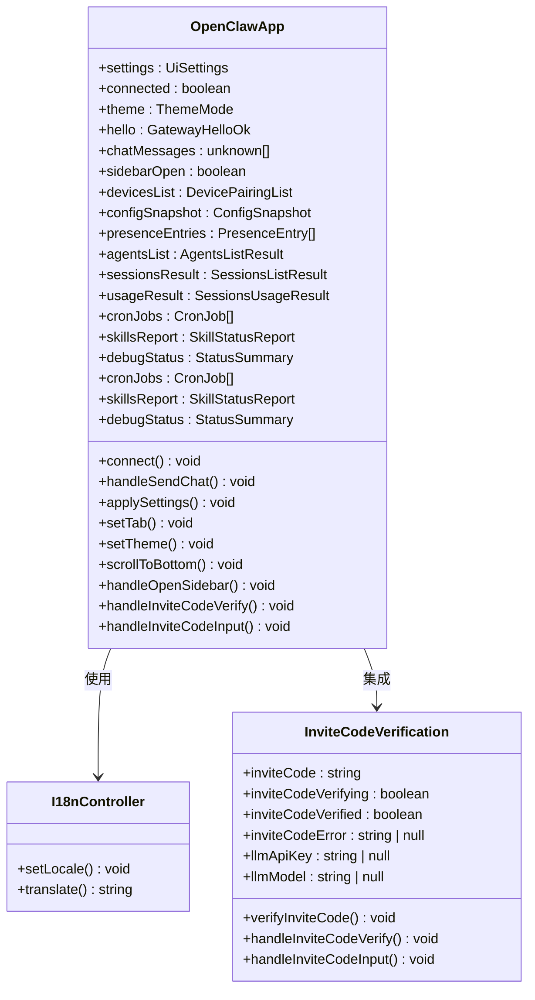
```mermaid
classDiagram
class OpenClawApp {
+settings : UiSettings
+connected : boolean
+theme : ThemeMode
+hello : GatewayHelloOk
+chatMessages : unknown[]
+sidebarOpen : boolean
+devicesList : DevicePairingList
+configSnapshot : ConfigSnapshot
+presenceEntries : PresenceEntry[]
+agentsList : AgentsListResult
+sessionsResult : SessionsListResult
+usageResult : SessionsUsageResult
+cronJobs : CronJob[]
+skillsReport : SkillStatusReport
+debugStatus : StatusSummary
+cronJobs : CronJob[]
+skillsReport : SkillStatusReport
+debugStatus : StatusSummary
+connect() void
+handleSendChat() void
+applySettings() void
+setTab() void
+setTheme() void
+scrollToBottom() void
+handleOpenSidebar() void
+handleInviteCodeVerify() void
+handleInviteCodeInput() void
}
class I18nController {
+setLocale() void
+translate() string
}
class InviteCodeVerification {
+inviteCode : string
+inviteCodeVerifying : boolean
+inviteCodeVerified : boolean
+inviteCodeError : string | null
+llmApiKey : string | null
+llmModel : string | null
+verifyInviteCode() void
+handleInviteCodeVerify() void
+handleInviteCodeInput() void
}
OpenClawApp --> I18nController : 使用
OpenClawApp --> InviteCodeVerification : 集成
```

**图表来源**
- [app.ts:110-630](file://ui/src/ui/app.ts#L110-L630)
- [app-invite-code.ts:132-186](file://ui/src/ui/app-invite-code.ts#L132-L186)

### React UI核心组件（shadcn/ui设计系统）

React实现已完全迁移到shadcn/ui设计系统，采用了现代化的组件架构，使用Zustand进行状态管理，并引入了新的UI组件和增强的设置存储系统：

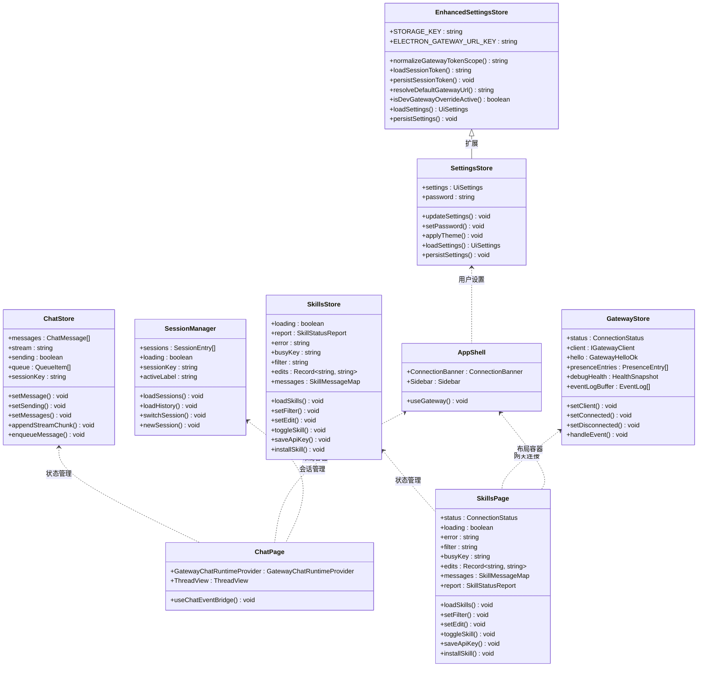
```mermaid
classDiagram
class ChatStore {
+messages : ChatMessage[]
+stream : string
+sending : boolean
+queue : QueueItem[]
+sessionKey : string
+setMessage() void
+setSending() void
+setMessages() void
+appendStreamChunk() void
+enqueueMessage() void
}
class SkillsStore {
+loading : boolean
+report : SkillStatusReport
+error : string
+busyKey : string
+filter : string
+edits : Record~string, string~
+messages : SkillMessageMap
+loadSkills() void
+setFilter() void
+setEdit() void
+toggleSkill() void
+saveApiKey() void
+installSkill() void
}
class GatewayStore {
+status : ConnectionStatus
+client : IGatewayClient
+hello : GatewayHelloOk
+presenceEntries : PresenceEntry[]
+debugHealth : HealthSnapshot
+eventLogBuffer : EventLog[]
+setClient() void
+setConnected() void
+setDisconnected() void
+handleEvent() void
}
class SettingsStore {
+settings : UiSettings
+password : string
+updateSettings() void
+setPassword() void
+applyTheme() void
+loadSettings() UiSettings
+persistSettings() void
}
class AppShell {
+useGateway() void
+ConnectionBanner : ConnectionBanner
+Sidebar : Sidebar
}
class ChatPage {
+useChatEventBridge() void
+GatewayChatRuntimeProvider : GatewayChatRuntimeProvider
+ThreadView : ThreadView
}
class SkillsPage {
+status : ConnectionStatus
+loading : boolean
+error : string
+filter : string
+busyKey : string
+edits : Record~string, string~
+messages : SkillMessageMap
+report : SkillStatusReport
+loadSkills() void
+setFilter() void
+setEdit() void
+toggleSkill() void
+saveApiKey() void
+installSkill() void
}
class SessionManager {
+sessions : SessionEntry[]
+loading : boolean
+sessionKey : string
+activeLabel : string
+loadSessions() void
+loadHistory() void
+switchSession() void
+newSession() void
}
class EnhancedSettingsStore {
+STORAGE_KEY : string
+ELECTRON_GATEWAY_URL_KEY : string
+normalizeGatewayTokenScope() string
+loadSessionToken() string
+persistSessionToken() void
+resolveDefaultGatewayUrl() string
+isDevGatewayOverrideActive() boolean
+loadSettings() UiSettings
+persistSettings() void
}
EnhancedSettingsStore <|-- SettingsStore : 扩展
ChatStore <.. ChatPage : 状态管理
SkillsStore <.. SkillsPage : 状态管理
GatewayStore <.. SkillsPage : 网关连接
SettingsStore <.. AppShell : 用户设置
AppShell <.. ChatPage : 布局容器
AppShell <.. SkillsPage : 布局容器
SessionManager <.. ChatPage : 会话管理
```

**图表来源**
- [chat.store.ts:135-230](file://ui-react/src/store/chat.store.ts#L135-L230)
- [skills.store.ts:16-32](file://ui-react/src/store/skills.store.ts#L16-L32)
- [gateway.store.ts:41-68](file://ui-react/src/store/gateway.store.ts#L41-L68)
- [settings.store.ts:193-200](file://ui-react/src/store/settings.store.ts#L193-L200)
- [AppShell.tsx:10-26](file://ui-react/src/components/layout/AppShell.tsx#L10-L26)
- [ChatPage.tsx:6-21](file://ui-react/src/pages/ChatPage.tsx#L6-L21)
- [SkillsPage.tsx:10-31](file://ui-react/src/pages/SkillsPage.tsx#L10-L31)
- [useSessionManager.ts:19-139](file://ui-react/src/hooks/useSessionManager.ts#L19-L139)
- [settings.store.ts:1-295](file://ui-react/src/store/settings.store.ts#L1-L295)

**章节来源**
- [app.ts:110-630](file://ui/src/ui/app.ts#L110-L630)
- [chat.store.ts:135-230](file://ui-react/src/store/chat.store.ts#L135-L230)
- [skills.store.ts:16-32](file://ui-react/src/store/skills.store.ts#L16-L32)
- [useSessionManager.ts:19-139](file://ui-react/src/hooks/useSessionManager.ts#L19-L139)
- [settings.store.ts:1-295](file://ui-react/src/store/settings.store.ts#L1-L295)

## 架构概览

UI组件系统采用分层架构设计，实现了清晰的关注点分离，**新增了基于增强设置存储的统一配置管理和优化的会话管理器，以及完整的邀请码验证系统**：

```mermaid
graph TB
subgraph "用户界面层"
A[Chat界面] --> B[消息渲染]
A --> C[工具调用显示]
D[Skills界面] --> E[技能卡片展示]
D --> F[技能状态管理]
D --> G[API密钥管理]
H[配置管理] --> I[表单验证]
H --> J[实时预览]
K[设备监控] --> L[节点状态]
K --> M[执行审批]
N[布局系统] --> O[AppSidebar]
N --> P[ChatSidebar]
N --> Q[新Sidebar组件]
R[Profile界面] --> S[模板选择]
R --> T[表单编辑]
R --> U[文件上传]
R --> V[Markdown渲染]
R --> W[邀请码验证]
W --> X[邀请码输入控件]
W --> Y[API密钥获取]
W --> Z[模型配置管理]
end
subgraph "增强设置存储层"
W[SettingsStore] --> X[网关URL解析]
W --> Y[令牌持久化]
W --> Z[URL标准化]
X --> AA[开发环境检测]
X --> AB[Electron应用程序处理]
Y --> AC[会话存储管理]
Y --> AD[令牌作用域隔离]
Z --> AE[URL规范化]
AA --> AF[端口检测]
AB --> AG[协议处理]
end
subgraph "会话管理层"
AH[会话管理器] --> AI[会话列表获取]
AH --> AJ[历史记录加载]
AH --> AK[会话切换处理]
AH --> AL[新会话创建]
AI --> AM[错误回退机制]
AJ --> AN[工具结果合并]
AK --> AO[设置会话键]
AL --> AP[会话持久化]
end
subgraph "shadcn/ui组件层"
AQ[基础UI组件] --> AR[Checkbox]
AQ --> AS[Sheet]
AQ --> AT[Switch]
AQ --> AU[Button]
AQ --> AV[Input]
AQ --> AW[Separator]
AQ --> AX[Tooltip]
end
subgraph "状态管理层"
AY[Zustand Store] --> AZ[聊天状态]
AY --> BA[技能状态]
AY --> BB[网关连接]
AY --> BC[用户设置]
BD[Lit Reactive Properties] --> BE[应用状态]
BD --> BF[主题切换]
BD --> BG[语言切换]
BH[Profile状态管理] --> BI[模板状态]
BH --> BJ[编辑状态]
BH --> BK[文件状态]
BH --> BL[分析状态]
BH --> BM[邀请码状态]
end
subgraph "数据传输层"
BN[WebSocket客户端] --> BO[实时事件]
BN --> BP[流式响应]
BN --> BQ[批量更新]
BR[HTTP API] --> BS[配置读取]
BR --> BT[日志获取]
BR --> BU[会话列表]
BR --> BV[技能状态查询]
BW[Profile API] --> BX[模板加载]
BW --> BY[文件上传]
BW --> BZ[内容保存]
BW --> CA[邀请码验证]
CA --> CB[API密钥获取]
CA --> CC[模型配置]
end
subgraph "外部集成"
CD[Gateway协议] --> BN
CE[浏览器API] --> CF[剪贴板]
CE --> CG[文件上传]
CE --> CH[通知权限]
CI[移动端检测] --> CJ[useIsMobile钩子]
CJ --> CK[响应式设计]
CL[会话事件桥接] --> CM[历史重载回调]
CM --> CN[聊天状态同步]
CO[设置存储集成] --> CP[URL解析]
CO --> CQ[令牌管理]
CO --> CR[配置持久化]
CS[Profile集成] --> CT[导航标签]
CS --> CU[界面组件]
CS --> CV[国际化支持]
CW[邀请码集成] --> CX[InviteCodeClient]
CW --> CY[verifyInviteCode函数]
CW --> CZ[handleInviteCodeVerify函数]
CL --> CO
CI --> CL
```

**图表来源**
- [app.ts:110-630](file://ui/src/ui/app.ts#L110-L630)
- [chat.store.ts:135-230](file://ui-react/src/store/chat.store.ts#L135-L230)
- [skills.store.ts:71-197](file://ui-react/src/store/skills.store.ts#L71-L197)
- [sidebar.tsx:1-694](file://ui-react/src/components/ui/sidebar.tsx#L1-L694)
- [checkbox.tsx:1-26](file://ui-react/src/components/ui/checkbox.tsx#L1-L26)
- [sheet.tsx:1-134](file://ui-react/src/components/ui/sheet.tsx#L1-L134)
- [switch.tsx:1-33](file://ui-react/src/components/ui/switch.tsx#L1-L33)
- [use-mobile.ts:1-20](file://ui-react/src/hooks/use-mobile.ts#L1-L20)
- [useSessionManager.ts:19-139](file://ui-react/src/hooks/useSessionManager.ts#L19-L139)
- [useChatEventBridge.ts:1-200](file://ui-react/src/hooks/useChatEventBridge.ts#L1-L200)
- [settings.store.ts:1-295](file://ui-react/src/store/settings.store.ts#L1-L295)
- [navigation.ts:1-176](file://ui/src/ui/navigation.ts#L1-L176)
- [profile.ts:1-1370](file://ui/src/ui/views/profile.ts#L1-L1370)
- [app-invite-code.ts:1-186](file://ui/src/ui/app-invite-code.ts#L1-L186)
- [invite-code-client.ts:1-230](file://ui/src/ui/invite-code-client.ts#L1-L230)

## 详细组件分析

### 聊天界面组件

#### Lit实现的聊天组件

聊天界面是UI系统的核心组件，负责处理用户与AI助手的交互：

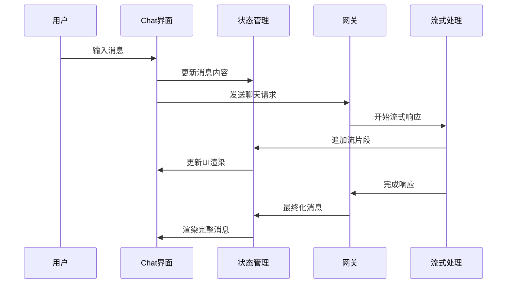
```mermaid
sequenceDiagram
participant User as 用户
participant Chat as Chat界面
participant Store as 状态管理
participant Gateway as 网关
participant Stream as 流式处理
User->>Chat : 输入消息
Chat->>Store : 更新消息内容
Chat->>Gateway : 发送聊天请求
Gateway->>Stream : 开始流式响应
Stream->>Store : 追加流片段
Store->>Chat : 更新UI渲染
Stream->>Gateway : 完成响应
Gateway->>Store : 最终化消息
Store->>Chat : 渲染完整消息
```

**图表来源**
- [app.ts:497-506](file://ui/src/ui/app.ts#L497-L506)
- [chat.store.ts:166-203](file://ui-react/src/store/chat.store.ts#L166-L203)

#### React实现的聊天组件

React版本采用了更现代的状态管理模式：

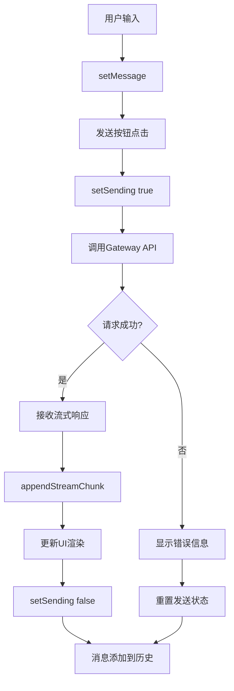
```mermaid
flowchart TD
A[用户输入] --> B[setMessage]
B --> C[发送按钮点击]
C --> D[setSending true]
D --> E[调用Gateway API]
E --> F{请求成功?}
F --> |是| G[接收流式响应]
F --> |否| H[显示错误信息]
G --> I[appendStreamChunk]
I --> J[更新UI渲染]
J --> K[setSending false]
H --> L[重置发送状态]
K --> M[消息添加到历史]
L --> M
```

**图表来源**
- [ChatPage.tsx:6-21](file://ui-react/src/pages/ChatPage.tsx#L6-L21)
- [chat.store.ts:166-229](file://ui-react/src/store/chat.store.ts#L166-L229)

**章节来源**
- [app.ts:497-506](file://ui/src/ui/app.ts#L497-L506)
- [ChatPage.tsx:6-21](file://ui-react/src/pages/ChatPage.tsx#L6-L21)
- [chat.store.ts:166-229](file://ui-react/src/store/chat.store.ts#L166-L229)

### 邀请码验证系统

**新增** 完整的邀请码验证UI组件系统，提供了API密钥获取和模型配置管理功能：

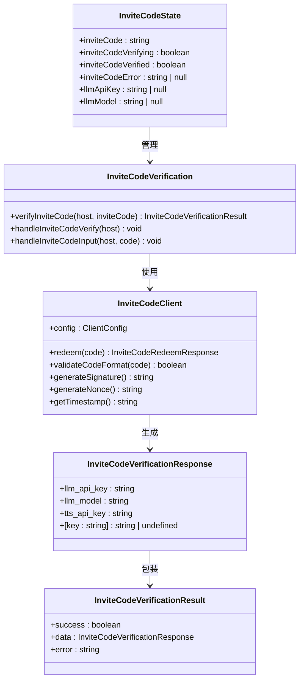
```mermaid
classDiagram
class InviteCodeClient {
+config : ClientConfig
+redeem(code) InviteCodeRedeemResponse
+validateCodeFormat(code) boolean
+generateSignature() string
+generateNonce() string
+getTimestamp() string
}
class InviteCodeVerificationResponse {
+llm_api_key : string
+llm_model : string
+tts_api_key : string
+[key : string] : string | undefined
}
class InviteCodeVerificationResult {
+success : boolean
+data : InviteCodeVerificationResponse
+error : string
}
class InviteCodeState {
+inviteCode : string
+inviteCodeVerifying : boolean
+inviteCodeVerified : boolean
+inviteCodeError : string | null
+llmApiKey : string | null
+llmModel : string | null
}
class InviteCodeVerification {
+verifyInviteCode(host, inviteCode) InviteCodeVerificationResult
+handleInviteCodeVerify(host) void
+handleInviteCodeInput(host, code) void
}
InviteCodeClient --> InviteCodeVerificationResponse : 生成
InviteCodeVerificationResponse --> InviteCodeVerificationResult : 包装
InviteCodeState --> InviteCodeVerification : 管理
InviteCodeVerification --> InviteCodeClient : 使用
```

**图表来源**
- [invite-code-client.ts:125-230](file://ui/src/ui/invite-code-client.ts#L125-L230)
- [app-invite-code.ts:8-19](file://ui/src/ui/app-invite-code.ts#L8-L19)
- [app-invite-code.ts:15-19](file://ui/src/ui/app-invite-code.ts#L15-L19)
- [app-invite-code.ts:31-106](file://ui/src/ui/app-invite-code.ts#L31-L106)
- [app-invite-code.ts:133-186](file://ui/src/ui/app-invite-code.ts#L133-L186)

#### 邀请码验证流程

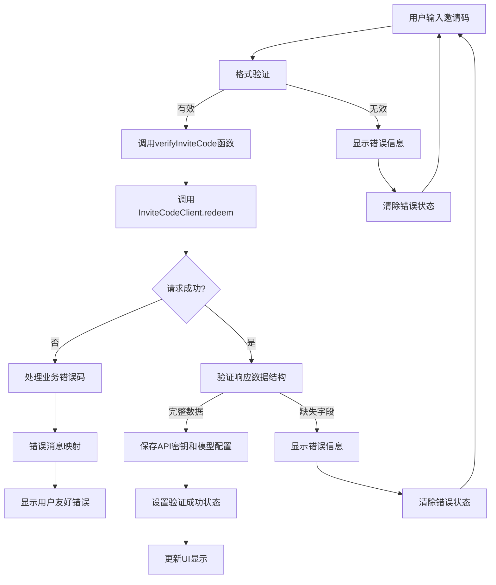
```mermaid
flowchart TD
A[用户输入邀请码] --> B[格式验证]
B --> |无效| C[显示错误信息]
B --> |有效| D[调用verifyInviteCode函数]
D --> E[调用InviteCodeClient.redeem]
E --> F{请求成功?}
F --> |否| G[处理业务错误码]
F --> |是| H[验证响应数据结构]
H --> |缺失字段| I[显示错误信息]
H --> |完整数据| J[保存API密钥和模型配置]
G --> K[错误消息映射]
K --> L[显示用户友好错误]
J --> M[设置验证成功状态]
M --> N[更新UI显示]
C --> O[清除错误状态]
I --> P[清除错误状态]
O --> A
P --> A
```

**图表来源**
- [app-invite-code.ts:31-106](file://ui/src/ui/app-invite-code.ts#L31-L106)
- [app-invite-code.ts:116-127](file://ui/src/ui/app-invite-code.ts#L116-L127)
- [app-invite-code.ts:146-176](file://ui/src/ui/app-invite-code.ts#L146-L176)

#### 邀请码输入控件

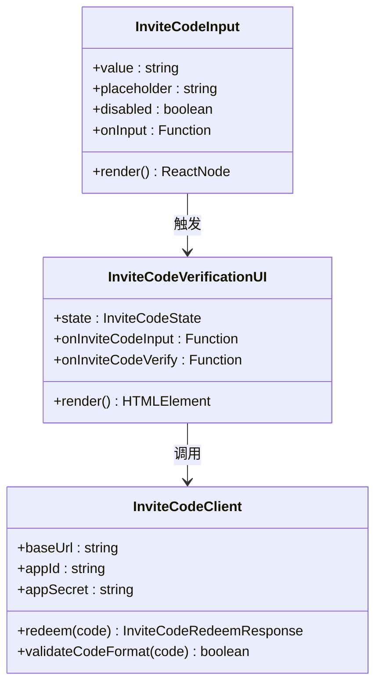
```mermaid
classDiagram
class InviteCodeInput {
+value : string
+placeholder : string
+disabled : boolean
+onInput : Function
+render() ReactNode
}
class InviteCodeVerificationUI {
+state : InviteCodeState
+onInviteCodeInput : Function
+onInviteCodeVerify : Function
+render() HTMLElement
}
class InviteCodeClient {
+baseUrl : string
+appId : string
+appSecret : string
+redeem(code) InviteCodeRedeemResponse
+validateCodeFormat(code) boolean
}
InviteCodeInput --> InviteCodeVerificationUI : 触发
InviteCodeVerificationUI --> InviteCodeClient : 调用
```

**图表来源**
- [profile.ts:866-889](file://ui/src/ui/views/profile.ts#L866-L889)
- [app-invite-code.ts:178-186](file://ui/src/ui/app-invite-code.ts#L178-L186)
- [invite-code-client.ts:208-213](file://ui/src/ui/invite-code-client.ts#L208-L213)

**章节来源**
- [app-invite-code.ts:1-186](file://ui/src/ui/app-invite-code.ts#L1-L186)
- [invite-code-client.ts:1-230](file://ui/src/ui/invite-code-client.ts#L1-L230)
- [profile.ts:848-919](file://ui/src/ui/views/profile.ts#L848-L919)

### Profile界面组件系统

**新增** 基于Lit框架的完整Profile界面组件系统，提供了个人资料管理和模板编辑功能，**集成了邀请码验证功能**：

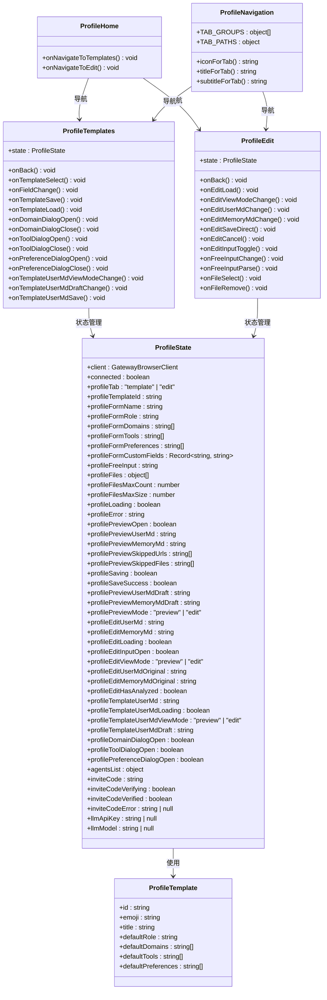
```mermaid
classDiagram
class ProfileState {
+client : GatewayBrowserClient
+connected : boolean
+profileTab : "template" | "edit"
+profileTemplateId : string
+profileFormName : string
+profileFormRole : string
+profileFormDomains : string[]
+profileFormTools : string[]
+profileFormPreferences : string[]
+profileFormCustomFields : Record~string, string~
+profileFreeInput : string
+profileFiles : object[]
+profileFilesMaxCount : number
+profileFilesMaxSize : number
+profileLoading : boolean
+profileError : string
+profilePreviewOpen : boolean
+profilePreviewUserMd : string
+profilePreviewMemoryMd : string
+profilePreviewSkippedUrls : string[]
+profilePreviewSkippedFiles : string[]
+profileSaving : boolean
+profileSaveSuccess : boolean
+profilePreviewUserMdDraft : string
+profilePreviewMemoryMdDraft : string
+profilePreviewMode : "preview" | "edit"
+profileEditUserMd : string
+profileEditMemoryMd : string
+profileEditLoading : boolean
+profileEditInputOpen : boolean
+profileEditViewMode : "preview" | "edit"
+profileEditUserMdOriginal : string
+profileEditMemoryMdOriginal : string
+profileEditHasAnalyzed : boolean
+profileTemplateUserMd : string
+profileTemplateUserMdLoading : boolean
+profileTemplateUserMdViewMode : "preview" | "edit"
+profileTemplateUserMdDraft : string
+profileDomainDialogOpen : boolean
+profileToolDialogOpen : boolean
+profilePreferenceDialogOpen : boolean
+agentsList : object
+inviteCode : string
+inviteCodeVerifying : boolean
+inviteCodeVerified : boolean
+inviteCodeError : string | null
+llmApiKey : string | null
+llmModel : string | null
}
class ProfileTemplate {
+id : string
+emoji : string
+title : string
+defaultRole : string
+defaultDomains : string[]
+defaultTools : string[]
+defaultPreferences : string[]
}
class ProfileHome {
+onNavigateToTemplates() void
+onNavigateToEdit() void
}
class ProfileTemplates {
+state : ProfileState
+onBack() void
+onTemplateSelect() void
+onFieldChange() void
+onTemplateSave() void
+onTemplateLoad() void
+onDomainDialogOpen() void
+onDomainDialogClose() void
+onToolDialogOpen() void
+onToolDialogClose() void
+onPreferenceDialogOpen() void
+onPreferenceDialogClose() void
+onTemplateUserMdViewModeChange() void
+onTemplateUserMdDraftChange() void
+onTemplateUserMdSave() void
}
class ProfileEdit {
+state : ProfileState
+onBack() void
+onEditLoad() void
+onEditViewModeChange() void
+onEditUserMdChange() void
+onEditMemoryMdChange() void
+onEditSaveDirect() void
+onEditCancel() void
+onEditInputToggle() void
+onFreeInputChange() void
+onFreeInputParse() void
+onFileSelect() void
+onFileRemove() void
}
class ProfileNavigation {
+TAB_GROUPS : object[]
+TAB_PATHS : object
+iconForTab() string
+titleForTab() string
+subtitleForTab() string
}
ProfileState --> ProfileTemplate : 使用
ProfileHome --> ProfileTemplates : 导航
ProfileHome --> ProfileEdit : 导航
ProfileTemplates --> ProfileState : 状态管理
ProfileEdit --> ProfileState : 状态管理
ProfileNavigation --> ProfileTemplates : 导航
ProfileNavigation --> ProfileEdit : 导航
```

**图表来源**
- [profile.ts:8-70](file://ui/src/ui/views/profile.ts#L8-L70)
- [profile.ts:842-996](file://ui/src/ui/views/profile.ts#L842-L996)
- [profile.ts:1019-1453](file://ui/src/ui/views/profile.ts#L1019-L1453)
- [navigation.ts:4-13](file://ui/src/ui/navigation.ts#L4-L13)

#### Profile界面特性

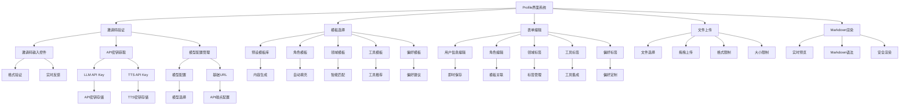
```mermaid
flowchart TD
A[Profile界面系统] --> B[模板选择]
A --> C[表单编辑]
A --> D[文件上传]
A --> E[Markdown渲染]
A --> F[邀请码验证]
F --> G[邀请码输入控件]
F --> H[API密钥获取]
F --> I[模型配置管理]
B --> J[预设模板库]
B --> K[角色模板]
B --> L[领域模板]
B --> M[工具模板]
B --> N[偏好模板]
C --> O[用户信息编辑]
C --> P[角色编辑]
C --> Q[领域标签]
C --> R[工具标签]
C --> S[偏好标签]
D --> T[文件选择]
D --> U[拖拽上传]
D --> V[格式限制]
D --> W[大小限制]
E --> X[实时预览]
E --> Y[Markdown语法]
E --> Z[安全渲染]
G --> AA[格式验证]
G --> BB[实时反馈]
H --> CC[LLM API Key]
H --> DD[TTS API Key]
I --> EE[模型配置]
I --> FF[基础URL]
J --> GG[内容生成]
K --> HH[自动填充]
L --> II[智能匹配]
M --> JJ[工具推荐]
N --> KK[偏好建议]
O --> LL[即时保存]
P --> MM[模板关联]
Q --> NN[标签管理]
R --> OO[工具集成]
S --> PP[偏好定制]
CC --> QQ[API密钥存储]
DD --> RR[TTS密钥存储]
EE --> SS[模型选择]
FF --> TT[API端点配置]
```

**图表来源**
- [profile.ts:77-123](file://ui/src/ui/views/profile.ts#L77-L123)
- [profile.ts:271-284](file://ui/src/ui/views/profile.ts#L271-L284)
- [profile.ts:314-361](file://ui/src/ui/views/profile.ts#L314-L361)
- [profile.ts:448-475](file://ui/src/ui/views/profile.ts#L448-L475)
- [profile.ts:858-919](file://ui/src/ui/views/profile.ts#L858-L919)

**章节来源**
- [profile.ts:1-1370](file://ui/src/ui/views/profile.ts#L1-L1370)
- [navigation.ts:1-176](file://ui/src/ui/navigation.ts#L1-L176)

### 增强设置存储系统

**新增** 基于增强设置存储的统一配置管理，显著提升了网关URL解析、令牌持久化和开发环境检测能力：

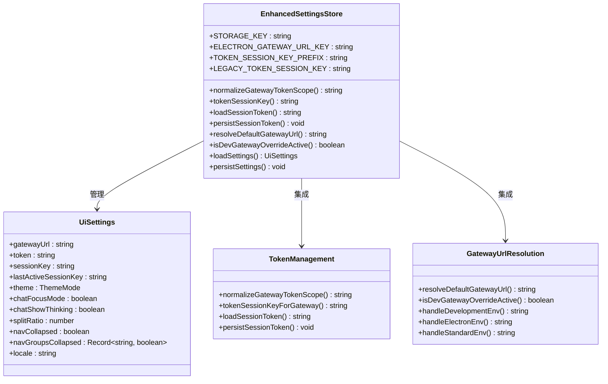
```mermaid
classDiagram
class EnhancedSettingsStore {
+STORAGE_KEY : string
+ELECTRON_GATEWAY_URL_KEY : string
+TOKEN_SESSION_KEY_PREFIX : string
+LEGACY_TOKEN_SESSION_KEY : string
+normalizeGatewayTokenScope() string
+tokenSessionKey() string
+loadSessionToken() string
+persistSessionToken() void
+resolveDefaultGatewayUrl() string
+isDevGatewayOverrideActive() boolean
+loadSettings() UiSettings
+persistSettings() void
}
class UiSettings {
+gatewayUrl : string
+token : string
+sessionKey : string
+lastActiveSessionKey : string
+theme : ThemeMode
+chatFocusMode : boolean
+chatShowThinking : boolean
+splitRatio : number
+navCollapsed : boolean
+navGroupsCollapsed : Record~string, boolean~
+locale : string
}
class TokenManagement {
+normalizeGatewayTokenScope() string
+tokenSessionKeyForGateway() string
+loadSessionToken() string
+persistSessionToken() void
}
class GatewayUrlResolution {
+resolveDefaultGatewayUrl() string
+isDevGatewayOverrideActive() boolean
+handleDevelopmentEnv() string
+handleElectronEnv() string
+handleStandardEnv() string
}
EnhancedSettingsStore --> UiSettings : 管理
EnhancedSettingsStore --> TokenManagement : 集成
EnhancedSettingsStore --> GatewayUrlResolution : 集成
```

**图表来源**
- [settings.store.ts:1-295](file://ui-react/src/store/settings.store.ts#L1-L295)
- [storage.ts:11-23](file://ui/src/ui/storage.ts#L11-L23)
- [token.ts:1-10](file://apps/electron/src/main/token.ts#L1-L10)

#### 增强设置存储特性

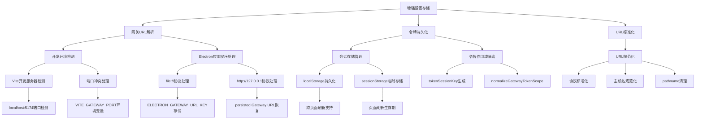
```mermaid
flowchart TD
A[增强设置存储] --> B[网关URL解析]
A --> C[令牌持久化]
A --> D[URL标准化]
B --> E[开发环境检测]
B --> F[Electron应用程序处理]
C --> G[会话存储管理]
C --> H[令牌作用域隔离]
D --> I[URL规范化]
E --> J[Vite开发服务器检测]
E --> K[端口冲突处理]
F --> L[file://协议处理]
F --> M[http://127.0.0.1协议处理]
G --> N[localStorage持久化]
G --> O[sessionStorage临时存储]
H --> P[tokenSessionKey生成]
H --> Q[normalizeGatewayTokenScope]
I --> R[协议标准化]
I --> S[主机名规范化]
I --> T[pathname清理]
J --> U[localhost:5174端口检测]
K --> V[VITE_GATEWAY_PORT环境变量]
L --> W[ELECTRON_GATEWAY_URL_KEY存储]
M --> X[persisted Gateway URL恢复]
N --> Y[跨页面刷新支持]
O --> Z[页面刷新生存期]
```

**图表来源**
- [settings.store.ts:65-102](file://ui-react/src/store/settings.store.ts#L65-L102)
- [settings.store.ts:35-63](file://ui-react/src/store/settings.store.ts#L35-L63)
- [settings.store.ts:114-175](file://ui-react/src/store/settings.store.ts#L114-L175)

**章节来源**
- [settings.store.ts:1-295](file://ui-react/src/store/settings.store.ts#L1-L295)
- [storage.ts:11-23](file://ui/src/ui/storage.ts#L11-L23)
- [token.ts:1-10](file://apps/electron/src/main/token.ts#L1-L10)

### 会话管理器组件

**新增** 优化的UI会话管理器，显著提升了用户界面的响应性和稳定性：

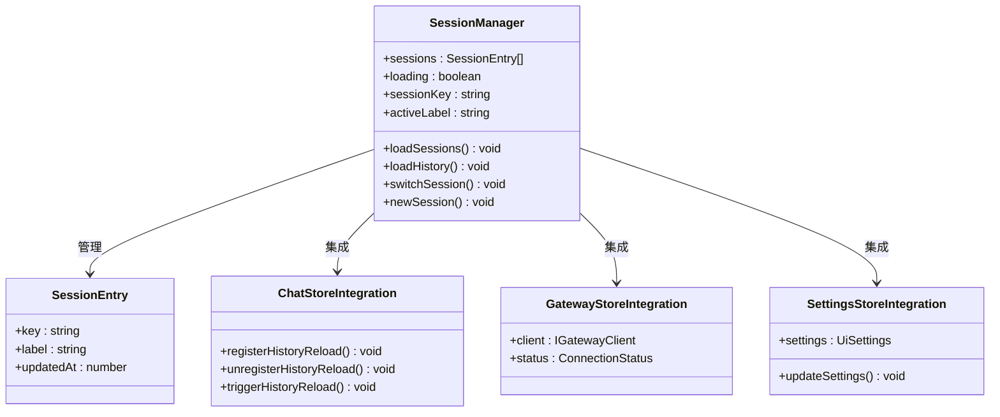
```mermaid
classDiagram
class SessionManager {
+sessions : SessionEntry[]
+loading : boolean
+sessionKey : string
+activeLabel : string
+loadSessions() void
+loadHistory() void
+switchSession() void
+newSession() void
}
class SessionEntry {
+key : string
+label : string
+updatedAt : number
}
class ChatStoreIntegration {
+registerHistoryReload() void
+unregisterHistoryReload() void
+triggerHistoryReload() void
}
class GatewayStoreIntegration {
+client : IGatewayClient
+status : ConnectionStatus
}
class SettingsStoreIntegration {
+updateSettings() void
+settings : UiSettings
}
SessionManager --> SessionEntry : 管理
SessionManager --> ChatStoreIntegration : 集成
SessionManager --> GatewayStoreIntegration : 集成
SessionManager --> SettingsStoreIntegration : 集成
```

**图表来源**
- [useSessionManager.ts:13-139](file://ui-react/src/hooks/useSessionManager.ts#L13-L139)
- [chat.store.ts:8-19](file://ui-react/src/store/chat.store.ts#L8-L19)
- [chat.store.ts:136-200](file://ui-react/src/store/chat.store.ts#L136-L200)

#### 会话管理器特性

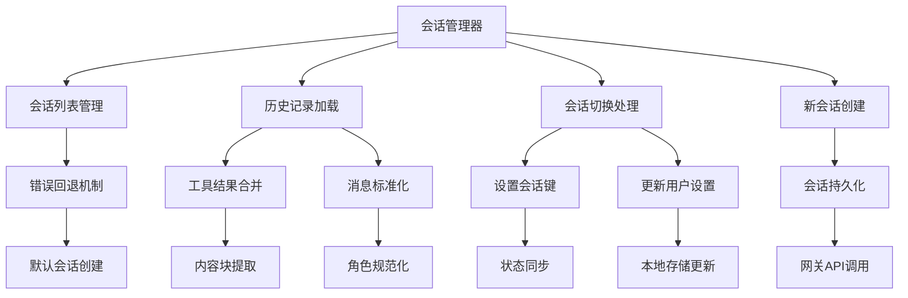
```mermaid
flowchart TD
A[会话管理器] --> B[会话列表管理]
A --> C[历史记录加载]
A --> D[会话切换处理]
A --> E[新会话创建]
B --> F[错误回退机制]
C --> G[工具结果合并]
C --> H[消息标准化]
D --> I[设置会话键]
D --> J[更新用户设置]
E --> K[会话持久化]
F --> L[默认会话创建]
G --> M[内容块提取]
H --> N[角色规范化]
I --> O[状态同步]
J --> P[本地存储更新]
K --> Q[网关API调用]
```

**图表来源**
- [useSessionManager.ts:29-42](file://ui-react/src/hooks/useSessionManager.ts#L29-L42)
- [useSessionManager.ts:45-82](file://ui-react/src/hooks/useSessionManager.ts#L45-L82)
- [useSessionManager.ts:85-92](file://ui-react/src/hooks/useSessionManager.ts#L85-L92)
- [useSessionManager.ts:95-109](file://ui-react/src/hooks/useSessionManager.ts#L95-L109)

**章节来源**
- [useSessionManager.ts:19-139](file://ui-react/src/hooks/useSessionManager.ts#L19-L139)
- [chat.store.ts:8-19](file://ui-react/src/store/chat.store.ts#L8-L19)
- [chat.store.ts:136-200](file://ui-react/src/store/chat.store.ts#L136-L200)

### 新的Sidebar组件系统

**新增** 基于shadcn/ui设计系统的全新Sidebar组件，提供了响应式的侧边栏导航功能：

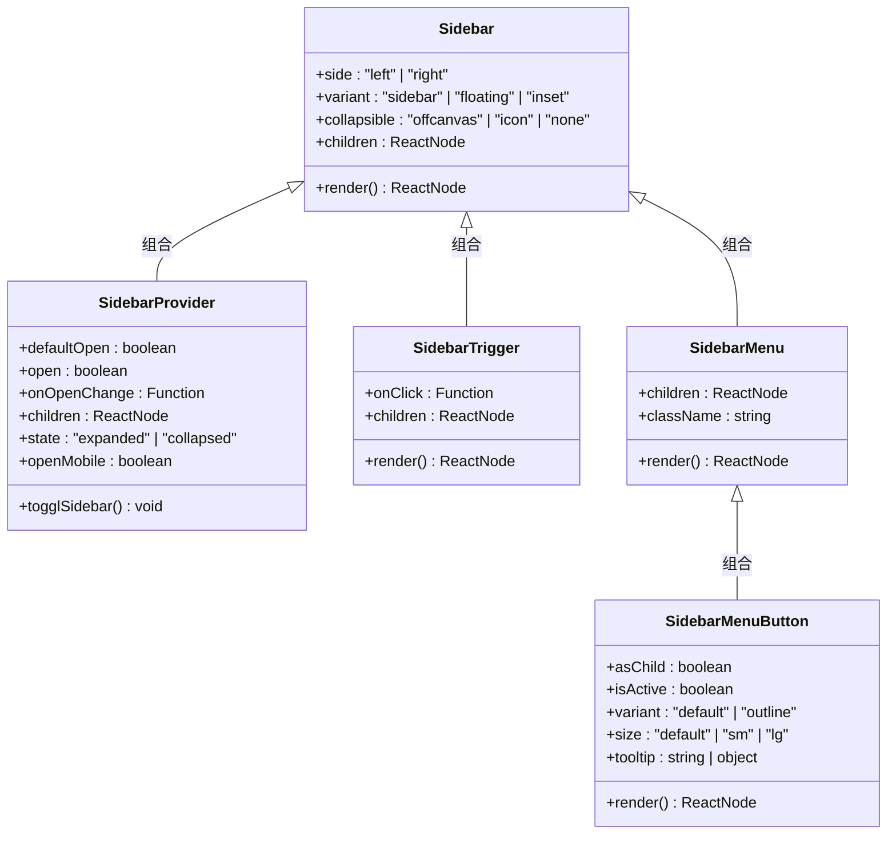
```mermaid
classDiagram
class Sidebar {
+side : "left" | "right"
+variant : "sidebar" | "floating" | "inset"
+collapsible : "offcanvas" | "icon" | "none"
+children : ReactNode
+render() ReactNode
}
class SidebarProvider {
+defaultOpen : boolean
+open : boolean
+onOpenChange : Function
+children : ReactNode
+state : "expanded" | "collapsed"
+openMobile : boolean
+togglSidebar() void
}
class SidebarTrigger {
+onClick : Function
+children : ReactNode
+render() ReactNode
}
class SidebarMenu {
+children : ReactNode
+className : string
+render() ReactNode
}
class SidebarMenuButton {
+asChild : boolean
+isActive : boolean
+variant : "default" | "outline"
+size : "default" | "sm" | "lg"
+tooltip : string | object
+render() ReactNode
}
Sidebar <|-- SidebarProvider : 组合
Sidebar <|-- SidebarTrigger : 组合
Sidebar <|-- SidebarMenu : 组合
SidebarMenu <|-- SidebarMenuButton : 组合
```

**图表来源**
- [sidebar.tsx:145-245](file://ui-react/src/components/ui/sidebar.tsx#L145-L245)
- [sidebar.tsx:50-143](file://ui-react/src/components/ui/sidebar.tsx#L50-L143)
- [sidebar.tsx:247-267](file://ui-react/src/components/ui/sidebar.tsx#L247-L267)
- [sidebar.tsx:432-524](file://ui-react/src/components/ui/sidebar.tsx#L432-L524)

#### Sidebar组件特性

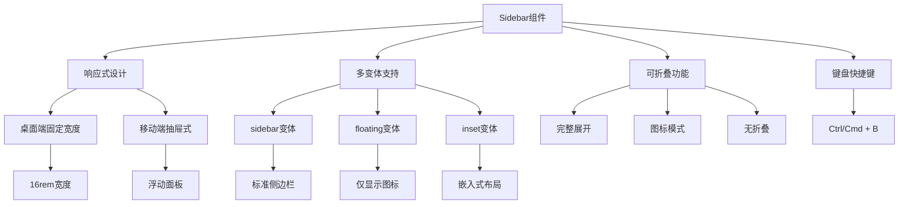
```mermaid
flowchart TD
A[Sidebar组件] --> B[响应式设计]
A --> C[多变体支持]
A --> D[可折叠功能]
A --> E[键盘快捷键]
B --> F[桌面端固定宽度]
B --> G[移动端抽屉式]
C --> H[sidebar变体]
C --> I[floating变体]
C --> J[inset变体]
D --> K[完整展开]
D --> L[图标模式]
D --> M[无折叠]
E --> N[Ctrl/Cmd + B]
F --> O[16rem宽度]
G --> P[浮动面板]
H --> Q[标准侧边栏]
I --> R[仅显示图标]
J --> S[嵌入式布局]
```

**图表来源**
- [sidebar.tsx:22-27](file://ui-react/src/components/ui/sidebar.tsx#L22-L27)
- [sidebar.tsx:145-245](file://ui-react/src/components/ui/sidebar.tsx#L145-L245)
- [sidebar.tsx:91-101](file://ui-react/src/components/ui/sidebar.tsx#L91-L101)

**章节来源**
- [sidebar.tsx:145-245](file://ui-react/src/components/ui/sidebar.tsx#L145-L245)
- [sidebar.tsx:50-143](file://ui-react/src/components/ui/sidebar.tsx#L50-L143)
- [sidebar.tsx:247-267](file://ui-react/src/components/ui/sidebar.tsx#L247-L267)
- [sidebar.tsx:432-524](file://ui-react/src/components/ui/sidebar.tsx#L432-L524)

### 新UI组件库

**新增** 基于shadcn/ui设计系统的完整组件库，包括Checkbox、Sheet、Switch等基础UI组件：

#### Checkbox组件

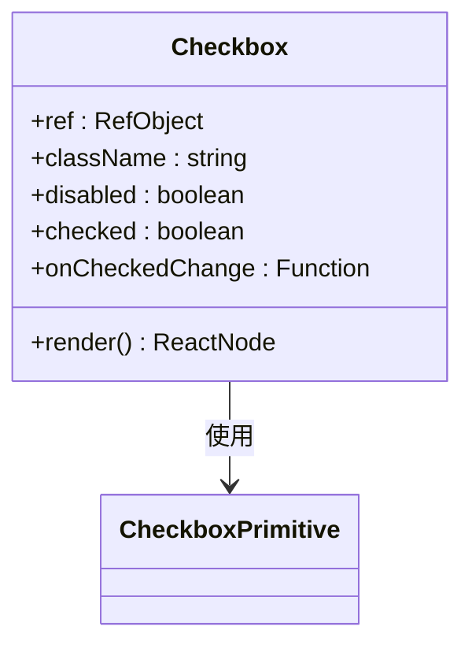
```mermaid
classDiagram
class Checkbox {
+ref : RefObject
+className : string
+disabled : boolean
+checked : boolean
+onCheckedChange : Function
+render() ReactNode
}
Checkbox --> CheckboxPrimitive : 使用
```

**图表来源**
- [checkbox.tsx:6-23](file://ui-react/src/components/ui/checkbox.tsx#L6-L23)

#### Sheet组件

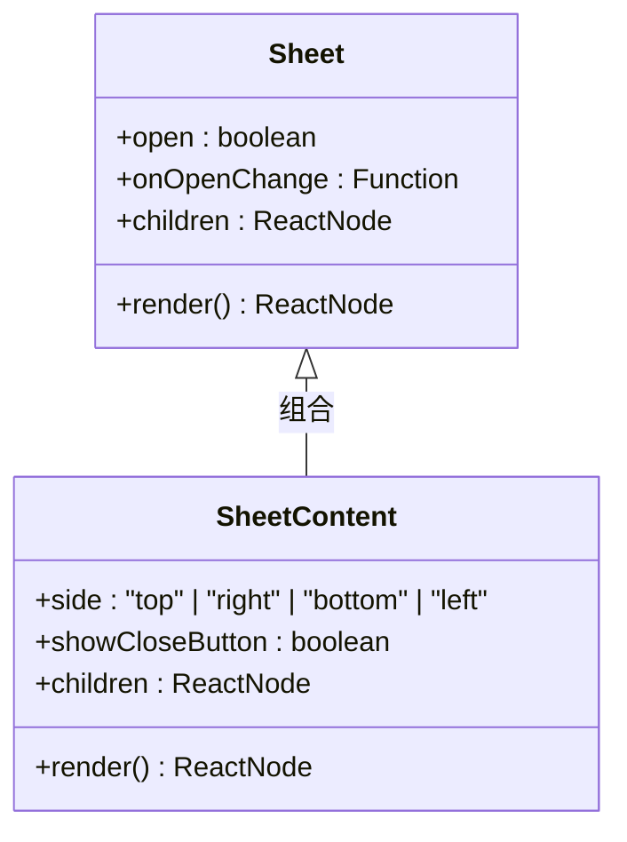
```mermaid
classDiagram
class Sheet {
+open : boolean
+onOpenChange : Function
+children : ReactNode
+render() ReactNode
}
class SheetContent {
+side : "top" | "right" | "bottom" | "left"
+showCloseButton : boolean
+children : ReactNode
+render() ReactNode
}
Sheet <|-- SheetContent : 组合
```

**图表来源**
- [sheet.tsx:8-18](file://ui-react/src/components/ui/sheet.tsx#L8-L18)
- [sheet.tsx:40-79](file://ui-react/src/components/ui/sheet.tsx#L40-L79)

#### Switch组件

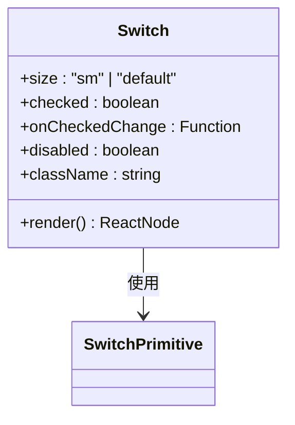
```mermaid
classDiagram
class Switch {
+size : "sm" | "default"
+checked : boolean
+onCheckedChange : Function
+disabled : boolean
+className : string
+render() ReactNode
}
Switch --> SwitchPrimitive : 使用
```

**图表来源**
- [switch.tsx:5-30](file://ui-react/src/components/ui/switch.tsx#L5-L30)

**章节来源**
- [checkbox.tsx:1-26](file://ui-react/src/components/ui/checkbox.tsx#L1-L26)
- [sheet.tsx:1-134](file://ui-react/src/components/ui/sheet.tsx#L1-L134)
- [switch.tsx:1-33](file://ui-react/src/components/ui/switch.tsx#L1-L33)

### 移动端适配系统

**新增** use-mobile钩子提供了统一的移动端检测功能，支持响应式设计：

```mermaid
flowchart TD
A[useIsMobile钩子] --> B[媒体查询监听]
A --> C[窗口尺寸检测]
A --> D[状态管理]
B --> E[matchMedia API]
C --> F[window.innerWidth]
D --> G[React状态]
E --> H[移动端断点: 768px]
F --> H
G --> I[返回布尔值]
H --> I
```

**图表来源**
- [use-mobile.ts:3-19](file://ui-react/src/hooks/use-mobile.ts#L3-L19)

#### 移动端检测逻辑

```mermaid
stateDiagram-v2
[*] --> 初始化
初始化 --> 监听变化 : 添加事件监听器
监听变化 --> 检测宽度 : 初始检测
检测宽度 --> 设置状态 : 更新isMobile状态
设置状态 --> 等待变化 : 组件挂载完成
等待变化 --> 监听变化 : 窗口大小变化
监听变化 --> 清理监听 : 组件卸载
清理监听 --> [*]
```

**图表来源**
- [use-mobile.ts:8-16](file://ui-react/src/hooks/use-mobile.ts#L8-L16)

**章节来源**
- [use-mobile.ts:1-20](file://ui-react/src/hooks/use-mobile.ts#L1-L20)

### 技能管理系统

**新增** 技能管理系统是React UI实现的重要组成部分，提供了完整的技能生命周期管理功能：

```mermaid
classDiagram
class SkillsPage {
+status : ConnectionStatus
+loading : boolean
+error : string
+filter : string
+busyKey : string
+edits : Record~string, string~
+messages : SkillMessageMap
+report : SkillStatusReport
+loadSkills() void
+setFilter() void
+setEdit() void
+toggleSkill() void
+saveApiKey() void
+installSkill() void
}
class SkillsStore {
+loading : boolean
+report : SkillStatusReport
+error : string
+busyKey : string
+filter : string
+edits : Record~string, string~
+messages : SkillMessageMap
+loadSkills() void
+setFilter() void
+setEdit() void
+toggleSkill() void
+saveApiKey() void
+installSkill() void
}
class SkillCard {
+skill : SkillStatusEntry
+busy : boolean
+apiKeyEdit : string
+message : SkillMessage
+onToggle() void
+onEdit() void
+onSaveKey() void
+onInstall() void
}
class SkillsToolbar {
+filter : string
+loading : boolean
+shownCount : number
+onFilterChange() void
+onRefresh() void
}
class SkillStatusBadges {
+skill : SkillStatusEntry
+showBundledBadge : boolean
}
SkillsPage --> SkillsStore : 状态管理
SkillsPage --> SkillsToolbar : 工具栏
SkillsPage --> SkillCard : 技能卡片
SkillCard --> SkillStatusBadges : 状态徽章
```

**图表来源**
- [SkillsPage.tsx:10-31](file://ui-react/src/pages/SkillsPage.tsx#L10-L31)
- [skills.store.ts:16-32](file://ui-react/src/store/skills.store.ts#L16-L32)
- [SkillCard.tsx:9-18](file://ui-react/src/components/skills/SkillCard.tsx#L9-L18)
- [SkillsToolbar.tsx:5-11](file://ui-react/src/components/skills/SkillsToolbar.tsx#L5-L11)
- [SkillStatusBadges.tsx:4-7](file://ui-react/src/components/skills/SkillStatusBadges.tsx#L4-L7)

#### 技能状态管理流程

```mermaid
stateDiagram-v2
[*] --> 未连接
未连接 --> 连接中 : 用户点击连接
连接中 --> 已连接 : 连接成功
连接中 --> 连接失败 : 连接超时
连接失败 --> 连接中 : 重新尝试
已连接 --> 加载技能 : 页面加载或刷新
加载技能 --> 显示技能 : 获取技能报告
加载技能 --> 错误状态 : 请求失败
显示技能 --> 搜索过滤 : 用户输入搜索
显示技能 --> 切换标签 : 用户切换分组
显示技能 --> 启用技能 : 用户点击启用
显示技能 --> 禁用技能 : 用户点击禁用
启用技能 --> 更新成功 : 成功启用
启用技能 --> 更新失败 : 启用失败
禁用技能 --> 更新成功 : 成功禁用
禁用技能 --> 更新失败 : 禁用失败
更新成功 --> 显示成功消息 : 显示成功提示
更新失败 --> 显示错误消息 : 显示错误提示
显示成功消息 --> 显示技能 : 返回技能列表
显示错误消息 --> 显示技能 : 返回技能列表
```

**图表来源**
- [skills.store.ts:80-105](file://ui-react/src/store/skills.store.ts#L80-L105)
- [skills.store.ts:111-137](file://ui-react/src/store/skills.store.ts#L111-L137)
- [skills.store.ts:139-165](file://ui-react/src/store/skills.store.ts#L139-L165)

#### 技能分组和筛选

```mermaid
flowchart LR
A[技能列表] --> B[技能分组]
B --> C[工作区技能]
B --> D[内置技能]
B --> E[已安装技能]
B --> F[额外技能]
B --> G[其他技能]
A --> H[搜索过滤]
H --> I[名称匹配]
H --> J[描述匹配]
H --> K[来源匹配]
I --> L[筛选结果]
J --> L
K --> L
```

**图表来源**
- [skills-grouping.ts:16-42](file://ui-react/src/lib/skills-grouping.ts#L16-L42)
- [SkillsPage.tsx:31-42](file://ui-react/src/pages/SkillsPage.tsx#L31-L42)

**章节来源**
- [SkillsPage.tsx:10-31](file://ui-react/src/pages/SkillsPage.tsx#L10-L31)
- [skills.store.ts:16-32](file://ui-react/src/store/skills.store.ts#L16-L32)
- [SkillCard.tsx:9-18](file://ui-react/src/components/skills/SkillCard.tsx#L9-L18)
- [SkillsToolbar.tsx:5-11](file://ui-react/src/components/skills/SkillsToolbar.tsx#L5-L11)
- [SkillStatusBadges.tsx:4-7](file://ui-react/src/components/skills/SkillStatusBadges.tsx#L4-L7)
- [skills-grouping.ts:16-42](file://ui-react/src/lib/skills-grouping.ts#L16-L42)

### 配置管理系统

配置管理界面提供了对OpenClaw系统的全面控制：

```mermaid
classDiagram
class ConfigManager {
+configSnapshot : ConfigSnapshot
+configForm : Record[string, unknown]
+configValid : boolean
+configIssues : unknown[]
+loadConfig() void
+saveConfig() void
+validateConfig() void
+applyConfig() void
}
class FormRenderer {
+renderForm() HTMLElement
+validateField() boolean
+getFieldValue() any
}
class SchemaValidator {
+validateSchema() boolean
+getValidationErrors() string[]
}
ConfigManager --> FormRenderer : 使用
ConfigManager --> SchemaValidator : 使用
```

**图表来源**
- [app.ts:183-204](file://ui/src/ui/app.ts#L183-L204)

### 设备监控组件

设备监控功能允许用户管理连接的设备和节点：

```mermaid
stateDiagram-v2
[*] --> 未连接
未连接 --> 连接中 : 用户点击连接
连接中 --> 已连接 : 连接成功
连接中 --> 连接失败 : 连接超时
连接失败 --> 连接中 : 重新尝试
已连接 --> 断开连接 : 用户断开
已连接 --> 设备发现 : 新设备加入
设备发现 --> 已连接 : 设备就绪
断开连接 --> 未连接 : 断开完成
```

**图表来源**
- [app.ts:164-179](file://ui/src/ui/app.ts#L164-L179)

**章节来源**
- [app.ts:183-204](file://ui/src/ui/app.ts#L183-L204)
- [app.ts:164-179](file://ui/src/ui/app.ts#L164-L179)

### 国际化支持增强

**新增** 增强的国际化支持系统，包括Profile相关的标签和字幕翻译：

```mermaid
classDiagram
class I18nController {
+currentLocale : string
+translations : TranslationMap
+setLocale() void
+translate() string
+loadTranslations() void
}
class TranslationMap {
+common : object
+nav : object
+tabs : object
+subtitles : object
+overview : object
+chat : object
+languages : object
+cron : object
}
class ProfileTranslations {
+tabs : object
+subtitles : object
}
class LocaleFiles {
+en : TranslationMap
+zhCN : TranslationMap
+zhTW : TranslationMap
+ptBR : TranslationMap
+de : TranslationMap
+es : TranslationMap
}
I18nController --> TranslationMap : 使用
TranslationMap --> ProfileTranslations : 包含
ProfileTranslations --> LocaleFiles : 来源
```

**图表来源**
- [en.ts:3-40](file://ui/src/i18n/locales/en.ts#L3-L40)

#### 国际化特性

```mermaid
flowchart TD
A[国际化系统] --> B[多语言支持]
A --> C[动态切换]
A --> D[翻译映射]
B --> E[英语]
B --> F[简体中文]
B --> G[繁体中文]
B --> H[葡萄牙语]
B --> I[德语]
B --> J[西班牙语]
C --> K[运行时切换]
C --> L[状态同步]
D --> M[标签翻译]
D --> N[字幕翻译]
D --> O[界面文本]
M --> P[Profile标签]
M --> Q[导航标签]
N --> R[Profile字幕]
N --> S[功能说明]
O --> T[用户提示]
O --> U[错误信息]
P --> V[Profile]
P --> W[Profile Templates]
P --> X[Profile Edit]
Q --> Y[Profile导航]
Q --> Z[Profile功能]
R --> AA[Profile更新]
R --> BB[Profile管理]
S --> CC[个人资料]
S --> DD[记忆文件]
T --> EE[操作提示]
T --> FF[状态信息]
U --> GG[错误提示]
U --> HH[警告信息]
```

**图表来源**
- [en.ts:25-56](file://ui/src/i18n/locales/en.ts#L25-L56)

**章节来源**
- [en.ts:1-341](file://ui/src/i18n/locales/en.ts#L1-L341)

## 依赖关系分析

### 依赖图谱

```mermaid
graph TB
subgraph "Lit UI依赖"
A[lit] --> B[Web Components]
C[@lit-labs/signals] --> D[响应式信号]
E[marked] --> F[Markdown渲染]
G[dompurify] --> H[HTML清理]
I[ui/src/ui/views/profile.ts] --> J[Profile界面组件]
I --> K[模板系统]
I --> L[文件上传]
I --> M[Markdown编辑]
I --> N[邀请码验证]
N --> O[InviteCodeClient]
N --> P[verifyInviteCode函数]
N --> Q[handleInviteCodeVerify函数]
R[ui/src/ui/navigation.ts] --> S[Profile导航标签]
R --> T[用户图标]
U[ui/src/i18n/locales/en.ts] --> V[Profile翻译]
U --> W[标签翻译]
U --> X[字幕翻译]
Y[ui/src/ui/app-invite-code.ts] --> Z[邀请码验证逻辑]
Y --> AA[handleInviteCodeVerify函数]
Y --> AB[handleInviteCodeInput函数]
AC[ui/src/ui/invite-code-client.ts] --> AD[InviteCodeClient类]
AC --> AE[签名生成]
AC --> AF[格式验证]
end
subgraph "React UI依赖shadcn/ui"
BB[react] --> CC[JSX渲染]
DD[zustand] --> EE[状态管理]
FF[react-router] --> GG[路由管理]
HH[@assistant-ui/react] --> II[AI聊天组件]
JJ[shadcn/ui] --> KK[设计系统]
KK --> LL[sidebar组件]
KK --> MM[checkbox组件]
KK --> NN[sheet组件]
KK --> OO[switch组件]
PP[radix-ui/react-*] --> QQ[基础UI组件]
RR[lucide-react] --> SS[图标库]
TT[use-mobile钩子] --> UU[移动端检测]
TT --> VV[响应式设计]
WW[useSessionManager钩子] --> XX[会话管理]
WW --> YY[历史加载]
WW --> ZZ[错误回退]
AAA[增强设置存储] --> BBB[网关URL解析]
AAA --> CCC[令牌持久化]
AAA --> DDD[URL标准化]
BBB --> EEE[开发环境检测]
BBB --> FFF[Electron处理]
CCC --> GGG[会话存储]
CCC --> HHH[令牌作用域]
DDD --> III[URL规范化]
EEE --> JJJ[Vite开发检测]
FFF --> KKK[file://协议处理]
GGG --> LLL[localStorage]
HHH --> MMM[sessionStorage]
NNN[React导航系统] --> OOO[路由配置]
NNN[React导航系统] --> PPP[导航组件]
NNN[React导航系统] --> QQQ[图标系统]
NNN[React导航系统] --> RRR[标签系统]
SSS[React国际化] --> TTT[翻译映射]
SSS[React国际化] --> UUU[动态切换]
SSS[React国际化] --> VVV[多语言支持]
end
subgraph "开发工具"
WWW[vite] --> XXX[构建工具]
YYY[typescript] --> ZZZ[类型检查]
AAA[vitest] --> BBB[测试框架]
end
subgraph "Electron集成"
CCC[Electron主进程] --> DDD[window.ts]
CCC --> EEE[gateway.ts]
CCC --> FFF[token.ts]
DDD --> GGG[URL注入]
EEE --> HHH[网关管理]
FFF --> III[令牌生成]
GGG --> JJJ[settings.store.ts]
HHH --> JJJ
III --> JJJ
KKK[Profile集成] --> LLL[导航标签]
KKK[Profile集成] --> MMM[界面组件]
KKK[Profile集成] --> NNN[国际化支持]
KKK[邀请码集成] --> OOO[InviteCodeClient]
KKK[邀请码集成] --> PPP[verifyInviteCode函数]
KKK[邀请码集成] --> QQQ[handleInviteCodeVerify函数]
LLL --> RRR[TAB_GROUPS]
MMM --> SSS[ProfileState]
MMM --> TTT[ProfileTemplates]
MMM --> UUU[ProfileEdit]
NNN --> VVV[I18nController]
OOO --> WWW[InviteCodeClient]
PPP --> XXX[verifyInviteCode函数]
QQQ --> YYY[handleInviteCodeVerify函数]
```

**图表来源**
- [package.json:11-26](file://ui/package.json#L11-L26)
- [package.json:11-55](file://ui-react/package.json#L11-L55)
- [components.json:1-22](file://ui-react/components.json#L1-22)
- [useSessionManager.ts:1-12](file://ui-react/src/hooks/useSessionManager.ts#L1-L12)
- [settings.store.ts:1-295](file://ui-react/src/store/settings.store.ts#L1-L295)
- [window.ts:245-295](file://apps/electron/src/main/window.ts#L245-L295)
- [gateway.ts:496-500](file://apps/electron/src/main/gateway.ts#L496-L500)
- [token.ts:1-10](file://apps/electron/src/main/token.ts#L1-L10)
- [navigation.ts:1-176](file://ui/src/ui/navigation.ts#L1-L176)
- [profile.ts:1-1370](file://ui/src/ui/views/profile.ts#L1-L1370)
- [en.ts:1-341](file://ui/src/i18n/locales/en.ts#L1-L341)
- [app-invite-code.ts:1-186](file://ui/src/ui/app-invite-code.ts#L1-L186)
- [invite-code-client.ts:1-230](file://ui/src/ui/invite-code-client.ts#L1-L230)

### 版本兼容性

两个UI实现都保持了良好的向后兼容性：

| 功能模块 | Lit实现 | React实现 | 兼容性 |
|---------|---------|-----------|--------|
| 聊天界面 | ✅ 完全支持 | ✅ 完全支持 | ✅ 高度相似 |
| 配置管理 | ✅ 基础支持 | ✅ 增强支持 | ✅ 功能相当 |
| 设备监控 | ✅ 基础支持 | ✅ 增强支持 | ✅ 功能相当 |
| 日志查看 | ✅ 基础支持 | ✅ 增强支持 | ✅ 功能相当 |
| 技能管理 | ❌ 不支持 | ✅ 完全支持 | ✅ 新功能 |
| 主题切换 | ✅ 支持 | ✅ 支持 | ✅ 功能相同 |
| 国际化 | ✅ 基础支持 | ✅ 增强支持 | ✅ 功能相当 |
| 响应式设计 | ❌ 不支持 | ✅ 完全支持 | ✅ 移动端优化 |
| **会话管理** | ❌ 不支持 | ✅ **优化支持** | ✅ **显著改进** |
| **设置存储增强** | ❌ 不支持 | ✅ **全新功能** | ✅ **重大改进** |
| **Profile界面** | ✅ **全新功能** | ❌ 不支持 | ✅ **独立实现** |
| **国际化增强** | ✅ **基础支持** | ✅ **增强支持** | ✅ **功能完善** |
| **邀请码验证** | ✅ **全新功能** | ❌ 不支持 | ✅ **独立实现** |

**章节来源**
- [package.json:11-26](file://ui/package.json#L11-L26)
- [package.json:11-55](file://ui-react/package.json#L11-L55)
- [components.json:1-22](file://ui-react/components.json#L1-22)
- [useSessionManager.ts:19-139](file://ui-react/src/hooks/useSessionManager.ts#L19-L139)
- [settings.store.ts:1-295](file://ui-react/src/store/settings.store.ts#L1-L295)
- [navigation.ts:1-176](file://ui/src/ui/navigation.ts#L1-L176)
- [profile.ts:1-1370](file://ui/src/ui/views/profile.ts#L1-L1370)
- [en.ts:1-341](file://ui/src/i18n/locales/en.ts#L1-L341)
- [app-invite-code.ts:1-186](file://ui/src/ui/app-invite-code.ts#L1-L186)
- [invite-code-client.ts:1-230](file://ui/src/ui/invite-code-client.ts#L1-L230)

## 性能考虑

### 渲染优化策略

1. **虚拟滚动**：对于大量日志和会话列表，使用虚拟滚动技术减少DOM节点数量
2. **懒加载组件**：按需加载重型组件，如图表和大型表格
3. **状态分片**：将大对象拆分为小的独立状态，避免不必要的重渲染
4. **流式更新**：聊天消息采用流式渲染，提供更好的用户体验
5. **技能分组缓存**：技能列表的分组和筛选结果进行缓存，避免重复计算
6. **Sidebar性能优化**：新的Sidebar组件使用CSS变量和条件渲染，提升移动端性能
7. **增强设置存储优化**：**优化的设置存储系统减少了不必要的URL解析和令牌管理开销**
8. **Electron集成优化**：**改进的Electron URL注入和令牌持久化减少了页面刷新时的配置丢失**
9. **Profile界面优化**：**模板选择和表单编辑采用防抖机制，减少不必要的API调用**
10. **国际化缓存**：**翻译映射进行缓存，避免重复的字符串查找操作**
11. **邀请码验证优化**：**邀请码输入控件采用实时验证，减少无效请求**
12. **API密钥缓存**：**邀请码验证成功后的API密钥进行本地缓存，避免重复验证**

### 内存管理

```mermaid
flowchart LR
A[消息历史] --> B{内存使用}
B --> |高| C[自动清理旧消息]
B --> |正常| D[保持当前窗口]
C --> E[保留最近N条]
E --> F[释放远古消息]
F --> G[垃圾回收触发]
D --> H[继续渲染]
I[Profile状态] --> J{内存占用}
J --> |高| K[清理临时文件]
J --> |正常| L[保持活跃状态]
K --> M[释放base64内容]
M --> N[重置表单状态]
L --> O[继续渲染]
P[邀请码状态] --> Q{内存占用}
Q --> |高| R[清理验证状态]
Q --> |正常| S[保持验证结果]
R --> T[重置错误状态]
S --> U[继续渲染]
```

### 网络优化

- **连接池管理**：复用WebSocket连接，减少连接开销
- **批量请求**：合并多个小请求为批量请求
- **缓存策略**：对静态资源和配置数据实施智能缓存
- **技能状态缓存**：技能状态和报告进行本地缓存，减少网络请求
- **组件懒加载**：shadcn/ui组件按需加载，减少初始包体积
- **增强设置存储缓存**：**优化的设置存储减少了重复的URL解析和令牌查找操作**
- **Electron URL缓存**：**改进的localStorage缓存机制减少了页面刷新时的配置重新解析**
- **Profile模板缓存**：**模板数据进行本地缓存，避免重复加载**
- **国际化缓存**：**翻译数据进行内存缓存，提升切换速度**
- **邀请码验证缓存**：**邀请码验证结果进行本地缓存，避免重复验证**
- **API密钥缓存**：**成功验证的API密钥进行本地存储，支持离线使用**

## 故障排除指南

### 常见问题诊断

1. **连接问题**
   - 检查网关URL和认证令牌
   - 验证防火墙和代理设置
   - 查看WebSocket连接状态
   - **检查增强设置存储的URL解析是否正确**

2. **渲染问题**
   - 检查浏览器控制台错误
   - 验证CSS样式加载
   - 确认JavaScript执行环境
   - **验证增强设置存储的令牌持久化是否正常**

3. **性能问题**
   - 监控内存使用情况
   - 检查渲染帧率
   - 分析网络请求时间
   - **检查增强设置存储的缓存机制是否有效**

4. **技能管理问题**
   - 检查技能API密钥是否正确
   - 验证技能安装依赖是否满足
   - 查看技能状态报告中的错误信息

5. **Sidebar组件问题**
   - 检查CSS变量是否正确加载
   - 验证移动端检测钩子是否正常工作
   - 确认组件导入路径是否正确

6. **shadcn/ui组件问题**
   - 验证components.json配置是否正确
   - 检查Tailwind CSS配置
   - 确认组件别名映射是否正确

7. **会话管理问题**
   - **检查会话列表加载错误回退机制**
   - **验证历史记录加载的工具结果合并**
   - **确认会话切换时的设置更新**
   - **监控新会话创建的API调用**

8. **设置存储问题**
   - **验证网关URL解析逻辑是否正确**
   - **检查令牌持久化是否正常工作**
   - **确认URL标准化功能是否生效**
   - **验证开发环境检测是否准确**

9. **Electron集成问题**
   - **检查URL注入机制是否正常**
   - **验证令牌生成和传递流程**
   - **确认网关管理功能是否正常**
   - **检查CSP配置和Origin头注入**

10. **Profile界面问题**
    - **检查模板加载是否正常**
    - **验证文件上传功能**
    - **确认Markdown渲染效果**
    - **检查国际化翻译是否正确**
    - **验证邀请码验证功能**

11. **邀请码验证问题**
    - **检查邀请码格式验证是否正确**
    - **验证InviteCodeClient配置**
    - **确认API请求头签名生成**
    - **检查错误消息映射**
    - **验证API密钥存储机制**

12. **国际化问题**
    - **验证翻译文件加载**
    - **检查语言切换功能**
    - **确认翻译映射是否正确**
    - **验证动态翻译更新**

13. **会话事件桥接问题**
    - **检查历史重载回调的注册和注销**
    - **验证聊天状态同步机制**
    - **确认会话管理器与聊天事件的集成**

### 调试工具

```mermaid
graph TD
A[开发者工具] --> B[浏览器调试器]
A --> C[网络面板]
A --> D[性能面板]
B --> E[断点调试]
C --> F[请求监控]
D --> G[渲染分析]
H[组件检查] --> I[React DevTools]
H --> J[组件树分析]
I --> K[Props检查]
J --> K
L[设置存储调试] --> M[URL解析检查]
L[设置存储调试] --> N[令牌持久化检查]
L[设置存储调试] --> O[配置加载检查]
M --> P[开发环境检测]
M --> Q[Electron URL处理]
N --> R[localStorage检查]
N --> S[sessionStorage检查]
O --> T[配置合并逻辑]
U[Profile调试] --> V[模板加载检查]
U[Profile调试] --> W[文件上传检查]
U[Profile调试] --> X[Markdown渲染检查]
Y[国际化调试] --> Z[翻译文件检查]
Y[国际化调试] --> AA[语言切换检查]
Y[国际化调试] --> BB[动态翻译检查]
CC[Electron集成调试] --> DD[URL注入检查]
CC[Electron集成调试] --> EE[令牌传递检查]
CC[Electron集成调试] --> FF[网关管理检查]
DD --> GG[window.ts检查]
EE --> HH[gateway.ts检查]
FF --> II[token.ts检查]
JJ[邀请码验证调试] --> KK[InviteCodeClient检查]
JJ[邀请码验证调试] --> LL[verifyInviteCode函数检查]
JJ[邀请码验证调试] --> MM[handleInviteCodeVerify函数检查]
KK --> NN[签名生成检查]
KK --> OO[格式验证检查]
LL --> PP[请求头检查]
LL --> QQ[响应处理检查]
MM --> RR[状态更新检查]
MM --> SS[错误处理检查]
```

**章节来源**
- [app.ts:129-131](file://ui/src/ui/app.ts#L129-L131)
- [sidebar.tsx:174-197](file://ui-react/src/components/ui/sidebar.tsx#L174-L197)
- [use-mobile.ts:8-16](file://ui-react/src/hooks/use-mobile.ts#L8-L16)
- [useSessionManager.ts:37-41](file://ui-react/src/hooks/useSessionManager.ts#L37-L41)
- [useSessionManager.ts:76-79](file://ui-react/src/hooks/useSessionManager.ts#L76-L79)
- [settings.store.ts:65-102](file://ui-react/src/store/settings.store.ts#L65-L102)
- [settings.store.ts:35-63](file://ui-react/src/store/settings.store.ts#L35-L63)
- [window.ts:245-295](file://apps/electron/src/main/window.ts#L245-L295)
- [gateway.ts:496-500](file://apps/electron/src/main/gateway.ts#L496-L500)
- [token.ts:1-10](file://apps/electron/src/main/token.ts#L1-L10)
- [navigation.ts:1-176](file://ui/src/ui/navigation.ts#L1-L176)
- [profile.ts:1-1370](file://ui/src/ui/views/profile.ts#L1-L1370)
- [en.ts:1-341](file://ui/src/i18n/locales/en.ts#L1-L341)
- [app-invite-code.ts:1-186](file://ui/src/ui/app-invite-code.ts#L1-L186)
- [invite-code-client.ts:1-230](file://ui/src/ui/invite-code-client.ts#L1-L230)

## 结论

OpenClaw的UI组件系统展现了现代前端开发的最佳实践，通过双框架架构实现了：

1. **技术多样性**：同时支持Lit和React两种主流框架
2. **设计系统统一**：React实现已完全迁移到shadcn/ui设计系统
3. **功能完整性**：覆盖聊天、配置、监控、技能管理等核心功能
4. **性能优化**：采用多种优化策略确保流畅体验，包括技能状态缓存和Sidebar性能优化
5. **响应式设计**：新增use-mobile钩子和新的Sidebar组件，提供优秀的移动端体验
6. **可维护性**：清晰的架构设计便于长期维护

**新增的邀请码验证功能**显著扩展了用户界面的能力，提供了API密钥获取和模型配置管理功能，包括：

- **完整的邀请码验证系统**：支持格式验证、签名生成、错误处理和状态管理
- **InviteCodeClient类**：提供完整的API客户端功能，包括HMAC-SHA256签名认证
- **verifyInviteCode函数**：封装验证逻辑，处理业务错误码和响应数据结构
- **handleInviteCodeVerify函数**：集成到OpenClawApp中，提供用户界面交互
- **邀请码输入控件**：提供实时验证和用户友好反馈
- **API密钥管理**：支持LLM API Key和TTS API Key的获取和存储
- **模型配置支持**：提供模型标识和基础URL的配置管理

**新增的Profile界面系统**进一步增强了用户界面的功能性和实用性，提供了：

- **完整的Profile界面系统**：支持模板选择、表单编辑、文件上传和Markdown渲染
- **预设模板库**：包含内容创作者、作家、旅行指南、教育者、软件工程师等角色模板
- **智能表单管理**：支持领域、工具、偏好的标签化管理
- **文件上传支持**：支持MD、DOC、DOCX、PDF格式文件的上传和处理
- **实时Markdown渲染**：提供预览和编辑模式的Markdown内容管理
- **分析功能**：支持从文本、URL和文件中提取和分析内容
- **邀请码验证集成**：在Profile界面中直接提供API密钥获取功能

**增强的国际化支持**提供了完整的多语言支持，包括：

- **Profile标签翻译**：Profile、Profile Templates、Profile Edit等导航标签的多语言支持
- **功能字幕翻译**：Profile功能的详细说明和使用指导
- **动态语言切换**：运行时的语言切换和翻译更新
- **多语言文件支持**：英语、简体中文、繁体中文、葡萄牙语、德语、西班牙语等语言

**新增的增强设置存储系统**显著提升了用户界面的稳定性和可靠性，特别是在网关URL解析、令牌持久化和开发环境检测方面。这些改进包括：

- **增强的网关URL解析逻辑**：支持开发环境检测、Electron应用程序处理和URL标准化
- **改进的令牌持久化机制**：提供会话存储管理和令牌作用域隔离
- **优化的URL标准化功能**：确保网关URL的一致性和兼容性
- **增强的开发环境检测**：准确识别Vite开发服务器和端口冲突情况
- **改进的Electron集成**：优化URL注入、令牌生成和网关管理流程

**新增的UI会话管理器改进**显著提升了用户界面的响应性和稳定性，特别是在会话切换和历史加载方面。useSessionManager.ts的更新优化了会话处理逻辑，包括：

- **增强的错误处理机制**：在会话列表加载失败时提供默认会话创建
- **优化的历史加载流程**：改进了工具结果合并和消息标准化过程
- **稳定的会话切换处理**：确保会话切换时的设置更新和状态同步
- **可靠的会话创建流程**：提供API调用失败时的回退机制

**新增的Sidebar组件系统**具有以下优势：
- 响应式设计：自动适配桌面端和移动端
- 多变体支持：支持sidebar、floating、inset三种变体
- 可折叠功能：支持完整展开、图标模式、无折叠三种模式
- 键盘快捷键：支持Ctrl/Cmd + B快速切换
- 无障碍访问：完整的ARIA标签和键盘导航支持

**新增的UI组件库**提供了高质量的基础组件：
- Checkbox：支持禁用状态和受控/非受控模式
- Sheet：支持四个方向的抽屉式弹窗
- Switch：支持不同尺寸和状态的开关组件
- 统一的设计语言：基于shadcn/ui的设计规范

**新增的国际化系统**进一步增强了OpenClaw平台的功能性和实用性，为用户提供了更加现代化和一致的用户体验。这些改进不仅提升了当前的用户体验，也为未来功能扩展和技术演进奠定了坚实基础。两个UI实现的并行存在为用户提供了选择空间，同时也降低了迁移风险。**优化的设置存储系统**的引入进一步增强了OpenClaw平台的功能性和实用性，为用户提供了更加现代化和一致的用户体验。

**增强的Electron集成**提供了更好的应用程序体验，包括：
- **改进的URL注入机制**：确保Electron应用程序中的URL正确传递
- **优化的令牌生成和管理**：提供安全的令牌生命周期管理
- **增强的网关管理功能**：支持自管理网关和外部网关的灵活切换
- **改进的安全策略**：通过CSP配置和Origin头注入确保网络安全

**新增的邀请码验证系统**为OpenClaw平台增加了重要的功能特性，为用户提供了更加灵活和安全的API密钥管理方式。这些功能的集成不仅提升了平台的技术能力，也为未来的功能扩展和用户增长奠定了坚实基础。邀请码验证系统的实现充分体现了现代Web应用的安全性和用户体验设计理念，为用户提供了便捷、安全的API密钥获取方式。

这些增强功能共同构成了一个更加完善、可靠和用户友好的OpenClaw UI组件系统，为用户提供了现代化的AI助手管理体验。邀请码验证功能的加入使得用户能够更好地管理API密钥和模型配置，而增强的Profile界面则提供了更加丰富的个人资料管理能力。这些改进不仅提升了当前的用户体验，也为未来功能扩展和技术演进奠定了坚实基础。