# UI组件系统

<cite>
**本文档引用的文件**
- [README.md](file://README.md)
- [package.json](file://ui/package.json)
- [main.ts](file://ui/src/main.ts)
- [app.ts](file://ui/src/ui/app.ts)
- [package.json](file://ui-react/package.json)
- [main.tsx](file://ui-react/src/main.tsx)
- [App.tsx](file://ui-react/src/App.tsx)
- [router.tsx](file://ui-react/src/router.tsx)
- [ChatPage.tsx](file://ui-react/src/pages/ChatPage.tsx)
- [SkillsPage.tsx](file://ui-react/src/pages/SkillsPage.tsx)
- [AppShell.tsx](file://ui-react/src/components/layout/AppShell.tsx)
- [Sidebar.tsx](file://ui-react/src/components/layout/Sidebar.tsx)
- [ChatSidebar.tsx](file://ui-react/src/components/chat/ChatSidebar.tsx)
- [SkillCard.tsx](file://ui-react/src/components/skills/SkillCard.tsx)
- [SkillsToolbar.tsx](file://ui-react/src/components/skills/SkillsToolbar.tsx)
- [SkillStatusBadges.tsx](file://ui-react/src/components/skills/SkillStatusBadges.tsx)
- [sidebar.tsx](file://ui-react/src/components/ui/sidebar.tsx)
- [checkbox.tsx](file://ui-react/src/components/ui/checkbox.tsx)
- [sheet.tsx](file://ui-react/src/components/ui/sheet.tsx)
- [switch.tsx](file://ui-react/src/components/ui/switch.tsx)
- [use-mobile.ts](file://ui-react/src/hooks/use-mobile.ts)
- [components.json](file://ui-react/components.json)
- [chat.store.ts](file://ui-react/src/store/chat.store.ts)
- [skills.store.ts](file://ui-react/src/store/skills.store.ts)
- [gateway.store.ts](file://ui-react/src/store/gateway.store.ts)
- [settings.store.ts](file://ui-react/src/store/settings.store.ts)
- [skills.ts](file://ui-react/src/types/skills.ts)
- [skills-grouping.ts](file://ui-react/src/lib/skills-grouping.ts)
</cite>

## 更新摘要

**所做更改**

- 新增shadcn/ui设计系统的完整组件架构分析
- 添加新的Sidebar组件、Checkbox、Sheet、Switch等UI组件
- 更新use-mobile钩子的引入和使用
- 扩展UI组件系统以支持现代化的设计系统
- 新增组件配置文件components.json的详细说明

## 目录

1. [简介](#简介)
2. [项目结构](#项目结构)
3. [核心组件](#核心组件)
4. [架构概览](#架构概览)
5. [详细组件分析](#详细组件分析)
6. [依赖关系分析](#依赖关系分析)
7. [性能考虑](#性能考虑)
8. [故障排除指南](#故障排除指南)
9. [结论](#结论)

## 简介

OpenClaw的UI组件系统是一个现代化的双框架架构，提供了两种不同的用户界面实现方式：

- **Lit-based传统UI**：基于Web Components的轻量级实现，使用Lit框架构建响应式组件
- **React-based新UI**：基于React 19的现代化实现，采用shadcn/ui设计系统、Radix UI组件库和Zustand状态管理

该系统支持实时聊天界面、配置管理、节点监控、日志查看等多种功能，通过WebSocket与OpenClaw网关进行通信。**新增的shadcn/ui设计系统**提供了统一的设计语言和组件库，包括全新的Sidebar组件、Checkbox、Sheet、Switch等UI组件，以及use-mobile钩子的引入，显著提升了用户体验和开发效率。

## 项目结构

UI组件系统主要由两个并行的前端实现组成，其中React实现已完全迁移到shadcn/ui设计系统：

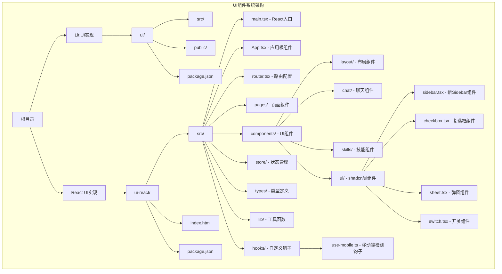
```mermaid
graph TB
subgraph "UI组件系统架构"
A[根目录] --> B[Lit UI实现]
A --> C[React UI实现]
B --> D[ui/]
C --> E[ui-react/]
D --> F[src/]
D --> G[public/]
D --> H[package.json]
E --> I[src/]
E --> J[index.html]
E --> K[package.json]
I --> L[main.tsx - React入口]
I --> M[App.tsx - 应用根组件]
I --> N[router.tsx - 路由配置]
I --> O[pages/ - 页面组件]
I --> P[components/ - UI组件]
I --> Q[store/ - 状态管理]
I --> R[types/ - 类型定义]
I --> S[lib/ - 工具函数]
I --> T[hooks/ - 自定义钩子]
P --> U[layout/ - 布局组件]
P --> V[chat/ - 聊天组件]
P --> W[skills/ - 技能组件]
P --> X[ui/ - shadcn/ui组件]
X --> Y[sidebar.tsx - 新Sidebar组件]
X --> Z[checkbox.tsx - 复选框组件]
X --> AA[sheet.tsx - 弹窗组件]
X --> BB[switch.tsx - 开关组件]
T --> CC[use-mobile.ts - 移动端检测钩子]
end
```

**图表来源**

- [main.ts:1-3](file://ui/src/main.ts#L1-L3)
- [main.tsx:1-11](file://ui-react/src/main.tsx#L1-L11)
- [router.tsx:1-42](file://ui-react/src/router.tsx#L1-L42)
- [sidebar.tsx:1-694](file://ui-react/src/components/ui/sidebar.tsx#L1-L694)
- [use-mobile.ts:1-20](file://ui-react/src/hooks/use-mobile.ts#L1-L20)

**章节来源**

- [README.md:185-212](file://README.md#L185-L212)
- [package.json:1-28](file://ui/package.json#L1-L28)
- [package.json:1-57](file://ui-react/package.json#L1-L57)

## 核心组件

### Lit UI核心组件

OpenClawApp是Lit框架实现的核心应用组件，负责管理整个UI的状态和生命周期：

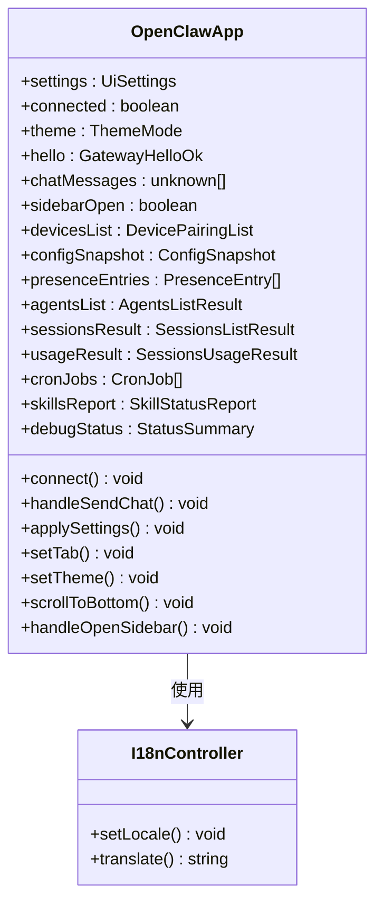
```mermaid
classDiagram
class OpenClawApp {
+settings : UiSettings
+connected : boolean
+theme : ThemeMode
+hello : GatewayHelloOk
+chatMessages : unknown[]
+sidebarOpen : boolean
+devicesList : DevicePairingList
+configSnapshot : ConfigSnapshot
+presenceEntries : PresenceEntry[]
+agentsList : AgentsListResult
+sessionsResult : SessionsListResult
+usageResult : SessionsUsageResult
+cronJobs : CronJob[]
+skillsReport : SkillStatusReport
+debugStatus : StatusSummary
+connect() void
+handleSendChat() void
+applySettings() void
+setTab() void
+setTheme() void
+scrollToBottom() void
+handleOpenSidebar() void
}
class I18nController {
+setLocale() void
+translate() string
}
OpenClawApp --> I18nController : 使用
```

**图表来源**

- [app.ts:110-630](file://ui/src/ui/app.ts#L110-L630)

### React UI核心组件（shadcn/ui设计系统）

React实现已完全迁移到shadcn/ui设计系统，采用了现代化的组件架构，使用Zustand进行状态管理，并引入了新的UI组件：

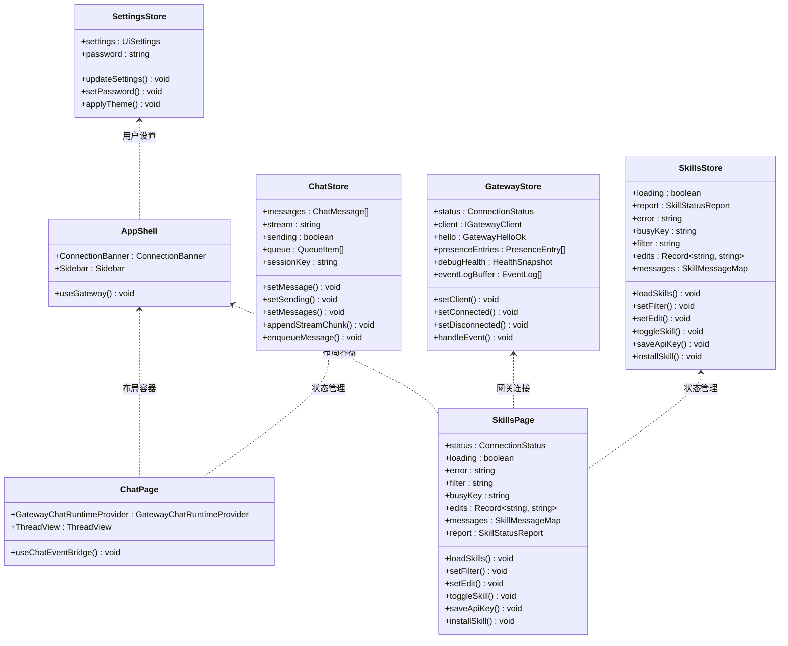
```mermaid
classDiagram
class ChatStore {
+messages : ChatMessage[]
+stream : string
+sending : boolean
+queue : QueueItem[]
+sessionKey : string
+setMessage() void
+setSending() void
+setMessages() void
+appendStreamChunk() void
+enqueueMessage() void
}
class SkillsStore {
+loading : boolean
+report : SkillStatusReport
+error : string
+busyKey : string
+filter : string
+edits : Record~string, string~
+messages : SkillMessageMap
+loadSkills() void
+setFilter() void
+setEdit() void
+toggleSkill() void
+saveApiKey() void
+installSkill() void
}
class GatewayStore {
+status : ConnectionStatus
+client : IGatewayClient
+hello : GatewayHelloOk
+presenceEntries : PresenceEntry[]
+debugHealth : HealthSnapshot
+eventLogBuffer : EventLog[]
+setClient() void
+setConnected() void
+setDisconnected() void
+handleEvent() void
}
class SettingsStore {
+settings : UiSettings
+password : string
+updateSettings() void
+setPassword() void
+applyTheme() void
}
class AppShell {
+useGateway() void
+ConnectionBanner : ConnectionBanner
+Sidebar : Sidebar
}
class ChatPage {
+useChatEventBridge() void
+GatewayChatRuntimeProvider : GatewayChatRuntimeProvider
+ThreadView : ThreadView
}
class SkillsPage {
+status : ConnectionStatus
+loading : boolean
+error : string
+filter : string
+busyKey : string
+edits : Record~string, string~
+messages : SkillMessageMap
+report : SkillStatusReport
+loadSkills() void
+setFilter() void
+setEdit() void
+toggleSkill() void
+saveApiKey() void
+installSkill() void
}
ChatStore <.. ChatPage : 状态管理
SkillsStore <.. SkillsPage : 状态管理
GatewayStore <.. SkillsPage : 网关连接
SettingsStore <.. AppShell : 用户设置
AppShell <.. ChatPage : 布局容器
AppShell <.. SkillsPage : 布局容器
```

**图表来源**

- [chat.store.ts:135-230](file://ui-react/src/store/chat.store.ts#L135-L230)
- [skills.store.ts:16-32](file://ui-react/src/store/skills.store.ts#L16-L32)
- [gateway.store.ts:41-68](file://ui-react/src/store/gateway.store.ts#L41-L68)
- [settings.store.ts:193-200](file://ui-react/src/store/settings.store.ts#L193-L200)
- [AppShell.tsx:10-26](file://ui-react/src/components/layout/AppShell.tsx#L10-L26)
- [ChatPage.tsx:6-21](file://ui-react/src/pages/ChatPage.tsx#L6-L21)
- [SkillsPage.tsx:10-31](file://ui-react/src/pages/SkillsPage.tsx#L10-L31)

**章节来源**

- [app.ts:110-630](file://ui/src/ui/app.ts#L110-L630)
- [chat.store.ts:135-230](file://ui-react/src/store/chat.store.ts#L135-L230)
- [skills.store.ts:16-32](file://ui-react/src/store/skills.store.ts#L16-L32)

## 架构概览

UI组件系统采用分层架构设计，实现了清晰的关注点分离，**新增了基于shadcn/ui设计系统的统一组件库**：

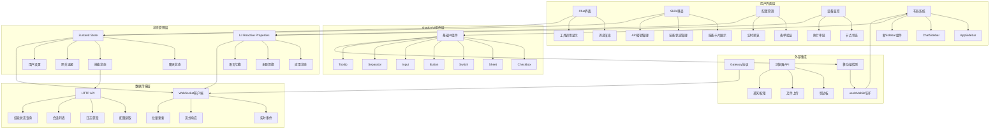
```mermaid
graph TB
subgraph "用户界面层"
A[Chat界面] --> B[消息渲染]
A --> C[工具调用显示]
D[Skills界面] --> E[技能卡片展示]
D --> F[技能状态管理]
D --> G[API密钥管理]
H[配置管理] --> I[表单验证]
H --> J[实时预览]
K[设备监控] --> L[节点状态]
K --> M[执行审批]
N[布局系统] --> O[AppSidebar]
N --> P[ChatSidebar]
N --> Q[新Sidebar组件]
end
subgraph "shadcn/ui组件层"
R[基础UI组件] --> S[Checkbox]
R --> T[Sheet]
R --> U[Switch]
R --> V[Button]
R --> W[Input]
R --> X[Separator]
R --> Y[Tooltip]
end
subgraph "状态管理层"
Z[Zustand Store] --> AA[聊天状态]
Z --> BB[技能状态]
Z --> CC[网关连接]
Z --> DD[用户设置]
EE[Lit Reactive Properties] --> FF[应用状态]
EE --> GG[主题切换]
EE --> HH[语言切换]
end
subgraph "数据传输层"
II[WebSocket客户端] --> JJ[实时事件]
II --> KK[流式响应]
II --> LL[批量更新]
MM[HTTP API] --> NN[配置读取]
MM --> OO[日志获取]
MM --> PP[会话列表]
MM --> QQ[技能状态查询]
end
subgraph "外部集成"
RR[Gateway协议] --> II
SS[浏览器API] --> TT[剪贴板]
SS --> UU[文件上传]
SS --> VV[通知权限]
WW[移动端检测] --> XX[useIsMobile钩子]
end
A --> Z
D --> Z
H --> EE
K --> EE
N --> R
R --> WW
Z --> II
EE --> II
BB --> MM
XX --> N
```

**图表来源**

- [app.ts:110-630](file://ui/src/ui/app.ts#L110-L630)
- [chat.store.ts:135-230](file://ui-react/src/store/chat.store.ts#L135-L230)
- [skills.store.ts:71-197](file://ui-react/src/store/skills.store.ts#L71-L197)
- [sidebar.tsx:1-694](file://ui-react/src/components/ui/sidebar.tsx#L1-L694)
- [checkbox.tsx:1-26](file://ui-react/src/components/ui/checkbox.tsx#L1-L26)
- [sheet.tsx:1-134](file://ui-react/src/components/ui/sheet.tsx#L1-L134)
- [switch.tsx:1-33](file://ui-react/src/components/ui/switch.tsx#L1-L33)
- [use-mobile.ts:1-20](file://ui-react/src/hooks/use-mobile.ts#L1-L20)

## 详细组件分析

### 聊天界面组件

#### Lit实现的聊天组件

聊天界面是UI系统的核心组件，负责处理用户与AI助手的交互：

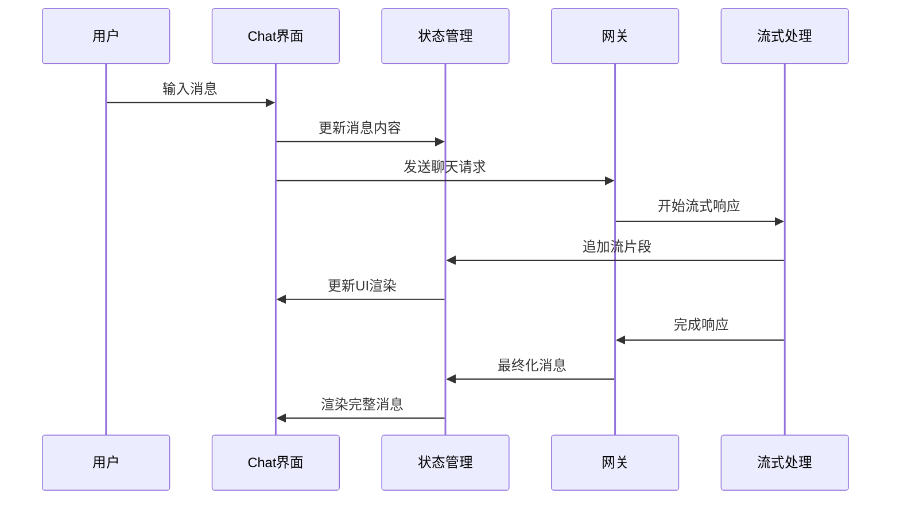
```mermaid
sequenceDiagram
participant User as 用户
participant Chat as Chat界面
participant Store as 状态管理
participant Gateway as 网关
participant Stream as 流式处理
User->>Chat : 输入消息
Chat->>Store : 更新消息内容
Chat->>Gateway : 发送聊天请求
Gateway->>Stream : 开始流式响应
Stream->>Store : 追加流片段
Store->>Chat : 更新UI渲染
Stream->>Gateway : 完成响应
Gateway->>Store : 最终化消息
Store->>Chat : 渲染完整消息
```

**图表来源**

- [app.ts:497-506](file://ui/src/ui/app.ts#L497-L506)
- [chat.store.ts:166-203](file://ui-react/src/store/chat.store.ts#L166-L203)

#### React实现的聊天组件

React版本采用了更现代的状态管理模式：

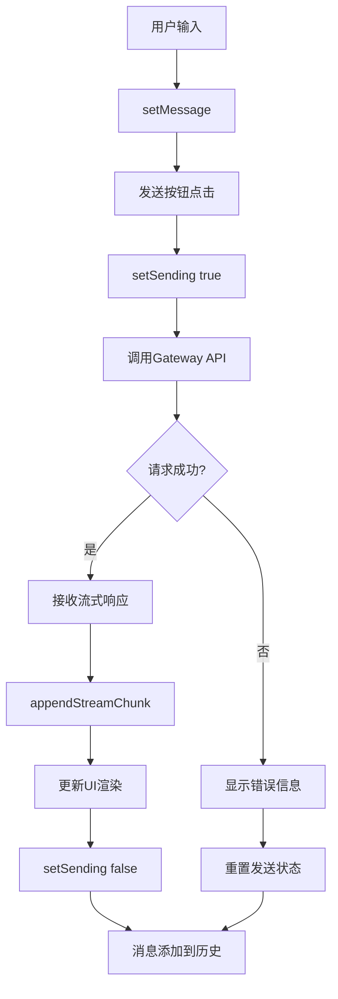
```mermaid
flowchart TD
A[用户输入] --> B[setMessage]
B --> C[发送按钮点击]
C --> D[setSending true]
D --> E[调用Gateway API]
E --> F{请求成功?}
F --> |是| G[接收流式响应]
F --> |否| H[显示错误信息]
G --> I[appendStreamChunk]
I --> J[更新UI渲染]
J --> K[setSending false]
H --> L[重置发送状态]
K --> M[消息添加到历史]
L --> M
```

**图表来源**

- [ChatPage.tsx:6-21](file://ui-react/src/pages/ChatPage.tsx#L6-L21)
- [chat.store.ts:166-229](file://ui-react/src/store/chat.store.ts#L166-L229)

**章节来源**

- [app.ts:497-506](file://ui/src/ui/app.ts#L497-L506)
- [ChatPage.tsx:6-21](file://ui-react/src/pages/ChatPage.tsx#L6-L21)
- [chat.store.ts:166-229](file://ui-react/src/store/chat.store.ts#L166-L229)

### 新的Sidebar组件系统

**新增** 基于shadcn/ui设计系统的全新Sidebar组件，提供了响应式的侧边栏导航功能：

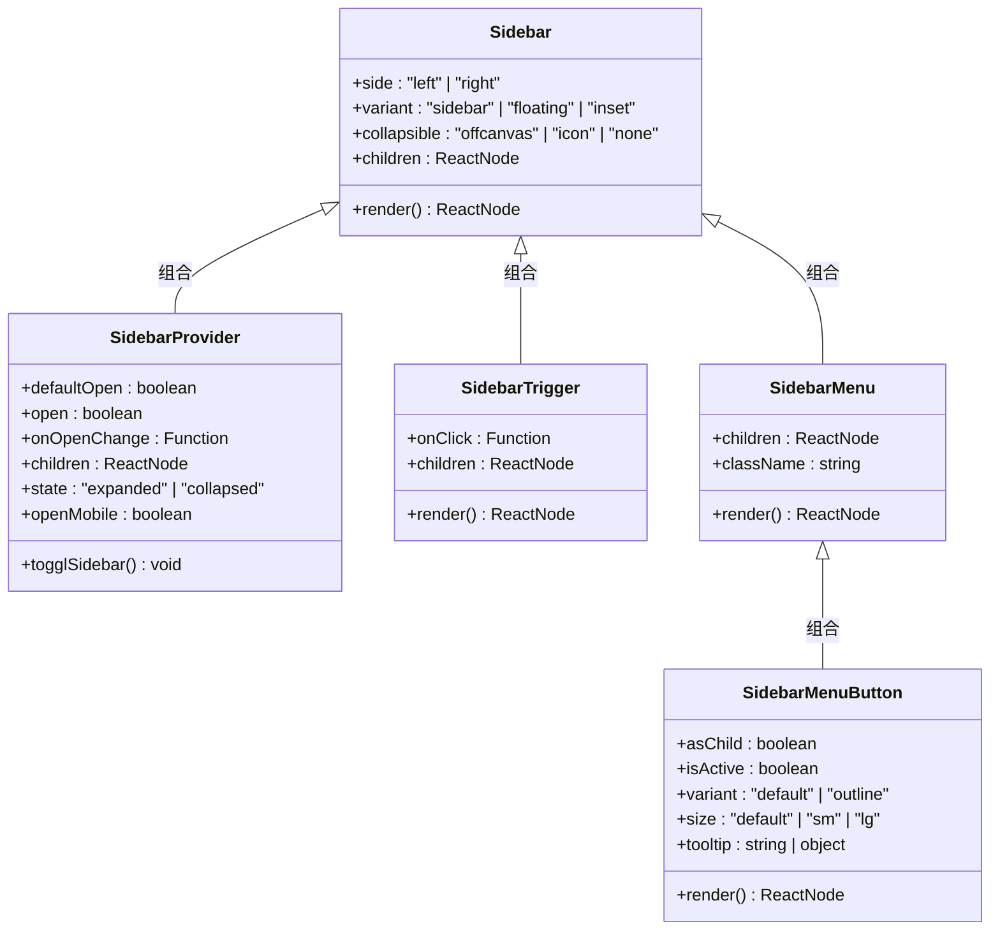
```mermaid
classDiagram
class Sidebar {
+side : "left" | "right"
+variant : "sidebar" | "floating" | "inset"
+collapsible : "offcanvas" | "icon" | "none"
+children : ReactNode
+render() ReactNode
}
class SidebarProvider {
+defaultOpen : boolean
+open : boolean
+onOpenChange : Function
+children : ReactNode
+state : "expanded" | "collapsed"
+openMobile : boolean
+togglSidebar() void
}
class SidebarTrigger {
+onClick : Function
+children : ReactNode
+render() ReactNode
}
class SidebarMenu {
+children : ReactNode
+className : string
+render() ReactNode
}
class SidebarMenuButton {
+asChild : boolean
+isActive : boolean
+variant : "default" | "outline"
+size : "default" | "sm" | "lg"
+tooltip : string | object
+render() ReactNode
}
Sidebar <|-- SidebarProvider : 组合
Sidebar <|-- SidebarTrigger : 组合
Sidebar <|-- SidebarMenu : 组合
SidebarMenu <|-- SidebarMenuButton : 组合
```

**图表来源**

- [sidebar.tsx:145-245](file://ui-react/src/components/ui/sidebar.tsx#L145-L245)
- [sidebar.tsx:50-143](file://ui-react/src/components/ui/sidebar.tsx#L50-L143)
- [sidebar.tsx:247-267](file://ui-react/src/components/ui/sidebar.tsx#L247-L267)
- [sidebar.tsx:432-524](file://ui-react/src/components/ui/sidebar.tsx#L432-L524)

#### Sidebar组件特性

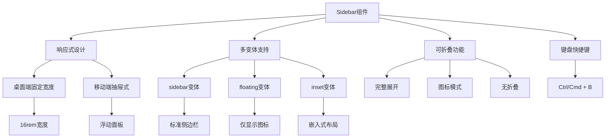
```mermaid
flowchart TD
A[Sidebar组件] --> B[响应式设计]
A --> C[多变体支持]
A --> D[可折叠功能]
A --> E[键盘快捷键]
B --> F[桌面端固定宽度]
B --> G[移动端抽屉式]
C --> H[sidebar变体]
C --> I[floating变体]
C --> J[inset变体]
D --> K[完整展开]
D --> L[图标模式]
D --> M[无折叠]
E --> N[Ctrl/Cmd + B]
F --> O[16rem宽度]
G --> P[浮动面板]
H --> Q[标准侧边栏]
I --> R[仅显示图标]
J --> S[嵌入式布局]
```

**图表来源**

- [sidebar.tsx:22-27](file://ui-react/src/components/ui/sidebar.tsx#L22-L27)
- [sidebar.tsx:145-245](file://ui-react/src/components/ui/sidebar.tsx#L145-L245)
- [sidebar.tsx:91-101](file://ui-react/src/components/ui/sidebar.tsx#L91-L101)

**章节来源**

- [sidebar.tsx:145-245](file://ui-react/src/components/ui/sidebar.tsx#L145-L245)
- [sidebar.tsx:50-143](file://ui-react/src/components/ui/sidebar.tsx#L50-L143)
- [sidebar.tsx:247-267](file://ui-react/src/components/ui/sidebar.tsx#L247-L267)
- [sidebar.tsx:432-524](file://ui-react/src/components/ui/sidebar.tsx#L432-L524)

### 新UI组件库

**新增** 基于shadcn/ui设计系统的完整组件库，包括Checkbox、Sheet、Switch等基础UI组件：

#### Checkbox组件

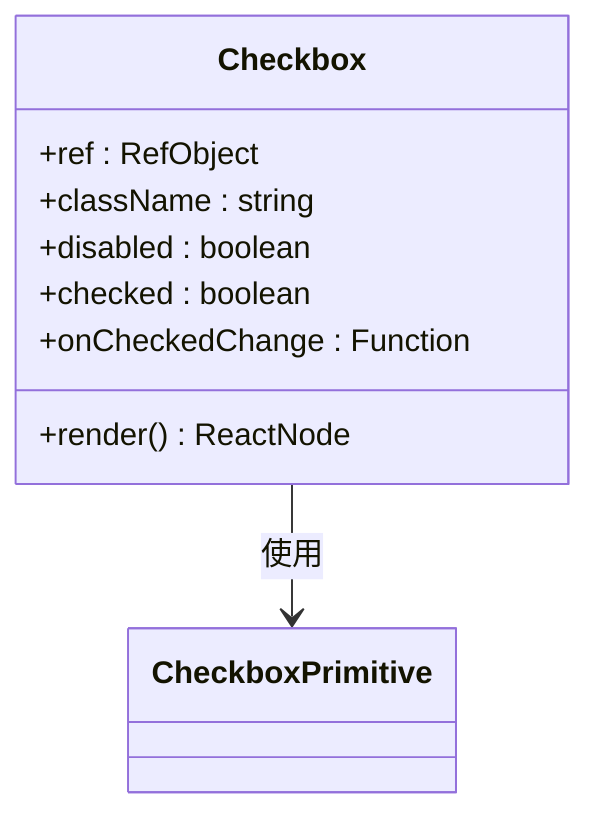
```mermaid
classDiagram
class Checkbox {
+ref : RefObject
+className : string
+disabled : boolean
+checked : boolean
+onCheckedChange : Function
+render() ReactNode
}
Checkbox --> CheckboxPrimitive : 使用
```

**图表来源**

- [checkbox.tsx:6-23](file://ui-react/src/components/ui/checkbox.tsx#L6-L23)

#### Sheet组件

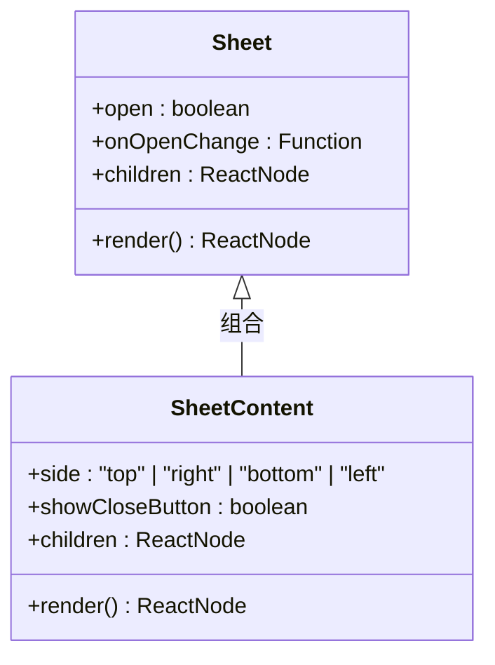
```mermaid
classDiagram
class Sheet {
+open : boolean
+onOpenChange : Function
+children : ReactNode
+render() ReactNode
}
class SheetContent {
+side : "top" | "right" | "bottom" | "left"
+showCloseButton : boolean
+children : ReactNode
+render() ReactNode
}
Sheet <|-- SheetContent : 组合
```

**图表来源**

- [sheet.tsx:8-18](file://ui-react/src/components/ui/sheet.tsx#L8-L18)
- [sheet.tsx:40-79](file://ui-react/src/components/ui/sheet.tsx#L40-L79)

#### Switch组件

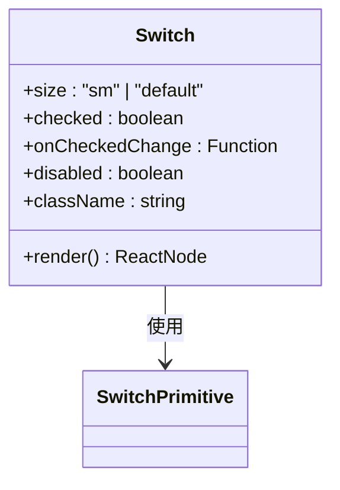
```mermaid
classDiagram
class Switch {
+size : "sm" | "default"
+checked : boolean
+onCheckedChange : Function
+disabled : boolean
+className : string
+render() ReactNode
}
Switch --> SwitchPrimitive : 使用
```

**图表来源**

- [switch.tsx:5-30](file://ui-react/src/components/ui/switch.tsx#L5-L30)

**章节来源**

- [checkbox.tsx:1-26](file://ui-react/src/components/ui/checkbox.tsx#L1-L26)
- [sheet.tsx:1-134](file://ui-react/src/components/ui/sheet.tsx#L1-L134)
- [switch.tsx:1-33](file://ui-react/src/components/ui/switch.tsx#L1-L33)

### 移动端适配系统

**新增** use-mobile钩子提供了统一的移动端检测功能，支持响应式设计：

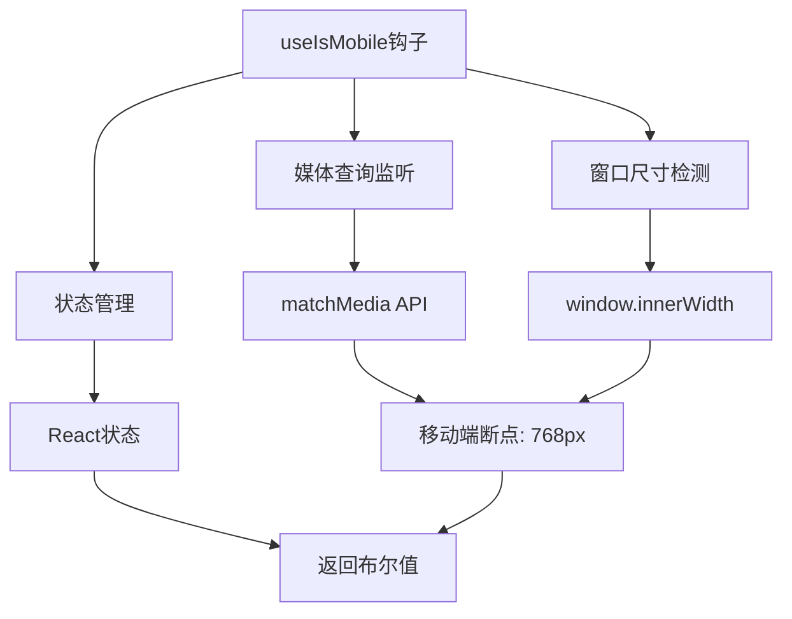
```mermaid
flowchart TD
A[useIsMobile钩子] --> B[媒体查询监听]
A --> C[窗口尺寸检测]
A --> D[状态管理]
B --> E[matchMedia API]
C --> F[window.innerWidth]
D --> G[React状态]
E --> H[移动端断点: 768px]
F --> H
G --> I[返回布尔值]
H --> I
```

**图表来源**

- [use-mobile.ts:3-19](file://ui-react/src/hooks/use-mobile.ts#L3-L19)

#### 移动端检测逻辑

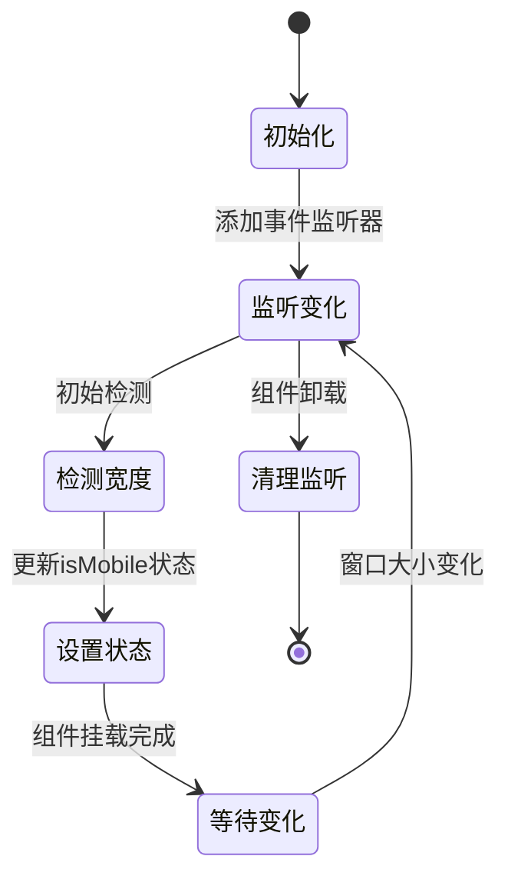
```mermaid
stateDiagram-v2
[*] --> 初始化
初始化 --> 监听变化 : 添加事件监听器
监听变化 --> 检测宽度 : 初始检测
检测宽度 --> 设置状态 : 更新isMobile状态
设置状态 --> 等待变化 : 组件挂载完成
等待变化 --> 监听变化 : 窗口大小变化
监听变化 --> 清理监听 : 组件卸载
清理监听 --> [*]
```

**图表来源**

- [use-mobile.ts:8-16](file://ui-react/src/hooks/use-mobile.ts#L8-L16)

**章节来源**

- [use-mobile.ts:1-20](file://ui-react/src/hooks/use-mobile.ts#L1-L20)

### 技能管理系统

**新增** 技能管理系统是React UI实现的重要组成部分，提供了完整的技能生命周期管理功能：

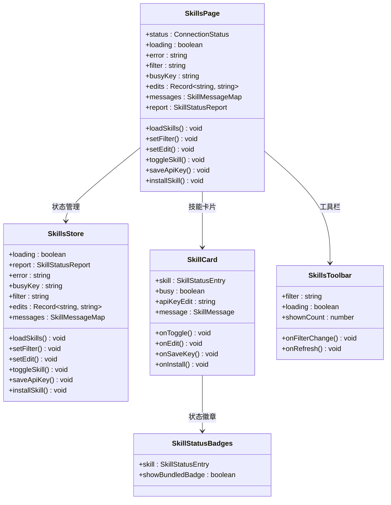
```mermaid
classDiagram
class SkillsPage {
+status : ConnectionStatus
+loading : boolean
+error : string
+filter : string
+busyKey : string
+edits : Record~string, string~
+messages : SkillMessageMap
+report : SkillStatusReport
+loadSkills() void
+setFilter() void
+setEdit() void
+toggleSkill() void
+saveApiKey() void
+installSkill() void
}
class SkillsStore {
+loading : boolean
+report : SkillStatusReport
+error : string
+busyKey : string
+filter : string
+edits : Record~string, string~
+messages : SkillMessageMap
+loadSkills() void
+setFilter() void
+setEdit() void
+toggleSkill() void
+saveApiKey() void
+installSkill() void
}
class SkillCard {
+skill : SkillStatusEntry
+busy : boolean
+apiKeyEdit : string
+message : SkillMessage
+onToggle() void
+onEdit() void
+onSaveKey() void
+onInstall() void
}
class SkillsToolbar {
+filter : string
+loading : boolean
+shownCount : number
+onFilterChange() void
+onRefresh() void
}
class SkillStatusBadges {
+skill : SkillStatusEntry
+showBundledBadge : boolean
}
SkillsPage --> SkillsStore : 状态管理
SkillsPage --> SkillsToolbar : 工具栏
SkillsPage --> SkillCard : 技能卡片
SkillCard --> SkillStatusBadges : 状态徽章
```

**图表来源**

- [SkillsPage.tsx:10-31](file://ui-react/src/pages/SkillsPage.tsx#L10-L31)
- [skills.store.ts:16-32](file://ui-react/src/store/skills.store.ts#L16-L32)
- [SkillCard.tsx:9-18](file://ui-react/src/components/skills/SkillCard.tsx#L9-L18)
- [SkillsToolbar.tsx:5-11](file://ui-react/src/components/skills/SkillsToolbar.tsx#L5-L11)
- [SkillStatusBadges.tsx:4-7](file://ui-react/src/components/skills/SkillStatusBadges.tsx#L4-L7)

#### 技能状态管理流程

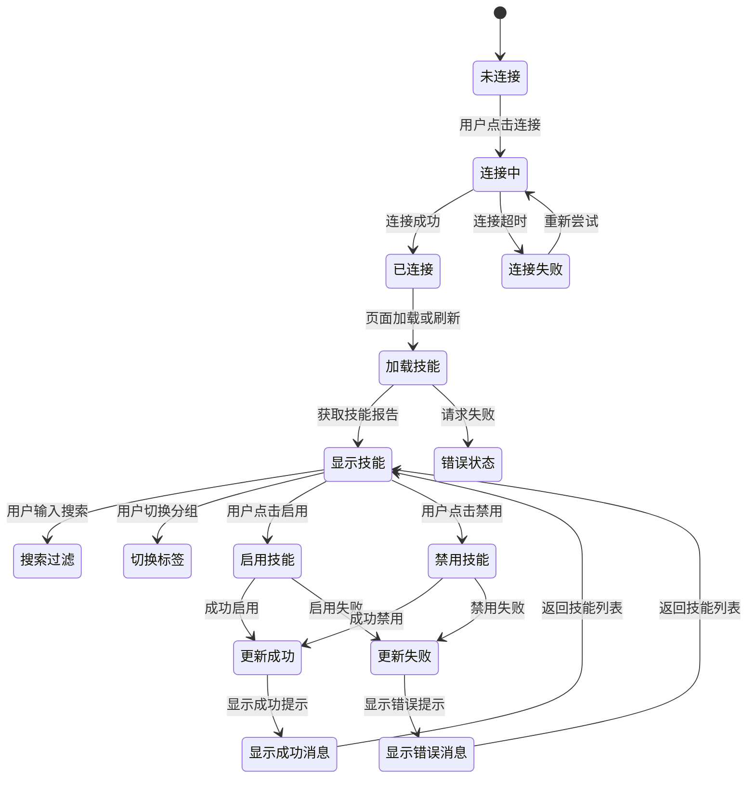
```mermaid
stateDiagram-v2
[*] --> 未连接
未连接 --> 连接中 : 用户点击连接
连接中 --> 已连接 : 连接成功
连接中 --> 连接失败 : 连接超时
连接失败 --> 连接中 : 重新尝试
已连接 --> 加载技能 : 页面加载或刷新
加载技能 --> 显示技能 : 获取技能报告
加载技能 --> 错误状态 : 请求失败
显示技能 --> 搜索过滤 : 用户输入搜索
显示技能 --> 切换标签 : 用户切换分组
显示技能 --> 启用技能 : 用户点击启用
显示技能 --> 禁用技能 : 用户点击禁用
启用技能 --> 更新成功 : 成功启用
启用技能 --> 更新失败 : 启用失败
禁用技能 --> 更新成功 : 成功禁用
禁用技能 --> 更新失败 : 禁用失败
更新成功 --> 显示成功消息 : 显示成功提示
更新失败 --> 显示错误消息 : 显示错误提示
显示成功消息 --> 显示技能 : 返回技能列表
显示错误消息 --> 显示技能 : 返回技能列表
```

**图表来源**

- [skills.store.ts:80-105](file://ui-react/src/store/skills.store.ts#L80-L105)
- [skills.store.ts:111-137](file://ui-react/src/store/skills.store.ts#L111-L137)
- [skills.store.ts:139-165](file://ui-react/src/store/skills.store.ts#L139-L165)

#### 技能分组和筛选

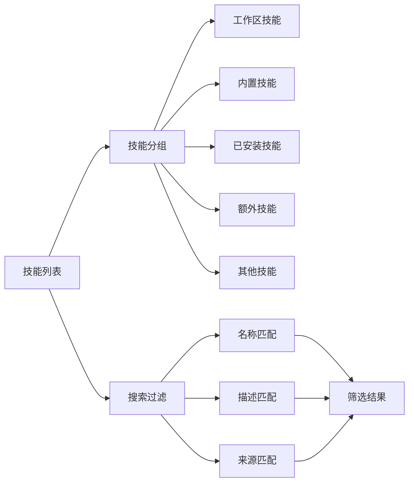
```mermaid
flowchart LR
A[技能列表] --> B[技能分组]
B --> C[工作区技能]
B --> D[内置技能]
B --> E[已安装技能]
B --> F[额外技能]
B --> G[其他技能]
A --> H[搜索过滤]
H --> I[名称匹配]
H --> J[描述匹配]
H --> K[来源匹配]
I --> L[筛选结果]
J --> L
K --> L
```

**图表来源**

- [skills-grouping.ts:16-42](file://ui-react/src/lib/skills-grouping.ts#L16-L42)
- [SkillsPage.tsx:31-42](file://ui-react/src/pages/SkillsPage.tsx#L31-L42)

**章节来源**

- [SkillsPage.tsx:10-31](file://ui-react/src/pages/SkillsPage.tsx#L10-L31)
- [skills.store.ts:16-32](file://ui-react/src/store/skills.store.ts#L16-L32)
- [SkillCard.tsx:9-18](file://ui-react/src/components/skills/SkillCard.tsx#L9-L18)
- [SkillsToolbar.tsx:5-11](file://ui-react/src/components/skills/SkillsToolbar.tsx#L5-L11)
- [SkillStatusBadges.tsx:4-7](file://ui-react/src/components/skills/SkillStatusBadges.tsx#L4-L7)
- [skills-grouping.ts:16-42](file://ui-react/src/lib/skills-grouping.ts#L16-L42)

### 配置管理系统

配置管理界面提供了对OpenClaw系统的全面控制：

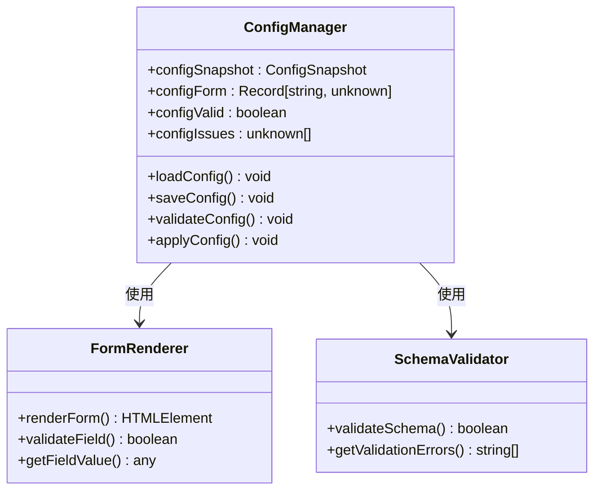
```mermaid
classDiagram
class ConfigManager {
+configSnapshot : ConfigSnapshot
+configForm : Record[string, unknown]
+configValid : boolean
+configIssues : unknown[]
+loadConfig() void
+saveConfig() void
+validateConfig() void
+applyConfig() void
}
class FormRenderer {
+renderForm() HTMLElement
+validateField() boolean
+getFieldValue() any
}
class SchemaValidator {
+validateSchema() boolean
+getValidationErrors() string[]
}
ConfigManager --> FormRenderer : 使用
ConfigManager --> SchemaValidator : 使用
```

**图表来源**

- [app.ts:183-204](file://ui/src/ui/app.ts#L183-L204)

### 设备监控组件

设备监控功能允许用户管理连接的设备和节点：

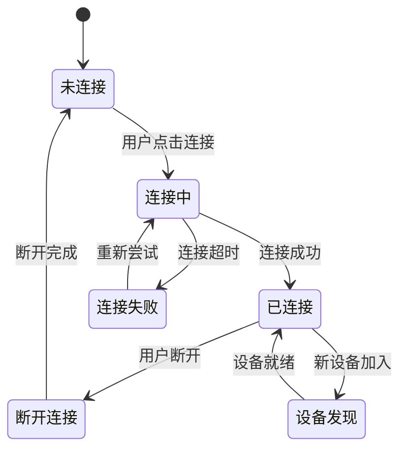
```mermaid
stateDiagram-v2
[*] --> 未连接
未连接 --> 连接中 : 用户点击连接
连接中 --> 已连接 : 连接成功
连接中 --> 连接失败 : 连接超时
连接失败 --> 连接中 : 重新尝试
已连接 --> 断开连接 : 用户断开
已连接 --> 设备发现 : 新设备加入
设备发现 --> 已连接 : 设备就绪
断开连接 --> 未连接 : 断开完成
```

**图表来源**

- [app.ts:164-179](file://ui/src/ui/app.ts#L164-L179)

**章节来源**

- [app.ts:183-204](file://ui/src/ui/app.ts#L183-L204)
- [app.ts:164-179](file://ui/src/ui/app.ts#L164-L179)

## 依赖关系分析

### 依赖图谱

```mermaid
graph TB
subgraph "Lit UI依赖"
A[lit] --> B[Web Components]
C[@lit-labs/signals] --> D[响应式信号]
E[marked] --> F[Markdown渲染]
G[dompurify] --> H[HTML清理]
end
subgraph "React UI依赖shadcn/ui"
I[react] --> J[JSX渲染]
K[zustand] --> L[状态管理]
M[react-router] --> N[路由管理]
O[@assistant-ui/react] --> P[AI聊天组件]
Q[shadcn/ui] --> R[设计系统]
R --> S[sidebar组件]
R --> T[checkbox组件]
R --> U[sheet组件]
R --> V[switch组件]
W[radix-ui/react-*] --> X[基础UI组件]
Y[lucide-react] --> Z[图标库]
AA[use-mobile钩子] --> BB[移动端检测]
AA --> CC[响应式设计]
end
subgraph "开发工具"
DD[vite] --> EE[构建工具]
FF[typescript] --> GG[类型检查]
HH[vitest] --> II[测试框架]
end
```

**图表来源**

- [package.json:11-26](file://ui/package.json#L11-L26)
- [package.json:11-55](file://ui-react/package.json#L11-L55)
- [components.json:1-22](file://ui-react/components.json#L1-22)

### 版本兼容性

两个UI实现都保持了良好的向后兼容性：

| 功能模块   | Lit实现     | React实现   | 兼容性        |
| ---------- | ----------- | ----------- | ------------- |
| 聊天界面   | ✅ 完全支持 | ✅ 完全支持 | ✅ 高度相似   |
| 配置管理   | ✅ 基础支持 | ✅ 增强支持 | ✅ 功能相当   |
| 设备监控   | ✅ 基础支持 | ✅ 增强支持 | ✅ 功能相当   |
| 日志查看   | ✅ 基础支持 | ✅ 增强支持 | ✅ 功能相当   |
| 技能管理   | ❌ 不支持   | ✅ 完全支持 | ✅ 新功能     |
| 主题切换   | ✅ 支持     | ✅ 支持     | ✅ 功能相同   |
| 国际化     | ✅ 支持     | ✅ 支持     | ✅ 功能相同   |
| 响应式设计 | ❌ 不支持   | ✅ 完全支持 | ✅ 移动端优化 |

**章节来源**

- [package.json:11-26](file://ui/package.json#L11-L26)
- [package.json:11-55](file://ui-react/package.json#L11-L55)
- [components.json:1-22](file://ui-react/components.json#L1-22)

## 性能考虑

### 渲染优化策略

1. **虚拟滚动**：对于大量日志和会话列表，使用虚拟滚动技术减少DOM节点数量
2. **懒加载组件**：按需加载重型组件，如图表和大型表格
3. **状态分片**：将大对象拆分为小的独立状态，避免不必要的重渲染
4. **流式更新**：聊天消息采用流式渲染，提供更好的用户体验
5. **技能分组缓存**：技能列表的分组和筛选结果进行缓存，避免重复计算
6. **Sidebar性能优化**：新的Sidebar组件使用CSS变量和条件渲染，提升移动端性能

### 内存管理

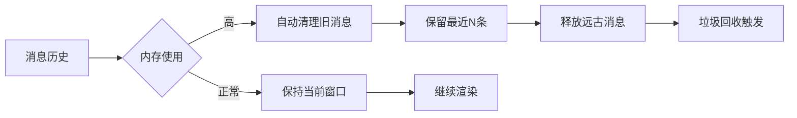
```mermaid
flowchart LR
A[消息历史] --> B{内存使用}
B --> |高| C[自动清理旧消息]
B --> |正常| D[保持当前窗口]
C --> E[保留最近N条]
E --> F[释放远古消息]
F --> G[垃圾回收触发]
D --> H[继续渲染]
```

### 网络优化

- **连接池管理**：复用WebSocket连接，减少连接开销
- **批量请求**：合并多个小请求为批量请求
- **缓存策略**：对静态资源和配置数据实施智能缓存
- **技能状态缓存**：技能状态和报告进行本地缓存，减少网络请求
- **组件懒加载**：shadcn/ui组件按需加载，减少初始包体积

## 故障排除指南

### 常见问题诊断

1. **连接问题**
   - 检查网关URL和认证令牌
   - 验证防火墙和代理设置
   - 查看WebSocket连接状态

2. **渲染问题**
   - 检查浏览器控制台错误
   - 验证CSS样式加载
   - 确认JavaScript执行环境

3. **性能问题**
   - 监控内存使用情况
   - 检查渲染帧率
   - 分析网络请求时间

4. **技能管理问题**
   - 检查技能API密钥是否正确
   - 验证技能安装依赖是否满足
   - 查看技能状态报告中的错误信息

5. **Sidebar组件问题**
   - 检查CSS变量是否正确加载
   - 验证移动端检测钩子是否正常工作
   - 确认组件导入路径是否正确

6. **shadcn/ui组件问题**
   - 验证components.json配置是否正确
   - 检查Tailwind CSS配置
   - 确认组件别名映射是否正确

### 调试工具

```mermaid
graph TD
A[开发者工具] --> B[浏览器调试器]
A --> C[网络面板]
A --> D[性能面板]
B --> E[断点调试]
C --> F[请求监控]
D --> G[渲染分析]
E --> H[状态检查]
F --> I[响应时间]
G --> J[帧率监控]
K[组件检查] --> L[React DevTools]
K --> M[组件树分析]
L --> N[Props检查]
M --> N
```

**章节来源**

- [app.ts:129-131](file://ui/src/ui/app.ts#L129-L131)
- [sidebar.tsx:174-197](file://ui-react/src/components/ui/sidebar.tsx#L174-L197)
- [use-mobile.ts:8-16](file://ui-react/src/hooks/use-mobile.ts#L8-L16)

## 结论

OpenClaw的UI组件系统展现了现代前端开发的最佳实践，通过双框架架构实现了：

1. **技术多样性**：同时支持Lit和React两种主流框架
2. **设计系统统一**：React实现已完全迁移到shadcn/ui设计系统
3. **功能完整性**：覆盖聊天、配置、监控、**技能管理**等核心功能
4. **性能优化**：采用多种优化策略确保流畅体验，包括技能状态缓存和Sidebar性能优化
5. **响应式设计**：新增use-mobile钩子和新的Sidebar组件，提供优秀的移动端体验
6. **可维护性**：清晰的架构设计便于长期维护

**新增的shadcn/ui设计系统**提供了统一的设计语言和组件库，包括全新的Sidebar组件、Checkbox、Sheet、Switch等基础UI组件，以及use-mobile钩子的引入，显著提升了用户体验和开发效率。这个设计系统与现有的聊天和配置管理功能无缝集成，形成了一个完整的AI助手管理平台。

**新增的Sidebar组件系统**具有以下优势：

- 响应式设计：自动适配桌面端和移动端
- 多变体支持：支持sidebar、floating、inset三种变体
- 可折叠功能：支持完整展开、图标模式、无折叠三种模式
- 键盘快捷键：支持Ctrl/Cmd + B快速切换
- 无障碍访问：完整的ARIA标签和键盘导航支持

**新增的UI组件库**提供了高质量的基础组件：

- Checkbox：支持禁用状态和受控/非受控模式
- Sheet：支持四个方向的抽屉式弹窗
- Switch：支持不同尺寸和状态的开关组件
- 统一的设计语言：基于shadcn/ui的设计规范

这种设计既满足了现有功能需求，又为未来的功能扩展和技术演进奠定了坚实基础。两个UI实现的并行存在为用户提供了选择空间，同时也降低了迁移风险。**新增的shadcn/ui设计系统**的引入进一步增强了OpenClaw平台的功能性和实用性，为用户提供了更加现代化和一致的用户体验。
