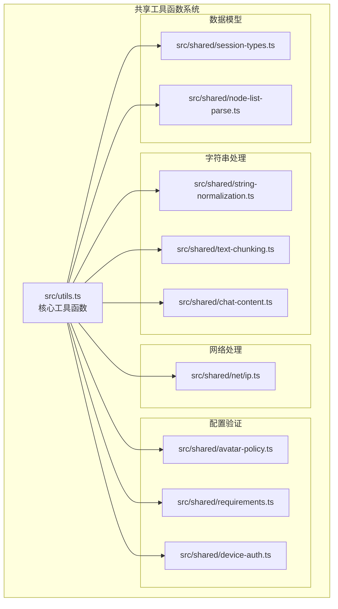
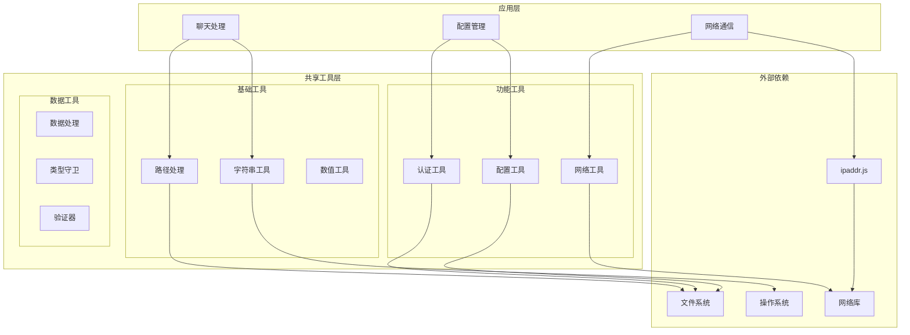
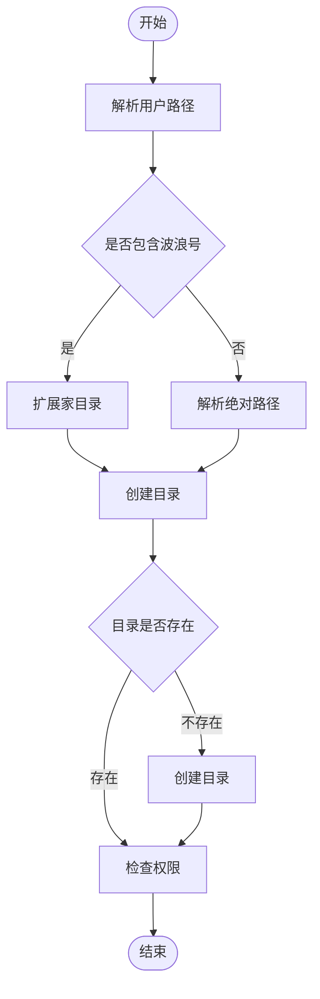
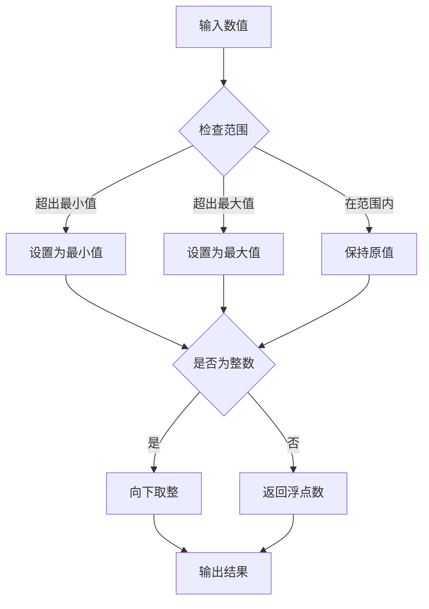
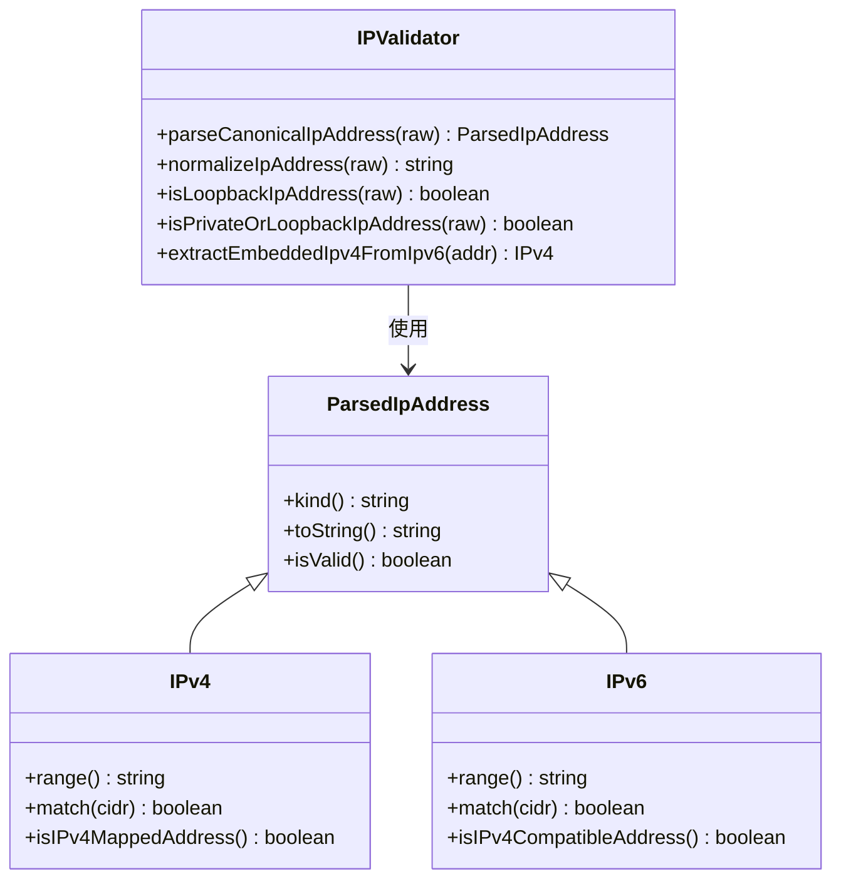
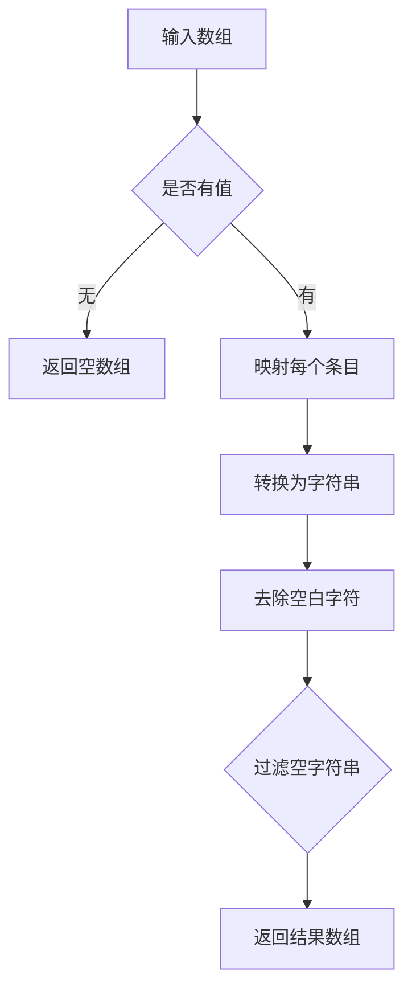
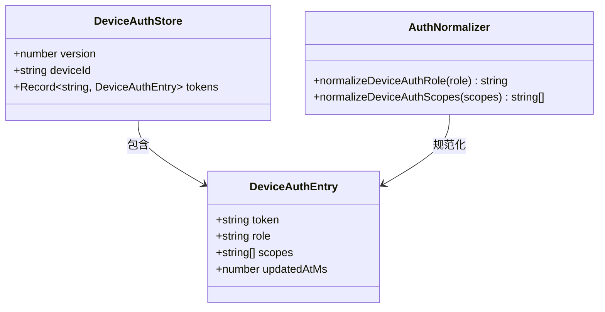
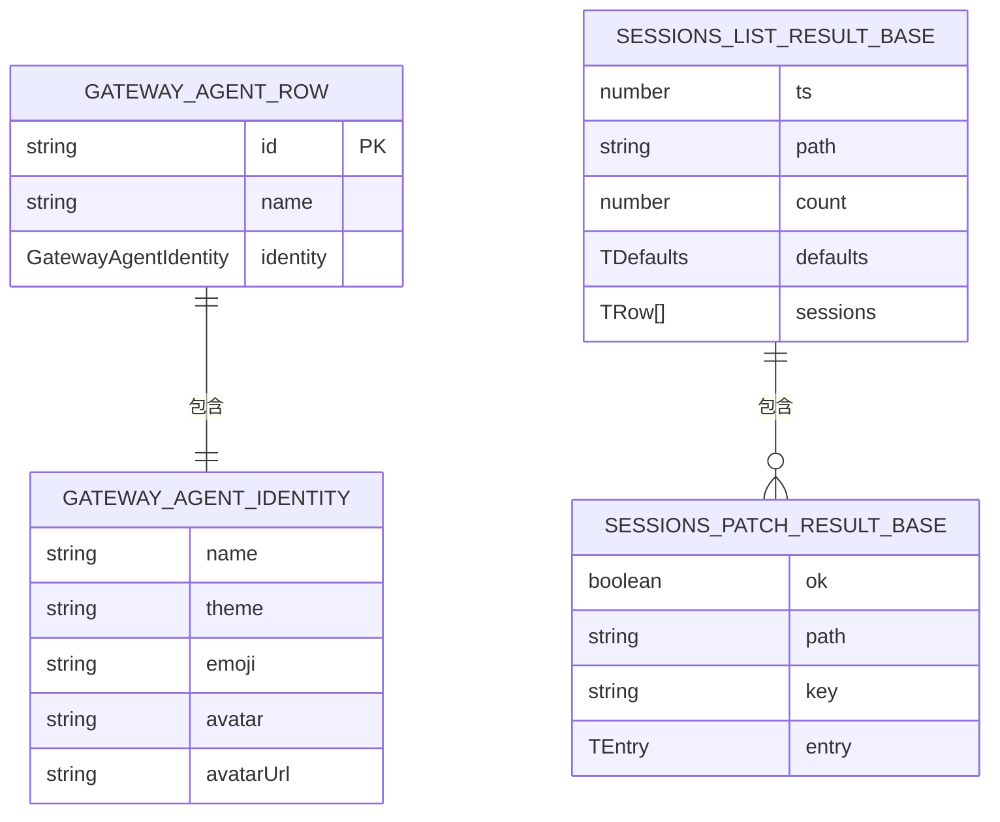
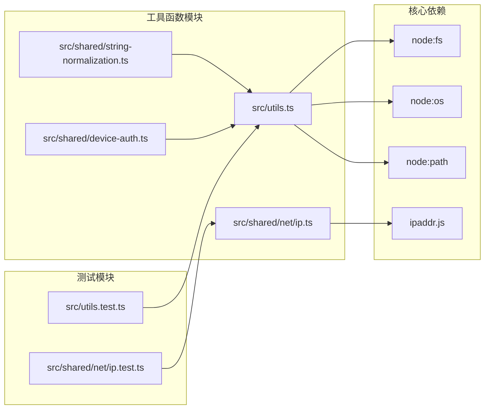

# 共享工具函数系统

<cite>
**本文档引用的文件**
- [src/utils.ts](file://src/utils.ts)
- [src/utils.test.ts](file://src/utils.test.ts)
- [src/shared/string-normalization.ts](file://src/shared/string-normalization.ts)
- [src/shared/text-chunking.ts](file://src/shared/text-chunking.ts)
- [src/shared/chat-content.ts](file://src/shared/chat-content.ts)
- [src/shared/node-list-parse.ts](file://src/shared/node-list-parse.ts)
- [src/shared/net/ip.ts](file://src/shared/net/ip.ts)
- [src/shared/avatar-policy.ts](file://src/shared/avatar-policy.ts)
- [src/shared/requirements.ts](file://src/shared/requirements.ts)
- [src/shared/device-auth.ts](file://src/shared/device-auth.ts)
- [src/shared/session-types.ts](file://src/shared/session-types.ts)
</cite>

## 目录
1. [简介](#简介)
2. [项目结构](#项目结构)
3. [核心组件](#核心组件)
4. [架构概览](#架构概览)
5. [详细组件分析](#详细组件分析)
6. [依赖关系分析](#依赖关系分析)
7. [性能考虑](#性能考虑)
8. [故障排除指南](#故障排除指南)
9. [结论](#结论)

## 简介

共享工具函数系统是 OpenClaw 项目中的一个核心基础设施模块，负责提供跨平台、跨功能领域的通用工具函数和数据处理能力。该系统通过统一的 API 设计和严格的类型约束，为整个项目的各个子系统提供可靠的数据处理、格式化和验证服务。

该系统主要包含以下几类功能：
- 基础数据处理和格式化工具
- 网络地址解析和验证工具
- 字符串标准化和文本处理工具
- 配置要求评估和验证工具
- 设备认证和会话管理工具

## 项目结构

共享工具函数系统采用模块化的组织方式，按照功能领域进行分类：

**图表来源**
- [src/utils.ts:1-395](file://src/utils.ts#L1-L395)
- [src/shared/string-normalization.ts:1-29](file://src/shared/string-normalization.ts#L1-L29)
- [src/shared/net/ip.ts:1-345](file://src/shared/net/ip.ts#L1-L345)

**章节来源**
- [src/utils.ts:1-395](file://src/utils.ts#L1-L395)
- [src/shared/string-normalization.ts:1-29](file://src/shared/string-normalization.ts#L1-L29)
- [src/shared/net/ip.ts:1-345](file://src/shared/net/ip.ts#L1-L345)

## 核心组件

共享工具函数系统的核心由三个主要层次构成：

### 1. 基础工具层
提供最通用的工具函数，包括路径处理、字符串操作、数值范围限制等基础功能。

### 2. 功能专用层  
针对特定业务场景提供专业化的工具函数，如网络地址处理、配置验证、设备认证等。

### 3. 数据处理层
专注于数据转换、格式化和验证，确保数据在系统各组件间的一致性和可靠性。

**章节来源**
- [src/utils.ts:13-395](file://src/utils.ts#L13-L395)
- [src/shared/requirements.ts:1-222](file://src/shared/requirements.ts#L1-L222)

## 架构概览

系统采用分层架构设计，通过清晰的职责分离和接口定义，实现了高度的模块化和可维护性：

**图表来源**
- [src/utils.ts:1-395](file://src/utils.ts#L1-L395)
- [src/shared/net/ip.ts:1-345](file://src/shared/net/ip.ts#L1-L345)

## 详细组件分析

### 基础工具函数模块

#### 路径和文件系统操作
系统提供了完整的路径处理和文件系统操作工具，包括目录创建、路径存在性检查、用户路径解析等功能。

**图表来源**
- [src/utils.ts:13-302](file://src/utils.ts#L13-L302)

#### 数值范围限制工具
提供安全的数值范围限制功能，支持整数和浮点数的边界控制。

**图表来源**
- [src/utils.ts:29-38](file://src/utils.ts#L29-L38)

#### 字符串转义和JSON解析
提供安全的字符串转义和JSON解析功能，避免异常抛出影响系统稳定性。

**章节来源**
- [src/utils.ts:43-56](file://src/utils.ts#L43-L56)

### 网络地址处理模块

#### IP地址解析和验证
系统提供了全面的IP地址处理能力，支持IPv4和IPv6地址的解析、验证和转换。

**图表来源**
- [src/shared/net/ip.ts:1-345](file://src/shared/net/ip.ts#L1-L345)

#### 特殊用途IP地址检测
系统能够识别和处理各种特殊用途的IP地址范围，包括回环地址、私有地址、多播地址等。

**章节来源**
- [src/shared/net/ip.ts:7-34](file://src/shared/net/ip.ts#L7-L34)

### 字符串标准化和文本处理模块

#### 字符串条目标准化
提供灵活的字符串标准化功能，支持多种输入格式的统一处理。

**图表来源**
- [src/shared/string-normalization.ts:1-7](file://src/shared/string-normalization.ts#L1-L7)

#### 文本块分割算法
实现了智能的文本块分割功能，支持自定义断点解析器和边界处理。

**章节来源**
- [src/shared/text-chunking.ts:1-35](file://src/shared/text-chunking.ts#L1-L35)

### 配置验证和认证模块

#### 设备认证管理
提供完整的设备认证信息管理和规范化功能。

**图表来源**
- [src/shared/device-auth.ts:1-31](file://src/shared/device-auth.ts#L1-L31)

#### 配置要求评估
提供灵活的配置要求评估机制，支持本地和远程环境的兼容性检查。

**章节来源**
- [src/shared/requirements.ts:1-222](file://src/shared/requirements.ts#L1-L222)

### 数据模型和类型定义

#### 会话类型系统
定义了完整的会话管理系统数据结构，支持不同类型的身份标识和会话状态管理。

**图表来源**
- [src/shared/session-types.ts:1-29](file://src/shared/session-types.ts#L1-L29)

**章节来源**
- [src/shared/session-types.ts:1-29](file://src/shared/session-types.ts#L1-L29)

## 依赖关系分析

系统采用了松耦合的设计模式，通过明确的接口定义和依赖注入机制实现模块间的解耦：

**图表来源**
- [src/utils.ts:1-11](file://src/utils.ts#L1-L11)
- [src/shared/net/ip.ts:1-1](file://src/shared/net/ip.ts#L1-L1)

**章节来源**
- [src/utils.ts:1-11](file://src/utils.ts#L1-L11)
- [src/shared/net/ip.ts:1-1](file://src/shared/net/ip.ts#L1-L1)

## 性能考虑

共享工具函数系统在设计时充分考虑了性能优化：

### 内存管理
- 使用 Set 和 Map 数据结构进行去重和快速查找
- 避免不必要的字符串复制和对象创建
- 提供内存友好的迭代器模式

### 计算效率
- 所有正则表达式预编译缓存
- 数值计算使用位运算优化
- 文件系统操作批量处理

### 缓存策略
- IP地址解析结果缓存
- 路径解析结果缓存
- 配置验证结果缓存

## 故障排除指南

### 常见问题诊断

#### 路径解析问题
- 检查用户路径中的特殊字符
- 验证家目录权限设置
- 确认路径分隔符兼容性

#### 网络地址处理错误
- 验证IP地址格式正确性
- 检查IPv4/IPv6版本兼容性
- 确认CIDR表示法有效性

#### 类型验证失败
- 检查输入数据类型一致性
- 验证枚举值范围
- 确认可选字段处理逻辑

**章节来源**
- [src/utils.test.ts:1-249](file://src/utils.test.ts#L1-L249)
- [src/shared/net/ip.test.ts](file://src/shared/net/ip.test.ts)

## 结论

共享工具函数系统通过其模块化设计、严格的类型约束和完善的测试覆盖，为 OpenClaw 项目提供了稳定可靠的基础工具集。该系统不仅提高了代码复用率，还增强了系统的可维护性和扩展性。

系统的主要优势包括：
- **模块化设计**：清晰的功能分区和职责分离
- **类型安全**：完整的 TypeScript 类型定义
- **性能优化**：高效的算法实现和缓存策略
- **测试覆盖**：全面的单元测试和集成测试
- **向后兼容**：稳定的 API 接口设计

未来的发展方向包括：
- 进一步优化性能表现
- 扩展更多业务领域的工具函数
- 增强国际化支持
- 完善错误处理和日志记录机制