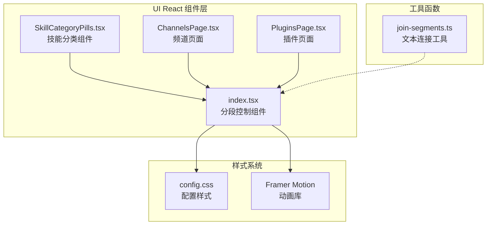
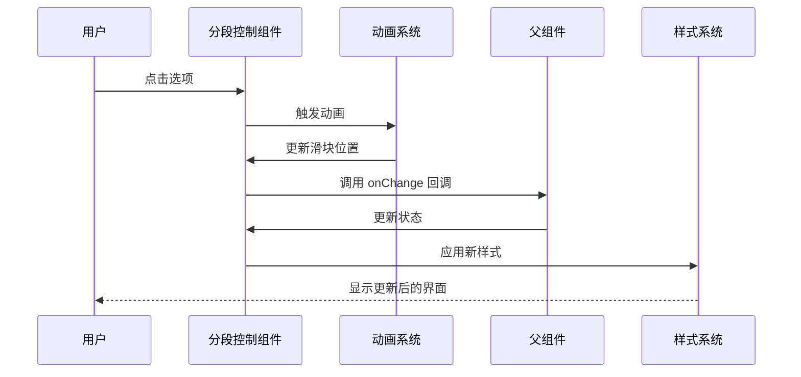
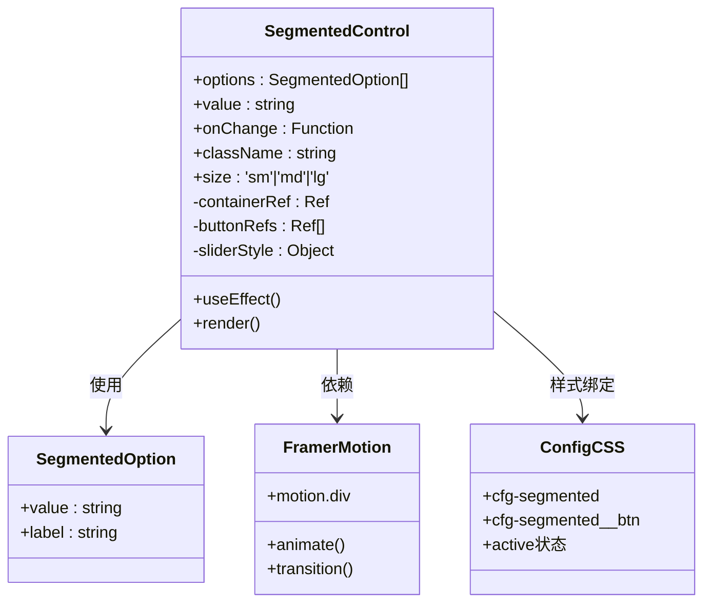
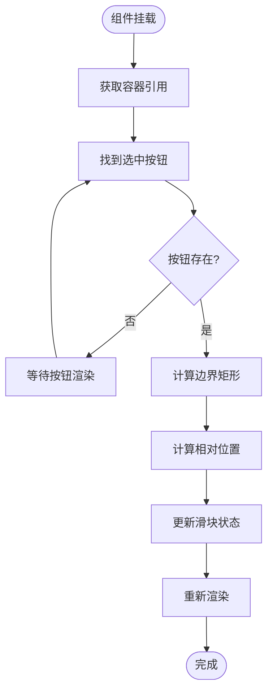
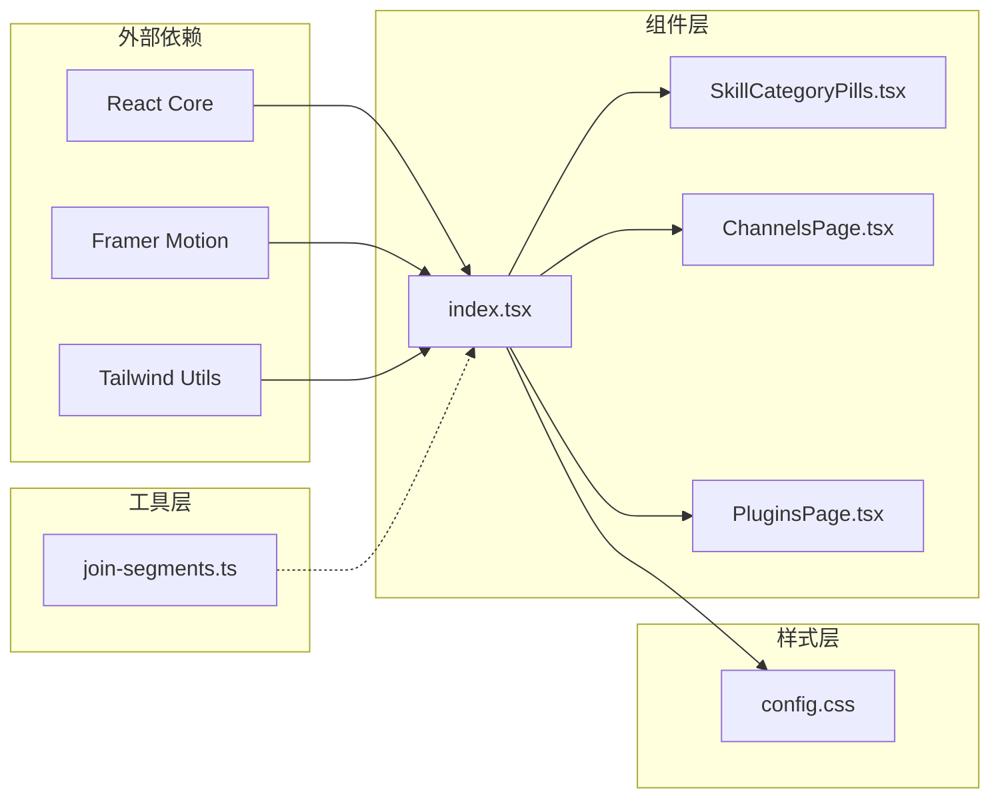

# 分段控制组件

<cite>
**本文档引用的文件**
- [index.tsx](file://ui-react/src/components/shared/segmented-control/index.tsx)
- [config.css](file://ui/src/styles/config.css)
- [SkillCategoryPills.tsx](file://ui-react/src/components/skills/SkillCategoryPills.tsx)
- [ChannelsPage.tsx](file://ui-react/src/pages/ChannelsPage.tsx)
- [PluginsPage.tsx](file://ui-react/src/pages/PluginsPage.tsx)
- [join-segments.ts](file://src/shared/text/join-segments.ts)
- [join-segments.test.ts](file://src/shared/text/join-segments.test.ts)
</cite>

## 目录
1. [简介](#简介)
2. [项目结构](#项目结构)
3. [核心组件](#核心组件)
4. [架构概览](#架构概览)
5. [详细组件分析](#详细组件分析)
6. [依赖关系分析](#依赖关系分析)
7. [性能考虑](#性能考虑)
8. [故障排除指南](#故障排除指南)
9. [结论](#结论)

## 简介

分段控制组件是 OpenClaw 项目中的一个关键 UI 组件，用于提供用户界面中可切换的选项卡或按钮组功能。该组件支持响应式设计、动画效果和多种尺寸规格，为用户提供直观的交互体验。

在 OpenClaw 生态系统中，分段控制组件不仅用于配置页面，还广泛应用于技能分类、频道管理和插件管理等场景。它通过流畅的动画过渡和精确的布局计算，确保用户在不同选项之间切换时获得一致且美观的视觉反馈。

## 项目结构

OpenClaw 项目采用模块化架构，分段控制组件位于前端 UI 层的共享组件目录中：



**图表来源**
- [index.tsx:1-103](file://ui-react/src/components/shared/segmented-control/index.tsx#L1-L103)
- [config.css:1008-1050](file://ui/src/styles/config.css#L1008-L1050)

**章节来源**
- [index.tsx:1-103](file://ui-react/src/components/shared/segmented-control/index.tsx#L1-L103)
- [config.css:1008-1050](file://ui/src/styles/config.css#L1008-L1050)

## 核心组件

分段控制组件的核心实现包含以下关键特性：

### 组件接口定义

组件支持泛型类型参数，允许自定义选项值的类型：

```typescript
interface SegmentedOption<T extends string = string> {
  value: T;
  label: string;
}

interface SegmentedControlProps<T extends string = string> {
  options: SegmentedOption<T>[];
  value: T;
  onChange: (value: T) => void;
  className?: string;
  size?: 'sm' | 'md' | 'lg';
}
```

### 动画系统

组件使用 Framer Motion 实现平滑的滑块动画效果：

- **弹簧动画**：使用刚度 500 和阻尼 30 的物理参数
- **实时定位**：根据按钮的边界矩形动态计算滑块位置
- **阴影效果**：添加 25% 不透明度的阴影增强视觉层次

### 响应式设计

组件支持三种尺寸规格（sm/md/lg），每种尺寸都有相应的内边距和字体大小配置。

**章节来源**
- [index.tsx:7-24](file://ui-react/src/components/shared/segmented-control/index.tsx#L7-L24)

## 架构概览

分段控制组件在整个 OpenClaw 应用架构中扮演着重要的角色：



**图表来源**
- [index.tsx:39-53](file://ui-react/src/components/shared/segmented-control/index.tsx#L39-L53)

### 组件关系图



**图表来源**
- [index.tsx:26-102](file://ui-react/src/components/shared/segmented-control/index.tsx#L26-L102)
- [config.css:1008-1049](file://ui/src/styles/config.css#L1008-L1049)

## 详细组件分析

### 主要实现分析

分段控制组件的核心逻辑包括状态管理和动画处理：

#### 状态管理机制

组件使用 React 的 useRef 和 useState 来管理内部状态：

- **容器引用**：用于获取整个组件的边界信息
- **按钮引用数组**：存储每个选项按钮的 DOM 引用
- **滑块样式状态**：包含左偏移量和宽度的动画状态

#### 动画计算逻辑



**图表来源**
- [index.tsx:40-53](file://ui-react/src/components/shared/segmented-control/index.tsx#L40-L53)

### 样式系统集成

组件与样式系统的集成体现在多个层面：

#### CSS 类名映射

组件使用 Tailwind CSS 的 cn 工具函数动态生成类名：

- **基础样式**：`relative inline-flex items-center bg-muted rounded-full p-1`
- **激活样式**：`text-primary-foreground`
- **悬停样式**：`text-muted-foreground hover:text-foreground`

#### 响应式断点

样式系统支持移动端优化：

- **小屏设备**：按钮最小宽度 70px，自动换行
- **触摸优化**：增加内边距确保更好的触摸体验

**章节来源**
- [index.tsx:55-102](file://ui-react/src/components/shared/segmented-control/index.tsx#L55-L102)
- [config.css:1650-1658](file://ui/src/styles/config.css#L1650-L1658)

### 实际应用场景

分段控制组件在 OpenClaw 中有多个重要应用：

#### 技能分类管理

在技能页面中，分段控制用于过滤不同类型的技能：

```typescript
// 示例：技能分类选项
const skillCategories = [
  { value: 'all', label: '全部技能' },
  { value: 'tools', label: '工具技能' },
  { value: 'communication', label: '通信技能' },
  { value: 'utility', label: '实用技能' }
];
```

#### 频道配置选择

在频道管理页面中，用于切换不同的配置模式：

```typescript
// 示例：频道类型选择
const channelTypes = [
  { value: 'all', label: '所有频道' },
  { value: 'active', label: '活跃频道' },
  { value: 'inactive', label: '非活跃频道' }
];
```

#### 插件状态管理

在插件管理页面中，用于切换显示模式：

```typescript
// 示例：插件状态选项
const pluginStates = [
  { value: 'enabled', label: '已启用' },
  { value: 'disabled', label: '已禁用' },
  { value: 'installed', label: '已安装' }
];
```

**章节来源**
- [SkillCategoryPills.tsx:1-20](file://ui-react/src/components/skills/SkillCategoryPills.tsx#L1-L20)
- [ChannelsPage.tsx:240-250](file://ui-react/src/pages/ChannelsPage.tsx#L240-L250)
- [PluginsPage.tsx:90-100](file://ui-react/src/pages/PluginsPage.tsx#L90-L100)

## 依赖关系分析

分段控制组件的依赖关系展现了清晰的模块化设计：



**图表来源**
- [index.tsx:1-6](file://ui-react/src/components/shared/segmented-control/index.tsx#L1-L6)
- [SkillCategoryPills.tsx:1-10](file://ui-react/src/components/skills/SkillCategoryPills.tsx#L1-L10)

### 依赖注入模式

组件采用依赖注入的方式管理外部依赖：

- **React 作为核心框架**：提供状态管理和生命周期钩子
- **Framer Motion 作为动画引擎**：处理复杂的动画效果
- **Tailwind CSS 工具函数**：提供条件样式组合能力

### 循环依赖避免

通过清晰的单向依赖关系避免了循环依赖问题：

- 组件依赖于外部库但不反向依赖组件
- 样式系统独立于组件逻辑
- 工具函数与组件解耦

**章节来源**
- [index.tsx:1-6](file://ui-react/src/components/shared/segmented-control/index.tsx#L1-L6)

## 性能考虑

分段控制组件在设计时充分考虑了性能优化：

### 渲染优化

- **引用缓存**：使用 useRef 缓存 DOM 引用，避免重复查询
- **状态最小化**：只维护必要的动画状态，减少重渲染
- **条件渲染**：仅在选中状态变化时触发动画

### 内存管理

- **清理机制**：组件卸载时自动清理引用
- **事件监听**：使用 React 事件系统，避免手动事件绑定
- **垃圾回收**：及时释放不再使用的对象引用

### 动画性能

- **硬件加速**：利用 transform 属性实现 GPU 加速
- **节流处理**：防抖处理窗口尺寸变化事件
- **批量更新**：合并状态更新以减少重排

## 故障排除指南

### 常见问题及解决方案

#### 滑块位置不正确

**问题描述**：滑块无法准确定位到选中按钮

**可能原因**：
- 按钮尚未渲染完成
- 容器或按钮的边界信息计算错误
- 样式影响了元素的实际尺寸

**解决方法**：
1. 确保在 useEffect 中处理尺寸计算
2. 检查容器的 CSS 定位属性
3. 验证按钮的 display 属性设置

#### 动画不流畅

**问题描述**：切换选项时动画出现卡顿

**可能原因**：
- 过多的重排重绘操作
- 复杂的 CSS 过渡效果
- 浏览器性能限制

**解决方法**：
1. 优化 CSS 过渡属性
2. 减少不必要的样式计算
3. 使用 transform 替代 position 变更

#### 响应式问题

**问题描述**：在移动设备上显示异常

**可能原因**：
- 断点设置不当
- 字体大小在小屏幕上的适配问题
- 触摸目标过小

**解决方法**：
1. 调整媒体查询断点
2. 增加按钮的最小触摸区域
3. 优化移动端的字体缩放

**章节来源**
- [index.tsx:39-53](file://ui-react/src/components/shared/segmented-control/index.tsx#L39-L53)
- [config.css:1650-1658](file://ui/src/styles/config.css#L1650-L1658)

## 结论

分段控制组件作为 OpenClaw 项目中的核心 UI 组件，展现了优秀的架构设计和实现质量。该组件通过精心设计的状态管理、流畅的动画效果和完善的响应式支持，为用户提供了优质的交互体验。

组件的主要优势包括：

1. **模块化设计**：清晰的接口定义和依赖管理
2. **性能优化**：高效的渲染策略和内存管理
3. **用户体验**：流畅的动画效果和直观的操作反馈
4. **可扩展性**：灵活的配置选项和样式定制能力

在未来的发展中，该组件可以进一步优化的方向包括：

- 增加更多的动画变体和自定义选项
- 改进无障碍访问支持
- 扩展对触摸手势的支持
- 优化在低端设备上的性能表现

通过持续的改进和优化，分段控制组件将继续为 OpenClaw 生态系统提供稳定可靠的 UI 基础设施。