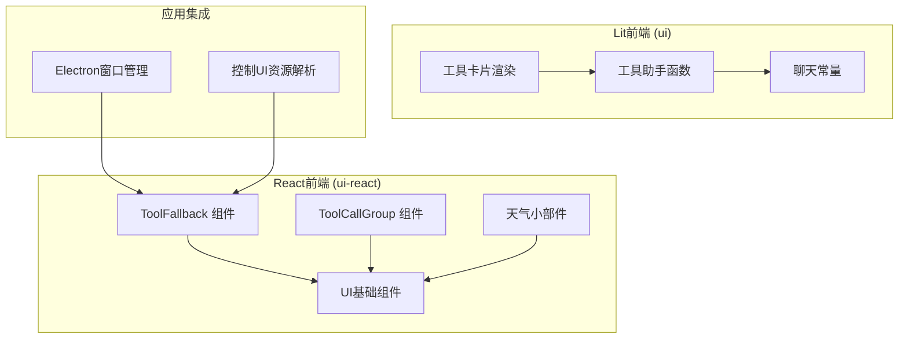
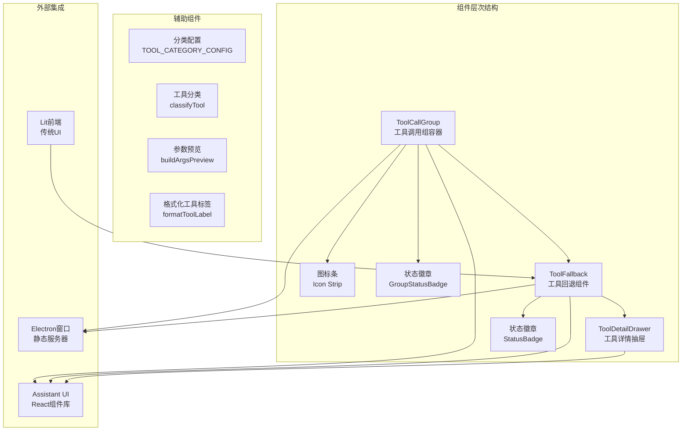
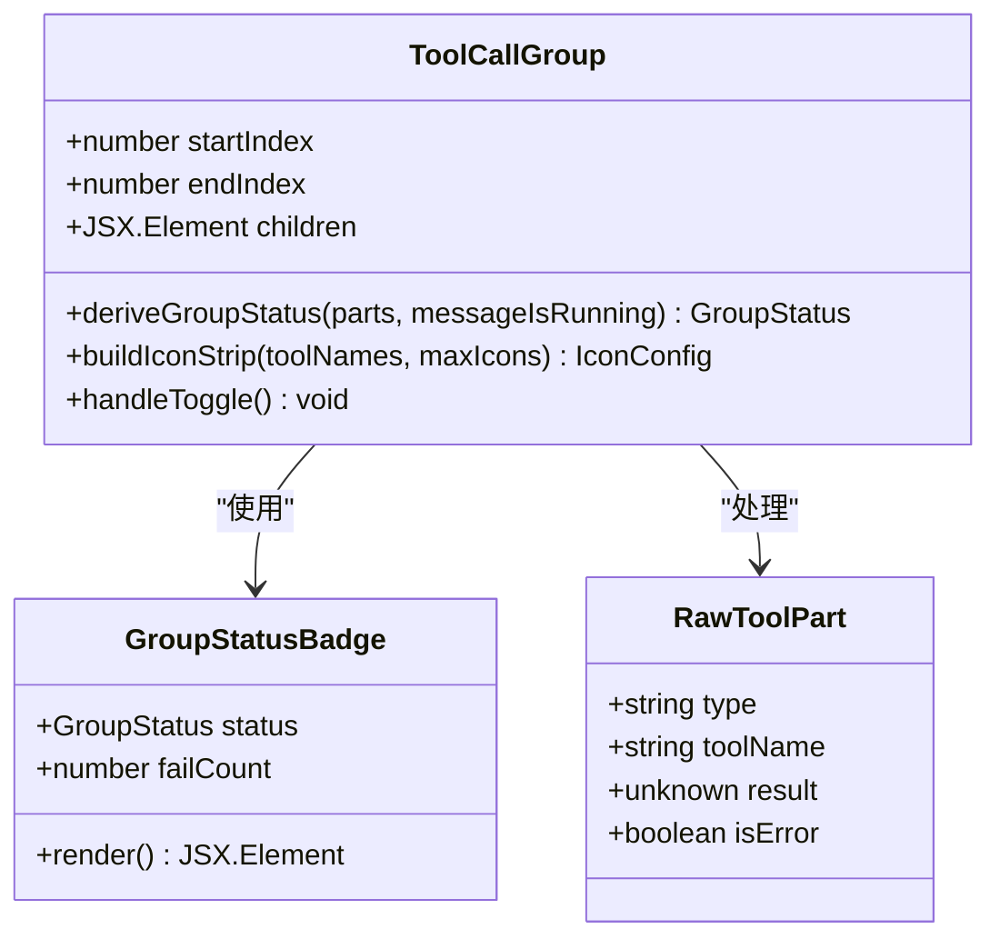
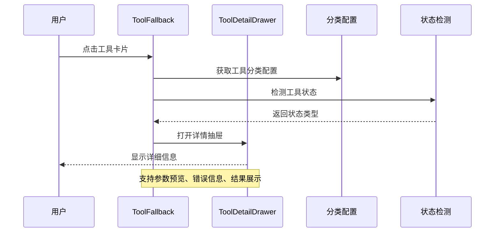
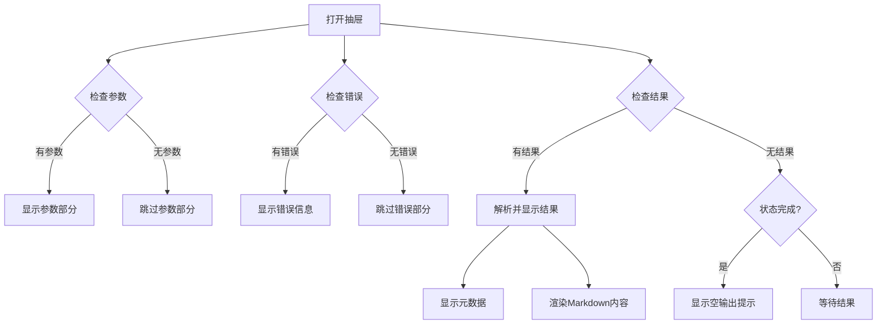
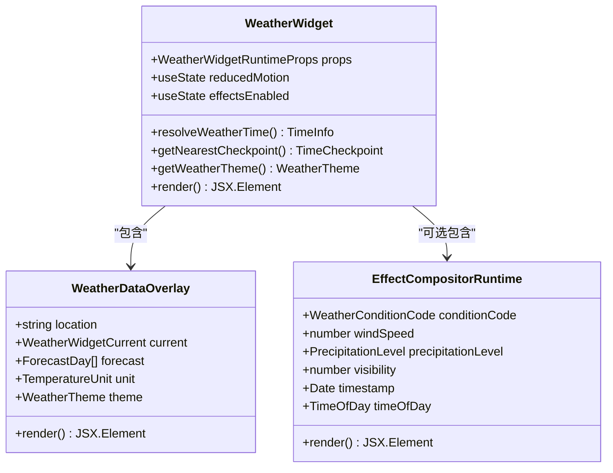
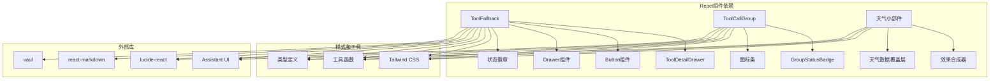

# 工具UI组件

<cite>
**本文档引用的文件**
- [ToolFallback.tsx](file://ui-react/src/components/chat/ToolFallback.tsx)
- [ToolCallGroup.tsx](file://ui-react/src/components/chat/ToolCallGroup.tsx)
- [weather-widget-container.tsx](file://ui-react/src/components/tool-ui/weather-widget/weather-widget-container.tsx)
- [runtime.ts](file://ui-react/src/components/tool-ui/weather-widget/runtime.ts)
- [tool-cards.ts](file://ui/src/ui/chat/tool-cards.ts)
- [tool-helpers.ts](file://ui/src/ui/chat/tool-helpers.ts)
- [constants.ts](file://ui/src/ui/chat/constants.ts)
- [button.tsx](file://ui-react/src/components/ui/button.tsx)
- [drawer.tsx](file://ui-react/src/components/ui/drawer.tsx)
- [utils.ts](file://ui-react/src/lib/utils.ts)
- [window.ts](file://apps/electron/src/main/window.ts)
- [control-ui-assets.ts](file://src/infra/control-ui-assets.ts)
</cite>

## 目录
1. [简介](#简介)
2. [项目结构](#项目结构)
3. [核心组件](#核心组件)
4. [架构概览](#架构概览)
5. [详细组件分析](#详细组件分析)
6. [依赖关系分析](#依赖关系分析)
7. [性能考虑](#性能考虑)
8. [故障排除指南](#故障排除指南)
9. [结论](#结论)

## 简介

工具UI组件是OpenClaw项目中用于展示和交互AI工具调用结果的核心界面组件。该组件系统提供了统一的工具调用可视化、状态管理和用户交互功能，支持多种工具类型（读取、写入、执行、搜索、网络请求等）的分类显示和详细查看。

该组件系统采用现代化的React设计，结合Tailwind CSS样式系统，为用户提供直观的工具调用体验。组件支持响应式设计，在桌面端和移动端都能提供良好的用户体验。

## 项目结构

OpenClaw项目的工具UI组件主要分布在两个前端框架中：

**图表来源**
- [ToolFallback.tsx:1-579](file://ui-react/src/components/chat/ToolFallback.tsx#L1-L579)
- [tool-cards.ts:1-157](file://ui/src/ui/chat/tool-cards.ts#L1-L157)
- [window.ts:127-164](file://apps/electron/src/main/window.ts#L127-L164)

**章节来源**
- [ToolFallback.tsx:1-579](file://ui-react/src/components/chat/ToolFallback.tsx#L1-L579)
- [tool-cards.ts:1-157](file://ui/src/ui/chat/tool-cards.ts#L1-L157)
- [window.ts:127-164](file://apps/electron/src/main/window.ts#L127-L164)

## 核心组件

工具UI组件系统包含以下核心组件：

### 工具分类系统
系统支持9种工具分类，每种分类都有对应的图标、颜色主题和操作标签：

| 分类 | 图标 | 颜色主题 | 操作标签 | 示例工具 |
|------|------|----------|----------|----------|
| read | FileTextIcon | 蓝色 | Read | 文件读取、数据获取 |
| write | PencilIcon | 橙色 | Write | 文件写入、数据更新 |
| exec | TerminalIcon | 紫色 | Exec | 命令执行、脚本运行 |
| search | SearchIcon | 青色 | Search | 搜索、查询 |
| web | GlobeIcon | 天蓝色 | Web | 网络请求、HTTP调用 |
| database | DatabaseIcon | 橙色 | Database | 数据库操作 |
| file | FolderIcon | 黄色 | File | 文件系统操作 |
| function | FunctionSquareIcon | 靛蓝色 | Call | 函数调用 |
| default | WrenchIcon | 灰色 | Tool | 其他工具 |

### 状态管理系统
工具调用状态分为三种：
- **running**: 工具正在执行中
- **complete**: 工具执行完成
- **incomplete**: 工具执行失败或被取消

**章节来源**
- [ToolFallback.tsx:78-154](file://ui-react/src/components/chat/ToolFallback.tsx#L78-L154)
- [ToolFallback.tsx:160-190](file://ui-react/src/components/chat/ToolFallback.tsx#L160-L190)

## 架构概览

工具UI组件系统采用分层架构设计，确保组件间的松耦合和高内聚：

**图表来源**
- [ToolCallGroup.tsx:147-274](file://ui-react/src/components/chat/ToolCallGroup.tsx#L147-L274)
- [ToolFallback.tsx:405-579](file://ui-react/src/components/chat/ToolFallback.tsx#L405-L579)

## 详细组件分析

### ToolCallGroup 组件

ToolCallGroup是工具调用组的容器组件，负责管理多个连续的工具调用：

**图表来源**
- [ToolCallGroup.tsx:142-274](file://ui-react/src/components/chat/ToolCallGroup.tsx#L142-L274)

#### 核心功能特性

1. **智能折叠管理**: 自动折叠和展开工具调用组
2. **状态聚合**: 将多个工具调用的状态聚合为组状态
3. **图标条显示**: 显示工具分类的图标条
4. **实时状态更新**: 监听消息流状态变化

**章节来源**
- [ToolCallGroup.tsx:40-67](file://ui-react/src/components/chat/ToolCallGroup.tsx#L40-L67)
- [ToolCallGroup.tsx:69-92](file://ui-react/src/components/chat/ToolCallGroup.tsx#L69-L92)

### ToolFallback 组件

ToolFallback是工具调用的回退显示组件，提供详细的工具调用信息：

**图表来源**
- [ToolFallback.tsx:405-579](file://ui-react/src/components/chat/ToolFallback.tsx#L405-L579)
- [ToolFallback.tsx:281-400](file://ui-react/src/components/chat/ToolFallback.tsx#L281-L400)

#### 详细功能模块

1. **工具分类识别**: 基于工具名称自动分类
2. **参数预览生成**: 智能提取关键参数进行预览
3. **状态检测**: 检测工具执行状态和错误
4. **详情抽屉**: 提供完整的工具调用详情

**章节来源**
- [ToolFallback.tsx:227-277](file://ui-react/src/components/chat/ToolFallback.tsx#L227-L277)
- [ToolFallback.tsx:438-452](file://ui-react/src/components/chat/ToolFallback.tsx#L438-L452)

### ToolDetailDrawer 组件

ToolDetailDrawer提供工具调用的详细信息展示：

**图表来源**
- [ToolFallback.tsx:294-400](file://ui-react/src/components/chat/ToolFallback.tsx#L294-L400)

**章节来源**
- [ToolFallback.tsx:327-387](file://ui-react/src/components/chat/ToolFallback.tsx#L327-L387)

### 天气小部件组件

天气小部件是一个专门的工具UI组件，用于展示天气信息：

**图表来源**
- [weather-widget-container.tsx:20-145](file://ui-react/src/components/tool-ui/weather-widget/weather-widget-container.tsx#L20-L145)

**章节来源**
- [weather-widget-container.tsx:75-96](file://ui-react/src/components/tool-ui/weather-widget/weather-widget-container.tsx#L75-L96)

## 依赖关系分析

工具UI组件系统的依赖关系如下：

**图表来源**
- [ToolFallback.tsx:1-32](file://ui-react/src/components/chat/ToolFallback.tsx#L1-L32)
- [ToolCallGroup.tsx:1-12](file://ui-react/src/components/chat/ToolCallGroup.tsx#L1-L12)

**章节来源**
- [button.tsx:1-56](file://ui-react/src/components/ui/button.tsx#L1-L56)
- [drawer.tsx:1-121](file://ui-react/src/components/ui/drawer.tsx#L1-L121)
- [utils.ts:1-7](file://ui-react/src/lib/utils.ts#L1-L7)

## 性能考虑

工具UI组件系统在设计时充分考虑了性能优化：

### 渲染优化
1. **条件渲染**: 只在需要时渲染详细信息
2. **状态缓存**: 使用React状态管理避免不必要的重渲染
3. **懒加载**: 抽屉组件按需加载

### 内存管理
1. **事件监听器清理**: 自动清理媒体查询监听器
2. **状态清理**: 组件卸载时清理所有订阅

### 用户体验优化
1. **无障碍访问**: 完整的键盘导航支持
2. **响应式设计**: 适配不同屏幕尺寸
3. **动画优化**: 减少运动偏好用户的视觉干扰

## 故障排除指南

### 常见问题及解决方案

#### 工具状态显示异常
**问题**: 工具状态不正确显示
**解决方案**: 
1. 检查工具返回的结果格式
2. 验证`isError`标志设置
3. 确认结果字符串中的错误标识

#### 参数预览不准确
**问题**: 工具参数预览显示不完整
**解决方案**:
1. 检查JSON参数格式
2. 验证参数键名匹配
3. 确认参数值的有效性

#### 抽屉组件无法打开
**问题**: 工具详情抽屉无法正常打开
**解决方案**:
1. 检查`canViewDetail`状态判断
2. 验证事件处理器绑定
3. 确认DOM元素存在

**章节来源**
- [ToolFallback.tsx:454-488](file://ui-react/src/components/chat/ToolFallback.tsx#L454-L488)
- [ToolFallback.tsx:490-513](file://ui-react/src/components/chat/ToolFallback.tsx#L490-L513)

## 结论

工具UI组件系统为OpenClaw项目提供了强大而灵活的工具调用可视化解决方案。通过模块化的组件设计、智能的状态管理和丰富的用户交互功能，该系统能够有效提升用户对AI工具调用的理解和控制能力。

系统的主要优势包括：
- **高度可扩展**: 支持新的工具类型和分类
- **用户体验优秀**: 直观的界面设计和流畅的交互
- **技术架构先进**: 基于现代React技术和最佳实践
- **性能优化完善**: 充分考虑了渲染性能和内存使用

未来可以考虑的功能增强包括：更多的工具类型支持、自定义主题选项、批量工具操作等功能。