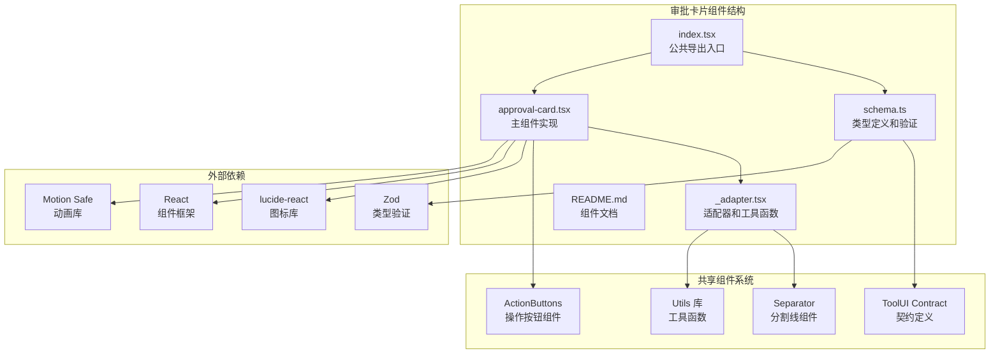
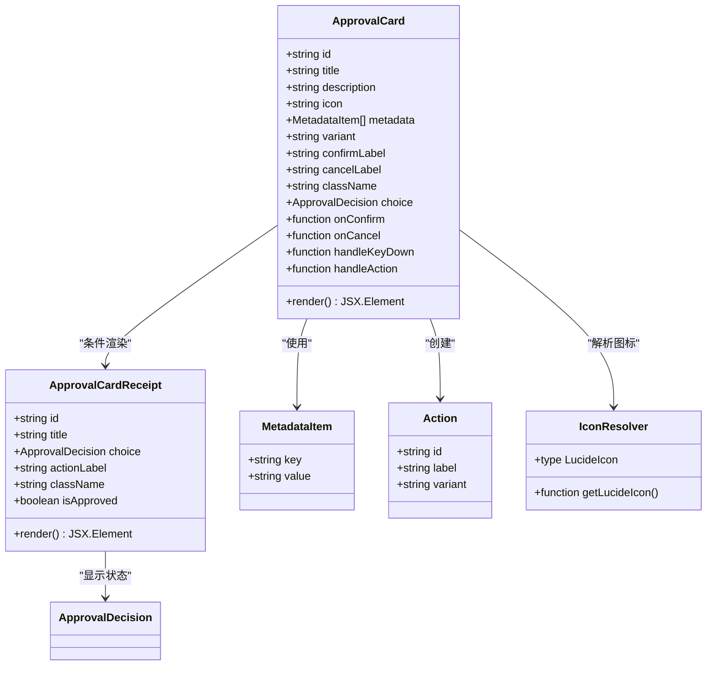
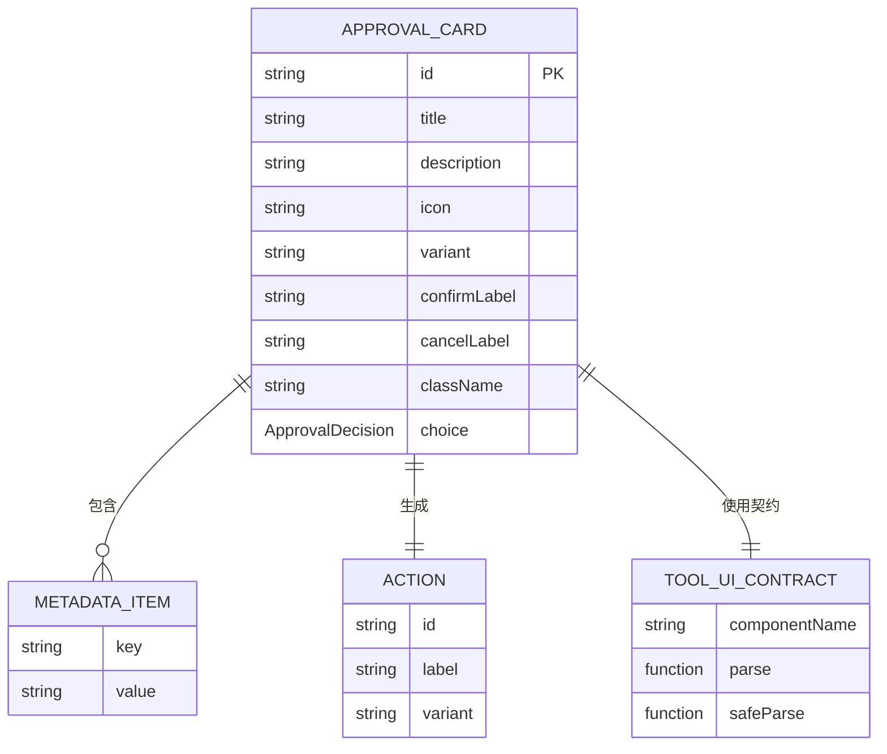
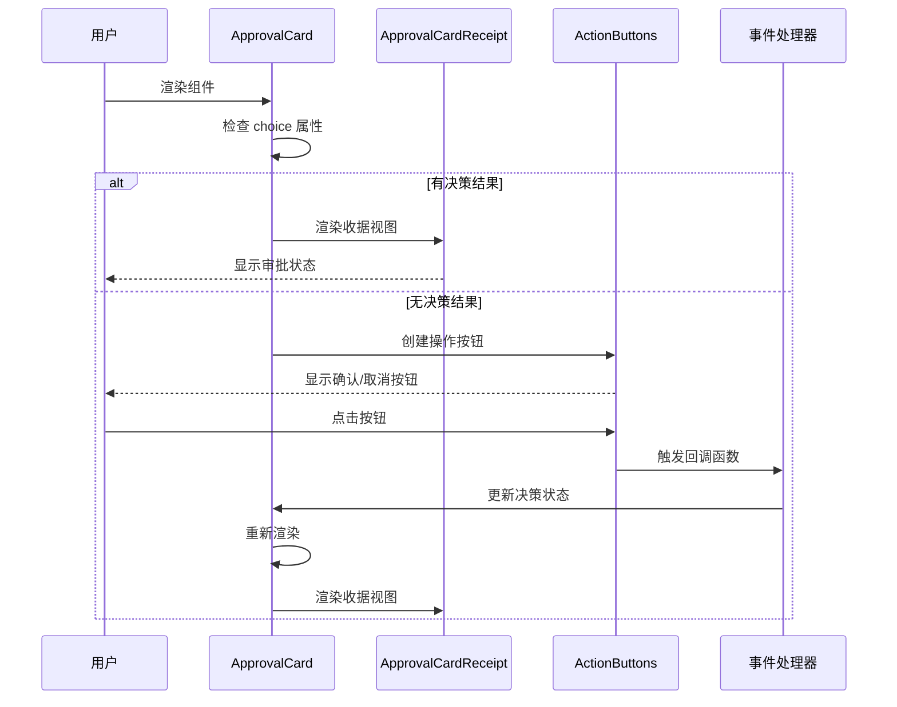
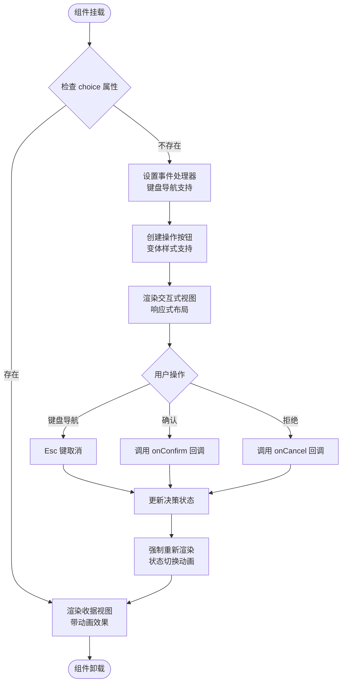
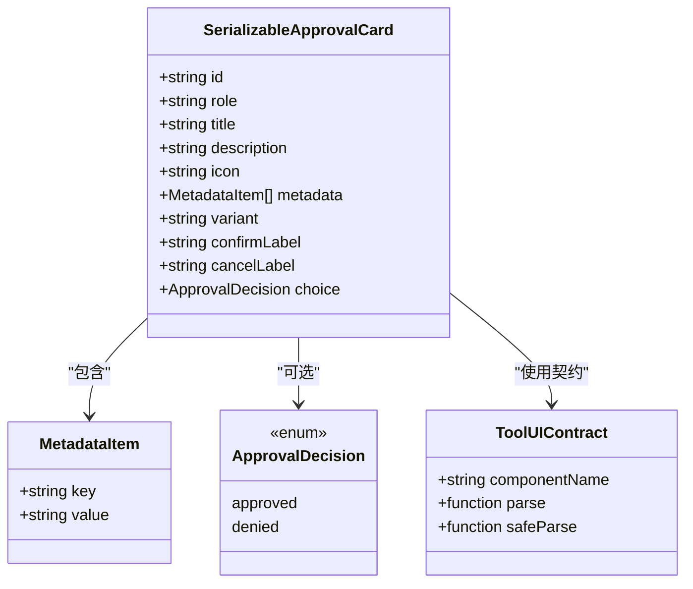
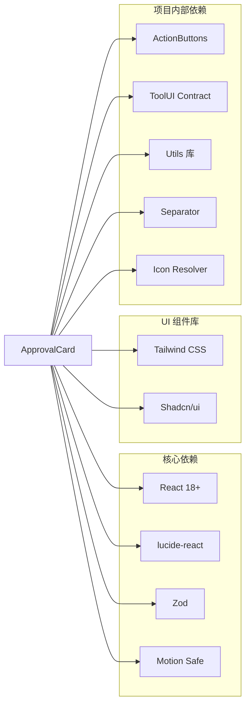
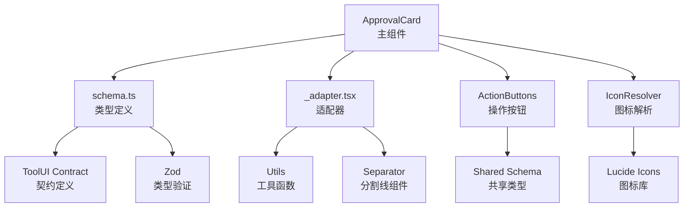

# 审批卡片组件

<cite>
**本文档引用的文件**
- [approval-card.tsx](file://ui-react/src/components/tool-ui/approval-card/approval-card.tsx)
- [schema.ts](file://ui-react/src/components/tool-ui/approval-card/schema.ts)
- [index.tsx](file://ui-react/src/components/tool-ui/approval-card/index.tsx)
- [_adapter.tsx](file://ui-react/src/components/tool-ui/approval-card/_adapter.tsx)
- [README.md](file://ui-react/src/components/tool-ui/approval-card/README.md)
- [utils.ts](file://ui-react/src/lib/utils.ts)
- [contract.ts](file://ui-react/src/components/tool-ui/shared/contract.ts)
</cite>

## 更新摘要
**所做更改**
- 更新了组件架构部分，反映新增的交互式和收据状态切换机制
- 新增了键盘导航功能的详细说明
- 添加了动画效果和过渡效果的技术实现分析
- 更新了依赖关系分析，包含新的共享组件依赖
- 增强了性能考虑部分，涵盖新的渲染优化策略

## 目录
1. [简介](#简介)
2. [项目结构](#项目结构)
3. [核心组件](#核心组件)
4. [架构概览](#架构概览)
5. [详细组件分析](#详细组件分析)
6. [依赖关系分析](#依赖关系分析)
7. [性能考虑](#性能考虑)
8. [故障排除指南](#故障排除指南)
9. [结论](#结论)

## 简介

审批卡片组件是 OpenClaw 项目中的一个关键工具界面组件，用于处理用户审批请求和显示审批结果。该组件提供了直观的用户界面，允许用户对各种操作进行批准或拒绝，并以视觉化的方式展示审批状态。

**重大增强功能：**
- **交互式和收据状态切换**：组件现在支持动态状态切换，在用户做出决策后自动转换为收据视图
- **键盘导航支持**：新增 Esc 键快速取消功能，提升无障碍访问体验
- **动画效果系统**：集成 Motion Safe 动画库，提供流畅的过渡效果
- **增强的组件架构**：重构了组件结构，提高了代码可维护性和扩展性

该组件支持两种主要视图模式：
- **交互式视图**：当用户尚未做出决策时，显示完整的审批对话框，包含标题、描述、元数据和操作按钮
- **收据视图**：当用户已做出决策后，显示简洁的状态指示器，表明审批结果

## 项目结构

审批卡片组件位于 UI React 项目的工具界面组件目录中，采用模块化设计，现已集成到更完整的组件生态系统中：

**图表来源**
- [index.tsx:1-8](file://ui-react/src/components/tool-ui/approval-card/index.tsx#L1-L8)
- [schema.ts:1-55](file://ui-react/src/components/tool-ui/approval-card/schema.ts#L1-L55)
- [approval-card.tsx:1-213](file://ui-react/src/components/tool-ui/approval-card/approval-card.tsx#L1-L213)

**章节来源**
- [README.md:1-20](file://ui-react/src/components/tool-ui/approval-card/README.md#L1-L20)
- [index.tsx:1-8](file://ui-react/src/components/tool-ui/approval-card/index.tsx#L1-L8)

## 核心组件

### 组件架构概述

审批卡片组件采用函数式组件设计，结合 React Hooks 实现状态管理和事件处理。组件支持响应式设计和无障碍访问，提供流畅的用户体验。**新增的关键架构改进包括：**

**图表来源**
- [approval-card.tsx:23-75](file://ui-react/src/components/tool-ui/approval-card/approval-card.tsx#L23-L75)
- [schema.ts:5-14](file://ui-react/src/components/tool-ui/approval-card/schema.ts#L5-L14)

### 数据模型

组件使用 Zod 进行类型安全的数据验证，确保传入的数据符合预期格式。**新增了工具 UI 契约系统，提供更好的错误处理和调试支持：**

**图表来源**
- [schema.ts:16-31](file://ui-react/src/components/tool-ui/approval-card/schema.ts#L16-L31)
- [schema.ts:5-8](file://ui-react/src/components/tool-ui/approval-card/schema.ts#L5-L8)

**章节来源**
- [schema.ts:1-55](file://ui-react/src/components/tool-ui/approval-card/schema.ts#L1-L55)

## 架构概览

审批卡片组件遵循组件化架构原则，通过清晰的职责分离实现高内聚低耦合的设计。**新增的架构增强包括：**

**图表来源**
- [approval-card.tsx:77-213](file://ui-react/src/components/tool-ui/approval-card/approval-card.tsx#L77-L213)

### 组件生命周期

组件采用 React 的现代 Hooks API，实现了高效的渲染优化和状态管理。**新增的关键生命周期改进：**

**图表来源**
- [approval-card.tsx:96-115](file://ui-react/src/components/tool-ui/approval-card/approval-card.tsx#L96-L115)

**章节来源**
- [approval-card.tsx:1-213](file://ui-react/src/components/tool-ui/approval-card/approval-card.tsx#L1-L213)

## 详细组件分析

### 主要组件实现

#### ApprovalCard 主组件

主组件负责处理审批逻辑和视图渲染，支持多种配置选项和交互模式。**新增的核心功能特性：**

**交互式视图功能：**
- 动态图标加载（基于 Lucide 图标库）
- 变体样式支持（默认/破坏性）
- 键盘快捷键支持（Esc 键取消）
- 响应式布局设计
- 无障碍访问支持

**收据视图功能：**
- 状态指示器自动切换
- 成功/失败状态的颜色区分
- 流畅的动画过渡效果
- 语义化标签支持

**章节来源**
- [approval-card.tsx:77-213](file://ui-react/src/components/tool-ui/approval-card/approval-card.tsx#L77-L213)

#### ApprovalCardReceipt 收据组件

收据组件用于显示审批结果的状态指示器，**新增了丰富的视觉反馈和动画效果：**

**设计特点：**
- 简洁的视觉反馈
- 成功/失败状态的颜色区分
- Motion Safe 动画系统集成
- 流畅的淡入和缩放效果
- 语义化标签支持

**动画效果实现：**
- `motion-safe:animate-in` - 条件动画支持
- `motion-safe:fade-in` - 淡入效果
- `motion-safe:blur-in-sm` - 模糊渐入
- `motion-safe:zoom-in-95` - 微缩放效果
- `motion-safe:duration-300` - 300ms 持续时间
- `motion-safe:ease-[cubic-bezier(0.16,1,0.3,1)]` - 自定义缓动函数

**章节来源**
- [approval-card.tsx:31-75](file://ui-react/src/components/tool-ui/approval-card/approval-card.tsx#L31-L75)

### 类型系统和验证

组件使用 Zod 实现强类型验证，确保数据完整性。**新增了工具 UI 契约系统，提供更好的错误处理：**

**图表来源**
- [schema.ts:16-31](file://ui-react/src/components/tool-ui/approval-card/schema.ts#L16-L31)
- [schema.ts:5-14](file://ui-react/src/components/tool-ui/approval-card/schema.ts#L5-L14)

**章节来源**
- [schema.ts:1-55](file://ui-react/src/components/tool-ui/approval-card/schema.ts#L1-L55)

### 样式和主题系统

组件集成到整体的设计系统中，使用 Tailwind CSS 实现一致的视觉风格。**新增了动画和过渡效果支持：**

**样式特性：**
- 圆角边框设计
- 阴影层次效果
- 颜色变体支持
- 响应式断点
- 动画过渡效果
- Motion Safe 条件动画

**章节来源**
- [_adapter.tsx:1-3](file://ui-react/src/components/tool-ui/approval-card/_adapter.tsx#L1-L3)

## 依赖关系分析

### 外部依赖

审批卡片组件依赖于以下关键依赖项，**新增了动画库和共享组件依赖：**

**图表来源**
- [approval-card.tsx:3-9](file://ui-react/src/components/tool-ui/approval-card/approval-card.tsx#L3-L9)

### 内部依赖关系

组件之间的依赖关系体现了清晰的分层架构，**新增了共享组件和工具函数依赖：**

**图表来源**
- [approval-card.tsx:4-7](file://ui-react/src/components/tool-ui/approval-card/approval-card.tsx#L4-L7)
- [schema.ts:2-3](file://ui-react/src/components/tool-ui/approval-card/schema.ts#L2-L3)

**章节来源**
- [index.tsx:1-8](file://ui-react/src/components/tool-ui/approval-card/index.tsx#L1-L8)

## 性能考虑

### 渲染优化

组件采用了多项性能优化策略，**新增了动画和状态切换优化：**

1. **React.memo 包装**：避免不必要的重新渲染
2. **useCallback 缓存**：稳定回调函数引用
3. **条件渲染**：根据状态选择最优视图
4. **懒加载图标**：按需加载图标资源
5. **状态键优化**：使用 `viewKey` 优化视图切换
6. **Motion Safe 条件动画**：仅在支持的设备上启用动画

### 内存管理

- 合理的事件监听器清理
- 避免内存泄漏的副作用
- 优化的样式类名生成
- 图标组件的智能缓存

### 动画性能优化

- **硬件加速**：利用 GPU 加速动画效果
- **帧率优化**：300ms 持续时间确保流畅体验
- **条件执行**：仅在支持的浏览器中启用复杂动画
- **内存优化**：动画状态的智能清理

## 故障排除指南

### 常见问题和解决方案

**问题 1：图标不显示**
- 检查图标名称是否正确
- 确认 lucide-react 版本兼容性
- 验证图标名称格式（kebab-case）
- 检查 `getLucideIcon` 函数的解析逻辑

**问题 2：样式异常**
- 检查 Tailwind CSS 配置
- 验证颜色变体设置
- 确认响应式断点配置
- 检查 Motion Safe 动画类名

**问题 3：类型验证错误**
- 检查数据结构完整性
- 验证必填字段
- 确认枚举值范围
- 检查工具 UI 契约的错误信息

**问题 4：动画不工作**
- 检查浏览器对 Motion Safe 的支持
- 验证动画类名的正确性
- 确认设备的硬件加速支持
- 检查 CSS 动画的兼容性

**章节来源**
- [schema.ts:16-31](file://ui-react/src/components/tool-ui/approval-card/schema.ts#L16-L31)

### 调试技巧

1. **使用 React DevTools**：检查组件树和状态
2. **启用严格模式**：发现潜在问题
3. **日志记录**：跟踪事件流和状态变化
4. **单元测试**：验证边界条件和动画效果
5. **性能监控**：检查渲染性能和动画帧率

## 结论

审批卡片组件经过重大增强后，已成为一个功能完整、性能优异的现代化 UI 组件。**主要技术优势包括：**

**架构优势：**
- 强类型系统确保数据完整性
- 现代 React Hooks API 提供高效的状态管理
- 清晰的架构设计便于维护和扩展
- 完善的无障碍访问支持
- 动态状态切换机制

**用户体验增强：**
- 直观的视觉反馈和动画效果
- 流畅的过渡动画和状态切换
- 响应式的布局设计
- 键盘导航支持
- 支持硬件加速的高性能动画

**技术实现亮点：**
- Motion Safe 动画系统的深度集成
- 工具 UI 契约系统的错误处理机制
- 智能的图标解析和缓存机制
- 条件渲染优化和性能监控
- 完善的 TypeScript 类型定义

**最佳实践体现：**
- 遵循组件化开发原则
- 使用类型安全的编程范式
- 注重性能和可访问性
- 提供完善的文档和示例
- 支持渐进式增强的动画效果

该组件为 OpenClaw 项目提供了可靠的审批功能基础，其现代化的架构设计和丰富的功能特性使其成为其他类似组件的优秀参考实现。