# 富工具UI基础设施

<cite>
**本文档引用的文件**
- [README.md](file://README.md)
- [package.json](file://package.json)
- [ui/package.json](file://ui/package.json)
- [ui-react/package.json](file://ui-react/package.json)
- [apps/macos/Package.swift](file://apps/macos/Package.swift)
- [apps/shared/OpenClawKit/Package.swift](file://apps/shared/OpenClawKit/Package.swift)
- [src/web/accounts.ts](file://src/web/accounts.ts)
- [src/web/login-qr.ts](file://src/web/login-qr.ts)
- [src/web/inbound.ts](file://src/web/inbound.ts)
- [ui/src/main.ts](file://ui/src/main.ts)
- [ui-react/src/main.tsx](file://ui-react/src/main.tsx)
- [ui-react/src/components/chat/tool-rich-presentation.tsx](file://ui-react/src/components/chat/tool-rich-presentation.tsx)
- [ui-react/src/components/chat/parse-tool-ui-payload.ts](file://ui-react/src/components/chat/parse-tool-ui-payload.ts)
- [ui-react/src/components/chat/parse-weather-widget-payload.ts](file://ui-react/src/components/chat/parse-weather-widget-payload.ts)
- [ui-react/src/components/tool-ui/chart/schema.ts](file://ui-react/src/components/tool-ui/chart/schema.ts)
- [ui-react/src/components/tool-ui/code-block/schema.ts](file://ui-react/src/components/tool-ui/code-block/schema.ts)
- [ui-react/src/components/tool-ui/weather-widget/schema-runtime.ts](file://ui-react/src/components/tool-ui/weather-widget/schema-runtime.ts)
- [ui-react/src/components/tool-ui/chart/chart.tsx](file://ui-react/src/components/tool-ui/chart/chart.tsx)
- [ui-react/src/components/tool-ui/code-block/code-block.tsx](file://ui-react/src/components/tool-ui/code-block/code-block.tsx)
- [ui-react/src/components/tool-ui/weather-widget/weather-widget-container.tsx](file://ui-react/src/components/tool-ui/weather-widget/weather-widget-container.tsx)
- [ui-react/src/components/chat/ToolFallback.tsx](file://ui-react/src/components/chat/ToolFallback.tsx)
- [skills/openclaw-tool-ui/SKILL.md](file://skills/openclaw-tool-ui/SKILL.md)
</cite>

## 更新摘要
**所做更改**
- 新增富工具展示系统章节，详细介绍tool-rich-presentation.tsx组件及其相关工具UI组件
- 添加天气小部件、图表、统计信息、链接预览、代码块和终端输出的可视化展示能力说明
- 更新UI组件系统架构图以反映富工具展示系统的集成
- 新增工具UI组件的详细技术规格和使用示例

## 目录
1. [简介](#简介)
2. [项目结构](#项目结构)
3. [核心组件](#核心组件)
4. [富工具展示系统](#富工具展示系统)
5. [架构概览](#架构概览)
6. [详细组件分析](#详细组件分析)
7. [依赖关系分析](#依赖关系分析)
8. [性能考虑](#性能考虑)
9. [故障排除指南](#故障排除指南)
10. [结论](#结论)

## 简介

OpenClaw是一个个人AI助手平台，提供富工具UI基础设施，支持多渠道消息集成、实时聊天界面、设备节点控制等功能。该项目采用现代化的技术栈，包括TypeScript、React、Lit等前端框架，以及Swift、Node.js等后端技术。

项目的核心目标是为用户提供本地化、快速且始终在线的个人AI助手体验，支持多种消息渠道（WhatsApp、Telegram、Slack、Discord等）和设备平台（macOS、iOS、Android）。

**更新** 新增富工具展示系统，提供丰富的工具输出可视化展示能力，包括天气小部件、图表、统计信息、链接预览、代码块和终端输出的精美呈现。

## 项目结构

OpenClaw项目采用模块化的多层次架构设计：

```mermaid
graph TB
subgraph "根目录"
Root[package.json]
Docs[docs/ 文档]
Scripts[scripts/ 脚本]
Test[test/ 测试]
end
subgraph "应用层"
Electron[apps/electron/ Electron应用]
Android[apps/android/ Android应用]
iOS[apps/ios/ iOS应用]
MacOS[apps/macos/ macOS应用]
Shared[apps/shared/ 共享组件]
end
subgraph "核心引擎"
Src[src/ 核心源码]
Web[src/web/ Web服务]
Gateway[src/gateway/ 网关服务]
Channels[src/channels/ 频道集成]
end
subgraph "用户界面"
UI[ui/ 原生UI]
UIReact[ui-react/ React UI]
Assets[assets/ 资源文件]
end
subgraph "扩展系统"
Extensions[extensions/ 扩展插件]
Skills[skills/ 技能系统]
Plugins[plugins/ 插件系统]
end
subgraph "富工具展示系统"
ToolUI[ui-react/src/components/tool-ui/ 工具UI组件]
RichPresentation[ui-react/src/components/chat/tool-rich-presentation.tsx 富工具展示]
End
Root --> Src
Root --> UI
Root --> Extensions
Src --> Web
Src --> Gateway
Src --> Channels
Shared --> MacOS
Shared --> iOS
Shared --> Android
UIReact --> ToolUI
UIReact --> RichPresentation
```

**图表来源**
- [package.json:1-477](file://package.json#L1-L477)
- [README.md:1-560](file://README.md#L1-L560)

**章节来源**
- [package.json:1-477](file://package.json#L1-L477)
- [README.md:1-560](file://README.md#L1-L560)

## 核心组件

### UI基础设施架构

OpenClaw提供了两套并行的UI基础设施：

1. **原生UI系统**：基于Lit框架构建，专注于轻量级和高性能
2. **React UI系统**：基于React 19和Assistant UI组件库，提供更丰富的交互体验

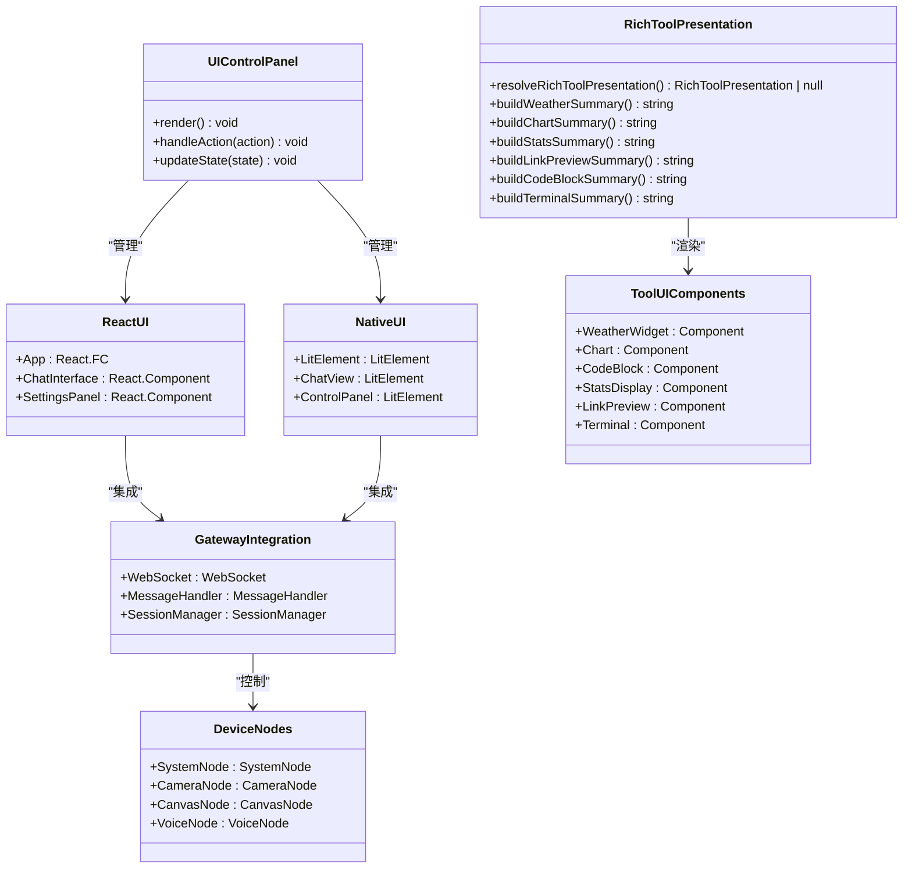

**图表来源**
- [ui/package.json:1-28](file://ui/package.json#L1-L28)
- [ui-react/package.json:1-73](file://ui-react/package.json#L1-L73)
- [ui-react/src/components/chat/tool-rich-presentation.tsx:16-20](file://ui-react/src/components/chat/tool-rich-presentation.tsx#L16-L20)

### 渠道认证系统

OpenClaw实现了统一的渠道认证管理，支持多种消息渠道的OAuth认证流程：

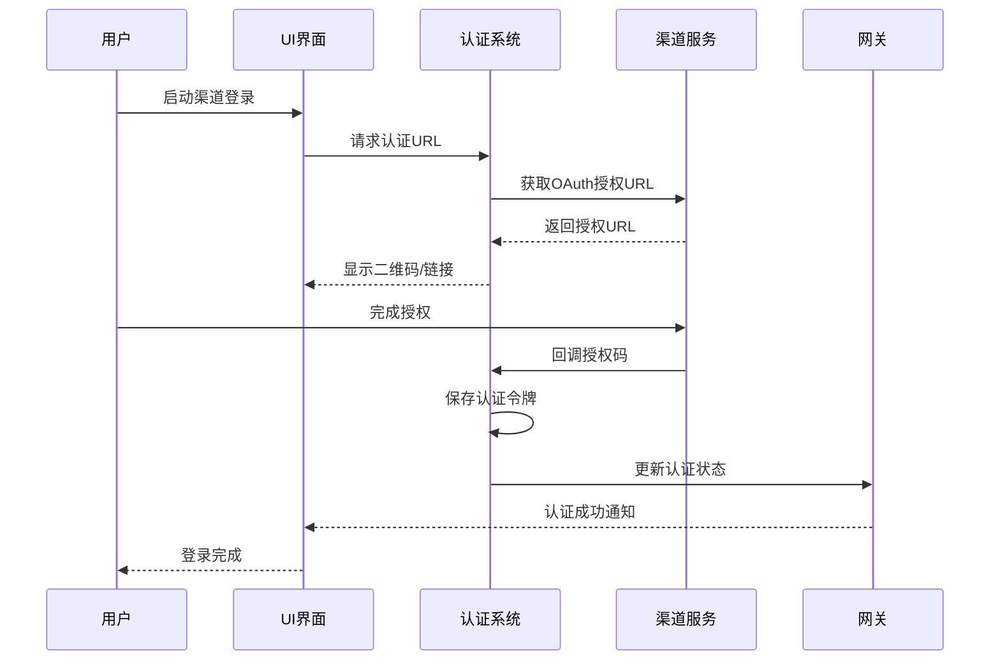

**图表来源**
- [src/web/login-qr.ts:108-214](file://src/web/login-qr.ts#L108-L214)
- [src/web/accounts.ts:116-150](file://src/web/accounts.ts#L116-L150)

**章节来源**
- [src/web/accounts.ts:1-167](file://src/web/accounts.ts#L1-167)
- [src/web/login-qr.ts:1-296](file://src/web/login-qr.ts#L1-L296)

## 富工具展示系统

### 系统概述

富工具展示系统是OpenClaw UI基础设施的重要组成部分，专门负责将工具调用的结构化输出转换为美观、交互式的可视化组件。该系统通过tool-rich-presentation.tsx组件为核心，集成了多种专用的工具UI组件。

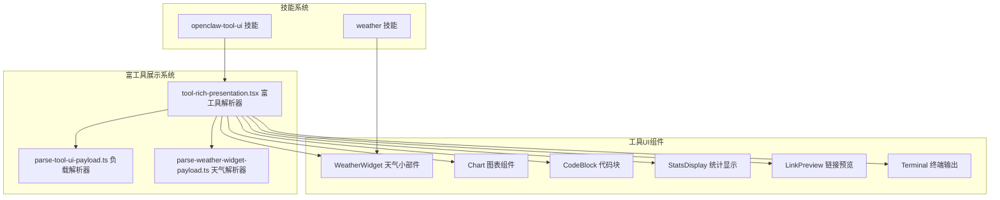

**图表来源**
- [ui-react/src/components/chat/tool-rich-presentation.tsx:96-179](file://ui-react/src/components/chat/tool-rich-presentation.tsx#L96-L179)
- [ui-react/src/components/chat/parse-tool-ui-payload.ts:4-29](file://ui-react/src/components/chat/parse-tool-ui-payload.ts#L4-L29)
- [ui-react/src/components/chat/parse-weather-widget-payload.ts:22-77](file://ui-react/src/components/chat/parse-weather-widget-payload.ts#L22-L77)

### 支持的工具类型

富工具展示系统目前支持以下六种主要的工具输出类型：

| 工具名称 | 组件类型 | 主要用途 | 可推广性 |
|---------|---------|---------|---------|
| `weather_widget` | 天气小部件 | 天气预报和实时天气信息 | ✅ 是 |
| `chart` | 图表组件 | 数据可视化和趋势分析 | ✅ 是 |
| `code_block` | 代码块 | 语法高亮的代码片段展示 | ❌ 否 |
| `link_preview` | 链接预览 | 网页内容预览和摘要 | ✅ 是 |
| `stats_display` | 统计显示 | KPI仪表板和指标展示 | ✅ 是 |
| `terminal_output` | 终端输出 | 命令行输出和日志展示 | ❌ 否 |

### 工具解析流程

富工具展示系统采用标准化的解析流程，确保各种工具输出都能被正确识别和渲染：

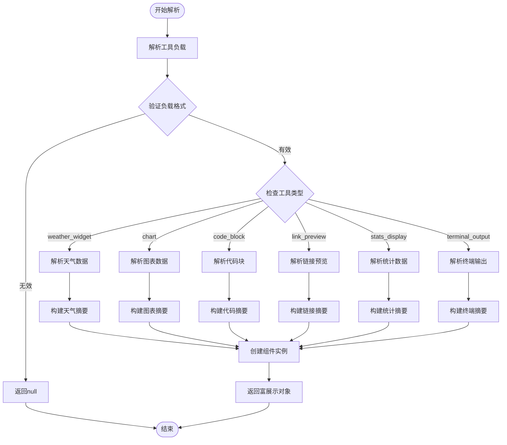

**图表来源**
- [ui-react/src/components/chat/tool-rich-presentation.tsx:96-179](file://ui-react/src/components/chat/tool-rich-presentation.tsx#L96-L179)

### 天气小部件组件

天气小部件是富工具展示系统中最复杂的组件之一，提供了完整的天气信息可视化功能：

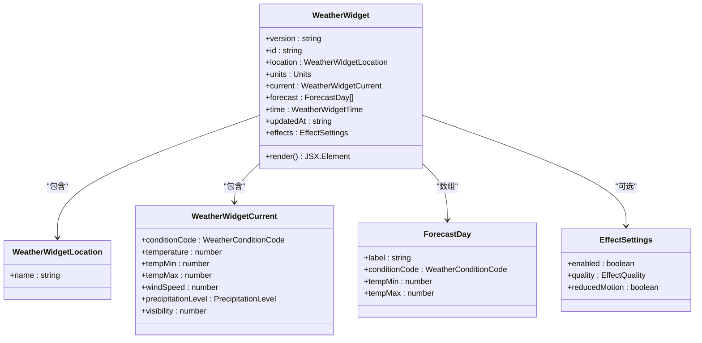

**图表来源**
- [ui-react/src/components/tool-ui/weather-widget/schema-runtime.ts:48-72](file://ui-react/src/components/tool-ui/weather-widget/schema-runtime.ts#L48-L72)
- [ui-react/src/components/tool-ui/weather-widget/weather-widget-container.tsx:20-31](file://ui-react/src/components/tool-ui/weather-widget/weather-widget-container.tsx#L20-L31)

**章节来源**
- [ui-react/src/components/chat/tool-rich-presentation.tsx:106-116](file://ui-react/src/components/chat/tool-rich-presentation.tsx#L106-L116)
- [ui-react/src/components/tool-ui/weather-widget/schema-runtime.ts:1-73](file://ui-react/src/components/tool-ui/weather-widget/schema-runtime.ts#L1-L73)
- [ui-react/src/components/tool-ui/weather-widget/weather-widget-container.tsx:1-145](file://ui-react/src/components/tool-ui/weather-widget/weather-widget-container.tsx#L1-L145)

### 图表组件系统

图表组件提供了灵活的数据可视化能力，支持柱状图和折线图两种类型：

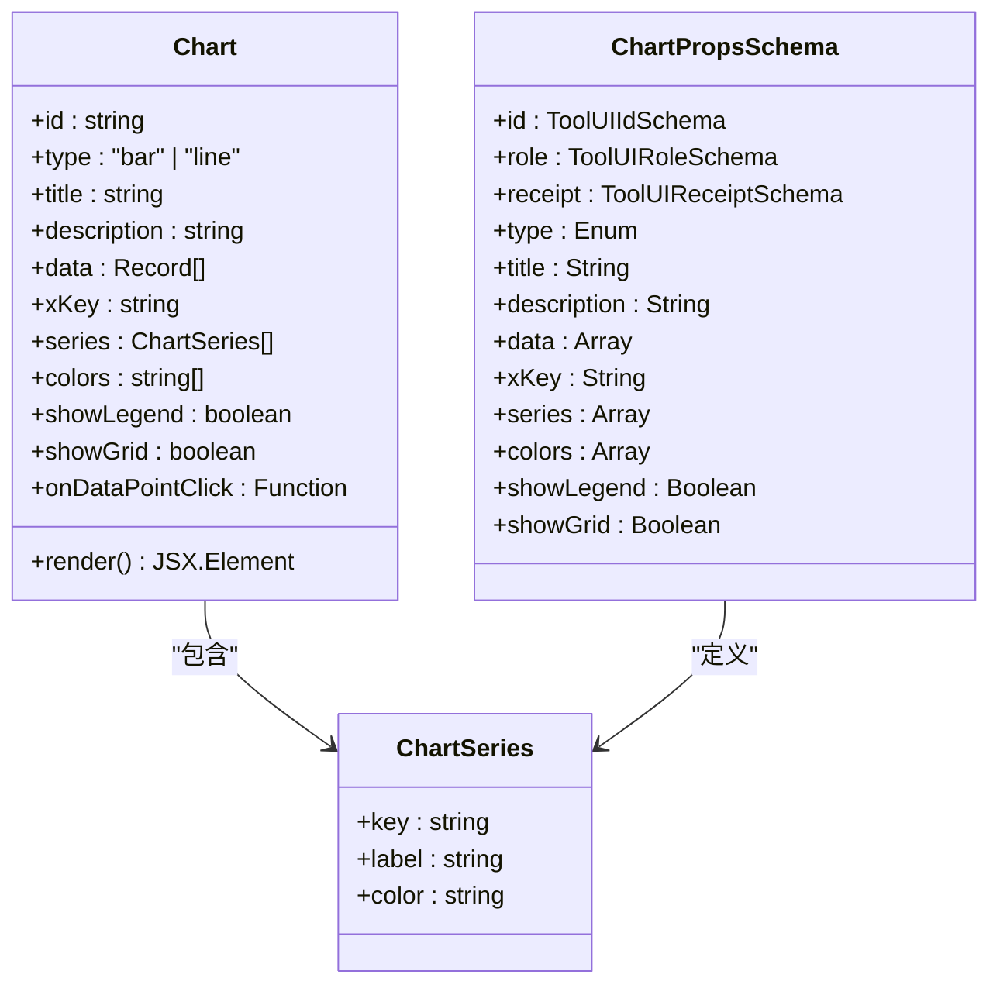

**图表来源**
- [ui-react/src/components/tool-ui/chart/schema.ts:9-32](file://ui-react/src/components/tool-ui/chart/schema.ts#L9-L32)
- [ui-react/src/components/tool-ui/chart/chart.tsx:39-52](file://ui-react/src/components/tool-ui/chart/chart.tsx#L39-L52)

**章节来源**
- [ui-react/src/components/chat/tool-rich-presentation.tsx:130-140](file://ui-react/src/components/chat/tool-rich-presentation.tsx#L130-L140)
- [ui-react/src/components/tool-ui/chart/schema.ts:1-122](file://ui-react/src/components/tool-ui/chart/schema.ts#L1-L122)
- [ui-react/src/components/tool-ui/chart/chart.tsx:1-183](file://ui-react/src/components/tool-ui/chart/chart.tsx#L1-L183)

### 代码块组件

代码块组件提供了专业的代码展示功能，包括语法高亮、行号显示和复制功能：

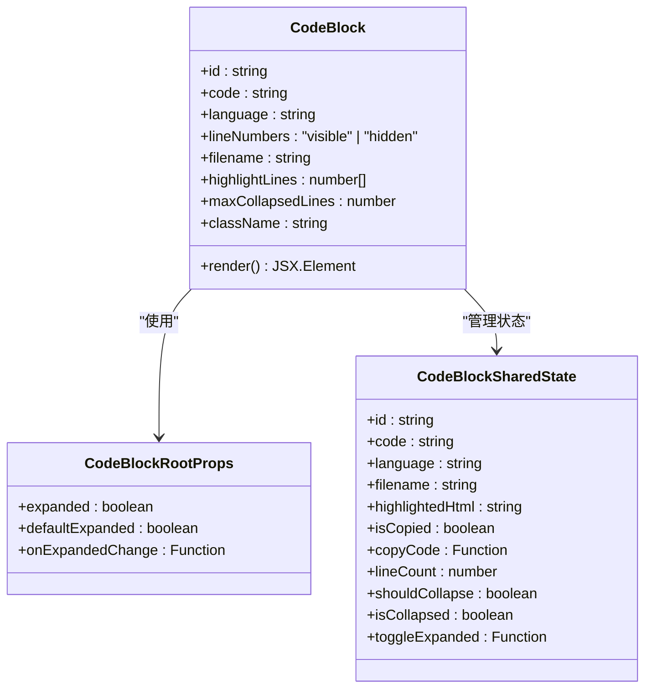

**图表来源**
- [ui-react/src/components/tool-ui/code-block/schema.ts:9-20](file://ui-react/src/components/tool-ui/code-block/schema.ts#L9-L20)
- [ui-react/src/components/tool-ui/code-block/code-block.tsx:178-191](file://ui-react/src/components/tool-ui/code-block/code-block.tsx#L178-L191)

**章节来源**
- [ui-react/src/components/chat/tool-rich-presentation.tsx:118-128](file://ui-react/src/components/chat/tool-rich-presentation.tsx#L118-L128)
- [ui-react/src/components/tool-ui/code-block/schema.ts:1-44](file://ui-react/src/components/tool-ui/code-block/schema.ts#L1-L44)
- [ui-react/src/components/tool-ui/code-block/code-block.tsx:1-468](file://ui-react/src/components/tool-ui/code-block/code-block.tsx#L1-L468)

## 架构概览

OpenClaw采用分层架构设计，确保系统的可扩展性和维护性：

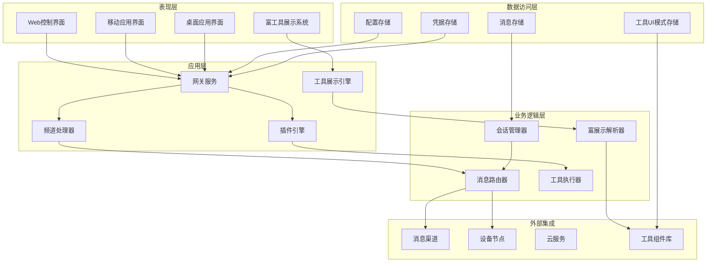

**图表来源**
- [apps/macos/Package.swift:6-92](file://apps/macos/Package.swift#L6-L92)
- [apps/shared/OpenClawKit/Package.swift:5-61](file://apps/shared/OpenClawKit/Package.swift#L5-L61)

## 详细组件分析

### 渠道认证与会话管理

#### WhatsApp认证流程

OpenClaw为WhatsApp提供了完整的认证和会话管理机制：

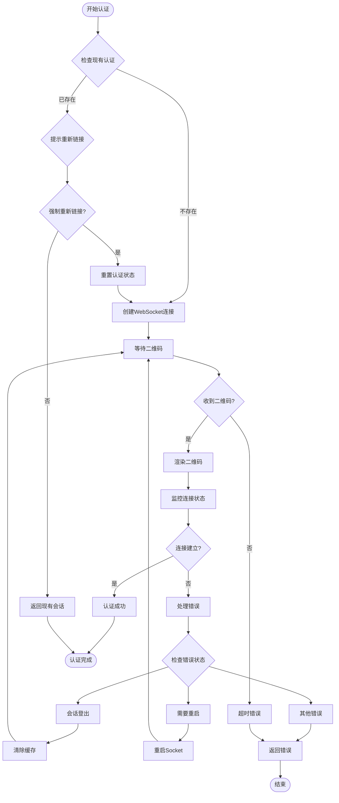

**图表来源**
- [src/web/login-qr.ts:108-295](file://src/web/login-qr.ts#L108-L295)

#### 多账户支持架构

系统支持多个WhatsApp账户的并行管理：

| 属性 | 默认账户 | 自定义账户 |
|------|----------|------------|
| 认证目录 | `~/.openclaw/oauth/whatsapp/main` | `~/.openclaw/oauth/whatsapp/{accountId}` |
| 凭据文件 | `creds.json` | `{accountId}/creds.json` |
| 配置优先级 | 全局配置 | 账户特定配置 |
| 权限范围 | 基础权限 | 可定制权限 |

**章节来源**
- [src/web/accounts.ts:12-32](file://src/web/accounts.ts#L12-L32)
- [src/web/accounts.ts:94-114](file://src/web/accounts.ts#L94-L114)

### 设备节点控制系统

#### 节点发现与通信

OpenClaw实现了跨平台的设备节点发现和通信机制：

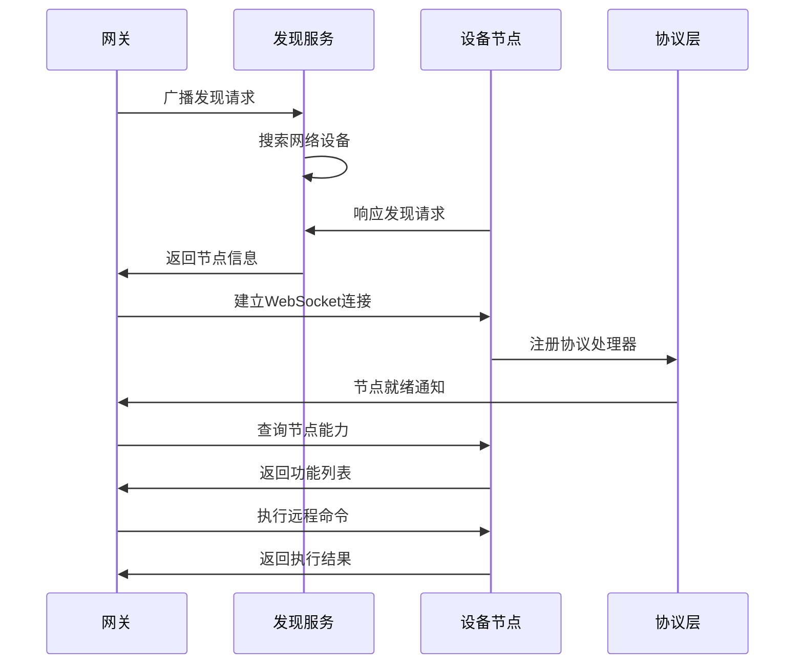

**图表来源**
- [apps/macos/Package.swift:26-78](file://apps/macos/Package.swift#L26-L78)
- [apps/shared/OpenClawKit/Package.swift:20-52](file://apps/shared/OpenClawKit/Package.swift#L20-L52)

### UI组件系统

#### React组件架构

React UI系统基于现代前端技术栈构建：

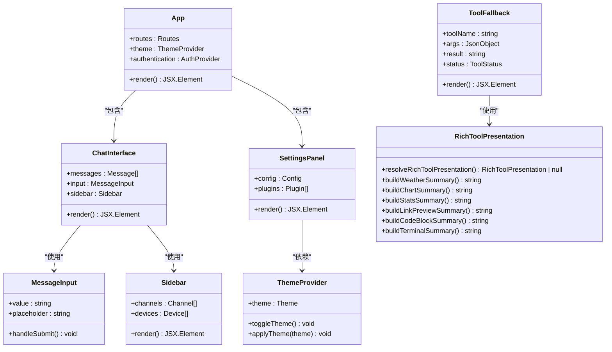

**图表来源**
- [ui-react/src/main.tsx:1-11](file://ui-react/src/main.tsx#L1-L11)
- [ui-react/package.json:11-59](file://ui-react/package.json#L11-L59)
- [ui-react/src/components/chat/ToolFallback.tsx:215-263](file://ui-react/src/components/chat/ToolFallback.tsx#L215-L263)

**章节来源**
- [ui-react/src/main.tsx:1-11](file://ui-react/src/main.tsx#L1-L11)
- [ui/src/main.ts:1-3](file://ui/src/main.ts#L1-L3)
- [ui-react/src/components/chat/ToolFallback.tsx:1-264](file://ui-react/src/components/chat/ToolFallback.tsx#L1-L264)

## 依赖关系分析

### 核心依赖矩阵

OpenClaw的依赖关系呈现复杂的层次结构：

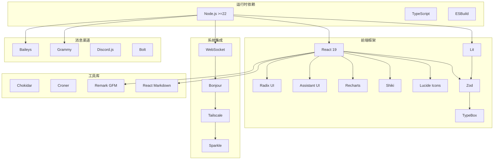

**图表来源**
- [package.json:344-404](file://package.json#L344-L404)
- [ui-react/package.json:11-59](file://ui-react/package.json#L11-L59)

### 开发工具链

项目采用现代化的开发工具链确保代码质量和开发效率：

| 工具类别 | 工具名称 | 版本 | 用途 |
|----------|----------|------|------|
| 构建工具 | Vite | 7.3.1 | 前端构建和开发服务器 |
| 编译器 | TypeScript | ^5.9.3 | 类型安全的JavaScript编译 |
| 代码格式化 | Oxlint | 最新 | 代码质量检查 |
| 测试框架 | Vitest | ^4.0.18 | 单元测试和集成测试 |
| 包管理 | PNPM | 10.33.0 | 依赖管理和包安装 |
| 文档生成 | Markdownlint | | 文档质量检查 |

**章节来源**
- [package.json:217-343](file://package.json#L217-L343)

## 性能考虑

### 前端性能优化

OpenClaw在UI基础设施中实施了多项性能优化策略：

1. **按需加载**：React组件采用动态导入，减少初始包大小
2. **虚拟滚动**：大量消息列表使用虚拟化技术提升渲染性能
3. **状态管理**：使用Zustand进行轻量级状态管理，避免不必要的重渲染
4. **缓存策略**：实现多层缓存机制，包括内存缓存和持久化缓存
5. **富工具组件优化**：代码块组件使用HTML缓存和主题切换优化

### 网络性能优化

1. **WebSocket复用**：所有UI组件共享单一WebSocket连接
2. **消息去重**：实现智能消息去重算法，避免重复渲染
3. **增量更新**：支持部分UI组件的增量更新，减少全量重绘
4. **连接池管理**：对频繁使用的网络连接进行池化管理

### 富工具展示性能优化

富工具展示系统特别关注以下性能方面：

1. **组件懒加载**：工具UI组件按需加载，减少初始渲染时间
2. **数据验证缓存**：Zod模式验证结果缓存，避免重复验证
3. **图表渲染优化**：Recharts组件使用memo化和事件委托优化
4. **代码高亮优化**：Shiki语法高亮器单例模式和HTML缓存
5. **天气效果优化**：动画效果根据系统偏好设置自动调整

## 故障排除指南

### 常见问题诊断

#### 渠道认证问题

当遇到渠道认证失败时，可以按照以下步骤进行诊断：

1. **检查网络连接**：确认设备能够访问互联网
2. **验证凭据存储**：检查认证文件是否正确写入
3. **查看日志输出**：启用详细日志模式获取更多信息
4. **重置认证状态**：清理缓存的认证信息重新开始

#### UI渲染问题

如果遇到UI渲染异常：

1. **检查浏览器兼容性**：确保使用支持的浏览器版本
2. **验证WebSocket连接**：确认与网关的连接正常
3. **清理浏览器缓存**：清除可能损坏的缓存文件
4. **检查资源加载**：确认所有静态资源正确加载

#### 富工具展示问题

如果遇到富工具展示异常：

1. **验证工具负载格式**：确保工具返回的JSON符合预期格式
2. **检查模式验证**：确认Zod模式验证通过
3. **调试组件渲染**：使用React DevTools检查组件树
4. **查看控制台错误**：检查是否有JavaScript错误或警告

**章节来源**
- [src/web/login-qr.ts:216-295](file://src/web/login-qr.ts#L216-L295)
- [ui-react/src/components/chat/tool-rich-presentation.tsx:100-104](file://ui-react/src/components/chat/tool-rich-presentation.tsx#L100-L104)

## 结论

OpenClaw的富工具UI基础设施展现了现代全栈应用的设计理念，通过模块化架构、响应式设计和高性能实现，为用户提供了流畅的AI助手体验。项目在技术选型上注重实用性与可扩展性，既满足了当前的功能需求，也为未来的功能扩展奠定了坚实基础。

**更新** 新增的富工具展示系统进一步增强了OpenClaw的用户体验，通过专业的工具输出可视化展示了天气、图表、代码、链接预览等多种信息类型，为用户提供了更加直观和交互式的界面。

该基础设施的关键优势包括：

1. **跨平台兼容性**：统一的UI设计支持多种设备和操作系统
2. **实时通信能力**：基于WebSocket的即时消息传递
3. **模块化架构**：清晰的组件分离便于维护和扩展
4. **富工具展示系统**：专业的工具输出可视化能力
5. **性能优化**：从架构层面考虑的性能优化策略
6. **开发友好性**：完善的开发工具链和文档体系

随着AI助手功能的不断发展，这套UI基础设施将继续演进，为用户提供更加智能化和个性化的交互体验。富工具展示系统的引入标志着OpenClaw在工具输出可视化方面的重大进步，为未来的功能扩展和技术演进提供了坚实的基础。