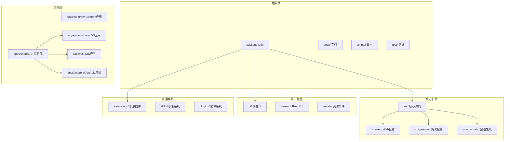
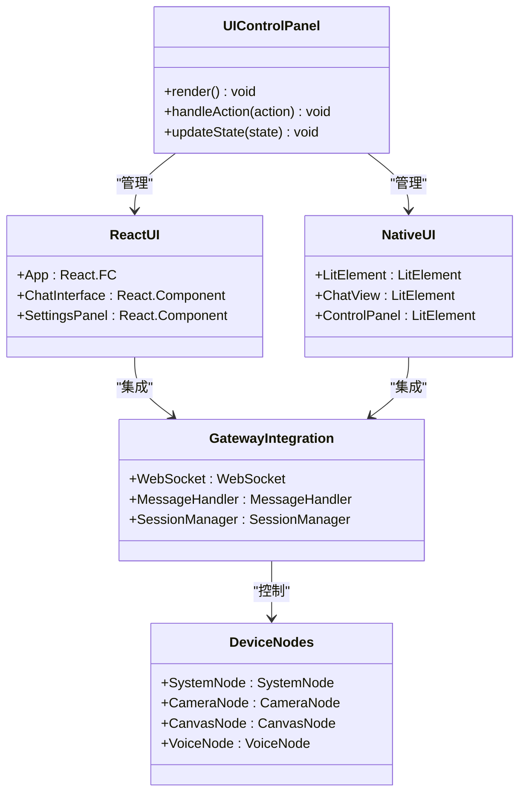
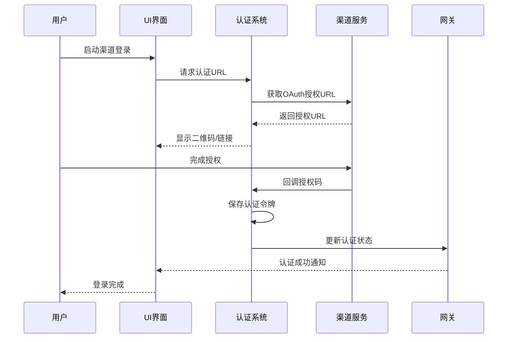
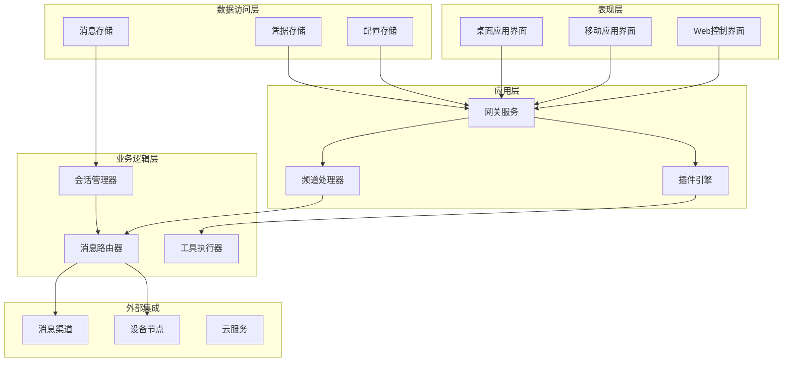
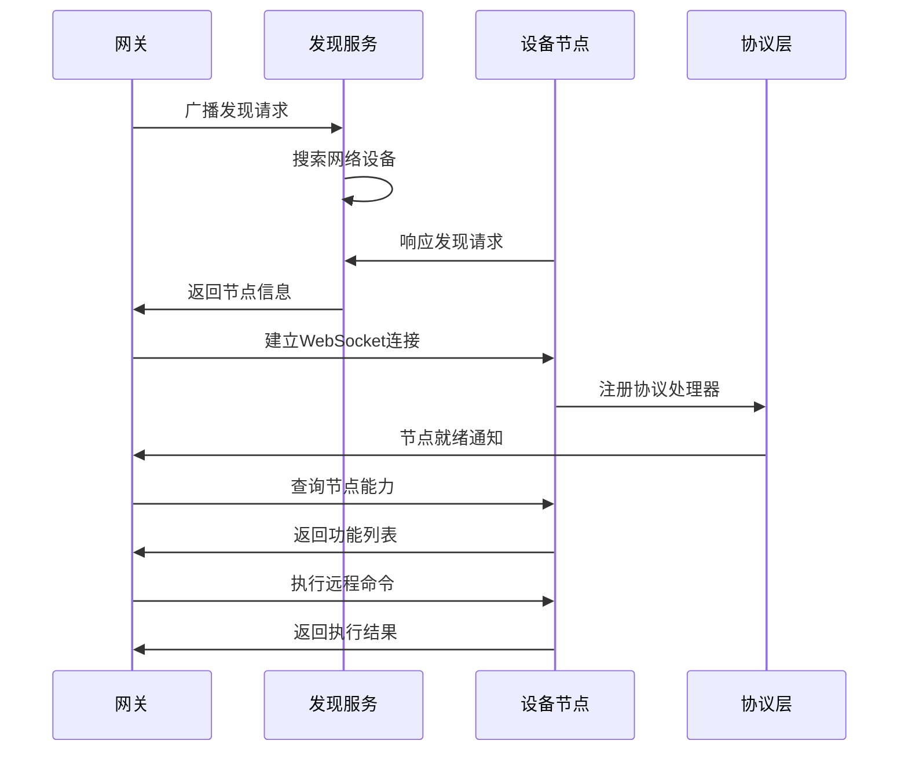
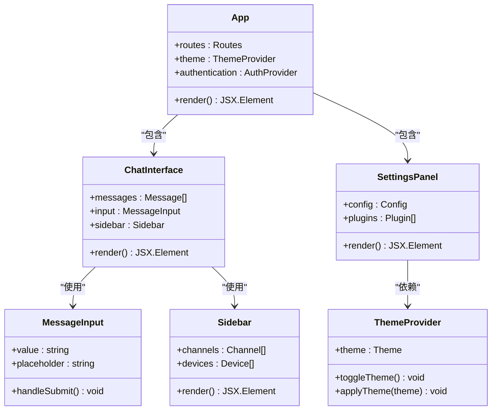
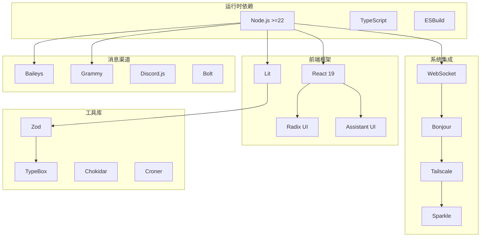

# 富工具UI基础设施

<cite>
**本文档引用的文件**
- [README.md](file://README.md)
- [package.json](file://package.json)
- [ui/package.json](file://ui/package.json)
- [ui-react/package.json](file://ui-react/package.json)
- [apps/macos/Package.swift](file://apps/macos/Package.swift)
- [apps/shared/OpenClawKit/Package.swift](file://apps/shared/OpenClawKit/Package.swift)
- [src/web/accounts.ts](file://src/web/accounts.ts)
- [src/web/login-qr.ts](file://src/web/login-qr.ts)
- [src/web/inbound.ts](file://src/web/inbound.ts)
- [ui/src/main.ts](file://ui/src/main.ts)
- [ui-react/src/main.tsx](file://ui-react/src/main.tsx)
</cite>

## 目录
1. [简介](#简介)
2. [项目结构](#项目结构)
3. [核心组件](#核心组件)
4. [架构概览](#架构概览)
5. [详细组件分析](#详细组件分析)
6. [依赖关系分析](#依赖关系分析)
7. [性能考虑](#性能考虑)
8. [故障排除指南](#故障排除指南)
9. [结论](#结论)

## 简介

OpenClaw是一个个人AI助手平台，提供富工具UI基础设施，支持多渠道消息集成、实时聊天界面、设备节点控制等功能。该项目采用现代化的技术栈，包括TypeScript、React、Lit等前端框架，以及Swift、Node.js等后端技术。

项目的核心目标是为用户提供本地化、快速且始终在线的个人AI助手体验，支持多种消息渠道（WhatsApp、Telegram、Slack、Discord等）和设备平台（macOS、iOS、Android）。

## 项目结构

OpenClaw项目采用模块化的多层次架构设计：

**图表来源**
- [package.json:1-477](file://package.json#L1-L477)
- [README.md:1-560](file://README.md#L1-L560)

**章节来源**
- [package.json:1-477](file://package.json#L1-L477)
- [README.md:1-560](file://README.md#L1-L560)

## 核心组件

### UI基础设施架构

OpenClaw提供了两套并行的UI基础设施：

1. **原生UI系统**：基于Lit框架构建，专注于轻量级和高性能
2. **React UI系统**：基于React 19和Assistant UI组件库，提供更丰富的交互体验

**图表来源**
- [ui/package.json:1-28](file://ui/package.json#L1-L28)
- [ui-react/package.json:1-73](file://ui-react/package.json#L1-L73)

### 渠道认证系统

OpenClaw实现了统一的渠道认证管理，支持多种消息渠道的OAuth认证流程：

**图表来源**
- [src/web/login-qr.ts:108-214](file://src/web/login-qr.ts#L108-L214)
- [src/web/accounts.ts:116-150](file://src/web/accounts.ts#L116-L150)

**章节来源**
- [src/web/accounts.ts:1-167](file://src/web/accounts.ts#L1-167)
- [src/web/login-qr.ts:1-296](file://src/web/login-qr.ts#L1-L296)

## 架构概览

OpenClaw采用分层架构设计，确保系统的可扩展性和维护性：

**图表来源**
- [apps/macos/Package.swift:6-92](file://apps/macos/Package.swift#L6-L92)
- [apps/shared/OpenClawKit/Package.swift:5-61](file://apps/shared/OpenClawKit/Package.swift#L5-L61)

## 详细组件分析

### 渠道认证与会话管理

#### WhatsApp认证流程

OpenClaw为WhatsApp提供了完整的认证和会话管理机制：

**图表来源**
- [src/web/login-qr.ts:108-295](file://src/web/login-qr.ts#L108-L295)

#### 多账户支持架构

系统支持多个WhatsApp账户的并行管理：

| 属性 | 默认账户 | 自定义账户 |
|------|----------|------------|
| 认证目录 | `~/.openclaw/oauth/whatsapp/main` | `~/.openclaw/oauth/whatsapp/{accountId}` |
| 凭据文件 | `creds.json` | `{accountId}/creds.json` |
| 配置优先级 | 全局配置 | 账户特定配置 |
| 权限范围 | 基础权限 | 可定制权限 |

**章节来源**
- [src/web/accounts.ts:12-32](file://src/web/accounts.ts#L12-L32)
- [src/web/accounts.ts:94-114](file://src/web/accounts.ts#L94-L114)

### 设备节点控制系统

#### 节点发现与通信

OpenClaw实现了跨平台的设备节点发现和通信机制：

**图表来源**
- [apps/macos/Package.swift:26-78](file://apps/macos/Package.swift#L26-L78)
- [apps/shared/OpenClawKit/Package.swift:20-52](file://apps/shared/OpenClawKit/Package.swift#L20-L52)

### UI组件系统

#### React组件架构

React UI系统基于现代前端技术栈构建：

**图表来源**
- [ui-react/src/main.tsx:1-11](file://ui-react/src/main.tsx#L1-L11)
- [ui-react/package.json:11-59](file://ui-react/package.json#L11-L59)

**章节来源**
- [ui-react/src/main.tsx:1-11](file://ui-react/src/main.tsx#L1-L11)
- [ui/src/main.ts:1-3](file://ui/src/main.ts#L1-L3)

## 依赖关系分析

### 核心依赖矩阵

OpenClaw的依赖关系呈现复杂的层次结构：

**图表来源**
- [package.json:344-404](file://package.json#L344-L404)
- [ui-react/package.json:11-59](file://ui-react/package.json#L11-L59)

### 开发工具链

项目采用现代化的开发工具链确保代码质量和开发效率：

| 工具类别 | 工具名称 | 版本 | 用途 |
|----------|----------|------|------|
| 构建工具 | Vite | 7.3.1 | 前端构建和开发服务器 |
| 编译器 | TypeScript | ^5.9.3 | 类型安全的JavaScript编译 |
| 代码格式化 | Oxlint | 最新 | 代码质量检查 |
| 测试框架 | Vitest | ^4.0.18 | 单元测试和集成测试 |
| 包管理 | PNPM | 10.33.0 | 依赖管理和包安装 |
| 文档生成 | Markdownlint | | 文档质量检查 |

**章节来源**
- [package.json:217-343](file://package.json#L217-L343)

## 性能考虑

### 前端性能优化

OpenClaw在UI基础设施中实施了多项性能优化策略：

1. **按需加载**：React组件采用动态导入，减少初始包大小
2. **虚拟滚动**：大量消息列表使用虚拟化技术提升渲染性能
3. **状态管理**：使用Zustand进行轻量级状态管理，避免不必要的重渲染
4. **缓存策略**：实现多层缓存机制，包括内存缓存和持久化缓存

### 网络性能优化

1. **WebSocket复用**：所有UI组件共享单一WebSocket连接
2. **消息去重**：实现智能消息去重算法，避免重复渲染
3. **增量更新**：支持部分UI组件的增量更新，减少全量重绘
4. **连接池管理**：对频繁使用的网络连接进行池化管理

## 故障排除指南

### 常见问题诊断

#### 渠道认证问题

当遇到渠道认证失败时，可以按照以下步骤进行诊断：

1. **检查网络连接**：确认设备能够访问互联网
2. **验证凭据存储**：检查认证文件是否正确写入
3. **查看日志输出**：启用详细日志模式获取更多信息
4. **重置认证状态**：清理缓存的认证信息重新开始

#### UI渲染问题

如果遇到UI渲染异常：

1. **检查浏览器兼容性**：确保使用支持的浏览器版本
2. **验证WebSocket连接**：确认与网关的连接正常
3. **清理浏览器缓存**：清除可能损坏的缓存文件
4. **检查资源加载**：确认所有静态资源正确加载

**章节来源**
- [src/web/login-qr.ts:216-295](file://src/web/login-qr.ts#L216-L295)

## 结论

OpenClaw的富工具UI基础设施展现了现代全栈应用的设计理念，通过模块化架构、响应式设计和高性能实现，为用户提供了流畅的AI助手体验。项目在技术选型上注重实用性与可扩展性，既满足了当前的功能需求，也为未来的功能扩展奠定了坚实基础。

该基础设施的关键优势包括：

1. **跨平台兼容性**：统一的UI设计支持多种设备和操作系统
2. **实时通信能力**：基于WebSocket的即时消息传递
3. **模块化架构**：清晰的组件分离便于维护和扩展
4. **性能优化**：从架构层面考虑的性能优化策略
5. **开发友好性**：完善的开发工具链和文档体系

随着AI助手功能的不断发展，这套UI基础设施将继续演进，为用户提供更加智能化和个性化的交互体验。