# 工具UI文档

<cite>
**本文档引用的文件**
- [bootstrap.js](file://apps/shared/OpenClawKit/Tools/CanvasA2UI/bootstrap.js)
- [CanvasA2UICommands.swift](file://apps/shared/OpenClawKit/Sources/OpenClawKit/CanvasA2UICommands.swift)
- [CanvasA2UIAction.swift](file://apps/shared/OpenClawKit/Sources/OpenClawKit/CanvasA2UIAction.swift)
- [a2ui.ts](file://src/canvas-host/a2ui.ts)
- [server.ts](file://src/canvas-host/server.ts)
- [register.canvas.ts](file://src/cli/nodes-cli/register.canvas.ts)
- [a2ui-jsonl.ts](file://src/cli/nodes-cli/a2ui-jsonl.ts)
- [NodeAppModel.swift](file://apps/ios/Sources/Model/NodeAppModel.swift)
- [CanvasA2UIActionMessageHandler.swift](file://apps/macos/Sources/OpenClaw/CanvasA2UIActionMessageHandler.swift)
- [canvas-a2ui-copy.ts](file://scripts/canvas-a2ui-copy.ts)
- [rolldown.config.mjs](file://apps/shared/OpenClawKit/Tools/CanvasA2UI/rolldown.config.mjs)
- [tool-mutation.ts](file://src/agents/tool-mutation.ts)
</cite>

## 更新摘要
**所做更改**
- 新增工具化交互系统架构章节，反映新的工具调用机制
- 更新状态管理章节，包含工具调用状态跟踪和指纹识别
- 增强参数验证章节，涵盖工具调用参数验证规则
- 扩展跨平台桥接章节，展示新的原生桥接机制
- 更新故障排除指南，添加工具化交互相关的诊断步骤

## 目录
1. [简介](#简介)
2. [项目结构](#项目结构)
3. [核心组件](#核心组件)
4. [架构概览](#架构概览)
5. [工具化交互系统](#工具化交互系统)
6. [状态管理与工具调用](#状态管理与工具调用)
7. [参数验证与安全](#参数验证与安全)
8. [跨平台桥接机制](#跨平台桥接机制)
9. [详细组件分析](#详细组件分析)
10. [依赖关系分析](#依赖关系分析)
11. [性能考虑](#性能考虑)
12. [故障排除指南](#故障排除指南)
13. [结论](#结论)

## 简介

OpenClaw工具UI系统是一个基于A2UI（Action-to-UI）框架构建的跨平台用户界面渲染引擎。该系统允许在设备画布上动态渲染和交互式UI组件，支持多种平台包括iOS、Android、macOS和Electron应用。

系统的核心特性包括：
- 实时UI状态管理
- 跨平台原生桥接
- 动态消息处理
- 实时重载功能
- 多种渲染器支持
- 工具化交互系统
- 参数验证与安全机制
- 状态管理与工具调用追踪

## 项目结构

工具UI系统主要分布在以下关键目录中：

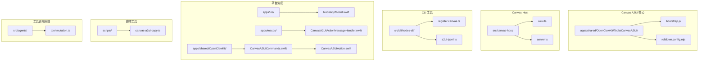

**图表来源**
- [bootstrap.js:1-550](file://apps/shared/OpenClawKit/Tools/CanvasA2UI/bootstrap.js#L1-L550)
- [a2ui.ts:1-210](file://src/canvas-host/a2ui.ts#L1-L210)
- [server.ts:1-479](file://src/canvas-host/server.ts#L1-L479)
- [tool-mutation.ts:1-207](file://src/agents/tool-mutation.ts#L1-L207)

**章节来源**
- [bootstrap.js:1-550](file://apps/shared/OpenClawKit/Tools/CanvasA2UI/bootstrap.js#L1-L550)
- [a2ui.ts:1-210](file://src/canvas-host/a2ui.ts#L1-L210)
- [server.ts:1-479](file://src/canvas-host/server.ts#L1-L479)
- [tool-mutation.ts:1-207](file://src/agents/tool-mutation.ts#L1-L207)

## 核心组件

### A2UI 主机组件

OpenClawA2UIHost 是整个工具UI系统的核心组件，基于LitElement构建，负责管理UI状态和处理用户交互。

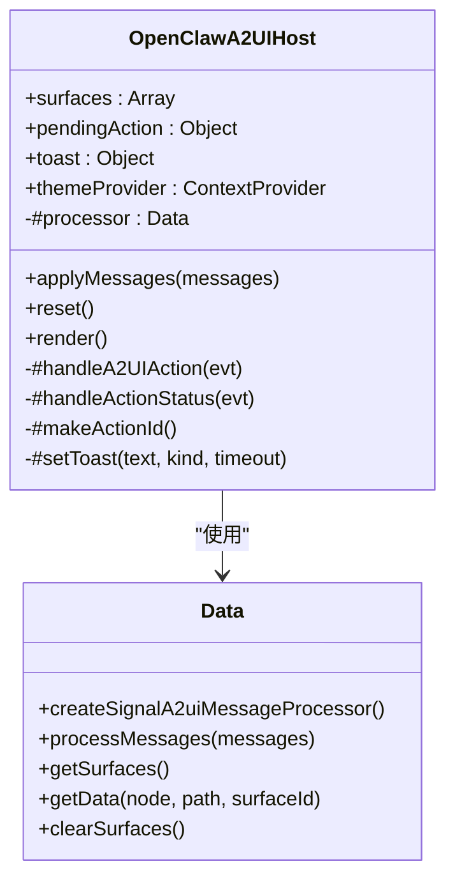

**图表来源**
- [bootstrap.js:214-549](file://apps/shared/OpenClawKit/Tools/CanvasA2UI/bootstrap.js#L214-L549)

### 命令定义系统

系统提供了标准化的命令枚举来确保跨平台一致性：

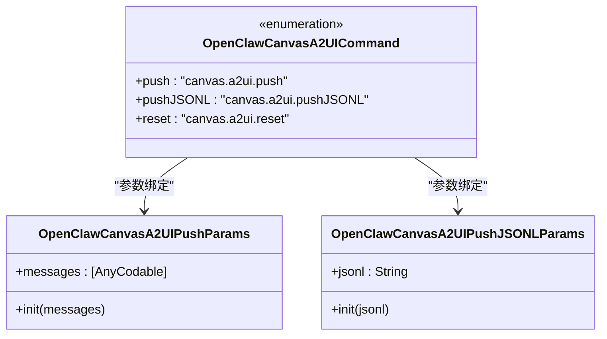

**图表来源**
- [CanvasA2UICommands.swift:3-26](file://apps/shared/OpenClawKit/Sources/OpenClawKit/CanvasA2UICommands.swift#L3-L26)

**章节来源**
- [bootstrap.js:214-549](file://apps/shared/OpenClawKit/Tools/CanvasA2UI/bootstrap.js#L214-L549)
- [CanvasA2UICommands.swift:3-26](file://apps/shared/OpenClawKit/Sources/OpenClawKit/CanvasA2UICommands.swift#L3-L26)

## 架构概览

工具UI系统采用分层架构设计，实现了平台无关的UI渲染能力：

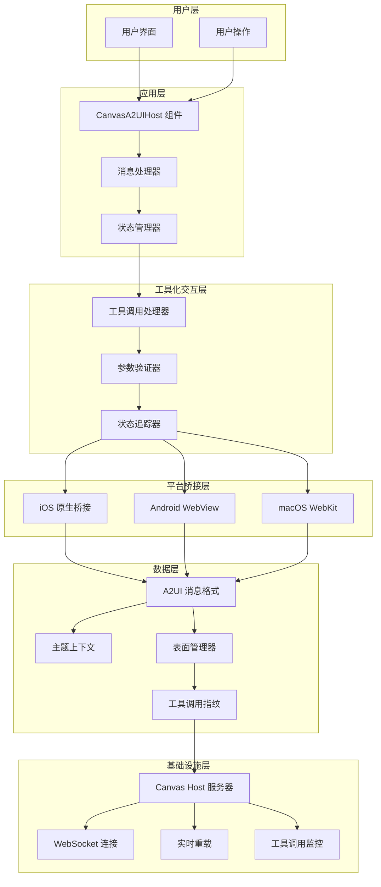

**图表来源**
- [bootstrap.js:336-360](file://apps/shared/OpenClawKit/Tools/CanvasA2UI/bootstrap.js#L336-L360)
- [server.ts:416-442](file://src/canvas-host/server.ts#L416-L442)
- [tool-mutation.ts:139-194](file://src/agents/tool-mutation.ts#L139-L194)

## 工具化交互系统

### 工具调用生命周期

工具化交互系统提供了完整的工具调用生命周期管理，从用户触发到结果反馈的全过程追踪。

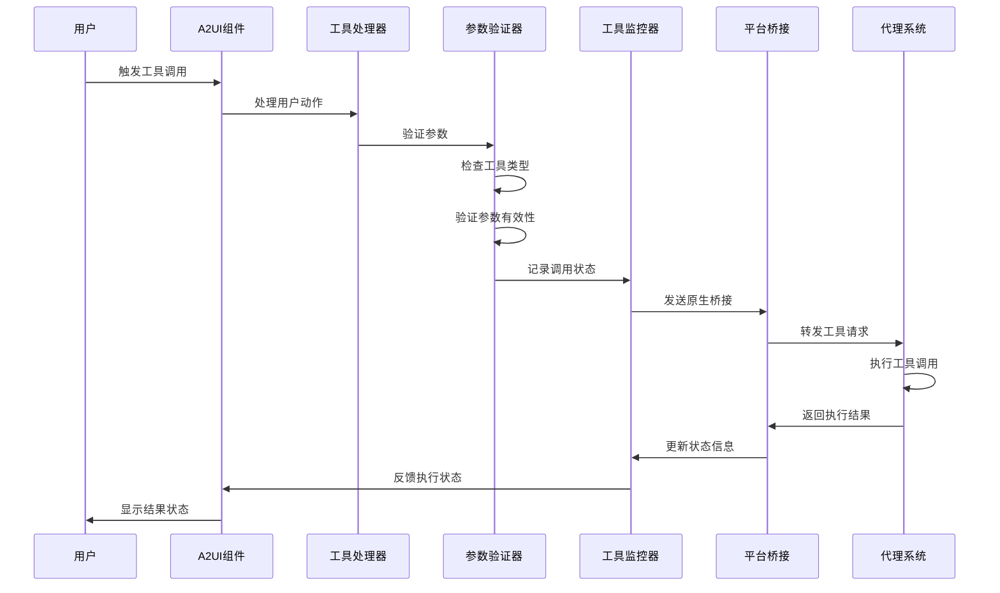

**图表来源**
- [bootstrap.js:393-482](file://apps/shared/OpenClawKit/Tools/CanvasA2UI/bootstrap.js#L393-L482)
- [tool-mutation.ts:98-137](file://src/agents/tool-mutation.ts#L98-L137)
- [CanvasA2UIAction.swift:69-103](file://apps/shared/OpenClawKit/Sources/OpenClawKit/CanvasA2UIAction.swift#L69-L103)

### 工具调用状态管理

系统实现了详细的工具调用状态管理，包括调用指纹生成、状态追踪和错误处理。

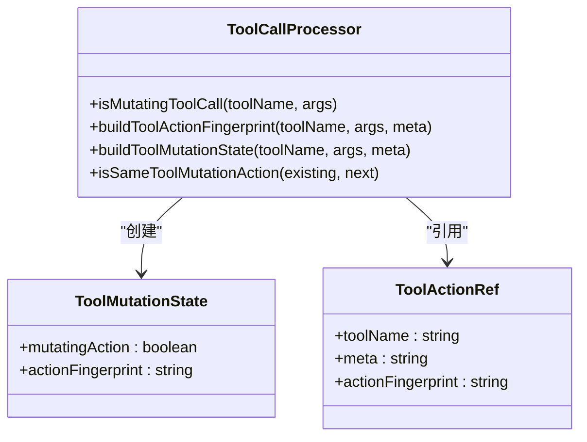

**图表来源**
- [tool-mutation.ts:48-57](file://src/agents/tool-mutation.ts#L48-L57)
- [tool-mutation.ts:184-194](file://src/agents/tool-mutation.ts#L184-L194)

**章节来源**
- [tool-mutation.ts:1-207](file://src/agents/tool-mutation.ts#L1-L207)
- [CanvasA2UIAction.swift:69-103](file://apps/shared/OpenClawKit/Sources/OpenClawKit/CanvasA2UIAction.swift#L69-L103)

## 状态管理与工具调用

### 工具调用指纹生成

系统为每个工具调用生成稳定的指纹标识，用于追踪和去重相同的操作。

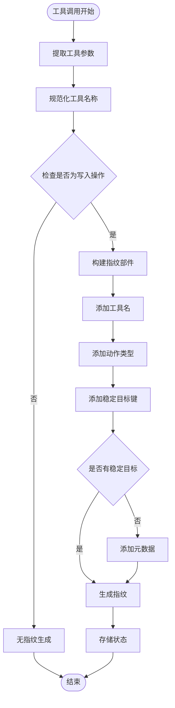

**图表来源**
- [tool-mutation.ts:139-182](file://src/agents/tool-mutation.ts#L139-L182)

### 工具调用状态追踪

系统实现了完整的工具调用状态追踪机制，包括错误状态管理和重复调用检测。

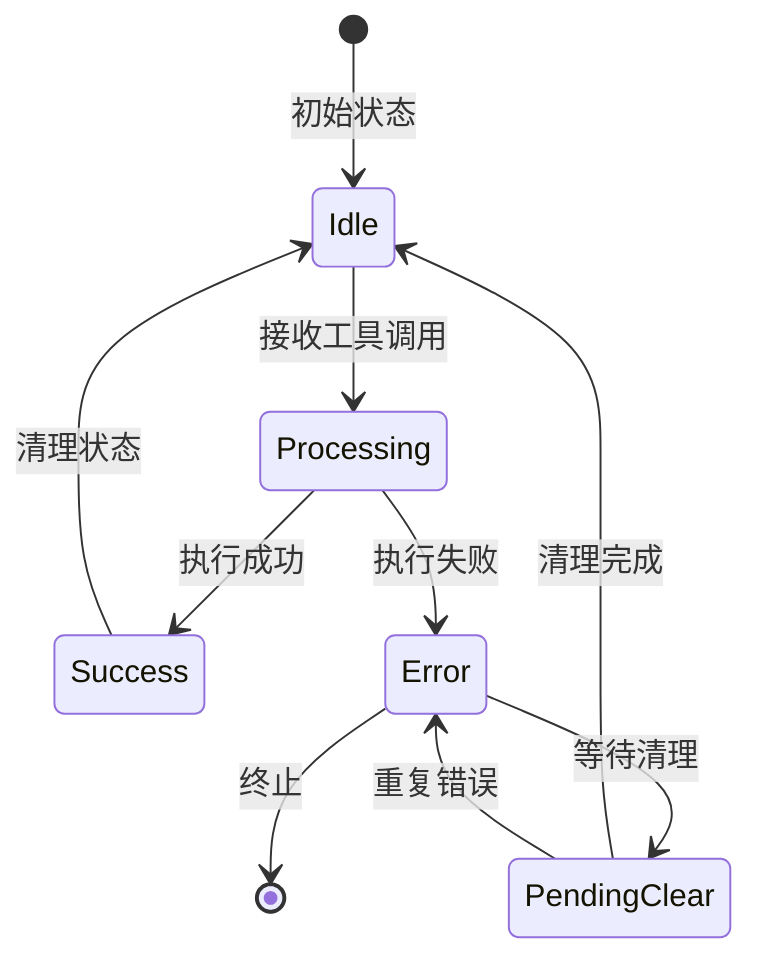

**图表来源**
- [tool-mutation.ts:196-206](file://src/agents/tool-mutation.ts#L196-L206)

**章节来源**
- [tool-mutation.ts:139-206](file://src/agents/tool-mutation.ts#L139-L206)

## 参数验证与安全

### 工具调用参数验证

系统实现了多层次的参数验证机制，确保工具调用的安全性和有效性。

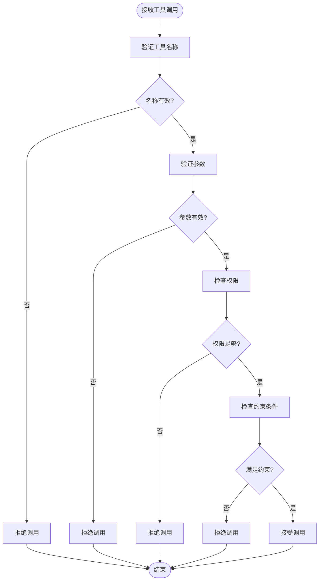

**图表来源**
- [tool-mutation.ts:98-137](file://src/agents/tool-mutation.ts#L98-L137)

### 工具类型识别

系统能够自动识别工具调用的类型，并根据类型应用相应的验证规则。

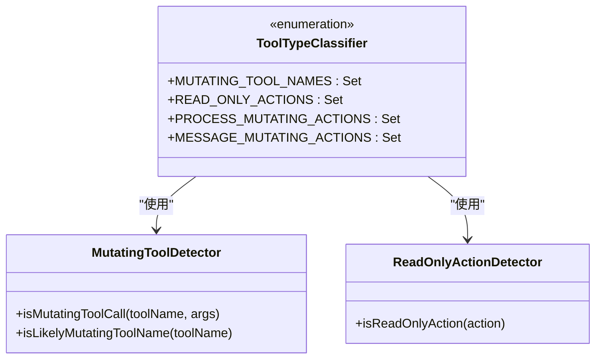

**图表来源**
- [tool-mutation.ts:1-32](file://src/agents/tool-mutation.ts#L1-L32)

**章节来源**
- [tool-mutation.ts:1-137](file://src/agents/tool-mutation.ts#L1-L137)

## 跨平台桥接机制

### 原生桥接架构

系统提供了统一的原生桥接接口，支持iOS、Android和macOS平台的工具调用。

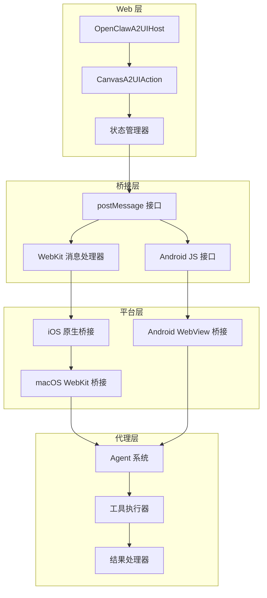

**图表来源**
- [bootstrap.js:462-482](file://apps/shared/OpenClawKit/Tools/CanvasA2UI/bootstrap.js#L462-L482)
- [NodeAppModel.swift:223-298](file://apps/ios/Sources/Model/NodeAppModel.swift#L223-L298)
- [CanvasA2UIActionMessageHandler.swift:18-109](file://apps/macos/Sources/OpenClaw/CanvasA2UIActionMessageHandler.swift#L18-L109)

### 平台特定实现

不同平台实现了特定的桥接机制，但保持统一的API接口。

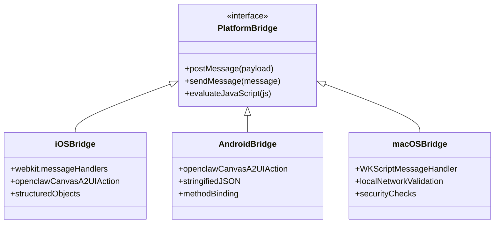

**图表来源**
- [bootstrap.js:86-104](file://apps/shared/OpenClawKit/Tools/CanvasA2UI/bootstrap.js#L86-L104)
- [CanvasA2UIActionMessageHandler.swift:18-29](file://apps/macos/Sources/OpenClaw/CanvasA2UIActionMessageHandler.swift#L18-L29)

**章节来源**
- [bootstrap.js:86-104](file://apps/shared/OpenClawKit/Tools/CanvasA2UI/bootstrap.js#L86-L104)
- [NodeAppModel.swift:223-298](file://apps/ios/Sources/Model/NodeAppModel.swift#L223-L298)
- [CanvasA2UIActionMessageHandler.swift:18-109](file://apps/macos/Sources/OpenClaw/CanvasA2UIActionMessageHandler.swift#L18-L109)

## 详细组件分析

### Canvas Host 服务器

Canvas Host 服务器是工具UI系统的基础服务，负责托管A2UI资源并提供WebSocket连接支持。

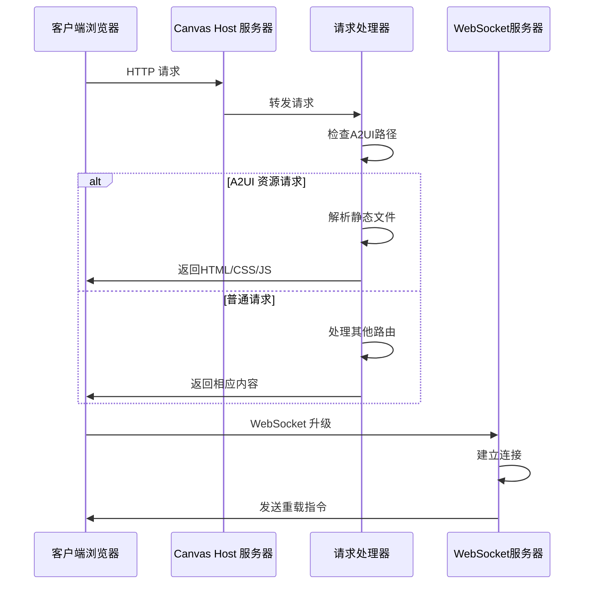

**图表来源**
- [server.ts:416-442](file://src/canvas-host/server.ts#L416-L442)
- [a2ui.ts:142-210](file://src/canvas-host/a2ui.ts#L142-L210)

### 用户操作处理流程

系统通过统一的事件处理机制来响应用户操作：

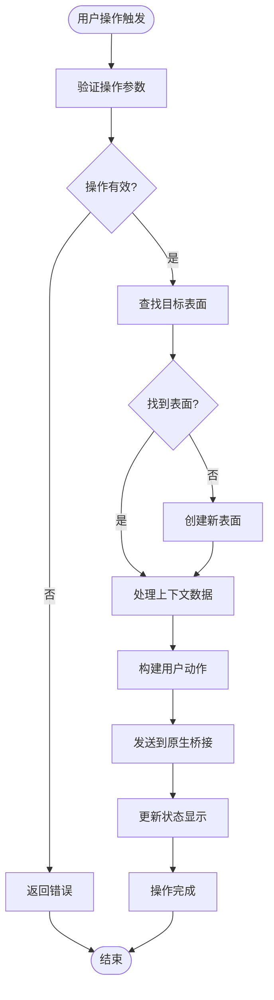

**图表来源**
- [bootstrap.js:393-482](file://apps/shared/OpenClawKit/Tools/CanvasA2UI/bootstrap.js#L393-L482)

### CLI 工具集成

系统提供了丰富的命令行工具来管理和测试A2UI功能：

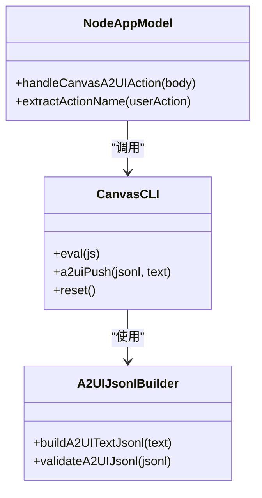

**图表来源**
- [register.canvas.ts:154-205](file://src/cli/nodes-cli/register.canvas.ts#L154-L205)
- [a2ui-jsonl.ts:11-43](file://src/cli/nodes-cli/a2ui-jsonl.ts#L11-L43)
- [NodeAppModel.swift:223-252](file://apps/ios/Sources/Model/NodeAppModel.swift#L223-L252)

**章节来源**
- [register.canvas.ts:154-205](file://src/cli/nodes-cli/register.canvas.ts#L154-L205)
- [a2ui-jsonl.ts:11-43](file://src/cli/nodes-cli/a2ui-jsonl.ts#L11-L43)
- [NodeAppModel.swift:223-252](file://apps/ios/Sources/Model/NodeAppModel.swift#L223-L252)

## 依赖关系分析

工具UI系统的依赖关系展现了清晰的模块化设计：

```mermaid
graph TB
subgraph "外部依赖"
A[Lit HTML]
B[@a2ui/lit]
C[@lit/context]
D[WebSocket]
E[Chokidar]
F[Rollup]
end
subgraph "内部模块"
G[bootstrap.js]
H[a2ui.ts]
I[server.ts]
J[CanvasA2UICommands.swift]
K[CanvasA2UIAction.swift]
end
subgraph "构建工具"
L[rolldown.config.mjs]
M[canvas-a2ui-copy.ts]
end
subgraph "工具调用系统"
N[tool-mutation.ts]
O[CanvasA2UIActionMessageHandler.swift]
P[NodeAppModel.swift]
end
A --> G
B --> G
C --> G
D --> H
E --> I
F --> L
G --> H
H --> I
J --> G
K --> G
L --> M
N --> O
N --> P
```

**图表来源**
- [bootstrap.js:1-8](file://apps/shared/OpenClawKit/Tools/CanvasA2UI/bootstrap.js#L1-L8)
- [rolldown.config.mjs:1-39](file://apps/shared/OpenClawKit/Tools/CanvasA2UI/rolldown.config.mjs#L1-L39)
- [tool-mutation.ts:1-207](file://src/agents/tool-mutation.ts#L1-L207)

**章节来源**
- [bootstrap.js:1-8](file://apps/shared/OpenClawKit/Tools/CanvasA2UI/bootstrap.js#L1-L8)
- [rolldown.config.mjs:1-39](file://apps/shared/OpenClawKit/Tools/CanvasA2UI/rolldown.config.mjs#L1-L39)
- [tool-mutation.ts:1-207](file://src/agents/tool-mutation.ts#L1-L207)

## 性能考虑

工具UI系统在设计时充分考虑了性能优化：

### 内存管理
- 使用WeakMap和Set来避免内存泄漏
- 表面状态的增量更新机制
- 按需加载和懒初始化策略

### 渲染优化
- 基于Lit的高效DOM更新
- 条件渲染减少不必要的重绘
- 主题上下文的缓存机制

### 网络性能
- 静态资源的CDN友好路径
- WebSocket的长连接复用
- 文件变更的智能检测

### 工具调用优化
- 工具调用指纹的快速匹配
- 状态缓存减少重复计算
- 异步处理提升响应速度

## 故障排除指南

### 常见问题诊断

**A2UI资源加载失败**
- 检查A2UI资产目录是否存在
- 验证bundle.js和index.html完整性
- 确认构建脚本执行成功

**原生桥接通信问题**
- 验证平台特定的消息处理器注册
- 检查postMessage方法的可用性
- 确认跨平台兼容性

**WebSocket连接异常**
- 检查服务器端口和防火墙设置
- 验证升级请求的处理逻辑
- 确认客户端重连机制

**工具调用失败**
- 检查工具名称的有效性
- 验证参数格式和类型
- 确认权限和约束条件
- 查看工具调用状态追踪

**状态管理异常**
- 检查工具调用指纹生成
- 验证状态清理机制
- 确认重复调用检测

**章节来源**
- [canvas-a2ui-copy.ts:13-28](file://scripts/canvas-a2ui-copy.ts#L13-L28)
- [a2ui.ts:165-171](file://src/canvas-host/a2ui.ts#L165-L171)
- [tool-mutation.ts:196-206](file://src/agents/tool-mutation.ts#L196-L206)

## 结论

OpenClaw工具UI系统通过其模块化架构和跨平台设计，为开发者提供了一个强大而灵活的UI渲染解决方案。系统的关键优势包括：

1. **跨平台一致性**：统一的API和渲染逻辑确保在不同平台上的一致体验
2. **高性能渲染**：基于现代Web技术栈的优化渲染管道
3. **工具化交互**：完整的工具调用生命周期管理和状态追踪
4. **安全验证**：多层次的参数验证和权限控制机制
5. **易于扩展**：模块化的架构设计便于功能扩展和定制
6. **开发友好**：完善的CLI工具和调试支持

该系统为构建复杂的交互式应用程序提供了坚实的技术基础，特别适合需要动态UI内容、实时交互和工具化操作的应用场景。新的工具化交互系统进一步增强了系统的实用性和可靠性，为用户提供了更加流畅和安全的交互体验。