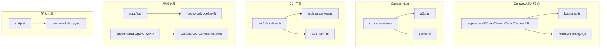
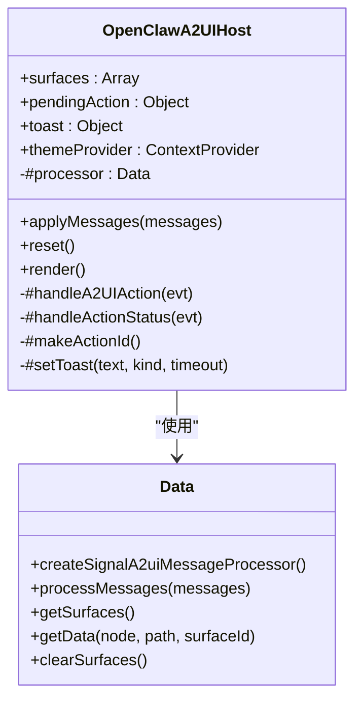
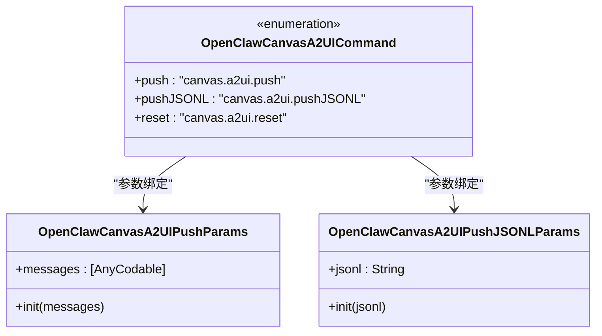
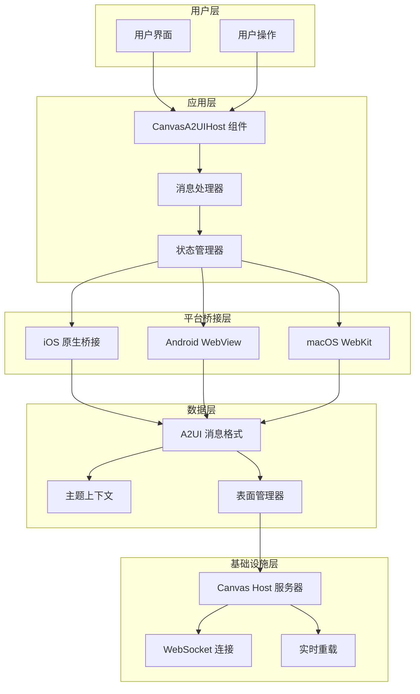
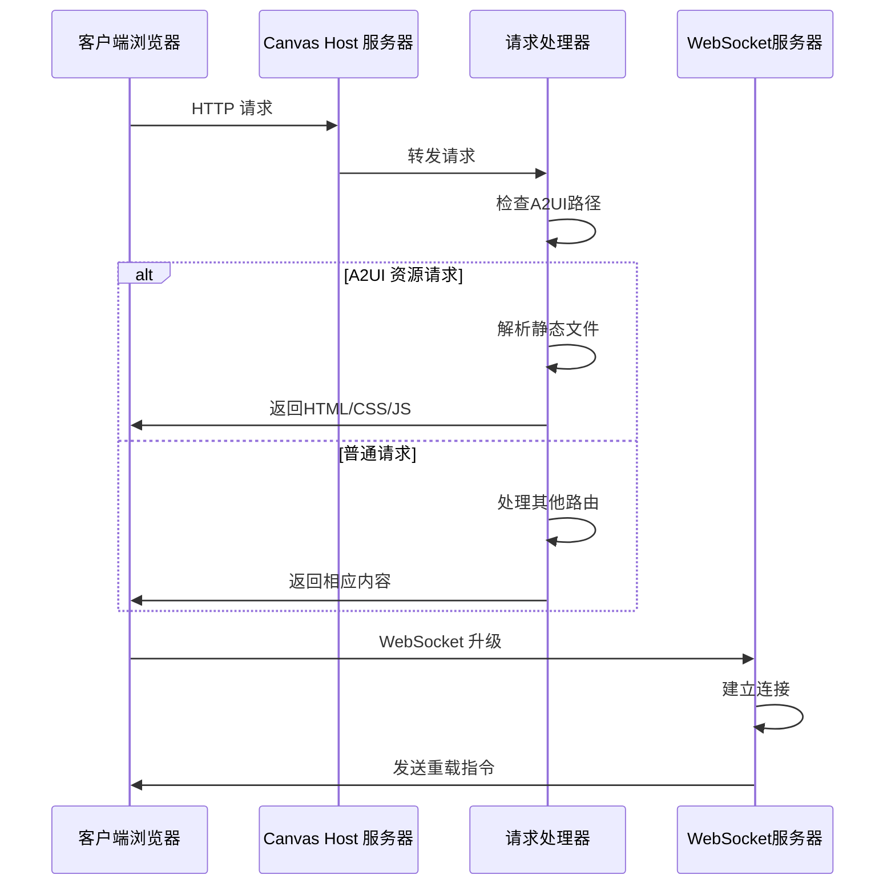
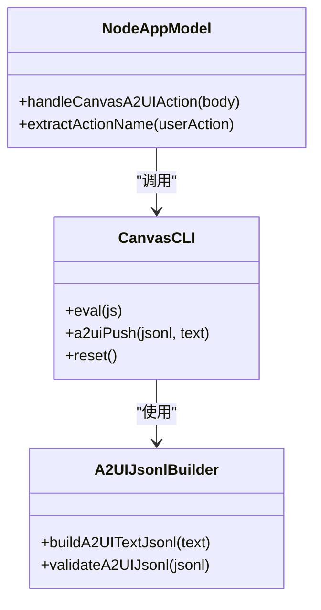

# 工具UI文档

<cite>
**本文档引用的文件**
- [bootstrap.js](file://apps/shared/OpenClawKit/Tools/CanvasA2UI/bootstrap.js)
- [CanvasA2UICommands.swift](file://apps/shared/OpenClawKit/Sources/OpenClawKit/CanvasA2UICommands.swift)
- [a2ui.ts](file://src/canvas-host/a2ui.ts)
- [server.ts](file://src/canvas-host/server.ts)
- [register.canvas.ts](file://src/cli/nodes-cli/register.canvas.ts)
- [a2ui-jsonl.ts](file://src/cli/nodes-cli/a2ui-jsonl.ts)
- [NodeAppModel.swift](file://apps/ios/Sources/Model/NodeAppModel.swift)
- [canvas-a2ui-copy.ts](file://scripts/canvas-a2ui-copy.ts)
- [rolldown.config.mjs](file://apps/shared/OpenClawKit/Tools/CanvasA2UI/rolldown.config.mjs)
</cite>

## 目录
1. [简介](#简介)
2. [项目结构](#项目结构)
3. [核心组件](#核心组件)
4. [架构概览](#架构概览)
5. [详细组件分析](#详细组件分析)
6. [依赖关系分析](#依赖关系分析)
7. [性能考虑](#性能考虑)
8. [故障排除指南](#故障排除指南)
9. [结论](#结论)

## 简介

OpenClaw工具UI系统是一个基于A2UI（Action-to-UI）框架构建的跨平台用户界面渲染引擎。该系统允许在设备画布上动态渲染和交互式UI组件，支持多种平台包括iOS、Android、macOS和Electron应用。

系统的核心特性包括：
- 实时UI状态管理
- 跨平台原生桥接
- 动态消息处理
- 实时重载功能
- 多种渲染器支持

## 项目结构

工具UI系统主要分布在以下关键目录中：



**图表来源**
- [bootstrap.js:1-550](file://apps/shared/OpenClawKit/Tools/CanvasA2UI/bootstrap.js#L1-L550)
- [a2ui.ts:1-210](file://src/canvas-host/a2ui.ts#L1-L210)
- [server.ts:1-442](file://src/canvas-host/server.ts#L1-L442)

**章节来源**
- [bootstrap.js:1-550](file://apps/shared/OpenClawKit/Tools/CanvasA2UI/bootstrap.js#L1-L550)
- [a2ui.ts:1-210](file://src/canvas-host/a2ui.ts#L1-L210)
- [server.ts:1-442](file://src/canvas-host/server.ts#L1-L442)

## 核心组件

### A2UI 主机组件

OpenClawA2UIHost 是整个工具UI系统的核心组件，基于LitElement构建，负责管理UI状态和处理用户交互。



**图表来源**
- [bootstrap.js:214-549](file://apps/shared/OpenClawKit/Tools/CanvasA2UI/bootstrap.js#L214-L549)

### 命令定义系统

系统提供了标准化的命令枚举来确保跨平台一致性：



**图表来源**
- [CanvasA2UICommands.swift:3-26](file://apps/shared/OpenClawKit/Sources/OpenClawKit/CanvasA2UICommands.swift#L3-L26)

**章节来源**
- [bootstrap.js:214-549](file://apps/shared/OpenClawKit/Tools/CanvasA2UI/bootstrap.js#L214-L549)
- [CanvasA2UICommands.swift:3-26](file://apps/shared/OpenClawKit/Sources/OpenClawKit/CanvasA2UICommands.swift#L3-L26)

## 架构概览

工具UI系统采用分层架构设计，实现了平台无关的UI渲染能力：



**图表来源**
- [bootstrap.js:336-360](file://apps/shared/OpenClawKit/Tools/CanvasA2UI/bootstrap.js#L336-L360)
- [server.ts:416-442](file://src/canvas-host/server.ts#L416-L442)

## 详细组件分析

### Canvas Host 服务器

Canvas Host 服务器是工具UI系统的基础服务，负责托管A2UI资源并提供WebSocket连接支持。



**图表来源**
- [server.ts:416-442](file://src/canvas-host/server.ts#L416-L442)
- [a2ui.ts:142-210](file://src/canvas-host/a2ui.ts#L142-L210)

### 用户操作处理流程

系统通过统一的事件处理机制来响应用户操作：


**图表来源**
- [bootstrap.js:393-482](file://apps/shared/OpenClawKit/Tools/CanvasA2UI/bootstrap.js#L393-L482)

**章节来源**
- [server.ts:416-442](file://src/canvas-host/server.ts#L416-L442)
- [bootstrap.js:393-482](file://apps/shared/OpenClawKit/Tools/CanvasA2UI/bootstrap.js#L393-L482)

### CLI 工具集成

系统提供了丰富的命令行工具来管理和测试A2UI功能：



**图表来源**
- [register.canvas.ts:154-205](file://src/cli/nodes-cli/register.canvas.ts#L154-L205)
- [a2ui-jsonl.ts:11-43](file://src/cli/nodes-cli/a2ui-jsonl.ts#L11-L43)
- [NodeAppModel.swift:223-252](file://apps/ios/Sources/Model/NodeAppModel.swift#L223-L252)

**章节来源**
- [register.canvas.ts:154-205](file://src/cli/nodes-cli/register.canvas.ts#L154-L205)
- [a2ui-jsonl.ts:11-43](file://src/cli/nodes-cli/a2ui-jsonl.ts#L11-L43)
- [NodeAppModel.swift:223-252](file://apps/ios/Sources/Model/NodeAppModel.swift#L223-L252)

## 依赖关系分析

工具UI系统的依赖关系展现了清晰的模块化设计：

```mermaid
graph TB
subgraph "外部依赖"
A[Lit HTML]
B[@a2ui/lit]
C[@lit/context]
D[WebSocket]
end
subgraph "内部模块"
E[bootstrap.js]
F[a2ui.ts]
G[server.ts]
H[CanvasA2UICommands.swift]
end
subgraph "构建工具"
I[rolldown.config.mjs]
J[canvas-a2ui-copy.ts]
end
A --> E
B --> E
C --> E
D --> F
E --> F
F --> G
H --> E
I --> J
J --> F
```

**图表来源**
- [bootstrap.js:1-8](file://apps/shared/OpenClawKit/Tools/CanvasA2UI/bootstrap.js#L1-L8)
- [rolldown.config.mjs:1-39](file://apps/shared/OpenClawKit/Tools/CanvasA2UI/rolldown.config.mjs#L1-L39)

**章节来源**
- [bootstrap.js:1-8](file://apps/shared/OpenClawKit/Tools/CanvasA2UI/bootstrap.js#L1-L8)
- [rolldown.config.mjs:1-39](file://apps/shared/OpenClawKit/Tools/CanvasA2UI/rolldown.config.mjs#L1-L39)

## 性能考虑

工具UI系统在设计时充分考虑了性能优化：

### 内存管理
- 使用WeakMap和Set来避免内存泄漏
- 表面状态的增量更新机制
- 按需加载和懒初始化策略

### 渲染优化
- 基于Lit的高效DOM更新
- 条件渲染减少不必要的重绘
- 主题上下文的缓存机制

### 网络性能
- 静态资源的CDN友好路径
- WebSocket的长连接复用
- 文件变更的智能检测

## 故障排除指南

### 常见问题诊断

**A2UI资源加载失败**
- 检查A2UI资产目录是否存在
- 验证bundle.js和index.html完整性
- 确认构建脚本执行成功

**原生桥接通信问题**
- 验证平台特定的消息处理器注册
- 检查postMessage方法的可用性
- 确认跨平台兼容性

**WebSocket连接异常**
- 检查服务器端口和防火墙设置
- 验证升级请求的处理逻辑
- 确认客户端重连机制

**章节来源**
- [canvas-a2ui-copy.ts:13-28](file://scripts/canvas-a2ui-copy.ts#L13-L28)
- [a2ui.ts:165-171](file://src/canvas-host/a2ui.ts#L165-L171)

## 结论

OpenClaw工具UI系统通过其模块化架构和跨平台设计，为开发者提供了一个强大而灵活的UI渲染解决方案。系统的关键优势包括：

1. **跨平台一致性**：统一的API和渲染逻辑确保在不同平台上的一致体验
2. **高性能渲染**：基于现代Web技术栈的优化渲染管道
3. **易于扩展**：模块化的架构设计便于功能扩展和定制
4. **开发友好**：完善的CLI工具和调试支持

该系统为构建复杂的交互式应用程序提供了坚实的技术基础，特别适合需要动态UI内容和实时交互的应用场景。