# 工具UI组件

<cite>
**本文档引用的文件**
- [ToolFallback/index.tsx](file://ui-react/src/components/chat/ToolFallback/index.tsx)
- [ToolFallback/sections.tsx](file://ui-react/src/components/chat/ToolFallback/sections.tsx)
- [ToolFallback/tool-detail-drawer.tsx](file://ui-react/src/components/chat/ToolFallback/tool-detail-drawer.tsx)
- [ToolFallback/status-badge.tsx](file://ui-react/src/components/chat/ToolFallback/status-badge.tsx)
- [ToolFallback/rich-presentation.tsx](file://ui-react/src/components/chat/ToolFallback/rich-presentation.tsx)
- [ToolFallback/types.ts](file://ui-react/src/components/chat/ToolFallback/types.ts)
- [ToolFallback/parse-tool-ui-payload.ts](file://ui-react/src/components/chat/ToolFallback/parse-tool-ui-payload.ts)
- [ToolFallback/parse-weather-widget-payload.ts](file://ui-react/src/components/chat/ToolFallback/parse-weather-widget-payload.ts)
- [ToolFallback.tsx](file://ui-react/src/components/chat/ToolFallback.tsx)
- [ToolCallGroup.tsx](file://ui-react/src/components/chat/ToolCallGroup.tsx)
- [OptionList.tsx](file://ui-react/src/components/tool-ui/option-list/option-list.tsx)
- [OptionListSchema.ts](file://ui-react/src/components/tool-ui/option-list/schema.ts)
- [QuestionFlow.tsx](file://ui-react/src/components/tool-ui/question-flow/question-flow.tsx)
- [QuestionFlowSchema.ts](file://ui-react/src/components/tool-ui/question-flow/schema.ts)
- [ActionButtons.tsx](file://ui-react/src/components/tool-ui/shared/action-buttons.tsx)
- [useActionButtons.tsx](file://ui-react/src/components/tool-ui/shared/use-action-buttons.tsx)
- [Chart.tsx](file://ui-react/src/components/tool-ui/chart/chart.tsx)
- [ChartSchema.ts](file://ui-react/src/components/tool-ui/chart/schema.ts)
- [CodeBlock.tsx](file://ui-react/src/components/tool-ui/code-block/code-block.tsx)
- [CodeBlockSchema.ts](file://ui-react/src/components/tool-ui/code-block/schema.ts)
- [LinkPreview.tsx](file://ui-react/src/components/tool-ui/link-preview/link-preview.tsx)
- [LinkPreviewSchema.ts](file://ui-react/src/components/tool-ui/link-preview/schema.ts)
- [StatsDisplay.tsx](file://ui-react/src/components/tool-ui/stats-display/stats-display.tsx)
- [StatsDisplaySchema.ts](file://ui-react/src/components/tool-ui/stats-display/schema.ts)
- [Terminal.tsx](file://ui-react/src/components/tool-ui/terminal/terminal.tsx)
- [TerminalSchema.ts](file://ui-react/src/components/tool-ui/terminal/schema.ts)
- [weather-widget-container.tsx](file://ui-react/src/components/tool-ui/weather-widget/weather-widget-container.tsx)
- [runtime.ts](file://ui-react/src/components/tool-ui/weather-widget/runtime.ts)
- [tool-cards.ts](file://ui/src/ui/chat/tool-cards.ts)
- [tool-helpers.ts](file://ui/src/ui/chat/tool-helpers.ts)
- [constants.ts](file://ui/src/ui/chat/constants.ts)
- [button.tsx](file://ui-react/src/components/ui/button.tsx)
- [drawer.tsx](file://ui-react/src/components/ui/drawer.tsx)
- [utils.ts](file://ui-react/src/lib/utils.ts)
- [window.ts](file://apps/electron/src/main/window.ts)
- [control-ui-assets.ts](file://src/infra/control-ui-assets.ts)
- [markdown-text.tsx](file://ui-react/src/components/assistant-ui/markdown-text.tsx)
- [AssistantMessage.tsx](file://ui-react/src/components/chat/AssistantMessage.tsx)
- [SkillsPage.tsx](file://ui-react/src/pages/SkillsPage.tsx)
</cite>

## 更新摘要
**所做更改**
- ToolFallback组件经历了重大重构：旧的ToolFallback.tsx被完全替换为新的综合实现(index.tsx)
- 新增了sections.tsx、tool-detail-drawer.tsx、status-badge.tsx等专用组件模块
- 增强了富工具UI组件的聊天事件桥接功能
- 新增了rich-presentation.tsx用于富工具UI内容的解析和展示
- 新增了parse-tool-ui-payload.ts和parse-weather-widget-payload.ts用于工具UI负载解析
- 保持了原有的OptionList、QuestionFlow、Chart、CodeBlock、LinkPreview、StatsDisplay、Terminal等组件

## 目录
1. [简介](#简介)
2. [项目结构](#项目结构)
3. [核心组件](#核心组件)
4. [架构概览](#架构概览)
5. [详细组件分析](#详细组件分析)
6. [依赖关系分析](#依赖关系分析)
7. [性能考虑](#性能考虑)
8. [故障排除指南](#故障排除指南)
9. [结论](#结论)

## 简介

工具UI组件是OpenClaw项目中用于展示和交互AI工具调用结果的核心界面组件。该组件系统提供了统一的工具调用可视化、状态管理和用户交互功能，支持多种工具类型（读取、写入、执行、搜索、网络请求等）的分类显示和详细查看。

**更新** ToolFallback组件经过重大重构，从单一的ToolFallback.tsx文件演进为模块化的组件架构。新的架构将工具回退功能分解为多个专门的组件：ToolFallback/index.tsx作为主入口，sections.tsx提供通用的工具UI段落组件，tool-detail-drawer.tsx负责详情抽屉功能，status-badge.tsx管理状态徽章，rich-presentation.tsx处理富工具UI内容的解析和展示。

该组件系统采用现代化的React设计，结合Tailwind CSS样式系统和专业的第三方库（如Recharts、Shiki、ansi-to-react），为用户提供直观且功能丰富的工具调用体验。组件支持响应式设计，在桌面端和移动端都能提供优秀的用户体验。

## 项目结构

OpenClaw项目的工具UI组件主要分布在两个前端框架中，现已扩展到包含重构后的ToolFallback模块化架构：

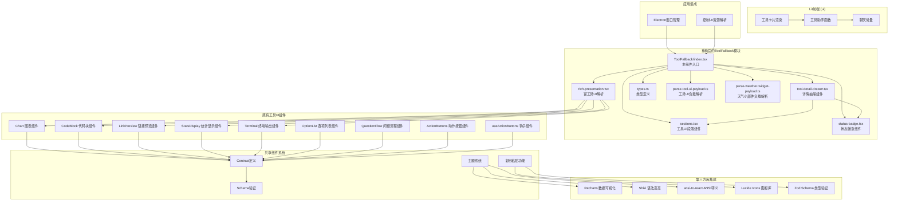

**图表来源**
- [ToolFallback/index.tsx:1-631](file://ui-react/src/components/chat/ToolFallback/index.tsx#L1-L631)
- [ToolFallback/sections.tsx:1-139](file://ui-react/src/components/chat/ToolFallback/sections.tsx#L1-L139)
- [ToolFallback/tool-detail-drawer.tsx:1-308](file://ui-react/src/components/chat/ToolFallback/tool-detail-drawer.tsx#L1-L308)
- [ToolFallback/status-badge.tsx:1-33](file://ui-react/src/components/chat/ToolFallback/status-badge.tsx#L1-L33)
- [ToolFallback/rich-presentation.tsx:1-235](file://ui-react/src/components/chat/ToolFallback/rich-presentation.tsx#L1-L235)

**章节来源**
- [ToolFallback/index.tsx:1-631](file://ui-react/src/components/chat/ToolFallback/index.tsx#L1-L631)
- [ToolFallback/sections.tsx:1-139](file://ui-react/src/components/chat/ToolFallback/sections.tsx#L1-L139)
- [ToolFallback/tool-detail-drawer.tsx:1-308](file://ui-react/src/components/chat/ToolFallback/tool-detail-drawer.tsx#L1-L308)
- [ToolFallback/status-badge.tsx:1-33](file://ui-react/src/components/chat/ToolFallback/status-badge.tsx#L1-L33)
- [ToolFallback/rich-presentation.tsx:1-235](file://ui-react/src/components/chat/ToolFallback/rich-presentation.tsx#L1-L235)

## 核心组件

工具UI组件系统包含以下核心组件：

### 工具分类系统
系统支持9种工具分类，每种分类都有对应的图标、颜色主题和操作标签：

| 分类 | 图标 | 颜色主题 | 操作标签 | 示例工具 |
|------|------|----------|----------|----------|
| read | FileTextIcon | 蓝色 | Read | 文件读取、数据获取 |
| write | PencilIcon | 橙色 | Write | 文件写入、数据更新 |
| exec | TerminalIcon | 紫色 | Exec | 命令执行、脚本运行 |
| search | SearchIcon | 青色 | Search | 搜索、查询 |
| web | GlobeIcon | 天蓝色 | Web | 网络请求、HTTP调用 |
| database | DatabaseIcon | 橙色 | Database | 数据库操作 |
| file | FolderIcon | 黄色 | File | 文件系统操作 |
| function | FunctionSquareIcon | 靛蓝色 | Call | 函数调用 |
| default | WrenchIcon | 灰色 | Tool | 其他工具 |

### 重构后的ToolFallback模块

**更新** ToolFallback组件经过重大重构，采用模块化架构设计：

#### 主组件入口 (ToolFallback/index.tsx)
- **工具分类识别**: 基于工具名称自动分类，支持正则表达式匹配
- **参数预览生成**: 智能提取关键参数进行预览，支持多种工具类型的参数解析
- **状态检测**: 检测工具执行状态和错误，支持运行中、完成、失败三种状态
- **富工具UI支持**: 新增对Chart、CodeBlock、LinkPreview、StatsDisplay、Terminal等组件的支持
- **详情抽屉**: 提供完整的工具调用详情展示

#### 专用组件模块

##### sections.tsx - 工具UI段落组件
- **ToolSection**: 通用工具段落组件，支持标题、操作按钮和内容区域
- **ToolFieldList**: 字段列表组件，用于展示工具参数和结果字段
- **RawToggleSection**: 原始内容切换组件，支持展开/折叠显示原始内容
- **RawResultContent**: 原始结果内容组件，支持Markdown解析和frontmatter处理

##### tool-detail-drawer.tsx - 详情抽屉组件
- **命令显示**: 展示工具命令和工作目录信息
- **结果预览**: 支持结果内容的预览和完整显示
- **错误处理**: 显示工具执行过程中的错误信息
- **富内容展示**: 支持富工具UI内容的结构化预览
- **复制功能**: 提供命令和结果的快速复制功能

##### status-badge.tsx - 状态徽章组件
- **运行状态**: 显示工具执行中的旋转指示器
- **完成状态**: 显示成功完成的对勾图标
- **失败状态**: 显示失败的错误图标，支持取消状态的特殊显示

##### rich-presentation.tsx - 富工具UI解析组件
- **负载解析**: 解析工具UI负载数据，支持多种富工具UI格式
- **内容映射**: 将工具名称映射到相应的富工具UI组件
- **摘要生成**: 为富工具UI内容生成简洁的摘要信息
- **天气小部件**: 特殊处理天气小部件的富内容展示

### 状态管理系统
工具调用状态分为三种：
- **running**: 工具正在执行中
- **complete**: 工具执行完成
- **incomplete**: 工具执行失败或被取消

**章节来源**
- [ToolFallback/index.tsx:32-47](file://ui-react/src/components/chat/ToolFallback/index.tsx#L32-L47)
- [ToolFallback/index.tsx:49-116](file://ui-react/src/components/chat/ToolFallback/index.tsx#L49-L116)
- [ToolFallback/sections.tsx:19-31](file://ui-react/src/components/chat/ToolFallback/sections.tsx#L19-L31)
- [ToolFallback/tool-detail-drawer.tsx:41-56](file://ui-react/src/components/chat/ToolFallback/tool-detail-drawer.tsx#L41-L56)
- [ToolFallback/status-badge.tsx:9-32](file://ui-react/src/components/chat/ToolFallback/status-badge.tsx#L9-L32)
- [ToolFallback/rich-presentation.tsx:127-135](file://ui-react/src/components/chat/ToolFallback/rich-presentation.tsx#L127-L135)

## 架构概览

工具UI组件系统采用分层架构设计，现已扩展包含重构后的模块化ToolFallback架构：

```mermaid
graph TD
subgraph "重构后的ToolFallback架构"
A[ToolFallback 主组件] --> B[sections 工具UI段落]
A --> C[tool-detail-drawer 详情抽屉]
A --> D[status-badge 状态徽章]
A --> E[rich-presentation 富内容解析]
A --> F[types 类型定义]
A --> G[parse-tool-ui-payload 负载解析]
A --> H[parse-weather-widget-payload 天气负载解析]
end
subgraph "新增富工具UI系统"
CH[Chart 图表组件] --> CHV[ChartView 图表视图]
CB[CodeBlock 代码块组件] --> CBS[CodeBlockState 代码块状态]
LP[LinkPreview 链接预览组件] --> LPS[LinkState 链接状态]
SD[StatsDisplay 统计显示组件] --> SDS[StatCard 统计卡片]
TE[Terminal 终端组件] --> TES[TerminalState 终端状态]
end
subgraph "新增OptionList系统"
OL[OptionList 选项列表组件] --> AB[ActionButtons 动作按钮]
OL --> SL[Selection Logic 选择逻辑]
OL --> RV[Receipt View 收据视图]
end
subgraph "新增QuestionFlow系统"
QF[QuestionFlow 问题流程组件] --> PF[Progressive Mode 渐进式模式]
QF --> UF[Upfront Mode 前置式模式]
QF --> RF[Receipt Mode 收据模式]
QF --> PB[Progress Bar 进度条]
QF --> KB[Keyboard Navigation 键盘导航]
end
subgraph "共享组件系统"
AB --> UAB[useActionButtons 钩子]
SC[Schema Contract 模式契约] --> PV[Parse Validation 解析验证]
SH[Shared Helpers 共享助手] --> TH[Theme Handling 主题处理]
SH --> CC[Copy Control 复制控制]
end
subgraph "第三方库集成"
TL1[Recharts 数据可视化库]
TL2[Shiki 语法高亮库]
TL3[ansi-to-react ANSI转义库]
TL4[Lucide Icons 图标库]
TL5[Zod Schema 类型验证库]
end
subgraph "辅助组件"
G[分类配置 TOOL_CATEGORY_CONFIG]
H[工具分类 classifyTool]
I[参数预览 buildArgsPreview]
J[格式化工具标签 formatToolLabel]
K[Markdown组件共享 plainMdComponents]
end
subgraph "外部集成"
L[Assistant UI React组件库]
M[Electron窗口静态服务器]
N[Lit前端传统UI]
O[ReactMarkdown Markdown渲染]
P[RemarkGfm GitHub风格标记]
Q[Zod Schema Zod模式验证]
R[Lucide Icons 图标库]
end
A --> L
C --> L
B --> K
K --> O
O --> P
CH --> TL1
CB --> TL2
TE --> TL3
AB --> R
QF --> R
OL --> R
CH --> SH
CB --> SH
LP --> SH
SD --> SH
TE --> SH
AB --> UAB
SC --> PV
A --> M
N --> A
```

**图表来源**
- [ToolFallback/index.tsx:132-144](file://ui-react/src/components/chat/ToolFallback/index.tsx#L132-L144)
- [ToolFallback/sections.tsx:1-139](file://ui-react/src/components/chat/ToolFallback/sections.tsx#L1-L139)
- [ToolFallback/tool-detail-drawer.tsx:1-308](file://ui-react/src/components/chat/ToolFallback/tool-detail-drawer.tsx#L1-L308)
- [ToolFallback/status-badge.tsx:1-33](file://ui-react/src/components/chat/ToolFallback/status-badge.tsx#L1-L33)
- [ToolFallback/rich-presentation.tsx:1-235](file://ui-react/src/components/chat/ToolFallback/rich-presentation.tsx#L1-L235)

## 详细组件分析

### ToolFallback 主组件

ToolFallback是重构后的工具调用回退显示组件，采用模块化架构设计：

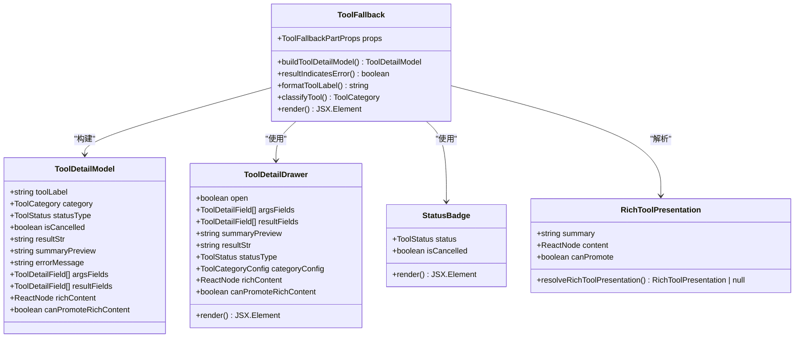

**图表来源**
- [ToolFallback/index.tsx:421-485](file://ui-react/src/components/chat/ToolFallback/index.tsx#L421-L485)
- [ToolFallback/index.tsx:531-630](file://ui-react/src/components/chat/ToolFallback/index.tsx#L531-L630)
- [ToolFallback/tool-detail-drawer.tsx:24-56](file://ui-react/src/components/chat/ToolFallback/tool-detail-drawer.tsx#L24-L56)
- [ToolFallback/status-badge.tsx:4-7](file://ui-react/src/components/chat/ToolFallback/status-badge.tsx#L4-L7)
- [ToolFallback/rich-presentation.tsx:20-24](file://ui-react/src/components/chat/ToolFallback/rich-presentation.tsx#L20-L24)

#### 核心功能特性

1. **模块化架构**: 将复杂功能分解为专门的组件模块
2. **智能分类**: 基于正则表达式的工具分类识别
3. **参数解析**: 支持多种工具类型的参数智能提取
4. **状态管理**: 完整的工具执行状态检测和处理
5. **富内容支持**: 新增对Chart、CodeBlock、LinkPreview、StatsDisplay、Terminal等组件的支持
6. **详情展示**: 提供完整的工具调用详情和原始内容展示

**章节来源**
- [ToolFallback/index.tsx:32-47](file://ui-react/src/components/chat/ToolFallback/index.tsx#L32-L47)
- [ToolFallback/index.tsx:146-230](file://ui-react/src/components/chat/ToolFallback/index.tsx#L146-L230)
- [ToolFallback/index.tsx:421-485](file://ui-react/src/components/chat/ToolFallback/index.tsx#L421-L485)

### sections.tsx 工具UI段落组件

sections.tsx提供了通用的工具UI段落组件，支持多种内容展示模式：

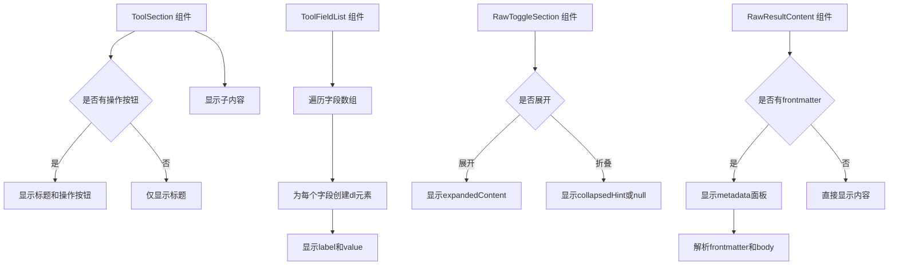

**图表来源**
- [ToolFallback/sections.tsx:19-31](file://ui-react/src/components/chat/ToolFallback/sections.tsx#L19-L31)
- [ToolFallback/sections.tsx:38-56](file://ui-react/src/components/chat/ToolFallback/sections.tsx#L38-L56)
- [ToolFallback/sections.tsx:67-95](file://ui-react/src/components/chat/ToolFallback/sections.tsx#L67-L95)
- [ToolFallback/sections.tsx:116-138](file://ui-react/src/components/chat/ToolFallback/sections.tsx#L116-L138)

#### 核心功能特性

1. **通用段落结构**: ToolSection提供统一的段落布局和样式
2. **字段列表展示**: ToolFieldList支持结构化字段的展示
3. **内容切换**: RawToggleSection支持展开/折叠显示原始内容
4. **Markdown解析**: RawResultContent支持Markdown内容的解析和展示
5. **Frontmatter处理**: 支持YAML frontmatter的分离和展示

**章节来源**
- [ToolFallback/sections.tsx:19-31](file://ui-react/src/components/chat/ToolFallback/sections.tsx#L19-L31)
- [ToolFallback/sections.tsx:38-56](file://ui-react/src/components/chat/ToolFallback/sections.tsx#L38-L56)
- [ToolFallback/sections.tsx:67-95](file://ui-react/src/components/chat/ToolFallback/sections.tsx#L67-L95)
- [ToolFallback/sections.tsx:116-138](file://ui-react/src/components/chat/ToolFallback/sections.tsx#L116-L138)

### tool-detail-drawer.tsx 详情抽屉组件

tool-detail-drawer.tsx提供了完整的工具调用详情展示功能：

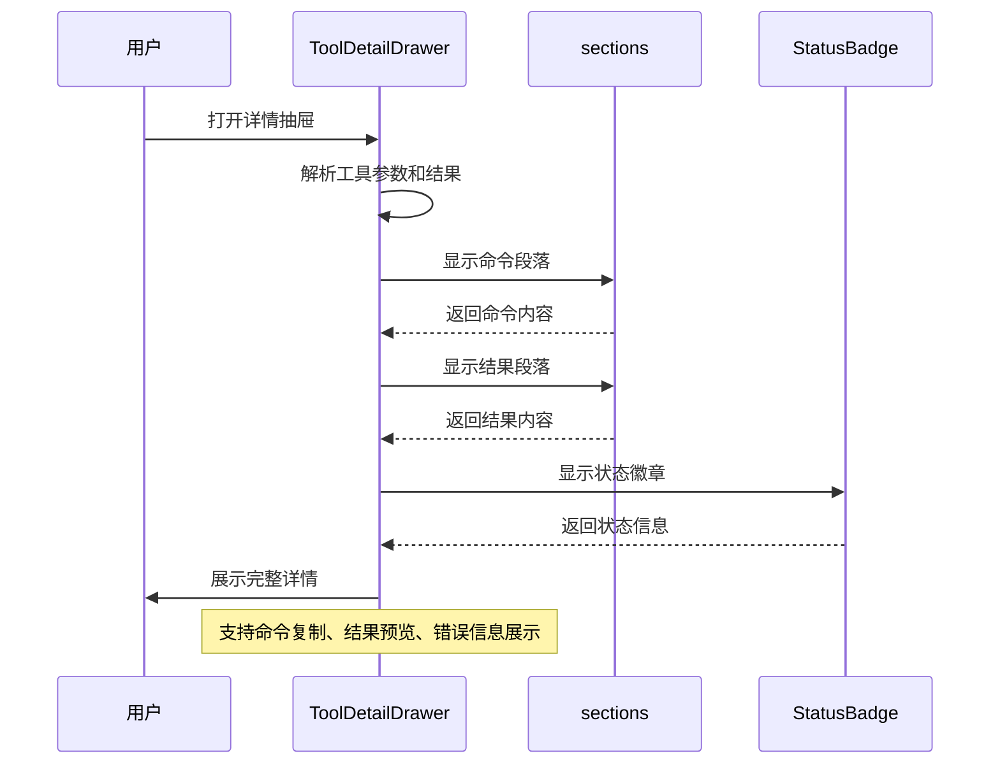

**图表来源**
- [ToolFallback/tool-detail-drawer.tsx:41-56](file://ui-react/src/components/chat/ToolFallback/tool-detail-drawer.tsx#L41-L56)
- [ToolFallback/tool-detail-drawer.tsx:132-177](file://ui-react/src/components/chat/ToolFallback/tool-detail-drawer.tsx#L132-L177)
- [ToolFallback/tool-detail-drawer.tsx:187-273](file://ui-react/src/components/chat/ToolFallback/tool-detail-drawer.tsx#L187-L273)

#### 核心功能特性

1. **命令显示**: 展示工具命令和工作目录信息
2. **结果预览**: 支持长结果的预览和完整显示切换
3. **错误处理**: 显示工具执行过程中的错误信息
4. **富内容展示**: 支持富工具UI内容的结构化预览
5. **复制功能**: 提供命令和结果的快速复制功能
6. **状态指示**: 显示工具执行状态和取消状态

**章节来源**
- [ToolFallback/tool-detail-drawer.tsx:41-56](file://ui-react/src/components/chat/ToolFallback/tool-detail-drawer.tsx#L41-L56)
- [ToolFallback/tool-detail-drawer.tsx:132-177](file://ui-react/src/components/chat/ToolFallback/tool-detail-drawer.tsx#L132-L177)
- [ToolFallback/tool-detail-drawer.tsx:187-273](file://ui-react/src/components/chat/ToolFallback/tool-detail-drawer.tsx#L187-L273)

### status-badge.tsx 状态徽章组件

status-badge.tsx提供了简洁的状态指示功能：

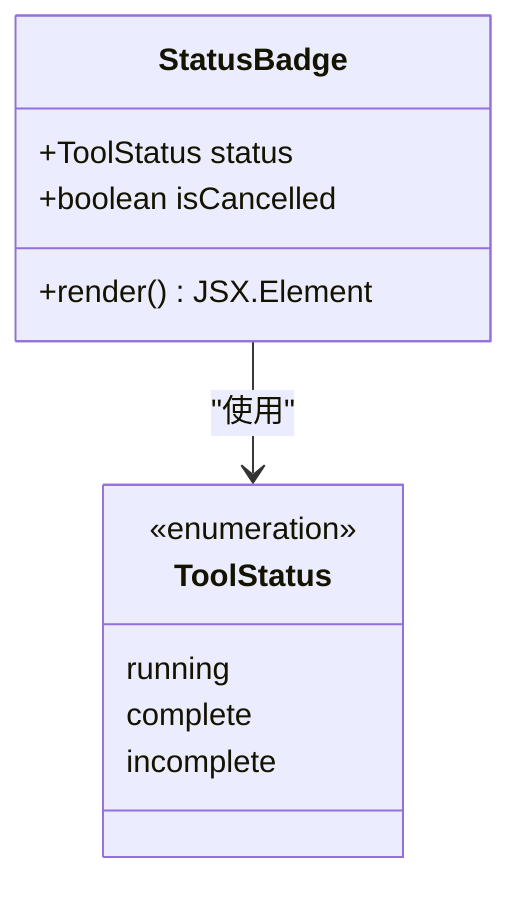

**图表来源**
- [ToolFallback/status-badge.tsx:4-7](file://ui-react/src/components/chat/ToolFallback/status-badge.tsx#L4-L7)
- [ToolFallback/types.ts:3](file://ui-react/src/components/chat/ToolFallback/types.ts#L3)

#### 核心功能特性

1. **运行状态**: 显示旋转的加载指示器
2. **完成状态**: 显示绿色的成功图标
3. **失败状态**: 显示红色的错误图标，支持取消状态的特殊显示
4. **简洁设计**: 使用圆角徽章提供清晰的状态指示

**章节来源**
- [ToolFallback/status-badge.tsx:9-32](file://ui-react/src/components/chat/ToolFallback/status-badge.tsx#L9-L32)
- [ToolFallback/types.ts:3](file://ui-react/src/components/chat/ToolFallback/types.ts#L3)

### rich-presentation.tsx 富工具UI解析组件

rich-presentation.tsx负责解析和展示富工具UI内容：

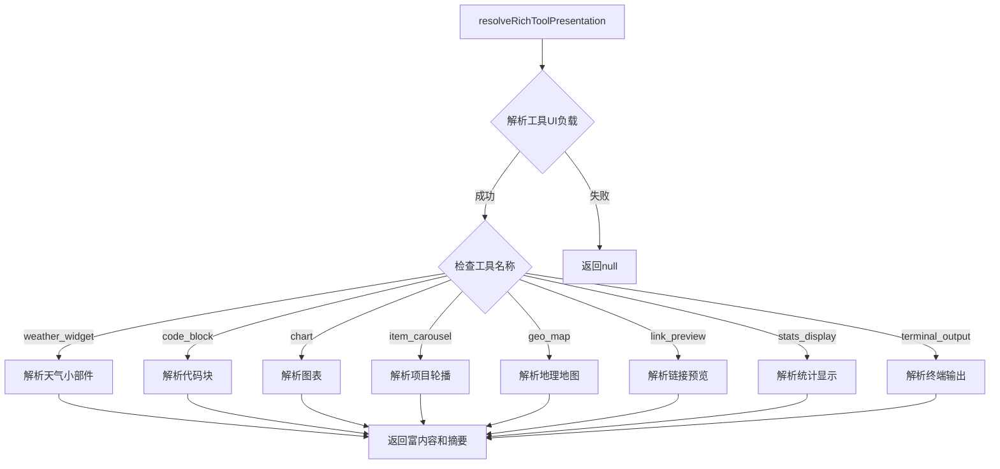

**图表来源**
- [ToolFallback/rich-presentation.tsx:127-135](file://ui-react/src/components/chat/ToolFallback/rich-presentation.tsx#L127-L135)
- [ToolFallback/rich-presentation.tsx:137-147](file://ui-react/src/components/chat/ToolFallback/rich-presentation.tsx#L137-L147)
- [ToolFallback/rich-presentation.tsx:149-159](file://ui-react/src/components/chat/ToolFallback/rich-presentation.tsx#L149-L159)

#### 核心功能特性

1. **负载解析**: 解析工具UI负载数据，支持多种富工具UI格式
2. **内容映射**: 将工具名称映射到相应的富工具UI组件
3. **摘要生成**: 为富工具UI内容生成简洁的摘要信息
4. **组件渲染**: 返回富工具UI组件的React节点
5. **质量控制**: 使用Zod模式验证确保数据安全性

**章节来源**
- [ToolFallback/rich-presentation.tsx:127-135](file://ui-react/src/components/chat/ToolFallback/rich-presentation.tsx#L127-L135)
- [ToolFallback/rich-presentation.tsx:137-147](file://ui-react/src/components/chat/ToolFallback/rich-presentation.tsx#L137-L147)
- [ToolFallback/rich-presentation.tsx:149-159](file://ui-react/src/components/chat/ToolFallback/rich-presentation.tsx#L149-L159)

### Chart 图表组件

Chart组件提供了专业的数据可视化功能：

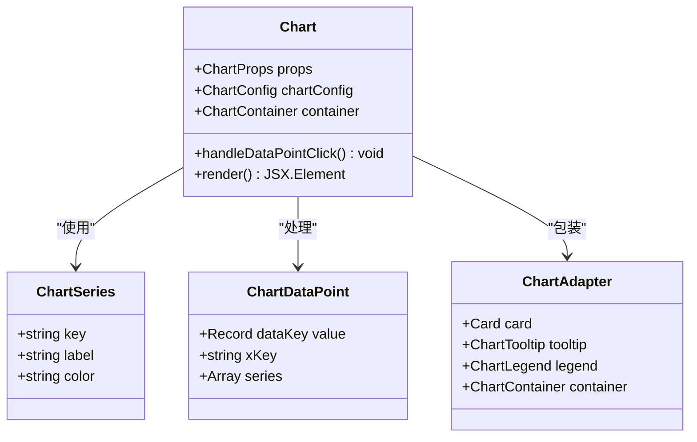

**图表来源**
- [Chart.tsx:39-183](file://ui-react/src/components/tool-ui/chart/chart.tsx#L39-L183)

#### 核心功能特性

1. **双模式支持**: 支持柱状图和折线图两种图表类型
2. **交互式设计**: 支持数据点点击和悬停提示
3. **主题定制**: 支持自定义颜色方案和样式
4. **响应式布局**: 适配不同屏幕尺寸的容器
5. **无障碍支持**: 完整的ARIA标签和键盘导航

**章节来源**
- [Chart.tsx:39-183](file://ui-react/src/components/tool-ui/chart/chart.tsx#L39-L183)
- [Chart.tsx:55-76](file://ui-react/src/components/tool-ui/chart/chart.tsx#L55-L76)
- [Chart.tsx:78-95](file://ui-react/src/components/tool-ui/chart/chart.tsx#L78-L95)

### CodeBlock 代码块组件

CodeBlock组件提供了强大的代码高亮和展示功能：

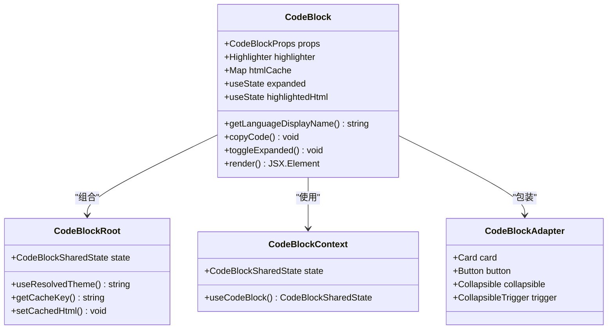

**图表来源**
- [CodeBlock.tsx:178-468](file://ui-react/src/components/tool-ui/code-block/code-block.tsx#L178-L468)

#### 核心功能特性

1. **多语言支持**: 支持多种编程语言的语法高亮
2. **主题适配**: 自动适配深色/浅色系统主题
3. **行号显示**: 可选的行号显示功能
4. **代码复制**: 一键复制整个代码块
5. **折叠控制**: 支持大代码块的折叠显示
6. **性能优化**: HTML缓存机制减少重复渲染

**章节来源**
- [CodeBlock.tsx:178-468](file://ui-react/src/components/tool-ui/code-block/code-block.tsx#L178-L468)
- [CodeBlock.tsx:29-38](file://ui-react/src/components/tool-ui/code-block/code-block.tsx#L29-L38)
- [CodeBlock.tsx:42-72](file://ui-react/src/components/tool-ui/code-block/code-block.tsx#L42-L72)

### LinkPreview 链接预览组件

LinkPreview组件提供了优雅的链接预览功能：

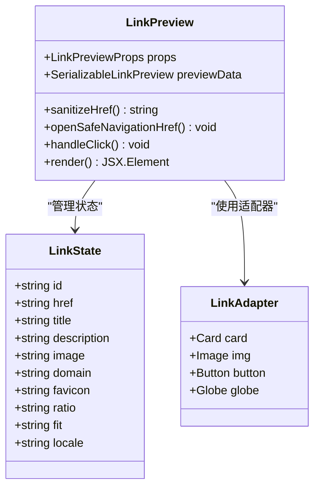

**图表来源**
- [LinkPreview.tsx:22-142](file://ui-react/src/components/tool-ui/link-preview/link-preview.tsx#L22-L142)

#### 核心功能特性

1. **链接解析**: 自动提取链接的标题、描述和图片
2. **安全导航**: 安全的链接打开机制，防止恶意链接
3. **域名标识**: 显示网站域名和favicon图标
4. **响应式布局**: 适配不同屏幕尺寸的卡片设计
5. **无障碍支持**: 键盘导航和屏幕阅读器友好的结构
6. **国际化支持**: 支持多语言环境下的本地化显示

**章节来源**
- [LinkPreview.tsx:22-142](file://ui-react/src/components/tool-ui/link-preview/link-preview.tsx#L22-L142)
- [LinkPreview.tsx:25-45](file://ui-react/src/components/tool-ui/link-preview/link-preview.tsx#L25-L45)
- [LinkPreview.tsx:47-54](file://ui-react/src/components/tool-ui/link-preview/link-preview.tsx#L47-L54)

### StatsDisplay 统计显示组件

StatsDisplay组件提供了专业的统计信息展示功能：

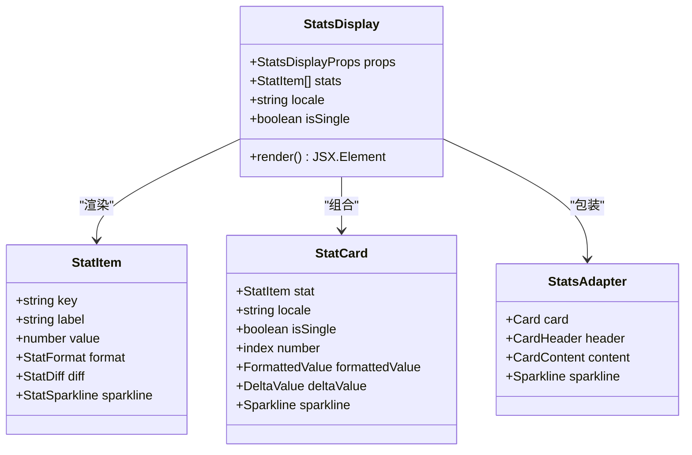

**图表来源**
- [StatsDisplay.tsx:218-282](file://ui-react/src/components/tool-ui/stats-display/stats-display.tsx#L218-L282)

#### 核心功能特性

1. **多格式支持**: 支持数字、货币、百分比等多种格式
2. **趋势展示**: 内置Sparkline图表展示数值趋势
3. **对比分析**: 支持正负变化的颜色标识和符号显示
4. **本地化**: 支持多语言环境下的数字格式化
5. **响应式布局**: 网格布局适配不同屏幕尺寸
6. **动画效果**: 统计卡片的渐入动画效果

**章节来源**
- [StatsDisplay.tsx:218-282](file://ui-react/src/components/tool-ui/stats-display/stats-display.tsx#L218-L282)
- [StatsDisplay.tsx:24-106](file://ui-react/src/components/tool-ui/stats-display/stats-display.tsx#L24-L106)
- [StatsDisplay.tsx:108-154](file://ui-react/src/components/tool-ui/stats-display/stats-display.tsx#L108-L154)

### Terminal 终端输出组件

Terminal组件提供了专业的终端输出展示功能：

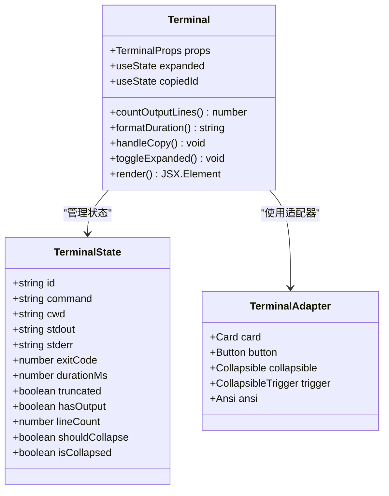

**图表来源**
- [Terminal.tsx:192-284](file://ui-react/src/components/tool-ui/terminal/terminal.tsx#L192-L284)

#### 核心功能特性

1. **ANSI转义**: 完整支持ANSI颜色和格式代码
2. **输出分栏**: 区分标准输出和错误输出的不同样式
3. **复制功能**: 一键复制完整的终端输出
4. **折叠控制**: 支持大输出的折叠显示和展开
5. **状态指示**: 显示退出码、工作目录和执行时间
6. **截断处理**: 对超长输出进行智能截断显示

**章节来源**
- [Terminal.tsx:192-284](file://ui-react/src/components/tool-ui/terminal/terminal.tsx#L192-L284)
- [Terminal.tsx:48-58](file://ui-react/src/components/tool-ui/terminal/terminal.tsx#L48-L58)
- [Terminal.tsx:206-234](file://ui-react/src/components/tool-ui/terminal/terminal.tsx#L206-L234)

### 天气小部件组件

天气小部件是一个专门的工具UI组件，用于展示天气信息：

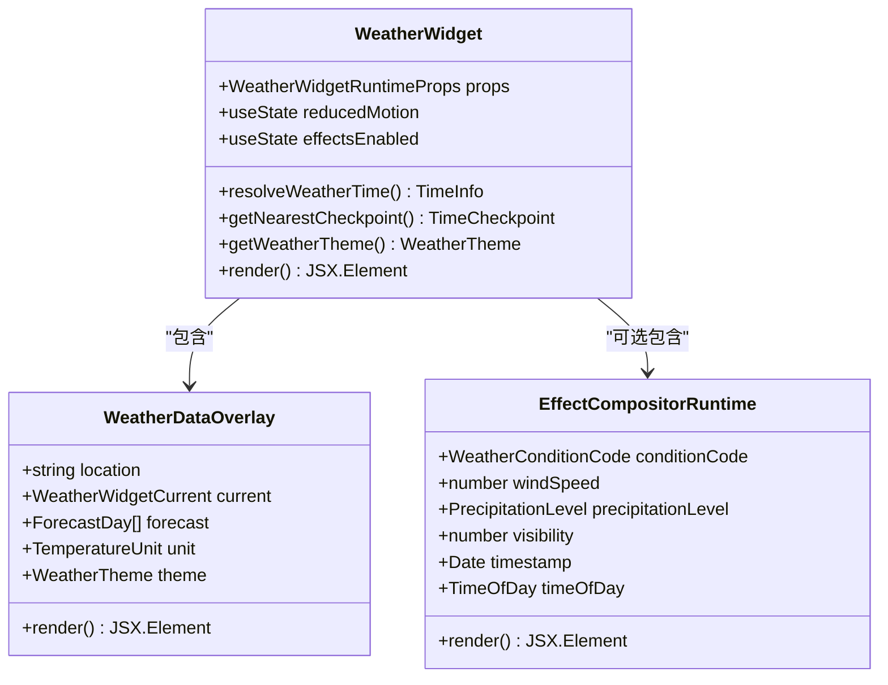

**图表来源**
- [weather-widget-container.tsx:20-145](file://ui-react/src/components/tool-ui/weather-widget/weather-widget-container.tsx#L20-L145)

**章节来源**
- [weather-widget-container.tsx:75-96](file://ui-react/src/components/tool-ui/weather-widget/weather-widget-container.tsx#L75-L96)

### OptionList 组件系统

**更新** OptionList组件提供了强大的选项列表选择功能：

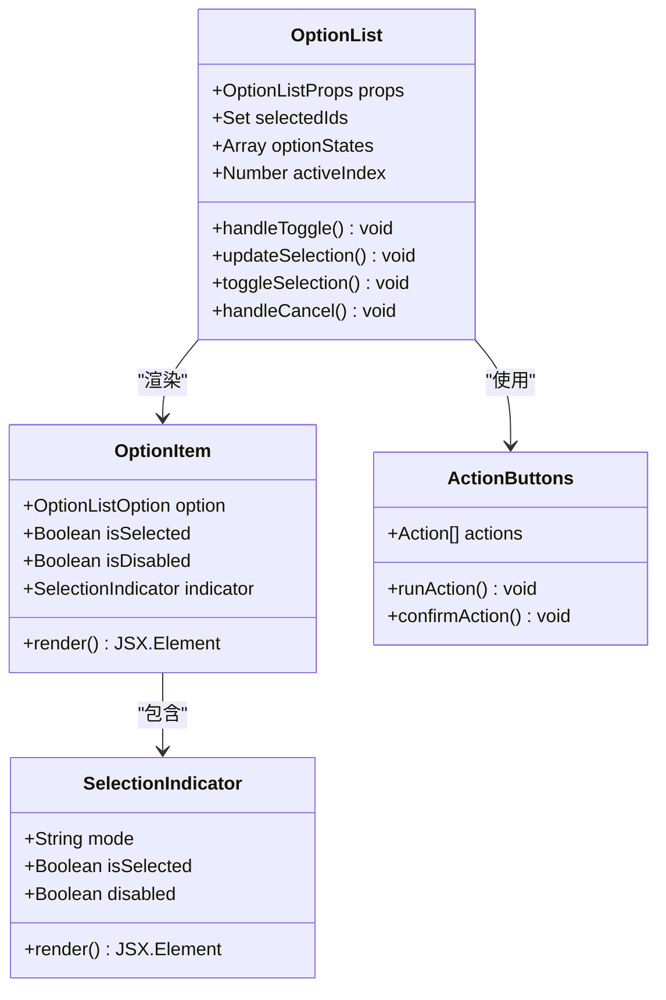

**图表来源**
- [OptionList.tsx:216-626](file://ui-react/src/components/tool-ui/option-list/option-list.tsx#L216-L626)
- [OptionList.tsx:77-150](file://ui-react/src/components/tool-ui/option-list/option-list.tsx#L77-L150)
- [ActionButtons.tsx:16-101](file://ui-react/src/components/tool-ui/shared/action-buttons.tsx#L16-L101)

#### 核心功能特性

1. **单选/多选支持**: 支持单选和多选两种模式
2. **动态验证**: 支持最小/最大选择数量限制
3. **键盘导航**: 完整的键盘交互支持（上下箭头、Home、End、Enter、Space）
4. **无障碍支持**: ARIA标签和角色定义
5. **动画效果**: 平滑的选择状态切换动画
6. **确认视图**: 支持选择确认和收据模式

**章节来源**
- [OptionList.tsx:216-230](file://ui-react/src/components/tool-ui/option-list/option-list.tsx#L216-L230)
- [OptionList.tsx:352-378](file://ui-react/src/components/tool-ui/option-list/option-list.tsx#L352-L378)
- [OptionList.tsx:456-518](file://ui-react/src/components/tool-ui/option-list/option-list.tsx#L456-L518)

### QuestionFlow 组件系统

**更新** QuestionFlow组件实现了复杂的步骤化交互流程：

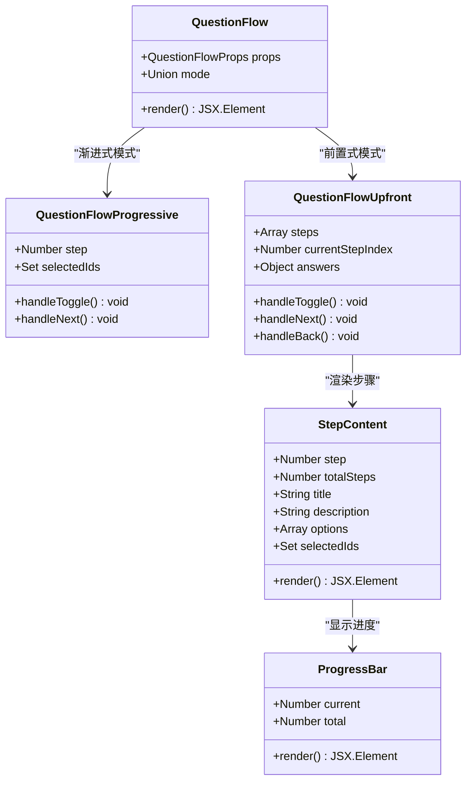

**图表来源**
- [QuestionFlow.tsx:781-793](file://ui-react/src/components/tool-ui/question-flow/question-flow.tsx#L781-L793)
- [QuestionFlow.tsx:573-636](file://ui-react/src/components/tool-ui/question-flow/question-flow.tsx#L573-L636)
- [QuestionFlow.tsx:638-779](file://ui-react/src/components/tool-ui/question-flow/question-flow.tsx#L638-L779)
- [QuestionFlow.tsx:33-58](file://ui-react/src/components/tool-ui/question-flow/question-flow.tsx#L33-L58)

#### 核心功能特性

1. **三种模式支持**: 渐进式、前置式和收据模式
2. **步骤导航**: 支持前进/后退的步骤导航
3. **过渡动画**: 平滑的步骤切换动画效果
4. **进度指示**: 清晰的进度条和步骤指示器
5. **键盘导航**: 完整的键盘交互支持
6. **状态管理**: 复杂的状态管理和数据持久化

**章节来源**
- [QuestionFlow.tsx:781-793](file://ui-react/src/components/tool-ui/question-flow/question-flow.tsx#L781-L793)
- [QuestionFlow.tsx:638-779](file://ui-react/src/components/tool-ui/question-flow/question-flow.tsx#L638-L779)
- [QuestionFlow.tsx:257-447](file://ui-react/src/components/tool-ui/question-flow/question-flow.tsx#L257-L447)

## 依赖关系分析

工具UI组件系统的依赖关系已大幅扩展，包含重构后的ToolFallback模块化架构：

```mermaid
graph TB
subgraph "重构后的ToolFallback模块"
A[ToolFallback 主组件] --> B[sections 工具UI段落]
A --> C[tool-detail-drawer 详情抽屉]
A --> D[status-badge 状态徽章]
A --> E[rich-presentation 富内容解析]
A --> F[types 类型定义]
A --> G[parse-tool-ui-payload 负载解析]
A --> H[parse-weather-widget-payload 天气负载解析]
end
subgraph "新增富工具UI系统"
CH[Chart 图表组件] --> TL1[Recharts]
CH --> SH1[ChartAdapter]
CB[CodeBlock 代码块组件] --> TL2[Shiki]
CB --> SH2[CodeBlockAdapter]
LP[LinkPreview 链接预览组件] --> SH3[LinkAdapter]
SD[StatsDisplay 统计显示组件] --> SH4[StatsAdapter]
TE[Terminal 终端输出组件] --> TL3[ansi-to-react]
TE --> SH5[TerminalAdapter]
end
subgraph "新增OptionList系统"
OL[OptionList 选项列表组件] --> AB[ActionButtons]
OL --> SL[Selection Logic]
OL --> RV[Receipt View]
OL --> SC[Schema Contract]
end
subgraph "新增QuestionFlow系统"
QF[QuestionFlow 问题流程组件] --> PF[Progressive Mode]
QF --> UF[Upfront Mode]
QF --> RF[Receipt Mode]
QF --> PB[Progress Bar]
QF --> KB[Keyboard Navigation]
QF --> SC
end
subgraph "共享组件系统"
AB --> UAB[useActionButtons]
SC --> PC[Parse Contract]
SC --> SV[Schema Validation]
SH6[Shared Helpers] --> TH[Theme Handling]
SH6 --> CC[Copy Control]
end
subgraph "样式和工具"
N[Tailwind CSS]
O[工具函数]
P[类型定义]
end
subgraph "外部库"
Q[Assistant UI]
R[lucide-react]
S[react-markdown]
T[vaul]
U[remark-gfm]
V[@assistant-ui/react-markdown]
W[Zod Schema]
X[React Hooks]
Y[FRamer Motion]
Z[第三方库]
end
A --> N
B --> N
C --> N
D --> N
E --> N
F --> N
G --> N
H --> N
CH --> N
CB --> N
LP --> N
SD --> N
TE --> N
OL --> N
QF --> N
AB --> X
QF --> Y
OL --> Y
A --> O
B --> O
C --> O
D --> O
E --> O
F --> O
G --> O
H --> O
CH --> O
CB --> O
LP --> O
SD --> O
TE --> O
OL --> O
QF --> O
A --> P
B --> P
C --> P
D --> P
E --> P
F --> P
G --> P
H --> P
CH --> P
CB --> P
LP --> P
SD --> P
TE --> P
OL --> P
QF --> P
A --> Q
B --> Q
C --> Q
D --> Q
E --> Q
F --> Q
G --> Q
H --> Q
OL --> Q
QF --> Q
A --> R
B --> R
C --> R
D --> R
E --> R
F --> R
G --> R
H --> R
CH --> R
CB --> R
LP --> R
SD --> R
TE --> R
OL --> R
QF --> R
A --> S
A --> T
S --> U
L --> V
SC --> W
AB --> UAB
SH6 --> Z
```

**更新** 新增了ToolFallback模块化架构的完整依赖关系，包括sections.tsx、tool-detail-drawer.tsx、status-badge.tsx、rich-presentation.tsx等新组件的依赖关系

**图表来源**
- [ToolFallback/index.tsx:1-20](file://ui-react/src/components/chat/ToolFallback/index.tsx#L1-L20)
- [ToolFallback/sections.tsx:1-7](file://ui-react/src/components/chat/ToolFallback/sections.tsx#L1-L7)
- [ToolFallback/tool-detail-drawer.tsx:1-21](file://ui-react/src/components/chat/ToolFallback/tool-detail-drawer.tsx#L1-L21)
- [ToolFallback/status-badge.tsx:1-2](file://ui-react/src/components/chat/ToolFallback/status-badge.tsx#L1-L2)
- [ToolFallback/rich-presentation.tsx:1-18](file://ui-react/src/components/chat/ToolFallback/rich-presentation.tsx#L1-L18)

**章节来源**
- [button.tsx:1-56](file://ui-react/src/components/ui/button.tsx#L1-L56)
- [drawer.tsx:1-121](file://ui-react/src/components/ui/drawer.tsx#L1-L121)
- [utils.ts:1-7](file://ui-react/src/lib/utils.ts#L1-L7)

### Markdown组件共享机制

工具UI组件系统采用了共享的Markdown组件机制，通过`plainMdComponents`实现跨组件的一致性渲染：

- **共享组件定义**: 在`markdown-text.tsx`中定义了`plainMdComponents`，为所有需要独立Markdown渲染的场景提供统一的组件配置
- **组件复用**: ToolFallback组件直接导入并使用这个共享的组件配置，避免了重复定义和维护成本
- **样式一致性**: 所有使用plain ReactMarkdown的组件都继承了相同的样式和行为规范

**章节来源**
- [markdown-text.tsx:223-243](file://ui-react/src/components/assistant-ui/markdown-text.tsx#L223-L243)
- [ToolFallback/index.tsx:30-31](file://ui-react/src/components/chat/ToolFallback/index.tsx#L30-L31)

### 新增共享组件系统

**更新** 新增了完整的共享组件系统，为富工具UI组件提供统一的基础功能：

#### ActionButtons组件
- **统一动作按钮**: 提供一致的动作按钮渲染和交互逻辑
- **确认机制**: 支持二次确认和加载状态显示
- **对齐选项**: 支持左对齐、居中和右对齐
- **无障碍支持**: 完整的键盘导航和ARIA支持

#### useActionButtons钩子
- **状态管理**: 管理动作按钮的确认、执行和加载状态
- **并发控制**: 防止同时执行多个动作
- **超时处理**: 支持确认超时和ESC取消
- **回调处理**: 统一的动作回调处理机制

#### Schema Contract系统
- **类型安全**: 使用Zod提供运行时类型验证
- **契约定义**: 定义工具UI组件的标准接口
- **序列化支持**: 支持工具调用参数的序列化和反序列化
- **错误处理**: 统一的错误处理和调试支持

#### Shared Helpers系统
- **主题处理**: 统一的主题检测和切换逻辑
- **复制控制**: 统一的复制到剪贴板功能
- **状态管理**: 统一的状态管理和生命周期处理

**章节来源**
- [ActionButtons.tsx:16-101](file://ui-react/src/components/tool-ui/shared/action-buttons.tsx#L16-L101)
- [useActionButtons.tsx:48-153](file://ui-react/src/components/tool-ui/shared/use-action-buttons.tsx#L48-L153)
- [contract.ts:10-19](file://ui-react/src/components/tool-ui/shared/contract.ts#L10-L19)

## 性能考虑

工具UI组件系统在设计时充分考虑了性能优化，重构后的ToolFallback模块也遵循了同样的原则：

### 渲染优化
1. **条件渲染**: 只在需要时渲染详细信息
2. **状态缓存**: 使用React状态管理避免不必要的重渲染
3. **懒加载**: 抽屉组件按需加载
4. **虚拟滚动**: OptionList支持大量选项的虚拟滚动优化
5. **动画优化**: 使用CSS动画而非JavaScript动画
6. **HTML缓存**: CodeBlock组件使用缓存机制减少重复渲染
7. **模块化加载**: ToolFallback组件按需加载各个模块

### 内存管理
1. **事件监听器清理**: 自动清理媒体查询监听器
2. **状态清理**: 组件卸载时清理所有订阅
3. **引用管理**: 使用useRef管理DOM引用，避免闭包陷阱
4. **记忆化**: 使用useMemo和useCallback优化重渲染
5. **缓存管理**: 合理的缓存大小控制和清理策略
6. **组件卸载**: 重构后的模块在卸载时正确清理资源

### 用户体验优化
1. **无障碍访问**: 完整的键盘导航支持
2. **响应式设计**: 适配不同屏幕尺寸
3. **动画优化**: 减少运动偏好用户的视觉干扰
4. **加载状态**: 提供清晰的加载和执行状态反馈
5. **性能监控**: 关键操作的性能指标收集
6. **模块化体验**: 按需加载提高初始渲染性能

### 第三方库优化
1. **Recharts优化**: 图表组件的懒加载和数据优化
2. **Shiki优化**: 语法高亮的异步加载和缓存机制
3. **ansi-to-react优化**: ANSI转义的高效渲染
4. **主题切换优化**: 自动主题检测和切换的性能优化
5. **Zod验证优化**: 模式验证的性能优化和缓存

## 故障排除指南

### 常见问题及解决方案

#### 工具状态显示异常
**问题**: 工具状态不正确显示
**解决方案**: 
1. 检查工具返回的结果格式
2. 验证`isError`标志设置
3. 确认结果字符串中的错误标识

#### 参数预览不准确
**问题**: 工具参数预览显示不完整
**解决方案**:
1. 检查JSON参数格式
2. 验证参数键名匹配
3. 确认参数值的有效性

#### 抽屉组件无法打开
**问题**: 工具详情抽屉无法正常打开
**解决方案**:
1. 检查`canViewDetail`状态判断
2. 验证事件处理器绑定
3. 确认DOM元素存在

#### Markdown渲染问题
**问题**: 工具结果中的Markdown不正确渲染
**解决方案**:
1. 确认使用了正确的组件配置（plainMdComponents）
2. 检查remarkGfm插件的正确引入
3. 验证frontmatter解析逻辑

#### 富工具UI组件问题

**更新** 新增富工具UI组件相关问题解决：

##### Chart图表组件问题
**问题**: 图表渲染异常或数据不显示
**解决方案**:
1. 检查数据格式是否符合ChartSchema要求
2. 验证xKey和series配置的正确性
3. 确认Recharts库的正确引入
4. 检查容器尺寸和响应式配置

##### CodeBlock代码块问题
**问题**: 语法高亮不工作或主题异常
**解决方案**:
1. 检查语言标识符是否在支持列表中
2. 验证Shiki库的正确初始化
3. 确认主题文件的正确加载
4. 检查HTML缓存机制的工作状态

##### LinkPreview链接预览问题
**问题**: 链接预览无法正常显示或安全检查失败
**解决方案**:
1. 检查URL格式是否正确
2. 验证安全导航函数的调用
3. 确认链接解析逻辑的正确性
4. 检查图片加载和域名提取功能

##### StatsDisplay统计显示问题
**问题**: 数字格式化异常或趋势图表不显示
**解决方案**:
1. 检查StatItem数据结构的完整性
2. 验证格式化配置的正确性
3. 确认本地化设置的可用性
4. 检查Sparkline数据的格式要求

##### Terminal终端输出问题
**问题**: ANSI转义不正确或输出显示异常
**解决方案**:
1. 检查ANSI转义序列的正确性
2. 验证ansi-to-react库的版本兼容性
3. 确认输出分栏和颜色处理逻辑
4. 检查折叠控制和截断处理功能

#### ToolFallback模块问题

**更新** 新增ToolFallback模块相关问题解决：

##### 模块加载失败
**问题**: ToolFallback组件无法正确加载
**解决方案**:
1. 检查模块路径是否正确
2. 验证各子模块的导出和导入
3. 确认类型定义的正确性
4. 检查依赖库的版本兼容性

##### 富内容解析失败
**问题**: 富工具UI内容无法正确解析
**解决方案**:
1. 检查工具UI负载格式是否正确
2. 验证Zod模式验证的通过情况
3. 确认工具名称与组件映射的正确性
4. 检查组件的正确导入和渲染

##### 状态徽章显示异常
**问题**: 状态徽章无法正确显示
**解决方案**:
1. 检查ToolStatus枚举的值
2. 验证isCancelled标志的设置
3. 确认状态徽章组件的正确使用
4. 检查样式类名的正确性

#### OptionList选择问题
**更新** 新增OptionList相关问题解决：
**问题**: 选项无法正确选择或状态异常
**解决方案**:
1. 检查选项ID的唯一性
2. 验证selectionMode配置
3. 确认最小/最大选择数量限制
4. 检查disabled状态设置

#### QuestionFlow导航问题
**更新** 新增QuestionFlow相关问题解决：
**问题**: 步骤间导航异常或状态丢失
**解决方案**:
1. 检查步骤ID的唯一性
2. 验证步骤顺序和依赖关系
3. 确认答案数据的正确存储
4. 检查过渡动画的配置

#### 动作按钮冲突
**更新** 新增共享组件相关问题解决：
**问题**: 动作按钮点击冲突或状态异常
**解决方案**:
1. 检查动作ID的唯一性
2. 验证确认机制配置
3. 确认并发执行控制
4. 检查回调函数的正确绑定

**章节来源**
- [ToolFallback/index.tsx:454-488](file://ui-react/src/components/chat/ToolFallback/index.tsx#L454-L488)
- [ToolFallback/index.tsx:490-513](file://ui-react/src/components/chat/ToolFallback/index.tsx#L490-L513)
- [ToolFallback/sections.tsx:691-714](file://ui-react/src/components/chat/ToolFallback/sections.tsx#L691-L714)
- [ToolFallback/tool-detail-drawer.tsx:691-714](file://ui-react/src/components/chat/ToolFallback/tool-detail-drawer.tsx#L691-L714)
- [ToolFallback/status-badge.tsx:691-714](file://ui-react/src/components/chat/ToolFallback/status-badge.tsx#L691-L714)
- [ToolFallback/rich-presentation.tsx:691-714](file://ui-react/src/components/chat/ToolFallback/rich-presentation.tsx#L691-L714)

## 结论

工具UI组件系统为OpenClaw项目提供了强大而灵活的工具调用可视化解决方案。通过模块化的组件设计、智能的状态管理和丰富的用户交互功能，该系统能够有效提升用户对AI工具调用的理解和控制能力。

**更新** 本次更新大幅增强了组件系统的功能，重构后的ToolFallback模块提供了更加专业和完善的工具调用可视化能力：

### 主要优势包括：
- **高度模块化**: ToolFallback采用模块化架构设计，便于维护和扩展
- **智能分类**: 基于正则表达式的工具分类识别更加准确
- **参数解析**: 支持多种工具类型的参数智能提取和预览
- **状态管理**: 完整的工具执行状态检测和处理机制
- **富内容支持**: 新增对Chart、CodeBlock、LinkPreview、StatsDisplay、Terminal等组件的深度支持
- **详情展示**: 提供完整的工具调用详情和原始内容展示
- **性能优化**: 模块化架构提高了组件的加载和渲染性能
- **代码复用高效**: 通过共享组件减少重复代码和维护成本
- **类型安全**: 使用Zod提供完整的运行时类型验证
- **无障碍友好**: 完整的键盘导航和ARIA支持
- **第三方库集成**: 专业库的深度集成提升了组件的专业性和稳定性

### 新增功能特性：
- **模块化架构**: ToolFallback/index.tsx作为主入口，sections.tsx提供通用组件，tool-detail-drawer.tsx负责详情展示，status-badge.tsx管理状态，rich-presentation.tsx处理富内容
- **富工具UI解析**: rich-presentation.tsx支持多种富工具UI格式的解析和展示
- **负载解析**: parse-tool-ui-payload.ts和parse-weather-widget-payload.ts提供专业的负载解析功能
- **增强的工具UI**: 为复杂的工具调用提供更好的用户体验
- **类型安全**: 新增的types.ts提供完整的类型定义和验证
- **模块化依赖**: 各组件模块独立，便于单独测试和维护

### 未来发展方向：
- **更多工具类型支持**: 扩展支持更多专业领域的工具UI组件
- **自定义主题选项**: 提供更丰富的主题定制功能
- **批量工具操作**: 支持多个工具的批量执行和管理
- **高级交互模式**: 实现更复杂的用户交互和数据处理流程
- **性能进一步优化**: 深入优化大型数据集和复杂图表的渲染性能
- **模块化扩展**: 继续优化模块化架构，提高组件的可扩展性

本次更新反映了ToolFallback组件的重大重构，体现了工具UI组件向更专业、更完善的工具发展，为OpenClaw项目提供了更加强大和灵活的工具调用可视化解决方案。