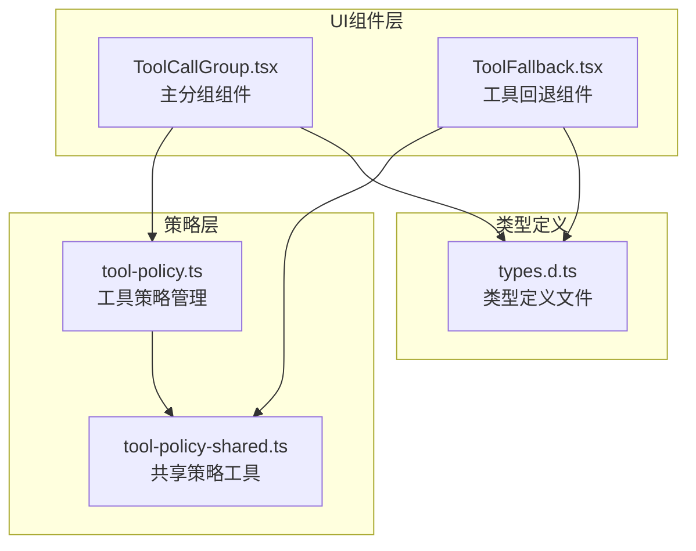
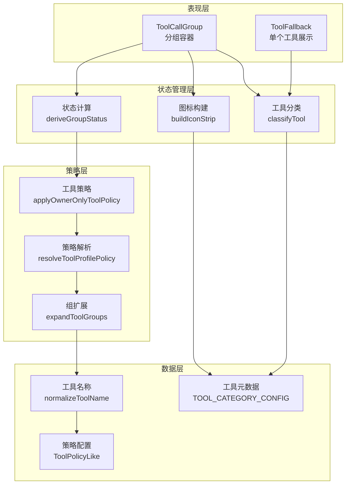
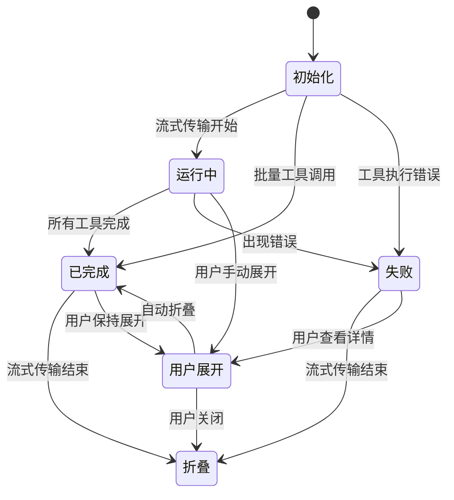
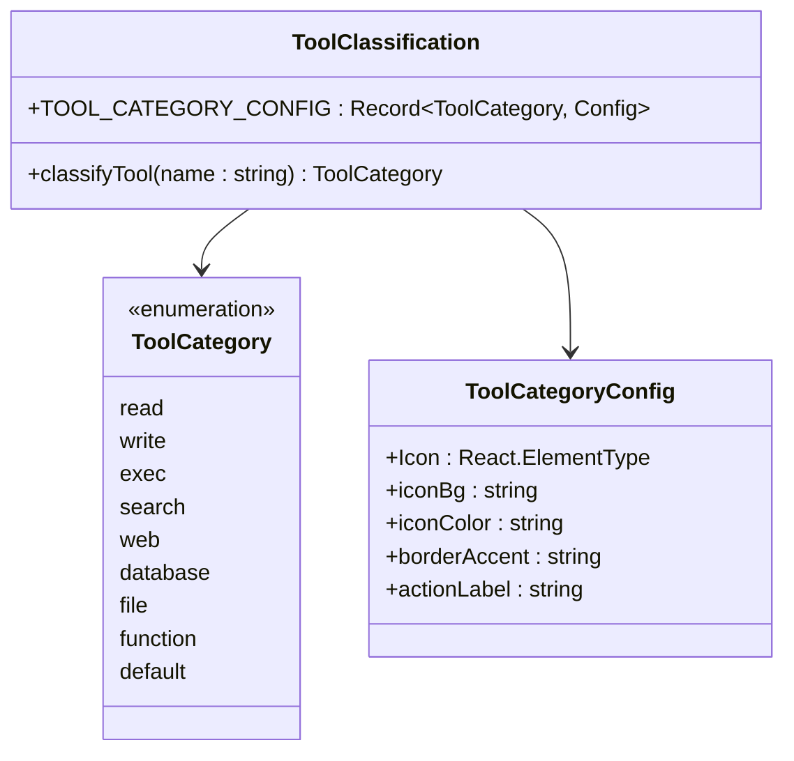
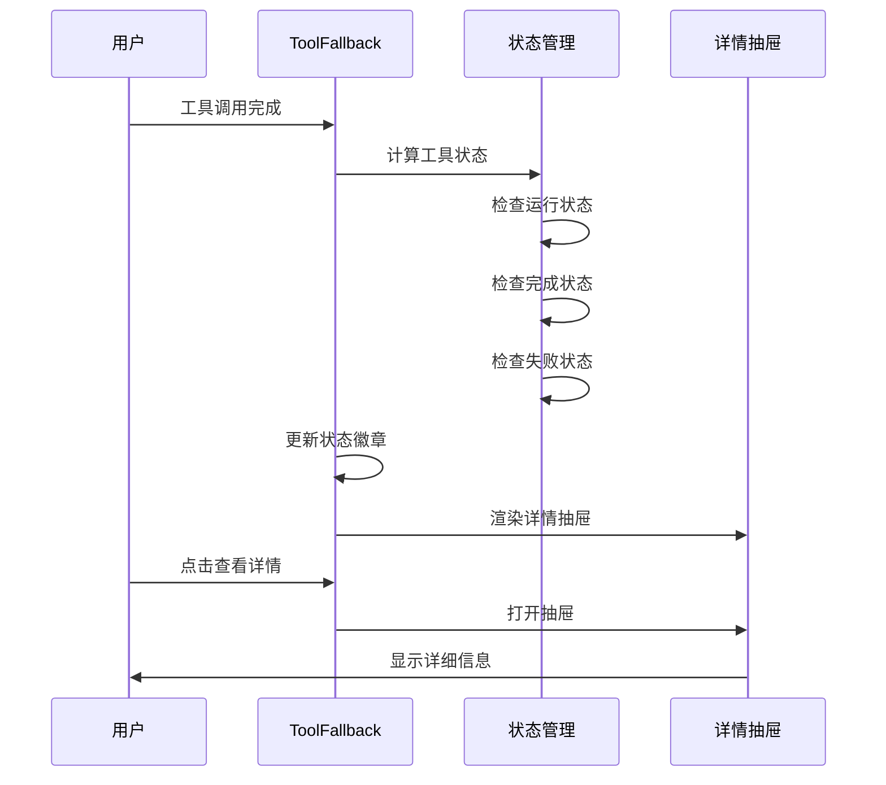
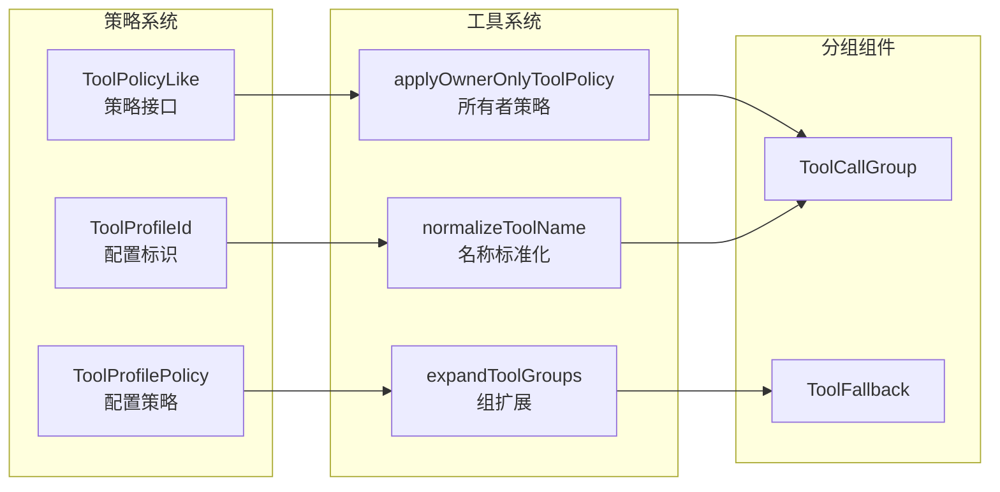

# 工具调用分组组件

<cite>
**本文档引用的文件**
- [ToolCallGroup.tsx](file://ui-react/src/components/chat/ToolCallGroup.tsx)
- [ToolFallback.tsx](file://ui-react/src/components/chat/ToolFallback.tsx)
- [tool-policy.ts](file://src/agents/tool-policy.ts)
- [tool-policy-shared.ts](file://src/agents/tool-policy-shared.ts)
</cite>

## 目录
1. [简介](#简介)
2. [项目结构](#项目结构)
3. [核心组件](#核心组件)
4. [架构概览](#架构概览)
5. [详细组件分析](#详细组件分析)
6. [依赖关系分析](#依赖关系分析)
7. [性能考虑](#性能考虑)
8. [故障排除指南](#故障排除指南)
9. [结论](#结论)

## 简介

工具调用分组组件是 OpenClaw 项目中的一个重要功能模块，专门用于处理和展示多个连续工具调用的聚合显示。该组件通过智能分组、状态管理和用户交互优化，为用户提供清晰的工具调用历史视图。

该组件的核心价值在于：
- 将多个连续的工具调用合并为一个可折叠的分组容器
- 提供实时的状态跟踪和视觉反馈
- 支持工具调用的分类和图标展示
- 实现智能的展开/折叠行为管理

## 项目结构

工具调用分组组件主要分布在以下位置：



**图表来源**
- [ToolCallGroup.tsx:1-255](file://ui-react/src/components/chat/ToolCallGroup.tsx#L1-L255)
- [ToolFallback.tsx:1-463](file://ui-react/src/components/chat/ToolFallback.tsx#L1-L463)
- [tool-policy.ts:1-206](file://src/agents/tool-policy.ts#L1-L206)
- [tool-policy-shared.ts:1-50](file://src/agents/tool-policy-shared.ts#L1-L50)

**章节来源**
- [ToolCallGroup.tsx:1-255](file://ui-react/src/components/chat/ToolCallGroup.tsx#L1-L255)
- [ToolFallback.tsx:1-463](file://ui-react/src/components/chat/ToolFallback.tsx#L1-L463)
- [tool-policy.ts:1-206](file://src/agents/tool-policy.ts#L1-L206)
- [tool-policy-shared.ts:1-50](file://src/agents/tool-policy-shared.ts#L1-L50)

## 核心组件

### ToolCallGroup 主组件

ToolCallGroup 是整个工具调用分组系统的核心组件，负责将多个连续的工具调用包装在一个智能的分组容器中。

**主要特性：**
- 自动检测连续的工具调用并进行分组
- 智能的展开/折叠行为管理
- 实时状态更新和视觉反馈
- 工具分类图标展示

### ToolFallback 工具回退组件

ToolFallback 组件提供了单个工具调用的详细展示功能，包括参数、结果和错误信息的可视化。

**核心功能：**
- 工具调用状态的可视化展示
- 参数和结果的详细查看
- 错误信息的友好呈现
- 分类图标和颜色编码

**章节来源**
- [ToolCallGroup.tsx:127-140](file://ui-react/src/components/chat/ToolCallGroup.tsx#L127-L140)
- [ToolFallback.tsx:345-463](file://ui-react/src/components/chat/ToolFallback.tsx#L345-L463)

## 架构概览

工具调用分组组件采用分层架构设计，确保了良好的模块化和可维护性：



**图表来源**
- [ToolCallGroup.tsx:40-77](file://ui-react/src/components/chat/ToolCallGroup.tsx#L40-L77)
- [ToolFallback.tsx:47-74](file://ui-react/src/components/chat/ToolFallback.tsx#L47-L74)
- [tool-policy.ts:41-52](file://src/agents/tool-policy.ts#L41-L52)
- [tool-policy-shared.ts:17-47](file://src/agents/tool-policy-shared.ts#L17-L47)

## 详细组件分析

### ToolCallGroup 组件深度分析

#### 状态管理系统



**图表来源**
- [ToolCallGroup.tsx:167-178](file://ui-react/src/components/chat/ToolCallGroup.tsx#L167-L178)
- [ToolCallGroup.tsx:40-52](file://ui-react/src/components/chat/ToolCallGroup.tsx#L40-L52)

#### 分组算法实现

ToolCallGroup 使用智能算法来识别和分组连续的工具调用：


**图表来源**
- [ToolCallGroup.tsx:127-160](file://ui-react/src/components/chat/ToolCallGroup.tsx#L127-L160)
- [ToolCallGroup.tsx:152-156](file://ui-react/src/components/chat/ToolCallGroup.tsx#L152-L156)

**章节来源**
- [ToolCallGroup.tsx:1-255](file://ui-react/src/components/chat/ToolCallGroup.tsx#L1-L255)

### ToolFallback 组件详细分析

#### 工具分类系统

ToolFallback 实现了强大的工具分类功能，支持多种工具类型的自动识别：



**图表来源**
- [ToolFallback.tsx:36-74](file://ui-react/src/components/chat/ToolFallback.tsx#L36-L74)
- [ToolFallback.tsx:76-152](file://ui-react/src/components/chat/ToolFallback.tsx#L76-L152)

#### 状态管理流程



**图表来源**
- [ToolFallback.tsx:345-463](file://ui-react/src/components/chat/ToolFallback.tsx#L345-L463)
- [ToolFallback.tsx:382-405](file://ui-react/src/components/chat/ToolFallback.tsx#L382-L405)

**章节来源**
- [ToolFallback.tsx:1-463](file://ui-react/src/components/chat/ToolFallback.tsx#L1-L463)

### 工具策略集成

工具调用分组组件与工具策略系统深度集成，确保安全和合规的工具使用：



**图表来源**
- [tool-policy.ts:54-68](file://src/agents/tool-policy.ts#L54-L68)
- [tool-policy.ts:41-52](file://src/agents/tool-policy.ts#L41-L52)
- [tool-policy-shared.ts:17-47](file://src/agents/tool-policy-shared.ts#L17-L47)

**章节来源**
- [tool-policy.ts:1-206](file://src/agents/tool-policy.ts#L1-L206)
- [tool-policy-shared.ts:1-50](file://src/agents/tool-policy-shared.ts#L1-L50)

## 依赖关系分析

工具调用分组组件的依赖关系展现了清晰的层次结构：

```mermaid
graph TB
subgraph "外部依赖"
A[React<br/>组件框架]
B[@assistant-ui/react<br/>UI组件库]
C[lucide-react<br/>图标库]
D[react-markdown<br/>Markdown渲染]
end
subgraph "内部依赖"
E[ui-react/lib/utils<br/>工具函数]
F[ui-react/components/ui<br/>UI组件]
G[src/agents/tool-policy<br/>策略管理]
H[src/agents/tool-policy-shared<br/>共享工具]
end
subgraph "核心组件"
I[ToolCallGroup]
J[ToolFallback]
end
A --> I
B --> I
C --> I
D --> J
E --> I
F --> J
G --> I
H --> J
G --> J
H --> I
```

**图表来源**
- [ToolCallGroup.tsx:1-12](file://ui-react/src/components/chat/ToolCallGroup.tsx#L1-L12)
- [ToolFallback.tsx:1-31](file://ui-react/src/components/chat/ToolFallback.tsx#L1-L31)

**章节来源**
- [ToolCallGroup.tsx:1-255](file://ui-react/src/components/chat/ToolCallGroup.tsx#L1-L255)
- [ToolFallback.tsx:1-463](file://ui-react/src/components/chat/ToolFallback.tsx#L1-L463)

## 性能考虑

工具调用分组组件在设计时充分考虑了性能优化：

### 渲染优化
- **条件渲染**：单个工具调用不进行额外包装，避免不必要的DOM节点
- **懒加载**：仅在多工具场景下才渲染分组容器
- **状态缓存**：使用useRef缓存前一状态，减少重复计算

### 内存管理
- **集合去重**：使用Set确保工具分类的唯一性
- **对象复用**：合理使用对象属性避免频繁创建新对象
- **清理机制**：及时清理事件监听器和定时器

### 用户体验优化
- **智能展开**：根据流式传输状态自动控制展开/折叠
- **无障碍支持**：完整的键盘导航和屏幕阅读器支持
- **响应式设计**：适配不同屏幕尺寸和设备

## 故障排除指南

### 常见问题及解决方案

#### 工具分组不正确
**问题描述**：连续的工具调用没有被正确分组
**可能原因**：
- startIndex/endIndex 参数传递错误
- 工具调用部分类型不匹配
- 消息内容格式异常

**解决方法**：
1. 检查工具调用部分的类型验证
2. 验证消息内容的结构完整性
3. 确认索引参数的正确性

#### 状态显示异常
**问题描述**：工具调用状态显示不准确
**可能原因**：
- 状态计算逻辑错误
- 流式传输状态监听失效
- 异步状态更新竞争

**解决方法**：
1. 检查deriveGroupStatus函数的逻辑
2. 验证useEffect依赖项的完整性
3. 实施状态同步机制

#### 图标显示问题
**问题描述**：工具分类图标显示异常或缺失
**可能原因**：
- 工具分类规则不匹配
- 图标配置缺失
- 样式类名冲突

**解决方法**：
1. 验证classifyTool函数的正则表达式
2. 检查TOOL_CATEGORY_CONFIG的完整性
3. 排查CSS样式冲突

**章节来源**
- [ToolCallGroup.tsx:40-52](file://ui-react/src/components/chat/ToolCallGroup.tsx#L40-L52)
- [ToolFallback.tsx:47-74](file://ui-react/src/components/chat/ToolFallback.tsx#L47-L74)

## 结论

工具调用分组组件是 OpenClaw 项目中一个精心设计的功能模块，它成功地解决了多工具调用场景下的用户体验问题。通过智能的分组算法、完善的策略集成和优秀的性能优化，该组件为用户提供了直观、高效且安全的工具调用管理体验。

### 主要成就
- **智能分组**：自动识别和分组连续工具调用
- **状态管理**：提供实时的状态跟踪和视觉反馈
- **用户友好**：简洁直观的界面设计和交互
- **安全集成**：与工具策略系统无缝集成
- **性能优化**：高效的渲染和内存管理

### 技术亮点
- 基于 React Hooks 的现代组件设计
- 类型安全的 TypeScript 实现
- 完善的错误处理和边界情况处理
- 良好的可测试性和可维护性

该组件为 OpenClaw 的工具生态系统提供了坚实的基础，为未来的功能扩展和性能优化奠定了良好的技术基础。