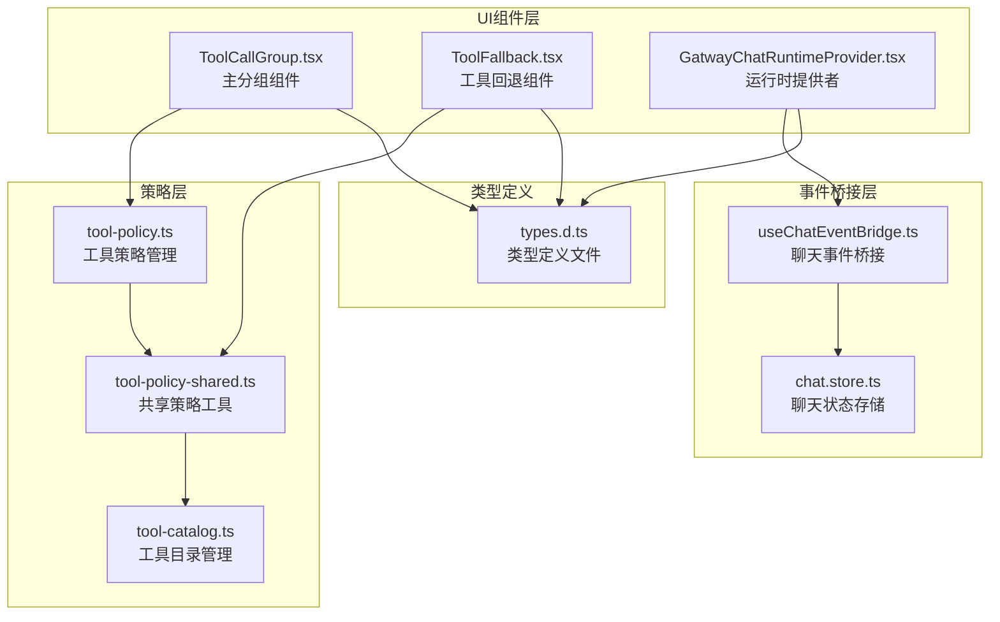
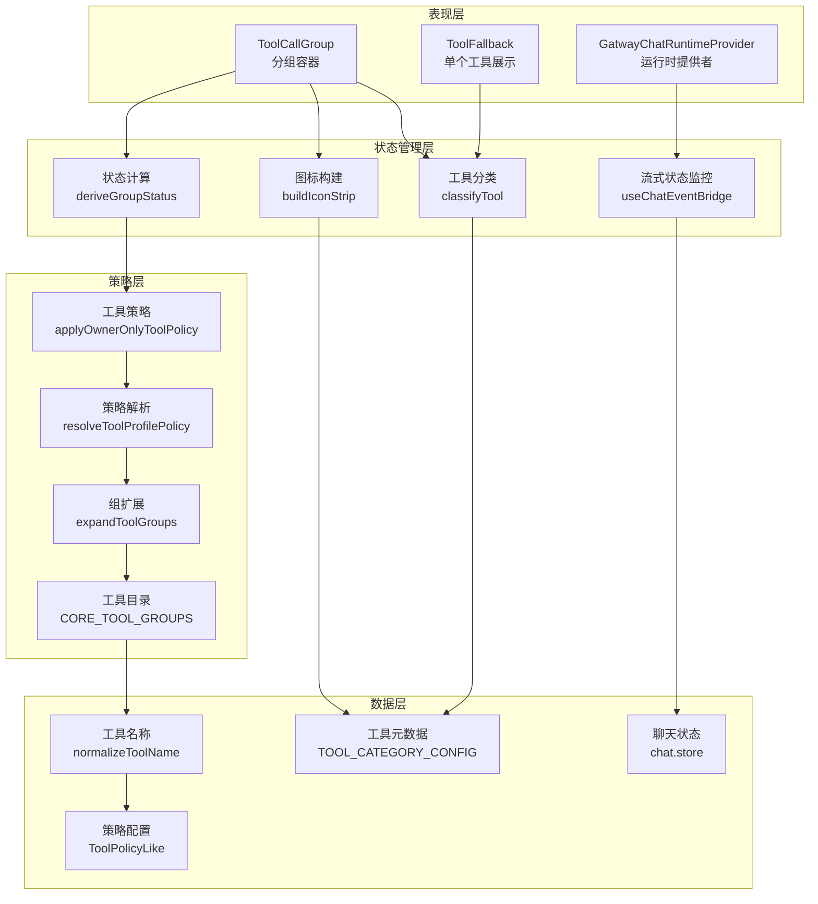
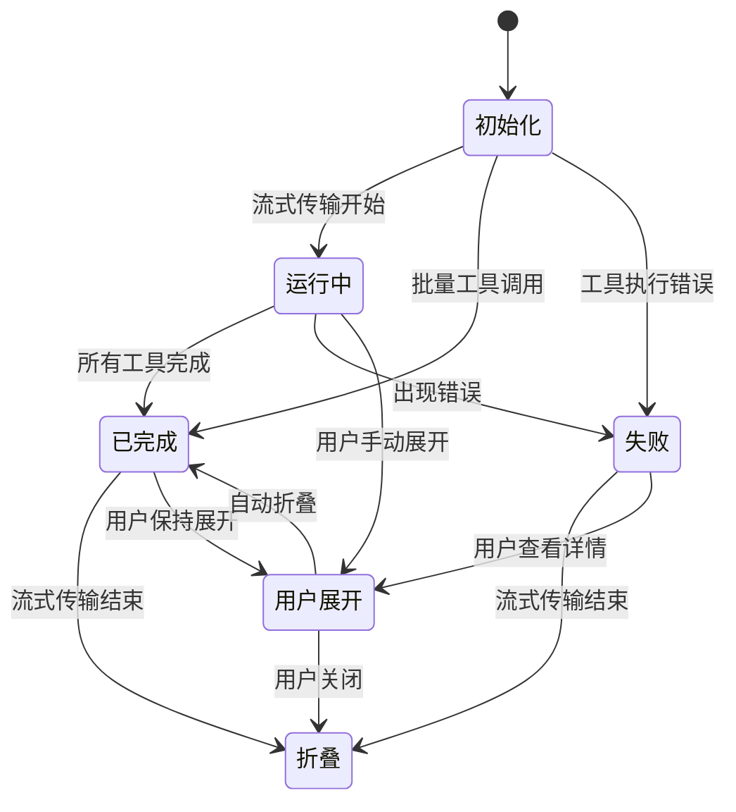
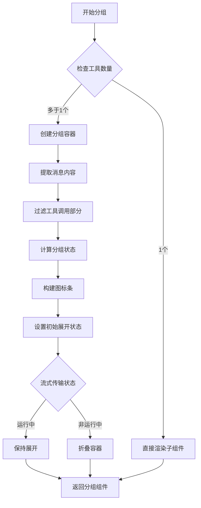
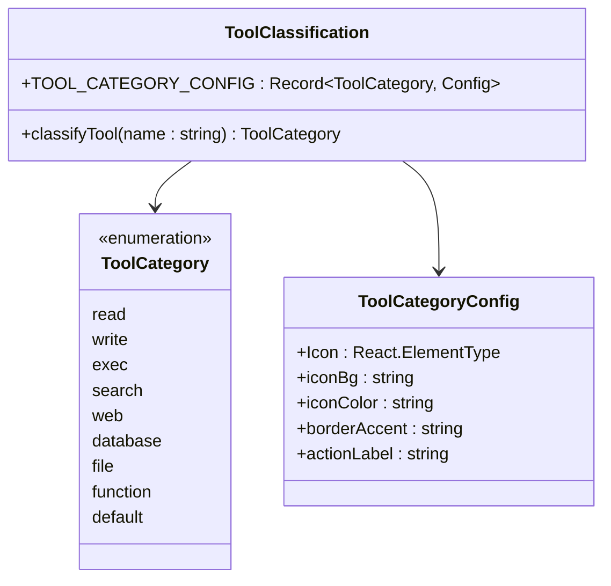
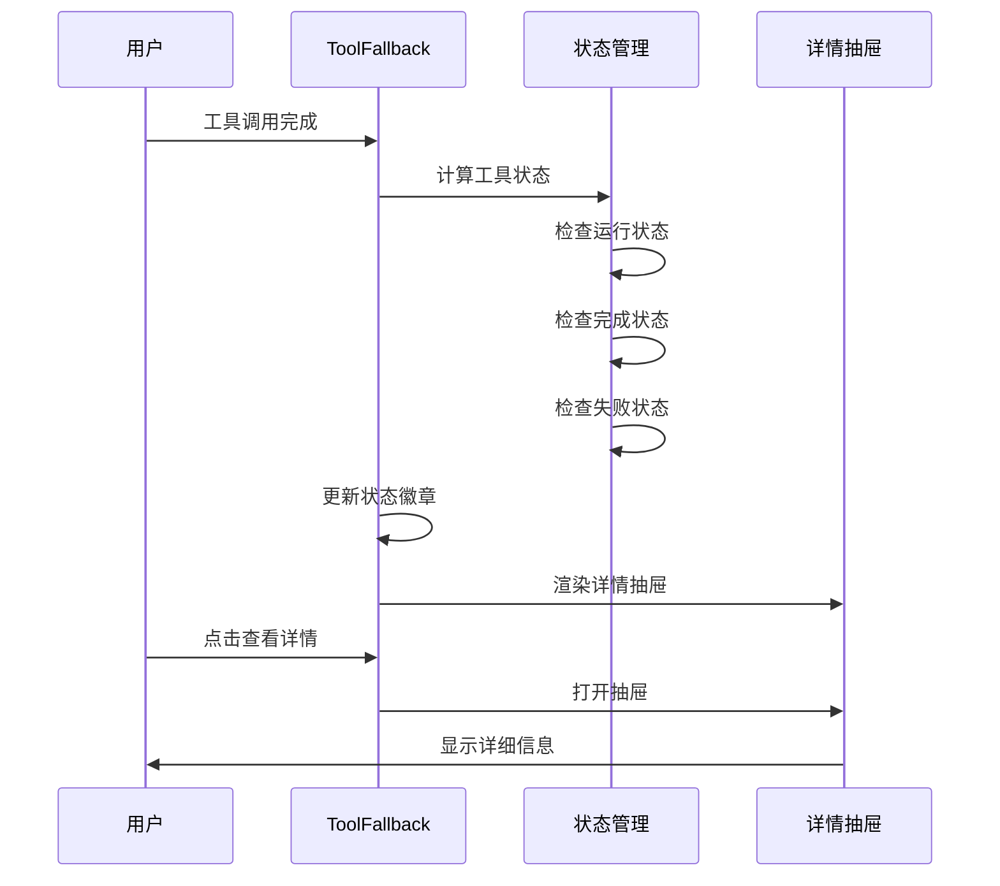
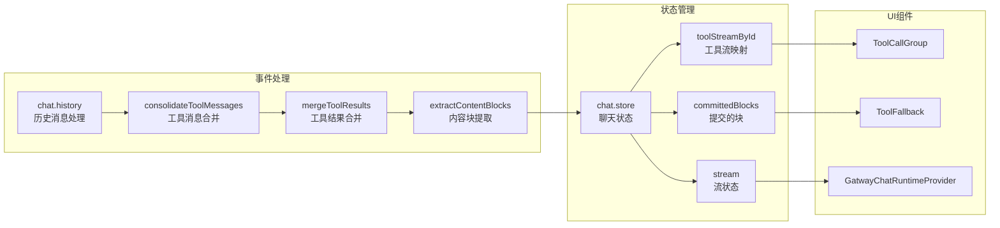
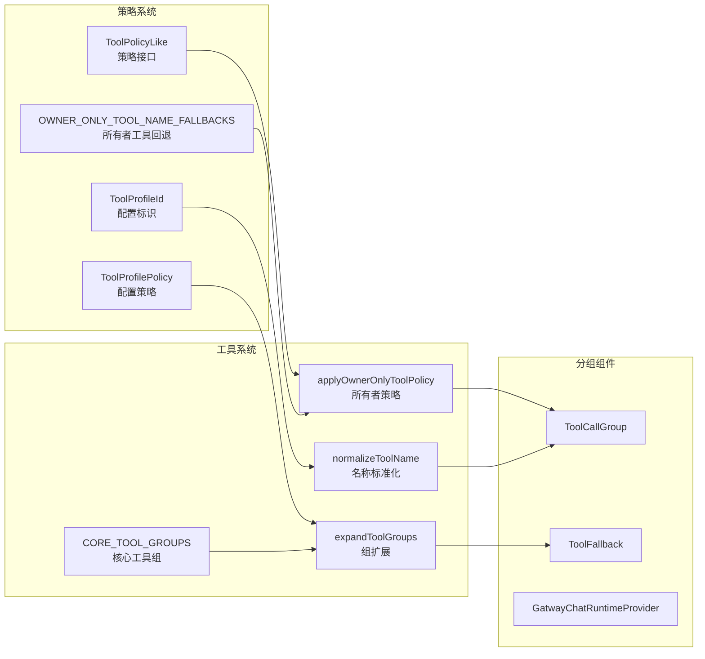

# 工具调用分组组件

<cite>
**本文档引用的文件**
- [ToolCallGroup.tsx](file://ui-react/src/components/chat/ToolCallGroup.tsx)
- [ToolFallback.tsx](file://ui-react/src/components/chat/ToolFallback.tsx)
- [tool-policy.ts](file://src/agents/tool-policy.ts)
- [tool-policy-shared.ts](file://src/agents/tool-policy-shared.ts)
- [useChatEventBridge.ts](file://ui-react/src/hooks/useChatEventBridge.ts)
- [GatewayChatRuntimeProvider.tsx](file://ui-react/src/components/chat/GatewayChatRuntimeProvider.tsx)
- [chat.store.ts](file://ui-react/src/store/chat.store.ts)
</cite>

## 更新摘要
**变更内容**
- 增强了多工具调用处理能力，通过智能合并连续工具调用
- 改进了状态跟踪系统，支持助手消息运行状态的实时监控
- 优化了视觉反馈机制，新增状态徽章和图标显示
- 改进了流式状态显示，提供更准确的工具调用进度反馈
- 增强了助手消息的运行状态管理

## 目录
1. [简介](#简介)
2. [项目结构](#项目结构)
3. [核心组件](#核心组件)
4. [架构概览](#架构概览)
5. [详细组件分析](#详细组件分析)
6. [依赖关系分析](#依赖关系分析)
7. [性能考虑](#性能考虑)
8. [故障排除指南](#故障排除指南)
9. [结论](#结论)

## 简介

工具调用分组组件是 OpenClaw 项目中的一个重要功能模块，专门用于处理和展示多个连续工具调用的聚合显示。该组件通过智能分组、状态管理和用户交互优化，为用户提供清晰的工具调用历史视图。

**重大改进**：
- **智能多工具调用处理**：通过 `consolidateToolMessages` 函数实现连续工具调用的自动合并
- **增强状态跟踪**：实时监控助手消息运行状态，提供准确的工具调用进度反馈
- **改进视觉反馈**：新增状态徽章、图标条和颜色编码系统
- **优化流式显示**：改进流式状态管理，提供更好的用户体验
- **强化助手消息管理**：智能控制工具调用容器的展开/折叠行为

## 项目结构

工具调用分组组件主要分布在以下位置：



**图表来源**
- [ToolCallGroup.tsx:1-268](file://ui-react/src/components/chat/ToolCallGroup.tsx#L1-L268)
- [ToolFallback.tsx:1-465](file://ui-react/src/components/chat/ToolFallback.tsx#L1-L465)
- [tool-policy.ts:1-206](file://src/agents/tool-policy.ts#L1-L206)
- [tool-policy-shared.ts:1-50](file://src/agents/tool-policy-shared.ts#L1-L50)
- [useChatEventBridge.ts:1-716](file://ui-react/src/hooks/useChatEventBridge.ts#L1-L716)
- [GatewayChatRuntimeProvider.tsx:130-163](file://ui-react/src/components/chat/GatewayChatRuntimeProvider.tsx#L130-L163)
- [chat.store.ts:38-71](file://ui-react/src/store/chat.store.ts#L38-L71)

**章节来源**
- [ToolCallGroup.tsx:1-268](file://ui-react/src/components/chat/ToolCallGroup.tsx#L1-L268)
- [ToolFallback.tsx:1-465](file://ui-react/src/components/chat/ToolFallback.tsx#L1-L465)
- [tool-policy.ts:1-206](file://src/agents/tool-policy.ts#L1-L206)
- [tool-policy-shared.ts:1-50](file://src/agents/tool-policy-shared.ts#L1-L50)
- [useChatEventBridge.ts:1-716](file://ui-react/src/hooks/useChatEventBridge.ts#L1-L716)
- [GatewayChatRuntimeProvider.tsx:130-163](file://ui-react/src/components/chat/GatewayChatRuntimeProvider.tsx#L130-L163)
- [chat.store.ts:38-71](file://ui-react/src/store/chat.store.ts#L38-L71)

## 核心组件

### ToolCallGroup 主组件

ToolCallGroup 是整个工具调用分组系统的核心组件，负责将多个连续的工具调用包装在一个智能的分组容器中。

**主要特性**：
- **智能分组检测**：自动检测连续的工具调用并进行分组
- **增强状态管理**：实时跟踪助手消息运行状态，提供准确的工具调用进度
- **智能展开控制**：根据流式传输状态自动控制展开/折叠行为
- **丰富的视觉反馈**：状态徽章、图标条和颜色编码系统
- **用户交互优化**：支持手动展开/折叠和键盘导航

### ToolFallback 工具回退组件

ToolFallback 组件提供了单个工具调用的详细展示功能，包括参数、结果和错误信息的可视化。

**核心功能**：
- **工具分类系统**：基于正则表达式的智能工具分类
- **状态可视化**：运行中、完成、失败状态的直观展示
- **详细信息抽屉**：支持参数、结果和错误信息的详细查看
- **分类图标展示**：每个工具类别对应的专用图标和颜色
- **无障碍支持**：完整的键盘导航和屏幕阅读器支持

### GatewayChatRuntimeProvider 运行时提供者

**新增组件**：提供助手消息的实时运行状态监控和流式处理。

**核心功能**：
- **流式状态监控**：实时跟踪助手消息的发送和流式状态
- **占位符管理**：在工具调用期间显示占位符文本
- **交错内容渲染**：正确渲染文本和工具调用的交错模式
- **运行ID管理**：维护工具调用的运行状态和生命周期

**章节来源**
- [ToolCallGroup.tsx:127-140](file://ui-react/src/components/chat/ToolCallGroup.tsx#L127-L140)
- [ToolFallback.tsx:345-465](file://ui-react/src/components/chat/ToolFallback.tsx#L345-L465)
- [GatewayChatRuntimeProvider.tsx:130-163](file://ui-react/src/components/chat/GatewayChatRuntimeProvider.tsx#L130-L163)

## 架构概览

工具调用分组组件采用分层架构设计，确保了良好的模块化和可维护性：



**图表来源**
- [ToolCallGroup.tsx:40-78](file://ui-react/src/components/chat/ToolCallGroup.tsx#L40-L78)
- [ToolFallback.tsx:36-74](file://ui-react/src/components/chat/ToolFallback.tsx#L36-L74)
- [tool-policy.ts:41-52](file://src/agents/tool-policy.ts#L41-L52)
- [tool-policy-shared.ts:17-47](file://src/agents/tool-policy-shared.ts#L17-L47)
- [useChatEventBridge.ts:76-129](file://ui-react/src/hooks/useChatEventBridge.ts#L76-L129)
- [GatewayChatRuntimeProvider.tsx:130-163](file://ui-react/src/components/chat/GatewayChatRuntimeProvider.tsx#L130-L163)

## 详细组件分析

### ToolCallGroup 组件深度分析

#### 增强的状态管理系统



**更新**：状态管理现在考虑助手消息的运行状态，确保在助手消息完成之前保持分组容器的展开状态。

**图表来源**
- [ToolCallGroup.tsx:167-178](file://ui-react/src/components/chat/ToolCallGroup.tsx#L167-L178)
- [ToolCallGroup.tsx:40-52](file://ui-react/src/components/chat/ToolCallGroup.tsx#L40-L52)

#### 智能分组算法实现

ToolCallGroup 使用增强的算法来识别和分组连续的工具调用：



**更新**：分组算法现在通过 `consolidateToolMessages` 函数实现，能够智能合并连续的工具调用消息。

**图表来源**
- [ToolCallGroup.tsx:127-160](file://ui-react/src/components/chat/ToolCallGroup.tsx#L127-L160)
- [ToolCallGroup.tsx:152-156](file://ui-react/src/components/chat/ToolCallGroup.tsx#L152-L156)
- [useChatEventBridge.ts:86-129](file://ui-react/src/hooks/useChatEventBridge.ts#L86-L129)

**章节来源**
- [ToolCallGroup.tsx:1-268](file://ui-react/src/components/chat/ToolCallGroup.tsx#L1-L268)

### ToolFallback 组件详细分析

#### 增强的工具分类系统

ToolFallback 实现了更加精确的工具分类功能：



**更新**：工具分类现在包含9种不同的类别，每种类别都有对应的图标、颜色和动作标签。

**图表来源**
- [ToolFallback.tsx:36-74](file://ui-react/src/components/chat/ToolFallback.tsx#L36-L74)
- [ToolFallback.tsx:76-152](file://ui-react/src/components/chat/ToolFallback.tsx#L76-L152)

#### 改进的状态管理流程



**更新**：状态管理现在区分运行中、完成和不完整三种状态，并提供相应的视觉反馈。

**图表来源**
- [ToolFallback.tsx:345-465](file://ui-react/src/components/chat/ToolFallback.tsx#L345-L465)
- [ToolFallback.tsx:382-405](file://ui-react/src/components/chat/ToolFallback.tsx#L382-L405)

**章节来源**
- [ToolFallback.tsx:1-465](file://ui-react/src/components/chat/ToolFallback.tsx#L1-L465)

### 增强的事件桥接系统

**新增功能**：`useChatEventBridge` 提供了完整的聊天事件处理和工具调用合并功能。



**更新**：事件桥接系统现在包含完整的工具调用消息合并和状态管理功能。

**图表来源**
- [useChatEventBridge.ts:76-129](file://ui-react/src/hooks/useChatEventBridge.ts#L76-L129)
- [useChatEventBridge.ts:164-220](file://ui-react/src/hooks/useChatEventBridge.ts#L164-L220)
- [useChatEventBridge.ts:325-407](file://ui-react/src/hooks/useChatEventBridge.ts#L325-L407)

**章节来源**
- [useChatEventBridge.ts:1-716](file://ui-react/src/hooks/useChatEventBridge.ts#L1-L716)

### 工具策略集成

工具调用分组组件与工具策略系统深度集成，确保安全和合规的工具使用：



**更新**：策略系统现在包含所有者工具回退机制和核心工具组管理。

**图表来源**
- [tool-policy.ts:54-68](file://src/agents/tool-policy.ts#L54-L68)
- [tool-policy.ts:41-52](file://src/agents/tool-policy.ts#L41-L52)
- [tool-policy-shared.ts:17-47](file://src/agents/tool-policy-shared.ts#L17-L47)
- [tool-catalog.ts:1-200](file://src/agents/tool-catalog.ts#L1-L200)

**章节来源**
- [tool-policy.ts:1-206](file://src/agents/tool-policy.ts#L1-L206)
- [tool-policy-shared.ts:1-50](file://src/agents/tool-policy-shared.ts#L1-L50)
- [tool-catalog.ts:1-200](file://src/agents/tool-catalog.ts#L1-L200)

## 依赖关系分析

工具调用分组组件的依赖关系展现了清晰的层次结构：

```mermaid
graph TB
subgraph "外部依赖"
A[React<br/>组件框架]
B[@assistant-ui/react<br/>UI组件库]
C[lucide-react<br/>图标库]
D[react-markdown<br/>Markdown渲染]
E[remark-gfm<br/>GitHub风格标记]
end
subgraph "内部依赖"
F[ui-react/lib/utils<br/>工具函数]
G[ui-react/components/ui<br/>UI组件]
H[src/agents/tool-policy<br/>策略管理]
I[src/agents/tool-policy-shared<br/>共享工具]
J[ui-react/store/chat.store<br/>聊天状态]
K[ui-react/hooks/useChatEventBridge<br/>事件桥接]
end
subgraph "核心组件"
L[ToolCallGroup]
M[ToolFallback]
N[GatwayChatRuntimeProvider]
end
A --> L
B --> L
C --> L
D --> M
E --> D
F --> L
G --> M
H --> L
I --> M
J --> K
K --> L
K --> M
K --> N
```

**更新**：依赖关系现在包含新的事件桥接和聊天状态管理模块。

**图表来源**
- [ToolCallGroup.tsx:1-12](file://ui-react/src/components/chat/ToolCallGroup.tsx#L1-L12)
- [ToolFallback.tsx:1-31](file://ui-react/src/components/chat/ToolFallback.tsx#L1-L31)
- [useChatEventBridge.ts:1-10](file://ui-react/src/hooks/useChatEventBridge.ts#L1-L10)
- [chat.store.ts:1-37](file://ui-react/src/store/chat.store.ts#L1-L37)

**章节来源**
- [ToolCallGroup.tsx:1-268](file://ui-react/src/components/chat/ToolCallGroup.tsx#L1-L268)
- [ToolFallback.tsx:1-465](file://ui-react/src/components/chat/ToolFallback.tsx#L1-L465)
- [useChatEventBridge.ts:1-716](file://ui-react/src/hooks/useChatEventBridge.ts#L1-L716)
- [chat.store.ts:1-71](file://ui-react/src/store/chat.store.ts#L1-L71)

## 性能考虑

工具调用分组组件在设计时充分考虑了性能优化：

### 渲染优化
- **条件渲染**：单个工具调用不进行额外包装，避免不必要的DOM节点
- **智能合并**：通过 `consolidateToolMessages` 函数减少消息数量
- **状态缓存**：使用useRef缓存前一状态，减少重复计算
- **图标优化**：限制图标显示数量，避免过度渲染

### 内存管理
- **集合去重**：使用Set确保工具分类的唯一性
- **对象复用**：合理使用对象属性避免频繁创建新对象
- **清理机制**：及时清理事件监听器和定时器
- **流式状态管理**：通过 `useChatEventBridge` 优化流式数据处理

### 用户体验优化
- **智能展开**：根据流式传输状态自动控制展开/折叠
- **无障碍支持**：完整的键盘导航和屏幕阅读器支持
- **响应式设计**：适配不同屏幕尺寸和设备
- **实时反馈**：状态变化的即时视觉反馈

## 故障排除指南

### 常见问题及解决方案

#### 工具分组不正确
**问题描述**：连续的工具调用没有被正确分组
**可能原因**：
- startIndex/endIndex 参数传递错误
- 工具调用部分类型不匹配
- 消息内容格式异常
- **新增**：流式传输状态监控失效

**解决方法**：
1. 检查工具调用部分的类型验证
2. 验证消息内容的结构完整性
3. 确认索引参数的正确性
4. **新增**：检查 `useChatEventBridge` 中的 `consolidateToolMessages` 函数

#### 状态显示异常
**问题描述**：工具调用状态显示不准确
**可能原因**：
- 状态计算逻辑错误
- 流式传输状态监听失效
- 异步状态更新竞争
- **新增**：助手消息运行状态未正确传递

**解决方法**：
1. 检查deriveGroupStatus函数的逻辑
2. 验证useEffect依赖项的完整性
3. 实施状态同步机制
4. **新增**：确认 `GatewayChatRuntimeProvider` 中的运行状态监控

#### 图标显示问题
**问题描述**：工具分类图标显示异常或缺失
**可能原因**：
- 工具分类规则不匹配
- 图标配置缺失
- 样式类名冲突
- **新增**：分类数量超过显示限制

**解决方法**：
1. 验证classifyTool函数的正则表达式
2. 检查TOOL_CATEGORY_CONFIG的完整性
3. 排查CSS样式冲突
4. **新增**：检查 `buildIconStrip` 函数的溢出处理

#### 流式状态显示问题
**问题描述**：工具调用的流式状态显示不正确
**可能原因**：
- **新增**：流式事件处理不完整
- **新增**：聊天状态存储同步问题
- **新增**：运行时提供者状态管理错误

**解决方法**：
1. **新增**：检查 `useChatEventBridge` 中的流式事件处理
2. **新增**：验证 `chat.store` 中的状态同步机制
3. **新增**：确认 `GatewayChatRuntimeProvider` 的状态管理逻辑

**章节来源**
- [ToolCallGroup.tsx:40-52](file://ui-react/src/components/chat/ToolCallGroup.tsx#L40-L52)
- [ToolFallback.tsx:47-74](file://ui-react/src/components/chat/ToolFallback.tsx#L47-L74)
- [useChatEventBridge.ts:76-129](file://ui-react/src/hooks/useChatEventBridge.ts#L76-L129)
- [GatewayChatRuntimeProvider.tsx:130-163](file://ui-react/src/components/chat/GatewayChatRuntimeProvider.tsx#L130-L163)

## 结论

工具调用分组组件经过重大改进后，已成为 OpenClaw 项目中一个功能强大且高度优化的功能模块。通过智能的多工具调用处理、增强的状态跟踪、改进的视觉反馈和优化的流式状态显示，该组件为用户提供了卓越的工具调用管理体验。

### 主要成就
- **智能分组**：通过 `consolidateToolMessages` 实现连续工具调用的自动合并
- **增强状态管理**：实时监控助手消息运行状态，提供准确的工具调用进度
- **改进视觉反馈**：新增状态徽章、图标条和颜色编码系统
- **优化用户体验**：智能展开控制和无障碍支持
- **强化事件处理**：完整的流式事件桥接和状态管理

### 技术亮点
- **基于 React Hooks 的现代组件设计**
- **类型安全的 TypeScript 实现**
- **完整的错误处理和边界情况处理**
- **良好的可测试性和可维护性**
- **新增的事件驱动架构设计**

### 未来发展方向
- **性能进一步优化**：减少渲染开销和内存使用
- **功能扩展**：支持更多工具分类和自定义配置
- **用户体验提升**：增强交互性和可访问性
- **集成优化**：与其他组件的更好协作

该组件为 OpenClaw 的工具生态系统提供了坚实的基础，为未来的功能扩展和性能优化奠定了良好的技术基础。其增强的多工具调用处理能力和改进的状态跟踪系统，使其成为现代聊天应用中不可或缺的重要组成部分。