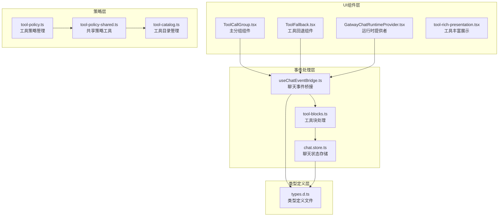
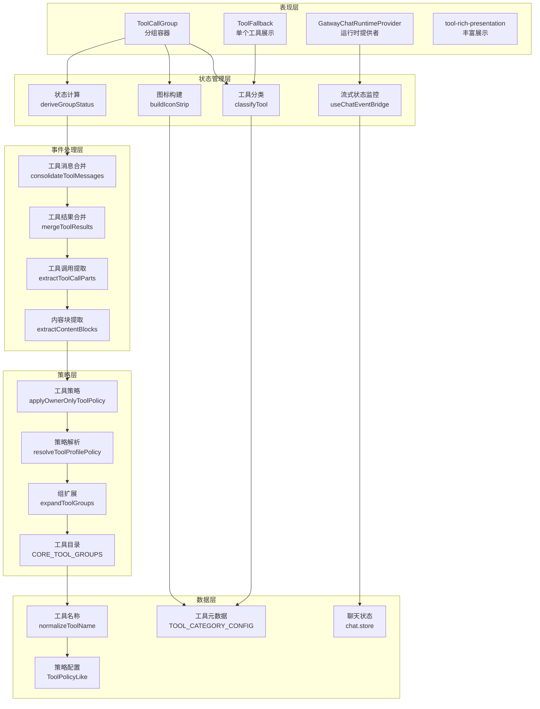
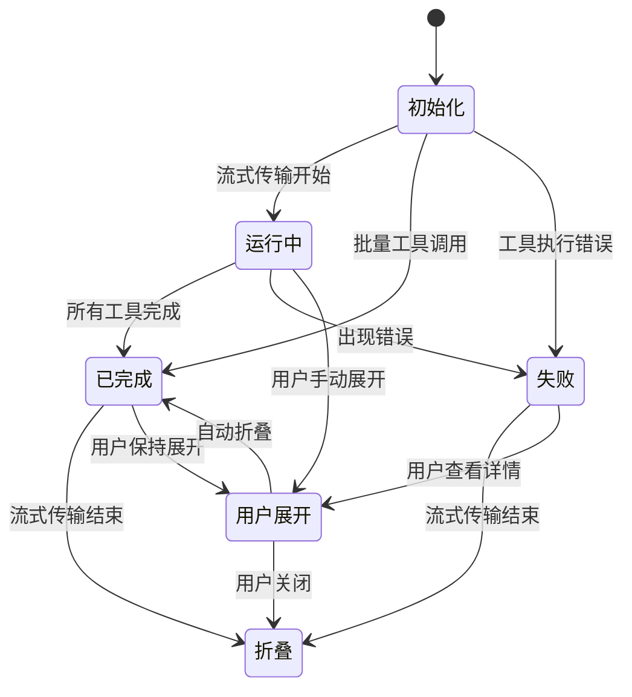
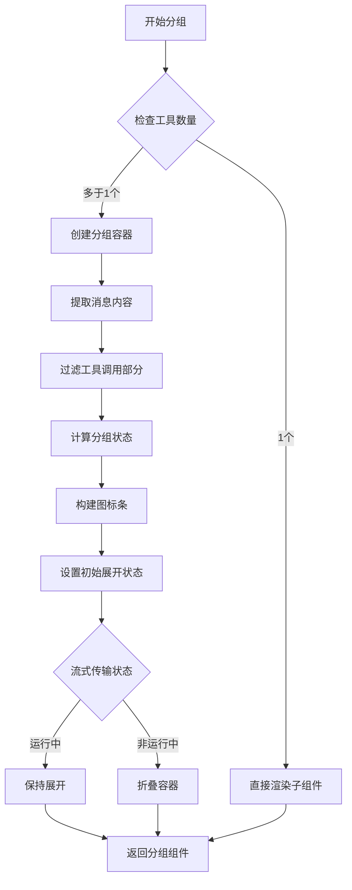
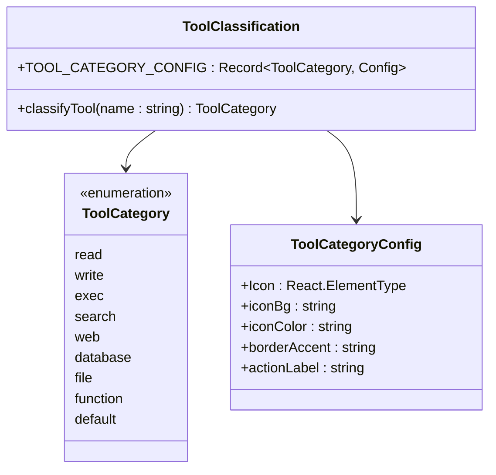
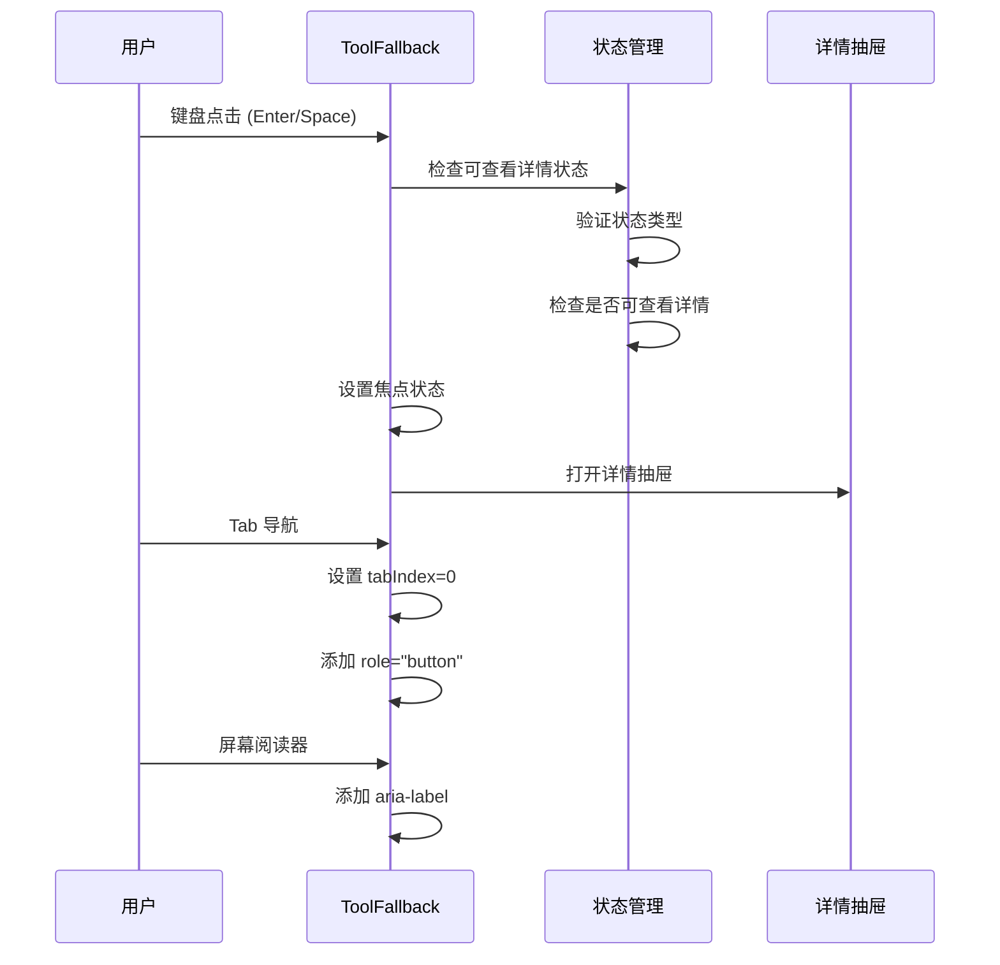
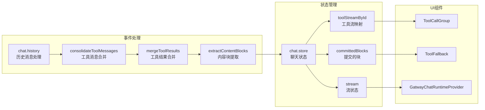
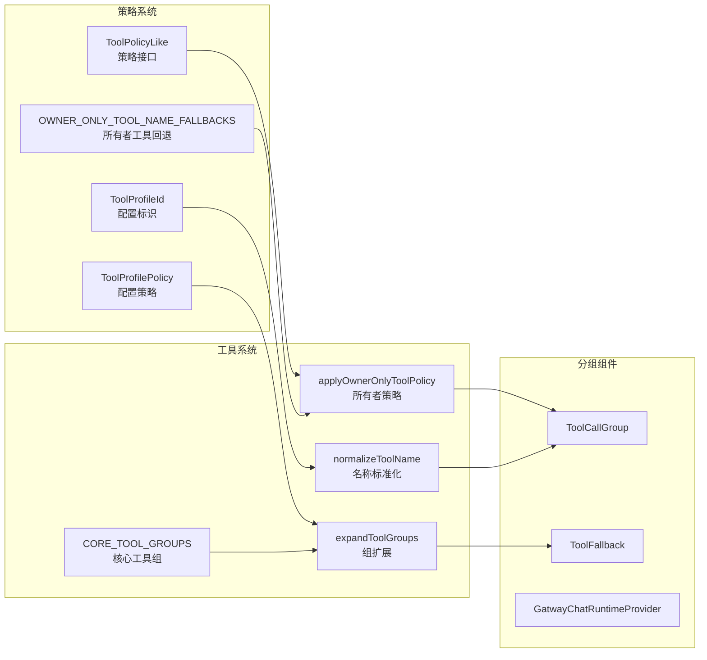
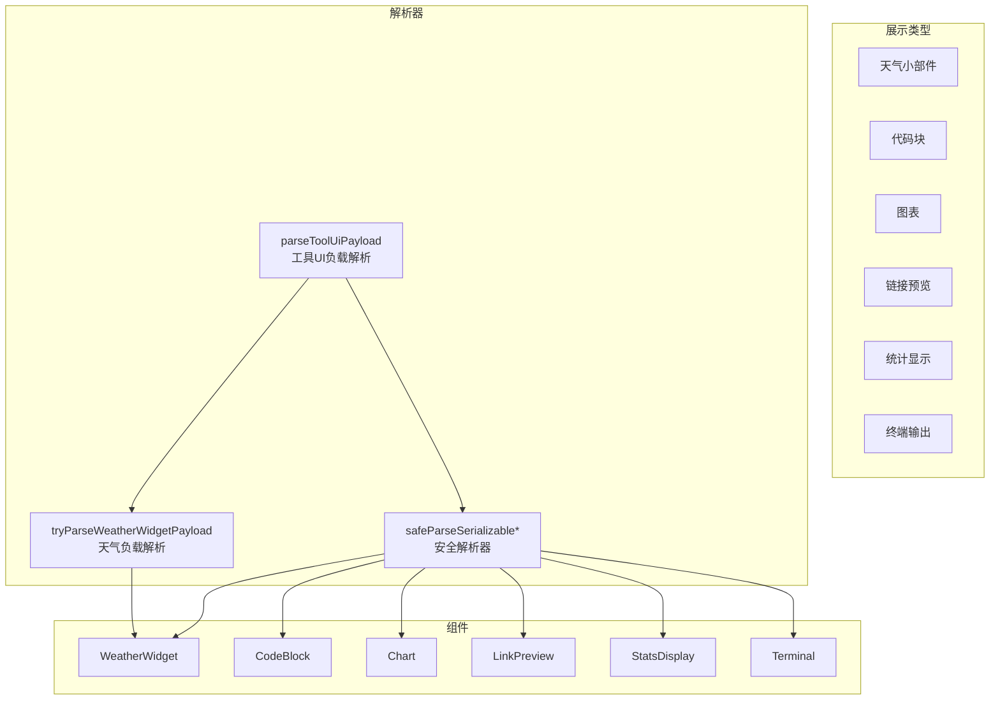

# 工具调用分组组件

<cite>
**本文档引用的文件**
- [ToolCallGroup.tsx](file://ui-react/src/components/chat/ToolCallGroup.tsx)
- [ToolFallback.tsx](file://ui-react/src/components/chat/ToolFallback.tsx)
- [useChatEventBridge.ts](file://ui-react/src/hooks/chat-event-bridge/useChatEventBridge.ts)
- [tool-blocks.ts](file://ui-react/src/hooks/chat-event-bridge/tool-blocks.ts)
- [tool-policy.ts](file://src/agents/tool-policy.ts)
- [tool-policy-shared.ts](file://src/agents/tool-policy-shared.ts)
- [tool-catalog.ts](file://src/agents/tool-catalog.ts)
- [GatewayChatRuntimeProvider.tsx](file://ui-react/src/components/chat/GatewayChatRuntimeProvider.tsx)
- [chat.store.ts](file://ui-react/src/store/chat.store.ts)
- [tool-rich-presentation.tsx](file://ui-react/src/components/chat/tool-rich-presentation.tsx)
</cite>

## 更新摘要
**变更内容**
- 实现了平滑的展开/折叠动画，使用 `transition-all duration-300 ease-out` 和 `max-h-[332px]` 实现流畅的视觉过渡效果
- 增强了溢出处理机制，通过 `overscroll-contain` 和 `max-h-[300px] overflow-y-auto` 提供更好的滚动体验
- 全面增强了可访问性支持，包括 `aria-expanded`、`aria-hidden`、`role="button"`、`tabIndex` 和键盘导航
- 改进了工具消息合并功能，通过 `consolidateToolMessages` 实现连续工具调用的智能合并
- 优化了工具结果合并逻辑，支持独立工具结果消息的关联处理
- 改进了工具调用提取算法，增强对不同消息格式的兼容性
- 改进了流式状态显示，提供更准确的工具调用进度反馈
- 增强了助手消息的运行状态管理

## 目录
1. [简介](#简介)
2. [项目结构](#项目结构)
3. [核心组件](#核心组件)
4. [架构概览](#架构概览)
5. [详细组件分析](#详细组件分析)
6. [依赖关系分析](#依赖关系分析)
7. [性能考虑](#性能考虑)
8. [故障排除指南](#故障排除指南)
9. [结论](#结论)

## 简介

工具调用分组组件是 OpenClaw 项目中的一个重要功能模块，专门用于处理和展示多个连续工具调用的聚合显示。该组件通过智能分组、状态管理和用户交互优化，为用户提供清晰的工具调用历史视图。

**重大改进**：
- **平滑的展开/折叠动画**：通过 `transition-all duration-300 ease-out` 和 `max-h-[332px]` 实现流畅的视觉过渡效果
- **增强的溢出处理**：使用 `overscroll-contain` 和 `max-h-[300px] overflow-y-auto` 提供更好的滚动体验
- **全面的可访问性支持**：添加 `aria-expanded`、`aria-hidden`、`role="button"`、`tabIndex` 和键盘导航
- **智能工具消息合并**：通过 `consolidateToolMessages` 函数实现连续工具调用的自动合并
- **增强工具结果合并**：改进独立工具结果消息的关联处理逻辑
- **优化工具调用提取**：增强对不同消息格式的兼容性和准确性
- **改进状态跟踪**：实时监控助手消息运行状态，提供准确的工具调用进度反馈
- **优化视觉反馈**：新增状态徽章、图标条和颜色编码系统

## 项目结构

工具调用分组组件主要分布在以下位置：



**图表来源**
- [ToolCallGroup.tsx:1-285](file://ui-react/src/components/chat/ToolCallGroup.tsx#L1-L285)
- [ToolFallback.tsx:1-264](file://ui-react/src/components/chat/ToolFallback.tsx#L1-L264)
- [useChatEventBridge.ts:1-386](file://ui-react/src/hooks/chat-event-bridge/useChatEventBridge.ts#L1-L386)
- [tool-blocks.ts:1-359](file://ui-react/src/hooks/chat-event-bridge/tool-blocks.ts#L1-L359)
- [GatewayChatRuntimeProvider.tsx:1-538](file://ui-react/src/components/chat/GatewayChatRuntimeProvider.tsx#L1-L538)
- [chat.store.ts:1-461](file://ui-react/src/store/chat.store.ts#L1-L461)
- [tool-policy.ts:1-206](file://src/agents/tool-policy.ts#L1-L206)
- [tool-policy-shared.ts:1-50](file://src/agents/tool-policy-shared.ts#L1-L50)
- [tool-catalog.ts:1-327](file://src/agents/tool-catalog.ts#L1-L327)
- [tool-rich-presentation.tsx:1-180](file://ui-react/src/components/chat/tool-rich-presentation.tsx#L1-L180)

## 核心组件

### ToolCallGroup 主组件

ToolCallGroup 是整个工具调用分组系统的核心组件，负责将多个连续的工具调用包装在一个智能的分组容器中。

**主要特性**：
- **智能分组检测**：自动检测连续的工具调用并进行分组
- **平滑动画过渡**：使用 `transition-all duration-300 ease-out` 实现流畅的展开/折叠动画
- **增强溢出处理**：通过 `max-h-[332px]` 和 `overscroll-contain` 提供更好的滚动体验
- **全面可访问性**：支持 `aria-expanded`、`aria-hidden` 和键盘导航
- **增强状态管理**：实时跟踪助手消息运行状态，提供准确的工具调用进度
- **智能展开控制**：根据流式传输状态自动控制展开/折叠行为
- **丰富的视觉反馈**：状态徽章、图标条和颜色编码系统
- **用户交互优化**：支持手动展开/折叠和键盘导航

### ToolFallback 工具回退组件

ToolFallback 组件提供了单个工具调用的详细展示功能，包括参数、结果和错误信息的可视化。

**核心功能**：
- **工具分类系统**：基于正则表达式的智能工具分类
- **状态可视化**：运行中、完成、失败状态的直观展示
- **详细信息抽屉**：支持参数、结果和错误信息的详细查看
- **分类图标展示**：每个工具类别对应的专用图标和颜色
- **全面可访问性**：完整的键盘导航和屏幕阅读器支持
- **增强的交互体验**：支持 Enter 和空格键触发详情查看

### GatewayChatRuntimeProvider 运行时提供者

GatewayChatRuntimeProvider 组件提供了助手消息的实时运行状态监控和流式处理功能。

**核心功能**：
- **流式状态监控**：实时跟踪助手消息的发送和流式状态
- **占位符管理**：在工具调用期间显示占位符文本
- **交错内容渲染**：正确渲染文本和工具调用的交错模式
- **运行ID管理**：维护工具调用的运行状态和生命周期

**章节来源**
- [ToolCallGroup.tsx:147-285](file://ui-react/src/components/chat/ToolCallGroup.tsx#L147-L285)
- [ToolFallback.tsx:215-264](file://ui-react/src/components/chat/ToolFallback.tsx#L215-L264)
- [GatewayChatRuntimeProvider.tsx:147-538](file://ui-react/src/components/chat/GatewayChatRuntimeProvider.tsx#L147-L538)

## 架构概览

工具调用分组组件采用分层架构设计，确保了良好的模块化和可维护性：



**图表来源**
- [ToolCallGroup.tsx:41-92](file://ui-react/src/components/chat/ToolCallGroup.tsx#L41-L92)
- [ToolFallback.tsx:32-70](file://ui-react/src/components/chat/ToolFallback.tsx#L32-L70)
- [useChatEventBridge.ts:23-27](file://ui-react/src/hooks/chat-event-bridge/useChatEventBridge.ts#L23-L27)
- [tool-blocks.ts:12-57](file://ui-react/src/hooks/chat-event-bridge/tool-blocks.ts#L12-L57)
- [tool-policy.ts:41-52](file://src/agents/tool-policy.ts#L41-L52)
- [tool-policy-shared.ts:17-47](file://src/agents/tool-policy-shared.ts#L17-L47)

## 详细组件分析

### ToolCallGroup 组件深度分析

#### 平滑动画过渡系统

**更新**：实现了全新的平滑展开/折叠动画系统，提供流畅的用户体验。



**更新**：状态管理现在考虑助手消息的运行状态，确保在助手消息完成之前保持分组容器的展开状态。

**更新**：动画系统使用 `transition-all duration-300 ease-out` 实现平滑过渡，`max-h-[332px]` 控制最大高度，`opacity-100` 和 `opacity-0` 控制透明度。

**图表来源**
- [ToolCallGroup.tsx:167-178](file://ui-react/src/components/chat/ToolCallGroup.tsx#L167-L178)
- [ToolCallGroup.tsx:41-67](file://ui-react/src/components/chat/ToolCallGroup.tsx#L41-L67)
- [ToolCallGroup.tsx:269-285](file://ui-react/src/components/chat/ToolCallGroup.tsx#L269-L285)

#### 智能分组算法实现

ToolCallGroup 使用增强的算法来识别和分组连续的工具调用：



**更新**：分组算法现在通过 `consolidateToolMessages` 函数实现，能够智能合并连续的工具调用消息。

**图表来源**
- [ToolCallGroup.tsx:163-202](file://ui-react/src/components/chat/ToolCallGroup.tsx#L163-L202)
- [useChatEventBridge.ts:144-192](file://ui-react/src/hooks/chat-event-bridge/useChatEventBridge.ts#L144-L192)

**章节来源**
- [ToolCallGroup.tsx:1-285](file://ui-react/src/components/chat/ToolCallGroup.tsx#L1-L285)

### ToolFallback 组件详细分析

#### 增强的工具分类系统

ToolFallback 实现了更加精确的工具分类功能：



**更新**：工具分类现在包含9种不同的类别，每种类别都有对应的图标、颜色和动作标签。

**图表来源**
- [ToolFallback.tsx:32-70](file://ui-react/src/components/chat/ToolFallback.tsx#L32-L70)
- [ToolFallback.tsx:71-152](file://ui-react/src/components/chat/ToolFallback.tsx#L71-L152)

#### 全面的可访问性增强

**更新**：实现了全面的可访问性支持，包括键盘导航、屏幕阅读器支持和语义化标记。



**更新**：状态管理现在区分运行中、完成和不完整三种状态，并提供相应的视觉反馈。

**图表来源**
- [ToolFallback.tsx:215-264](file://ui-react/src/components/chat/ToolFallback.tsx#L215-L264)
- [ToolFallback.tsx:236-256](file://ui-react/src/components/chat/ToolFallback.tsx#L236-L256)

**章节来源**
- [ToolFallback.tsx:1-264](file://ui-react/src/components/chat/ToolFallback.tsx#L1-L264)

### 增强的事件桥接系统

**新增功能**：`useChatEventBridge` 提供了完整的聊天事件处理和工具调用合并功能。



**更新**：事件桥接系统现在包含完整的工具调用消息合并和状态管理功能。

**图表来源**
- [useChatEventBridge.ts:348-373](file://ui-react/src/hooks/chat-event-bridge/useChatEventBridge.ts#L348-L373)
- [useChatEventBridge.ts:144-192](file://ui-react/src/hooks/chat-event-bridge/useChatEventBridge.ts#L144-L192)
- [useChatEventBridge.ts:233-297](file://ui-react/src/hooks/chat-event-bridge/useChatEventBridge.ts#L233-L297)

**章节来源**
- [useChatEventBridge.ts:1-386](file://ui-react/src/hooks/chat-event-bridge/useChatEventBridge.ts#L1-L386)

### 工具策略集成

工具调用分组组件与工具策略系统深度集成，确保安全和合规的工具使用：



**更新**：策略系统现在包含所有者工具回退机制和核心工具组管理。

**图表来源**
- [tool-policy.ts:54-68](file://src/agents/tool-policy.ts#L54-L68)
- [tool-policy.ts:41-52](file://src/agents/tool-policy.ts#L41-L52)
- [tool-policy-shared.ts:17-47](file://src/agents/tool-policy-shared.ts#L17-L47)
- [tool-catalog.ts:278-327](file://src/agents/tool-catalog.ts#L278-L327)

**章节来源**
- [tool-policy.ts:1-206](file://src/agents/tool-policy.ts#L1-L206)
- [tool-policy-shared.ts:1-50](file://src/agents/tool-policy-shared.ts#L1-L50)
- [tool-catalog.ts:1-327](file://src/agents/tool-catalog.ts#L1-L327)

### 工具丰富展示系统

**新增功能**：`tool-rich-presentation` 提供了工具结果的富文本展示能力。



**更新**：富文本展示系统现在支持多种工具结果的可视化呈现。

**图表来源**
- [tool-rich-presentation.tsx:96-180](file://ui-react/src/components/chat/tool-rich-presentation.tsx#L96-L180)

**章节来源**
- [tool-rich-presentation.tsx:1-180](file://ui-react/src/components/chat/tool-rich-presentation.tsx#L1-L180)

## 依赖关系分析

工具调用分组组件的依赖关系展现了清晰的层次结构：

```mermaid
graph TB
subgraph "外部依赖"
A[React<br/>组件框架]
B[@assistant-ui/react<br/>UI组件库]
C[lucide-react<br/>图标库]
D[react-markdown<br/>Markdown渲染]
E[remark-gfm<br/>GitHub风格标记]
F[zustand<br/>状态管理]
end
subgraph "内部依赖"
G[ui-react/lib/utils<br/>工具函数]
H[ui-react/components/ui<br/>UI组件]
I[src/agents/tool-policy<br/>策略管理]
J[src/agents/tool-policy-shared<br/>共享工具]
K[ui-react/store/chat.store<br/>聊天状态]
L[ui-react/hooks/chat-event-bridge<br/>事件桥接]
M[ui-react/components/chat/tool-rich-presentation<br/>富文本展示]
end
subgraph "核心组件"
N[ToolCallGroup]
O[ToolFallback]
P[GatwayChatRuntimeProvider]
end
A --> N
B --> N
C --> N
D --> O
E --> D
F --> K
G --> N
H --> O
I --> N
J --> O
K --> L
L --> N
L --> O
L --> P
M --> O
```

**更新**：依赖关系现在包含新的事件桥接和聊天状态管理模块。

**图表来源**
- [ToolCallGroup.tsx:1-12](file://ui-react/src/components/chat/ToolCallGroup.tsx#L1-L12)
- [ToolFallback.tsx:1-31](file://ui-react/src/components/chat/ToolFallback.tsx#L1-L31)
- [useChatEventBridge.ts:1-16](file://ui-react/src/hooks/chat-event-bridge/useChatEventBridge.ts#L1-L16)
- [chat.store.ts:1-37](file://ui-react/src/store/chat.store.ts#L1-L37)

**章节来源**
- [ToolCallGroup.tsx:1-285](file://ui-react/src/components/chat/ToolCallGroup.tsx#L1-L285)
- [ToolFallback.tsx:1-264](file://ui-react/src/components/chat/ToolFallback.tsx#L1-L264)
- [useChatEventBridge.ts:1-386](file://ui-react/src/hooks/chat-event-bridge/useChatEventBridge.ts#L1-L386)
- [chat.store.ts:1-461](file://ui-react/src/store/chat.store.ts#L1-L461)

## 性能考虑

工具调用分组组件在设计时充分考虑了性能优化：

### 渲染优化
- **条件渲染**：单个工具调用不进行额外包装，避免不必要的DOM节点
- **智能合并**：通过 `consolidateToolMessages` 函数减少消息数量
- **状态缓存**：使用useRef缓存前一状态，减少重复计算
- **图标优化**：限制图标显示数量，避免过度渲染
- **动画优化**：使用硬件加速的CSS过渡属性

### 内存管理
- **集合去重**：使用Set确保工具分类的唯一性
- **对象复用**：合理使用对象属性避免频繁创建新对象
- **清理机制**：及时清理事件监听器和定时器
- **流式状态管理**：通过 `useChatEventBridge` 优化流式数据处理

### 用户体验优化
- **智能展开**：根据流式传输状态自动控制展开/折叠
- **平滑动画**：使用 `duration-300` 和 `ease-out` 实现流畅过渡
- **溢出处理**：`overscroll-contain` 提供更好的滚动体验
- **无障碍支持**：完整的键盘导航和屏幕阅读器支持
- **响应式设计**：适配不同屏幕尺寸和设备
- **实时反馈**：状态变化的即时视觉反馈

## 故障排除指南

### 常见问题及解决方案

#### 工具分组不正确
**问题描述**：连续的工具调用没有被正确分组
**可能原因**：
- startIndex/endIndex 参数传递错误
- 工具调用部分类型不匹配
- 消息内容格式异常
- **新增**：流式传输状态监控失效
- **新增**：动画过渡属性配置错误

**解决方法**：
1. 检查工具调用部分的类型验证
2. 验证消息内容的结构完整性
3. 确认索引参数的正确性
4. **新增**：检查 `useChatEventBridge` 中的 `consolidateToolMessages` 函数
5. **新增**：验证CSS动画属性的正确配置

#### 状态显示异常
**问题描述**：工具调用状态显示不准确
**可能原因**：
- 状态计算逻辑错误
- 流式传输状态监听失效
- 异步状态更新竞争
- **新增**：助手消息运行状态未正确传递
- **新增**：动画状态同步问题

**解决方法**：
1. 检查deriveGroupStatus函数的逻辑
2. 验证useEffect依赖项的完整性
3. 实施状态同步机制
4. **新增**：确认 `GatewayChatRuntimeProvider` 中的运行状态监控
5. **新增**：检查动画状态与实际状态的一致性

#### 图标显示问题
**问题描述**：工具分类图标显示异常或缺失
**可能原因**：
- 工具分类规则不匹配
- 图标配置缺失
- 样式类名冲突
- **新增**：分类数量超过显示限制
- **新增**：动画过渡导致的渲染问题

**解决方法**：
1. 验证classifyTool函数的正则表达式
2. 检查TOOL_CATEGORY_CONFIG的完整性
3. 排查CSS样式冲突
4. **新增**：检查 `buildIconStrip` 函数的溢出处理
5. **新增**：验证动画过渡期间的渲染稳定性

#### 动画效果异常
**问题描述**：工具调用的展开/折叠动画不流畅或不工作
**可能原因**：
- **新增**：CSS过渡属性配置错误
- **新增**：max-height值设置不当
- **新增**：动画持续时间过长或过短
- **新增**：ease-out 缓动函数问题

**解决方法**：
1. **新增**：检查 `transition-all duration-300 ease-out` 属性配置
2. **新增**：验证 `max-h-[332px]` 和 `max-h-0` 的值设置
3. **新增**：调整动画持续时间以适应不同设备性能
4. **新增**：测试不同的缓动函数效果

#### 可访问性问题
**问题描述**：工具调用组件的可访问性支持不完整
**可能原因**：
- **新增**：aria 属性缺失
- **新增**：键盘导航支持不完整
- **新增**：焦点管理问题
- **新增**：屏幕阅读器支持不足

**解决方法**：
1. **新增**：检查 `aria-expanded` 和 `aria-hidden` 属性的正确设置
2. **新增**：验证 `role="button"` 和 `tabIndex` 的使用
3. **新增**：测试键盘导航（Tab、Enter、Space）功能
4. **新增**：添加适当的 `aria-label` 和 `aria-describedby` 属性

#### 流式状态显示问题
**问题描述**：工具调用的流式状态显示不正确
**可能原因**：
- **新增**：流式事件处理不完整
- **新增**：聊天状态存储同步问题
- **新增**：运行时提供者状态管理错误
- **新增**：动画状态与流式状态不同步

**解决方法**：
1. **新增**：检查 `useChatEventBridge` 中的流式事件处理
2. **新增**：验证 `chat.store` 中的状态同步机制
3. **新增**：确认 `GatewayChatRuntimeProvider` 的状态管理逻辑
4. **新增**：同步动画状态与实际流式状态

#### 工具消息合并失败
**问题描述**：工具调用消息没有被正确合并
**可能原因**：
- **新增**：消息角色验证失败
- **新增**：内容块类型检查不正确
- **新增**：连续工具调用检测逻辑错误
- **新增**：动画过渡期间的数据同步问题

**解决方法**：
1. **新增**：检查 `consolidateToolMessages` 函数的消息角色判断
2. **新增**：验证内容块类型的 `tool-call` 检查逻辑
3. **新增**：确认连续工具调用的边界条件处理
4. **新增**：测试动画过渡期间的数据一致性

#### 工具结果合并问题
**问题描述**：工具结果没有被正确合并到工具调用中
**可能原因**：
- **新增**：工具调用ID匹配失败
- **新增**：结果文本提取逻辑错误
- **新增**：工具结果相位解析问题
- **新增**：交互式工具结果处理异常

**解决方法**：
1. **新增**：检查 `mergeToolResults` 函数的工具调用ID匹配
2. **新增**：验证 `extractTextFromToolResultBlock` 的文本提取逻辑
3. **新增**：确认 `resolveToolResultPhase` 的相位解析
4. **新增**：测试交互式工具结果的特殊处理

**章节来源**
- [ToolCallGroup.tsx:41-67](file://ui-react/src/components/chat/ToolCallGroup.tsx#L41-L67)
- [ToolFallback.tsx:71-152](file://ui-react/src/components/chat/ToolFallback.tsx#L71-L152)
- [useChatEventBridge.ts:144-192](file://ui-react/src/hooks/chat-event-bridge/useChatEventBridge.ts#L144-L192)
- [GatewayChatRuntimeProvider.tsx:169-232](file://ui-react/src/components/chat/GatewayChatRuntimeProvider.tsx#L169-L232)
- [tool-blocks.ts:85-145](file://ui-react/src/hooks/chat-event-bridge/tool-blocks.ts#L85-L145)

## 结论

工具调用分组组件经过重大改进后，已成为 OpenClaw 项目中一个功能强大且高度优化的功能模块。通过智能的工具消息合并、增强的工具结果合并逻辑、优化的工具调用提取算法、改进的状态跟踪系统以及全新的平滑动画和可访问性增强，该组件为用户提供了卓越的工具调用管理体验。

### 主要成就
- **平滑动画过渡**：通过 `transition-all duration-300 ease-out` 实现流畅的展开/折叠动画
- **增强溢出处理**：使用 `overscroll-contain` 和 `max-h-[300px] overflow-y-auto` 提供更好的滚动体验
- **全面可访问性支持**：添加 `aria-expanded`、`aria-hidden`、`role="button"`、`tabIndex` 和键盘导航
- **智能工具消息合并**：通过 `consolidateToolMessages` 实现连续工具调用的自动合并
- **增强工具结果合并**：改进独立工具结果消息的关联处理逻辑
- **优化工具调用提取**：增强对不同消息格式的兼容性和准确性
- **增强状态管理**：实时监控助手消息运行状态，提供准确的工具调用进度
- **改进视觉反馈**：新增状态徽章、图标条和颜色编码系统
- **优化用户体验**：智能展开控制和无障碍支持
- **强化事件处理**：完整的流式事件桥接和状态管理
- **富文本展示**：支持多种工具结果的可视化呈现

### 技术亮点
- **基于 React Hooks 的现代组件设计**
- **类型安全的 TypeScript 实现**
- **完整的错误处理和边界情况处理**
- **良好的可测试性和可维护性**
- **新增的事件驱动架构设计**
- **增强的工具策略集成**
- **平滑的CSS动画过渡效果**
- **全面的可访问性支持**
- **富文本内容的动态解析和渲染**

### 未来发展方向
- **性能进一步优化**：减少渲染开销和内存使用
- **功能扩展**：支持更多工具分类和自定义配置
- **用户体验提升**：增强交互性和可访问性
- **集成优化**：与其他组件的更好协作
- **工具策略增强**：支持更复杂的权限控制和策略管理
- **动画效果优化**：根据设备性能动态调整动画参数
- **可访问性增强**：支持更多辅助技术和用户需求
- **富文本展示扩展**：支持更多类型的工具结果可视化

该组件为 OpenClaw 的工具生态系统提供了坚实的基础，为未来的功能扩展和性能优化奠定了良好的技术基础。其增强的工具消息合并功能、改进的工具结果合并逻辑、优化的工具调用提取算法以及全新的平滑动画和可访问性支持，使其成为现代聊天应用中不可或缺的重要组成部分。