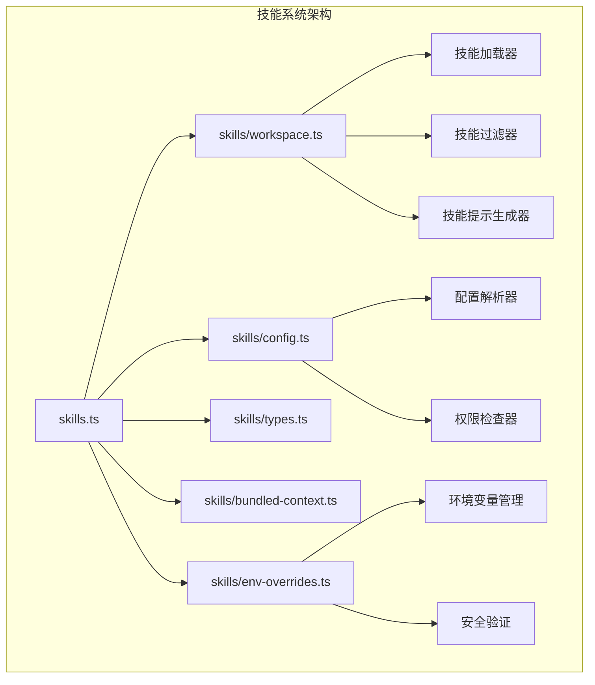
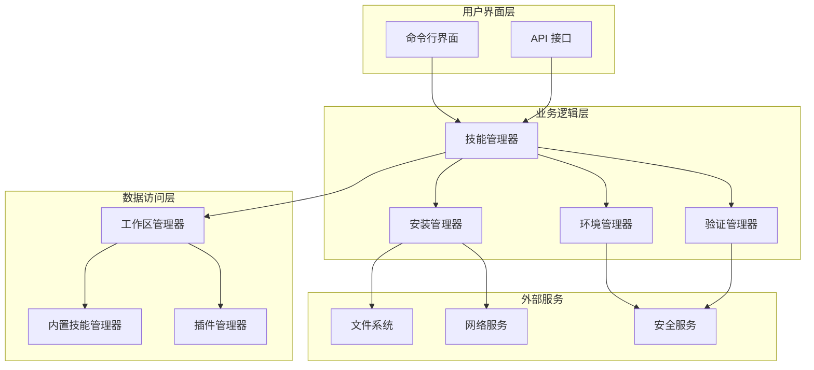
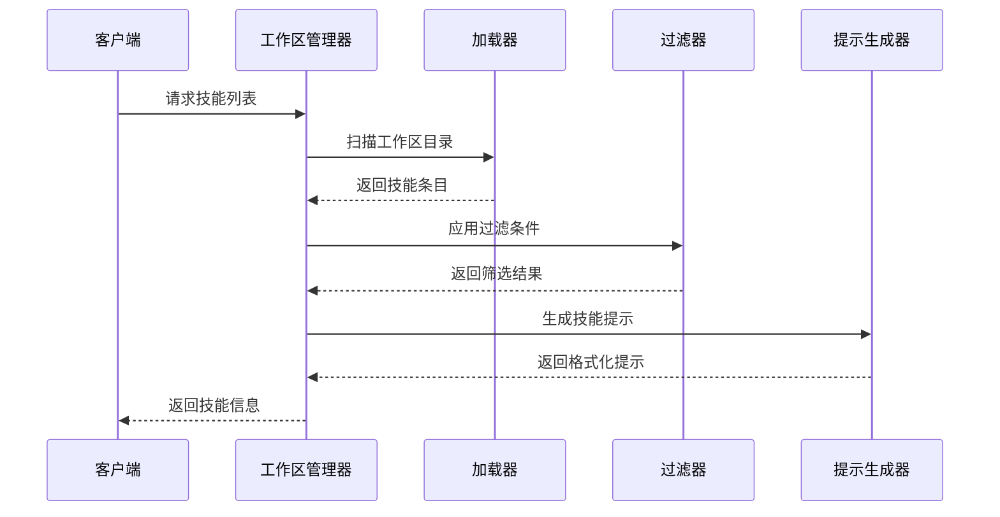
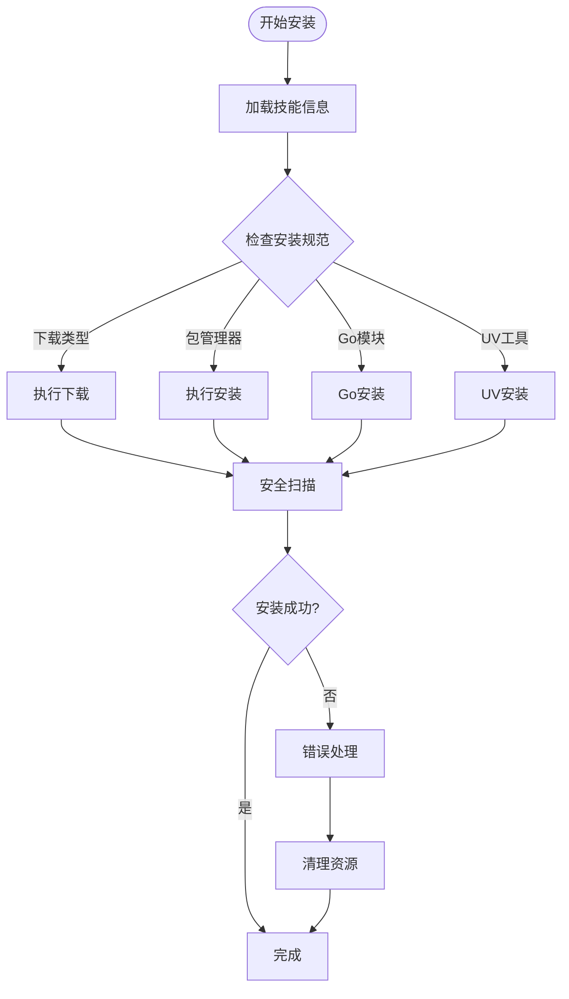
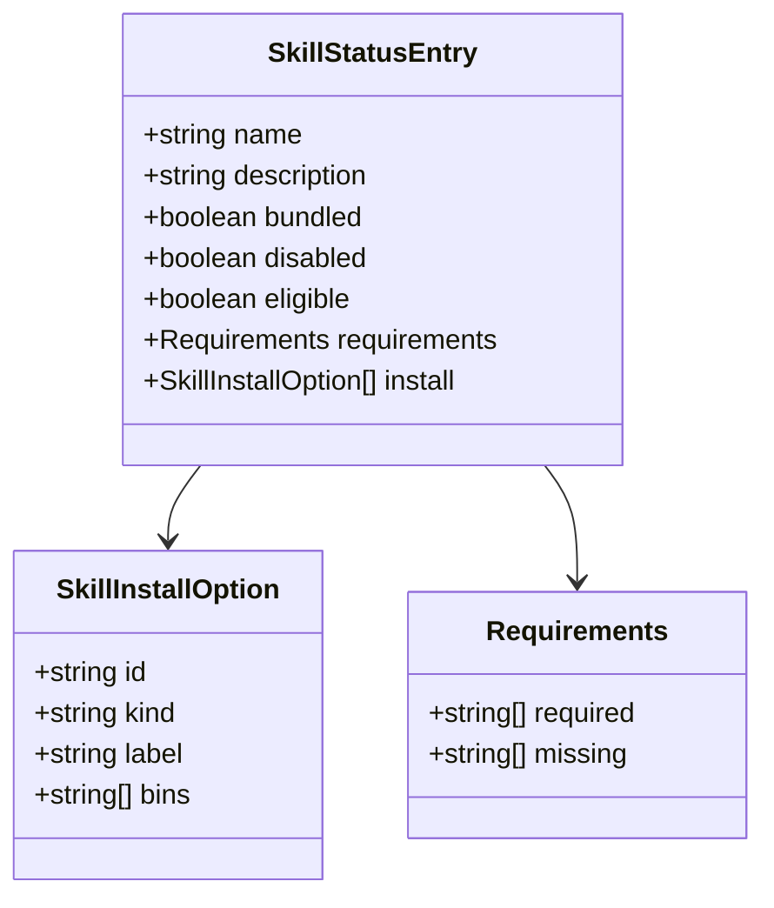
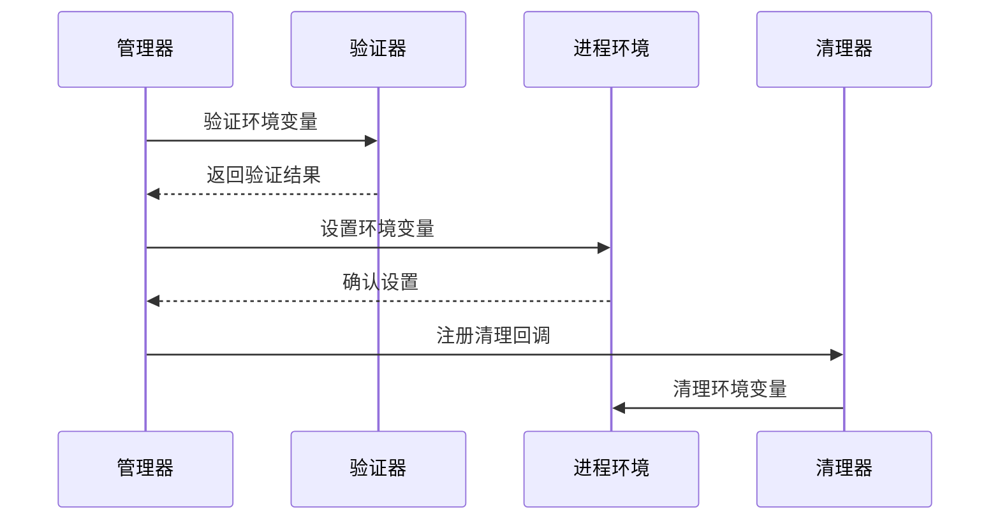
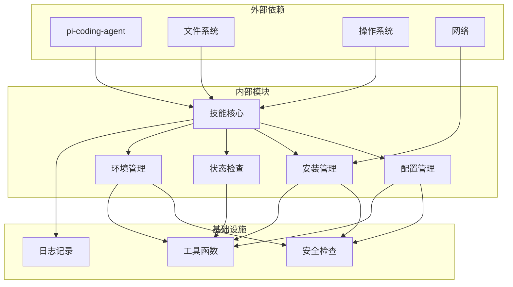

# 技能分组工具

<cite>
**本文档引用的文件**
- [README.md](file://README.md)
- [skills.ts](file://src/agents/skills.ts)
- [skills-install.ts](file://src/agents/skills-install.ts)
- [skills-status.ts](file://src/agents/skills-status.ts)
- [workspace.ts](file://src/agents/skills/workspace.ts)
- [config.ts](file://src/agents/skills/config.ts)
- [types.ts](file://src/agents/skills/types.ts)
- [bundled-context.ts](file://src/agents/skills/bundled-context.ts)
- [env-overrides.ts](file://src/agents/skills/env-overrides.ts)
</cite>

## 目录

1. [简介](#简介)
2. [项目结构](#项目结构)
3. [核心组件](#核心组件)
4. [架构概览](#架构概览)
5. [详细组件分析](#详细组件分析)
6. [依赖关系分析](#依赖关系分析)
7. [性能考虑](#性能考虑)
8. [故障排除指南](#故障排除指南)
9. [结论](#结论)

## 简介

OpenClaw 是一个个人 AI 助手平台，技能分组工具是其核心功能之一。该工具允许用户管理和组织各种技能（skills），这些技能可以是浏览器控制、Canvas 操作、节点管理、定时任务等不同类型的工具。

技能分组工具提供了以下主要功能：

- 技能发现和加载
- 技能状态检查和验证
- 技能安装和管理
- 技能权限和环境变量管理
- 技能过滤和选择

## 项目结构

OpenClaw 项目采用模块化架构，技能分组工具位于 `src/agents/skills/` 目录下，包含多个子模块：

**图表来源**

- [skills.ts:1-47](file://src/agents/skills.ts#L1-L47)
- [workspace.ts:1-800](file://src/agents/skills/workspace.ts#L1-L800)

**章节来源**

- [README.md:1-560](file://README.md#L1-L560)

## 核心组件

技能分组工具由以下核心组件构成：

### 1. 技能入口模块

主入口模块导出所有技能相关的功能，包括配置解析、环境变量管理、工作区操作等。

### 2. 技能工作区管理

负责技能的加载、过滤、提示生成和同步功能。

### 3. 技能配置管理

处理技能的配置解析、权限检查和运行时环境评估。

### 4. 技能安装管理

提供技能安装、更新和卸载功能，支持多种安装方式。

### 5. 环境变量管理

安全地管理技能所需的环境变量，防止敏感信息泄露。

**章节来源**

- [skills.ts:1-47](file://src/agents/skills.ts#L1-L47)
- [types.ts:1-90](file://src/agents/skills/types.ts#L1-L90)

## 架构概览

技能分组工具采用分层架构设计，确保功能模块之间的清晰分离：

**图表来源**

- [workspace.ts:292-527](file://src/agents/skills/workspace.ts#L292-L527)
- [skills-install.ts:392-471](file://src/agents/skills-install.ts#L392-L471)

## 详细组件分析

### 技能工作区管理器

技能工作区管理器是整个技能系统的核心，负责处理技能的完整生命周期：

#### 主要功能

- **技能发现**: 自动扫描工作区目录，识别有效的技能
- **技能加载**: 解析技能元数据和配置
- **技能过滤**: 基于条件筛选可用的技能
- **提示生成**: 创建适合模型使用的技能描述
- **技能同步**: 在不同工作区之间同步技能

#### 关键流程

**图表来源**

- [workspace.ts:603-638](file://src/agents/skills/workspace.ts#L603-L638)

#### 性能优化策略

- **限制扫描范围**: 通过配置参数限制扫描的技能数量
- **缓存机制**: 缓存已解析的技能元数据
- **增量更新**: 只更新发生变化的技能

**章节来源**

- [workspace.ts:292-527](file://src/agents/skills/workspace.ts#L292-L527)

### 技能安装管理器

安装管理器提供完整的技能安装功能，支持多种安装方式：

#### 支持的安装方式

- **Homebrew**: macOS/Linux 包管理器
- **Node.js**: npm、yarn、pnpm、bun
- **Go**: Go 模块安装
- **UV**: Python 工具安装
- **下载**: 直接下载二进制文件

#### 安装流程

**图表来源**

- [skills-install.ts:392-471](file://src/agents/skills-install.ts#L392-L471)

**章节来源**

- [skills-install.ts:1-471](file://src/agents/skills-install.ts#L1-L471)

### 技能状态检查器

状态检查器提供全面的技能健康检查功能：

#### 检查内容

- **配置验证**: 检查技能配置的有效性
- **依赖检查**: 验证必需的系统依赖
- **权限验证**: 确认环境变量和配置路径
- **安装选项**: 提供可用的安装建议

#### 状态报告结构

**图表来源**

- [skills-status.ts:30-55](file://src/agents/skills-status.ts#L30-L55)

**章节来源**

- [skills-status.ts:1-254](file://src/agents/skills-status.ts#L1-L254)

### 环境变量管理器

环境变量管理器确保技能安全地使用所需的环境变量：

#### 安全特性

- **敏感变量保护**: 阻止修改关键系统变量
- **值验证**: 验证环境变量值的安全性
- **作用域控制**: 限制环境变量的作用范围
- **自动清理**: 在使用后自动清理临时变量

#### 管理流程

**图表来源**

- [env-overrides.ts:28-71](file://src/agents/skills/env-overrides.ts#L28-L71)

**章节来源**

- [env-overrides.ts:1-263](file://src/agents/skills/env-overrides.ts#L1-L263)

## 依赖关系分析

技能分组工具的依赖关系呈现清晰的层次结构：

**图表来源**

- [workspace.ts:1-35](file://src/agents/skills/workspace.ts#L1-L35)
- [config.ts:1-12](file://src/agents/skills/config.ts#L1-L12)

**章节来源**

- [types.ts:1-90](file://src/agents/skills/types.ts#L1-L90)

## 性能考虑

技能分组工具在设计时充分考虑了性能优化：

### 内存管理

- **懒加载**: 技能按需加载，避免一次性加载所有技能
- **缓存策略**: 使用内存缓存减少重复计算
- **垃圾回收**: 及时清理不再使用的技能实例

### I/O 优化

- **批量操作**: 合并多个文件操作请求
- **异步处理**: 使用异步 I/O 减少阻塞
- **路径缓存**: 缓存文件系统路径解析结果

### 并发处理

- **并发扫描**: 并行扫描多个技能目录
- **锁机制**: 使用文件锁避免竞态条件
- **超时控制**: 为长时间操作设置超时限制

## 故障排除指南

### 常见问题及解决方案

#### 技能加载失败

**症状**: 技能无法被识别或加载
**原因**:

- 技能文件格式不正确
- 权限不足访问技能文件
- 路径解析错误

**解决方法**:

1. 检查技能文件是否符合规范
2. 验证文件权限设置
3. 使用绝对路径而非相对路径

#### 安装失败

**症状**: 技能安装过程中出现错误
**原因**:

- 网络连接问题
- 权限不足
- 依赖包缺失

**解决方法**:

1. 检查网络连接状态
2. 以管理员权限运行安装
3. 手动安装缺失的依赖

#### 环境变量冲突

**症状**: 技能运行时出现环境变量冲突
**原因**:

- 多个技能使用相同的环境变量
- 敏感变量被意外修改

**解决方法**:

1. 检查技能的环境变量配置
2. 使用唯一的作用域标识符
3. 避免修改系统关键变量

**章节来源**

- [skills-install.ts:195-218](file://src/agents/skills-install.ts#L195-L218)
- [env-overrides.ts:86-90](file://src/agents/skills/env-overrides.ts#L86-L90)

## 结论

技能分组工具是 OpenClaw 平台的重要组成部分，它提供了完整的技能生命周期管理功能。通过模块化的架构设计、完善的安全机制和高效的性能优化，该工具能够满足复杂场景下的技能管理需求。

主要优势包括：

- **灵活性**: 支持多种技能类型和安装方式
- **安全性**: 全面的安全检查和环境隔离
- **可扩展性**: 模块化设计便于功能扩展
- **易用性**: 简洁的 API 和丰富的配置选项

未来的发展方向可能包括：

- 更智能的技能推荐算法
- 增强的技能版本管理
- 更完善的性能监控和分析
- 改进的用户体验和交互设计
