# 技能卡片组件

<cite>
**本文档引用的文件**
- [SkillCard.tsx](file://ui-react/src/components/skills/SkillCard.tsx)
- [SkillStatusBadges.tsx](file://ui-react/src/components/skills/SkillStatusBadges.tsx)
- [SkillsToolbar.tsx](file://ui-react/src/components/skills/SkillsToolbar.tsx)
- [skills-grouping.ts](file://ui-react/src/lib/skills-grouping.ts)
- [skills.store.ts](file://ui-react/src/store/skills.store.ts)
- [skills.ts](file://ui/src/ui/views/skills.ts)
- [card.tsx](file://ui-react/src/components/ui/card.tsx)
- [badge.tsx](file://ui-react/src/components/ui/badge.tsx)
- [button.tsx](file://ui-react/src/components/ui/button.tsx)
- [skills.ts](file://ui/src/ui/controllers/skills.ts)
- [app-render.ts](file://ui/src/ui/app-render.ts)
- [SkillsPage.tsx](file://ui-react/src/pages/SkillsPage.tsx)
- [skills.ts](file://ui/src/ui/views/skills-grouping.ts)
- [skills-shared.ts](file://ui/src/ui/views/skills-shared.ts)
</cite>

## 目录

1. [简介](#简介)
2. [项目结构](#项目结构)
3. [核心组件](#核心组件)
4. [架构概览](#架构概览)
5. [详细组件分析](#详细组件分析)
6. [依赖关系分析](#依赖关系分析)
7. [性能考虑](#性能考虑)
8. [故障排除指南](#故障排除指南)
9. [结论](#结论)

## 简介

技能卡片组件是 OpenClaw 项目中的一个核心 UI 组件，用于展示和管理技能的状态、配置和操作。该组件提供了用户友好的界面来查看技能信息、状态标识、缺失依赖项以及执行各种操作（如启用/禁用技能、安装依赖、保存 API 密钥等）。

该组件采用响应式设计，支持多种平台（Web、移动端、桌面应用），并集成了状态管理、错误处理和用户反馈机制。组件设计遵循现代前端开发最佳实践，使用 TypeScript 进行类型安全编程，并采用组件化架构确保代码的可维护性和可扩展性。

## 项目结构

OpenClaw 项目采用多平台架构，技能卡片组件在不同平台上都有相应的实现：

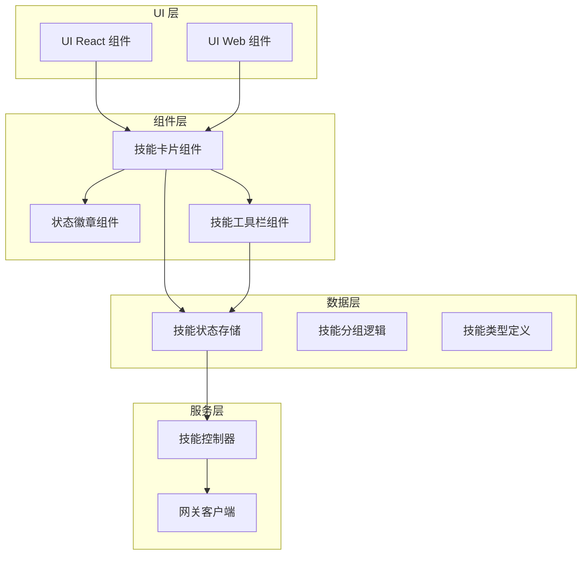

**图表来源**

- [SkillCard.tsx:1-113](file://ui-react/src/components/skills/SkillCard.tsx#L1-L113)
- [SkillsToolbar.tsx:1-45](file://ui-react/src/components/skills/SkillsToolbar.tsx#L1-L45)
- [skills.store.ts:1-213](file://ui-react/src/store/skills.store.ts#L1-L213)

**章节来源**

- [SkillCard.tsx:1-113](file://ui-react/src/components/skills/SkillCard.tsx#L1-L113)
- [SkillsToolbar.tsx:1-45](file://ui-react/src/components/skills/SkillsToolbar.tsx#L1-L45)
- [skills.store.ts:1-213](file://ui-react/src/store/skills.store.ts#L1-L213)

## 核心组件

技能卡片组件系统由多个相互协作的组件构成，每个组件都有特定的职责和功能：

### 主要组件架构

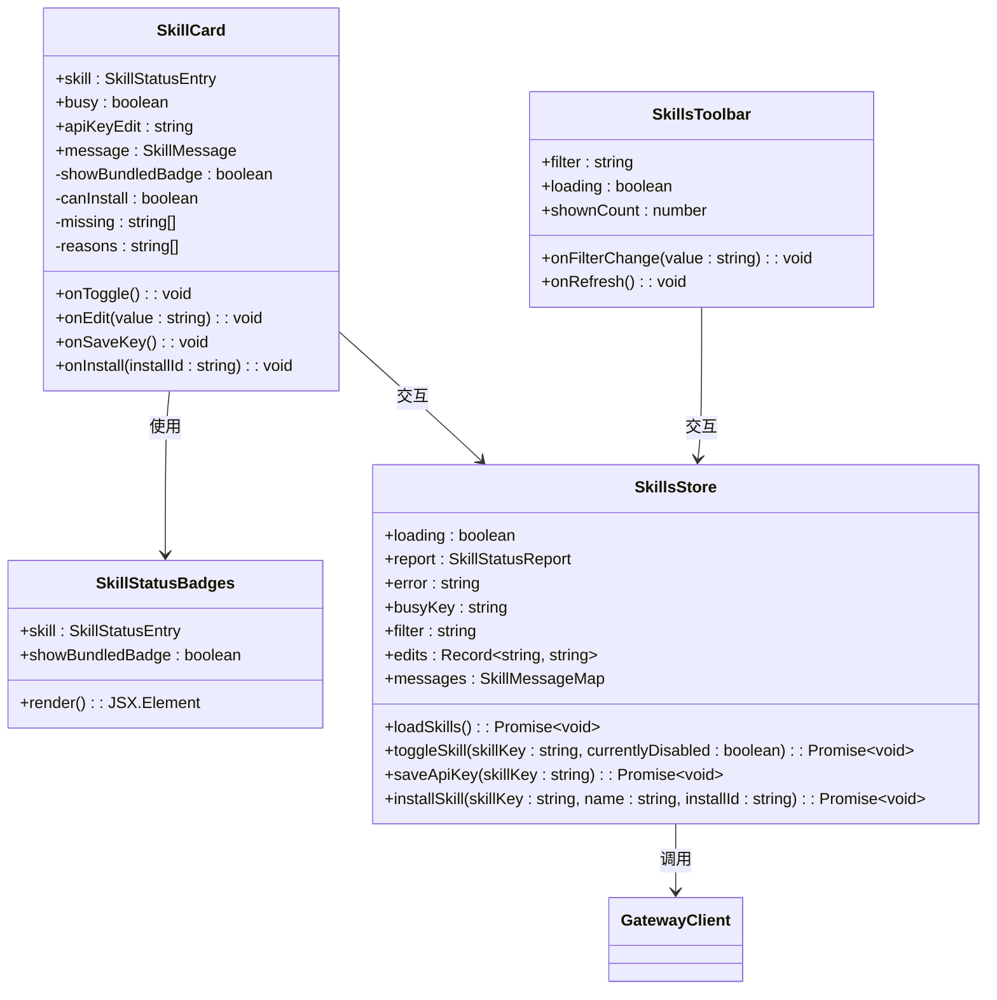

**图表来源**

- [SkillCard.tsx:9-18](file://ui-react/src/components/skills/SkillCard.tsx#L9-L18)
- [SkillStatusBadges.tsx:4-7](file://ui-react/src/components/skills/SkillStatusBadges.tsx#L4-L7)
- [SkillsToolbar.tsx:5-11](file://ui-react/src/components/skills/SkillsToolbar.tsx#L5-L11)
- [skills.store.ts:16-32](file://ui-react/src/store/skills.store.ts#L16-L32)

### 数据模型

技能卡片组件使用以下核心数据结构：

| 类型              | 字段                                           | 描述                 |
| ----------------- | ---------------------------------------------- | -------------------- |
| SkillStatusEntry  | name, description, source                      | 技能基本信息         |
| SkillStatusEntry  | skillKey, filePath, baseDir                    | 技能标识和位置信息   |
| SkillStatusEntry  | bundled, primaryEnv, emoji                     | 技能属性和配置信息   |
| SkillStatusEntry  | always, disabled, blockedByAllowlist, eligible | 技能状态信息         |
| SkillStatusEntry  | requirements, missing                          | 技能依赖要求和缺失项 |
| SkillStatusEntry  | configChecks, install                          | 配置检查和安装选项   |
| SkillStatusReport | workspaceDir, managedSkillsDir, skills         | 技能状态报告         |

**章节来源**

- [skills.ts:13-48](file://ui-react/src/types/skills.ts#L13-L48)

## 架构概览

技能卡片组件采用分层架构设计，确保关注点分离和代码的可维护性：

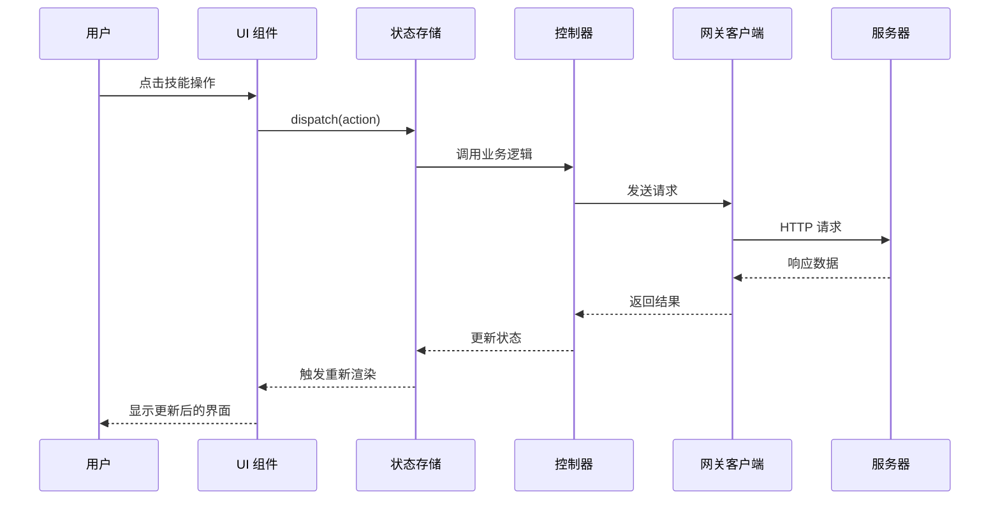

**图表来源**

- [skills.store.ts:80-105](file://ui-react/src/store/skills.store.ts#L80-L105)
- [skills.ts:1-200](file://ui/src/ui/controllers/skills.ts#L1-L200)

### 状态管理流程

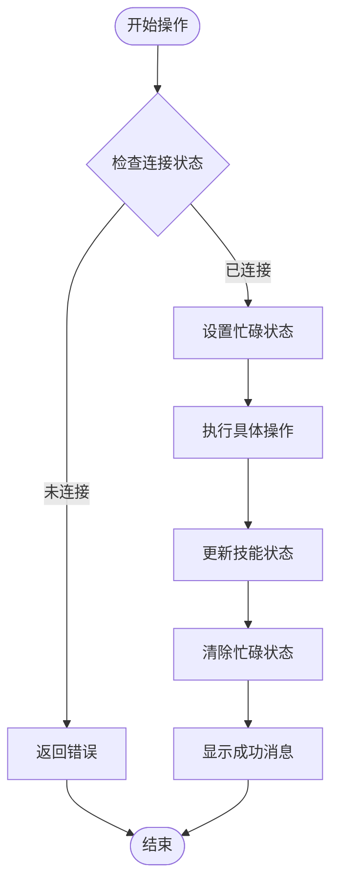

**图表来源**

- [skills.store.ts:111-137](file://ui-react/src/store/skills.store.ts#L111-L137)
- [skills.store.ts:139-165](file://ui-react/src/store/skills.store.ts#L139-L165)

**章节来源**

- [skills.store.ts:71-197](file://ui-react/src/store/skills.store.ts#L71-L197)

## 详细组件分析

### 技能卡片组件 (SkillCard)

技能卡片组件是整个技能管理界面的核心组件，负责展示单个技能的完整信息和提供用户交互功能。

#### 组件结构

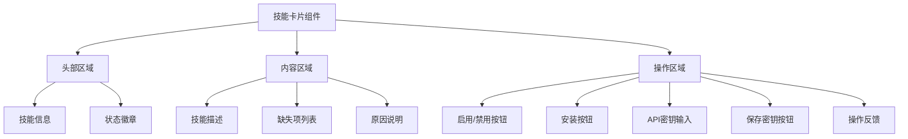

**图表来源**

- [SkillCard.tsx:35-111](file://ui-react/src/components/skills/SkillCard.tsx#L35-L111)

#### 关键功能特性

1. **智能状态显示**: 根据技能的不同状态动态调整显示内容和样式
2. **条件渲染**: 只显示相关的操作按钮和信息
3. **用户反馈**: 提供即时的操作结果反馈
4. **响应式设计**: 适配不同屏幕尺寸和设备类型

#### 状态处理逻辑

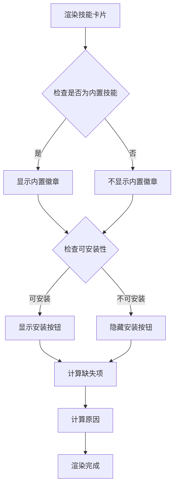

**图表来源**

- [SkillCard.tsx:30-33](file://ui-react/src/components/skills/SkillCard.tsx#L30-L33)

**章节来源**

- [SkillCard.tsx:1-113](file://ui-react/src/components/skills/SkillCard.tsx#L1-L113)

### 状态徽章组件 (SkillStatusBadges)

状态徽章组件专门负责显示技能的各种状态信息，提供直观的状态可视化。

#### 徽章类型

| 徽章类型 | 条件                  | 显示内容     | 样式        |
| -------- | --------------------- | ------------ | ----------- |
| 源徽章   | 总是显示              | skill.source | secondary   |
| 内置徽章 | showBundledBadge=true | bundled      | secondary   |
| 合格徽章 | skill.eligible=true   | eligible     | default     |
| 合格徽章 | skill.eligible=false  | blocked      | outline     |
| 禁用徽章 | skill.disabled=true   | disabled     | destructive |

#### 渲染逻辑

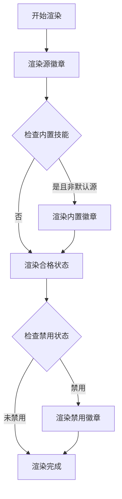

**图表来源**

- [SkillStatusBadges.tsx:9-19](file://ui-react/src/components/skills/SkillStatusBadges.tsx#L9-L19)

**章节来源**

- [SkillStatusBadges.tsx:1-21](file://ui-react/src/components/skills/SkillStatusBadges.tsx#L1-L21)

### 技能工具栏组件 (SkillsToolbar)

技能工具栏组件提供全局的技能管理功能，包括搜索过滤和刷新操作。

#### 工具栏功能

| 功能     | 元素   | 行为                 | 状态               |
| -------- | ------ | -------------------- | ------------------ |
| 搜索过滤 | 输入框 | 实时过滤技能列表     | 支持占位符显示数量 |
| 刷新按钮 | 按钮   | 重新加载技能状态     | 加载时显示旋转动画 |
| 数量显示 | 文本   | 显示当前筛选结果数量 | 条件显示           |

#### 交互流程

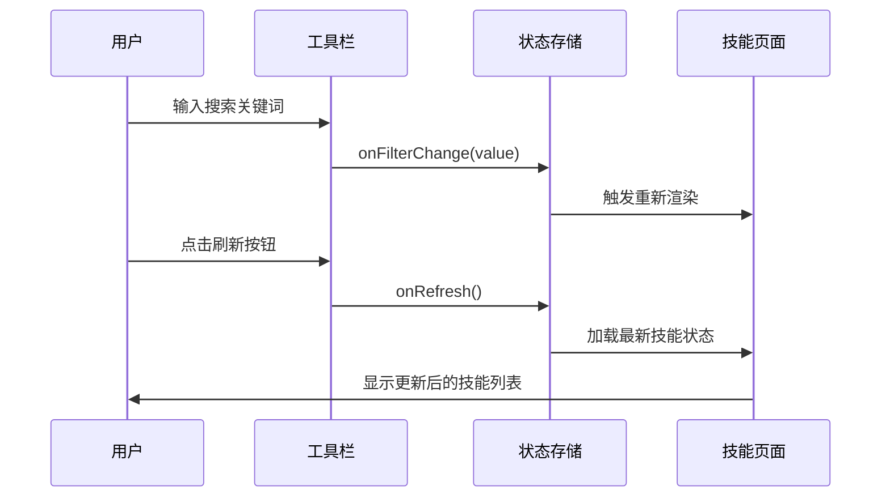

**图表来源**

- [SkillsToolbar.tsx:13-43](file://ui-react/src/components/skills/SkillsToolbar.tsx#L13-L43)

**章节来源**

- [SkillsToolbar.tsx:1-45](file://ui-react/src/components/skills/SkillsToolbar.tsx#L1-L45)

### 状态存储和管理

技能状态存储使用 Zustand 进行状态管理，提供响应式的状态更新和副作用处理。

#### 存储状态结构

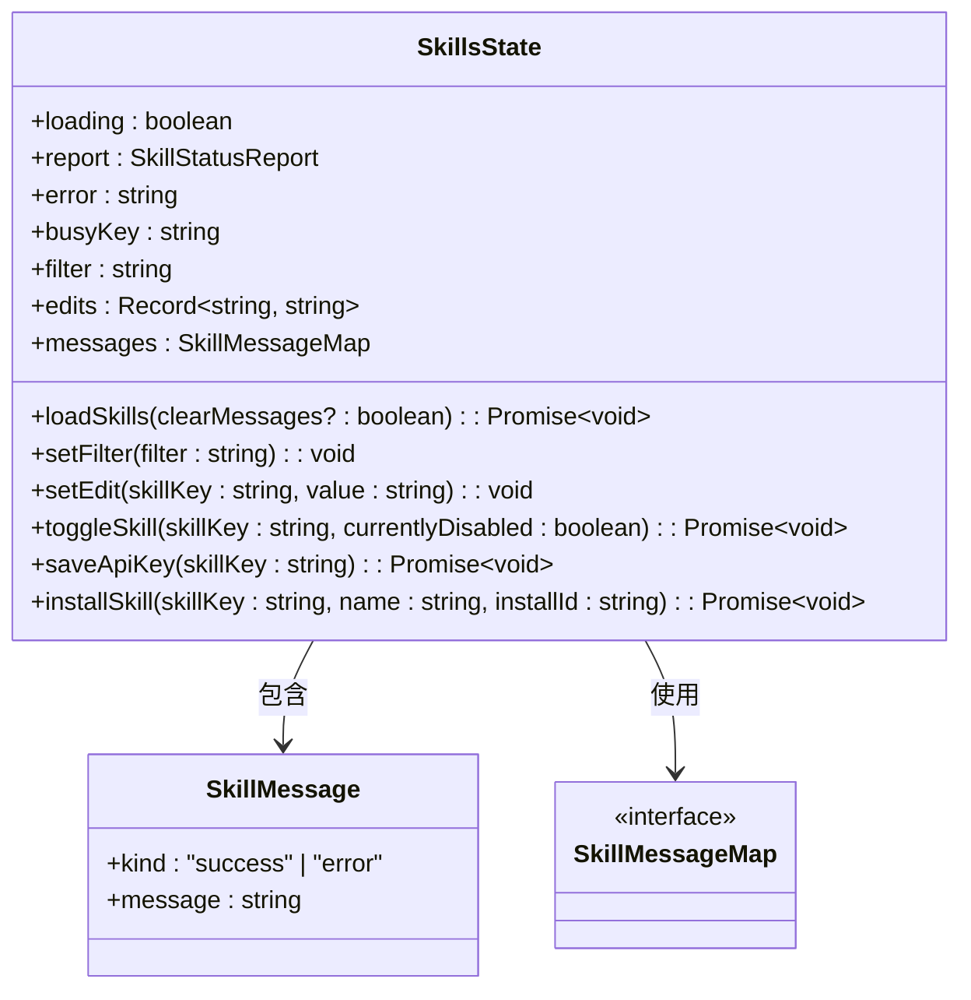

**图表来源**

- [skills.store.ts:16-32](file://ui-react/src/store/skills.store.ts#L16-L32)

#### 异步操作流程

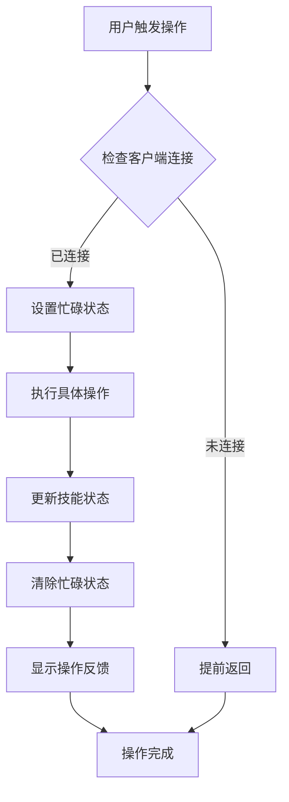

**图表来源**

- [skills.store.ts:111-137](file://ui-react/src/store/skills.store.ts#L111-L137)
- [skills.store.ts:139-165](file://ui-react/src/store/skills.store.ts#L139-L165)

**章节来源**

- [skills.store.ts:1-213](file://ui-react/src/store/skills.store.ts#L1-L213)

## 依赖关系分析

技能卡片组件系统具有清晰的依赖层次结构，确保模块间的松耦合和高内聚。

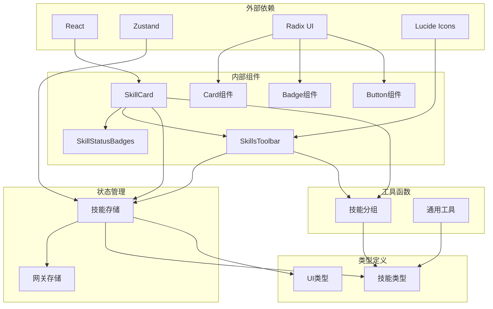

**图表来源**

- [SkillCard.tsx:1-7](file://ui-react/src/components/skills/SkillCard.tsx#L1-L7)
- [skills.store.ts:1-3](file://ui-react/src/store/skills.store.ts#L1-L3)

### 关键依赖关系

1. **组件依赖**: SkillCard 依赖于 SkillStatusBadges 和 UI 基础组件
2. **状态依赖**: 所有组件都依赖于 Zustand 状态存储
3. **类型依赖**: 组件使用统一的类型定义确保类型安全
4. **工具依赖**: 技能分组和工具函数提供业务逻辑支持

**章节来源**

- [SkillCard.tsx:1-8](file://ui-react/src/components/skills/SkillCard.tsx#L1-L8)
- [skills.store.ts:1-3](file://ui-react/src/store/skills.store.ts#L1-L3)

## 性能考虑

技能卡片组件系统在设计时充分考虑了性能优化，采用多种策略确保良好的用户体验：

### 渲染优化

1. **条件渲染**: 只渲染必要的元素，避免不必要的 DOM 操作
2. **状态稳定**: 使用稳定的引用避免不必要的重渲染
3. **懒加载**: 对于大型技能列表采用虚拟滚动技术

### 状态管理优化

1. **选择性订阅**: 组件只订阅需要的状态变化
2. **批量更新**: 使用状态合并减少重渲染次数
3. **缓存机制**: 对计算结果进行缓存避免重复计算

### 网络请求优化

1. **防抖处理**: 对频繁的用户操作进行防抖处理
2. **并发控制**: 限制同时进行的网络请求数量
3. **错误恢复**: 实现自动重试和错误恢复机制

## 故障排除指南

### 常见问题及解决方案

#### 技能状态无法更新

**症状**: 技能状态显示过期或不正确

**可能原因**:

1. 网关连接中断
2. 网络请求超时
3. 缓存数据过期

**解决步骤**:

1. 检查网关连接状态
2. 点击刷新按钮重新加载
3. 查看错误日志获取详细信息

#### 操作失败

**症状**: 启用/禁用技能或保存 API 密钥失败

**可能原因**:

1. 权限不足
2. 依赖项缺失
3. 服务器错误

**解决步骤**:

1. 检查技能的缺失项列表
2. 安装所需的依赖项
3. 重新尝试操作

#### UI 响应缓慢

**症状**: 界面响应迟钝或卡顿

**可能原因**:

1. 大量技能数据导致渲染压力
2. 频繁的状态更新
3. 内存泄漏

**解决步骤**:

1. 使用搜索功能缩小显示范围
2. 检查浏览器开发者工具的性能面板
3. 重启应用清理内存

**章节来源**

- [skills.store.ts:46-51](file://ui-react/src/store/skills.store.ts#L46-L51)
- [skills.store.ts:100-104](file://ui-react/src/store/skills.store.ts#L100-L104)

## 结论

技能卡片组件系统是一个设计精良、功能完整的 UI 组件集合，它成功地实现了技能状态的可视化管理和用户交互。该系统的主要优势包括：

1. **模块化设计**: 清晰的组件分离和职责划分
2. **类型安全**: 完整的 TypeScript 类型定义确保代码质量
3. **响应式架构**: 支持多种平台和设备
4. **状态管理**: 高效的状态管理和异步操作处理
5. **用户体验**: 直观的界面设计和及时的用户反馈

通过采用这些设计原则和技术实践，技能卡片组件系统为 OpenClaw 项目提供了一个强大而灵活的技能管理解决方案，为用户提供了优秀的使用体验。
