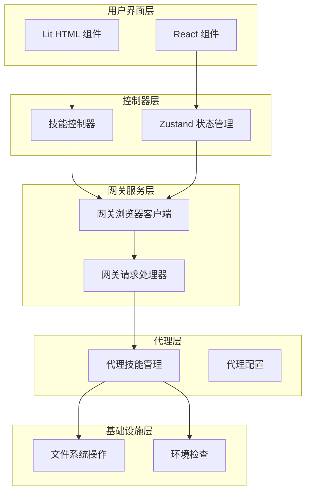
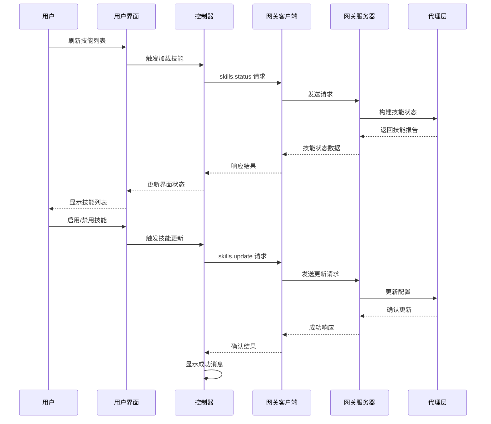
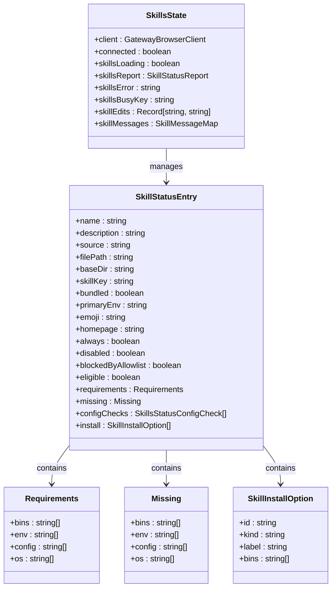
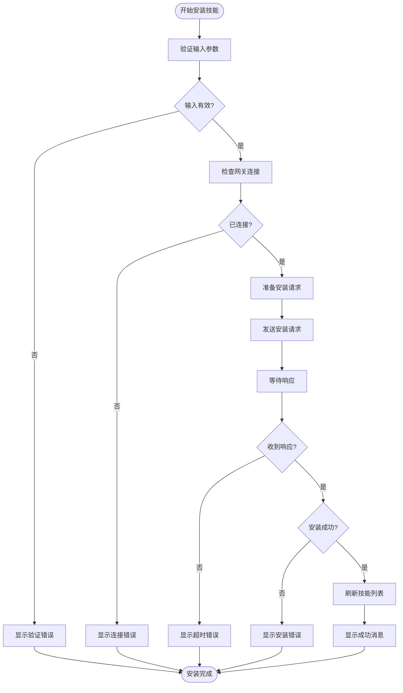
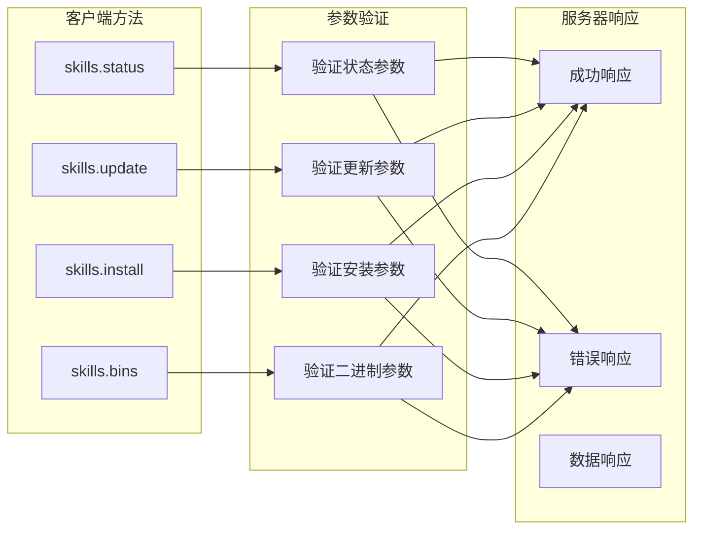
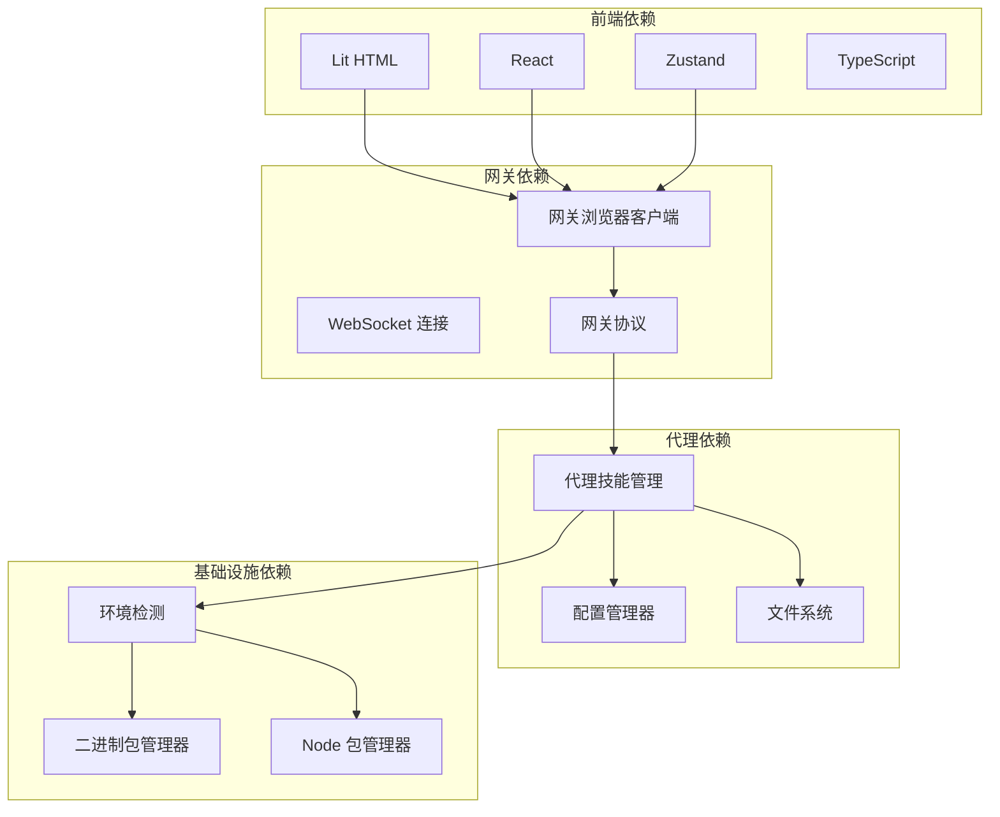
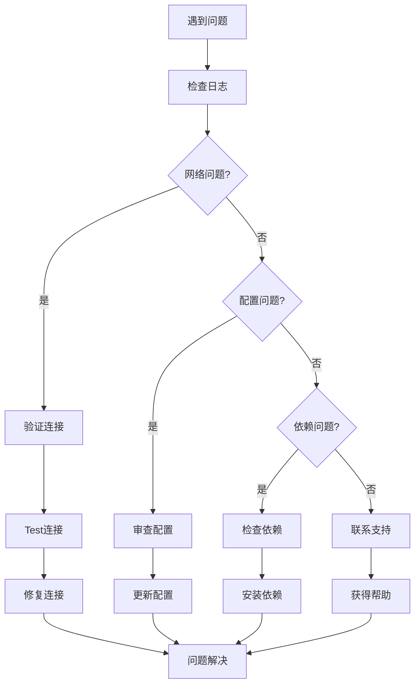

# 技能工具栏

<cite>
**本文档引用的文件**
- [README.md](file://README.md)
- [skills.ts](file://ui/src/ui/views/skills.ts)
- [SkillsToolbar.tsx](file://ui-react/src/components/skills/SkillsToolbar.tsx)
- [skills.ts](file://ui/src/ui/controllers/skills.ts)
- [skills.store.ts](file://ui-react/src/store/skills.store.ts)
- [skills.ts](file://src/gateway/server-methods/skills.ts)
- [skills.ts](file://src/agents/skills.ts)
- [types.ts](file://ui/src/ui/types.ts)
- [skills.ts](file://ui-react/src/types/skills.ts)
- [app-render.ts](file://ui/src/ui/app-render.ts)
</cite>

## 目录

1. [简介](#简介)
2. [项目结构](#项目结构)
3. [核心组件](#核心组件)
4. [架构概览](#架构概览)
5. [详细组件分析](#详细组件分析)
6. [依赖关系分析](#依赖关系分析)
7. [性能考虑](#性能考虑)
8. [故障排除指南](#故障排除指南)
9. [结论](#结论)

## 简介

技能工具栏是 OpenClaw 个人 AI 助手平台中的一个关键功能模块，负责管理和控制各种技能（Skills）的生命周期。OpenClaw 是一个在用户自己的设备上运行的个人 AI 助手，支持多种消息渠道、语音唤醒和 Canvas 可视化工作区。

技能系统是 OpenClaw 的核心特性之一，它允许用户安装、配置和管理各种功能模块，包括浏览器控制、Canvas 操作、节点管理、定时任务等。技能工具栏提供了直观的用户界面来查看技能状态、启用/禁用技能、配置 API 密钥以及安装新的技能。

根据项目文档，OpenClaw 支持以下主要功能：

- 多通道收件箱：WhatsApp、Telegram、Slack、Discord 等
- 多代理路由：将入站渠道/账户/对等方路由到隔离的代理
- 语音唤醒和说话模式
- 实时 Canvas：代理驱动的可视化工作区
- 一等工具：浏览器、Canvas、节点、定时器等
- 技能平台：捆绑的、托管的和工作区技能

## 项目结构

OpenClaw 项目采用模块化架构，技能工具栏功能分布在多个层次中：

**图表来源**

- [skills.ts:1-133](file://ui/src/ui/views/skills.ts#L1-L133)
- [skills.ts:1-213](file://ui-react/src/store/skills.store.ts#L1-L213)
- [skills.ts:1-205](file://src/gateway/server-methods/skills.ts#L1-L205)

**章节来源**

- [README.md:126-176](file://README.md#L126-L176)

## 核心组件

技能工具栏系统由多个相互协作的组件组成，每个组件都有特定的职责和功能：

### 用户界面组件

1. **Lit HTML 技能视图** - 提供基于 Web Components 的响应式界面
2. **React 技能页面** - 使用现代 React 架构的状态管理
3. **技能工具栏** - 包含搜索过滤和刷新功能的工具条

### 控制器和状态管理

1. **技能控制器** - 处理用户交互和业务逻辑
2. **Zustand 存储** - React 应用的状态管理解决方案
3. **网关客户端** - 与后端网关通信的接口

### 网关服务层

1. **技能状态处理器** - 获取技能状态报告
2. **技能更新处理器** - 启用/禁用技能和配置参数
3. **技能安装处理器** - 安装新技能的处理程序

**章节来源**

- [skills.ts:12-26](file://ui/src/ui/views/skills.ts#L12-L26)
- [skills.ts:5-11](file://ui-react/src/components/skills/SkillsToolbar.tsx#L5-L11)
- [skills.ts:4-24](file://ui/src/ui/controllers/skills.ts#L4-L24)

## 架构概览

技能工具栏采用分层架构设计，确保了清晰的关注点分离和良好的可维护性：

**图表来源**

- [skills.ts:46-68](file://ui/src/ui/controllers/skills.ts#L46-L68)
- [skills.ts:57-90](file://src/gateway/server-methods/skills.ts#L57-L90)

该架构的关键特点包括：

1. **异步通信** - 所有网关交互都是异步的，避免阻塞用户界面
2. **错误处理** - 完整的错误捕获和用户友好的错误消息
3. **状态管理** - 集中式状态管理确保界面一致性
4. **类型安全** - TypeScript 提供编译时类型检查

## 详细组件分析

### 技能状态管理

技能状态管理系统负责跟踪和显示所有已安装技能的状态信息：

**图表来源**

- [skills.ts:4-24](file://ui/src/ui/controllers/skills.ts#L4-L24)
- [types.ts:577-612](file://ui/src/ui/types.ts#L577-L612)

### 技能安装流程

技能安装过程涉及多个步骤，从用户触发到最终确认：

**图表来源**

- [skills.ts:125-157](file://ui/src/ui/controllers/skills.ts#L125-L157)
- [skills.ts:114-145](file://src/gateway/server-methods/skills.ts#L114-L145)

### 网关通信协议

技能工具栏通过标准化的网关协议与后端通信：

**图表来源**

- [skills.ts:57-204](file://src/gateway/server-methods/skills.ts#L57-L204)

**章节来源**

- [skills.ts:74-97](file://ui/src/ui/controllers/skills.ts#L74-L97)
- [skills.ts:146-203](file://src/gateway/server-methods/skills.ts#L146-L203)

## 依赖关系分析

技能工具栏系统的依赖关系展示了各组件之间的交互模式：

**图表来源**

- [skills.ts:1-3](file://ui/src/ui/controllers/skills.ts#L1-L3)
- [skills.ts:36-47](file://src/agents/skills.ts#L36-L47)

**章节来源**

- [skills.ts:1-4](file://ui-react/src/store/skills.store.ts#L1-L4)
- [skills.ts:36-47](file://src/agents/skills.ts#L36-L47)

## 性能考虑

技能工具栏系统在设计时充分考虑了性能优化：

### 加载优化

- **懒加载**：技能列表按需加载，避免初始启动时间过长
- **缓存策略**：使用内存缓存减少重复请求
- **并发处理**：支持多个技能状态的并行检查

### 内存管理

- **状态清理**：及时清理不再使用的状态数据
- **垃圾回收**：合理释放 DOM 元素和事件监听器
- **资源监控**：监控内存使用情况防止泄漏

### 网络优化

- **请求去重**：避免重复的相同请求
- **超时控制**：设置合理的请求超时时间
- **错误重试**：智能的失败重试机制

## 故障排除指南

### 常见问题及解决方案

1. **技能状态加载失败**
   - 检查网关连接状态
   - 验证用户权限
   - 查看网络连接稳定性

2. **技能启用/禁用失败**
   - 确认技能配置正确
   - 检查必要的依赖项是否满足
   - 验证 API 密钥有效性

3. **技能安装超时**
   - 检查网络连接
   - 验证安装源可用性
   - 调整超时设置

### 调试技巧

**章节来源**

- [skills.ts:39-44](file://ui/src/ui/controllers/skills.ts#L39-L44)
- [skills.ts:46-51](file://ui-react/src/store/skills.store.ts#L46-L51)

## 结论

技能工具栏是 OpenClaw 平台中一个精心设计的功能模块，它提供了强大而灵活的技能管理能力。通过采用现代化的架构设计和最佳实践，该系统实现了：

1. **用户体验优化** - 直观的界面设计和流畅的交互体验
2. **技术架构先进** - 分层架构确保了良好的可维护性和扩展性
3. **性能表现优秀** - 优化的加载策略和资源管理
4. **可靠性强** - 完善的错误处理和故障恢复机制

技能工具栏不仅满足了当前的功能需求，还为未来的功能扩展奠定了坚实的基础。其模块化的架构设计使得添加新的技能类型和功能变得相对简单，同时保持了系统的整体稳定性和性能。

随着 OpenClaw 平台的不断发展，技能工具栏将继续演进以适应新的需求和挑战，为用户提供更加丰富和强大的技能管理体验。
