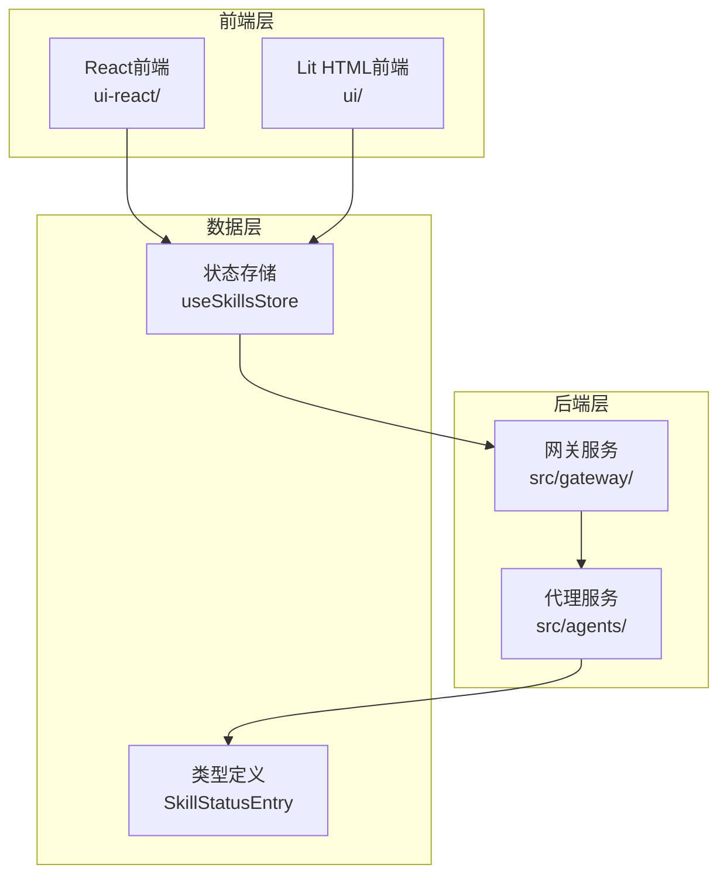
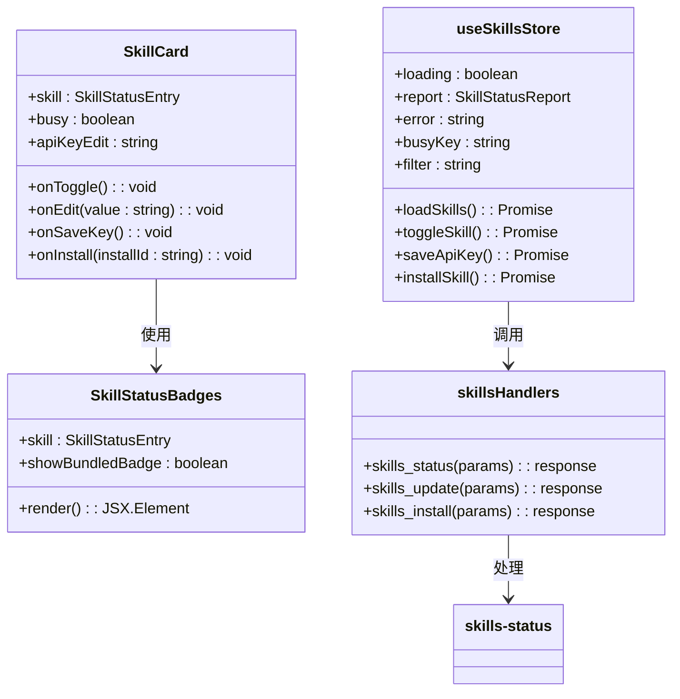
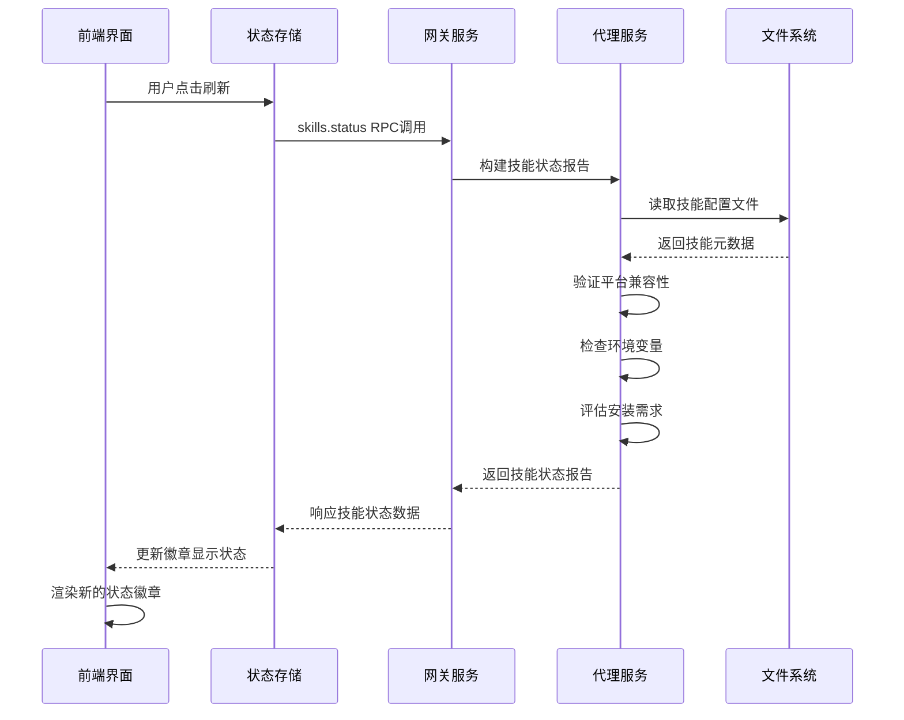
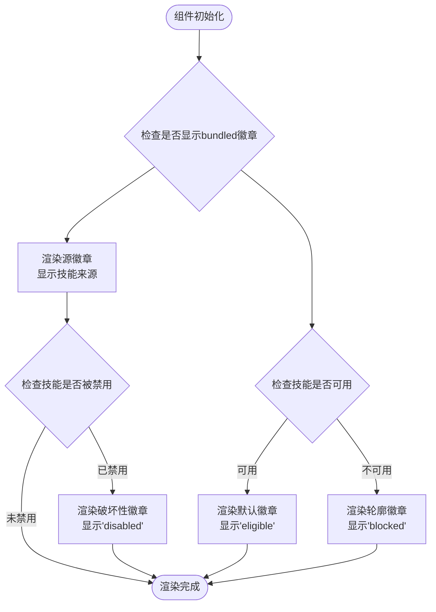
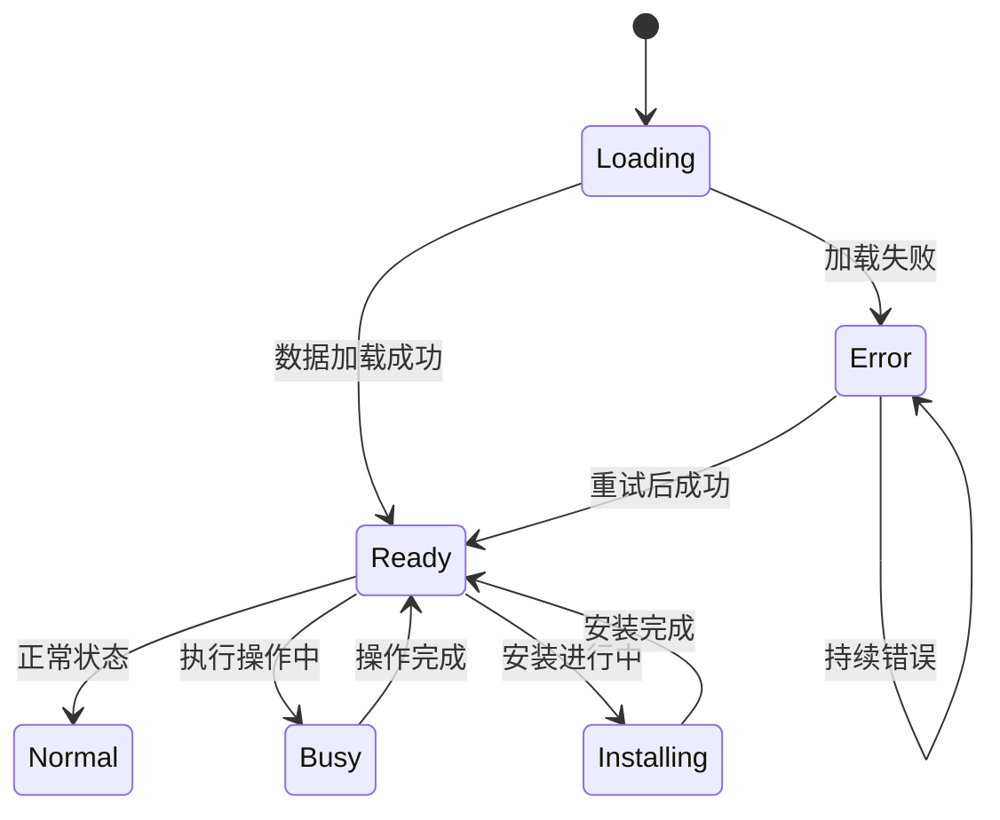
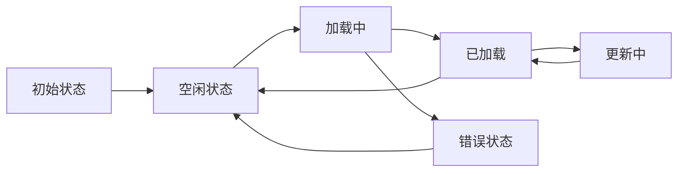
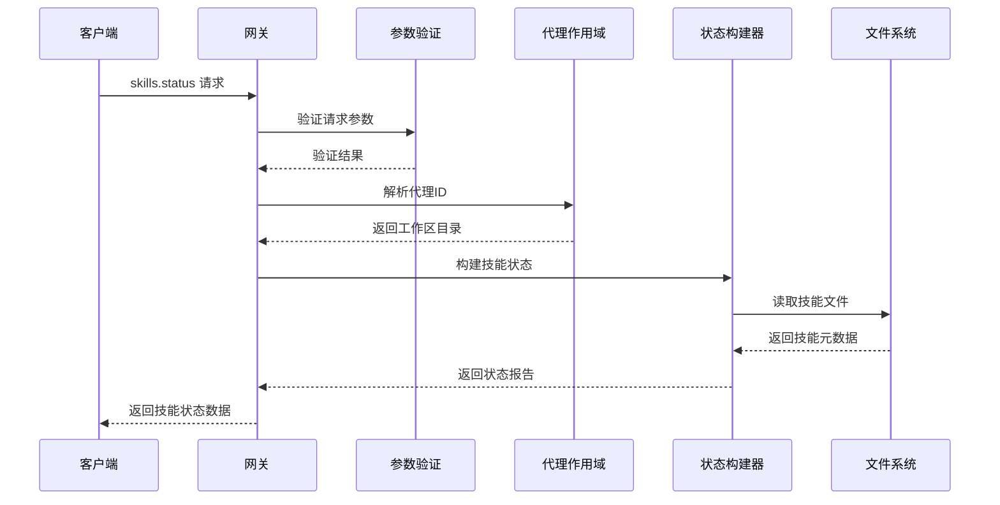
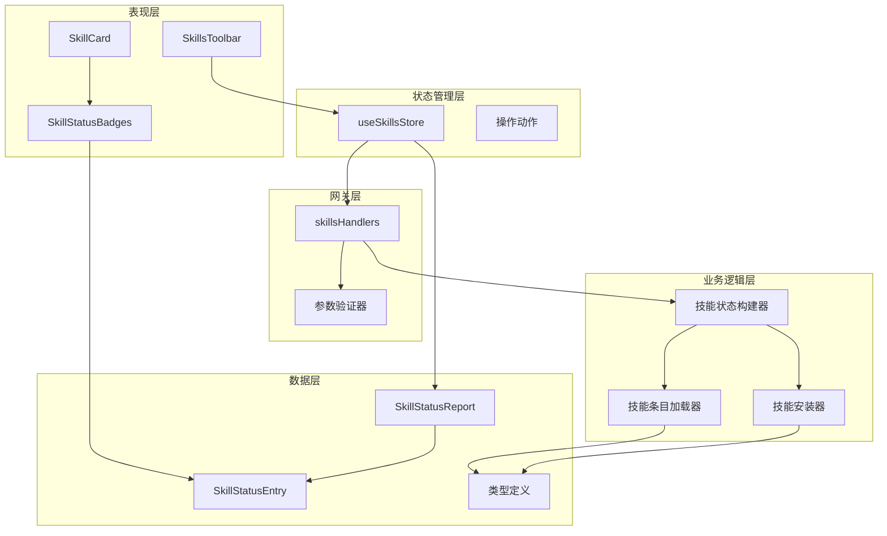

# 技能状态徽章

<cite>
**本文档引用的文件**
- [SkillStatusBadges.tsx](file://ui-react/src/components/skills/SkillStatusBadges.tsx)
- [SkillCard.tsx](file://ui-react/src/components/skills/SkillCard.tsx)
- [skills.store.ts](file://ui-react/src/store/skills.store.ts)
- [skills.ts](file://src/gateway/server-methods/skills.ts)
- [skills-status.ts](file://src/agents/skills-status.ts)
- [skills.ts](file://src/agents/skills.ts)
- [skills-shared.ts](file://ui/src/ui/views/skills-shared.ts)
- [skills.ts](file://ui/src/ui/controllers/skills.ts)
- [skills.ts](file://ui/src/ui/views/skills.ts)
- [SkillsPage.tsx](file://ui-react/src/pages/SkillsPage.tsx)
- [skills.ts](file://src/gateway/server.skills-status.test.ts)
</cite>

## 目录

1. [简介](#简介)
2. [项目结构](#项目结构)
3. [核心组件](#核心组件)
4. [架构概览](#架构概览)
5. [详细组件分析](#详细组件分析)
6. [依赖关系分析](#依赖关系分析)
7. [性能考虑](#性能考虑)
8. [故障排除指南](#故障排除指南)
9. [结论](#结论)

## 简介

技能状态徽章是OpenClaw平台中用于显示技能可用性状态的重要UI组件。该系统通过多种状态指示器帮助用户快速了解每个技能的当前状态，包括技能来源、可用性、禁用状态等关键信息。

在OpenClaw生态系统中，技能（Skills）是可复用的功能模块，可以是内置的、管理的或工作区中的自定义技能。技能状态徽章为用户提供了一个直观的方式来理解每个技能的配置和运行状况。

## 项目结构

OpenClaw项目采用多平台架构，包含React前端、Lit HTML前端和后端网关服务：

**图表来源**

- [SkillsPage.tsx:1-28](file://ui-react/src/pages/SkillsPage.tsx#L1-L28)
- [skills.store.ts:1-143](file://ui-react/src/store/skills.store.ts#L1-L143)

**章节来源**

- [SkillsPage.tsx:1-28](file://ui-react/src/pages/SkillsPage.tsx#L1-L28)
- [skills.store.ts:1-143](file://ui-react/src/store/skills.store.ts#L1-L143)

## 核心组件

技能状态徽章系统由多个相互协作的组件组成，每个组件负责特定的功能方面：

### 主要组件架构

**图表来源**

- [SkillStatusBadges.tsx:1-21](file://ui-react/src/components/skills/SkillStatusBadges.tsx#L1-L21)
- [SkillCard.tsx:1-56](file://ui-react/src/components/skills/SkillCard.tsx#L1-L56)
- [skills.store.ts:1-143](file://ui-react/src/store/skills.store.ts#L1-L143)
- [skills.ts:57-97](file://src/gateway/server-methods/skills.ts#L57-L97)

### 技能状态数据模型

技能状态徽章系统的核心数据结构定义如下：

| 字段名             | 类型    | 描述               | 状态含义                      |
| ------------------ | ------- | ------------------ | ----------------------------- |
| name               | string  | 技能名称           | 显示给用户的技能标识符        |
| source             | string  | 技能来源           | openclaw-bundled 或其他来源   |
| bundled            | boolean | 是否为内置技能     | true表示来自内置集合          |
| eligible           | boolean | 是否可用           | true表示满足所有要求          |
| disabled           | boolean | 是否被禁用         | true表示管理员禁用            |
| blockedByAllowlist | boolean | 是否被允许列表阻止 | true表示未在允许列表中        |
| requirements       | object  | 所需条件           | 包含bins、env、config、os数组 |
| missing            | object  | 缺失条件           | 当前缺失的条件集合            |

**章节来源**

- [skills-status.ts:30-55](file://src/agents/skills-status.ts#L30-L55)
- [skills.ts:13-48](file://ui-react/src/types/skills.ts#L13-L48)

## 架构概览

技能状态徽章系统采用分层架构设计，确保前后端分离和状态管理的清晰性：

**图表来源**

- [skills.store.ts:80-105](file://ui-react/src/store/skills.store.ts#L80-L105)
- [skills.ts:58-89](file://src/gateway/server-methods/skills.ts#L58-L89)
- [skills-status.ts:227-253](file://src/agents/skills-status.ts#L227-L253)

## 详细组件分析

### SkillStatusBadges 组件

SkillStatusBadges是技能状态徽章的核心组件，负责渲染单个技能的状态指示器：

#### 组件实现分析

**图表来源**

- [SkillStatusBadges.tsx:9-20](file://ui-react/src/components/skills/SkillStatusBadges.tsx#L9-L20)

#### 徽章状态逻辑

徽章组件根据技能的不同属性渲染相应的视觉状态：

1. **源徽章**：始终显示，反映技能的来源类型
2. **可用性徽章**：基于`eligible`属性决定样式
3. **禁用徽章**：仅在`disabled`为true时显示
4. **内置徽章**：基于`showBundledBadge`参数有条件显示

**章节来源**

- [SkillStatusBadges.tsx:1-21](file://ui-react/src/components/skills/SkillStatusBadges.tsx#L1-L21)

### SkillCard 组件

SkillCard组件提供技能的完整视图，包含徽章、描述和操作按钮：

#### 组件状态管理

**图表来源**

- [SkillCard.tsx:20-56](file://ui-react/src/components/skills/SkillCard.tsx#L20-L56)

**章节来源**

- [SkillCard.tsx:1-56](file://ui-react/src/components/skills/SkillCard.tsx#L1-L56)

### 状态存储管理

useSkillsStore管理整个技能状态的全局状态：

#### 状态流转机制

**图表来源**

- [skills.store.ts:71-143](file://ui-react/src/store/skills.store.ts#L71-L143)

**章节来源**

- [skills.store.ts:1-143](file://ui-react/src/store/skills.store.ts#L1-L143)

### 后端处理流程

网关服务处理技能状态请求并返回相应的数据：

#### 请求处理序列

**图表来源**

- [skills.ts:58-89](file://src/gateway/server-methods/skills.ts#L58-L89)

**章节来源**

- [skills.ts:1-205](file://src/gateway/server-methods/skills.ts#L1-L205)

## 依赖关系分析

技能状态徽章系统的依赖关系体现了清晰的分层架构：

**图表来源**

- [skills.store.ts:1-32](file://ui-react/src/store/skills.store.ts#L1-L32)
- [skills.ts:1-24](file://src/gateway/server-methods/skills.ts#L1-L24)
- [skills-status.ts:1-254](file://src/agents/skills-status.ts#L1-L254)

**章节来源**

- [skills.ts:1-205](file://src/gateway/server-methods/skills.ts#L1-L205)
- [skills-status.ts:1-254](file://src/agents/skills-status.ts#L1-L254)

## 性能考虑

技能状态徽章系统在设计时充分考虑了性能优化：

### 渲染优化策略

1. **状态缓存**：使用Zustand状态管理减少不必要的重新渲染
2. **懒加载**：技能详情按需加载，避免一次性渲染大量数据
3. **虚拟滚动**：对于大量技能列表使用虚拟化技术
4. **防抖处理**：输入过滤使用防抖机制减少重复计算

### 网络优化

1. **批量请求**：技能状态检查支持批量获取
2. **增量更新**：支持部分状态更新而非全量刷新
3. **缓存策略**：合理利用HTTP缓存头避免重复请求

## 故障排除指南

### 常见问题诊断

#### 状态徽章显示异常

**问题症状**：徽章显示不正确或状态不更新

**可能原因**：

1. 网关连接中断
2. 技能配置文件损坏
3. 权限不足导致状态检查失败

**解决方案**：

1. 检查网关连接状态
2. 验证技能配置文件格式
3. 确认用户权限范围

#### 性能问题

**问题症状**：页面加载缓慢或响应迟缓

**诊断步骤**：

1. 检查网络请求时间
2. 分析内存使用情况
3. 监控CPU占用率

**优化建议**：

1. 实施分页加载
2. 减少DOM节点数量
3. 使用Web Workers处理复杂计算

**章节来源**

- [skills.ts:1-37](file://src/gateway/server.skills-status.test.ts#L1-L37)

## 结论

技能状态徽章系统通过精心设计的架构实现了高效、直观的技能状态可视化。该系统的主要优势包括：

1. **清晰的状态表达**：通过不同样式的徽章直观显示技能状态
2. **完整的功能覆盖**：从状态检查到操作执行的全流程支持
3. **良好的扩展性**：模块化的组件设计便于功能扩展
4. **优秀的用户体验**：及时的状态反馈和响应式界面

该系统为OpenClaw平台的技能管理提供了坚实的基础，用户可以通过直观的徽章快速了解每个技能的可用性和配置状态，从而做出相应的操作决策。
