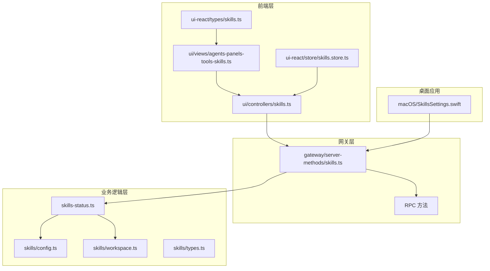
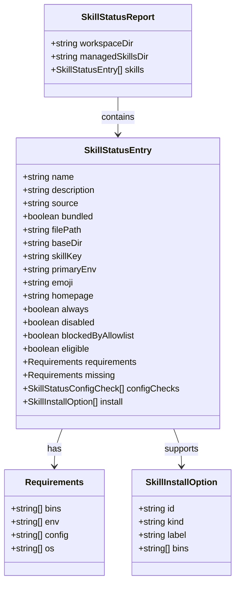
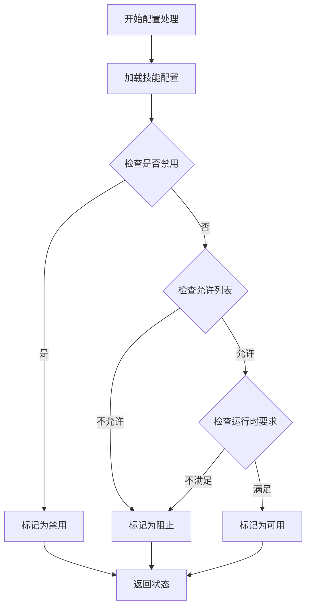
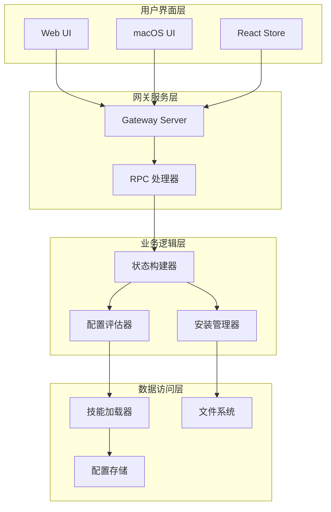
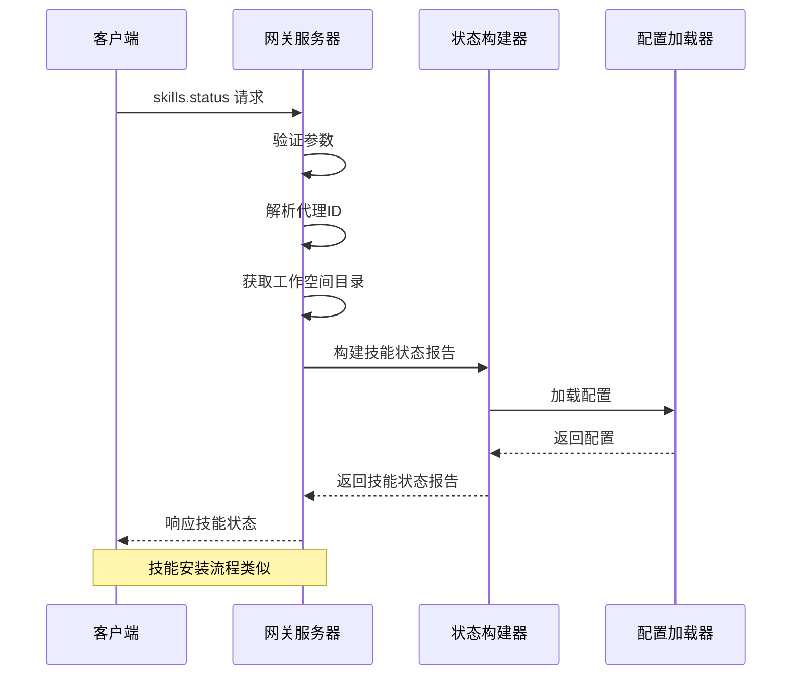
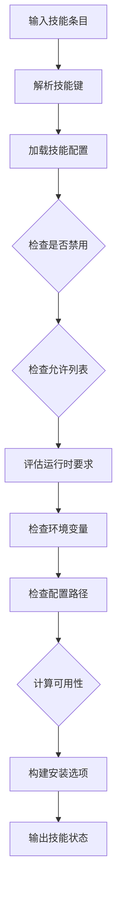
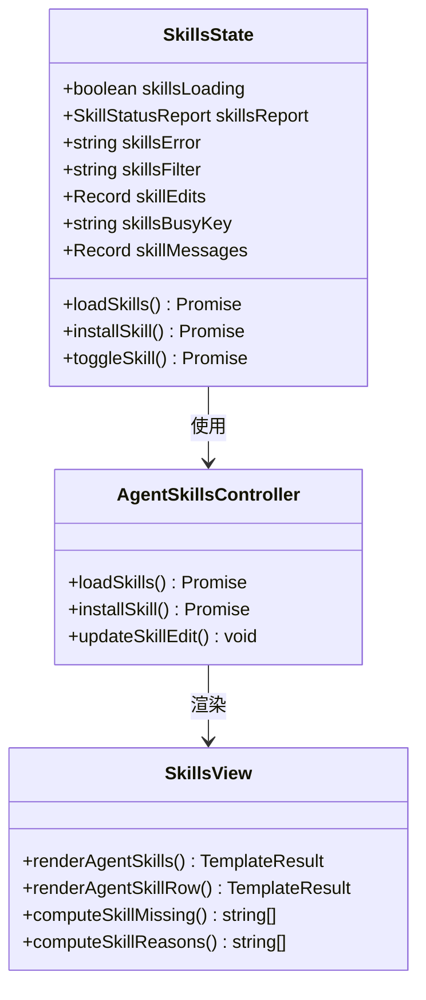
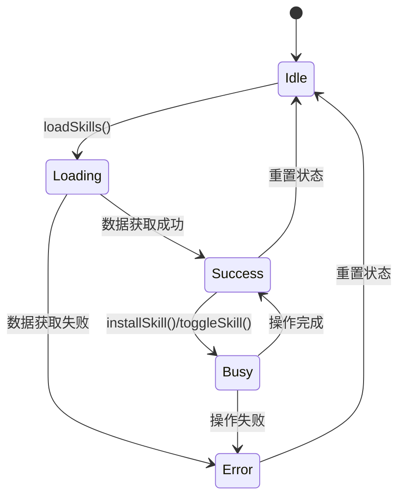
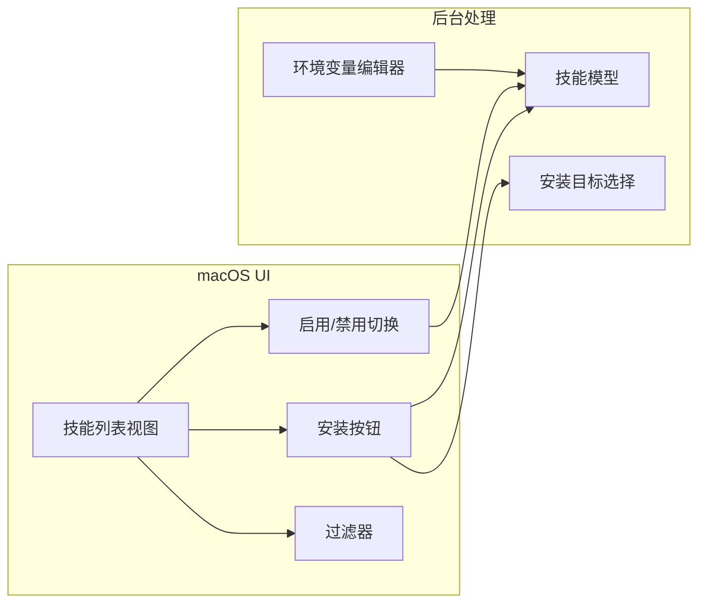

# 技能状态管理

<cite>
**本文档引用的文件**
- [src/agents/skills-status.ts](file://src/agents/skills-status.ts)
- [src/agents/skills.ts](file://src/agents/skills.ts)
- [src/agents/skills/types.ts](file://src/agents/skills/types.ts)
- [src/agents/skills/config.ts](file://src/agents/skills/config.ts)
- [src/agents/skills/workspace.ts](file://src/agents/skills/workspace.ts)
- [src/gateway/server-methods/skills.ts](file://src/gateway/server-methods/skills.ts)
- [ui/src/ui/controllers/skills.ts](file://ui/src/ui/controllers/skills.ts)
- [ui/src/ui/views/agents-panels-tools-skills.ts](file://ui/src/ui/views/agents-panels-tools-skills.ts)
- [ui/src/ui/views/skills-shared.ts](file://ui/src/ui/views/skills-shared.ts)
- [ui-react/src/store/skills.store.ts](file://ui-react/src/store/skills.store.ts)
- [ui-react/src/types/skills.ts](file://ui-react/src/types/skills.ts)
- [apps/macos/Sources/OpenClaw/SkillsSettings.swift](file://apps/macos/Sources/OpenClaw/SkillsSettings.swift)
- [src/cli/skills-cli.format.ts](file://src/cli/skills-cli.format.ts)
- [src/gateway/server.skills-status.test.ts](file://src/gateway/server.skills-status.test.ts)
</cite>

## 目录

1. [简介](#简介)
2. [项目结构](#项目结构)
3. [核心组件](#核心组件)
4. [架构概览](#架构概览)
5. [详细组件分析](#详细组件分析)
6. [依赖关系分析](#依赖关系分析)
7. [性能考虑](#性能考虑)
8. [故障排除指南](#故障排除指南)
9. [结论](#结论)

## 简介

技能状态管理是 OpenClaw 智能体系统中的关键功能模块，负责管理和监控工作空间中所有技能的状态、可用性和配置。该系统提供了完整的技能生命周期管理，包括技能发现、状态评估、配置检查、安装支持和实时状态更新。

系统通过多层架构设计，确保技能状态的准确性、安全性和可操作性。从底层的技能发现和配置解析，到上层的用户界面展示和交互，每个组件都经过精心设计以提供最佳的用户体验。

## 项目结构

技能状态管理系统跨越多个层次和平台：



**图表来源**

- [src/gateway/server-methods/skills.ts:57-90](file://src/gateway/server-methods/skills.ts#L57-L90)
- [src/agents/skills-status.ts:227-253](file://src/agents/skills-status.ts#L227-L253)
- [ui/src/ui/controllers/skills.ts:46-68](file://ui/src/ui/controllers/skills.ts#L46-L68)

**章节来源**

- [src/agents/skills-status.ts:1-254](file://src/agents/skills-status.ts#L1-L254)
- [src/gateway/server-methods/skills.ts:1-205](file://src/gateway/server-methods/skills.ts#L1-L205)

## 核心组件

### 技能状态报告模型

技能状态管理的核心数据结构定义了技能的完整状态信息：



**图表来源**

- [src/agents/skills-status.ts:30-55](file://src/agents/skills-status.ts#L30-L55)
- [src/agents/skills/types.ts:19-33](file://src/agents/skills/types.ts#L19-L33)

### 技能配置管理

系统提供了灵活的技能配置机制，支持多种配置来源和优先级：



**图表来源**

- [src/agents/skills-status.ts:169-225](file://src/agents/skills-status.ts#L169-L225)
- [src/agents/skills/config.ts:71-103](file://src/agents/skills/config.ts#L71-L103)

**章节来源**

- [src/agents/skills-status.ts:30-55](file://src/agents/skills-status.ts#L30-L55)
- [src/agents/skills/types.ts:19-33](file://src/agents/skills/types.ts#L19-L33)
- [src/agents/skills/config.ts:24-37](file://src/agents/skills/config.ts#L24-L37)

## 架构概览

技能状态管理系统采用分层架构设计，确保各层职责清晰分离：



**图表来源**

- [src/gateway/server-methods/skills.ts:57-90](file://src/gateway/server-methods/skills.ts#L57-L90)
- [src/agents/skills/workspace.ts:292-527](file://src/agents/skills/workspace.ts#L292-L527)

## 详细组件分析

### 网关 RPC 方法

网关层提供了标准化的 RPC 接口来管理技能状态：



**图表来源**

- [src/gateway/server-methods/skills.ts:58-89](file://src/gateway/server-methods/skills.ts#L58-L89)
- [src/gateway/server-methods/skills.ts:114-145](file://src/gateway/server-methods/skills.ts#L114-L145)

#### 技能状态方法实现

网关服务器实现了三个核心 RPC 方法：

1. **skills.status**: 获取技能状态报告
2. **skills.bins**: 列出所有必需的二进制文件
3. **skills.install**: 安装指定技能

**章节来源**

- [src/gateway/server-methods/skills.ts:57-90](file://src/gateway/server-methods/skills.ts#L57-L90)
- [src/gateway/server-methods/skills.ts:91-113](file://src/gateway/server-methods/skills.ts#L91-L113)
- [src/gateway/server-methods/skills.ts:114-145](file://src/gateway/server-methods/skills.ts#L114-L145)

### 技能状态构建器

状态构建器负责综合评估技能的完整状态：



**图表来源**

- [src/agents/skills-status.ts:169-225](file://src/agents/skills-status.ts#L169-L225)

#### 技能可用性评估

系统通过多维度评估技能的可用性：

| 评估维度   | 描述                           | 实现方式                                        |
| ---------- | ------------------------------ | ----------------------------------------------- |
| 配置状态   | 检查技能配置是否启用           | `resolveSkillConfig()`                          |
| 允许列表   | 验证技能是否在允许列表中       | `isBundledSkillAllowed()`                       |
| 运行时要求 | 检查二进制、环境变量、配置路径 | `evaluateEntryRequirementsForCurrentPlatform()` |
| 平台兼容性 | 验证操作系统兼容性             | `process.platform`                              |

**章节来源**

- [src/agents/skills-status.ts:169-225](file://src/agents/skills-status.ts#L169-L225)
- [src/agents/skills/config.ts:71-103](file://src/agents/skills/config.ts#L71-L103)

### 用户界面集成

系统提供了多种用户界面来展示和管理技能状态：

#### Web 界面实现



**图表来源**

- [ui/src/ui/controllers/skills.ts:46-68](file://ui/src/ui/controllers/skills.ts#L46-L68)
- [ui/src/ui/views/agents-panels-tools-skills.ts:312-344](file://ui/src/ui/views/agents-panels-tools-skills.ts#L312-L344)

#### React 状态管理

React 版本使用 Zustand 状态管理库：



**图表来源**

- [ui-react/src/store/skills.store.ts:71-105](file://ui-react/src/store/skills.store.ts#L71-L105)

**章节来源**

- [ui/src/ui/controllers/skills.ts:46-68](file://ui/src/ui/controllers/skills.ts#L46-L68)
- [ui/src/ui/views/agents-panels-tools-skills.ts:493-537](file://ui/src/ui/views/agents-panels-tools-skills.ts#L493-L537)
- [ui-react/src/store/skills.store.ts:71-105](file://ui-react/src/store/skills.store.ts#L71-L105)

### 桌面应用集成

macOS 应用提供了原生的技能管理界面：



**图表来源**

- [apps/macos/Sources/OpenClaw/SkillsSettings.swift:75-108](file://apps/macos/Sources/OpenClaw/SkillsSettings.swift#L75-L108)

**章节来源**

- [apps/macos/Sources/OpenClaw/SkillsSettings.swift:75-208](file://apps/macos/Sources/OpenClaw/SkillsSettings.swift#L75-L208)

## 依赖关系分析

技能状态管理系统具有清晰的依赖关系：

```mermaid
graph TD
subgraph "外部依赖"
PI_CODING_AGENT[@mariozechner/pi-coding-agent]
LIT[lit]
ZUSTAND[zustand]
SWIFTUI[SwiftUI]
end
subgraph "内部模块"
GATEWAY[gateway/server-methods]
AGENTS[agents/skills]
CLI[cli/skills-cli]
UI[ui/controllers]
UI_REACT[ui-react/store]
end
PI_CODING_AGENT --> AGENTS
LIT --> UI
ZUSTAND --> UI_REACT
SWIFTUI --> GATEWAY
GATEWAY --> AGENTS
AGENTS --> CLI
UI --> GATEWAY
UI_REACT --> GATEWAY
```

**图表来源**

- [src/agents/skills/workspace.ts:5-8](file://src/agents/skills/workspace.ts#L5-L8)
- [ui/src/ui/controllers/skills.ts:1-10](file://ui/src/ui/controllers/skills.ts#L1-L10)

### 核心依赖链

系统的关键依赖关系如下：

1. **技能发现依赖**: `@mariozechner/pi-coding-agent` → `agents/skills/workspace.ts`
2. **UI 依赖**: `lit` → `ui/controllers/skills.ts` → `gateway/server-methods/skills.ts`
3. **状态管理依赖**: `zustand` → `ui-react/store/skills.store.ts` → `gateway/server-methods/skills.ts`
4. **桌面应用依赖**: `SwiftUI` → `macOS/SkillsSettings.swift` → `gateway/server-methods/skills.ts`

**章节来源**

- [src/agents/skills/workspace.ts:1-34](file://src/agents/skills/workspace.ts#L1-L34)
- [ui/src/ui/controllers/skills.ts:1-10](file://ui/src/ui/controllers/skills.ts#L1-L10)
- [ui-react/src/store/skills.store.ts:1-4](file://ui-react/src/store/skills.store.ts#L1-L4)

## 性能考虑

技能状态管理系统在设计时充分考虑了性能优化：

### 内存管理

- **技能缓存**: 使用内存映射存储技能状态，避免重复计算
- **懒加载**: 技能文件按需加载，减少初始内存占用
- **垃圾回收**: 及时清理不再使用的技能状态引用

### 网络优化

- **请求去重**: 同一技能的并发请求会被合并
- **增量更新**: 支持部分状态更新而非全量刷新
- **连接池**: 网关连接复用，减少连接开销

### 文件系统优化

- **路径缓存**: 技能文件路径解析结果缓存
- **批量操作**: 支持批量技能状态查询
- **I/O 优化**: 技能文件读取使用异步操作

## 故障排除指南

### 常见问题诊断

#### 技能状态显示异常

**症状**: 技能状态与预期不符

**排查步骤**:

1. 检查技能配置文件语法
2. 验证环境变量设置
3. 确认文件权限
4. 查看网关日志

**解决方案**:

- 重新加载技能配置
- 修复配置文件中的错误
- 更新环境变量值

#### 安装失败问题

**症状**: 技能安装过程中出现错误

**排查步骤**:

1. 检查网络连接
2. 验证安装源可用性
3. 确认磁盘空间充足
4. 检查防火墙设置

**解决方案**:

- 更换安装源
- 清理临时文件
- 调整网络设置

#### 性能问题

**症状**: 技能状态加载缓慢

**排查步骤**:

1. 检查系统资源使用情况
2. 分析技能数量和复杂度
3. 监控网络延迟
4. 检查磁盘 I/O

**解决方案**:

- 优化技能配置
- 减少不必要的技能
- 升级硬件配置

**章节来源**

- [src/gateway/server.skills-status.test.ts:1-37](file://src/gateway/server.skills-status.test.ts#L1-L37)

## 结论

技能状态管理系统通过其精心设计的分层架构和全面的功能覆盖，为 OpenClaw 智能体系统提供了强大的技能管理能力。系统不仅支持多平台部署，还提供了丰富的用户界面和交互体验。

### 主要优势

1. **模块化设计**: 清晰的分层架构便于维护和扩展
2. **跨平台支持**: Web、桌面应用和移动平台的统一接口
3. **安全性**: 严格的权限控制和敏感数据保护
4. **性能优化**: 多层次的性能优化策略
5. **用户体验**: 直观的界面和流畅的操作流程

### 未来发展方向

1. **智能化推荐**: 基于使用模式的技能推荐系统
2. **自动化配置**: 更智能的技能配置检测和修复
3. **分布式管理**: 支持大规模技能集群管理
4. **增强监控**: 更详细的技能使用统计和分析
5. **扩展生态**: 更开放的技能开发和分享平台

该系统为智能体技术的发展奠定了坚实的基础，通过持续的优化和改进，将继续为用户提供更好的技能管理体验。
