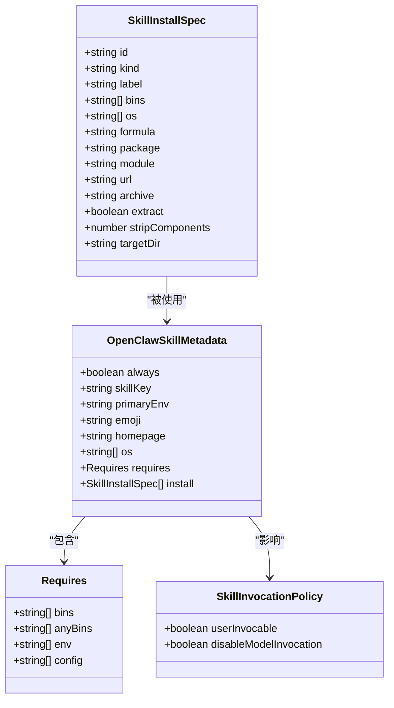
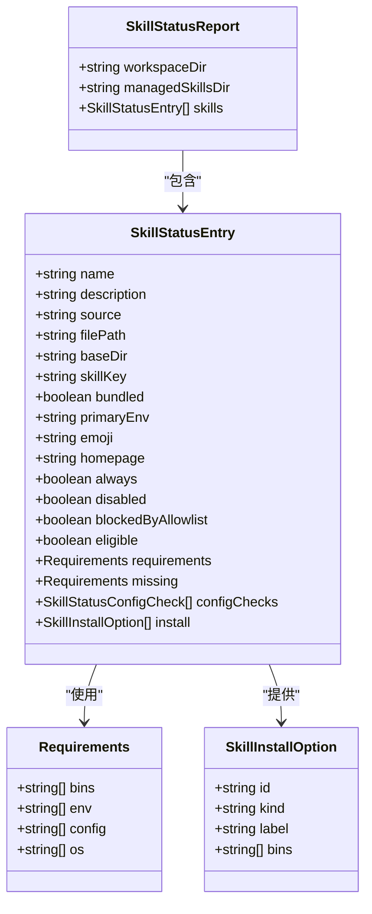
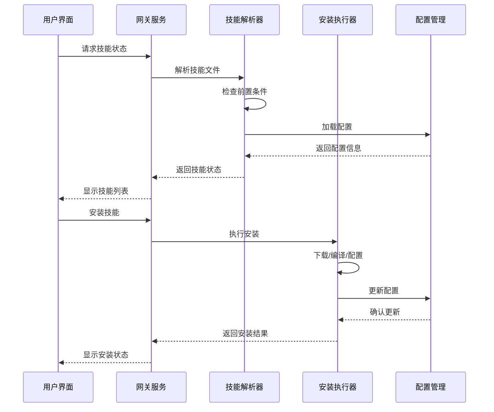
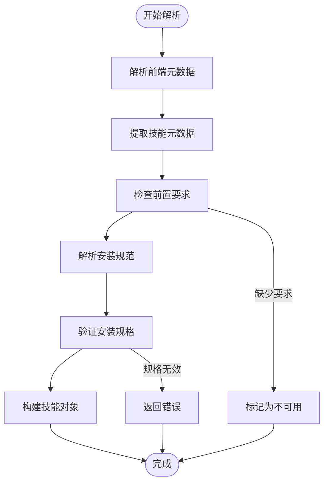
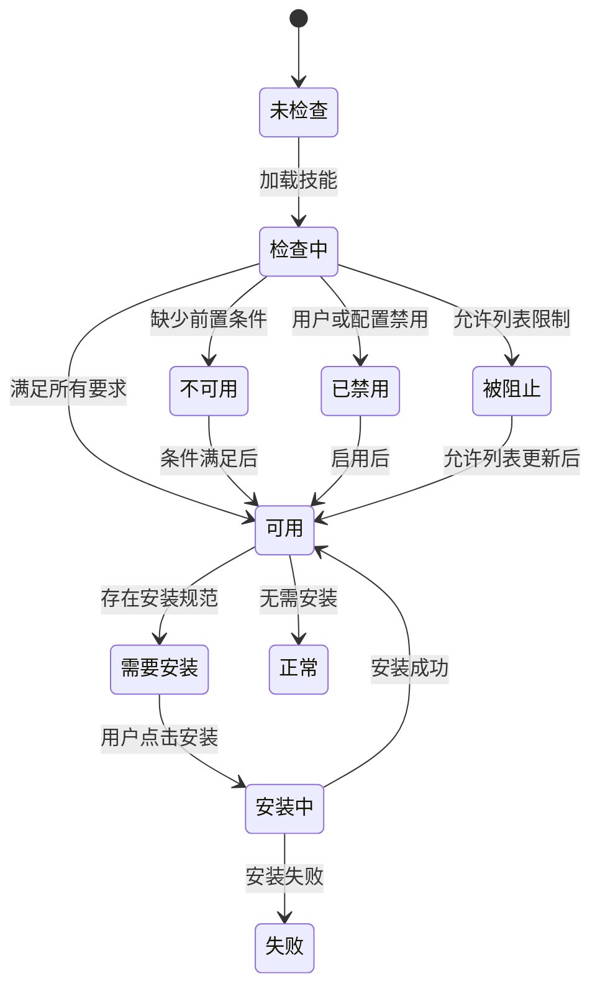
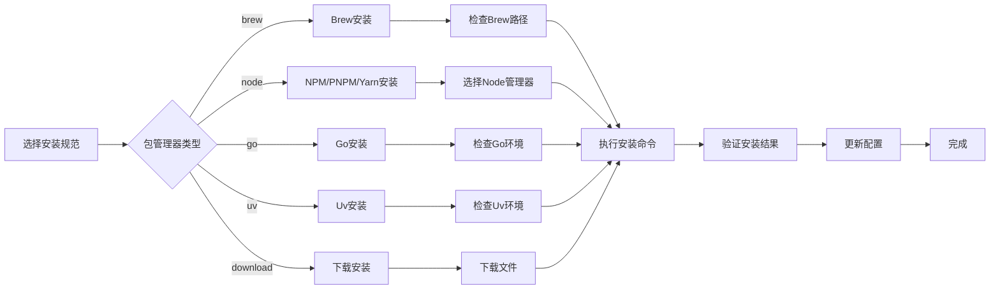
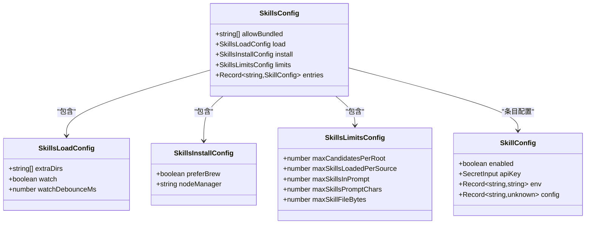
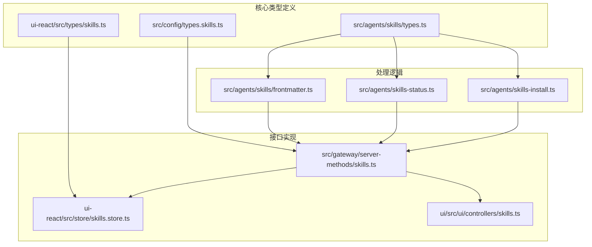
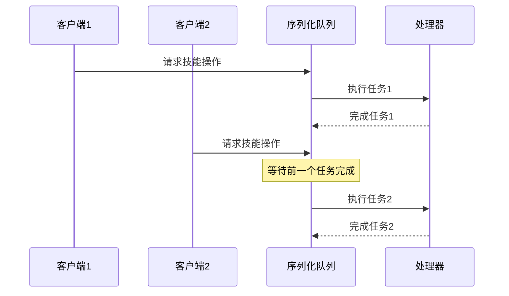

# 技能类型定义

<cite>
**本文档引用的文件**
- [src/agents/skills/types.ts](file://src/agents/skills/types.ts)
- [src/config/types.skills.ts](file://src/config/types.skills.ts)
- [src/gateway/server-methods/skills.ts](file://src/gateway/server-methods/skills.ts)
- [src/agents/skills/frontmatter.ts](file://src/agents/skills/frontmatter.ts)
- [src/agents/skills-status.ts](file://src/agents/skills-status.ts)
- [src/agents/skills-install.ts](file://src/agents/skills-install.ts)
- [ui-react/src/types/skills.ts](file://ui-react/src/types/skills.ts)
- [ui-react/src/store/skills.store.ts](file://ui-react/src/store/skills.store.ts)
- [ui/src/ui/controllers/skills.ts](file://ui/src/ui/controllers/skills.ts)
- [skills/1password/SKILL.md](file://skills/1password/SKILL.md)
- [skills/discord/SKILL.md](file://skills/discord/SKILL.md)
- [docs/tools/skills.md](file://docs/tools/skills.md)
</cite>

## 目录

1. [简介](#简介)
2. [项目结构](#项目结构)
3. [核心组件](#核心组件)
4. [架构概览](#架构概览)
5. [详细组件分析](#详细组件分析)
6. [依赖关系分析](#依赖关系分析)
7. [性能考虑](#性能考虑)
8. [故障排除指南](#故障排除指南)
9. [结论](#结论)

## 简介

OpenClaw中的技能系统是一个强大的工具集，允许用户通过简单的Markdown文件来定义和管理各种功能模块。每个技能都是一个独立的功能单元，包含完整的使用说明、前置条件检查和安装配置。

技能系统的核心理念是通过标准化的格式来描述技能，使得AI代理能够理解和使用这些工具。每个技能都必须包含一个名为SKILL.md的文件，其中包含技能的元数据和使用说明。

## 项目结构

OpenClaw的技能系统分布在多个层次中：

```mermaid
graph TB
subgraph "技能定义层"
A[SKILL.md 文件]
B[前端元数据]
C[安装规范]
end
subgraph "配置管理层"
D[技能配置类型]
E[安装偏好设置]
F[限制配置]
end
subgraph "处理层"
G[技能解析器]
H[状态检查器]
I[安装执行器]
end
subgraph "接口层"
J[网关方法]
K[UI 类型]
L[存储状态]
end
A --> G
B --> G
C --> I
D --> G
E --> I
F --> H
G --> H
H --> J
I --> J
J --> K
K --> L
```

**图表来源**

- [src/agents/skills/types.ts:1-90](file://src/agents/skills/types.ts#L1-L90)
- [src/config/types.skills.ts:1-47](file://src/config/types.skills.ts#L1-L47)
- [src/gateway/server-methods/skills.ts:1-205](file://src/gateway/server-methods/skills.ts#L1-L205)

## 核心组件

### 技能基础类型

技能系统的核心类型定义包括以下关键组件：

#### 技能安装规范

技能可以定义多种安装方式，支持不同的包管理器和安装策略：

**图表来源**

- [src/agents/skills/types.ts:3-38](file://src/agents/skills/types.ts#L3-L38)

#### 技能状态报告

技能状态报告提供了技能的完整状态信息：

**图表来源**

- [src/agents/skills-status.ts:30-55](file://src/agents/skills-status.ts#L30-L55)
- [ui-react/src/types/skills.ts:13-48](file://ui-react/src/types/skills.ts#L13-L48)

**章节来源**

- [src/agents/skills/types.ts:1-90](file://src/agents/skills/types.ts#L1-L90)
- [src/agents/skills-status.ts:1-254](file://src/agents/skills-status.ts#L1-L254)
- [ui-react/src/types/skills.ts:1-49](file://ui-react/src/types/skills.ts#L1-L49)

## 架构概览

技能系统的整体架构采用分层设计，从底层的数据模型到上层的用户界面都有清晰的职责分离：

**图表来源**

- [src/gateway/server-methods/skills.ts:57-204](file://src/gateway/server-methods/skills.ts#L57-L204)
- [src/agents/skills-install.ts:392-471](file://src/agents/skills-install.ts#L392-L471)

## 详细组件分析

### 技能解析器

技能解析器负责将SKILL.md文件转换为可执行的技能对象：

**图表来源**

- [src/agents/skills/frontmatter.ts:23-223](file://src/agents/skills/frontmatter.ts#L23-L223)

#### 前端元数据解析

前端元数据解析器支持多种配置选项：

| 配置项                   | 类型    | 描述             | 默认值 |
| ------------------------ | ------- | ---------------- | ------ |
| name                     | string  | 技能名称         | 必需   |
| description              | string  | 技能描述         | 必需   |
| homepage                 | string  | 官方网站         | 可选   |
| user-invocable           | boolean | 是否允许用户调用 | true   |
| disable-model-invocation | boolean | 是否禁用模型调用 | false  |
| command-dispatch         | string  | 命令调度方式     | 可选   |
| command-tool             | string  | 工具名称         | 可选   |
| command-arg-mode         | string  | 参数模式         | "raw"  |

**章节来源**

- [src/agents/skills/frontmatter.ts:186-223](file://src/agents/skills/frontmatter.ts#L186-L223)
- [docs/tools/skills.md:95-104](file://docs/tools/skills.md#L95-L104)

### 技能状态管理

技能状态管理系统跟踪每个技能的可用性、安装状态和配置信息：

**图表来源**

- [src/agents/skills-status.ts:169-225](file://src/agents/skills-status.ts#L169-L225)

#### 技能安装流程

技能安装支持多种包管理器和安装方式：

**图表来源**

- [src/agents/skills-install.ts:114-154](file://src/agents/skills-install.ts#L114-L154)
- [src/agents/skills-install.ts:392-471](file://src/agents/skills-install.ts#L392-L471)

**章节来源**

- [src/agents/skills-install.ts:1-471](file://src/agents/skills-install.ts#L1-L471)

### 配置管理

技能配置系统提供了灵活的配置选项和限制机制：

#### 技能配置类型

技能配置支持多种配置选项：

**图表来源**

- [src/config/types.skills.ts:10-47](file://src/config/types.skills.ts#L10-L47)

**章节来源**

- [src/config/types.skills.ts:1-47](file://src/config/types.skills.ts#L1-L47)

## 依赖关系分析

技能系统各组件之间的依赖关系如下：

**图表来源**

- [src/agents/skills/types.ts:1-90](file://src/agents/skills/types.ts#L1-L90)
- [src/gateway/server-methods/skills.ts:1-25](file://src/gateway/server-methods/skills.ts#L1-L25)

**章节来源**

- [src/agents/skills/types.ts:1-90](file://src/agents/skills/types.ts#L1-L90)
- [src/gateway/server-methods/skills.ts:1-205](file://src/gateway/server-methods/skills.ts#L1-L205)

## 性能考虑

技能系统的性能优化主要体现在以下几个方面：

### 并发控制

技能操作使用序列化队列确保并发安全：

**图表来源**

- [src/agents/skills/serialize.ts:1-14](file://src/agents/skills/serialize.ts#L1-L14)

### 缓存策略

技能状态检查使用缓存机制避免重复计算：

- 技能文件内容缓存
- 前置条件检查结果缓存
- 安装状态缓存

### 异步处理

大量I/O操作采用异步处理模式：

- 文件系统操作异步化
- 网络请求超时控制
- 进程执行超时管理

## 故障排除指南

### 常见问题诊断

#### 技能无法加载

可能的原因和解决方案：

1. **SKILL.md格式错误**
   - 检查YAML前端元数据语法
   - 验证必需字段完整性
   - 确认文件编码格式

2. **前置条件不满足**
   - 检查系统二进制文件
   - 验证环境变量设置
   - 确认配置项存在

3. **权限问题**
   - 检查文件访问权限
   - 验证目录所有权
   - 确认执行权限

#### 安装失败排查

安装失败的常见原因：

1. **网络连接问题**
   - 检查代理设置
   - 验证DNS解析
   - 确认防火墙规则

2. **包管理器问题**
   - 检查包管理器版本
   - 验证缓存状态
   - 确认镜像源配置

3. **系统兼容性**
   - 检查操作系统支持
   - 验证架构兼容性
   - 确认依赖库版本

**章节来源**

- [src/agents/skills-install.ts:195-218](file://src/agents/skills-install.ts#L195-L218)
- [src/agents/skills-status.ts:169-225](file://src/agents/skills-status.ts#L169-L225)

## 结论

OpenClaw的技能系统通过标准化的SKILL.md文件格式和完善的类型定义，为AI代理提供了一个强大而灵活的工具集。系统的设计充分考虑了安全性、可扩展性和易用性，使得用户可以轻松创建、管理和使用各种功能模块。

核心优势包括：

1. **标准化格式**：统一的SKILL.md格式确保了技能的一致性和可预测性
2. **灵活配置**：支持多种安装方式和配置选项
3. **安全检查**：内置的安全扫描和权限验证机制
4. **状态管理**：完整的技能生命周期管理
5. **用户友好**：直观的UI界面和详细的错误反馈

未来的发展方向可能包括：

- 更智能的技能推荐系统
- 增强的调试和诊断工具
- 改进的性能监控和优化
- 更丰富的安装和配置选项
