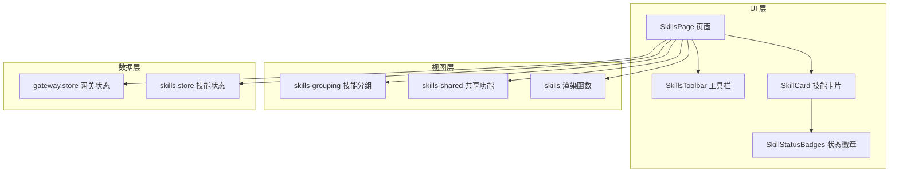
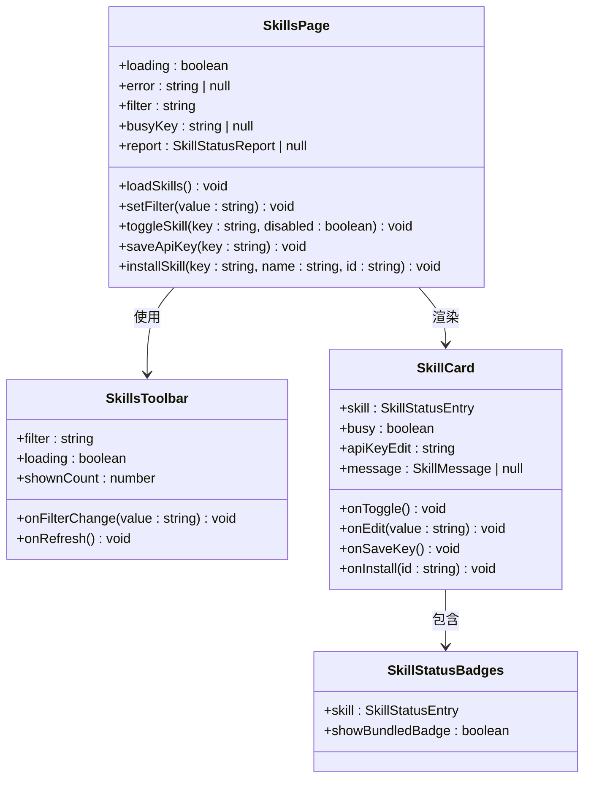
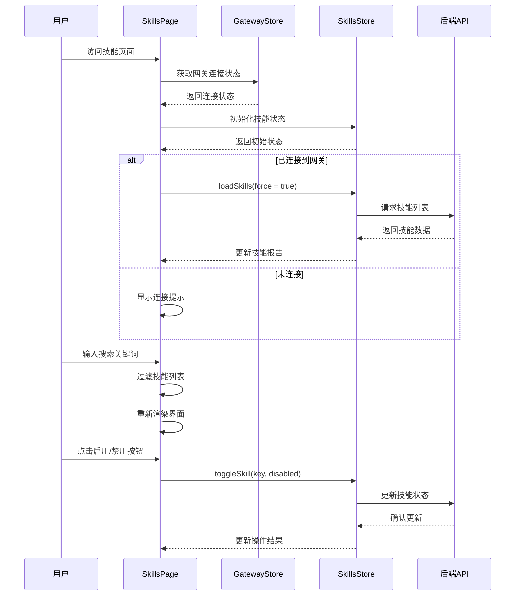
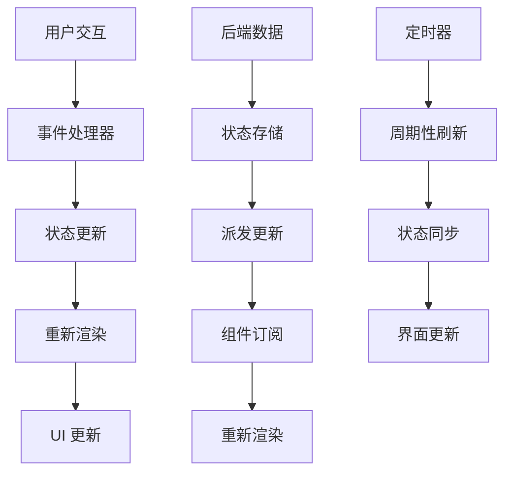
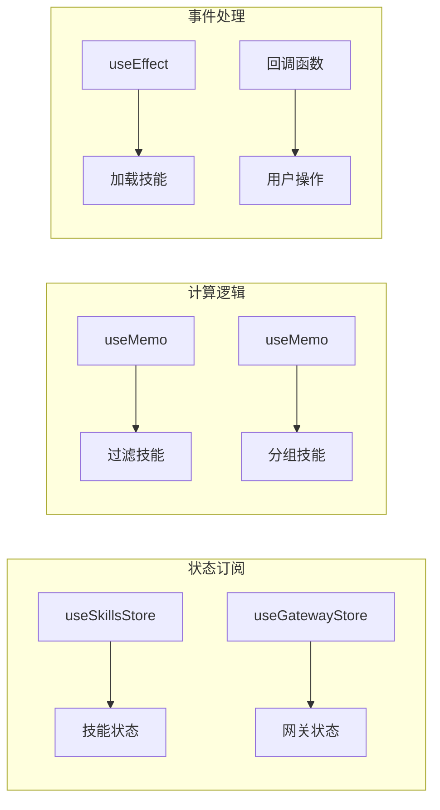
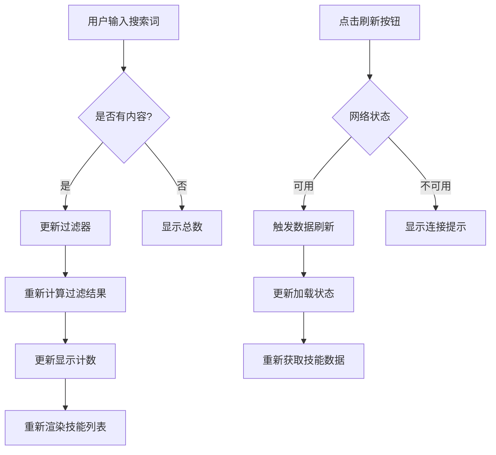
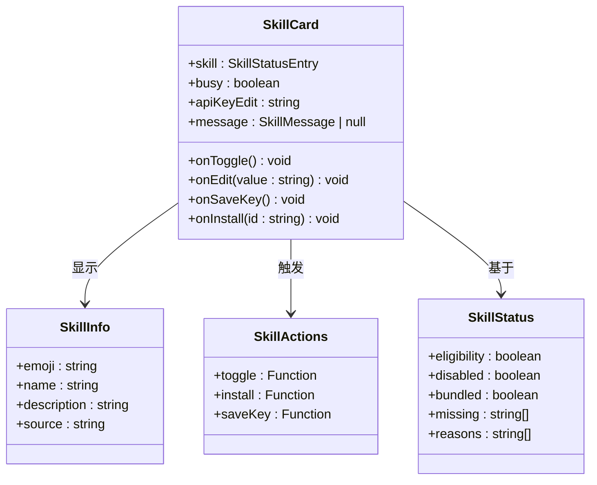
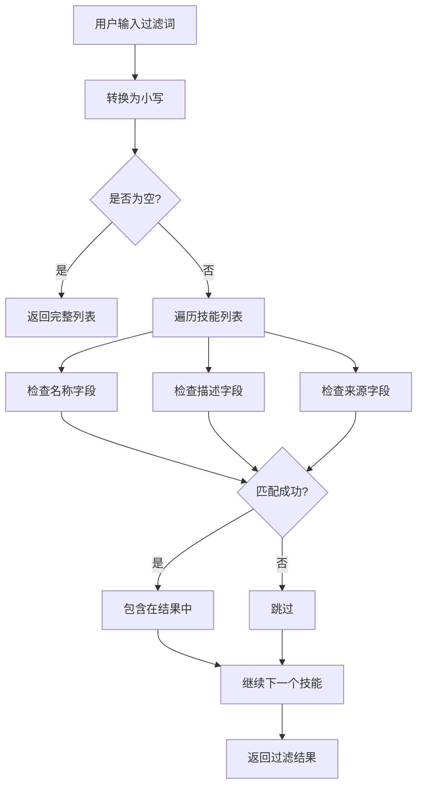
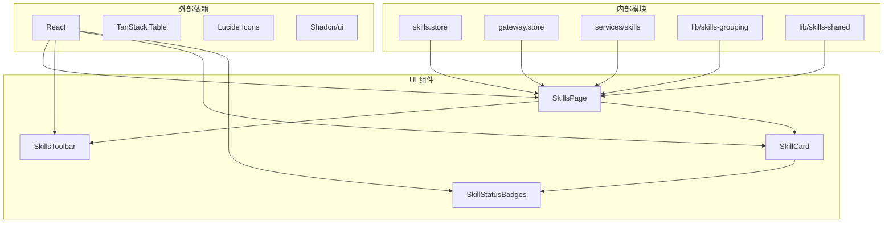
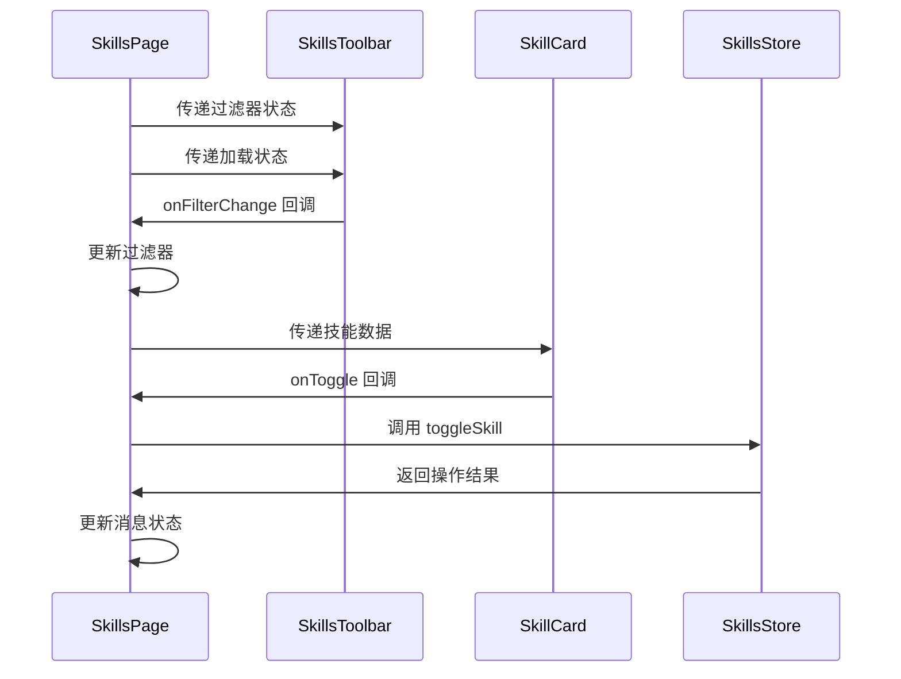

# 技能页面组件

<cite>
**本文档引用的文件**
- [ui/src/ui/views/skills.ts](file://ui/src/ui/views/skills.ts)
- [ui-react/src/pages/SkillsPage.tsx](file://ui-react/src/pages/SkillsPage.tsx)
- [ui-react/src/components/skills/SkillCard.tsx](file://ui-react/src/components/skills/SkillCard.tsx)
- [ui-react/src/components/skills/SkillsToolbar.tsx](file://ui-react/src/components/skills/SkillsToolbar.tsx)
- [ui-react/src/components/skills/SkillStatusBadges.tsx](file://ui-react/src/components/skills/SkillStatusBadges.tsx)
- [ui/src/ui/views/skills-grouping.ts](file://ui/src/ui/views/skills-grouping.ts)
- [ui/src/ui/views/skills-shared.ts](file://ui/src/ui/views/skills-shared.ts)
</cite>

## 目录

1. [简介](#简介)
2. [项目结构](#项目结构)
3. [核心组件](#核心组件)
4. [架构概览](#架构概览)
5. [详细组件分析](#详细组件分析)
6. [依赖关系分析](#依赖关系分析)
7. [性能考虑](#性能考虑)
8. [故障排除指南](#故障排除指南)
9. [结论](#结论)

## 简介

技能页面组件是 OpenClaw 项目中的一个关键用户界面模块，负责展示、管理和操作各种技能（Skills）。该组件提供了完整的技能管理功能，包括技能状态显示、过滤搜索、启用/禁用控制、API 密钥管理以及安装功能。

该组件采用响应式设计，支持多种技能来源和状态，并提供了直观的用户交互界面。组件支持两种主要的实现方式：基于 Lit 的 Web 组件和基于 React 的现代前端组件。

## 项目结构

技能页面组件在项目中采用了分层架构设计，主要包含以下层次：

**图表来源**

- [ui-react/src/pages/SkillsPage.tsx:10-137](file://ui-react/src/pages/SkillsPage.tsx#L10-L137)
- [ui-react/src/components/skills/SkillCard.tsx:20-113](file://ui-react/src/components/skills/SkillCard.tsx#L20-L113)
- [ui/src/ui/views/skills.ts:28-94](file://ui/src/ui/views/skills.ts#L28-L94)

**章节来源**

- [ui-react/src/pages/SkillsPage.tsx:1-137](file://ui-react/src/pages/SkillsPage.tsx#L1-L137)
- [ui/src/ui/views/skills.ts:1-193](file://ui/src/ui/views/skills.ts#L1-L193)

## 核心组件

技能页面组件由多个相互协作的组件构成，每个组件都有特定的功能职责：

### 主要组件架构

**图表来源**

- [ui-react/src/pages/SkillsPage.tsx:12-28](file://ui-react/src/pages/SkillsPage.tsx#L12-L28)
- [ui-react/src/components/skills/SkillsToolbar.tsx:5-11](file://ui-react/src/components/skills/SkillsToolbar.tsx#L5-L11)
- [ui-react/src/components/skills/SkillCard.tsx:9-29](file://ui-react/src/components/skills/SkillCard.tsx#L9-L29)
- [ui-react/src/components/skills/SkillStatusBadges.tsx:4-7](file://ui-react/src/components/skills/SkillStatusBadges.tsx#L4-L7)

### 技能状态管理

组件通过集中式的状态管理来处理技能的各种状态信息：

| 状态类型 | 描述                   | 关键属性                        |
| -------- | ---------------------- | ------------------------------- |
| 加载状态 | 技能数据加载中         | `loading: boolean`              |
| 错误状态 | 操作失败时的错误信息   | `error: string \| null`         |
| 过滤状态 | 用户输入的搜索关键词   | `filter: string`                |
| 编辑状态 | API 密钥编辑的临时值   | `edits: Record<string, string>` |
| 忙碌状态 | 当前正在执行的操作标识 | `busyKey: string \| null`       |
| 消息状态 | 最近一次操作的结果反馈 | `messages: SkillMessageMap`     |

**章节来源**

- [ui-react/src/pages/SkillsPage.tsx:13-19](file://ui-react/src/pages/SkillsPage.tsx#L13-L19)
- [ui/src/ui/views/skills.ts:12-26](file://ui/src/ui/views/skills.ts#L12-L26)

## 架构概览

技能页面组件采用了现代化的前端架构模式，结合了函数式编程和组件化设计的优势：

**图表来源**

- [ui-react/src/pages/SkillsPage.tsx:48-55](file://ui-react/src/pages/SkillsPage.tsx#L48-L55)
- [ui-react/src/pages/SkillsPage.tsx:23-28](file://ui-react/src/pages/SkillsPage.tsx#L23-L28)

### 数据流架构

组件的数据流遵循单向数据流原则，确保状态的一致性和可预测性：

**图表来源**

- [ui-react/src/pages/SkillsPage.tsx:30-42](file://ui-react/src/pages/SkillsPage.tsx#L30-L42)
- [ui-react/src/pages/SkillsPage.tsx:48-55](file://ui-react/src/pages/SkillsPage.tsx#L48-L55)

## 详细组件分析

### SkillsPage 组件

SkillsPage 是技能页面的核心容器组件，负责协调所有子组件的工作。

#### 组件特性

- **状态管理**: 集中管理所有技能相关的状态
- **生命周期**: 自动处理网关连接状态变化
- **性能优化**: 使用 useMemo 进行计算结果缓存
- **响应式设计**: 支持多种屏幕尺寸

#### 关键功能实现

组件通过 React Hooks 实现了复杂的状态管理逻辑：

**图表来源**

- [ui-react/src/pages/SkillsPage.tsx:1-8](file://ui-react/src/pages/SkillsPage.tsx#L1-L8)
- [ui-react/src/pages/SkillsPage.tsx:30-42](file://ui-react/src/pages/SkillsPage.tsx#L30-L42)

**章节来源**

- [ui-react/src/pages/SkillsPage.tsx:10-137](file://ui-react/src/pages/SkillsPage.tsx#L10-L137)

### SkillsToolbar 工具栏组件

SkillsToolbar 提供了技能页面的主要交互控件。

#### 功能特性

- **搜索功能**: 实时过滤技能列表
- **刷新机制**: 手动触发技能数据刷新
- **状态指示**: 显示当前过滤结果数量
- **响应式布局**: 适配不同屏幕尺寸

#### 用户交互流程

**图表来源**

- [ui-react/src/components/skills/SkillsToolbar.tsx:13-44](file://ui-react/src/components/skills/SkillsToolbar.tsx#L13-L44)

**章节来源**

- [ui-react/src/components/skills/SkillsToolbar.tsx:1-44](file://ui-react/src/components/skills/SkillsToolbar.tsx#L1-L44)

### SkillCard 技能卡片组件

SkillCard 是展示单个技能信息的独立组件。

#### 组件结构

**图表来源**

- [ui-react/src/components/skills/SkillCard.tsx:9-29](file://ui-react/src/components/skills/SkillCard.tsx#L9-L29)

#### 技能状态显示

组件通过多种视觉元素来传达技能的当前状态：

| 状态类型 | 显示方式 | 触发条件           |
| -------- | -------- | ------------------ |
| 可用状态 | 绿色徽章 | eligible = true    |
| 受限状态 | 灰色徽章 | eligible = false   |
| 已禁用   | 红色徽章 | disabled = true    |
| 内置技能 | 额外徽章 | bundled = true     |
| 缺失组件 | 灰色文本 | missing.length > 0 |

**章节来源**

- [ui-react/src/components/skills/SkillCard.tsx:1-113](file://ui-react/src/components/skills/SkillCard.tsx#L1-L113)

### 技能分组与过滤

技能页面实现了智能的分组和过滤机制，帮助用户更好地管理大量技能。

#### 分组策略

系统根据技能来源自动进行分组：

| 分组类型         | 来源标识           | 技能示例         | 特点             |
| ---------------- | ------------------ | ---------------- | ---------------- |
| Workspace Skills | openclaw-workspace | 用户自定义技能   | 可编辑、可删除   |
| Built-in Skills  | openclaw-bundled   | 系统内置技能     | 只读、基础功能   |
| Installed Skills | openclaw-managed   | 通过包管理器安装 | 可更新、版本管理 |
| Extra Skills     | openclaw-extra     | 第三方技能       | 外部来源、需验证 |

#### 过滤算法

过滤功能支持多字段匹配：

**图表来源**

- [ui/src/ui/views/skills-grouping.ts:16-40](file://ui/src/ui/views/skills-grouping.ts#L16-L40)
- [ui/src/ui/views/skills.ts:31-35](file://ui/src/ui/views/skills.ts#L31-L35)

**章节来源**

- [ui/src/ui/views/skills-grouping.ts:1-41](file://ui/src/ui/views/skills-grouping.ts#L1-L41)
- [ui/src/ui/views/skills.ts:28-94](file://ui/src/ui/views/skills.ts#L28-L94)

## 依赖关系分析

技能页面组件的依赖关系体现了清晰的关注点分离和模块化设计。

**图表来源**

- [ui-react/src/pages/SkillsPage.tsx:1-8](file://ui-react/src/pages/SkillsPage.tsx#L1-L8)
- [ui-react/src/components/skills/SkillCard.tsx:1-7](file://ui-react/src/components/skills/SkillCard.tsx#L1-L7)

### 组件间通信

组件间的通信通过 props 和回调函数实现，确保了松耦合的设计：

**图表来源**

- [ui-react/src/pages/SkillsPage.tsx:68-74](file://ui-react/src/pages/SkillsPage.tsx#L68-L74)
- [ui-react/src/components/skills/SkillCard.tsx:14-29](file://ui-react/src/components/skills/SkillCard.tsx#L14-L29)

**章节来源**

- [ui-react/src/pages/SkillsPage.tsx:22-28](file://ui-react/src/pages/SkillsPage.tsx#L22-L28)
- [ui-react/src/components/skills/SkillCard.tsx:20-29](file://ui-react/src/components/skills/SkillCard.tsx#L20-L29)

## 性能考虑

技能页面组件在设计时充分考虑了性能优化，采用了多种策略来提升用户体验：

### 渲染优化

- **虚拟化**: 对于大量技能的情况，可以考虑实现虚拟滚动
- **记忆化**: 使用 useMemo 缓存计算结果，避免不必要的重渲染
- **懒加载**: 技能详情等重型组件按需加载

### 状态管理优化

- **局部状态**: 将频繁变化的状态限制在组件内部
- **批量更新**: 合并多个状态更新操作
- **防抖处理**: 对搜索输入进行防抖处理

### 网络请求优化

- **缓存策略**: 实现智能缓存机制
- **并发控制**: 限制同时进行的网络请求数量
- **错误重试**: 实现指数退避的重试机制

## 故障排除指南

### 常见问题及解决方案

#### 技能列表为空

**症状**: 技能页面显示"没有找到技能"

**可能原因**:

1. 网关连接失败
2. 技能服务不可用
3. 用户权限不足

**解决步骤**:

1. 检查网关连接状态
2. 刷新技能数据
3. 验证用户权限

#### 搜索功能异常

**症状**: 搜索框无法过滤技能

**可能原因**:

1. 过滤逻辑错误
2. 状态更新不正确
3. 事件处理程序问题

**解决步骤**:

1. 检查过滤器状态更新
2. 验证搜索关键词处理
3. 确认重新渲染触发

#### 操作按钮无响应

**症状**: 启用/禁用按钮点击无效

**可能原因**:

1. 事件处理程序未绑定
2. 状态忙标志设置错误
3. 异步操作未完成

**解决步骤**:

1. 检查按钮的 disabled 属性
2. 验证事件处理器绑定
3. 确认异步操作完成

**章节来源**

- [ui-react/src/pages/SkillsPage.tsx:77-88](file://ui-react/src/pages/SkillsPage.tsx#L77-L88)
- [ui-react/src/components/skills/SkillCard.tsx:60-77](file://ui-react/src/components/skills/SkillCard.tsx#L60-L77)

## 结论

技能页面组件展现了现代前端开发的最佳实践，通过清晰的架构设计、完善的组件化实现和优秀的用户体验，为用户提供了强大的技能管理功能。

### 设计优势

1. **模块化设计**: 组件职责明确，易于维护和扩展
2. **响应式架构**: 支持多种设备和屏幕尺寸
3. **性能优化**: 采用多种优化策略确保流畅体验
4. **错误处理**: 完善的错误处理和用户反馈机制

### 技术亮点

- **状态管理**: 采用集中式状态管理，确保数据一致性
- **组件复用**: 通过 props 和组合实现高度复用
- **类型安全**: 全面的 TypeScript 类型定义
- **测试友好**: 清晰的接口设计便于单元测试

该组件为整个 OpenClaw 生态系统提供了重要的基础设施，为用户技能管理提供了直观、高效、可靠的解决方案。
