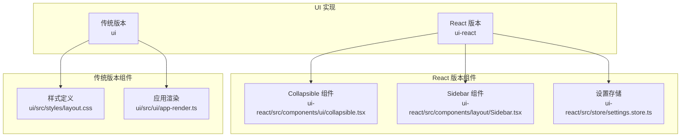
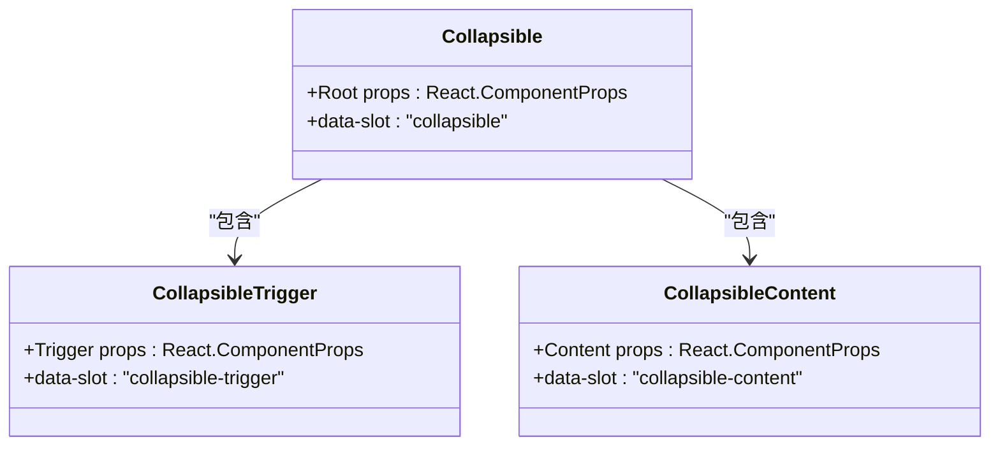
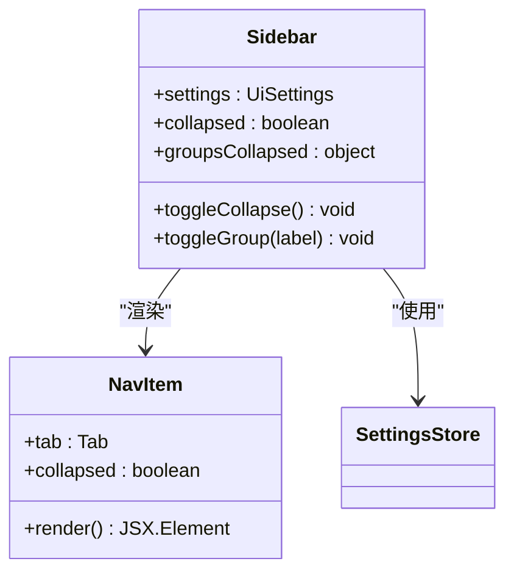
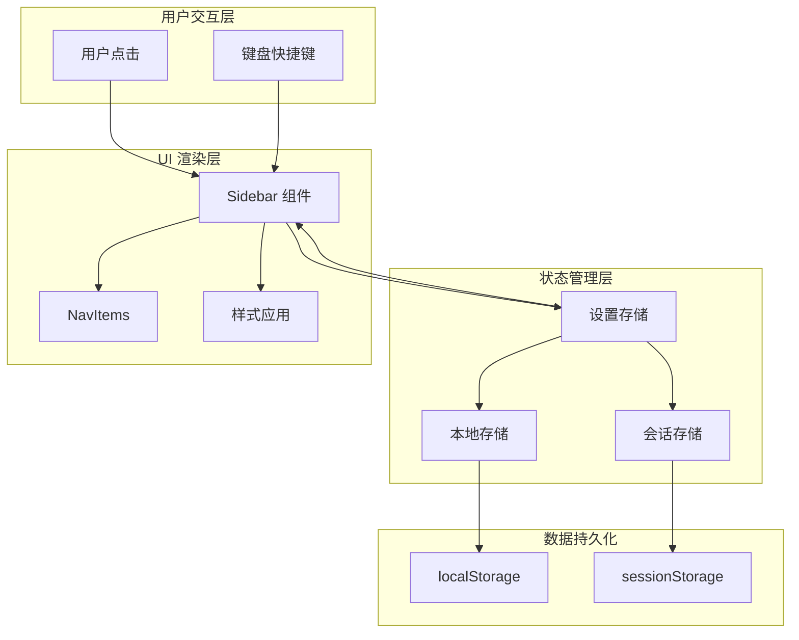
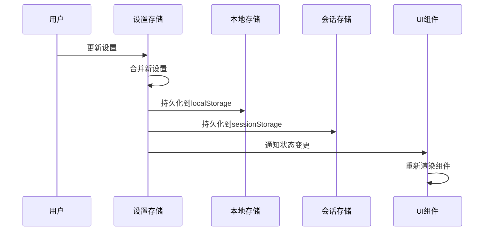
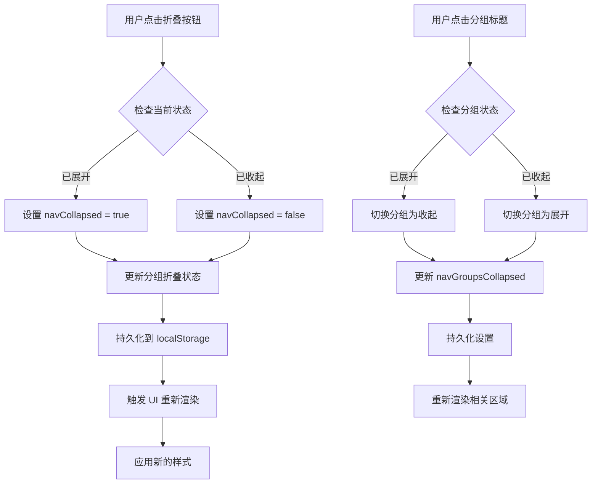
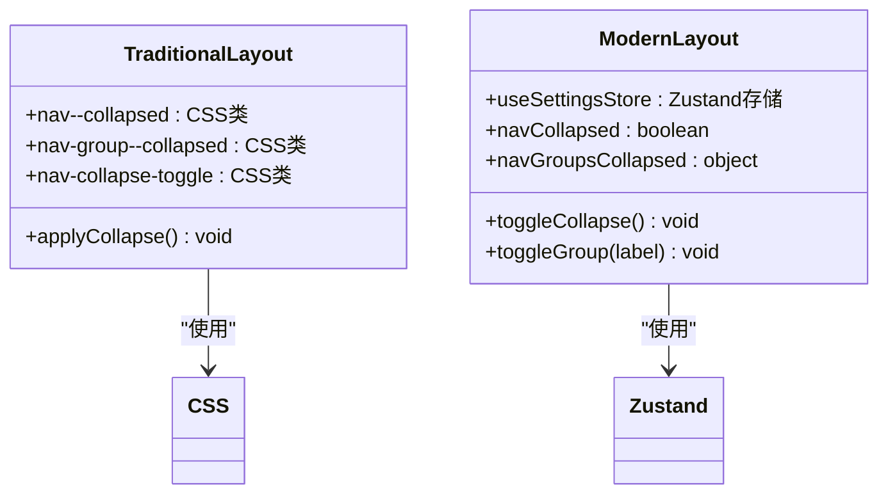

# 折叠面板组件

<cite>
**本文档引用的文件**
- [collapsible.tsx](file://ui-react/src/components/ui/collapsible.tsx)
- [Sidebar.tsx](file://ui-react/src/components/layout/Sidebar.tsx)
- [layout.css](file://ui/src/styles/layout.css)
- [app-render.ts](file://ui/src/ui/app-render.ts)
- [settings.store.ts](file://ui-react/src/store/settings.store.ts)
</cite>

## 目录

1. [简介](#简介)
2. [项目结构](#项目结构)
3. [核心组件](#核心组件)
4. [架构概览](#架构概览)
5. [详细组件分析](#详细组件分析)
6. [依赖关系分析](#依赖关系分析)
7. [性能考虑](#性能考虑)
8. [故障排除指南](#故障排除指南)
9. [结论](#结论)

## 简介

折叠面板组件是 OpenClaw 项目中的一个关键 UI 组件，用于提供可折叠的导航面板功能。该组件允许用户通过点击标题来展开或收起内容区域，从而优化界面空间使用和提升用户体验。

在 OpenClaw 中，折叠面板组件主要应用于侧边栏导航系统，支持全局折叠和分组折叠两种模式。这种设计使得用户可以在不同屏幕尺寸和使用场景下灵活控制界面布局。

## 项目结构

OpenClaw 项目采用多平台架构，包含多个 UI 实现：



**图表来源**

- [collapsible.tsx:1-21](file://ui-react/src/components/ui/collapsible.tsx#L1-L21)
- [Sidebar.tsx:1-147](file://ui-react/src/components/layout/Sidebar.tsx#L1-L147)
- [layout.css:220-419](file://ui/src/styles/layout.css#L220-L419)
- [app-render.ts:236-324](file://ui/src/ui/app-render.ts#L236-L324)

**章节来源**

- [collapsible.tsx:1-21](file://ui-react/src/components/ui/collapsible.tsx#L1-L21)
- [Sidebar.tsx:1-147](file://ui-react/src/components/layout/Sidebar.tsx#L1-L147)
- [layout.css:220-419](file://ui/src/styles/layout.css#L220-L419)
- [app-render.ts:236-324](file://ui/src/ui/app-render.ts#L236-L324)

## 核心组件

### Collapsible 基础组件

Collapsible 组件是基于 Radix UI 构建的基础折叠组件，提供了完整的折叠功能封装：



**图表来源**

- [collapsible.tsx:4-18](file://ui-react/src/components/ui/collapsible.tsx#L4-L18)

### Sidebar 折叠面板

Sidebar 组件实现了完整的折叠面板功能，包括全局折叠和分组折叠：



**图表来源**

- [Sidebar.tsx:20-110](file://ui-react/src/components/layout/Sidebar.tsx#L20-L110)
- [Sidebar.tsx:112-147](file://ui-react/src/components/layout/Sidebar.tsx#L112-L147)

**章节来源**

- [collapsible.tsx:1-21](file://ui-react/src/components/ui/collapsible.tsx#L1-L21)
- [Sidebar.tsx:1-147](file://ui-react/src/components/layout/Sidebar.tsx#L1-L147)

## 架构概览

OpenClaw 的折叠面板系统采用分层架构设计，确保了组件的可复用性和维护性：



**图表来源**

- [Sidebar.tsx:23-35](file://ui-react/src/components/layout/Sidebar.tsx#L23-L35)
- [settings.store.ts:85-176](file://ui-react/src/store/settings.store.ts#L85-L176)

## 详细组件分析

### 设置存储系统

设置存储系统负责管理所有用户偏好设置，包括折叠面板的状态：



**图表来源**

- [settings.store.ts:206-213](file://ui-react/src/store/settings.store.ts#L206-L213)

### 折叠面板状态管理

折叠面板的状态管理涉及多个层面的数据同步：



**图表来源**

- [Sidebar.tsx:27-35](file://ui-react/src/components/layout/Sidebar.tsx#L27-L35)
- [Sidebar.tsx:67-87](file://ui-react/src/components/layout/Sidebar.tsx#L67-L87)

### 传统版本实现对比

传统版本使用纯 CSS 实现折叠效果：



**图表来源**

- [layout.css:226-300](file://ui/src/styles/layout.css#L226-L300)
- [app-render.ts:242-246](file://ui/src/ui/app-render.ts#L242-L246)

**章节来源**

- [settings.store.ts:85-176](file://ui-react/src/store/settings.store.ts#L85-L176)
- [Sidebar.tsx:23-35](file://ui-react/src/components/layout/Sidebar.tsx#L23-L35)
- [layout.css:226-300](file://ui/src/styles/layout.css#L226-L300)
- [app-render.ts:242-246](file://ui/src/ui/app-render.ts#L242-L246)

## 依赖关系分析

折叠面板组件的依赖关系展现了清晰的模块化设计：

```mermaid
graph LR
subgraph "外部依赖"
A[Radix UI]
B[Zustand]
C[Lucide React]
D[Tailwind CSS]
end
subgraph "内部组件"
E[Collapsible]
F[CollapsibleTrigger]
G[CollapsibleContent]
H[Sidebar]
I[NavItem]
end
subgraph "工具函数"
J[cn (clsx)]
K[useSettingsStore]
L[useGatewayStore]
end
A --> E
A --> F
A --> G
B --> K
C --> H
D --> H
D --> I
J --> H
K --> H
L --> H
H --> I
```

**图表来源**

- [collapsible.tsx:1-2](file://ui-react/src/components/ui/collapsible.tsx#L1-L2)
- [Sidebar.tsx:1-18](file://ui-react/src/components/layout/Sidebar.tsx#L1-L18)

**章节来源**

- [collapsible.tsx:1-21](file://ui-react/src/components/ui/collapsible.tsx#L1-L21)
- [Sidebar.tsx:1-18](file://ui-react/src/components/layout/Sidebar.tsx#L1-L18)

## 性能考虑

折叠面板组件在设计时充分考虑了性能优化：

### 渲染优化

- 使用 React.memo 避免不必要的重渲染
- 条件渲染只渲染可见的导航项
- 使用 CSS 过渡动画而非 JavaScript 动画

### 存储优化

- 智能的 localStorage 和 sessionStorage 使用策略
- 避免频繁的存储操作
- 批量更新设置以减少重渲染次数

### 内存管理

- 合理的事件监听器清理
- 避免内存泄漏的订阅管理
- 及时清理过期的设置数据

## 故障排除指南

### 常见问题及解决方案

**问题：折叠状态不持久化**

- 检查 localStorage 访问权限
- 验证设置存储格式
- 确认持久化函数调用

**问题：折叠动画不流畅**

- 检查 CSS 过渡属性
- 验证 Tailwind 配置
- 确认浏览器兼容性

**问题：分组折叠状态异常**

- 检查 navGroupsCollapsed 对象结构
- 验证状态更新逻辑
- 确认对象引用处理

**章节来源**

- [settings.store.ts:172-176](file://ui-react/src/store/settings.store.ts#L172-L176)
- [Sidebar.tsx:29-35](file://ui-react/src/components/layout/Sidebar.tsx#L29-L35)

## 结论

OpenClaw 的折叠面板组件展现了现代前端开发的最佳实践：

### 设计优势

- **模块化设计**：清晰的组件分离和职责划分
- **状态管理**：高效的设置存储和状态同步机制
- **用户体验**：流畅的动画过渡和直观的操作反馈
- **可维护性**：良好的代码组织和类型安全

### 技术亮点

- 基于 Radix UI 的可访问性支持
- Zustand 状态管理的轻量化实现
- Tailwind CSS 的原子化样式设计
- TypeScript 的完整类型安全保障

### 未来改进方向

- 支持更多的自定义配置选项
- 增强移动端的触摸交互体验
- 优化大数量导航项的渲染性能
- 扩展主题系统的灵活性

折叠面板组件作为 OpenClaw UI 系统的重要组成部分，为用户提供了高效、直观的界面导航体验，同时展现了代码质量和架构设计的优秀水准。
