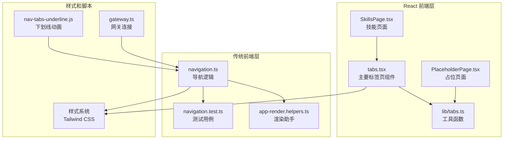
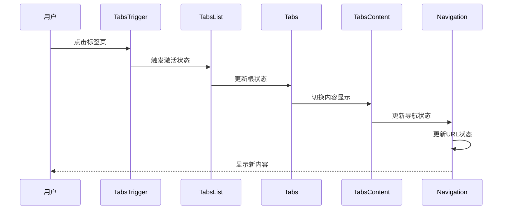
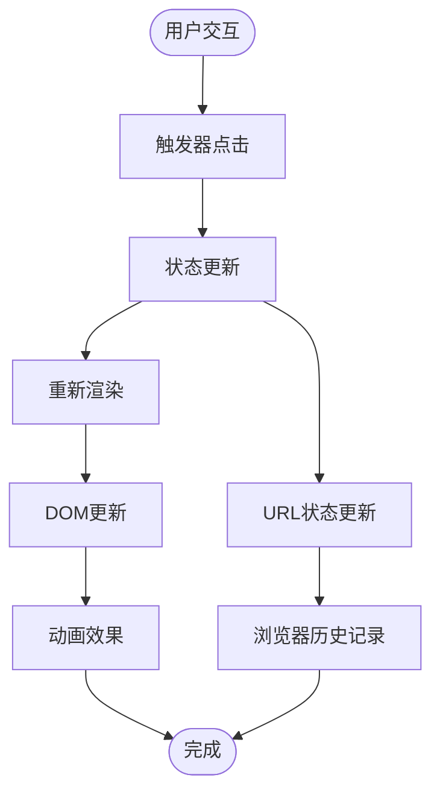
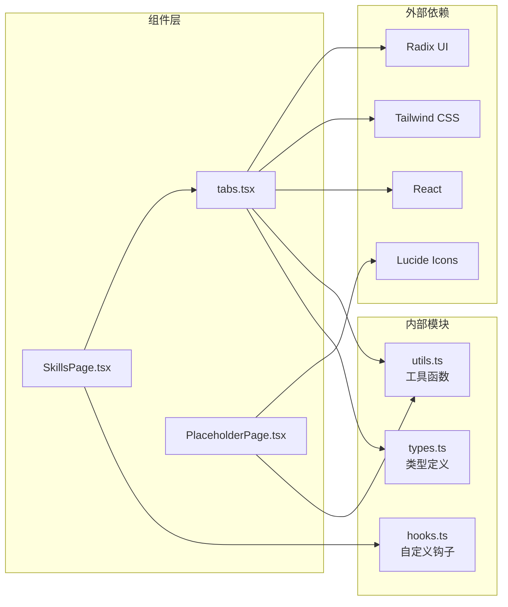

# 标签页组件

<cite>
**本文档引用的文件**
- [ui-react/src/components/ui/tabs.tsx](file://ui-react/src/components/ui/tabs.tsx)
- [ui/src/ui/navigation.ts](file://ui/src/ui/navigation.ts)
- [ui/src/ui/app-render.helpers.ts](file://ui/src/ui/app-render.helpers.ts)
- [ui/src/ui/navigation.test.ts](file://ui/src/ui/navigation.test.ts)
- [ui/src/ui/gateway.ts](file://ui/src/ui/gateway.ts)
- [ui-react/src/lib/tabs.ts](file://ui-react/src/lib/tabs.ts)
- [ui-react/src/pages/SkillsPage.tsx](file://ui-react/src/pages/SkillsPage.tsx)
- [ui-react/src/components/layout/PlaceholderPage.tsx](file://ui-react/src/components/layout/PlaceholderPage.tsx)
- [docs/nav-tabs-underline.js](file://docs/nav-tabs-underline.js)
</cite>

## 目录

1. [简介](#简介)
2. [项目结构](#项目结构)
3. [核心组件](#核心组件)
4. [架构概览](#架构概览)
5. [详细组件分析](#详细组件分析)
6. [依赖关系分析](#依赖关系分析)
7. [性能考虑](#性能考虑)
8. [故障排除指南](#故障排除指南)
9. [结论](#结论)

## 简介

标签页组件是 OpenClaw 项目中的核心界面组件之一，负责提供用户在不同功能模块之间的导航能力。该组件系统采用现代化的 React 设计，结合了 Radix UI 的可访问性特性、Tailwind CSS 的样式定制能力和 TypeScript 的类型安全保证。

标签页组件不仅提供了基础的切换功能，还集成了完整的导航状态管理、图标系统、国际化支持以及响应式设计。整个系统支持水平和垂直两种布局模式，并提供了多种样式变体以适应不同的使用场景。

## 项目结构

OpenClaw 项目中的标签页组件分布在多个层次中，形成了一个完整的组件生态系统：

**图表来源**

- [ui-react/src/components/ui/tabs.tsx:1-79](file://ui-react/src/components/ui/tabs.tsx#L1-L79)
- [ui/src/ui/navigation.ts:1-166](file://ui/src/ui/navigation.ts#L1-L166)
- [docs/nav-tabs-underline.js:1-100](file://docs/nav-tabs-underline.js#L1-L100)

**章节来源**

- [ui-react/src/components/ui/tabs.tsx:1-79](file://ui-react/src/components/ui/tabs.tsx#L1-L79)
- [ui/src/ui/navigation.ts:1-166](file://ui/src/ui/navigation.ts#L1-L166)

## 核心组件

### 主要标签页组件

标签页组件系统的核心由四个主要组件构成：Tabs、TabsList、TabsTrigger 和 TabsContent。这些组件共同提供了完整的标签页功能。

#### Tabs 组件

作为根容器组件，Tabs 提供了标签页的基本结构和布局控制。它支持水平和垂直两种方向模式，并通过数据属性来传递状态信息。

#### TabsList 组件

TabsList 负责管理标签页列表的外观和行为。它支持两种样式变体：默认变体（带背景色）和线条变体（无背景）。通过 Variance Props 系统，开发者可以轻松地在不同样式之间切换。

#### TabsTrigger 组件

TabsTrigger 是用户交互的主要入口点。每个触发器都包含图标、文本标签和状态指示器。组件支持禁用状态、焦点状态和激活状态的不同视觉表现。

#### TabsContent 组件

TabsContent 用于包装每个标签页的内容区域。它确保内容的正确显示和隐藏，并处理动画过渡效果。

**章节来源**

- [ui-react/src/components/ui/tabs.tsx:6-78](file://ui-react/src/components/ui/tabs.tsx#L6-L78)

### 导航系统

传统的导航系统提供了更完整的路由和状态管理功能：

#### Tab 类型定义

系统定义了完整的 Tab 类型，包括 agents、chat、overview、channels、instances、sessions、usage、cron、skills、nodes、config、debug、logs 等所有可用的标签页类型。

#### 路径映射系统

每个 Tab 都有对应的路径映射，支持基础路径前缀和相对路径处理。系统能够智能地从 URL 中解析当前激活的标签页。

#### 图标和标题系统

为每个标签页提供专门的图标和本地化标题，支持多语言环境下的正确显示。

**章节来源**

- [ui/src/ui/navigation.ts:14-45](file://ui/src/ui/navigation.ts#L14-L45)
- [ui/src/ui/navigation.ts:126-165](file://ui/src/ui/navigation.ts#L126-L165)

## 架构概览

标签页组件系统采用了分层架构设计，确保了组件间的松耦合和高内聚：

**图表来源**

- [ui-react/src/components/ui/tabs.tsx:52-76](file://ui-react/src/components/ui/tabs.tsx#L52-L76)
- [ui/src/ui/app-render.helpers.ts:50-83](file://ui/src/ui/app-render.helpers.ts#L50-L83)

### 数据流架构

标签页组件的数据流遵循单向数据流原则，确保了状态的一致性和可预测性：

**图表来源**

- [ui/src/ui/app-render.helpers.ts:56-76](file://ui/src/ui/app-render.helpers.ts#L56-L76)

## 详细组件分析

### React 标签页组件实现

#### 组件设计模式

React 版本的标签页组件采用了组合模式和高阶组件的设计理念。每个子组件都可以独立使用，同时通过组合形成完整的功能。

#### 样式系统集成

组件深度集成了 Tailwind CSS 的变体系统，通过 Variance Props 实现了灵活的样式定制。支持响应式设计和暗色主题适配。

#### 可访问性支持

基于 Radix UI 的可访问性标准，组件完全支持键盘导航、屏幕阅读器和其他辅助技术。

**章节来源**

- [ui-react/src/components/ui/tabs.tsx:1-79](file://ui-react/src/components/ui/tabs.tsx#L1-L79)

### 传统导航组件分析

#### 导航状态管理

传统版本的导航系统提供了更完整的状态管理机制，包括基础路径推断、路径规范化和标签页识别。

#### 渲染优化策略

组件实现了智能的渲染优化，避免不必要的重渲染，提高了应用的整体性能。

#### 错误处理机制

系统包含了完善的错误处理机制，能够优雅地处理各种异常情况和边界条件。

**章节来源**

- [ui/src/ui/navigation.ts:104-124](file://ui/src/ui/navigation.ts#L104-L124)
- [ui/src/ui/app-render.helpers.ts:50-83](file://ui/src/ui/app-render.helpers.ts#L50-L83)

### 下划线动画系统

文档级别的 JavaScript 组件提供了动态的下划线动画效果，增强了用户体验：

#### 动画实现原理

通过监听 DOM 变化和窗口大小调整事件，实时计算激活标签页的位置和尺寸，动态更新下划线的样式属性。

#### 性能优化

使用 requestAnimationFrame 进行动画调度，确保了 60fps 的流畅动画效果。

#### 自适应设计

动画系统能够自适应不同的屏幕尺寸和字体大小，保持一致的视觉效果。

**章节来源**

- [docs/nav-tabs-underline.js:1-100](file://docs/nav-tabs-underline.js#L1-L100)

## 依赖关系分析

标签页组件系统的依赖关系清晰明确，遵循了最小依赖原则：

**图表来源**

- [ui-react/src/components/ui/tabs.tsx:1-5](file://ui-react/src/components/ui/tabs.tsx#L1-L5)
- [ui-react/src/lib/tabs.ts:1-14](file://ui-react/src/lib/tabs.ts#L1-L14)

### 模块间耦合度分析

系统采用了松耦合的设计原则，各模块间的依赖关系简洁明了：

- **低耦合**: 组件间通过接口而非具体实现进行交互
- **高内聚**: 每个模块专注于单一职责
- **可测试性**: 模块设计便于单元测试和集成测试

**章节来源**

- [ui-react/src/components/ui/tabs.tsx:1-79](file://ui-react/src/components/ui/tabs.tsx#L1-L79)
- [ui-react/src/lib/tabs.ts:1-67](file://ui-react/src/lib/tabs.ts#L1-L67)

## 性能考虑

### 渲染性能优化

标签页组件系统在设计时充分考虑了性能优化：

#### 虚拟化支持

对于大量标签页的情况，系统支持虚拟化渲染，只渲染可见区域内的组件。

#### 懒加载机制

内容区域采用懒加载策略，只有在标签页被激活时才加载对应的内容。

#### 内存管理

组件实现了正确的生命周期管理，避免内存泄漏和资源浪费。

### 交互性能优化

#### 防抖处理

输入事件经过防抖处理，避免频繁的状态更新影响性能。

#### 动画优化

CSS3 硬件加速的动画效果，确保流畅的用户体验。

## 故障排除指南

### 常见问题诊断

#### 标签页不显示或显示异常

1. 检查 Tab 类型定义是否正确
2. 验证路径映射配置
3. 确认样式类名的正确性

#### 导航状态不同步

1. 检查状态更新逻辑
2. 验证事件处理器的绑定
3. 确认 URL 同步机制

#### 动画效果异常

1. 检查 CSS 变量的设置
2. 验证 JavaScript 动画脚本
3. 确认浏览器兼容性

**章节来源**

- [ui/src/ui/navigation.test.ts:1-40](file://ui/src/ui/navigation.test.ts#L1-L40)
- [ui/src/ui/navigation.test.ts:135-189](file://ui/src/ui/navigation.test.ts#L135-L189)

### 调试技巧

#### 开发者工具使用

利用浏览器开发者工具检查 DOM 结构和样式应用情况。

#### 日志记录

在关键节点添加日志输出，跟踪状态变化和事件流程。

#### 单元测试

编写全面的单元测试覆盖各种边界情况和异常处理。

## 结论

标签页组件系统展现了现代前端开发的最佳实践，通过精心设计的架构和实现，为用户提供了优秀的导航体验。系统具有以下特点：

1. **模块化设计**: 清晰的组件分离和职责划分
2. **类型安全**: 完整的 TypeScript 支持和类型检查
3. **可访问性**: 符合 WCAG 标准的可访问性设计
4. **性能优化**: 多层次的性能优化策略
5. **易于维护**: 良好的代码组织和文档支持

该组件系统不仅满足了当前的功能需求，还为未来的扩展和改进奠定了坚实的基础。通过持续的优化和完善，标签页组件将继续为用户提供优质的导航体验。
