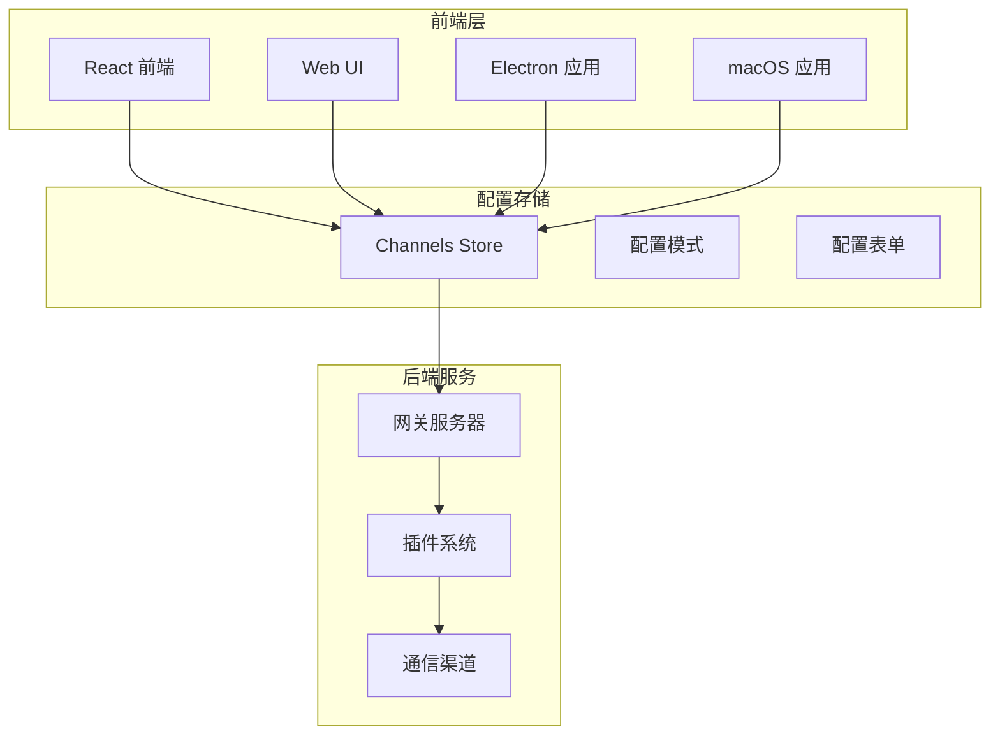
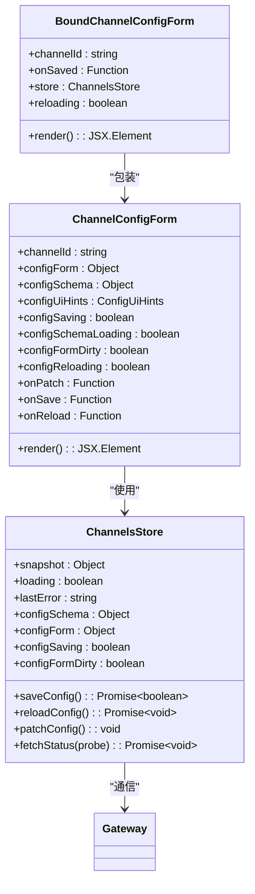
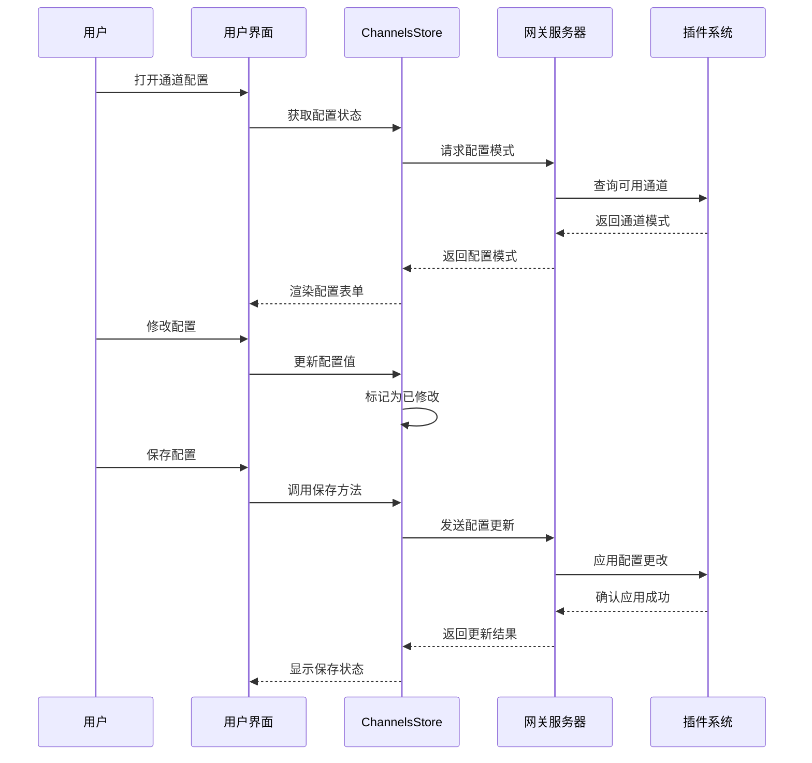
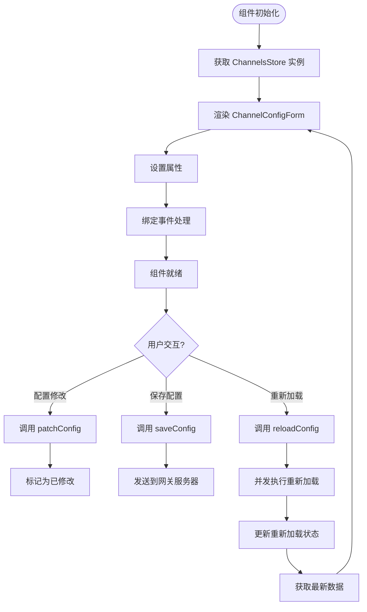
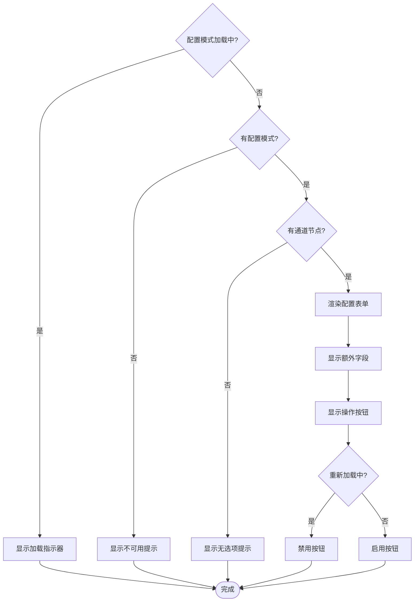
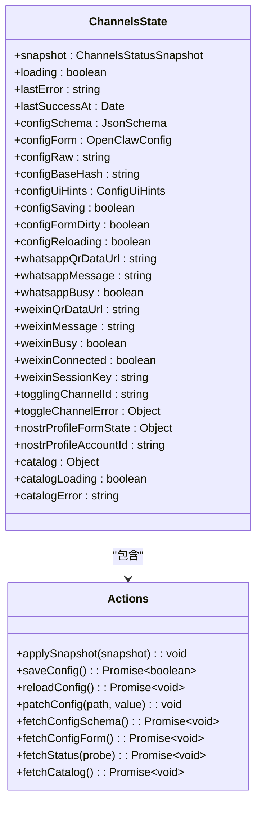
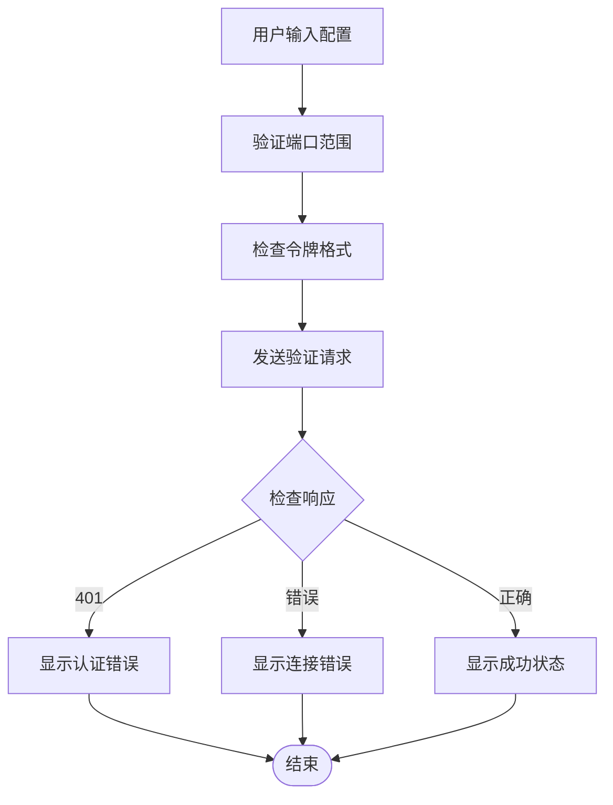
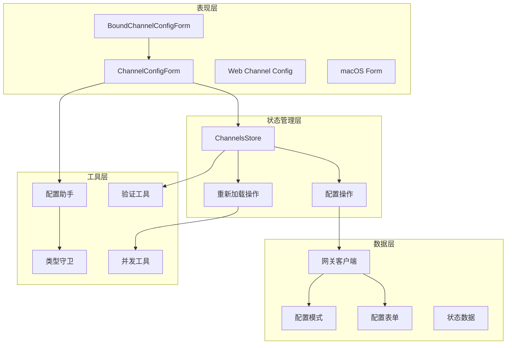

# 绑定通道配置表单

<cite>
**本文档引用的文件**
- [BoundChannelConfigForm.tsx](file://ui-react/src/components/channels/shared/BoundChannelConfigForm.tsx)
- [ChannelConfigForm.tsx](file://ui-react/src/components/channels/shared/ChannelConfigForm.tsx)
- [channels.store.ts](file://ui-react/src/store/channels.store.ts)
- [channels.config.ts](file://ui/src/ui/views/channels.config.ts)
- [channel-config-extras.ts](file://ui/src/ui/views/channel-config-extras.ts)
- [config-form.ts](file://ui/src/ui/views/config-form.ts)
- [ChannelConfigForm.swift](file://apps/macos/Sources/OpenClaw/ChannelConfigForm.swift)
- [options.html](file://assets/chrome-extension/options.html)
- [options.js](file://assets/chrome-extension/options.js)
- [options-validation.js](file://assets/chrome-extension/options-validation.js)
</cite>

## 更新摘要
**变更内容**
- 更新了绑定通道配置表单的重新加载功能，增强了 onReload 处理器的并发操作能力
- 新增了并发状态同步机制，确保配置重新加载时的状态一致性
- 改进了重新加载流程的用户体验和可靠性

## 目录
1. [简介](#简介)
2. [项目结构](#项目结构)
3. [核心组件](#核心组件)
4. [架构概览](#架构概览)
5. [详细组件分析](#详细组件分析)
6. [依赖关系分析](#依赖关系分析)
7. [性能考虑](#性能考虑)
8. [故障排除指南](#故障排除指南)
9. [结论](#结论)

## 简介

绑定通道配置表单是 OpenClaw 项目中的一个关键功能模块，它为用户提供了统一的界面来配置和管理不同通信渠道（channels）的设置。该功能支持多种平台和渠道类型，包括 Web、React、Electron 和 macOS 应用程序。

这个系统的核心目标是提供一个直观、一致的用户体验，让用户能够轻松地配置各种通信渠道的参数，如 API 密钥、连接设置、消息路由规则等。通过绑定配置表单，用户可以针对特定的渠道 ID 进行配置，并实时保存更改。

**更新** 系统现已增强了重新加载功能，onReload 处理器现在执行并发操作以确保配置状态的同步和一致性。

## 项目结构

OpenClaw 项目采用多平台架构设计，包含以下主要组件：

**图表来源**
- [BoundChannelConfigForm.tsx:1-34](file://ui-react/src/components/channels/shared/BoundChannelConfigForm.tsx#L1-L34)
- [channels.store.ts:108-143](file://ui-react/src/store/channels.store.ts#L108-L143)

**章节来源**
- [BoundChannelConfigForm.tsx:1-34](file://ui-react/src/components/channels/shared/BoundChannelConfigForm.tsx#L1-L34)
- [channels.store.ts:108-143](file://ui-react/src/store/channels.store.ts#L108-L143)

## 核心组件

绑定通道配置表单系统由多个核心组件组成，每个组件都有特定的功能和职责：

### 主要组件架构

**图表来源**
- [BoundChannelConfigForm.tsx:9-34](file://ui-react/src/components/channels/shared/BoundChannelConfigForm.tsx#L9-L34)
- [ChannelConfigForm.tsx:260-323](file://ui-react/src/components/channels/shared/ChannelConfigForm.tsx#L260-L323)
- [channels.store.ts:224-253](file://ui-react/src/store/channels.store.ts#L224-L253)

### 配置状态管理

配置表单的状态管理采用了集中式存储模式，确保所有组件都能访问最新的配置数据：

| 状态属性 | 类型 | 描述 | 默认值 |
|---------|------|------|--------|
| configForm | Object | 完整的配置对象 | null |
| configSchema | Object | 配置模式定义 | null |
| configUiHints | Object | UI 提示信息 | {} |
| configSaving | boolean | 是否正在保存 | false |
| configSchemaLoading | boolean | 是否正在加载模式 | false |
| configFormDirty | boolean | 配置是否已修改 | false |
| configReloading | boolean | 是否正在重新加载 | false |
| lastError | string | 最后一次错误信息 | null |

**更新** 新增了 `configReloading` 状态属性，用于跟踪重新加载操作的执行状态。

**章节来源**
- [channels.store.ts:114-121](file://ui-react/src/store/channels.store.ts#L114-L121)

## 架构概览

绑定通道配置表单系统采用分层架构设计，实现了跨平台的一致性体验：

**图表来源**
- [BoundChannelConfigForm.tsx:27-30](file://ui-react/src/components/channels/shared/BoundChannelConfigForm.tsx#L27-L30)
- [channels.store.ts:224-247](file://ui-react/src/store/channels.store.ts#L224-L247)

### 平台适配层

系统支持多种平台，每种平台都有相应的适配器：

| 平台 | 文件 | 特点 |
|------|------|------|
| React/Web | BoundChannelConfigForm.tsx | 响应式界面，状态管理 |
| Web/Lit | channels.config.ts | 原生 Web 组件，轻量级 |
| macOS | ChannelConfigForm.swift | SwiftUI 原生界面 |
| Electron | assets/chrome-extension/ | 浏览器扩展界面 |

**章节来源**
- [ChannelConfigForm.swift:348-363](file://apps/macos/Sources/OpenClaw/ChannelConfigForm.swift#L348-L363)
- [options.html:1-201](file://assets/chrome-extension/options.html#L1-L201)

## 详细组件分析

### BoundChannelConfigForm 组件

BoundChannelConfigForm 是一个包装器组件，它简化了通道配置表单的使用方式：

**更新** 重新加载流程现在使用并发操作，通过 `Promise.all` 同时执行配置重新加载和状态获取，提高了响应速度和用户体验。

**图表来源**
- [BoundChannelConfigForm.tsx:9-34](file://ui-react/src/components/channels/shared/BoundChannelConfigForm.tsx#L9-L34)

#### 关键特性

1. **自动状态管理**: 组件从 ChannelsStore 自动获取所有必要的配置状态
2. **简化接口**: 外部调用者只需提供 `channelId` 和 `onSaved` 回调函数
3. **事件绑定**: 自动绑定配置变更、保存和重新加载事件
4. **并发重新加载**: onReload 处理器现在执行并发操作以确保状态同步

**章节来源**
- [BoundChannelConfigForm.tsx:5-8](file://ui-react/src/components/channels/shared/BoundChannelConfigForm.tsx#L5-L8)

### ChannelConfigForm 组件

ChannelConfigForm 是核心的配置表单组件，负责渲染和处理配置输入：

#### 表单渲染流程

**更新** 新增了重新加载状态检查，当配置处于重新加载状态时会禁用相关按钮，防止用户进行冲突操作。

**图表来源**
- [ChannelConfigForm.tsx:286-323](file://ui-react/src/components/channels/shared/ChannelConfigForm.tsx#L286-L323)

#### 额外通道字段

配置表单还支持显示一些额外的通道状态字段：

| 字段名 | 类型 | 描述 |
|--------|------|------|
| groupPolicy | string/number/boolean | 群组策略设置 |
| streamMode | string/number/boolean | 流模式配置 |
| dmPolicy | string/number/boolean | 私信策略设置 |

**章节来源**
- [ChannelConfigForm.tsx:299-300](file://ui-react/src/components/channels/shared/ChannelConfigForm.tsx#L299-L300)

### 配置状态管理

ChannelsStore 提供了完整的配置状态管理功能：

#### 存储状态结构

**更新** 新增了 `configReloading` 状态属性，用于跟踪重新加载操作的执行状态。

**图表来源**
- [channels.store.ts:108-143](file://ui-react/src/store/channels.store.ts#L108-L143)
- [channels.store.ts:224-253](file://ui-react/src/store/channels.store.ts#L224-L253)

**章节来源**
- [channels.store.ts:102-143](file://ui-react/src/store/channels.store.ts#L102-L143)

### 跨平台配置验证

系统还包括浏览器扩展的配置验证功能：

#### 验证流程

**图表来源**
- [options.js:26-49](file://assets/chrome-extension/options.js#L26-L49)
- [options-validation.js:7-42](file://assets/chrome-extension/options-validation.js#L7-L42)

**章节来源**
- [options.html:180-193](file://assets/chrome-extension/options.html#L180-L193)
- [options.js:26-75](file://assets/chrome-extension/options.js#L26-L75)
- [options-validation.js:1-58](file://assets/chrome-extension/options-validation.js#L1-L58)

## 依赖关系分析

绑定通道配置表单系统的依赖关系展现了清晰的分层架构：

**更新** 新增了并发操作相关的依赖关系，展示了重新加载功能的并发处理能力。

**图表来源**
- [BoundChannelConfigForm.tsx:1-3](file://ui-react/src/components/channels/shared/BoundChannelConfigForm.tsx#L1-L3)
- [channels.store.ts:224-253](file://ui-react/src/store/channels.store.ts#L224-L253)

### 关键依赖关系

1. **状态依赖**: 所有表单组件都依赖于 ChannelsStore 来获取和更新配置状态
2. **网关通信**: 通过网关客户端进行配置的持久化和同步
3. **配置验证**: 使用配置助手和验证工具确保数据完整性
4. **跨平台兼容**: 通过抽象层实现不同平台间的统一行为
5. **并发处理**: 重新加载功能现在支持并发操作以提高性能

**章节来源**
- [ChannelConfigForm.tsx:260-275](file://ui-react/src/components/channels/shared/ChannelConfigForm.tsx#L260-L275)
- [channels.store.ts:224-247](file://ui-react/src/store/channels.store.ts#L224-L247)

## 性能考虑

绑定通道配置表单系统在设计时充分考虑了性能优化：

### 渲染优化策略

1. **条件渲染**: 只在需要时渲染配置表单，避免不必要的 DOM 操作
2. **状态缓存**: ChannelsStore 缓存配置模式和表单数据，减少重复请求
3. **懒加载**: 配置模式按需加载，提高初始渲染速度
4. **并发重新加载**: 使用 Promise.all 同时执行多个异步操作，提升响应速度

### 网络优化

1. **批量更新**: 支持批量配置更新，减少网络往返次数
2. **增量同步**: 使用 baseHash 进行增量配置同步，避免全量传输
3. **错误重试**: 实现智能重试机制，提高网络请求成功率
4. **并发状态获取**: 重新加载时同时获取配置和状态信息，减少等待时间

### 内存管理

1. **状态清理**: 及时清理不再使用的配置数据
2. **事件解绑**: 正确管理事件监听器，防止内存泄漏
3. **组件卸载**: 在组件卸载时清理相关资源
4. **并发状态管理**: 重新加载过程中正确管理状态更新

**更新** 新增了并发操作的性能优化策略，包括并发状态获取和重新加载优化。

## 故障排除指南

### 常见问题及解决方案

#### 配置模式加载失败

**症状**: 配置表单显示"模式不可用"

**可能原因**:
1. 网关服务器未响应
2. 插件未正确注册配置模式
3. 网络连接问题

**解决步骤**:
1. 检查网关服务器状态
2. 重启相关插件
3. 验证网络连接
4. 刷新页面重新加载

#### 配置保存失败

**症状**: 保存按钮显示"保存失败"

**可能原因**:
1. 配置数据格式错误
2. 权限不足
3. 网关服务器错误

**解决步骤**:
1. 检查配置数据格式
2. 验证用户权限
3. 查看网关日志
4. 尝试重新登录

#### 跨平台兼容性问题

**症状**: 不同平台显示效果不一致

**解决步骤**:
1. 检查平台特定的样式问题
2. 验证平台 API 兼容性
3. 更新平台版本
4. 联系技术支持

#### 并发重新加载问题

**症状**: 重新加载功能响应缓慢或出现状态不一致

**可能原因**:
1. 网络延迟导致并发操作超时
2. 状态更新冲突
3. 并发操作过多

**解决步骤**:
1. 检查网络连接质量
2. 减少同时进行的操作数量
3. 等待当前并发操作完成
4. 重新尝试重新加载

**更新** 新增了并发重新加载相关的故障排除指南。

**章节来源**
- [ChannelConfigForm.tsx:302-308](file://ui-react/src/components/channels/shared/ChannelConfigForm.tsx#L302-L308)
- [channels.store.ts:241-243](file://ui-react/src/store/channels.store.ts#L241-L243)

## 结论

绑定通道配置表单系统展现了现代前端架构的最佳实践，通过清晰的分层设计、跨平台兼容性和强大的状态管理，为用户提供了优秀的配置体验。

**更新** 系统现已增强了重新加载功能，onReload 处理器现在执行并发操作以确保配置状态的同步和一致性，显著提升了用户体验和系统性能。

### 主要优势

1. **一致性**: 统一的界面和交互模式，适用于所有平台
2. **可扩展性**: 模块化的架构设计，易于添加新的通道类型
3. **可靠性**: 完善的错误处理和恢复机制
4. **性能**: 优化的渲染和网络请求策略，包括并发操作支持
5. **并发处理**: 智能的并发操作管理，确保状态同步

### 技术亮点

- 响应式状态管理
- 跨平台 UI 组件
- 智能配置验证
- 实时错误反馈
- 并发重新加载操作
- 状态同步保障机制

这个系统为 OpenClaw 项目提供了坚实的基础，支持未来功能的扩展和改进。通过持续的优化和维护，它将继续为用户提供卓越的配置管理体验。