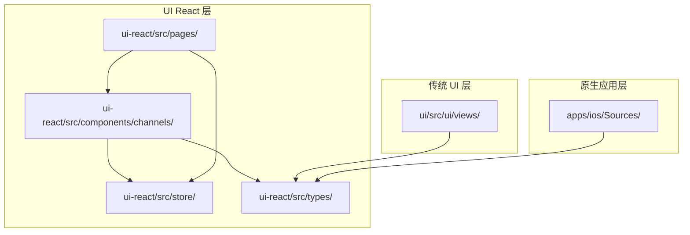
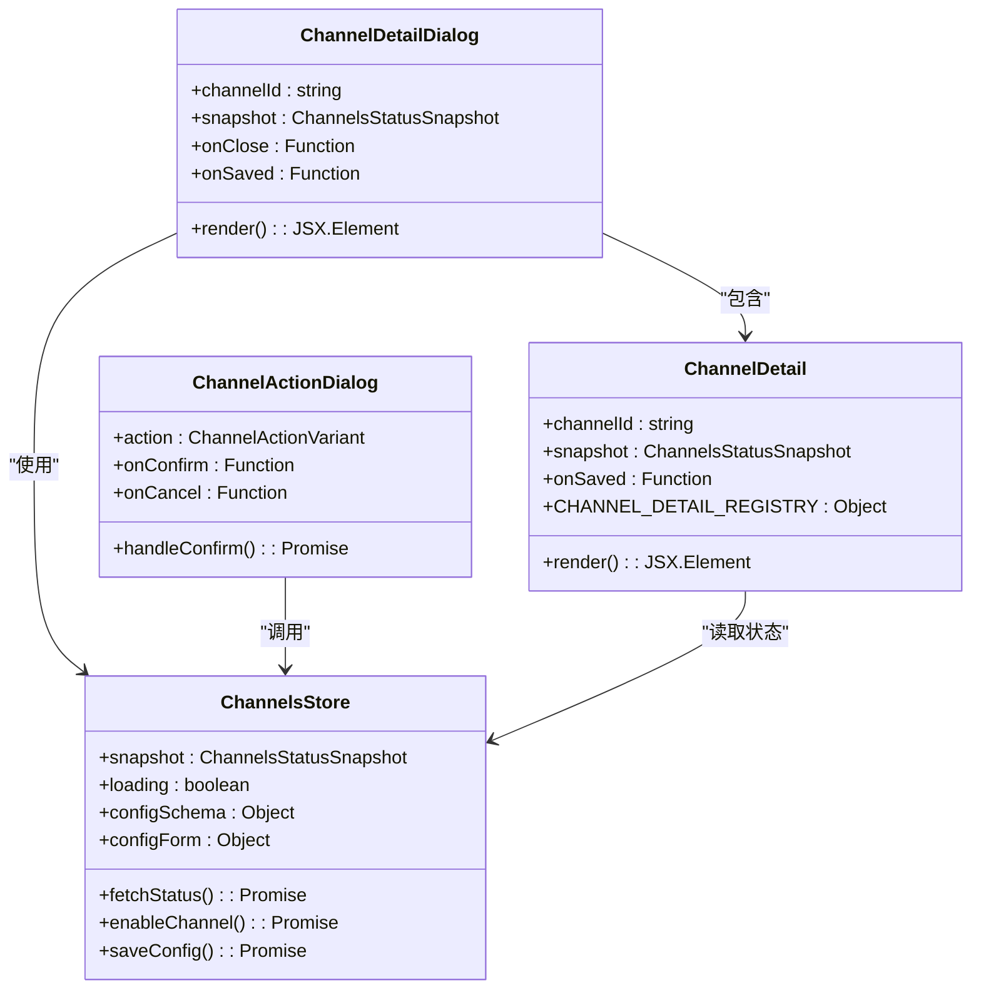
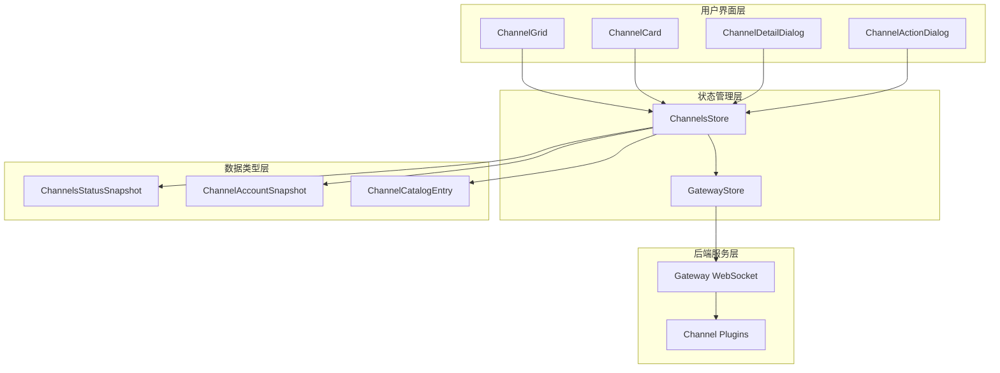
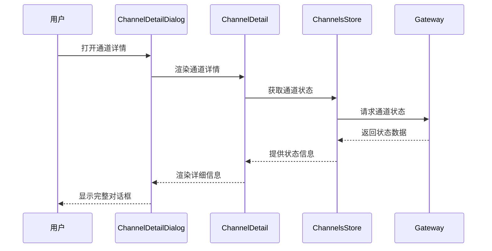
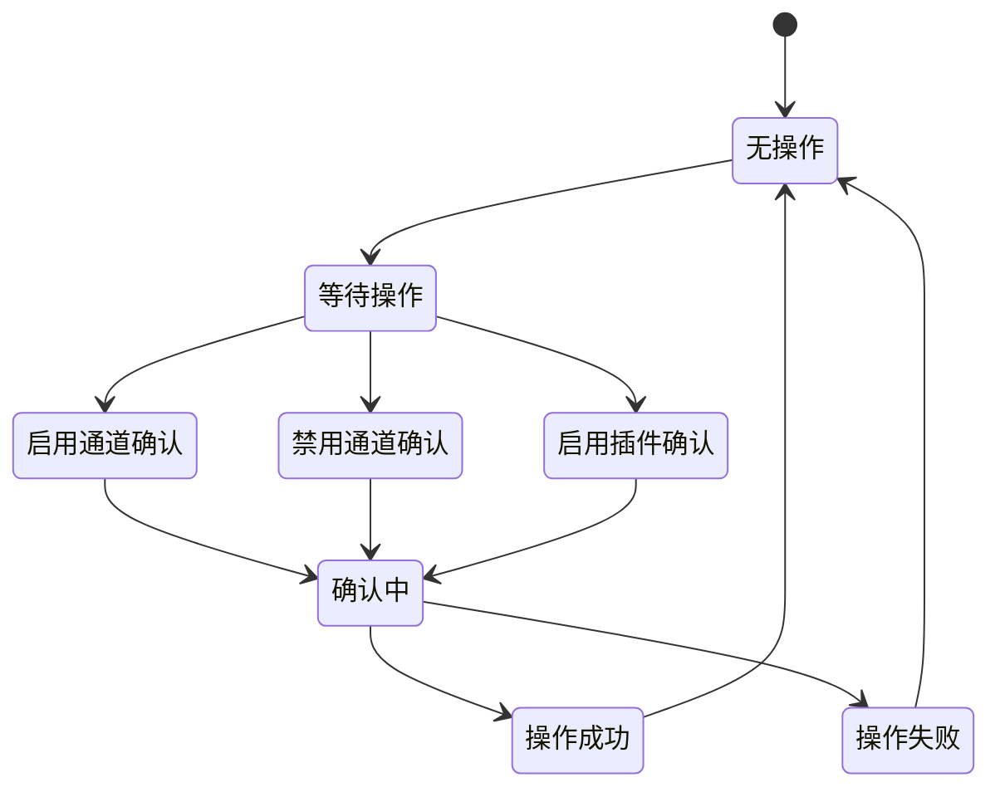
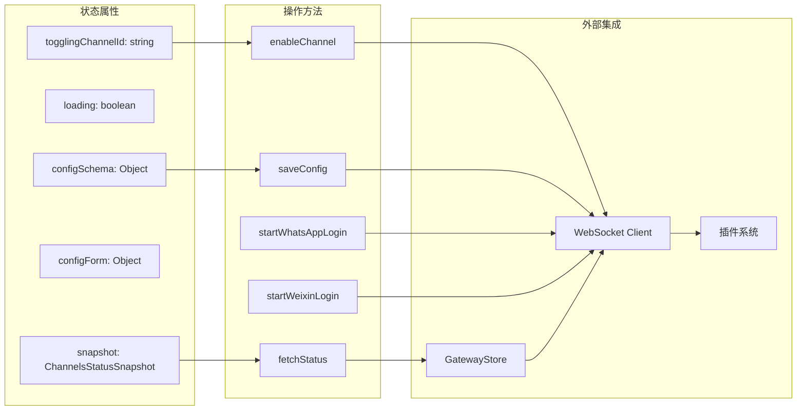
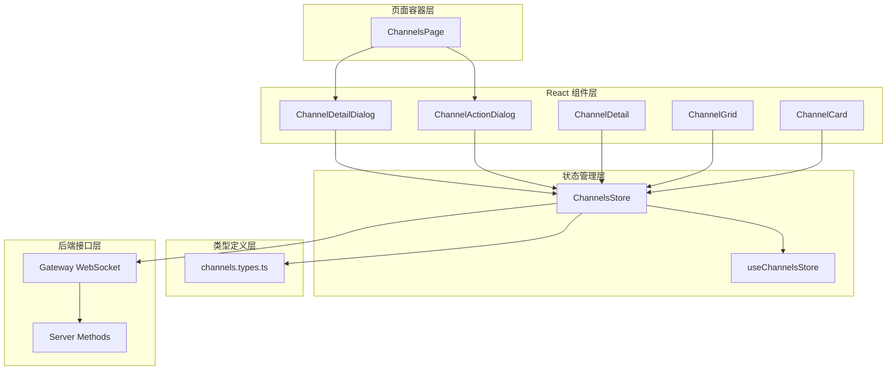

# 统一通道操作对话框系统

<cite>
**本文档引用的文件**
- [ChannelDetailDialog.tsx](file://ui-react/src/components/channels/ChannelDetailDialog.tsx)
- [ChannelGrid.tsx](file://ui-react/src/components/channels/ChannelGrid.tsx)
- [ChannelActionDialog.tsx](file://ui-react/src/components/channels/ChannelActionDialog.tsx)
- [ChannelDetail.tsx](file://ui-react/src/components/channels/ChannelDetail.tsx)
- [channels.store.ts](file://ui-react/src/store/channels.store.ts)
- [channels.types.ts](file://ui-react/src/types/channels.ts)
- [ChannelsPage.tsx](file://ui-react/src/pages/ChannelsPage.tsx)
- [channels.config.ts](file://ui/src/ui/views/channels.config.ts)
- [NodeCapabilityRouter.swift](file://apps/ios/Sources/Capabilities/NodeCapabilityRouter.swift)
</cite>

## 目录
1. [简介](#简介)
2. [项目结构](#项目结构)
3. [核心组件](#核心组件)
4. [架构概览](#架构概览)
5. [详细组件分析](#详细组件分析)
6. [依赖关系分析](#依赖关系分析)
7. [性能考虑](#性能考虑)
8. [故障排除指南](#故障排除指南)
9. [结论](#结论)

## 简介

统一通道操作对话框系统是 OpenClaw 项目中的一个关键用户界面组件，它为用户提供了统一的界面来管理各种通信渠道（channels）。该系统通过对话框的形式，让用户能够查看、配置和控制不同类型的通信渠道，包括 WhatsApp、Telegram、Discord、Slack 等。

该系统的核心目标是提供一个一致的用户体验，无论用户在管理哪种类型的通信渠道，都能使用相同的界面模式和交互方式。系统支持多种操作，如启用/禁用渠道、查看详细状态信息、编辑配置等。

## 项目结构

OpenClaw 项目采用现代化的前端架构，主要包含以下关键目录：



**图表来源**
- [ChannelDetailDialog.tsx:1-43](file://ui-react/src/components/channels/ChannelDetailDialog.tsx#L1-L43)
- [channels.store.ts:1-507](file://ui-react/src/store/channels.store.ts#L1-L507)

**章节来源**
- [ChannelDetailDialog.tsx:1-43](file://ui-react/src/components/channels/ChannelDetailDialog.tsx#L1-L43)
- [ChannelGrid.tsx:1-48](file://ui-react/src/components/channels/ChannelGrid.tsx#L1-L48)
- [channels.store.ts:1-507](file://ui-react/src/store/channels.store.ts#L1-L507)

## 核心组件

统一通道操作对话框系统由多个相互协作的组件构成，每个组件都有特定的功能和职责：

### 主要组件架构



**图表来源**
- [ChannelDetailDialog.tsx:6-43](file://ui-react/src/components/channels/ChannelDetailDialog.tsx#L6-L43)
- [ChannelActionDialog.tsx:26-95](file://ui-react/src/components/channels/ChannelActionDialog.tsx#L26-L95)
- [ChannelDetail.tsx:161-170](file://ui-react/src/components/channels/ChannelDetail.tsx#L161-L170)
- [channels.store.ts:41-104](file://ui-react/src/store/channels.store.ts#L41-L104)

### 数据类型定义

系统使用 TypeScript 类型定义来确保数据结构的一致性和类型安全：

| 类型名称 | 描述 | 关键字段 |
|---------|------|----------|
| ChannelsStatusSnapshot | 通道状态快照 | channelOrder, channelLabels, channels, channelAccounts |
| ChannelAccountSnapshot | 通道账户快照 | accountId, enabled, configured, running, lastError |
| ChannelCatalogEntry | 通道目录条目 | id, label, detailLabel, installed, pluginId |
| NostrProfile | Nostr 用户资料 | name, displayName, about, picture |

**章节来源**
- [channels.types.ts:50-60](file://ui-react/src/types/channels.ts#L50-L60)
- [channels.types.ts:15-48](file://ui-react/src/types/channels.ts#L15-L48)
- [channels.types.ts:272-286](file://ui-react/src/types/channels.ts#L272-L286)
- [channels.types.ts:249-268](file://ui-react/src/types/channels.ts#L249-L268)

## 架构概览

统一通道操作对话框系统采用分层架构设计，确保了良好的可维护性和扩展性：



**图表来源**
- [ChannelsPage.tsx:365-398](file://ui-react/src/pages/ChannelsPage.tsx#L365-L398)
- [channels.store.ts:108-104](file://ui-react/src/store/channels.store.ts#L108-L104)
- [channels.types.ts:50-60](file://ui-react/src/types/channels.ts#L50-L60)

### 组件交互流程

系统的核心交互流程如下：

1. **状态获取**：ChannelsStore 通过 GatewayStore 获取通道状态
2. **界面渲染**：ChannelGrid 和 ChannelCard 基于状态渲染用户界面
3. **用户操作**：用户点击操作触发相应的对话框
4. **确认处理**：ChannelActionDialog 处理用户确认
5. **状态更新**：执行操作后刷新状态

**章节来源**
- [ChannelsPage.tsx:365-398](file://ui-react/src/pages/ChannelsPage.tsx#L365-L398)
- [channels.store.ts:163-180](file://ui-react/src/store/channels.store.ts#L163-L180)

## 详细组件分析

### 通道详情对话框

通道详情对话框是系统中最复杂的组件，负责显示单个通道的详细信息和提供配置选项：



**图表来源**
- [ChannelDetailDialog.tsx:6-43](file://ui-react/src/components/channels/ChannelDetailDialog.tsx#L6-L43)
- [ChannelDetail.tsx:19-39](file://ui-react/src/components/channels/ChannelDetail.tsx#L19-L39)
- [channels.store.ts:163-180](file://ui-react/src/store/channels.store.ts#L163-L180)

#### 特定通道详情组件

系统为不同类型的通道提供了专门的详情组件：

| 通道类型 | 组件名称 | 特殊功能 |
|---------|----------|----------|
| WhatsApp | WhatsAppDetail | QR 登录、连接状态监控 |
| Weixin | WeixinDetail | 微信登录流程 |
| Nostr | NostrDetail | 用户资料编辑 |
| 默认 | GenericDetail | 通用状态显示 |

**章节来源**
- [ChannelDetail.tsx:41-74](file://ui-react/src/components/channels/ChannelDetail.tsx#L41-L74)
- [ChannelDetail.tsx:76-104](file://ui-react/src/components/channels/ChannelDetail.tsx#L76-L104)
- [ChannelDetail.tsx:106-145](file://ui-react/src/components/channels/ChannelDetail.tsx#L106-L145)

### 通道网格和卡片

通道网格组件负责展示所有可用的通道，并提供基本的操作入口：

```mermaid
flowchart TD
A[ChannelGrid 接收 channelIds] --> B{列表是否为空?}
B --> |是| C[显示 "None." 占位符]
B --> |否| D[创建 2 列网格布局]
D --> E[遍历每个 channelId]
E --> F[解析标签和详细信息]
E --> G[创建 ChannelCard]
G --> H[绑定打开、启用、禁用事件]
H --> I[返回完整网格]
```

**图表来源**
- [ChannelGrid.tsx:8-48](file://ui-react/src/components/channels/ChannelGrid.tsx#L8-L48)
- [ChannelCard.tsx:21-49](file://ui-react/src/components/channels/ChannelCard.tsx#L21-L49)

#### 通道卡片状态指示器

通道卡片使用颜色点来表示通道的运行状态：

| 颜色 | 状态 | 条件 |
|------|------|------|
| 绿色 | 运行中 | accounts.some(a => a.running) |
| 黄色 | 配置中 | enabled && (accounts.length === 0 || !configured) |
| 红色 | 错误 | accounts.some(a => a.lastError) |
| 灰色 | 已禁用 | 其他情况 |

**章节来源**
- [ChannelGrid.tsx:21-23](file://ui-react/src/components/channels/ChannelGrid.tsx#L21-L23)
- [ChannelCard.tsx:32-40](file://ui-react/src/components/channels/ChannelCard.tsx#L32-L40)

### 统一操作确认对话框

统一操作确认对话框处理所有与通道相关的操作确认：



**图表来源**
- [ChannelActionDialog.tsx:35-45](file://ui-react/src/components/channels/ChannelActionDialog.tsx#L35-L45)
- [ChannelActionDialog.tsx:73-95](file://ui-react/src/components/channels/ChannelActionDialog.tsx#L73-L95)

#### 操作类型定义

系统支持三种类型的操作确认：

| 操作类型 | 参数 | 行为 |
|---------|------|------|
| enable-channel | channelId, label | 启用指定通道 |
| disable-channel | channelId, label | 禁用指定通道 |
| enable-plugin | pluginId, label | 启用提供通道的插件 |

**章节来源**
- [ChannelActionDialog.tsx:16-19](file://ui-react/src/components/channels/ChannelActionDialog.tsx#L16-L19)
- [ChannelActionDialog.tsx:53-65](file://ui-react/src/components/channels/ChannelActionDialog.tsx#L53-L65)

### 状态存储管理

ChannelsStore 是整个系统的状态管理中心，负责协调所有与通道相关的数据：



**图表来源**
- [channels.store.ts:41-104](file://ui-react/src/store/channels.store.ts#L41-L104)
- [channels.store.ts:108-104](file://ui-react/src/store/channels.store.ts#L108-L104)

#### 异步操作处理

系统使用 Promise 和 async/await 来处理所有异步操作，确保操作的可靠性和用户体验：

| 操作类型 | 方法名 | 返回值 | 错误处理 |
|---------|--------|--------|----------|
| 状态获取 | fetchStatus | Promise<void> | 设置 lastError |
| 通道启用 | enableChannel | Promise<void> | 更新 toggleChannelError |
| 配置保存 | saveConfig | Promise<boolean> | 返回操作结果 |
| WhatsApp 登录 | startWhatsAppLogin | Promise<void> | 设置 whatsappMessage |

**章节来源**
- [channels.store.ts:163-180](file://ui-react/src/store/channels.store.ts#L163-L180)
- [channels.store.ts:255-273](file://ui-react/src/store/channels.store.ts#L255-L273)
- [channels.store.ts:224-247](file://ui-react/src/store/channels.store.ts#L224-L247)

## 依赖关系分析

统一通道操作对话框系统具有清晰的依赖关系，确保了模块间的松耦合：



**图表来源**
- [ChannelsPage.tsx:365-398](file://ui-react/src/pages/ChannelsPage.tsx#L365-L398)
- [channels.store.ts:108-104](file://ui-react/src/store/channels.store.ts#L108-L104)
- [channels.types.ts:1-317](file://ui-react/src/types/channels.ts#L1-L317)

### 外部依赖

系统依赖于以下外部库和框架：

| 依赖项 | 版本 | 用途 |
|-------|------|------|
| React | 最新版本 | 用户界面构建 |
| Zustand | 最新版本 | 状态管理 |
| Lucide React | 最新版本 | 图标组件 |
| Tailwind CSS | 最新版本 | 样式系统 |

**章节来源**
- [ChannelActionDialog.tsx:1-14](file://ui-react/src/components/channels/ChannelActionDialog.tsx#L1-L14)
- [channels.store.ts:1-8](file://ui-react/src/store/channels.store.ts#L1-L8)

## 性能考虑

统一通道操作对话框系统在设计时充分考虑了性能优化：

### 渲染优化策略

1. **条件渲染**：只有在需要时才渲染特定的通道详情组件
2. **状态缓存**：使用状态管理减少不必要的重新渲染
3. **懒加载**：对话框内容按需加载，避免一次性渲染大量数据

### 异步操作优化

1. **超时机制**：所有网络请求都设置了合理的超时时间
2. **错误恢复**：操作失败时提供清晰的错误信息和重试机制
3. **并发控制**：限制同时进行的操作数量，避免系统过载

### 内存管理

1. **状态清理**：对话框关闭时自动清理相关状态
2. **资源释放**：及时释放图片和媒体资源
3. **垃圾回收**：合理管理大对象的生命周期

## 故障排除指南

### 常见问题及解决方案

#### 对话框无法打开

**症状**：点击通道卡片后对话框不显示

**可能原因**：
1. channelId 为 null
2. snapshot 未正确加载
3. 网络连接问题

**解决步骤**：
1. 检查 channelId 是否有效
2. 验证 snapshot 数据完整性
3. 确认网络连接正常

#### 操作确认对话框显示错误

**症状**：确认对话框显示错误的标题或描述

**可能原因**：
1. action 参数传递错误
2. 状态管理异常
3. 组件渲染问题

**解决步骤**：
1. 验证 action 对象结构
2. 检查状态管理逻辑
3. 重新初始化组件

#### 配置保存失败

**症状**：点击保存按钮后配置未更新

**可能原因**：
1. 网络请求超时
2. 配置格式错误
3. 权限不足

**解决步骤**：
1. 检查网络连接稳定性
2. 验证配置格式正确性
3. 确认用户权限设置

**章节来源**
- [ChannelDetailDialog.tsx:24-25](file://ui-react/src/components/channels/ChannelDetailDialog.tsx#L24-L25)
- [ChannelActionDialog.tsx:73-95](file://ui-react/src/components/channels/ChannelActionDialog.tsx#L73-L95)
- [channels.store.ts:224-247](file://ui-react/src/store/channels.store.ts#L224-L247)

## 结论

统一通道操作对话框系统通过精心设计的架构和组件化结构，成功地为用户提供了统一且高效的通道管理体验。系统的主要优势包括：

### 设计优势

1. **一致性**：所有通道类型使用相同的界面模式和交互方式
2. **可扩展性**：模块化的组件设计便于添加新的通道类型
3. **可靠性**：完善的错误处理和状态管理机制
4. **性能**：优化的渲染策略和异步操作处理

### 技术亮点

1. **类型安全**：完整的 TypeScript 类型定义确保代码质量
2. **状态管理**：Zustand 提供轻量级但强大的状态管理
3. **响应式设计**：适配不同屏幕尺寸和设备类型
4. **国际化支持**：内置多语言支持能力

### 未来发展方向

1. **移动端优化**：进一步优化移动设备上的用户体验
2. **无障碍访问**：增强无障碍功能支持
3. **性能监控**：集成更详细的性能监控和分析
4. **自动化测试**：增加自动化测试覆盖率

该系统为 OpenClaw 项目提供了一个坚实的基础，使得用户能够轻松管理和配置各种通信渠道，同时为未来的功能扩展奠定了良好的技术基础。