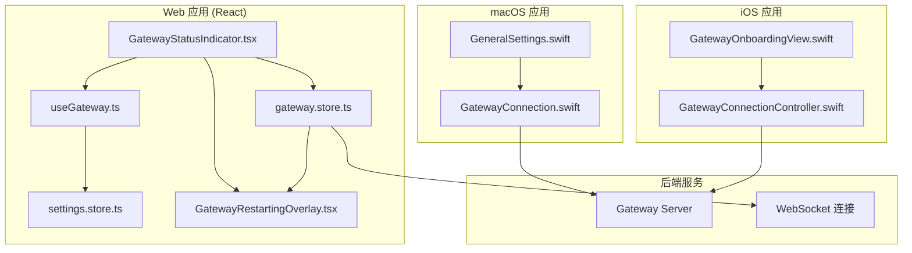
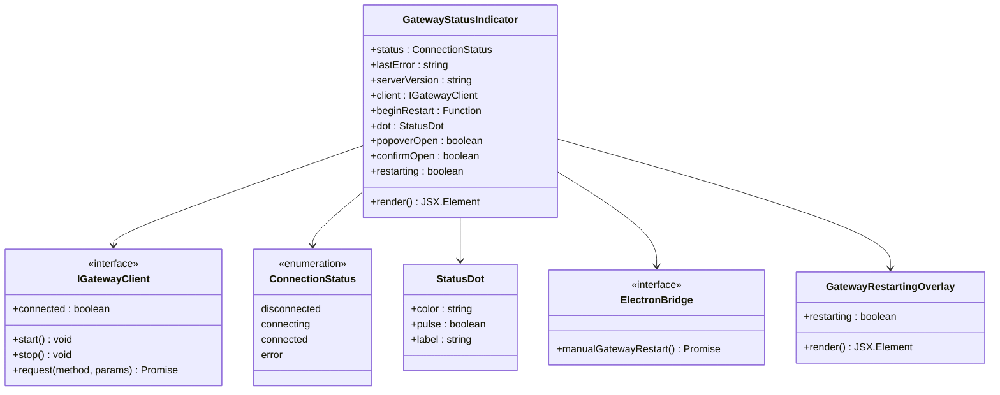
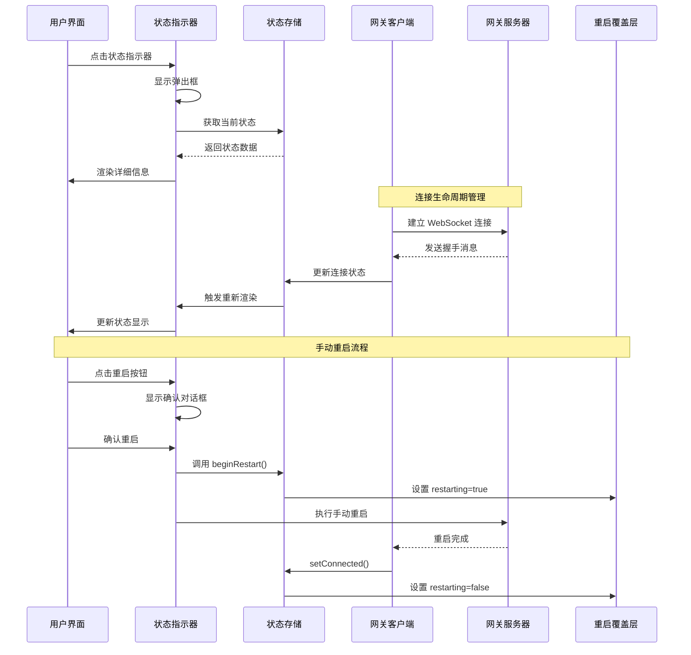
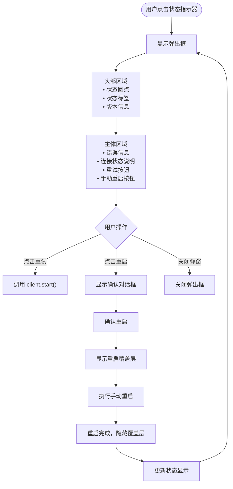
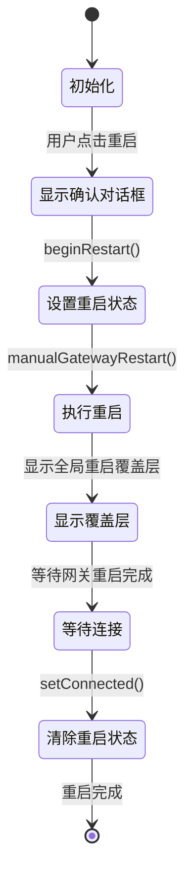
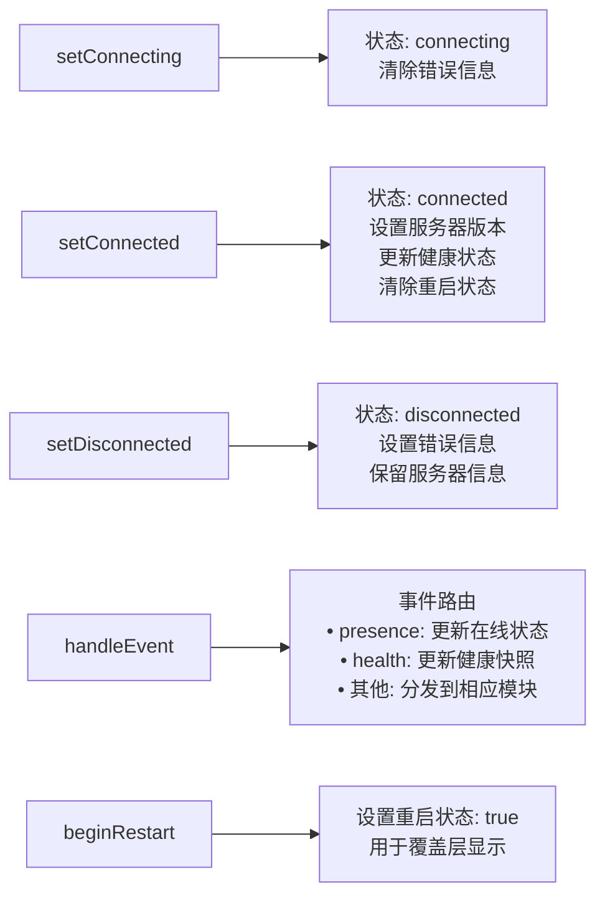
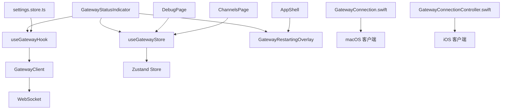
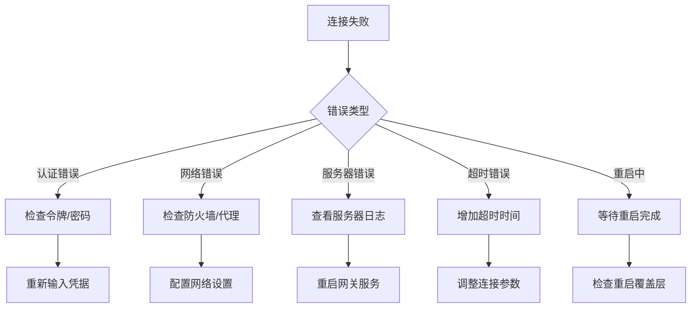

# 网关状态指示器

<cite>
**本文档引用的文件**
- [GatewayStatusIndicator.tsx](file://ui-react/src/components/gateway/GatewayStatusIndicator.tsx)
- [GatewayRestartingOverlay.tsx](file://ui-react/src/components/gateway/GatewayRestartingOverlay.tsx)
- [gateway.store.ts](file://ui-react/src/store/gateway.store.ts)
- [useGateway.ts](file://ui-react/src/hooks/useGateway.ts)
- [gateway.ts](file://ui-react/src/types/gateway.ts)
- [settings.store.ts](file://ui-react/src/store/settings.store.ts)
- [DebugPage.tsx](file://ui-react/src/pages/DebugPage.tsx)
- [GatewayConnection.swift](file://apps/macos/Sources/OpenClaw/GatewayConnection.swift)
- [GatewayConnectionController.swift](file://apps/ios/Sources/Gateway/GatewayConnectionController.swift)
- [GeneralSettings.swift](file://apps/macos/Sources/OpenClaw/GeneralSettings.swift)
- [GatewayOnboardingView.swift](file://apps/ios/Sources/Onboarding/GatewayOnboardingView.swift)
- [status-all.ts](file://src/commands/status-all.ts)
- [audit.ts](file://src/security/audit.ts)
- [AppShell.tsx](file://ui-react/src/components/layout/AppShell.tsx)
- [ChannelsPage.tsx](file://ui-react/src/pages/ChannelsPage.tsx)
</cite>

## 更新摘要
**所做更改**
- 增强了网关状态指示器组件，增加了手动重启功能
- 新增了确认对话框，提供安全的重启操作
- 添加了旋转图标反馈，改善用户交互体验
- 集成了全局重启覆盖层系统，提供一致的重启状态提示
- 更新了状态管理，支持重启状态跟踪和自动清理

## 目录
1. [简介](#简介)
2. [项目结构](#项目结构)
3. [核心组件](#核心组件)
4. [架构概览](#架构概览)
5. [详细组件分析](#详细组件分析)
6. [依赖关系分析](#依赖关系分析)
7. [性能考虑](#性能考虑)
8. [故障排除指南](#故障排除指南)
9. [结论](#结论)

## 简介

网关状态指示器是 OpenClaw 生态系统中的关键用户界面组件，用于实时显示网关连接状态、健康状况和服务器版本信息。该组件为用户提供直观的状态反馈，支持连接重试、错误诊断和状态详情查看等功能。

**更新** 该组件现已增强，增加了手动重启功能、确认对话框、旋转图标反馈和与全局重启覆盖层系统的集成，为用户提供了更完善的网关管理体验。

该指示器在多个平台（Web、macOS、iOS）中实现，确保跨平台一致的用户体验。通过状态点的颜色编码（绿色连接、琥珀色连接中、红色断开/错误）和详细的弹出内容，用户可以快速了解网关的运行状况。

## 项目结构

OpenClaw 项目采用多平台架构设计，网关状态指示器作为前端组件分布在不同的应用中：



**图表来源**
- [GatewayStatusIndicator.tsx:1-187](file://ui-react/src/components/gateway/GatewayStatusIndicator.tsx#L1-L187)
- [gateway.store.ts:1-212](file://ui-react/src/store/gateway.store.ts#L1-L212)
- [GatewayRestartingOverlay.tsx:1-42](file://ui-react/src/components/gateway/GatewayRestartingOverlay.tsx#L1-L42)

**章节来源**
- [GatewayStatusIndicator.tsx:1-187](file://ui-react/src/components/gateway/GatewayStatusIndicator.tsx#L1-L187)
- [gateway.store.ts:1-212](file://ui-react/src/store/gateway.store.ts#L1-L212)

## 核心组件

### 状态指示器组件

网关状态指示器是一个 React 组件，提供以下核心功能：

- **状态可视化**：使用彩色圆点表示连接状态
- **交互式弹出框**：显示详细状态信息和操作选项
- **自动重连**：在断开时提供重试机制
- **版本显示**：展示服务器版本信息
- **手动重启**：支持 Electron 平台的手动重启功能
- **确认对话框**：提供安全的重启操作确认
- **旋转图标反馈**：重启过程中的视觉反馈



**图表来源**
- [GatewayStatusIndicator.tsx:40-73](file://ui-react/src/components/gateway/GatewayStatusIndicator.tsx#L40-L73)
- [GatewayRestartingOverlay.tsx:20-42](file://ui-react/src/components/gateway/GatewayRestartingOverlay.tsx#L20-L42)
- [gateway.store.ts:32-76](file://ui-react/src/store/gateway.store.ts#L32-L76)

### 状态管理

状态管理通过 Zustand 实现，包含以下关键状态：

- **连接状态**：disconnected、connecting、connected、error
- **错误信息**：lastError 和 lastErrorCode
- **服务器信息**：serverVersion
- **客户端实例**：IGatewayClient
- **重启状态**：restarting - 新增的状态标志
- **重启开始**：beginRestart - 新增的动作函数

**章节来源**
- [gateway.store.ts:41-76](file://ui-react/src/store/gateway.store.ts#L41-L76)
- [gateway.store.ts:103-126](file://ui-react/src/store/gateway.store.ts#L103-L126)

## 架构概览

网关状态指示器采用分层架构设计，确保组件间的松耦合和高内聚：



**图表来源**
- [useGateway.ts:454-500](file://ui-react/src/hooks/useGateway.ts#L454-L500)
- [gateway.store.ts:87-126](file://ui-react/src/store/gateway.store.ts#L87-L126)
- [GatewayStatusIndicator.tsx:60-73](file://ui-react/src/components/gateway/GatewayStatusIndicator.tsx#L60-L73)

## 详细组件分析

### React 网关状态指示器

该组件实现了完整的状态指示功能，现已增强支持手动重启：

#### 状态映射表

| 状态值 | 颜色 | 动画效果 | 标签 |
|--------|------|----------|------|
| connected | bg-emerald-500 | 无脉冲 | Connected |
| connecting | bg-amber-400 | 脉冲动画 | Connecting… |
| disconnected | bg-red-500 | 无脉冲 | Disconnected |
| error | bg-red-500 | 无脉冲 | Error |

#### 弹出框内容结构



**图表来源**
- [GatewayStatusIndicator.tsx:55-73](file://ui-react/src/components/gateway/GatewayStatusIndicator.tsx#L55-L73)

**章节来源**
- [GatewayStatusIndicator.tsx:1-187](file://ui-react/src/components/gateway/GatewayStatusIndicator.tsx#L1-L187)

### 手动重启功能

**新增** 手动重启功能为 Electron 平台提供了直接的网关重启能力：

#### 重启流程



#### 确认对话框内容

- **标题**：重启网关？
- **描述**：网关将要重启，所有活动连接将被短暂中断并自动恢复
- **操作**：取消/重启

**章节来源**
- [GatewayStatusIndicator.tsx:165-184](file://ui-react/src/components/gateway/GatewayStatusIndicator.tsx#L165-L184)
- [GatewayRestartingOverlay.tsx:20-42](file://ui-react/src/components/gateway/GatewayRestartingOverlay.tsx#L20-L42)

### 状态存储管理

Zustand 状态管理提供了响应式的状态更新机制，现已增强支持重启状态：

#### 状态转换函数



**图表来源**
- [gateway.store.ts:87-181](file://ui-react/src/store/gateway.store.ts#L87-L181)
- [gateway.store.ts:126](file://ui-react/src/store/gateway.store.ts#L126)

**章节来源**
- [gateway.store.ts:72-212](file://ui-react/src/store/gateway.store.ts#L72-L212)

### 全局重启覆盖层系统

**新增** 全局重启覆盖层系统提供了统一的重启状态提示：

#### 覆盖层特性

- **自动显示**：当 `restarting` 状态为 `true` 时自动显示
- **自动隐藏**：当网关重新连接时自动隐藏
- **不可交互**：防止用户在重启过程中进行其他操作
- **视觉反馈**：旋转加载图标和状态文本

#### 集成位置

- **应用外壳**：在 `AppShell` 中全局集成
- **状态驱动**：通过 `useGatewayStore` 的 `restarting` 状态控制
- **自动清理**：重启完成后自动清理状态

**章节来源**
- [GatewayRestartingOverlay.tsx:11-42](file://ui-react/src/components/gateway/GatewayRestartingOverlay.tsx#L11-L42)
- [AppShell.tsx:101-102](file://ui-react/src/components/layout/AppShell.tsx#L101-L102)

## 依赖关系分析

### 组件间依赖



**图表来源**
- [GatewayStatusIndicator.tsx:1-8](file://ui-react/src/components/gateway/GatewayStatusIndicator.tsx#L1-L8)
- [useGateway.ts:1-10](file://ui-react/src/hooks/useGateway.ts#L1-L10)

### 平台特定实现

不同平台的网关连接实现具有相似的核心逻辑：

| 平台 | 关键特性 | 认证方式 | 连接管理 | 重启支持 |
|------|----------|----------|----------|----------|
| Web (React) | 设备身份验证、自动重连 | Ed25519 + 令牌 | WebSocket + Zustand | 手动重启（Electron） |
| macOS | Swift 实现、系统集成 | 令牌 + 密码 | Actor 模式 + URLSession | 本地重启 |
| iOS | SwiftUI 界面、原生体验 | 令牌 + TLS | Actor 模式 + URLSession | 本地重启 |

**章节来源**
- [GatewayConnection.swift:396-426](file://apps/macos/Sources/OpenClaw/GatewayConnection.swift#L396-L426)
- [GatewayConnectionController.swift:220-249](file://apps/ios/Sources/Gateway/GatewayConnectionController.swift#L220-L249)

## 性能考虑

### 连接优化策略

1. **指数退避重连**：初始延迟 800ms，最大 15 秒
2. **连接池管理**：避免重复连接和资源泄漏
3. **事件去抖动**：批量处理状态更新
4. **内存管理**：及时清理 WebSocket 和定时器
5. **重启状态管理**：避免重复重启请求

### 状态更新优化

- **局部状态更新**：仅更新受影响的组件
- **防抖机制**：避免频繁的状态切换闪烁
- **缓存策略**：缓存最近的健康状态和版本信息
- **重启状态优化**：通过全局覆盖层减少重复渲染

## 故障排除指南

### 常见问题诊断

#### 连接失败排查



#### 状态异常处理

1. **预期重启**：代码 1012 表示正常服务重启
2. **非恢复性错误**：需要用户干预的认证错误
3. **临时故障**：网络波动导致的短暂连接中断
4. **重启状态异常**：覆盖层无法自动关闭的情况

**章节来源**
- [gateway.store.ts:115-126](file://ui-react/src/store/gateway.store.ts#L115-L126)
- [audit.ts:1057-1091](file://src/security/audit.ts#L1057-L1091)

### 调试工具

#### CLI 状态检查

```bash
# 基础状态检查
openclaw status

# 深度健康检查
openclaw status --deep

# 指定超时时间
openclaw status --timeout 5000
```

#### 详细诊断信息

- **连接详情**：显示网关模式、目标地址、绑定配置
- **健康快照**：系统健康状态的完整 JSON 输出
- **事件日志**：最近的网关事件记录
- **重启状态**：当前重启覆盖层状态

**章节来源**
- [status-all.ts:170-202](file://src/commands/status-all.ts#L170-L202)
- [DebugPage.tsx:18-31](file://ui-react/src/pages/DebugPage.tsx#L18-L31)

## 结论

网关状态指示器作为 OpenClaw 生态系统的重要组成部分，通过精心设计的架构和实现，为用户提供了直观、可靠的网关状态可视化。该组件不仅实现了跨平台的一致性，还具备良好的可扩展性和维护性。

**更新后的特点** 包括：

1. **多平台支持**：Web、macOS、iOS 平台的统一状态指示
2. **实时状态更新**：基于 WebSocket 的即时状态同步
3. **智能重连机制**：自动处理连接中断和恢复
4. **丰富的诊断信息**：提供详细的错误信息和调试工具
5. **优雅的用户界面**：简洁直观的状态显示和交互
6. **手动重启功能**：Electron 平台的直接重启能力
7. **安全确认机制**：重启前的安全确认对话框
8. **统一覆盖层**：全局一致的重启状态提示
9. **自动状态管理**：重启状态的自动跟踪和清理

该组件的设计充分体现了现代前端开发的最佳实践，为构建可靠的分布式系统监控界面提供了优秀的参考实现。新增的手动重启功能和覆盖层系统显著提升了用户体验，使网关管理更加直观和安全。