# 聊天模块文档

<cite>
**本文档引用的文件**
- [src/channels/registry.ts](file://src/channels/registry.ts)
- [src/utils/message-channel.ts](file://src/utils/message-channel.ts)
- [src/gateway/server-methods/chat.ts](file://src/gateway/server-methods/chat.ts)
- [src/infra/outbound/session-binding-service.ts](file://src/infra/outbound/session-binding-service.ts)
- [src/imessage/monitor/monitor-provider.ts](file://src/imessage/monitor/monitor-provider.ts)
- [src/channels/inbound-debounce-policy.test.ts](file://src/channels/inbound-debounce-policy.test.ts)
- [src/imessage/monitor/loop-rate-limiter.ts](file://src/imessage/monitor/loop-rate-limiter.ts)
- [src/telegram/bot-message-context.thread-binding.test.ts](file://src/telegram/bot-message-context.thread-binding.test.ts)
- [src/telegram/thread-bindings.ts](file://src/telegram/thread-bindings.ts)
- [src/gateway/session-utils.ts](file://src/gateway/session-utils.ts)
- [src/agents/tools/sessions-history-tool.ts](file://src/agents/tools/sessions-history-tool.ts)
- [src/agents/tools/sessions-list-tool.ts](file://src/agents/tools/sessions-list-tool.ts)
- [src/tui/tui-session-actions.ts](file://src/tui/tui-session-actions.ts)
- [apps/android/app/src/main/java/ai/openclaw/app/chat/ChatController.kt](file://apps/android/app/src/main/java/ai/openclaw/app/chat/ChatController.kt)
- [ui/src/ui/app-chat.ts](file://ui/src/ui/app-chat.ts)
- [ui-react/src/hooks/useSessionManager.ts](file://ui-react/src/hooks/useSessionManager.ts)
- [docs/web/webchat.md](file://docs/web/webchat.md)
</cite>

## 目录
1. [简介](#简介)
2. [项目结构](#项目结构)
3. [核心组件](#核心组件)
4. [架构概览](#架构概览)
5. [详细组件分析](#详细组件分析)
6. [依赖关系分析](#依赖关系分析)
7. [性能考虑](#性能考虑)
8. [故障排除指南](#故障排除指南)
9. [结论](#结论)

## 简介

OpenClaw聊天模块是一个功能完整的多平台聊天系统，支持多种通信渠道和会话管理功能。该模块提供了统一的接口来处理来自不同渠道的聊天消息，并实现了智能的会话绑定、消息去重和速率限制机制。

聊天模块的核心特性包括：
- 多渠道支持：Telegram、WhatsApp、Discord、iMessage等主流通信平台
- 智能会话管理：支持会话绑定、历史记录管理和并发控制
- 消息处理：消息去重、速率限制和内容安全过滤
- 跨平台兼容：支持WebChat、移动应用和桌面应用

## 项目结构

聊天模块在项目中的组织结构如下：

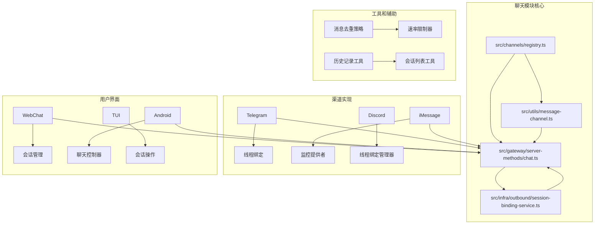

**图表来源**
- [src/channels/registry.ts:1-207](file://src/channels/registry.ts#L1-L207)
- [src/gateway/server-methods/chat.ts:1-800](file://src/gateway/server-methods/chat.ts#L1-L800)

**章节来源**
- [src/channels/registry.ts:1-207](file://src/channels/registry.ts#L1-L207)
- [src/utils/message-channel.ts:1-149](file://src/utils/message-channel.ts#L1-L149)

## 核心组件

### 渠道注册与管理

聊天模块的核心是渠道注册系统，它定义了所有支持的通信渠道及其元数据信息。

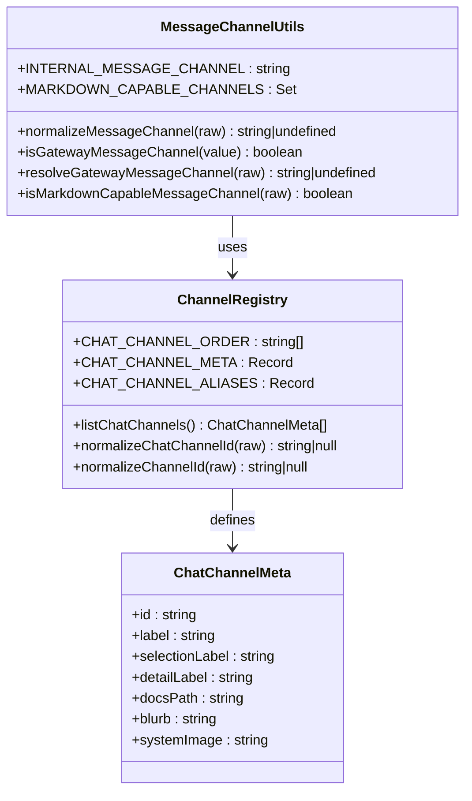

**图表来源**
- [src/channels/registry.ts:27-123](file://src/channels/registry.ts#L27-L123)
- [src/utils/message-channel.ts:20-149](file://src/utils/message-channel.ts#L20-L149)

### 会话绑定服务

会话绑定服务是聊天模块的关键组件，负责将外部对话与内部会话进行关联。

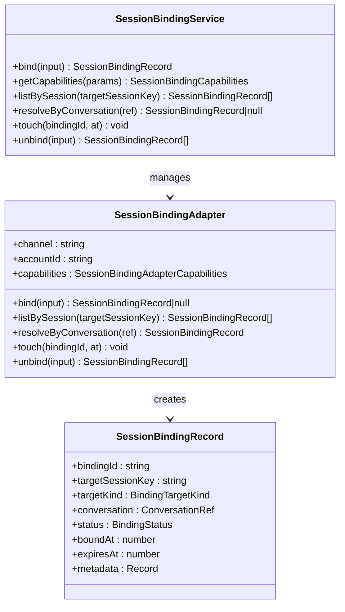

**图表来源**
- [src/infra/outbound/session-binding-service.ts:70-316](file://src/infra/outbound/session-binding-service.ts#L70-L316)

### 消息处理管道

聊天消息通过一个复杂的处理管道，包括去重、速率限制和内容过滤。

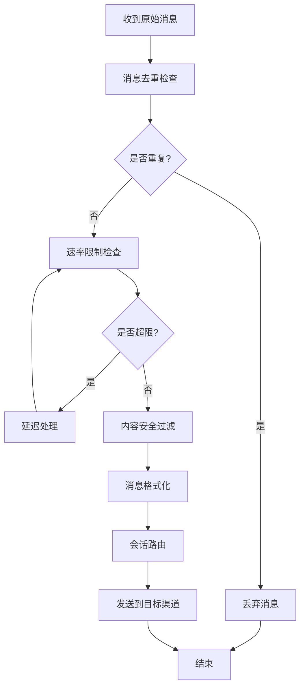

**图表来源**
- [src/channels/inbound-debounce-policy.test.ts:1-39](file://src/channels/inbound-debounce-policy.test.ts#L1-L39)
- [src/imessage/monitor/loop-rate-limiter.ts:1-44](file://src/imessage/monitor/loop-rate-limiter.ts#L1-L44)

**章节来源**
- [src/infra/outbound/session-binding-service.ts:1-326](file://src/infra/outbound/session-binding-service.ts#L1-L326)
- [src/channels/registry.ts:1-207](file://src/channels/registry.ts#L1-L207)

## 架构概览

聊天模块采用分层架构设计，从底层的渠道适配器到上层的应用界面，形成了完整的消息处理生态系统。

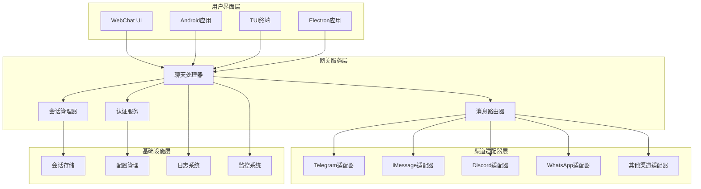

**图表来源**
- [src/gateway/server-methods/chat.ts:814-846](file://src/gateway/server-methods/chat.ts#L814-L846)
- [src/gateway/server.ws-types.ts:1-13](file://src/gateway/server.ws-types.ts#L1-L13)

## 详细组件分析

### 渠道注册系统

渠道注册系统是聊天模块的基础，它定义了所有支持的通信渠道及其属性。

#### 渠道元数据管理

每个渠道都有详细的元数据描述，包括显示名称、文档链接和功能说明。

| 渠道类型 | 显示名称 | 文档路径 | 功能特点 |
|---------|----------|----------|----------|
| telegram | Telegram | /channels/telegram | Bot API支持，群组管理 |
| whatsapp | WhatsApp | /channels/whatsapp | 二维码配对，个人号支持 |
| discord | Discord | /channels/discord | Bot API + WebSocket，服务器支持 |
| irc | IRC | /channels/irc | 经典IRC网络，DM/频道路由 |
| googlechat | Google Chat | /channels/googlechat | HTTP webhook，企业级 |
| slack | Slack | /channels/slack | Socket Mode，工作区应用 |
| signal | Signal | /channels/signal | signal-cli，隐私优先 |
| imessage | iMessage | /channels/imessage | macOS集成，正在完善 |
| line | LINE | /channels/line | Messaging API，机器人支持 |

#### 渠道别名系统

为了提高用户体验，系统支持多种渠道别名：

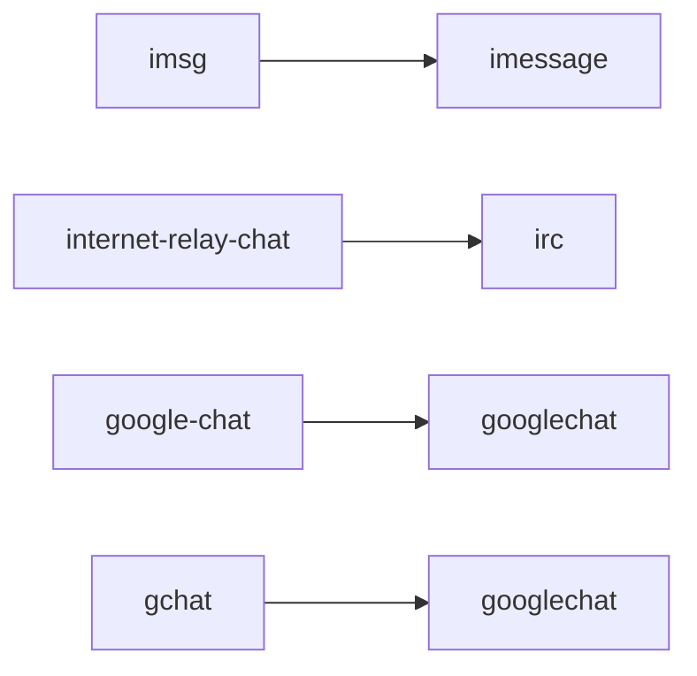

**图表来源**
- [src/channels/registry.ts:125-130](file://src/channels/registry.ts#L125-L130)

**章节来源**
- [src/channels/registry.ts:27-123](file://src/channels/registry.ts#L27-L123)
- [src/channels/registry.ts:149-164](file://src/channels/registry.ts#L149-L164)

### 会话管理系统

会话管理系统负责维护聊天历史、管理会话状态和处理会话绑定。

#### 会话生命周期管理

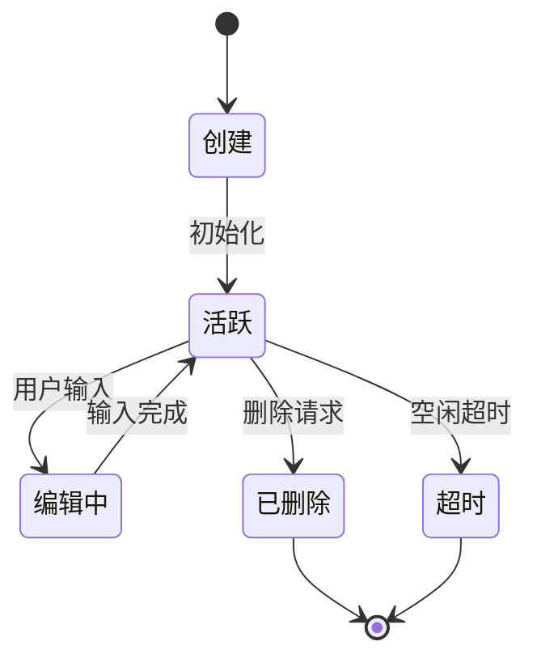

#### 会话绑定机制

会话绑定允许将外部对话与内部会话关联，支持复杂的路由场景：

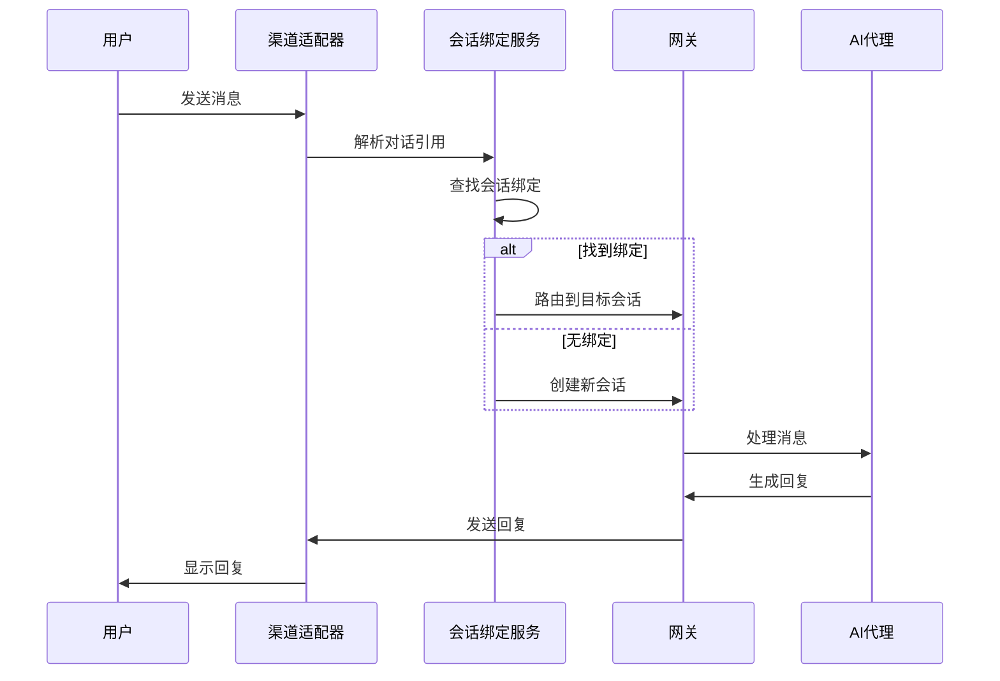

**图表来源**
- [src/infra/outbound/session-binding-service.ts:198-316](file://src/infra/outbound/session-binding-service.ts#L198-L316)

**章节来源**
- [src/infra/outbound/session-binding-service.ts:187-196](file://src/infra/outbound/session-binding-service.ts#L187-L196)
- [src/gateway/session-utils.ts:928-976](file://src/gateway/session-utils.ts#L928-L976)

### 消息处理与路由

消息处理系统实现了复杂的消息路由逻辑，确保消息能够正确地发送到目标渠道。

#### 消息去重策略

系统使用智能去重算法防止重复消息的处理：

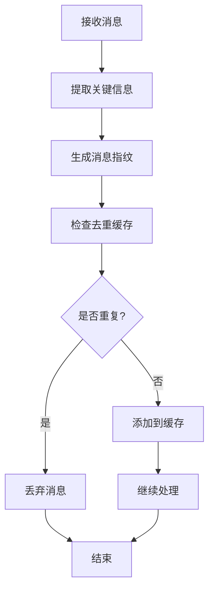

#### 速率限制机制

为防止消息洪泛和系统过载，系统实现了多层速率限制：

| 限制类型 | 时间窗口 | 限制数量 | 触发条件 |
|---------|----------|----------|----------|
| 全局速率 | 60秒 | 100条/分钟 | 系统整体负载 |
| 会话速率 | 60秒 | 50条/分钟 | 单个会话消息 |
| 渠道速率 | 60秒 | 20条/分钟 | 特定渠道 |
| IP速率 | 60秒 | 1000条/分钟 | 来源IP地址 |

**章节来源**
- [src/channels/inbound-debounce-policy.test.ts:1-39](file://src/channels/inbound-debounce-policy.test.ts#L1-L39)
- [src/imessage/monitor/loop-rate-limiter.ts:1-44](file://src/imessage/monitor/loop-rate-limiter.ts#L1-L44)

### 平台特定实现

#### iMessage监控

iMessage监控系统提供了专门的消息处理和去重功能：

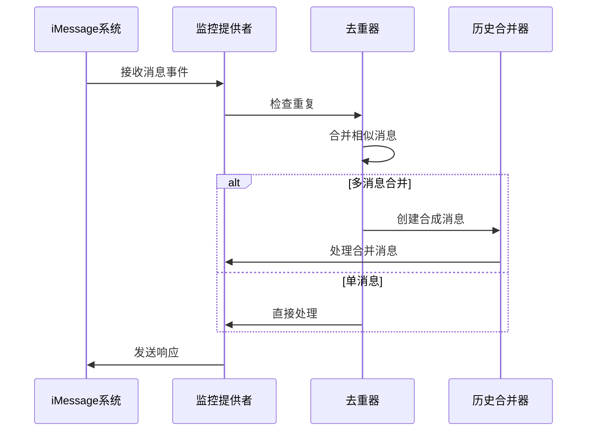

**图表来源**
- [src/imessage/monitor/monitor-provider.ts:157-203](file://src/imessage/monitor/monitor-provider.ts#L157-L203)

#### Telegram线程绑定

Telegram线程绑定系统支持论坛主题的消息路由：

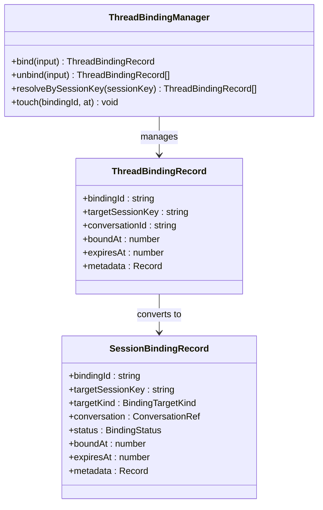

**图表来源**
- [src/telegram/thread-bindings.ts:121-159](file://src/telegram/thread-bindings.ts#L121-L159)

**章节来源**
- [src/telegram/bot-message-context.thread-binding.test.ts:31-41](file://src/telegram/bot-message-context.thread-binding.test.ts#L31-L41)
- [src/telegram/thread-bindings.ts:121-159](file://src/telegram/thread-bindings.ts#L121-L159)

### 用户界面集成

#### WebChat集成

WebChat提供了原生的聊天界面，与网关WebSocket直接通信：

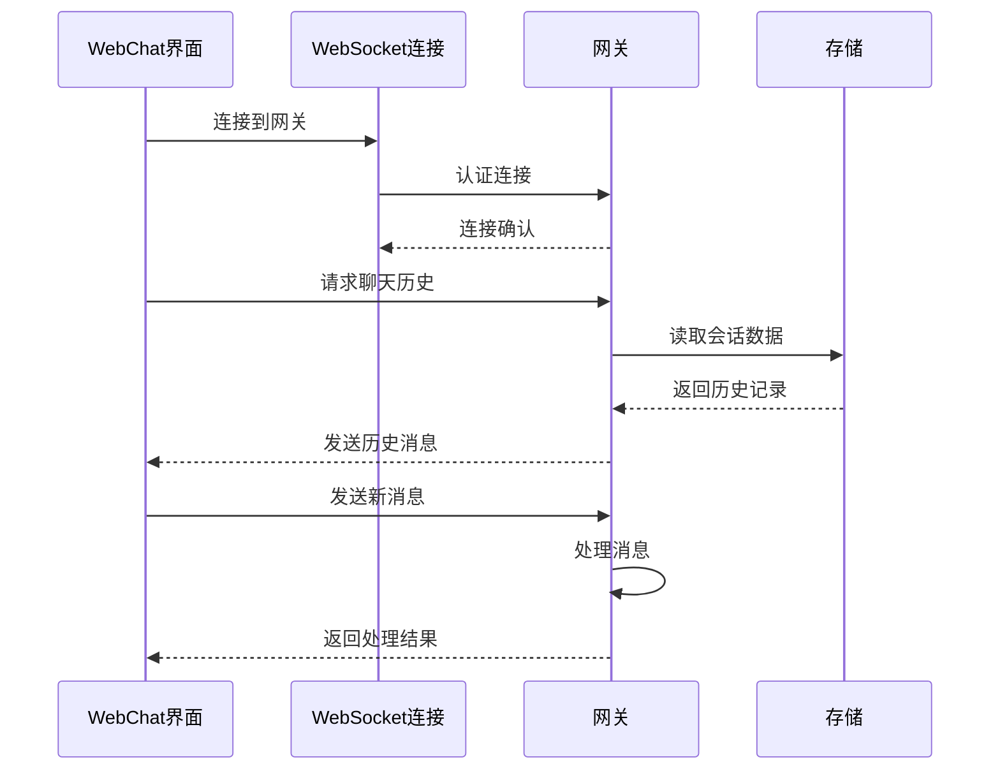

**图表来源**
- [docs/web/webchat.md:24-32](file://docs/web/webchat.md#L24-L32)

#### Android应用集成

Android应用通过RPC调用与网关交互：

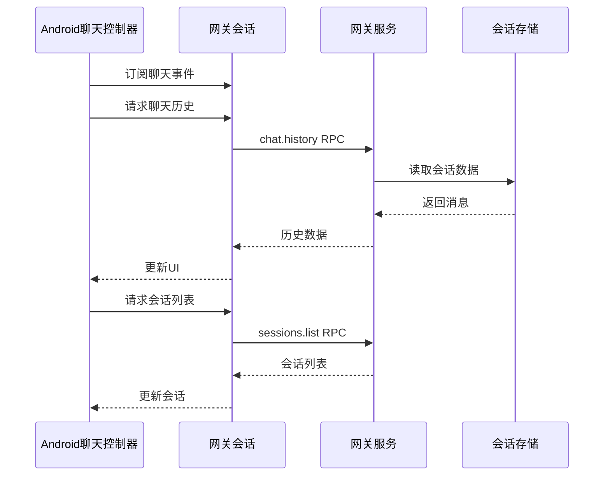

**图表来源**
- [apps/android/app/src/main/java/ai/openclaw/app/chat/ChatController.kt:261-293](file://apps/android/app/src/main/java/ai/openclaw/app/chat/ChatController.kt#L261-L293)

**章节来源**
- [apps/android/app/src/main/java/ai/openclaw/app/chat/ChatController.kt:261-293](file://apps/android/app/src/main/java/ai/openclaw/app/chat/ChatController.kt#L261-L293)
- [docs/web/webchat.md:1-32](file://docs/web/webchat.md#L1-L32)

## 依赖关系分析

聊天模块的依赖关系呈现清晰的层次结构，从基础的渠道适配器到上层的应用界面。

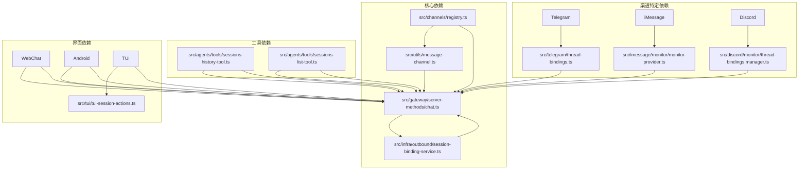

**图表来源**
- [src/gateway/server-methods/chat.ts:1-73](file://src/gateway/server-methods/chat.ts#L1-L73)
- [src/agents/tools/sessions-history-tool.ts:235-270](file://src/agents/tools/sessions-history-tool.ts#L235-L270)

**章节来源**
- [src/gateway/server-methods/chat.ts:1-73](file://src/gateway/server-methods/chat.ts#L1-L73)
- [src/agents/tools/sessions-list-tool.ts:209-258](file://src/agents/tools/sessions-list-tool.ts#L209-L258)

## 性能考虑

### 消息处理优化

聊天模块在设计时充分考虑了性能优化，采用了多种策略来提高系统的响应速度和吞吐量。

#### 内存管理

- **消息缓冲池**：使用循环缓冲区减少内存分配开销
- **对象复用**：重用消息对象避免频繁创建销毁
- **垃圾回收优化**：合理管理大对象生命周期

#### 网络优化

- **批量处理**：聚合多个小消息为批量传输
- **压缩传输**：对历史记录进行压缩以减少带宽占用
- **连接池**：复用网络连接避免建立新连接的开销

#### 存储优化

- **增量更新**：只更新变化的部分而不是整个会话
- **索引优化**：为常用查询字段建立索引
- **缓存策略**：合理使用内存缓存提高访问速度

### 并发处理

系统采用异步非阻塞的并发模型，能够高效处理大量并发连接：

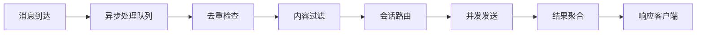

## 故障排除指南

### 常见问题诊断

#### 渠道连接问题

**症状**：消息无法发送到特定渠道
**诊断步骤**：
1. 检查渠道配置参数
2. 验证API密钥有效性
3. 确认网络连接状态
4. 查看渠道特定的日志

**解决方案**：
- 重新配置渠道参数
- 更新API密钥
- 检查防火墙设置
- 联系渠道技术支持

#### 会话绑定失效

**症状**：消息发送到错误的会话或无法找到会话
**诊断步骤**：
1. 检查会话绑定记录
2. 验证对话引用完整性
3. 确认绑定状态
4. 查看绑定适配器日志

**解决方案**：
- 重新建立会话绑定
- 清理过期绑定记录
- 检查绑定适配器状态
- 重启绑定服务

#### 性能问题

**症状**：系统响应缓慢或消息延迟
**诊断步骤**：
1. 监控系统资源使用率
2. 检查消息处理队列长度
3. 分析慢查询日志
4. 评估硬件资源

**解决方案**：
- 增加系统资源
- 优化数据库查询
- 调整并发参数
- 实施缓存策略

### 调试工具

#### 日志分析

系统提供了详细的日志记录功能，便于问题诊断：

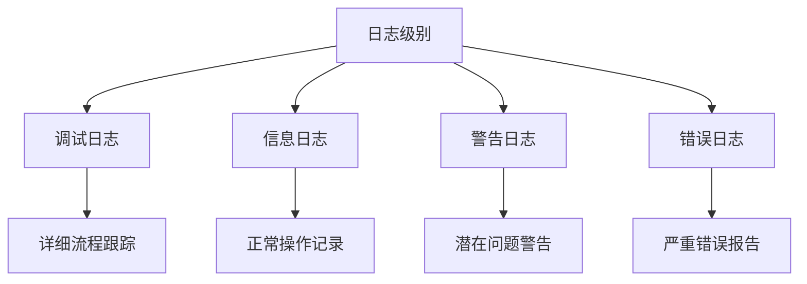

#### 性能监控

- **消息处理时间**：监控从接收到底层发送的总时间
- **队列长度**：跟踪待处理消息数量
- **内存使用**：监控内存分配和垃圾回收
- **网络延迟**：测量与各渠道的通信延迟

**章节来源**
- [src/gateway/server-methods/chat.ts:814-846](file://src/gateway/server-methods/chat.ts#L814-L846)

## 结论

OpenClaw聊天模块是一个设计精良、功能完整的多平台聊天系统。它通过模块化的架构设计、智能的会话管理和高效的性能优化，为用户提供了稳定可靠的聊天体验。

### 主要优势

1. **模块化设计**：清晰的层次结构便于维护和扩展
2. **多渠道支持**：广泛支持主流通信平台
3. **智能路由**：基于会话绑定的智能消息路由
4. **性能优化**：采用多种优化策略确保高吞吐量
5. **跨平台兼容**：支持Web、移动端和桌面应用

### 技术特色

- **会话绑定服务**：提供灵活的会话路由机制
- **智能去重**：防止重复消息的处理和传输
- **速率限制**：保护系统免受消息洪泛攻击
- **内容过滤**：确保消息内容的安全性和合规性

### 未来发展

聊天模块将继续演进，计划增加的功能包括：
- 更多渠道的支持
- 增强的AI集成
- 改进的性能监控
- 更好的用户体验

通过持续的技术创新和优化，OpenClaw聊天模块将成为企业级聊天解决方案的理想选择。